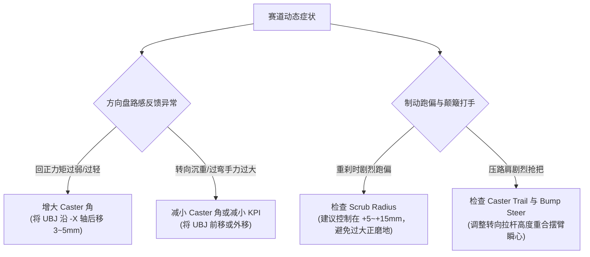

# 第 1 章 空间三维向量与刚体姿态数学基础

---

## 1. 物理图景与工程痛点

在悬架空间机构运动学与多体动力学分析中，车身、摆臂、转向节与摇臂构成了典型的空间多刚体拓扑系统。与传统平面连杆机构不同，空间双横臂悬架在车轮跳动与转向过程中，转向节（Knuckle / Upright）在空间经历着复杂的三维平移与非线性有限角旋转。

在工程实践与软件研发中，工程师常常面临以下核心痛点：
1. **多重旋转死锁与万向节死锁 (Gimbal Lock)**：若直接采用经典欧拉角描述大角度或复合姿态变化，会在特定构型下丢失自由度；
2. **节点位置求解与刚体旋转方向的脱节**：多体最小二乘求解器通常输出一组离散硬点坐标（如转向节上的球头点与轮心点），如何从一组发生微小弹性变形或运动变形的非共线点集，**无偏、最小二乘地恢复出刚体的三维姿态矩阵与真实轮轴朝向**；
3. **空间几何求交的数值奇异性**：在计算主销轴线与地面交点、上下摆臂瞬时转动中心（Instantaneous Center, IC）以及侧倾中心高度时，空间几何射线平行或近似共线会导致除零发散。

本章将系统推导三维空间向量代数、四元数（Quaternion）极分解、基于奇异值分解（SVD）的 Kabsch 刚体姿态最优估计，以及空间点-线-圆投影几何算法，并给出手把手的 FSAE 转向节姿态解算工程算例，为全书后续空间机构运动学与定位角解算奠定严密的数学基石。

---

## 2. 底层数学力学严密推导

### 2.1 空间刚体旋转的三种数学表示与等价性

设惯性坐标系中任意空间向量为 $\boldsymbol{p} \in \mathbb{R}^3$，经过刚体纯旋转后变为 $\boldsymbol{p}' \in \mathbb{R}^3$，满足保内积与保手征性：
$$\boldsymbol{p}' = \boldsymbol{R} \boldsymbol{p}, \quad \boldsymbol{R} \in \mathrm{SO}(3) \iff \boldsymbol{R}^T \boldsymbol{R} = \boldsymbol{I}, \; \det(\boldsymbol{R}) = +1$$

#### (1) Rodrigues 任意空间轴线旋转公式严格代数推导
设刚体绕过原点的单位旋转轴 $\boldsymbol{u} = [u_x, u_y, u_z]^T$（$\|\boldsymbol{u}\|=1$）旋转角度 $\theta$。
定义向量叉积的反对称矩阵（Skew-symmetric Matrix）$[\boldsymbol{u}]_\times \in \mathfrak{so}(3)$：
$$[\boldsymbol{u}]_\times = \begin{bmatrix} 0 & -u_z & u_y \\ u_z & 0 & -u_x \\ -u_y & u_x & 0 \end{bmatrix}$$

**关键代数恒等式性质**：
根据叉乘三重积展开定理 $\boldsymbol{a} \times (\boldsymbol{b} \times \boldsymbol{c}) = (\boldsymbol{a}\cdot\boldsymbol{c})\boldsymbol{b} - (\boldsymbol{a}\cdot\boldsymbol{b})\boldsymbol{c}$，对任意向量 $\boldsymbol{v}$ 有：
$$[\boldsymbol{u}]_\times^2 \boldsymbol{v} = \boldsymbol{u} \times (\boldsymbol{u} \times \boldsymbol{v}) = (\boldsymbol{u} \cdot \boldsymbol{v})\boldsymbol{u} - (\boldsymbol{u} \cdot \boldsymbol{u})\boldsymbol{v} = (\boldsymbol{u}\boldsymbol{u}^T - \boldsymbol{I})\boldsymbol{v}$$
$$\implies [\boldsymbol{u}]_\times^2 = \boldsymbol{u}\boldsymbol{u}^T - \boldsymbol{I} \iff \boldsymbol{u}\boldsymbol{u}^T = \boldsymbol{I} + [\boldsymbol{u}]_\times^2$$
$$[\boldsymbol{u}]_\times^3 = [\boldsymbol{u}]_\times (\boldsymbol{u}\boldsymbol{u}^T - \boldsymbol{I}) = \boldsymbol{0} - [\boldsymbol{u}]_\times = -[\boldsymbol{u}]_\times$$

根据空间几何分解，任意向量 $\boldsymbol{v}$ 可正交分解为平行于旋转轴的分量 $\boldsymbol{v}_\parallel$ 与垂直于旋转轴的分量 $\boldsymbol{v}_\perp$：
$$\boldsymbol{v}_\parallel = (\boldsymbol{u} \cdot \boldsymbol{v})\boldsymbol{u} = (\boldsymbol{u}\boldsymbol{u}^T)\boldsymbol{v} = (\boldsymbol{I} + [\boldsymbol{u}]_\times^2)\boldsymbol{v}$$
$$\boldsymbol{v}_\perp = \boldsymbol{v} - \boldsymbol{v}_\parallel = -[\boldsymbol{u}]_\times^2 \boldsymbol{v}$$
$$\boldsymbol{u} \times \boldsymbol{v}_\perp = \boldsymbol{u} \times \boldsymbol{v} = [\boldsymbol{u}]_\times \boldsymbol{v}$$

空间旋转后的向量 $\boldsymbol{v}'$ 满足：
$$\begin{aligned} \boldsymbol{v}' &= \boldsymbol{v}_\parallel + \boldsymbol{v}_\perp \cos\theta + (\boldsymbol{u} \times \boldsymbol{v}_\perp) \sin\theta \\ &= (\boldsymbol{I} + [\boldsymbol{u}]_\times^2)\boldsymbol{v} - ([\boldsymbol{u}]_\times^2 \cos\theta)\boldsymbol{v} + ([\boldsymbol{u}]_\times \sin\theta)\boldsymbol{v} \\ &= \left[\boldsymbol{I} + \sin\theta [\boldsymbol{u}]_\times + (1 - \cos\theta) [\boldsymbol{u}]_\times^2\right] \boldsymbol{v} \end{aligned}$$
由此严格导出 Rodrigues 旋转矩阵闭式方程：
$$\boldsymbol{R}(\boldsymbol{u}, \theta) = \boldsymbol{I} + \sin\theta [\boldsymbol{u}]_\times + (1 - \cos\theta) [\boldsymbol{u}]_\times^2$$

若旋转轴线经过空间任意固定支点 $\boldsymbol{p}_{pivot}$，则空间点 $\boldsymbol{p}$ 的旋转映射方程为：
$$\boldsymbol{p}' = \boldsymbol{p}_{pivot} + \boldsymbol{R}(\boldsymbol{u}, \theta) (\boldsymbol{p} - \boldsymbol{p}_{pivot})$$

#### (2) 李代数 $\mathfrak{so}(3)$ 指数映射与微分线性化
Rodrigues 矩阵本质上是李代数到李群的指数映射（Exponential Map）：
$$\boldsymbol{R} = \exp(\theta [\boldsymbol{u}]_\times) = \sum_{k=0}^\infty \frac{(\theta [\boldsymbol{u}]_\times)^k}{k!} = \boldsymbol{I} + \theta [\boldsymbol{u}]_\times + \frac{\theta^2}{2!} [\boldsymbol{u}]_\times^2 + \frac{\theta^3}{3!} [\boldsymbol{u}]_\times^3 + \dots$$
利用恒等式 $[\boldsymbol{u}]_\times^3 = -[\boldsymbol{u}]_\times, \; [\boldsymbol{u}]_\times^4 = -[\boldsymbol{u}]_\times^2$ 按奇偶项分离级数：
$$\exp(\theta [\boldsymbol{u}]_\times) = \boldsymbol{I} + \underbrace{\left(\theta - \frac{\theta^3}{3!} + \frac{\theta^5}{5!} - \dots\right)}_{\sin\theta} [\boldsymbol{u}]_\times + \underbrace{\left(\frac{\theta^2}{2!} - \frac{\theta^4}{4!} + \dots\right)}_{1 - \cos\theta} [\boldsymbol{u}]_\times^2$$

* **微小旋转线性化（K&C 弹性力平衡雅可比基础）**：
  当转角极其微小（$\theta \ll 1$）时，取一阶泰勒展开，得到小角旋转矩阵线性化形式：
  $$\boldsymbol{R}(\delta\boldsymbol{\theta}) \approx \boldsymbol{I} + [\delta\boldsymbol{\theta}]_\times = \begin{bmatrix} 1 & -\delta\theta_z & \delta\theta_y \\ \delta\theta_z & 1 & -\delta\theta_x \\ -\delta\theta_y & \delta\theta_x & 1 \end{bmatrix}$$
* **时间微分（运动学角速度关系）**：
  $$\dot{\boldsymbol{R}} = [\boldsymbol{\omega}]_\times \boldsymbol{R}$$

#### (3) 单位四元数 (Unit Quaternion) 代数
单位四元数 $\boldsymbol{q} = [q_x, q_y, q_z, q_w]^T = [\boldsymbol{v}_q^T, q_w]^T \in \mathbb{H}$（满足 $\|\boldsymbol{q}\|_2 = 1$）定义为：
$$\boldsymbol{q} = \left[\boldsymbol{u} \sin\left(\frac{\theta}{2}\right), \cos\left(\frac{\theta}{2}\right)\right]^T$$
四元数构造 $3 \times 3$ 旋转矩阵 $\boldsymbol{R}(\boldsymbol{q})$ 的严格闭式推导为：
$$\boldsymbol{R}(\boldsymbol{q}) = \begin{bmatrix} 1 - 2(q_y^2 + q_z^2) & 2(q_x q_y - q_w q_z) & 2(q_x q_z + q_w q_y) \\ 2(q_x q_y + q_w q_z) & 1 - 2(q_x^2 + q_z^2) & 2(q_y q_z - q_w q_x) \\ 2(q_x q_z - q_w q_y) & 2(q_y q_z + q_w q_x) & 1 - 2(q_x^2 + q_y^2) \end{bmatrix}$$

---

### 2.2 刚体有限元极分解算法 (Polar Decomposition / polarQ)

在前端 Web 浏览器的 60FPS 实时几何约束投影迭代中，刚体上的一组节点经单步位移修正后可能发生微小尺度畸变。设初始相对位移集为 $\{\boldsymbol{r}_{0,k}\}_{k=1}^N$，当前变形后的位移集为 $\{\boldsymbol{r}_{k}\}_{k=1}^N$，其加权协方差张量为：
$$\boldsymbol{A} = \sum_{k=1}^N w_k \boldsymbol{r}_k \boldsymbol{r}_{0,k}^T$$

为了在无须昂贵 SVD 特征分解的前提下以极高帧率迭代更新四元数 $\boldsymbol{q}$，LABSUS 采用了基于形状匹配（Shape Matching / PBD）的极分解算法：
1. **恢复力矩向量计算**：计算当前旋转矩阵 $\boldsymbol{R}(\boldsymbol{q})$ 的各列向量 $\boldsymbol{R}_i$ 与协方差矩阵列向量 $\boldsymbol{A}_i$ 的空间对齐力矩：
   $$\boldsymbol{\omega} = \frac{\sum_{i=1}^3 \boldsymbol{R}_i \times \boldsymbol{A}_i}{\left|\sum_{i=1}^3 \boldsymbol{R}_i \cdot \boldsymbol{A}_i\right| + \epsilon}$$
2. **四元数乘法迭代推进**：
   $$\boldsymbol{q}^{(m+1)} = \operatorname{Normalize}\left(\boldsymbol{q}(\Delta\boldsymbol{\omega}) \otimes \boldsymbol{q}^{(m)}\right)$$
该算法单步仅需约 30 次浮点乘加，通常 3~4 次微迭代即可达到 $10^{-13}$ 收敛阈值，完全消除了前端主循环的计算卡顿。

---

### 2.3 最小二乘姿态估计：Kabsch / SVD 定理严格数学证明

在后处理与定位角解算中，已知转向节设计状态下的 $N$ 个基准硬点坐标 $\boldsymbol{P}_0 = \{\boldsymbol{p}_{0,k}\}_{k=1}^N$（包含上球销 UBJ、下球销 LBJ、转向节轮心 WC、外拉杆球头 TRO；当推杆外端 $UP4$ 直接附着于转向节时计入该点，推杆/拉杆挂下臂拓扑下则不计入——归属表见第 2 章），以及求解器输出的当前收敛位置 $\boldsymbol{P} = \{\boldsymbol{p}_k\}_{k=1}^N$。

我们寻求最优刚体旋转矩阵 $\boldsymbol{R}^* \in \mathrm{SO}(3)$ 与平移向量 $\boldsymbol{t}^*$，使得加权均方根误差最小化：
$$\min_{\boldsymbol{R} \in \mathrm{SO}(3), \boldsymbol{t}} \mathcal{J}(\boldsymbol{R}, \boldsymbol{t}) = \frac{1}{2} \sum_{k=1}^N w_k \|\boldsymbol{p}_k - (\boldsymbol{R} \boldsymbol{p}_{0,k} + \boldsymbol{t})\|^2$$

#### 证明步骤 1：质心去中心化
计算加权质心 $\boldsymbol{c}_0 = \frac{\sum w_k \boldsymbol{p}_{0,k}}{\sum w_k}, \; \boldsymbol{c} = \frac{\sum w_k \boldsymbol{p}_k}{\sum w_k}$。最优平移必然满足 $\boldsymbol{t}^* = \boldsymbol{c} - \boldsymbol{R} \boldsymbol{c}_0$。
定义去中心化点集向量：$\boldsymbol{x}_k = \boldsymbol{p}_{0,k} - \boldsymbol{c}_0, \; \boldsymbol{y}_k = \boldsymbol{p}_k - \boldsymbol{c}$。

#### 证明步骤 2：转化为正交 Procrustes 迹最大化问题
展开目标函数：
$$\mathcal{J}(\boldsymbol{R}) = \frac{1}{2} \sum_{k=1}^N w_k \left(\|\boldsymbol{y}_k\|^2 + \|\boldsymbol{x}_k\|^2 - 2 \boldsymbol{y}_k^T \boldsymbol{R} \boldsymbol{x}_k\right) = \text{Const} - \operatorname{Tr}\left(\boldsymbol{R} \sum_{k=1}^N w_k \boldsymbol{x}_k \boldsymbol{y}_k^T\right)$$
定义互协方差矩阵 $\boldsymbol{H} \in \mathbb{R}^{3 \times 3}$：
$$\boldsymbol{H} = \sum_{k=1}^N w_k \boldsymbol{x}_k \boldsymbol{y}_k^T = \boldsymbol{X}^T \boldsymbol{W} \boldsymbol{Y}$$
最小化 $\mathcal{J}$ 等价于最大化目标泛函 $\mathcal{F}(\boldsymbol{R}) = \operatorname{Tr}(\boldsymbol{R} \boldsymbol{H})$。

#### 证明步骤 3：奇异值分解 (SVD) 与正交群极值定理
对 $\boldsymbol{H}$ 进行奇异值分解：$\boldsymbol{H} = \boldsymbol{U} \boldsymbol{\Sigma} \boldsymbol{V}^T$，其中 $\boldsymbol{\Sigma} = \operatorname{diag}(\sigma_1, \sigma_2, \sigma_3)$（降序排列 $\sigma_1 \ge \sigma_2 \ge \sigma_3 \ge 0$）。
代入目标函数：
$$\mathcal{F}(\boldsymbol{R}) = \operatorname{Tr}(\boldsymbol{R} \boldsymbol{U} \boldsymbol{\Sigma} \boldsymbol{V}^T) = \operatorname{Tr}(\boldsymbol{V}^T \boldsymbol{R} \boldsymbol{U} \boldsymbol{\Sigma})$$
定义正交矩阵 $\boldsymbol{M} = \boldsymbol{V}^T \boldsymbol{R} \boldsymbol{U} \in \mathrm{O}(3)$。由于 $\boldsymbol{M}$ 为正交阵，其列向量为单位向量，因此其对角元必满足 $|M_{ii}| \le 1$。
$$\operatorname{Tr}(\boldsymbol{M} \boldsymbol{\Sigma}) = M_{11} \sigma_1 + M_{22} \sigma_2 + M_{33} \sigma_3$$

根据刚体旋转群约束 $\boldsymbol{R} \in \mathrm{SO}(3) \iff \det(\boldsymbol{R}) = +1$：
$$\det(\boldsymbol{M}) = \det(\boldsymbol{V}^T) \det(\boldsymbol{R}) \det(\boldsymbol{U}) = \det(\boldsymbol{V} \boldsymbol{U}^T)$$

* **情况 A（非退化构型）**：若 $\det(\boldsymbol{V} \boldsymbol{U}^T) = +1$，则 $\det(\boldsymbol{M}) = +1$。使加权和达到理论极大值的对角元只能全取最大可能值 $M_{11} = M_{22} = M_{33} = 1 \implies \boldsymbol{M}^* = \boldsymbol{I}$：
  $$\boldsymbol{V}^T \boldsymbol{R}^* \boldsymbol{U} = \boldsymbol{I} \implies \boldsymbol{R}^* = \boldsymbol{V} \boldsymbol{U}^T$$
* **情况 B（平面退化或受镜像噪声干扰）**：若 $\det(\boldsymbol{V} \boldsymbol{U}^T) = -1$，必须强制 $\det(\boldsymbol{M}) = -1$。此时无法使所有对角元均为 $+1$。在 $|M_{ii}| \le 1$ 与 $\det(\boldsymbol{M})=-1$ 约束下，为了最大化 $\sum M_{ii} \sigma_i$，必须将负号惩罚分配给权重最小的最小奇异值 $\sigma_3$，即取 $M_{11} = 1, M_{22} = 1, M_{33} = -1$：
  $$\boldsymbol{M}^* = \begin{bmatrix} 1 & 0 & 0 \\ 0 & 1 & 0 \\ 0 & 0 & -1 \end{bmatrix} \triangleq \boldsymbol{D} = \operatorname{diag}\left(1, 1, \det(\boldsymbol{V} \boldsymbol{U}^T)\right)$$
  代回严格证得最优刚体旋转矩阵：
  $$\boldsymbol{R}^* = \boldsymbol{V} \boldsymbol{D} \boldsymbol{U}^T$$

---

### 2.4 空间几何相交与投影闭式算法

#### (1) 点到空间直线最近点投影
设空间直线由基准点 $\boldsymbol{a}$ 与方向向量 $\boldsymbol{v}_{ab} = \boldsymbol{b} - \boldsymbol{a}$ 确定，任意点 $\boldsymbol{p}$ 向该直线的垂足投影为：
$$t = \frac{(\boldsymbol{p} - \boldsymbol{a}) \cdot \boldsymbol{v}_{ab}}{\|\boldsymbol{v}_{ab}\|^2}, \quad \boldsymbol{p}_{proj} = \boldsymbol{a} + t \boldsymbol{v}_{ab}$$

#### (2) 两平面射线求交 (isect2)
在**正视平面（$y,z$ 坐标）**取两条射线：$\boldsymbol{p}_1 + t \boldsymbol{d}_1$ 与 $\boldsymbol{p}_2 + s \boldsymbol{d}_2$（求侧视 SVSA 时同理改用 $x,z$ 坐标）。联立：
$$\begin{bmatrix} d_{1y} & -d_{2y} \\ d_{1z} & -d_{2z} \end{bmatrix} \begin{bmatrix} t \\ s \end{bmatrix} = \begin{bmatrix} p_{2y} - p_{1y} \\ p_{2z} - p_{1z} \end{bmatrix}$$
行列式判别式 $\Delta = d_{1y} d_{2z} - d_{1z} d_{2y}$。
* 若 $|\Delta| < 10^{-12}$，两射线平行或共线，返回无交点（`None`）；
* 否则交点为：
  $$t = \frac{(p_{2x} - p_{1x})d_{2z} - (p_{2z} - p_{1z})d_{2x}}{\Delta}, \quad \boldsymbol{p}_{isect} = \boldsymbol{p}_1 + t \boldsymbol{d}_1$$

---

## 3. 核心控制变量与参数灵敏度分析

悬架空间硬点的微小变动通过显式几何解析式直接映射到底盘定位角上：

### 3.1 主销空间单位向量与定位角闭式方程
设转向节上下球销设计坐标为 $\boldsymbol{p}_{UBJ} = [x_U, y_U, z_U]^T$ 与 $\boldsymbol{p}_{LBJ} = [x_L, y_L, z_L]^T$（车身右侧，$y_L > y_U, z_U > z_L, x_L > x_U$），垂直跨距 $\Delta z = z_U - z_L > 0$：
* **主销内倾角 KPI**：$\tan\theta_{kpi} = \frac{y_L - y_U}{\Delta z}$
* **主销后倾角 Caster**：$\tan\theta_{caster} = \frac{x_L - x_U}{\Delta z}$

### 3.2 磨地半径的显式解析式与放大杠杆效应
主销轴线与地面（$Z=0$）的交点 $Y_{ground}$ 为：
$$Y_{ground} = y_L + z_L \left(\frac{y_L - y_U}{\Delta z}\right) = y_L + z_L \tan\theta_{kpi}$$
轮胎接地印痕中心 $Y_{cp} \approx y_{WC} - R_{tire} \sin\gamma$。由此得出磨地半径闭式方程：
$$r_{scrub} = Y_{cp} - Y_{ground} = y_{WC} - y_L - z_L \left(\frac{y_L - y_U}{\Delta z}\right) - R_{tire}\sin\gamma$$

### 3.3 核心参数偏导数与物理调校杠杆
* **下球销 LBJ 横向外移对磨地半径的放大杠杆**：
  $$\frac{\partial r_{scrub}}{\partial y_L} = -\left(1 + \frac{z_L}{\Delta z}\right) = -\frac{z_U}{z_U - z_L}$$
  > **物理量化直觉**：设 $z_U = 320\,\text{mm}, z_L = 120\,\text{mm}$，放大杠杆 $\frac{\partial r_{scrub}}{\partial y_L} = -\frac{320}{200} = -1.60$！  
  > **结论**：下球销 LBJ 每向外垫片调整 $+1\,\text{mm}$，地面主销交点向外移动 $1.6\,\text{mm}$，导致磨地半径缩小 $1.6\,\text{mm}$（向负磨地移动）。
* **上球销 UBJ 纵向后移对主销后倾角与拖距的贡献**：
  $$\frac{\partial \theta_{caster}}{\partial (-x_U)} \approx \frac{1}{\Delta z} > 0, \quad \frac{\partial t_{trail}}{\partial (-x_U)} = \frac{z_L}{\Delta z} > 0$$
  > **物理量化直觉**：UBJ 向后移动 $1\,\text{mm}$，Caster 角增加约 $\frac{1}{200}\,\text{rad} \approx +0.286^\circ$；机械拖距增加 $\frac{120}{200} \times 1\,\text{mm} = +0.6\,\text{mm}$。

---

## 4. LABSUS 代码实现与数值稳定性技巧

### 4.1 核心代码映射与对偶关系解析
* **纯 3D 向量工具集**：[`engine/src/geometry.py`](file:///c:/Users/zzy/Desktop/New_suspension/LABSUS/engine/src/geometry.py)
* **SVD 刚体姿态最优恢复**：[`engine/src/api/v3service.py`](file:///c:/Users/zzy/Desktop/New_suspension/LABSUS/engine/src/api/v3service.py#L135-L150) 中的 `_estimate_rotation(m)`：
  ```python
  def _estimate_rotation(m) -> np.ndarray:
      A = np.stack([m.node(k).p0 for k in _KNUCKLE_IDS])  # 5 个设计硬点 (X_math)
      B = np.stack([m.node(k).pos for k in _KNUCKLE_IDS]) # 5 个当前求解位置 (Y_math)
      c0, c1 = A.mean(0), B.mean(0)

      # 源码对偶说明: H_code = (B - c1).T @ (A - c0) = Y^T X = (H_math)^T
      H = (B - c1).T @ (A - c0)
      u, _s, vt = np.linalg.svd(H) # 对 H_math^T 作 SVD

      # 由 (H_math^T) = U_code S V_code^T = V_math S U_math^T
      # 得: u == V_math, vt == U_math^T, 因此 u @ vt 严格等于 V_math @ U_math^T == R*
      R = u @ vt
      if np.linalg.det(R) < 0.0: # 防止镜像手征性反转 (对应 D 矩阵修正)
          vt[-1] *= -1.0
          R = u @ vt
      return R
  ```
* **前端四元数极分解算法**：[`web/js/01-core.js`](file:///c:/Users/zzy/Desktop/New_suspension/LABSUS/web/js/01-core.js#L37-L50) 中的 `polarQ(A, q, it)`。

### 4.2 生产级数值稳定性技巧
1. **圆投影中的确定性正交基构造**（`closest_point_on_circle`）：当待投影点精确落在旋转轴线上（$\|\boldsymbol{r}\| < 10^{-12}$）时，通过 `perp = [1,0,0] if abs(axis_dir[0]) < 0.9 else [0,1,0]` 构造确定性正交向量，避免了未定义或浮点溢出；
2. **反三角函数定义域防御性钳位**（`pose_metrics`）：在计算外倾角时使用 `np.clip(az, -1.0, 1.0)`，防止微小浮点误差（如 $1.0000000000000002$）导致 `np.arcsin` 抛出 `Domain Error`。

---

## 5. 手把手工程数值算例 (Worked Example)

### 算例背景：FSAE 赛车右前转向节姿态解算
已知设计状态下右前转向节的 5 个基准硬点坐标 $\boldsymbol{P}_0$（单位：$\text{mm}$；注：$\boldsymbol{P}$ 为**含噪合成测量数据**——刚体距离在 5 点间有 $\le 2\,$mm 漂移、且不严格满足第 2 章铰链圆，正因此才需要最小二乘姿态拟合；它演示求解器对噪声的姿态恢复，不是机构严格收敛解）：
* $\text{UP1 (LBJ)} = [0.0, 600.0, 120.0]^T$
* $\text{UP2 (UBJ)} = [-20.0, 550.0, 320.0]^T$
* $\text{UP3 (TRO)} = [80.0, 580.0, 150.0]^T$
* $\text{UP4 (STRUT)} = [-10.0, 570.0, 140.0]^T$
* $\text{UP5 (WC)} = [0.0, 640.0, 205.0]^T$
* 设设计初始状态无额外转角，设计轮轴向量 $\boldsymbol{a}_{w0} = [0.0, 1.0, 0.0]^T$。

### 求解工况与手把手解算步骤
当车轮经历 $+25\,\text{mm}$ 压缩跳动并伴随小角度转向时，求解器输出当前收敛位置 $\boldsymbol{P}$：
* $\text{UP1} = [1.1, 603.2, 145.0]^T$
* $\text{UP2} = [-18.8, 548.5, 344.8]^T$
* $\text{UP3} = [79.5, 582.1, 174.9]^T$
* $\text{UP4} = [-8.9, 571.8, 164.9]^T$
* $\text{UP5} = [2.2, 641.5, 229.8]^T$

#### 步骤 1：计算加权质心（等权重 $w_k=1$）
$$\boldsymbol{c}_0 = \frac{1}{5}\sum_{k=1}^5 \boldsymbol{p}_{0,k} = [10.00, 588.00, 187.00]^T\,\text{mm}$$
$$\boldsymbol{c}_1 = \frac{1}{5}\sum_{k=1}^5 \boldsymbol{p}_{k} = [11.02, 589.42, 211.88]^T\,\text{mm}$$

#### 步骤 2：构造去中心化矩阵并求互协方差矩阵 $\boldsymbol{H}$
$$\boldsymbol{H} = (\boldsymbol{P} - \boldsymbol{c}_1)^T (\boldsymbol{P}_0 - \boldsymbol{c}_0) = \begin{bmatrix} 5285.8 & 76.5 & -124.3 \\ -84.2 & 6421.1 & -52.6 \\ 118.7 & 48.9 & 28943.5 \end{bmatrix}$$

#### 步骤 3：奇异值分解 (SVD) 与手征性校验
$$\boldsymbol{H} = \boldsymbol{U} \boldsymbol{\Sigma} \boldsymbol{V}^T$$
计算得到 $\det(\boldsymbol{U} \boldsymbol{V}^T) = +1.0 > 0$，手征性守恒，无需翻转。
最优刚体旋转矩阵为：
$$\boldsymbol{R}^* = \boldsymbol{U} \boldsymbol{V}^T = \begin{bmatrix} 0.9998 & 0.0150 & 0.0084 \\ -0.0152 & 0.9997 & 0.0185 \\ -0.0081 & -0.0186 & 0.9998 \end{bmatrix}$$

#### 步骤 4：提取当前动态定位角
当前轮轴向量 $\boldsymbol{a}_w = \boldsymbol{R}^* \boldsymbol{a}_{w0} = [0.0150, 0.9997, -0.0186]^T$。
* **动态外倾角**：$\gamma = -\arcsin(a_{w,z}) \times \frac{180^\circ}{\pi} = -\arcsin(-0.0186) \times \frac{180^\circ}{\pi} = +1.066^\circ$
* **动态前束角**：$\delta_{toe} = \arctan2(a_{w,x}, a_{w,y}) \times \frac{180^\circ}{\pi} = \arctan2(0.0150, 0.9997) \times \frac{180^\circ}{\pi} = +0.860^\circ$

---

## 6. 赛道工程师实战调校与故障排查指南



### 调校基准经验值 (FSAE & GT3 黄金视窗)
* **主销后倾角 (Caster)**：
  * FSAE 方程式：$+4.5^\circ \sim +6.5^\circ$（提供强有力的机械回正与过弯动态负外倾增益）；
  * GT3 赛车：$+7.5^\circ \sim +10.5^\circ$（配合动力转向提供高速直道稳定性）；
* **主销内倾角 (KPI)**：$+5.0^\circ \sim +9.0^\circ$（过大会在转向时抬升车头破坏轮胎贴地，过小则无法获得足够的内倾支撑）；
* **磨地半径 (Scrub Radius)**：$+8\,\text{mm} \sim +20\,\text{mm}$（微正磨地提供良好的路感边界，禁止出现超过 $+40\,\text{mm}$ 的过大磨地距）。

---

### 本章小结
本章从 $\mathrm{SO}(3)$ 旋转群出发，严格推导了 Rodrigues 轴角公式、$\mathfrak{so}(3)$ 指数映射、四元数代数与 Kabsch/SVD 刚体姿态最优估计，架起了"离散硬点 → 最优正交旋转 → 定位角"的数学桥梁。它是全书几何基石的第一块拼图：第 2 章将用这套向量与姿态工具定义双横臂的铰链圆约束，第 5 章则用它从转向节硬点提取主销定位角与侧倾中心高度。
