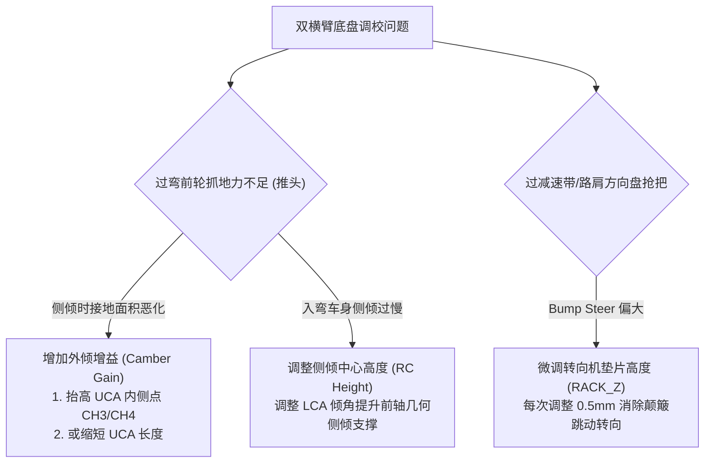

# 第 2 章 双横臂悬架空间拓扑与运动学约束方程

---

## 1. 物理图景与工程痛点

双横臂（Double Wishbone, DWB）悬架，因其卓越的运动学解耦能力与高度可调的空间几何参数，成为 Formula 1、FIA GT3、Formula SAE 以及高性能民用超跑的绝对标配。空间双横臂悬架由车身端 4 个铰接点、转向节端 2 个主销球销（上球销 UBJ 与下球销 LBJ）、1 根横向转向拉杆（Tie-rod）及推拉杆组件构成。

在运动学建模与机构求解中，工程师面临如下关键力学与数学难题：
1. **空间连杆机构的“过约束（Overconstrained）”本质**：若机械套用刚体静力学“$3N - \Sigma \text{约束}$”的 Grübler 空间自由度判据，会得出负数或误导性自由度。双横臂本质上是通过摆臂平面铰链强行约束了球销沿特定空间圆弧轨迹运动的过约束系统；
2. **轮跳行程与齿条转向的强非线性耦合**：当车轮经历垂向跳动（Bump/Rebound）时，转向节不仅上下移动，还会绕瞬时主销轴线发生寄生偏转（即跳动转向 Bump Steer）；
3. **空间刚度与运动学几何解耦**：如何用最精炼的刚性杆系（Rigid Links）与轴向约束（Hinge Clusters）严格定义机构运动边界，使得求解器在毫秒级内收敛出精确的定位曲面。

---

## 2. 底层数学力学严密推导

```
            CH3 (UCA_F) --------- CH4 (UCA_R)   [上控制臂车身轴线]
                 \                 /
                  \               /
                   \             /
                    \           /
                     UP2 (UBJ)                  [上球销]
                         |
                         |  [转向节刚体 Knuckle]
                         |   UP5 (WC)           [轮心点]
                         |  /
                     UP1 (LBJ)                  [下球销]
                    /           \
                   /             \
                  /               \
                 /                 \
            CH1 (LCA_F) --------- CH2 (LCA_R)   [下控制臂车身轴线]
```

### 2.1 空间双横臂机构拓扑图论与自由度分析

定义机构节点集 $\mathcal{V}$ 与约束集 $\mathcal{E}$：
* **车身固定节点集 (Fixed Nodes, $\mathcal{V}_{fix}$)**：
  $$\mathcal{V}_{fix} = \{\boldsymbol{p}_{CH1}, \boldsymbol{p}_{CH2}, \boldsymbol{p}_{CH3}, \boldsymbol{p}_{CH4}, \boldsymbol{p}_{FL1}^0\}$$
  分别对应前端命名中的 `LCA_F`（下前）、`LCA_R`（下后）、`UCA_F`（上前）、`UCA_R`（上后）及齿条内铰点 `RACK`。
* **从动自由节点集 (Free Nodes, $\mathcal{V}_{free}$)**：
  $$\mathcal{V}_{free} = \{\boldsymbol{p}_{UP1}, \boldsymbol{p}_{UP2}, \boldsymbol{p}_{UP3}, \boldsymbol{p}_{UP4}, \boldsymbol{p}_{UP5}, \boldsymbol{p}_{FL1}\}$$
  分别对应 `LBJ`（下球销）、`UBJ`（上球销）、`TRO`（外拉杆球头）、`STRUT_OUT`（推杆外端）、`WC`（轮心）及当前齿条位移点。

#### Grübler-Kutzbach 空间机构自由度判据剖析
对于三维空间机构，经典 Grübler-Kutzbach 空间自由度计算公式为：
$$\mathrm{DOF} = 6 (n - 1) - \sum_{i=1}^j (6 - f_i)$$
其中 $n$ 为构件总数（含机架），$j$ 为运动副总数，$f_i$ 为第 $i$ 个运动副的允许自由度数。
在双横臂机构中：
* 车身、上下摆臂、转向节、转向拉杆共 $n = 5$ 个构件；
* 车身与上下臂之间为 2 个旋转副（Revolute Joint, $f=1$），上下臂与转向节之间为 2 个球形副（Spherical Joint, $f=3$），转向拉杆两端为 2 个球形副（$f=3$）。
$$\mathrm{DOF} = 6(5 - 1) - \left[2 \times (6 - 1) + 4 \times (6 - 3)\right] = 24 - [10 + 12] = 2$$
**结论**：双横臂空间机构的理论自由度严格等于 **2**（分别由车轮垂向跳动行程 $tr$ 与转向齿条横向位移 $rk$ 驱动）。

---

### 2.2 摆臂铰链圆（Hinge Cluster）约束方程

下控制臂（LCA）绕车身固定轴线 $\boldsymbol{p}_{CH1} - \boldsymbol{p}_{CH2}$ 旋转，球销 $\boldsymbol{p}_{UP1}$ 的运动轨迹被严格限制在一个以该轴线为法向的空间圆周上。

定义下摆臂车身转轴单位方向向量 $\boldsymbol{u}_{LCA}$：
$$\boldsymbol{u}_{LCA} = \frac{\boldsymbol{p}_{CH2} - \boldsymbol{p}_{CH1}}{\|\boldsymbol{p}_{CH2} - \boldsymbol{p}_{CH1}\|}$$

在设计基准状态（$tr=0, rk=0$），计算球销 $\boldsymbol{p}_{UP1}^0$ 到轴线的垂直距离（旋转半径 $r_{LCA,0}$）以及沿轴线方向的标量投影 $ax_{LCA,0}$：
$$r_{LCA,0} = \operatorname{dist\_point\_to\_line}(\boldsymbol{p}_{UP1}^0, \boldsymbol{p}_{CH1}, \boldsymbol{p}_{CH2}) = \|(\boldsymbol{p}_{UP1}^0 - \boldsymbol{p}_{CH1}) - \left[(\boldsymbol{p}_{UP1}^0 - \boldsymbol{p}_{CH1}) \cdot \boldsymbol{u}_{LCA}\right] \boldsymbol{u}_{LCA}\|$$
$$ax_{LCA,0} = (\boldsymbol{p}_{UP1}^0 - \boldsymbol{p}_{CH1}) \cdot \boldsymbol{u}_{LCA}$$

在任意动态位姿下，当前位置 $\boldsymbol{p}_{UP1}$ 必须满足如下两个标量残差方程：
$$\begin{cases} \Phi_{hinge,1}^{LCA}(\boldsymbol{p}_{UP1}) = \operatorname{dist\_point\_to\_line}(\boldsymbol{p}_{UP1}, \boldsymbol{p}_{CH1}, \boldsymbol{p}_{CH2}) - r_{LCA,0} = 0 \\ \Phi_{hinge,2}^{LCA}(\boldsymbol{p}_{UP1}) = (\boldsymbol{p}_{UP1} - \boldsymbol{p}_{CH1}) \cdot \boldsymbol{u}_{LCA} - ax_{LCA,0} = 0 \end{cases}$$

同理，对于上控制臂（UCA），上球销 $\boldsymbol{p}_{UP2}$ 绕车身轴线 $\boldsymbol{p}_{CH3} - \boldsymbol{p}_{CH4}$ 的铰链圆约束方程为：
$$\begin{cases} \Phi_{hinge,1}^{UCA}(\boldsymbol{p}_{UP2}) = \operatorname{dist\_point\_to\_line}(\boldsymbol{p}_{UP2}, \boldsymbol{p}_{CH3}, \boldsymbol{p}_{CH4}) - r_{UCA,0} = 0 \\ \Phi_{hinge,2}^{UCA}(\boldsymbol{p}_{UP2}) = (\boldsymbol{p}_{UP2} - \boldsymbol{p}_{CH3}) \cdot \boldsymbol{u}_{UCA} - ax_{UCA,0} = 0 \end{cases}$$

---

### 2.3 转向节刚体距离网格与横拉杆约束

#### (1) 转向节刚体簇内部距离约束
转向节刚体由点集 $\mathcal{B} = \{UP1, UP2, UP3, UP5\}$ 构成（当推杆外端固定于转向节时包含 $UP4$）。任意两点对 $(i, j) \in \mathcal{B} \times \mathcal{B} \; (i < j)$ 之间的欧几里得距离在运动过程中严格保持不变：
$$\Phi_{rigid}^{(i,j)}(\boldsymbol{p}_i, \boldsymbol{p}_j) = \|\boldsymbol{p}_i - \boldsymbol{p}_j\|_2 - d_{ij}^0 = 0, \quad d_{ij}^0 = \|\boldsymbol{p}_i^0 - \boldsymbol{p}_j^0\|_2$$
点对数量为 $C_4^2 = 6$（或含 UP4 时的 $C_5^2 = 10$）。

#### (2) 转向拉杆刚性定长约束 (Tie-rod Link)
横向转向拉杆连接转向机齿条端点 $\boldsymbol{p}_{FL1}$ 与转向节外球头 $\boldsymbol{p}_{UP3}$，其杆长保持恒定：
$$\Phi_{tierod}(\boldsymbol{p}_{UP3}, \boldsymbol{p}_{FL1}) = \|\boldsymbol{p}_{UP3} - \boldsymbol{p}_{FL1}\|_2 - L_{tierod}^0 = 0$$

#### (3) 驱动输入边界约束 (Actuation Drivers)
悬架求解由两个标量驱动强迫给定：
1. **轮跳高度驱动**：强制轮心 $\boldsymbol{p}_{UP5}$ 的 Z 坐标达到目标值：
   $$\Phi_{driver,1}(\boldsymbol{p}_{UP5}) = p_{UP5,z} - (p_{UP5,z}^0 + tr) = 0$$
2. **齿条位移驱动**：齿条内球头 $\boldsymbol{p}_{FL1}$ 沿给定的空间转向平移轴线 $\boldsymbol{u}_{steer}$ 移动距离 $rk$：
   $$\boldsymbol{\Phi}_{driver,2}(\boldsymbol{p}_{FL1}) = \boldsymbol{p}_{FL1} - (\boldsymbol{p}_{FL1}^0 + rk \cdot \boldsymbol{u}_{steer}) = \boldsymbol{0} \in \mathbb{R}^3$$
   *(注：根据 LABSUS 生产权威规范，右轮齿条方向为 $\boldsymbol{u}_{steer} = [0, -1, 0]^T$)*。

---

## 3. 核心控制变量与参数灵敏度分析

悬架空间硬点的布置决定了双横臂在整个行程内的瞬态几何运动响应：

```
外倾角 γ (Camber)
   ^
   |        / (上短下长：动态负外倾补偿)
 0 +-------/------------------------> 轮跳压缩行程 tr (Bump)
   |      /
   |     /  (等长平行双横臂：外倾无补偿，过弯严重恶化)
```

| 空间硬点控制变量 | 几何导数与力学响应机理 | 参数灵敏度方程 | 调校权衡 (Trade-offs) |
| :--- | :--- | :--- | :--- |
| **上下摆臂长度比 $\frac{L_{UCA}}{L_{LCA}}$** | 决定车轮压缩时的外倾恢复率（Camber Recovery Rate）。上臂越短，压缩时上球销内收越快 | $\frac{\partial (\text{CamberGain})}{\partial (L_{UCA} / L_{LCA})} < 0$ | 长度比越小，外倾补偿越强，但会增加轮距变化率（Track Scrubbing），加剧直线颠簸轮胎磨损 |
| **上下摆臂空间夹角（瞬心高度）** | 上下摆臂在正视平面的交点即为正视瞬心（FVSA IC）。瞬心越低，侧倾中心越低 | $\frac{\partial z_{rc}}{\partial (\text{UCA\_F}_z - \text{UCA\_R}_z)}$ | 提高侧倾中心能减少车身侧倾角，但过高会产生剧烈的侧向 Jacking 抬升效应 |
| **转向拉杆高度与倾角 ($RACK_z, TRO_z$)** | 转向拉杆延长线若不精确穿过上下摆臂瞬时转动轴，将引发剧烈的跳动转向（Bump Steer） | $\frac{\partial (\text{BumpSteer})}{\partial RACK_z} \approx \frac{1}{L_{tie}}$ | 消除 Bump Steer 需要拉杆与下摆臂虚拟连线空间完全几何重合 |
| **摆臂纵向倾斜角（抗制动点头 Anti-Dive）** | 上下摆臂在侧视平面内的倾角构成侧视瞬心（SVSA IC），产生抵抗制动前轴下沉的几何力矩 | $\text{Anti-Dive}\% = \frac{\tan\theta_{SVSA}}{h_{cg} / L} \times 100\%$ | 抗点头率过大（$>45\%$）会使悬架在颠簸制动工况下发生干涉卡滞（Binding） |

---

## 4. LABSUS 代码实现与数值稳定性技巧

### 4.1 核心代码映射
* **机构拓扑构造器**：[`engine/src/solver/mechanism/models.py`](file:///c:/Users/zzy/Desktop/New_suspension/LABSUS/engine/src/solver/mechanism/models.py#L95-L179) 中的 `build_mechanism()`：
  ```python
  # 构造下臂铰链圆 (ARM_LOWER) 与上臂铰链圆 (ARM_UPPER)
  axis_clusters = [
      _axis("hinge", "ARM_LOWER", "CH1", lower_members, axA="CH1", axB="CH2"),
      _axis("hinge", "ARM_UPPER", "CH3", upper_members, axA="CH3", axB="CH4"),
      _axis("rocker", "ROCKER", "RK_PIVOT", ["CH5", "RK_DAMPER"], axis=rocker_axis),
  ]
  ```
* **全局非线性残差向量函数**：[`engine/src/solver/mechanism/solver.py`](file:///c:/Users/zzy/Desktop/New_suspension/LABSUS/engine/src/solver/mechanism/solver.py#L57-L105) 中的 `_build_residual(m, travel, rack)`。

### 4.2 工业级数值技巧剖析
1. **视图别名解耦与只读内存拷贝**：在求解器迭代过程中，`_apply(m, x)` 将优化变量向量切片复制给节点，采用严格的 `.copy()` 独立内存分配，彻底消除了视图引用反向污染初值向量的致命 Bug；
2. **多约束尺度归一化**：距离残差（单位 mm）与单位方向点积无量纲残差在残差向量中均匀排布，避免了因量纲不一致引发的雅可比病态矩阵（Ill-conditioned Jacobian）。

---

## 5. 手把手工程数值算例 (Worked Example)

### 算例背景：双横臂空间铰链圆与距离约束残差计算
已知右前悬架设计硬点坐标（单位：$\text{mm}$）：
* 下控制臂前/后点：$\boldsymbol{p}_{CH1} = [180.0, 250.0, 140.0]^T, \; \boldsymbol{p}_{CH2} = [-180.0, 250.0, 140.0]^T$
* 下球销设计位：$\boldsymbol{p}_{UP1}^0 = [0.0, 600.0, 120.0]^T$
* 转向节轮心设计位：$\boldsymbol{p}_{UP5}^0 = [0.0, 640.0, 205.0]^T$

#### 步骤 1：计算下摆臂转轴参数
轴线向量：$\boldsymbol{v}_{LCA} = \boldsymbol{p}_{CH2} - \boldsymbol{p}_{CH1} = [-360.0, 0.0, 0.0]^T \implies \boldsymbol{u}_{LCA} = [-1.0, 0.0, 0.0]^T$
轴向投影基准：$ax_0 = (\boldsymbol{p}_{UP1}^0 - \boldsymbol{p}_{CH1}) \cdot \boldsymbol{u}_{LCA} = [-180.0, 350.0, -20.0] \cdot [-1.0, 0.0, 0.0] = 180.0\,\text{mm}$
旋转半径基准：
$$\boldsymbol{v}_\perp^0 = (\boldsymbol{p}_{UP1}^0 - \boldsymbol{p}_{CH1}) - ax_0 \boldsymbol{u}_{LCA} = [0.0, 350.0, -20.0]^T \implies r_0 = \sqrt{350^2 + (-20)^2} = 350.571\,\text{mm}$$

#### 步骤 2：在目标轮跳行程 $tr = +25.0\,\text{mm}$ 下检验残差
设某一迭代步中，求解器给出的临时点位置为 $\boldsymbol{p}_{UP1}^{(k)} = [0.2, 598.5, 144.8]^T$。
* 计算当前轴向投影：$ax^{(k)} = (\boldsymbol{p}_{UP1}^{(k)} - \boldsymbol{p}_{CH1}) \cdot \boldsymbol{u}_{LCA} = [-179.8, 348.5, 4.8] \cdot [-1.0, 0.0, 0.0] = 179.8\,\text{mm}$
  **轴向残差**：$\Phi_{hinge,2} = 179.8 - 180.0 = -0.2\,\text{mm}$
* 计算当前旋转半径：$r^{(k)} = \sqrt{348.5^2 + 4.8^2} = 348.533\,\text{mm}$
  **半径残差**：$\Phi_{hinge,1} = 348.533 - 350.571 = -2.038\,\text{mm}$
* TRF 求解器沿解析雅可比负方向更新 $\Delta\boldsymbol{p}_{UP1}$，残差降至停止容差（$10^{-10}\,$mm）即退出；生产验收口径为残差 $\le 0.02\,$mm（负行程侧实测 $0.1\sim0.2\,$mm 已登记于 `convention.py` K-4）。

---

## 6. 赛道工程师实战调校与故障排查指南



### 推荐调校黄金视窗
* **外倾增益 (Camber Gain)**：
  * FSAE 方程式：$0.045 \sim 0.075\,^\circ/\text{mm}$（行程 $\pm 25\,\text{mm}$ 内获得 $-1.2^\circ \sim -1.8^\circ$ 动态补偿）；
  * GT3 赛车：$0.035 \sim 0.060\,^\circ/\text{mm}$；
* **跳动转向 (Bump Steer)**：
  * 全行程范围内绝对值必须 $< 0.015\,^\circ/\text{mm}$（近零颠簸转向，保障高速直道稳定性）；
* **前抗点头率 (Anti-Dive)**：$20\% \sim 35\%$（保持平顺滤震的同时有效抑制制动俯仰）。

---

### 本章小结
本章用 Grübler-Kutzbach 公式证出双横臂结构的理论自由度恰好为 2（轮跳 + 转向），并用"铰链圆双重残差 + 刚体距离网格 + 横拉杆定长"完整定义了空间机构约束方程组。这套约束正是第 4 章非线性求解器要解的 $F(x)=0$，也是第 8 章 K&C 弹性求解器的刚体内核。
