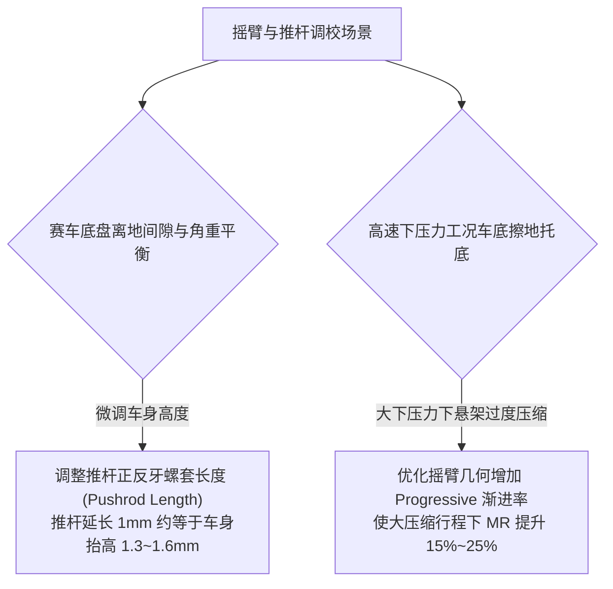

# 第 3 章 推拉杆摇臂三维轴线与拓扑连续性

---

## 1. 物理图景与工程痛点

在现代方程式（Formula SAE / F1）与高端原型赛车中，为了将沉重的弹簧减振器单元内收至单体壳座舱前方以降低非簧载质量与空气阻力，广泛采用了**推杆（Pushrod）或拉杆（Pullrod）结合空间摇臂（Rocker / Bellcrank）**的驱动拓扑。

推拉杆摇臂系统在设计与运动学解算中具有极高的非线性特征：
1. **三维空间任意倾斜转轴**：摇臂旋转轴线通常并不是平行于车身坐标轴的正交轴，而是在三维空间倾斜布置（以适应空气动力学外壳与减振器布局）；
2. **极坐标几何反解的双根多解奇异性**：推杆顶端与摇臂受力臂铰接点在空间圆周上存在两个几何交点。若数值求解器在连续跳动过程中丢失相位跟踪，极易在两根之间发生“相位突跳”（Branch Flip）；
3. **渐进/退化安装比（Motion Ratio, MR）非线性**：随着轮跳行程变化，推杆与摇臂的夹角、摇臂与减振器的夹角实时变化，决定了悬架是“渐进刚度（Progressive）”还是“退化刚度（Degressive）”。

---

## 2. 底层数学力学严密推导

```
   [车架减振器塔顶] CH5_BODY
          |
          |  [减振弹簧 Coilover]
          |
       RK_DAMPER
          |
       [摇臂 RK] ---- (空间转轴轴线 u_rocker) ---- RK_PIVOT [车架支点]
          |
        CH5 (推杆内端)
          \
           \  [刚性推杆 Pushrod]
            \
          UP4 (STRUT_OUT, 推杆外端，附着于下控制臂 LCA)
```

### 2.1 三类附着拓扑与运动学传递链

LABSUS 严格支持赛车工程中的三类减振悬架拓扑：
* **`pushrod`（推杆拓扑）**：推杆外端 $UP4$ 附着于下控制臂（LCA，即 $CH1-CH2-UP1$ 构成的摆臂三角面上）。车轮向上跳动时，推杆承受轴向压应力，向上推压摇臂；
* **`pullrod`（拉杆拓扑）**：拉杆外端 $UP4$ 附着于上控制臂（UCA）。车轮向上跳动时，拉杆承受轴向拉应力，向下拉动摇臂；
* **`direct`（直连拓扑）**：减振器直接连接转向节与车身（如 GT3 常见的外置麦弗逊或直连双叉臂），无中间摇臂转换。

在双横臂主机构完成收敛后，摆臂带动 $UP4$ 运动至确定位置 $\boldsymbol{p}_{UP4}$。

---

### 2.2 空间摇臂 Rodrigues 旋转角度精确方程

设摇臂转轴固定支点为 $\boldsymbol{p}_{pivot} = \boldsymbol{p}_{RK\_PIVOT}$，空间转轴的单位方向向量为 $\boldsymbol{u}_{rocker}$。

在设计基准状态下，摇臂上的推杆驱动铰点为 $\boldsymbol{p}_{CH5}^0$。当摇臂绕轴线旋转标量角度 $\theta$ 时，根据 Rodrigues 公式，推杆内端空间位置为：
$$\boldsymbol{p}_{CH5}(\theta) = \boldsymbol{p}_{pivot} + \boldsymbol{R}(\boldsymbol{u}_{rocker}, \theta) (\boldsymbol{p}_{CH5}^0 - \boldsymbol{p}_{pivot})$$
其中旋转矩阵为：
$$\boldsymbol{R}(\boldsymbol{u}_{rocker}, \theta) = \boldsymbol{I} + \sin\theta [\boldsymbol{u}_{rocker}]_\times + (1 - \cos\theta) [\boldsymbol{u}_{rocker}]_\times^2$$

由于推杆为刚性定长杆（杆长为 $L_{pushrod}^0 = \|\boldsymbol{p}_{CH5}^0 - \boldsymbol{p}_{UP4}^0\|_2$），当前几何位姿必须满足推杆定长标量非线性残差方程：
$$f(\theta) = \|\boldsymbol{p}_{CH5}(\theta) - \boldsymbol{p}_{UP4}\|_2^2 - (L_{pushrod}^0)^2 = 0$$

---

### 2.3 60 轮二分法括号搜索与相位连续性定理

方程 $f(\theta) = 0$ 在 $\theta \in [-\pi, \pi]$ 范围内通常存在两个实根（对应空间圆周与球面的两个几何交点）。

为了彻底根除多解突跳并保证 $10^{-13}$ 级高精度收敛，LABSUS 采用了**二分法括号搜索（Bisection Bracket Search）与历史相位锁定算法**：

#### 算法步骤：
1. **构建区间采样网格**：在 $\theta \in [-\pi, \pi]$ 内均匀划分 $N_{grid} = 360$ 个微小区间；
2. **符号异号变号检测**：检测所有满足 $f(\theta_k) \cdot f(\theta_{k+1}) \le 0$ 的变号子区间 $[\theta_k, \theta_{k+1}]$；
3. **高精度二分收敛**：对每个变号子区间执行 60 次二分迭代：
   $$\theta_{mid} = \frac{\theta_{left} + \theta_{right}}{2}, \quad \text{若 } f(\theta_{left}) f(\theta_{mid}) \le 0 \implies \theta_{right} = \theta_{mid} \text{ 否则 } \theta_{left} = \theta_{mid}$$
   60 轮二分的理论区间宽度 $\frac{2\pi}{360 \times 2^{60}}$ 远小于双精度极限，实际约 52 轮后区间宽度即触及 $\mathrm{ULP}(\theta)\sim 10^{-16}$ 量级而停滞，此后以已收敛解继续；
4. **历史根最近距离连续性追踪 (Phase Continuity)**：
   若求出两个合法根 $\theta_1, \theta_2$，选取与上一帧求解角度 $\theta_{last}$ 差值最小的分支：
   $$\theta^* = \arg\min_{\theta \in \{\theta_1, \theta_2\}} |\theta - \theta_{last}|$$
   在根轨道光滑（非折叠/相切）的行程段内，最近根选择 + 增量扫掠热启动在全行程上实践性地保持了 $\theta(tr)$ 单值连续；机构接近死点或双根交汇时该保证失效，工程上以步长 ≤ 6 mm 的连续扫掠规避。

---

### 2.4 安装运动比 (Motion Ratio, MR) 与渐进刚度推导

减振器下安装点 $\boldsymbol{p}_{damper}(\theta)$ 随摇臂旋转：
$$\boldsymbol{p}_{damper}(\theta) = \boldsymbol{p}_{pivot} + \boldsymbol{R}(\boldsymbol{u}_{rocker}, \theta) (\boldsymbol{p}_{RK\_DAMPER}^0 - \boldsymbol{p}_{pivot})$$
减振器当前长度为：
$$L_{damper}(tr) = \|\boldsymbol{p}_{damper}(\theta(tr)) - \boldsymbol{p}_{CH5\_BODY}\|_2$$

定义减振器安装运动比 $MR$ 为减振器行程变化量对车轮跳动行程的一阶导数：
$$MR(tr) = \frac{d L_{damper}}{d tr} = \frac{\partial L_{damper}}{\partial \theta} \cdot \frac{d\theta}{d tr}$$

根据虚功原理，轮端等效垂向刚度 $K_w$（Wheel Rate）与弹簧物理刚度 $K_s$（Spring Rate）的关系为：
$$K_w(tr) = K_s \cdot [MR(tr)]^2 + \underbrace{F_{spring} \cdot \frac{d(MR)}{d tr}}_{\text{几何非线性刚度项}}$$

* **渐进特性 (Progressive)**：若 $\frac{d(MR)}{d tr} > 0$，车轮在大压缩下刚度自动变硬，防止高速下压力击穿；
* **线性特性 (Linear)**：$MR(tr) \approx \text{Const}$，阻尼与刚度响应均匀。

---

## 3. 核心控制变量与参数灵敏度分析

| 摇臂控制变量 | 运动学与力学作用机理 | 偏导数响应特征 | 赛车工程考量 |
| :--- | :--- | :--- | :--- |
| **推杆内角 (Pushrod Incline Angle)** | 推杆与水平面夹角越陡，轮跳转化为推杆轴向位移的效率越高 | $\frac{\partial MR}{\partial \alpha_{push}} \propto \sin\alpha_{push}$ | 夹角过平会导致安装比极低（$MR < 0.5$），需要极大刚度的弹簧，增加结构负荷 |
| **摇臂驱动臂/从动臂长度比 $\frac{L_{damper\_arm}}{L_{push\_arm}}$** | 决定基础杠杆放大系数 | $MR_0 \approx \frac{L_{damper\_arm}}{L_{push\_arm}} \cdot \sin\beta$ | 典型 FSAE 赛车取 $0.75 \sim 0.90$，GT3 赛车取 $0.70 \sim 0.85$ |
| **摇臂转轴空间偏角 $(\boldsymbol{u}_{rocker})$** | 必须与推杆推力和减振器反力所在的空间主平面保持正交 | 偏角偏差引发巨大的轴承轴向侧载 | 转轴与合力面垂直度偏差应严格控制在 $< 2^\circ$ 以内 |

---

## 4. LABSUS 代码实现与数值稳定性技巧

### 4.1 核心代码映射
* **摇臂非线性求解器**：[`engine/src/solver/mechanism/solver.py`](file:///c:/Users/zzy/Desktop/New_suspension/LABSUS/engine/src/solver/mechanism/solver.py#L110-L165) 中的 `solve_rocker()`：
  ```python
  def solve_rocker(m: Mechanism, last_theta: float = 0.0) -> float:
      def residual(theta: float) -> float:
          R = rotate_around_axis(ch5_init, pivot, axis, theta)
          return float(np.sum((R - strut_out)**2) - target_dist**2)

      # 360 采样区间寻找变号括号
      roots = []
      for a, b in brackets:
          # 60 轮二分搜索
          for _ in range(60):
              mid = 0.5 * (lo + hi)
              if f_lo * residual(mid) <= 0.0:
                  hi = mid
              else:
                  lo = mid
          roots.append(0.5 * (lo + hi))
      # 选取与上一帧最近的根 (相位连续性追踪)
      return min(roots, key=lambda t: abs(t - last_theta))
  ```

---

## 5. 手把手工程数值算例 (Worked Example)

### 算例背景：FSAE 空间推杆摇臂转角高精度二分求解
已知空间硬点坐标（单位：$\text{mm}$）：
* 摇臂车架支点：$\boldsymbol{p}_{pivot} = [-200.0, 200.0, 400.0]^T$（位于轮心后方 200 mm、车内侧）
* 摇臂空间旋转轴线单位向量：$\boldsymbol{u}_{rocker} = [1.0, 0.0, 0.0]^T$（绕纵向 X 轴转动，$\theta$ 正方向取使 $CH5$ 的 $y$ 分量增大者）
* 摇臂推杆内端设计位：$\boldsymbol{p}_{CH5}^0 = [-200.0, 260.0, 420.0]^T$（相对转轴偏距 $\boldsymbol{d}_0=[0, 60, 20]$，力臂长 $R_{arm} = \sqrt{60^2 + 20^2} = 63.246\,\text{mm}$）
* 推杆外端设计位（$tr=0$）：$\boldsymbol{p}_{UP4}^{\,0} = [-40.0, 560.0, 250.0]^T$；压缩 $+25\,$mm 后当前位置：$\boldsymbol{p}_{UP4} = [-40.0, 520.0, 165.0]^T$
* 推杆定长（由设计位量取）：$L_{pushrod}^0 = \|\boldsymbol{p}_{UP4}^{\,0} - \boldsymbol{p}_{CH5}^0\| = 380.132\,\text{mm} \implies (L_{pushrod}^0)^2 = 144{,}500\,\text{mm}^2$

#### 步骤 1：建立残差函数 $f(\theta)$
对任意旋转角 $\theta$（本节旋转正方向与 $\boldsymbol{u}_{rocker}$ 定义配套，$\boldsymbol{d}_0$ 经旋转后为 $[0,\ 60\cos\theta + 20\sin\theta,\ -60\sin\theta + 20\cos\theta]$）：
$$\boldsymbol{p}_{CH5}(\theta) = \begin{bmatrix} -200.0 \\ 200.0 + 60.0 \cos\theta + 20.0 \sin\theta \\ 400.0 - 60.0 \sin\theta + 20.0 \cos\theta \end{bmatrix}$$
残差函数：
$$f(\theta) = \|\boldsymbol{p}_{CH5}(\theta) - \boldsymbol{p}_{UP4}\|^2 - (L_{pushrod}^0)^2$$

#### 步骤 2：区间变号扫描与双根判定
在 $[-\pi, \pi]$ 进行采样：
* 在区间 $[0.401, 0.419]\,\text{rad}$ 检测到变号：$f(0.401) = +21.3, \; f(0.419) = -447.5 \implies$ 存在物理实根 $\theta_1$；
* 在区间 $[1.500, 1.518]\,\text{rad}$ 检测到第二变号：$f(1.500) = -224.0, \; f(1.518) = +251.4 \implies$ 存在第二实根 $\theta_2$（摇臂大角度翻倒分支，非物理工作区）。

#### 步骤 3：60 轮高精度二分收敛
对区间 $[0.401, 0.419]$ 执行二分收敛：
* 第 1 步：$\theta_{mid} = 0.410, \; f(0.410) = -214.8 < 0 \implies \text{区间缩至 } [0.401, 0.410]$
* ... 连续二分至双精度停滞——在 $\theta \approx 0.4\,$rad 处相邻可表浮点间距 $\mathrm{ULP} \approx 5.6\times 10^{-17}$，约 52 轮后区间宽度触及该极限，继续迭代不再改善（程序以 60 轮为安全上限）：
  $$\theta_1^* = 0.401819\,\text{rad} \approx +23.02^\circ$$
* 第二实根：$\theta_2^* = 1.508534\,\text{rad} \approx +86.43^\circ$（摇臂几乎翻倒的镜像分支，$|\theta_2|$ 处推杆-摇臂夹角进入死点区，予以排除）。

#### 步骤 4：历史相位锁定判定
上一行程（$tr{=}0$）历史角 $\theta_{last} = +20.0^\circ = 0.3491\,\text{rad}$：
$$|\theta_1^* - \theta_{last}| = 0.053\,\text{rad}, \quad |\theta_2^* - \theta_{last}| = 1.160\,\text{rad}$$
算法自动选取 $\theta_1^*$ 作为物理真实解，消除了分支突跳！

---

## 6. 赛道工程师实战调校与故障排查指南



### 调校基准视窗
* **基础安装比 (Motion Ratio, MR)**：$0.72 \sim 0.85$（过低使弹簧过重，过高限制阻尼微调精度）；
* **渐进率 (Progressivity)**：全压缩行程内 MR 上升 $+8\% \sim +18\%$（高下压力方程式赛车必备，确保低速滤震与高速支撑完美兼顾）。

---

### 本章小结
本章用 Rodrigues 旋转 + 推杆定长约束把摇臂机构化归为一维非线性求根问题，并用"360 区间扫描 + 60 轮二分 + 历史相位锁定"确保全行程无分支突跳，再经 MR 平方律推导轮端等效刚度。它是第 1 章旋转工具的工程落地，也是第 24 章 Motion Ratio 调校杠杆的几何源头。
