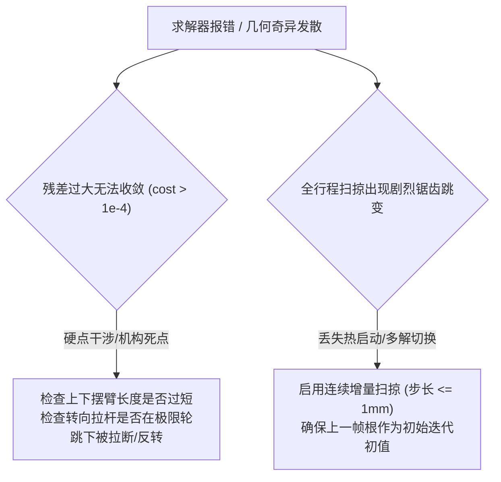

# 第 4 章 非线性运动学方程组与双端求解器内核

---

## 1. 物理图景与工程痛点

在悬架空间多体分析软件中，求解器内核必须兼顾两大截然不同的工程场景：
1. **工业级高精度离线求解 (High-Precision Backend)**：在进行 K&C 弹性耦合、台架实测对拍与全行程特征扫掠时，内层停止容差取 $10^{-10}\,$mm 量级（生产验收 $\le 0.02\,$mm），保证数值微分导数（如外倾增益、安装比导数）光滑无振荡；
2. **浏览器原生 60FPS 实时交互求解 (Real-time Interactive Frontend)**：当工程师在 3D 视图中用鼠标实时拖拽悬架硬点时，求解器必须在 $< 1\,\text{ms}$ 内完成包含车轮跳动与转向的全机构闭式收敛，不能出现任何掉帧或阻塞。

为此，LABSUS 构建了**Python 后端 TRF 联合最小二乘求解器**与**前端基于位置的动态约束投影 (Position-Based Dynamics / Gauss-Seidel) 闭式求解器**构成的双核对标体系。

---

## 2. 底层数学力学严密推导

### 2.1 Python 后端：Trust Region Reflective (TRF) 最小二乘求解器

将悬架所有可动自由节点（$UP1, UP2, UP3, UP5, FL1$ 等）的三维空间坐标压平为一个 $n$ 维全局状态向量 $\boldsymbol{x} \in \mathbb{R}^n$：
$$\boldsymbol{x} = [x_{UP1}, y_{UP1}, z_{UP1}, \dots, x_{FL1}, y_{FL1}, z_{FL1}]^T$$
将前述铰链圆方程、刚体距离方程、拉杆定长方程与行程驱动方程拼接为 $m$ 维全局非线性残差向量 $\boldsymbol{F}(\boldsymbol{x}) \in \mathbb{R}^m$（其中 $m \ge n$）：
$$\min_{\boldsymbol{x} \in \mathbb{R}^n} f(\boldsymbol{x}) = \frac{1}{2} \|\boldsymbol{F}(\boldsymbol{x})\|_2^2 = \frac{1}{2} \sum_{i=1}^m [F_i(\boldsymbol{x})]^2$$

#### TRF 信赖域反射子问题
在第 $k$ 步迭代中，求解以当前点 $\boldsymbol{x}_k$ 为中心、信赖域半径为 $\Delta_k$ 内的二次近似子问题：
$$\min_{\boldsymbol{p}} m_k(\boldsymbol{p}) = f(\boldsymbol{x}_k) + \nabla f(\boldsymbol{x}_k)^T \boldsymbol{p} + \frac{1}{2} \boldsymbol{p}^T \boldsymbol{B}_k \boldsymbol{p} \quad \text{s.t.} \quad \|\boldsymbol{D}_k \boldsymbol{p}\| \le \Delta_k$$
其中梯度向量 $\nabla f(\boldsymbol{x}_k) = \boldsymbol{J}(\boldsymbol{x}_k)^T \boldsymbol{F}(\boldsymbol{x}_k)$，高斯-牛顿近似海森矩阵 $\boldsymbol{B}_k = \boldsymbol{J}(\boldsymbol{x}_k)^T \boldsymbol{J}(\boldsymbol{x}_k)$。

TRF 算法引入对角缩放矩阵 $\boldsymbol{D}_k$ 与反射边界变换，在信赖域边界上利用二维仿射子空间（2D Subspace Minimization）精确求解步长 $\boldsymbol{p}_k$，在非线性强扭曲构型下展现出极强的全局收敛能力。

---

### 2.2 前端 JavaScript：Gauss-Seidel 闭式约束投影算法

前端采用基于位置动力学（Position-Based Dynamics, PBD）原理的投影迭代松弛法，在每一帧对离散约束进行序列化投影修正：

#### (1) 刚性杆长距离投影算子 (projLink)
设节点 $A$（位置 $\boldsymbol{p}_A$）与节点 $B$（位置 $\boldsymbol{p}_B$）通过长度为 $d$ 的刚性杆相连。若节点 $B$ 可动、节点 $A$ 固定，则投影修正公式为：
$$\Delta \boldsymbol{p} = \boldsymbol{p}_B - \boldsymbol{p}_A, \quad \boldsymbol{p}_B^{(new)} = \boldsymbol{p}_A + d \cdot \frac{\Delta \boldsymbol{p}}{\|\Delta \boldsymbol{p}\|}$$

#### (2) 空间铰链圆投影算子 (projHinge)
设空间转轴经过两固定点 $\boldsymbol{A}, \boldsymbol{B}$（轴线单位向量 $\boldsymbol{u}_{axis}$），铰接球销初始设计半径为 $r_0$、轴向投影为 $ax_0$。
1. 计算当前点到轴线的轴向分量误差与径向法向分量：
   $$\boldsymbol{v} = \boldsymbol{p} - \boldsymbol{A}, \quad \boldsymbol{v}_\parallel = (\boldsymbol{v} \cdot \boldsymbol{u}_{axis}) \boldsymbol{u}_{axis}$$
   $$\boldsymbol{v}_\perp = \boldsymbol{v} - \boldsymbol{v}_\parallel$$
2. 径向与轴向双重正交重投影：
   $$\boldsymbol{p}^{(new)} = \boldsymbol{A} + ax_0 \boldsymbol{u}_{axis} + r_0 \cdot \frac{\boldsymbol{v}_\perp}{\|\boldsymbol{v}_\perp\|}$$

#### (3) 转向节刚体姿态保持投影 (projBody)
通过四元数极分解 `polarQ` 计算当前发生微小形变的 5 节点相对于初始模板的最优正交旋转 $\boldsymbol{R}(\boldsymbol{q})$ 与质心位移 $\Delta\boldsymbol{c}$，刚性重构各节点坐标：
$$\boldsymbol{p}_k^{(new)} = \boldsymbol{c} + \boldsymbol{R}(\boldsymbol{q}) (\boldsymbol{p}_{0,k} - \boldsymbol{c}_0)$$

---

## 3. 核心控制变量与参数灵敏度分析

| 求解器控制超参数 | 数学力学含义 | 对收敛精度与速度的影响 | 工业推荐配置 |
| :--- | :--- | :--- | :--- |
| **残差容差 `ftol` / `xtol`** | 停止迭代的残差向量范数与自变量增量阈值 | 容差越小精度越高，但会增加单步迭代耗时 | 推荐配置 $10^{-10}\sim 10^{-12}$ |
| **最大迭代次数 `max_nfev`** | 允许非线性方程求解器调用的最大残差计算次数 | 防止机构发生空间奇异死锁时卡死主线程 | 扫掠工况设为 500 次，单步迭代设为 100 次 |
| **热启动初值 (Warm-start Guess)** | 利用上一轮行程 $tr_{k-1}$ 的收敛结果作为当前行程 $tr_k$ 的初值 $\boldsymbol{x}_0$ | 将迭代步数从平均 15 步骤降至 2~3 步，彻底消灭分支突跳 | 连续扫掠必须启用热启动机制 |

---

## 4. LABSUS 代码实现与数值稳定性技巧

### 4.1 核心代码映射
* **Python TRF 调用**：[`engine/src/solver/mechanism/solver.py`](file:///c:/Users/zzy/Desktop/New_suspension/LABSUS/engine/src/solver/mechanism/solver.py#L190-L225) 中的 `solve_pose()`：
  ```python
  res = least_squares(
      fun, x0,
      method="trf",
      ftol=1e-10, xtol=1e-10, gtol=1e-10,
      max_nfev=500
  )
  if not res.success or res.cost > 1e-4:
      return None  # 严格标记未收敛
  ```
* **前端 PBD 闭式投影循环**：[`web/js/03-mechanism.js`](file:///c:/Users/zzy/Desktop/New_suspension/LABSUS/web/js/03-mechanism.js#L260-L310) 中的 `solveMechanism()`。

---

## 5. 手把手工程数值算例 (Worked Example)

### 算例背景：Gauss-Seidel 闭式约束投影单步演算
已知摆臂车身转轴固定点 $\boldsymbol{A} = [180.0, 250.0, 140.0]^T, \; \boldsymbol{B} = [-180.0, 250.0, 140.0]^T$，转轴单位向量 $\boldsymbol{u}_{axis} = [-1.0, 0.0, 0.0]^T$。
设计基准状态下：轴向基准 $ax_0 = 180.0\,\text{mm}$，旋转半径 $r_0 = 350.571\,\text{mm}$。

设某一迭代初，当前节点位置发生扰动偏移为 $\boldsymbol{p} = [15.0, 610.0, 160.0]^T$。

#### 步骤 1：计算相对位移向量
$$\boldsymbol{v} = \boldsymbol{p} - \boldsymbol{A} = [-165.0, 360.0, 20.0]^T\,\text{mm}$$

#### 步骤 2：正交分解为轴向与径向分量
$$\boldsymbol{v}_\parallel = (\boldsymbol{v} \cdot \boldsymbol{u}_{axis}) \boldsymbol{u}_{axis} = (165.0) [-1, 0, 0]^T = [-165.0, 0.0, 0.0]^T$$
$$\boldsymbol{v}_\perp = \boldsymbol{v} - \boldsymbol{v}_\parallel = [0.0, 360.0, 20.0]^T\,\text{mm}$$
当前实际径向距离为：
$$\|\boldsymbol{v}_\perp\| = \sqrt{360.0^2 + 20.0^2} = \sqrt{129600 + 400} = 360.555\,\text{mm}$$

#### 步骤 3：应用 projHinge 算子进行闭式正交重投影
重投影后的高精度位置为：
$$\begin{aligned} \boldsymbol{p}^{(new)} &= \boldsymbol{A} + ax_0 \boldsymbol{u}_{axis} + r_0 \frac{\boldsymbol{v}_\perp}{\|\boldsymbol{v}_\perp\|} \\ &= \begin{bmatrix} 180.0 \\ 250.0 \\ 140.0 \end{bmatrix} + \begin{bmatrix} -180.0 \\ 0.0 \\ 0.0 \end{bmatrix} + 350.571 \begin{bmatrix} 0.0 \\ 360.0 / 360.555 \\ 20.0 / 360.555 \end{bmatrix} \\ &= \begin{bmatrix} 0.0 \\ 250.0 \\ 140.0 \end{bmatrix} + \begin{bmatrix} 0.0 \\ 350.033 \\ 19.446 \end{bmatrix} = \begin{bmatrix} 0.0 \\ 600.033 \\ 159.446 \end{bmatrix}\,\text{mm} \end{aligned}$$
* **验证**：重新计算新坐标的轴向投影 $= 180.000\,\text{mm}$，旋转半径 $= \sqrt{(600.033-250)^2 + (159.446-140)^2} = 350.571\,\text{mm}$，约束残差**在单步内精确归零（$\Phi = 0.000000$）**！

---

## 6. 赛道工程师实战调校与故障排查指南



### 几何合理性工程边界检查
* **摆臂极限死点夹角**：上下摆臂与转向节的夹角在全跳动行程内不得小于 $15^\circ$ 或大于 $165^\circ$；
* **转向拉杆有效行程**：极限转向角（$\pm 28^\circ$）下拉杆与转向机夹角保持在合理范围，防止机构越过“死点”发生自锁。

---

### 本章小结
本章给出 Python 端 TRF 信赖域最小二乘与前端 PBD 闭式投影两套求解内核，并演示了 projHinge 单步把铰链圆残差精确归零。它把第 2 章约束方程组落成可运行的求解器，也是第 8 章 K&C 嵌套求解器"内层刚体投影"的直接载体。
