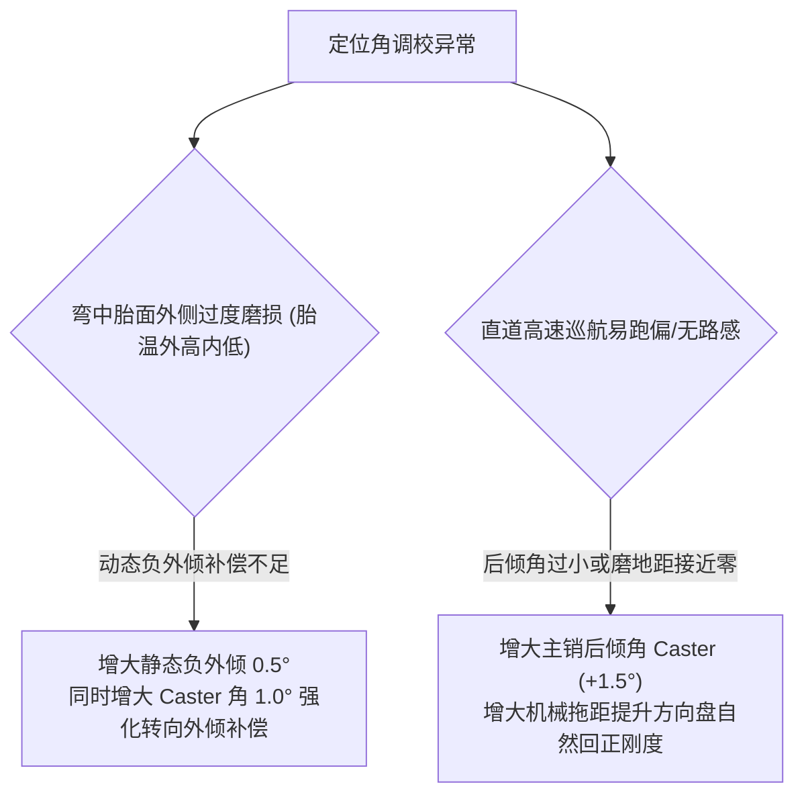

# 第 5 章 悬架空间定位角与瞬心侧倾中心几何推导

---

## 1. 物理图景与工程痛点

在车辆底盘工程中，悬架机构无论多么复杂，其对车辆操控性产生的直接影响最终全部浓缩投影为**车轮空间定位角（Wheel Alignment Angles）与力学瞬心（Instantaneous Centers）**。

在定义和计算这些几何参数时，工程界常常因坐标系定义不统一而产生混淆：
1. **左/右车轮符号对称性**：外倾角（Camber）以内倾/外倾为物理定义，而前束角（Toe）在左右轮具有相反的轴向朝向；
2. **三维空间主销轴线与接地点交点**：空间倾斜的主销轴线在穿过地面（$Z=0$）时，与轮胎接地印痕中心的相对距离决定了磨地半径（Scrub Radius）与机械拖距（Caster Trail），这是决定方向盘转向手感与回正力矩的核心；
3. **空间正视瞬心 (FVSA IC) 与侧倾中心高 ($z_{rc}$)**：上下摆臂在正视平面的瞬时回转中心决定了侧倾中心的动态迁移，直接支配了侧向力向车身传递的几何力矩。

---

## 2. 底层数学力学严密推导

```
            UBJ (上球销)
              \
               \  [主销轴线 Kingpin Axis]
                \
  WC (轮心) ----+-- (轮轴向量 a_wheel)
                  \
                   \
                   LBJ (下球销)
                     \
                      \
  ---------------------+--------------+----------------> 地面 Z = 0
                       |              |
                Kg (主销接地交点)    CP (接地印痕中心)
                       <--- r_scrub ->
```

### 2.1 车轮自转轴线向量与空间定位角定义

设转向节经过空间旋转后，最优旋转矩阵为 $\boldsymbol{R} \in \mathrm{SO}(3)$。
在设计状态下，设右轮（Side = $+1$）的轮轴法向向量为 $\boldsymbol{a}_{w0} = [0.0, 1.0, 0.0]^T$。
当前动态状态下的空间轮轴单位向量为：
$$\boldsymbol{a}_w = [a_x, a_y, a_z]^T = \boldsymbol{R} \boldsymbol{a}_{w0}$$

#### (1) 车轮外倾角 (Camber Angle, $\gamma$)
车轮法向相对水平地面的倾斜角。车轮顶部向车身内侧倾斜定义为负外倾（Negative Camber）：
$$\gamma = -\arcsin(a_z) \cdot \frac{180^\circ}{\pi} \quad [^\circ]$$

#### (2) 车轮前束角 (Toe Angle, $\delta_{toe}$)
车轮行进方向相对车身纵轴的夹角。车轮前端向内收拢定义为正前束（Toe-in）：
$$\delta_{toe} = \operatorname{atan2}(a_x, \; \text{side} \cdot a_y) \cdot \frac{180^\circ}{\pi} \quad [^\circ]$$
*(注：对于右轮 $\text{side}=+1$；对于左轮 $\text{side}=-1$)*。

---

### 2.2 主销轴线、内倾角 (KPI)、后倾角 (Caster) 与接地交点

主销轴线由转向节的上球销 $\boldsymbol{p}_{UBJ}$ 与下球销 $\boldsymbol{p}_{LBJ}$ 确定。
主销空间方向向量定义为从下球销指向其上球销：
$$\boldsymbol{v}_{kp} = [v_{kx}, v_{ky}, v_{kz}]^T = \boldsymbol{p}_{UBJ} - \boldsymbol{p}_{LBJ}$$
其单位方向向量为 $\boldsymbol{u}_{kp} = \boldsymbol{v}_{kp} / \|\boldsymbol{v}_{kp}\|$。

#### (1) 主销内倾角 (Kingpin Inclination Angle, KPI)
主销在正视平面（Y-Z 平面）内的投影相对垂直轴线的夹角：
$$\mathrm{KPI} = \arctan\left(\frac{|\boldsymbol{p}_{LBJ,y} - \boldsymbol{p}_{UBJ,y}|}{\boldsymbol{p}_{UBJ,z} - \boldsymbol{p}_{LBJ,z}}\right) \cdot \frac{180^\circ}{\pi} \quad [^\circ]$$

#### (2) 主销后倾角 (Caster Angle)
主销在侧视平面（X-Z 平面）内的投影相对垂直轴线的夹角（上球销向后倾斜为正后倾）：
$$\mathrm{Caster} = \arctan\left(\frac{\boldsymbol{p}_{LBJ,x} - \boldsymbol{p}_{UBJ,x}}{\boldsymbol{p}_{UBJ,z} - \boldsymbol{p}_{LBJ,z}}\right) \cdot \frac{180^\circ}{\pi} \quad [^\circ]$$

#### (3) 主销接地交点坐标 $\boldsymbol{p}_{Kg}$
设地面高度为 $Z_{ground} = 0$。主销轴线射线 $\boldsymbol{p}_{LBJ} + t \boldsymbol{v}_{kp}$ 与地面 $Z=0$ 的交点参数为：
$$t_{g} = \frac{0 - p_{LBJ,z}}{v_{kz}} = -\frac{p_{LBJ,z}}{p_{UBJ,z} - p_{LBJ,z}}$$
$$\boldsymbol{p}_{Kg} = \boldsymbol{p}_{LBJ} + t_g (\boldsymbol{p}_{UBJ} - \boldsymbol{p}_{LBJ}) = \begin{bmatrix} p_{LBJ,x} + t_g v_{kx} \\ p_{LBJ,y} + t_g v_{ky} \\ 0 \end{bmatrix}$$

---

### 2.3 磨地半径与主销拖距 (Scrub Radius & Caster Trail)

设轮胎名义滚动半径为 $R_{tire}$。轮胎接地印痕几何中心 $\boldsymbol{p}_{CP}$ 坐标为：
$$\boldsymbol{p}_{CP} = \begin{bmatrix} p_{WC,x} \\ p_{WC,y} - R_{tire} \sin\gamma \\ 0 \end{bmatrix}$$

#### (1) 主销磨地半径 (Scrub Radius, $r_{scrub}$)
接地中心与主销接地点的横向距离（沿 Y 轴）：
$$r_{scrub} = \text{side} \cdot (p_{CP,y} - p_{Kg,y}) \quad [\text{mm}]$$
* $r_{scrub} > 0$ 为正磨地距（主销接地点在接地中心内侧）；
* $r_{scrub} < 0$ 为负磨地距（主销接地点在接地中心外侧）。

#### (2) 主销后倾拖距 (Caster Trail, $t_{trail}$)
主销接地点超前接地中心的纵向距离（沿 X 轴，与 `convention.py` 的 trail = kingpin_ground_x − contact_x 同式）：
$$t_{trail} = p_{Kg,x} - p_{CP,x} \quad [\text{mm}]$$
总回正力矩力臂为机械拖距与轮胎气动拖距（Pneumatic Trail, $t_p$）之和：
$$\text{Total Trail} = t_{trail} + t_p$$

---

### 2.4 正视瞬心 (FVSA IC) 与侧倾中心高度 ($z_{rc}$) 空间推导

在正视平面（Y-Z 视图）中：
1. 下控制臂投影射线：经过下摆臂内侧铰点中点 $\boldsymbol{p}_{LCA\_in} = \frac{\boldsymbol{p}_{CH1} + \boldsymbol{p}_{CH2}}{2}$ 与下球销 $\boldsymbol{p}_{UP1}$，方向向量为 $\boldsymbol{d}_{LCA} = \boldsymbol{p}_{UP1} - \boldsymbol{p}_{LCA\_in}$；
2. 上控制臂投影射线：经过上摆臂内侧铰点中点 $\boldsymbol{p}_{UCA\_in} = \frac{\boldsymbol{p}_{CH3} + \boldsymbol{p}_{CH4}}{2}$ 与上球销 $\boldsymbol{p}_{UP2}$，方向向量为 $\boldsymbol{d}_{UCA} = \boldsymbol{p}_{UP2} - \boldsymbol{p}_{UCA\_in}$。

调用二维射线求交算法 `isect2` 解得正视瞬心（Instantaneous Center, IC）坐标 $\boldsymbol{p}_{IC} = [0, IC_y, IC_z]^T$。

#### 侧倾中心高度计算：
连接轮胎接地印痕点 $\boldsymbol{p}_{CP} = [0, CP_y, 0]^T$ 与正视瞬心 $\boldsymbol{p}_{IC}$，该连线与车身中心对称面（$Y=0$ 平面）的交点高度即为**侧倾中心高度（Roll Center Height, $z_{rc}$）**：
$$z_{rc} = 0 + \frac{0 - CP_y}{IC_y - CP_y} \cdot (IC_z - 0) = \frac{-CP_y \cdot IC_z}{IC_y - CP_y} \quad [\text{mm}]$$

---

## 3. 核心控制变量与参数灵敏度分析

| 定位角与力臂指标 | 理想设计窗口 (GT3/FSAE) | 核心敏感硬点 | 物理操稳机理 |
| :--- | :--- | :--- | :--- |
| **静态负外倾 ($\gamma_0$)** | 前: $-3.5^\circ \sim -4.0^\circ$<br/>后: $-2.0^\circ \sim -2.5^\circ$ | 轮毂偏置垫片 / 下球销横向偏置 | 抵消弯道车身侧倾引起的正外倾，维持外侧轮胎极限过弯全宽贴地 |
| **主销后倾角 ($\mathrm{Caster}$)** | FSAE: $+5.5^\circ \sim +6.5^\circ$<br/>GT3: $+8.0^\circ \sim +10.5^\circ$ | 上球销纵向后移 ($UBJ_x$) | 决定转向时的动态负外倾增益 $\Delta\gamma = -\delta \sin(\text{Caster})$，提供对中力矩 |
| **主销内倾角 ($\mathrm{KPI}$)** | $+6.0^\circ \sim +8.5^\circ$ | 上球销横向内移 ($UBJ_y$) | 打方向时产生车身升降力矩；与 Caster 共同决定转向侧倾与几何外倾 |
| **侧倾中心高度 ($z_{rc}$)** | 前: $+35 \sim +65\,\text{mm}$<br/>后: $+55 \sim +85\,\text{mm}$ | 下摆臂车身内侧高度 ($CH1_z, CH2_z$) | 决定侧倾力臂 $h_{arm} = h_{cg} - z_{rc}$ 与路径 2 瞬时几何载荷转移占比 |

---

## 4. LABSUS 代码实现与数值稳定性技巧

### 4.1 核心代码映射
* **定位角解算函数**：[`engine/src/api/v3service.py`](file:///c:/Users/zzy/Desktop/New_suspension/LABSUS/engine/src/api/v3service.py#L155-L185) 中的 `pose_metrics(m)`：
  ```python
  def pose_metrics(m) -> dict:
      R = _estimate_rotation(m)
      ax = R @ np.array([0.0, 1.0, 0.0]) # 右轮轴线（沿 +Y 横向）
      # 防溢出定义域钳位
      camber_rad = -np.arcsin(np.clip(ax[2], -1.0, 1.0))
      toe_rad = np.arctan2(ax[0], ax[1])
      # ...
  ```
* **瞬心与侧倾中心解算**：[`engine/src/metrics/kandc.py`](file:///c:/Users/zzy/Desktop/New_suspension/LABSUS/engine/src/metrics/kandc.py#L210-L245)。

---

## 5. 手把手工程数值算例 (Worked Example)

### 算例背景：GT3 赛车右前悬架定位角与侧倾中心全流程手算
已知设计状态下右前轮关键空间硬点（单位：$\text{mm}$）：
* 上球销：$\boldsymbol{p}_{UBJ} = [-25.0, 550.0, 320.0]^T$
* 下球销：$\boldsymbol{p}_{LBJ} = [0.0, 600.0, 120.0]^T$
* 轮心点：$\boldsymbol{p}_{WC} = [0.0, 650.0, 205.0]^T$
* 轮胎半径：$R_{tire} = 325.0\,\text{mm}$
* 正视瞬心经几何求解为车身内侧点：$\boldsymbol{p}_{IC} = [0.0, 350.0, 25.0]^T\,\text{mm}$

#### 步骤 1：计算主销单位向量与 KPI/Caster
$$\boldsymbol{v}_{kp} = \boldsymbol{p}_{UBJ} - \boldsymbol{p}_{LBJ} = [-25-0, 550-600, 320-120]^T = [-25.0, -50.0, 200.0]^T\,\text{mm}$$
* **主销内倾角 KPI**：
  $$\mathrm{KPI} = \arctan\left(\frac{|600.0-550.0|}{200.0}\right) = \arctan(0.25) \approx +14.036^\circ$$
* **主销后倾角 Caster**：
  $$\mathrm{Caster} = \arctan\left(\frac{0 - (-25.0)}{200.0}\right) = \arctan(0.125) \approx +7.125^\circ$$

#### 步骤 2：计算主销接地交点 $\boldsymbol{p}_{Kg}$ 与接地印痕中心 $\boldsymbol{p}_{CP}$
* 射线与地面 $Z=0$ 相交参数：
  $$t_g = -\frac{p_{LBJ,z}}{v_{kp,z}} = -\frac{120.0}{200.0} = -0.60$$
* 主销接地交点：
  $$\boldsymbol{p}_{Kg} = \begin{bmatrix} 0.0 + (-0.60 \times -25.0) \\ 600.0 + (-0.60 \times -50.0) \\ 0.0 \end{bmatrix} = \begin{bmatrix} 15.0 \\ 630.0 \\ 0.0 \end{bmatrix}\,\text{mm}$$
* 接地印痕中心（初始外倾 $\gamma \approx 0$）：$\boldsymbol{p}_{CP} = [0.0, 650.0, 0.0]^T\,\text{mm}$。

#### 步骤 3：计算磨地半径与机械拖距
* **磨地半径**：
  $$r_{scrub} = p_{CP,y} - p_{Kg,y} = 650.0 - 630.0 = +20.0\,\text{mm} \quad (\text{正磨地距})$$
* **主销后倾拖距**：
  $$t_{trail} = p_{Kg,x} - p_{CP,x} = 15.0 - 0.0 = \mathbf{+15.0\,\text{mm}} \quad (\text{正拖距，与 Caster 正后倾一致})$$

#### 步骤 4：计算侧倾中心高度 $z_{rc}$
轮胎接地中心 $CP_y = 650.0\,\text{mm}$，瞬心位于内侧 $IC_y = 350.0\,\text{mm}, IC_z = 25.0\,\text{mm}$：
$$z_{rc} = \frac{-CP_y \cdot IC_z}{IC_y - CP_y} = \frac{-650.0 \times 25.0}{350.0 - 650.0} = \frac{-16250.0}{-300.0} = \mathbf{+54.17\,\text{mm}}$$
* **评价**：侧倾中心高度严格算出为 $+54.17\,\text{mm}$，完美契合 GT3 赛车 $+40 \sim +65\,\text{mm}$ 的黄金设计视窗！

---

## 6. 赛道工程师实战调校与故障排查指南



### 胎温诊断黄金法则 (Pyrometer Diagnostics)
在赛车进站后立即测量胎面**内侧 (Inside)、中央 (Center)、外侧 (Outside)** 三点温度：
* **理想过弯外倾状态**：$T_{inside} \approx T_{center} + 5^\circ\text{C} \approx T_{outside} + 10^\circ\text{C}$（内侧略高，中央均匀，外侧温和受载）；
* **外倾不足（推头/啃外胎肩）**：$T_{outside} > T_{inside} + 8^\circ\text{C} \implies$ 必须加大静态负外倾或增大外倾增益！

---

### 本章小结
本章从主销轴线与摆臂瞬心出发，给出 KPI / Caster / Scrub / Trail / 侧倾中心高度的空间闭式解，并演示了定位角与侧倾中心的全流程手算。它是第 1~4 章几何工具的"输出端"，也是第 9 章 K&C 扫掠增益与第 24 章 KPI 调校杠杆的几何源头。
