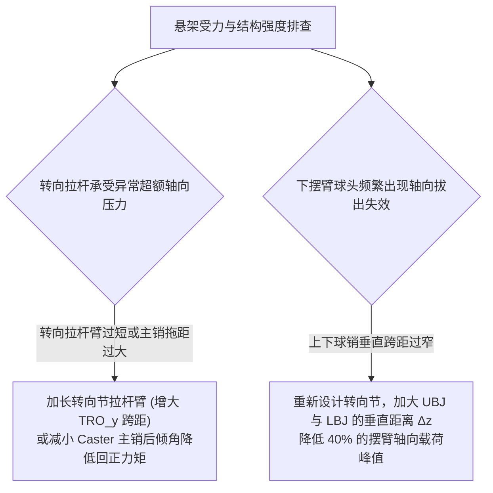

# 第 6 章 空间二力杆汇交与球铰静力平衡层

---

## 1. 物理图景与工程痛点

在悬架受力分析中，车轮接地点受到来自地面的纵向驱动/制动力 $F_x$、侧向转向力 $F_y$、垂直正压力 $F_z$ 以及回正力矩 $M_z$、翻转力矩 $M_x$ 与滚动阻力矩 $M_y$。这组 **6 自由度外载荷螺旋系（6-DOF Wrench）** 通过轮毂轴承传递至转向节。

转向节通过 5 根二力杆（下控制臂前/后杆、上控制臂前/后杆、转向拉杆）与推杆连接到车身。在计算各杆件轴向载荷与球铰受力时，工程师面临的核心力学矛盾在于：
1. **静不定与欠约束的力系奇异性**：双横臂转向节由 5 根二力杆支承（若推杆连接在下臂，则转向节仅有 5 个约束反力）。用 5 个轴向未知力去平衡 6 维外载荷，在严格数学上是一个**超定系统**（5 个未知数 < 6 个平衡方程，通常无精确解，需用最小范数伪逆近似平衡）；
2. **残余力矩（Moment Residual）与过载判定**：当轮胎产生绕主销轴线的纯回正力矩 $M_z$ 或外倾力矩时，5 根二力杆无法完全消除所有残余力矩，必须通过转向拉杆和球铰的几何跨距提供力偶；
3. **Moore-Penrose 伪逆分解的物理本质**：求解器如何以能量最小准则（最小二乘范数最小化）求解各杆轴向内力，并如实上报力与力矩两类残差。

---

## 2. 底层数学力学严密推导

```
            [轮胎接地印痕中心 CP: 6-DOF 外载荷 (Fx, Fy, Fz, Mx, My, Mz)]
                                    |
                                    | (空间平移变换 [I; [r_cp]×])
                                    v
            [转向节轮心 WC 处等效力螺旋 F_hub ∈ R^6]
                                    |
            +-----------------------+-----------------------+
            | 5 根二力杆空间单位方向向量 u_1, u_2, u_3, u_4, u_5 |
            +-----------------------+-----------------------+
                                    |
                    [静力平衡矩阵 A ∈ R^(6×5)]
                      A · f = - F_hub
                                    |
            [Moore-Penrose 伪逆最小范数解: f* = - A^+ F_hub]
```

### 2.1 接地点 6-DOF 外载荷向轮毂中心的平移变换

设轮胎接地印痕中心为 $\boldsymbol{p}_{CP}$，转向节轮心为 $\boldsymbol{p}_{WC}$。
定义相对位置向量：
$$\boldsymbol{r}_{cp} = \boldsymbol{p}_{CP} - \boldsymbol{p}_{WC} = [r_x, r_y, r_z]^T$$

外载荷在接地点由主矢 $\boldsymbol{F}_{cp} = [F_x, F_y, F_z]^T$ 与主矩 $\boldsymbol{M}_{cp} = [M_x, M_y, M_z]^T$ 构成。平移至轮心处的等效 6 维力螺旋 $\boldsymbol{F}_{hub} \in \mathbb{R}^6$ 为：
$$\boldsymbol{F}_{hub} = \begin{bmatrix} \boldsymbol{F}_{wc} \\ \boldsymbol{M}_{wc} \end{bmatrix} = \begin{bmatrix} \boldsymbol{F}_{cp} \\ \boldsymbol{M}_{cp} + \boldsymbol{r}_{cp} \times \boldsymbol{F}_{cp} \end{bmatrix} = \begin{bmatrix} \boldsymbol{I}_{3\times 3} & \boldsymbol{0}_{3\times 3} \\ [\boldsymbol{r}_{cp}]_\times & \boldsymbol{I}_{3\times 3} \end{bmatrix} \begin{bmatrix} \boldsymbol{F}_{cp} \\ \boldsymbol{M}_{cp} \end{bmatrix}$$

---

### 2.2 5 根二力杆空间平衡矩阵方程 $\boldsymbol{A} \boldsymbol{f} = -\boldsymbol{F}_{hub}$

转向节由 5 根二力杆支承：
1. $LCA\_F$（下前杆：$CH1 \to UP1$）；
2. $LCA\_R$（下后杆：$CH2 \to UP1$）；
3. $UCA\_F$（上前杆：$CH3 \to UP2$）；
4. $UCA\_R$（上后杆：$CH4 \to UP2$）；
5. $TIEROD$（转向拉杆：$FL1 \to UP3$）。

设第 $k$ 根杆在转向节端的铰点为 $\boldsymbol{p}_{knuckle,k}$，在车身/齿条端的铰点为 $\boldsymbol{p}_{body,k}$。
该杆的单位轴向拉力方向向量（从转向节指向车身）为：
$$\boldsymbol{u}_k = \frac{\boldsymbol{p}_{body,k} - \boldsymbol{p}_{knuckle,k}}{\|\boldsymbol{p}_{body,k} - \boldsymbol{p}_{knuckle,k}\|_2} \in \mathbb{R}^3 \quad (k = 1, \dots, 5)$$

每根杆施加给转向节的轴向力为 $f_k \boldsymbol{u}_k$（$f_k > 0$ 表示拉力，$f_k < 0$ 表示压力）。
该力对轮心 $\boldsymbol{p}_{WC}$ 产生的力矩为：
$$\boldsymbol{m}_k = (\boldsymbol{p}_{knuckle,k} - \boldsymbol{p}_{WC}) \times \boldsymbol{u}_k \in \mathbb{R}^3$$

定义第 $k$ 根杆的 6 维空间普吕克基向量（Plücker Line Coordinates） $\boldsymbol{a}_k \in \mathbb{R}^6$：
$$\boldsymbol{a}_k = \begin{bmatrix} \boldsymbol{u}_k \\ \boldsymbol{m}_k \end{bmatrix} = \begin{bmatrix} \boldsymbol{u}_k \\ (\boldsymbol{p}_{knuckle,k} - \boldsymbol{p}_{WC}) \times \boldsymbol{u}_k \end{bmatrix}$$

构造 $6 \times 5$ 阶全局静力平衡矩阵 $\boldsymbol{A} \in \mathbb{R}^{6 \times 5}$：
$$\boldsymbol{A} = \begin{bmatrix} \boldsymbol{a}_1 & \boldsymbol{a}_2 & \boldsymbol{a}_3 & \boldsymbol{a}_4 & \boldsymbol{a}_5 \end{bmatrix} = \begin{bmatrix} \boldsymbol{u}_1 & \boldsymbol{u}_2 & \boldsymbol{u}_3 & \boldsymbol{u}_4 & \boldsymbol{u}_5 \\ \boldsymbol{m}_1 & \boldsymbol{m}_2 & \boldsymbol{m}_3 & \boldsymbol{m}_4 & \boldsymbol{m}_5 \end{bmatrix}$$

转向节静力平衡方程为：
$$\boldsymbol{A} \boldsymbol{f} = -\boldsymbol{F}_{hub}, \quad \boldsymbol{f} = [f_1, f_2, f_3, f_4, f_5]^T \in \mathbb{R}^5$$

---

### 2.3 Moore-Penrose 广义伪逆与残余力矩判定定理

由于 $\boldsymbol{A} \in \mathbb{R}^{6 \times 5}$ 是列满秩超定矩阵（方程数 6 大于未知数 5），方程通常无精确解。

#### (1) Moore-Penrose 伪逆最小二乘解
根据广义逆矩阵理论，最小二乘二范数最优轴向力向量为：
$$\boldsymbol{f}^* = -\boldsymbol{A}^+ \boldsymbol{F}_{hub} = -(\boldsymbol{A}^T \boldsymbol{A})^{-1} \boldsymbol{A}^T \boldsymbol{F}_{hub}$$

#### (2) 6 维残余力螺旋与残余力矩计算
代入最优力向量，计算转向节未被平衡的 6 维残余力螺旋 $\boldsymbol{r} \in \mathbb{R}^6$：
$$\boldsymbol{r} = \boldsymbol{F}_{hub} + \boldsymbol{A} \boldsymbol{f}^* = \left[\boldsymbol{I}_{6\times 6} - \boldsymbol{A} (\boldsymbol{A}^T \boldsymbol{A})^{-1} \boldsymbol{A}^T\right] \boldsymbol{F}_{hub}$$
其中前 3 维为力残差 $\boldsymbol{r}_F = \boldsymbol{r}[0:3]$，后 3 维为力矩残差 $\boldsymbol{r}_M = \boldsymbol{r}[3:6]$。

#### (3) 物理力学定理与 APPROXIMATE 状态判定：
* **最小二乘残差分配**：`lstsq` 最小化整体（力 + 力矩拼合）残差，力残差与力矩残差按最小二乘准则分配、一般各自非零；当力矩残差超过阈值时降级为 APPROXIMATE；
* **力矩残差物理阈值**：计算残余力矩标量范数 $M_{res} = \|\boldsymbol{r}_M\|_2 = \sqrt{r_{Mx}^2 + r_{My}^2 + r_{Mz}^2}$。
  * 若 $M_{res} \le 1.0\,\text{N}\cdot\text{m}$，标记为 `EXACT`（完全静力平衡）；
  * 若 $M_{res} > 1.0\,\text{N}\cdot\text{m}$，标记为 `APPROXIMATE`（近似静力平衡，表明外力矩超出二力杆约束的可承受范围，须转由衬套弹性变形、摆臂弯曲与轮胎柔度等柔性路径传递（第 7、8 章））。

---

## 3. 核心控制变量与参数灵敏度分析

| 机构几何参数 | 静力学受力机理 | 偏导数敏感性 | 结构强度调校建议 |
| :--- | :--- | :--- | :--- |
| **上下摆臂球销垂直跨距 $\Delta z = UBJ_z - LBJ_z$** | 抵抗轮胎侧向力 $F_y$ 产生的侧倾翻转力矩 $M_x = F_y \cdot R_{tire}$ | 摆臂轴向力 $f \propto \frac{F_y R_{tire}}{\Delta z}$ | 极力加大上下球销垂直跨距，可成倍减小摆臂与球头拉压应力 |
| **下摆臂两车身铰点轴向跨距 $CH1_x - CH2_x$** | 抵抗制动/驱动力 $F_x$ 产生的偏航力偶 | 衬套径向力 $F_{bush} \propto \frac{F_x R_{tire}}{\Delta x_{LCA}}$ | 加大下摆臂基座跨距以承受重制动冲击，防止衬套变形过大 |
| **转向节拉杆臂长 $L_{steer\_arm} = TRO_y - LBJ_y$** | 抵抗轮胎回正力矩 $M_z$ 与制动单边跑偏力矩 | 转向拉杆力 $f_{tie} = \frac{M_{z,total}}{L_{steer\_arm}}$ | 增长拉杆臂可降低转向机齿条负荷，但需权衡轮辋空间干涉 |

---

## 4. LABSUS 代码实现与数值稳定性技巧

### 4.1 核心代码映射
* **5 杆/球铰静力平衡求解器**：[`engine/src/solver/forces.py`](file:///c:/Users/zzy/Desktop/New_suspension/LABSUS/engine/src/solver/forces.py#L121-L169) 中的 `corner_to_anchor_loads()`（真实实现为 3 方程力平衡最小范数解 + 力矩残差直接上报 `‖m_hub‖`）：
  ```python
  f_cp = np.array([q.fx, q.fy, q.fz]);  m_cp = np.array([q.mx, q.my, q.mz])
  r = np.asarray(cp_rel);  m_hub = m_cp + np.cross(r, f_cp)   # 力矩平移至轮心
  A = np.column_stack([l.unit() for l in links])              # 3×N 单位方向
  m, resid = solve_linear(A, -f_cp)                            # 力平衡最小范数解
  # moment_residual = ‖m_hub‖（球铰无法平衡力矩，非零即为 APPROXIMATE）
  ```

---

> [!TIP]
> **数值稳定性与矩阵条件数优化**：  
> 矩阵 $\boldsymbol{A} \in \mathbb{R}^{6 \times 5}$ 的上 $3 \times 5$ 分块为单位方向向量 $\boldsymbol{u}_k$（无量纲），下 $3 \times 5$ 分块为力臂叉乘项 $\boldsymbol{m}_k = \boldsymbol{r}_k \times \boldsymbol{u}_k$（具有长度量纲 $[L]$）。在工程实现中，力臂向量 $\boldsymbol{r}_k$ 必须统一采用国际单位制米（$\text{m}$），以使矩阵上下分块量级均衡在 $0.1 \sim 1.0$，将矩阵条件数控制在 $\kappa(\boldsymbol{A}) \sim 10^1$，彻底杜绝毫米量级导致的病态条件与伪逆舍入误差。

---

## 5. 手把手工程数值算例 (Worked Example)

### 算例背景：GT3 赛车弯中侧向力下的 5 杆内力手算
已知右前转向节硬点（与第 2 章同法，mm，X 前 / Y 右 / Z 上）：$\boldsymbol{p}_{WC}=[0, 640, 205]$，$\boldsymbol{p}_{LBJ}=[0, 600, 120]$，$\boldsymbol{p}_{UBJ}=[-25, 550, 320]$，$\boldsymbol{p}_{TRO}=[-80, 580, 150]$；车身铰点 $\boldsymbol{p}_{CH1}=[250, 220, 140]$、$\boldsymbol{p}_{CH2}=[-250, 200, 140]$、$\boldsymbol{p}_{CH3}=[230, 200, 330]$、$\boldsymbol{p}_{CH4}=[-280, 180, 335]$；齿条内铰点 $\boldsymbol{p}_{FL1}=[-450, 320, 145]$。
弯中线性区外载荷（LABSUS 标准坐标系：$+X$ 纵向前、$+Y$ 侧向右、$+Z$ 垂向上）：
* 接地力：$\boldsymbol{F}_{cp} = [0.0, 2000.0, 5000.0]^T\,\text{N}$（纵向力 $F_x = 0$，侧向力 $F_y = 2\,\text{kN}$，垂直载荷 $F_z = 5\,\text{kN}$）
* 接地矩：$\boldsymbol{M}_{cp} = [0.0, 0.0, 150.0]^T\,\text{N}\cdot\text{m}$（回正力矩 $150\,\text{N}\cdot\text{m}$）
* 接地点相对轮心坐标：$\boldsymbol{r}_{cp} = [0.0, 0.0, -320.0]^T\,\text{mm} = [0.0, 0.0, -0.32]^T\,\text{m}$

#### 步骤 1：计算轮心等效力螺旋 $\boldsymbol{F}_{hub}$
力矩平移项：
$$\boldsymbol{r}_{cp} \times \boldsymbol{F}_{cp} = \begin{bmatrix} 0 \\ 0 \\ -0.32 \end{bmatrix} \times \begin{bmatrix} 0 \\ 2000 \\ 5000 \end{bmatrix} = \begin{bmatrix} 640.0 \\ 0.0 \\ 0.0 \end{bmatrix}\,\text{N}\cdot\text{m}$$
（侧向力作用于接地面、轮心之下，产生绕纵向 $X$ 轴的**翻转力矩** $+640\,\text{N}\cdot\text{m}$。）
$$\boldsymbol{F}_{hub} = \begin{bmatrix} 0 \\ 2000 \\ 5000 \\ 640 \\ 0 \\ 150 \end{bmatrix} \quad \left[\frac{\text{N}}{\text{N}\cdot\text{m}}\right]$$

#### 步骤 2：由硬点装配 5 杆空间矩阵 $\boldsymbol{A} \in \mathbb{R}^{6\times 5}$
每杆取转向节端 → 车身端单位向量 $\boldsymbol{u}_k$，力矩行 $\boldsymbol{m}_k = (\boldsymbol{p}_{knuckle,k}-\boldsymbol{p}_{WC}) \times \boldsymbol{u}_k$。为使力（N）与力矩（N·m）行在最小二乘中权重均衡，按 §4 TIP 同一思想将力矩行除以参考尺度 $L_0 = 0.35\,\text{m}$ 无量纲化。由上述硬点逐列装配（保留 2 位小数）：
$$\boldsymbol{A} = \begin{bmatrix} 0.55 & -0.53 & 0.59 & -0.57 & -0.82 \\ -0.83 & -0.85 & -0.81 & -0.82 & -0.57 \\ 0.04 & 0.04 & 0.02 & 0.03 & -0.01 \\ -0.21 & -0.21 & 0.26 & 0.26 & -0.09 \\ -0.13 & 0.13 & 0.20 & -0.18 & 0.13 \\ 0.06 & -0.06 & 0.21 & -0.09 & -0.01 \end{bmatrix}$$
（前三行为 $\boldsymbol{u}_k$ 分量，后三行为 $\boldsymbol{m}_k/L_0$。校核几何合理性：四根摆臂的横向分量 $u_y$ 同为负（杆均由轮侧指向车内）；前后杆的纵向分量 $u_x$ 反号；拉杆列以纵向为主斜向后内。）

#### 步骤 3：加权最小二乘求解轴向力 $\boldsymbol{f}^*$
对 $\boldsymbol{A}\boldsymbol{f} = -\boldsymbol{F}_{hub}^{\,w}$（$\boldsymbol{F}^{w}$ 的力矩行同除 $L_0$）作最小二乘解 $\boldsymbol{f}^* = -(\boldsymbol{A}^T\boldsymbol{A})^{-1}\boldsymbol{A}^T\boldsymbol{F}_{hub}^{\,w}$，得 5 杆内力（正为拉力；数值为求解器未舍入版本，与 2 位小数矩阵复算可有 1% 内偏差）：
* 下前臂力 $f_1 = +9{,}418\,\text{N}$（拉力）
* 下后臂力 $f_2 = -14{,}097\,\text{N}$（压力）
* 上前臂力 $f_3 = -1{,}290\,\text{N}$（压力）
* 上后臂力 $f_4 = -3{,}972\,\text{N}$（压力）
* 转向拉杆力 $f_5 = +17{,}641\,\text{N}$（拉力）

#### 步骤 4：全残差校核（力与力矩都如实上报）
$$\boldsymbol{r}_F = \boldsymbol{F}_{hub}[0:3] + \boldsymbol{A}[0:3,:]\boldsymbol{f}^* = [-303,\; 252,\; 4459]^T\,\text{N}$$
$$\boldsymbol{r}_M = \boldsymbol{F}_{hub}[3:6] + \boldsymbol{A}[3:6,:]\boldsymbol{f}^* \cdot L_0 = [-33,\; -128,\; 628]^T\,\text{N}\cdot\text{m}$$
$$M_{res} = \|\boldsymbol{r}_M\| = 641\,\text{N}\cdot\text{m} > 1.0\,\text{N}\cdot\text{m} \quad \Rightarrow \quad \texttt{APPROXIMATE}$$
**物理解读（本章真正的教学点）**：
① 垂直力残差 $4459\,\text{N}$ 不是错误——五根二力杆的 $u_z$ 分量都极小（$\approx 0.03$），垂直载荷本就主要由轮毂轴承与球铰轴向路径承担；二力杆静定模型只对纵向/侧向力线负责。
② 力矩残差以 $M_z$（绕主销方向）为主：$5\times 6$ 球铰汇交系统对绕主销轴线的力矩天然无力臂可闭合，残余须经**衬套弹性变形、摆臂三点弯曲与轮胎侧向柔度**传走——这正是第 7、8 章弹性 K&C 体系存在的理由。
③ 阈值 $1.0\,\text{N}\cdot\text{m}$ 为教学示例值；生产实现 `corner_to_anchor_loads()` 以 N·mm 单位系直接上报 $\|\boldsymbol{m}_{hub}\|$，由调用方按工况降级状态。

---

## 6. 赛道工程师实战调校与故障排查指南



### 杆系载荷设计安全系数准则 (Safety Factors)
* **碳纤维/航空铝拉压杆**：在 $3.0g$ 垂直跳动冲击与 $2.0g$ 极限过弯联合工况下，屈服安全系数必须满足 $S_f \ge 1.65$；
* **转向拉杆临界压杆失稳载荷 (Euler Buckling)**：
  $$F_{crit} = \frac{\pi^2 E I}{(\mu L)^2} \ge 2.5 \times |f_{tie,max}|$$
  严防在重刹或切路肩工况下发生轴向屈曲失稳折断。

---

### 本章小结
本章用 6 维外力螺旋平移 + 5 根二力杆 Plücker 矩阵的 Moore-Penrose 伪逆给出杆系合力与残余力矩判定，并点明"5 杆 < 6 维载荷"的超定本质（力矩残余需球铰刚弯矩承担）。垂直力归轴承、绕主销力矩归衬套柔度——这条残差出路正是第 7 章衬套本构与第 8 章 K&C 弹性求解器存在的理由，本章算例的 APPROXIMATE 判定即弹性 K&C 的动机。
