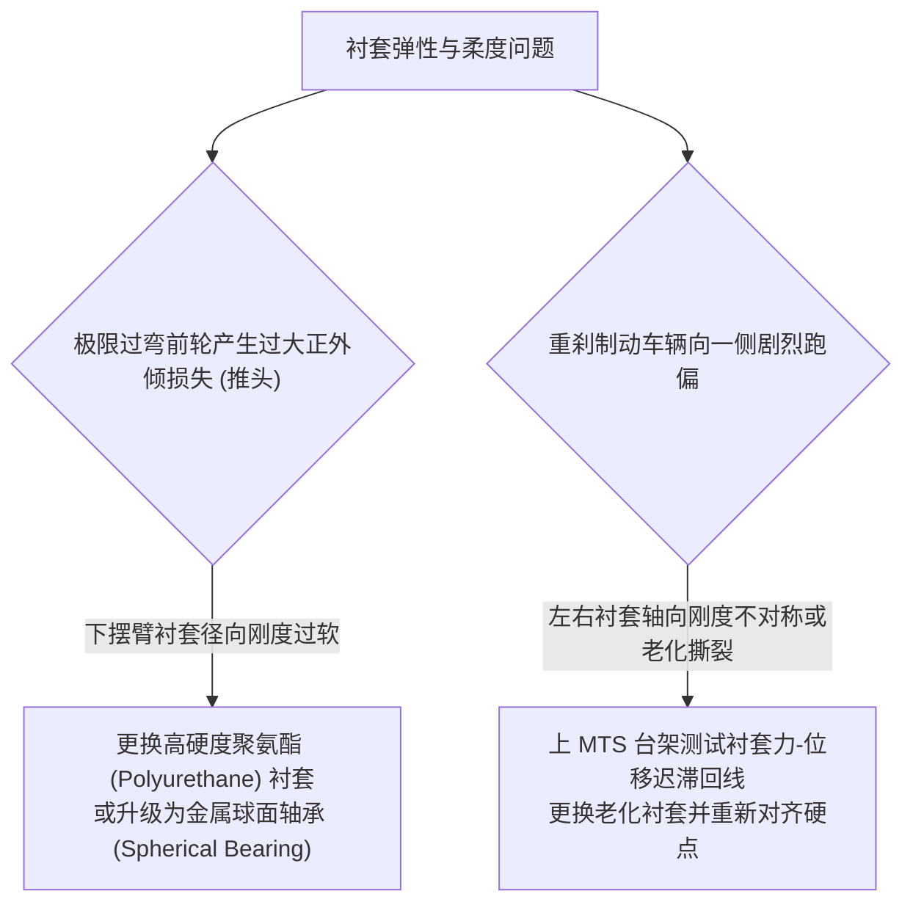

# 第 7 章 6-DOF 橡胶衬套非线性本构模型

---

## 1. 物理图景与工程痛点

在现代乘用车与部分高性能 GT 赛车的底盘中，悬架摆臂车身连接端并非完全刚性的球头轴承，而是广泛采用了**高阻尼各向异性橡胶衬套（Rubber Bushing）**。

橡胶衬套在隔离路面高频冲击粗糙度（NVH 隔振）的同时，也为底盘运动学引入了显著的**弹性变形柔度（Elastokinematics / Compliance）**：
1. **各向异性非线性刚度**：衬套在径向（Radial）、轴向（Axial）与扭转角（Torsional）三个正交方向上的刚度差异极大（例如径向刚度可达 $15,000\,\text{N/mm}$，而扭转刚度仅为 $5\,\text{N}\cdot\text{m/deg}$）；
2. **多项式过拟合与非物理振荡 (Runge Phenomenon)**：若采用普通高阶多项式拟合台架实测力-位移曲线，极易在插值区间产生非物理的“反向弯折”与负刚度假象；
3. **大变形极限硬化与外推发散**：当悬架受到路肩重度冲击产生超出标定测试量程的超大位移时，插值模型必须能够平滑过渡到高斜率的线性或高次硬化外推（Hardening Extrapolation），保证 K&C 求解器绝对不崩溃。

---

## 2. 底层数学力学严密推导

```
  衬套反力 F_bush (N)
        ^                                        [极限硬化切线外推: 斜率 k_max]
        |                                           /
        |                           .--------------+
        |                          / (PCHIP 单调保形三次样条)
        |                         /
  ------+------------------------+-----------------------------------> 位移 δ (mm)
        |                       /
        |        +-------------+
        |       / (边界切线外推)
        v      /
```

### 2.1 6-DOF 各向异性位移与变形向量

设衬套在空间中受到局部 6 自由度微小变形，其广义位移向量为：
$$\boldsymbol{\delta} = [\delta_x, \delta_y, \delta_z, \theta_{rx}, \theta_{ry}, \theta_{rz}]^T \in \mathbb{R}^6$$
产生的广义弹性恢复力/力矩向量为：
$$\boldsymbol{f}_{bush}(\boldsymbol{\delta}) = [F_x(\delta_x), F_y(\delta_y), F_z(\delta_z), M_{rx}(\theta_{rx}), M_{ry}(\theta_{ry}), M_{rz}(\theta_{rz})]^T \in \mathbb{R}^6$$

---

> **通道-轴向映射前提**：径向/轴向/扭转通道定义在**衬套局部系**（轴线沿销轴方向）。LABSUS S1 假设摆臂车身铰链轴线沿整车 $X$（如第 2 章 CH1→CH2 轴线），故局部通道力近似映射为整车 $[F_x^{轴}, F_y^{径1}, F_z^{径2}]$；斜置臂需 $R J R^T$ 合同旋转（未实现，登记 S2）。转角通道以**弧度**输入（代码 `_fR` 口径），§3 表中 N·m/deg 为台架显示单位（×57.3 换算）。本构为**单值骨架曲线**——取实测迟滞回线的中线包络；Payne 幅值依赖与相位迟滞不在 S1 范围。


### 2.2 PCHIP 单调保形三次 Hermite 样条本构方程

设试验台架在某一自由度测得 $n$ 个单调递增的位移-力离散采样点集：
$$\{(\delta_1, F_1), (\delta_2, F_2), \dots, (\delta_n, F_n)\}, \quad \delta_1 < \delta_2 < \dots < \delta_n$$

定义相邻点间的割线斜率 $\Delta_k$ 与步长 $h_k$：
$$h_k = \delta_{k+1} - \delta_k, \quad \Delta_k = \frac{F_{k+1} - F_k}{h_k} \quad (k = 1, \dots, n-1)$$

为了严格保证插值函数的单调性，消除非物理凹凸，节点处的切线导数 $d_k = \left.\frac{dF}{d\delta}\right|_{\delta_k}$ 按 **Brodlie-Fritsch 单调性准则** 构造：

#### (1) 内部节点切线导数 ($k = 2, \dots, n-1$)：
* 若 $\operatorname{sgn}(\Delta_{k-1}) \neq \operatorname{sgn}(\Delta_k)$ 或 $\Delta_{k-1} \Delta_k = 0$（出现极值拐点），强制令 $d_k = 0$；
* 否则，采用加权调和平均数（Weighted Harmonic Mean）：
  $$\frac{w_1 + w_2}{d_k} = \frac{w_1}{\Delta_{k-1}} + \frac{w_2}{\Delta_k}, \quad w_1 = 2 h_k + h_{k-1}, \; w_2 = h_k + 2 h_{k-1}$$
  $$d_k = \frac{w_1 + w_2}{\frac{w_1}{\Delta_{k-1}} + \frac{w_2}{\Delta_k}}$$

#### (2) 端点单边导数 ($k=1$ 与 $k=n$)：
$$d_1 = \frac{(2h_1 + h_2)\Delta_1 - h_1\Delta_2}{h_1 + h_2}, \quad \text{若 } \operatorname{sgn}(d_1) \neq \operatorname{sgn}(\Delta_1) \implies d_1 = 0$$

#### (3) 局部三次 Hermite 样条多项式求值：
在任意子区间 $\delta \in [\delta_k, \delta_{k+1}]$ 内，归一化局部参数 $t = \frac{\delta - \delta_k}{h_k} \in [0, 1]$：
$$F(\delta) = (1 - 3t^2 + 2t^3) F_k + (3t^2 - 2t^3) F_{k+1} + h_k (t - 2t^2 + t^3) d_k + h_k (t^3 - t^2) d_{k+1}$$
其解析切线刚度为：
$$\frac{dF}{d\delta} = \frac{6(t - t^2)}{h_k} (F_{k+1} - F_k) + (1 - 4t + 3t^2) d_k + (3t^2 - 2t) d_{k+1}$$

---

### 2.3 边界极限线性硬化外推 (Hardening Extrapolation)

当外载荷过大导致变形超出测试标定范围时：
* **正向超限 ($\delta > \delta_n$)**：
  $$F(\delta) = F_n + d_n \cdot (\delta - \delta_n), \quad \frac{dF}{d\delta} = d_n$$
* **负向超限 ($\delta < \delta_1$)**：
  $$F(\delta) = F_1 + d_1 \cdot (\delta - \delta_1), \quad \frac{dF}{d\delta} = d_1$$

**数学定理**：PCHIP 样条结合切线连续边界外推，保证了全实数域 $\delta \in (-\infty, +\infty)$ 上的 $C^1$ 连续性与严格单调性，解析导数处处存在且连续。

---

### 2.4 解析刚度雅可比矩阵 $\boldsymbol{J}_{bush}$

衬套在当前位移 $\boldsymbol{\delta}$ 下的 $6 \times 6$ 阶切线刚度矩阵为对角正定阵（注：当前 S1 版本仅平移 3 通道生效，旋转/耦合通道为存储占位）：
$$\boldsymbol{J}_{bush}(\boldsymbol{\delta}) = \frac{\partial \boldsymbol{f}_{bush}}{\partial \boldsymbol{\delta}} = \operatorname{diag}\left(\left.\frac{dF_x}{d\delta_x}\right|_{\delta_x}, \; \left.\frac{dF_y}{d\delta_y}\right|_{\delta_y}, \; \left.\frac{dF_z}{d\delta_z}\right|_{\delta_z}, \; \left.\frac{dM_{rx}}{d\theta_{rx}}\right|_{\theta_{rx}}, \; \left.\frac{dM_{ry}}{d\theta_{ry}}\right|_{\theta_{ry}}, \; \left.\frac{dM_{rz}}{d\theta_{rz}}\right|_{\theta_{rz}}\right)$$

---

## 3. 核心控制变量与参数灵敏度分析

| 衬套自由度通道 | 物理变形特征 | 典型刚度量级 | 底盘力学与 NVH 权衡 |
| :--- | :--- | :--- | :--- |
| **径向刚度 ($K_{radial}$)** | 承受过弯侧向力与垂直轮跳 | $8,000 \sim 25,000\,\text{N/mm}$ | 径向刚度越硬，过弯外倾与前束柔度损失越小，操控越精准；但会恶化路面粗糙度传递 |
| **轴向刚度 ($K_{axial}$)** | 承受制动与加速纵向力 | $3,000 \sim 12,000\,\text{N/mm}$ | 轴向柔度决定制动纵向缓冲，过软会导致重刹时产生危险的制动跑偏前束 |
| **扭转角刚度 ($K_{torsion}$)** | 随摆臂上下跳动自由旋转 | $1.0 \sim 15.0\,\text{N}\cdot\text{m/deg}$ | 扭转刚度必须极低，防止在悬架跳动过程中产生额外的非线性阻扭力矩 |

---

## 4. LABSUS 代码实现与数值稳定性技巧

### 4.1 核心代码映射
* **衬套本构模型**：[`engine/src/components/bushing.py`](file:///c:/Users/zzy/Desktop/New_suspension/LABSUS/engine/src/components/bushing.py#L59-L110) 中的 `Bushing6DOF` 与模块级 `bush_force()` / `bush_force_jac()`（曲线由 `Curve.build()` 基于 scipy `PchipInterpolator` 构造）：
  ```python
  def bush_force(b: Bushing6DOF, delta: np.ndarray) -> np.ndarray:
      # delta = [dx,dy,dz, rx,ry,rz]（小角），返回 6 抗力（力 N / 力矩 N·mm）
      f = np.zeros(6)
      for i in range(3):  f[i] = b._fT[i][0](d[i])          # 平移 3 通道
      for i in range(3):  f[3 + i] = b._fR[i][0](d[3 + i])  # 旋转 3 通道（占位）
      return f + np.asarray(b.preload, float)

  def bush_force_jac(b: Bushing6DOF, delta: np.ndarray) -> np.ndarray:
      J = np.zeros((6, 6))
      for i in range(3):  J[i, i] = b._fT[i][1](d[i])
      for i in range(3):  J[3 + i, 3 + i] = b._fR[i][1](d[3 + i])
      return J
  ```

---

## 5. 手把手工程数值算例 (Worked Example)

### 算例背景：台架实测非线性力-位移曲线 PCHIP 样条求值
已知某下控制臂橡胶衬套径向试验台架实测 4 个标定点（单位：$\text{mm}, \text{N}$）：
* 点 1：$(\delta_1 = -3.0, F_1 = -2400.0)$
* 点 2：$(\delta_2 = 0.0, F_2 = 0.0)$
* 点 3：$(\delta_3 = 2.0, F_3 = 2000.0)$
* 点 4：$(\delta_4 = 5.0, F_4 = 8000.0)$

#### 步骤 1：计算各区间步长与割线斜率
* $h_1 = 0 - (-3) = 3.0\,\text{mm}, \quad \Delta_1 = \frac{0 - (-2400)}{3.0} = 800.0\,\text{N/mm}$
* $h_2 = 2 - 0 = 2.0\,\text{mm}, \quad \Delta_2 = \frac{2000 - 0}{2.0} = 1000.0\,\text{N/mm}$
* $h_3 = 5 - 2 = 3.0\,\text{mm}, \quad \Delta_3 = \frac{8000 - 2000}{3.0} = 2000.0\,\text{N/mm}$

#### 步骤 2：计算中间节点 2 与节点 3 的加权调和平均切线导数
* **节点 2 ($\delta_2 = 0$)**：
  $w_1 = 2(2) + 3 = 7.0, \; w_2 = 2 + 2(3) = 8.0$
  $$d_2 = \frac{7 + 8}{\frac{7}{800} + \frac{8}{1000}} = \frac{15}{0.00875 + 0.00800} = \frac{15}{0.01675} \approx 895.522\,\text{N/mm}$$
* **节点 3 ($\delta_3 = 2.0$)**：
  $w_1 = 2(3) + 2 = 8.0, \; w_2 = 3 + 2(2) = 7.0$
  $$d_3 = \frac{8 + 7}{\frac{8}{1000} + \frac{7}{2000}} = \frac{15}{0.00800 + 0.00350} = \frac{15}{0.01150} \approx 1304.348\,\text{N/mm}$$

#### 步骤 3：求解 $\delta = +1.0\,\text{mm}$ 处的弹性恢复力与瞬态切线刚度
位移 $\delta = 1.0$ 位于区间 2（$[0.0, 2.0]$），局部参数 $t = \frac{1.0 - 0.0}{2.0} = 0.5$：
* **力求值**：
  $$F(1.0) = (1 - 3(0.25) + 2(0.125)) \cdot 0 + (3(0.25) - 2(0.125)) \cdot 2000 + 2.0(0.5 - 2(0.25) + 0.125) \cdot 895.522 + 2.0(0.125 - 0.25) \cdot 1304.348$$
  $$F(1.0) = 0.5 \times 2000 + 2.0(0.125) \times 895.522 - 2.0(0.125) \times 1304.348 = 1000 + 223.88 - 326.09 = 897.79\,\text{N}$$
* **切线刚度求值**：
  $$\left.\frac{dF}{d\delta}\right|_{\delta=1.0} = \frac{6(0.5 - 0.25)}{2.0} \times 2000 + (1 - 4(0.5) + 3(0.25)) \times 895.522 + (3(0.25) - 2(0.5)) \times 1304.348 = 1500 - 223.88 - 326.09 = 950.03\,\text{N/mm}$$

---

## 6. 赛道工程师实战调校与故障排查指南



### 赛车衬套选型金标准
* **纯竞技赛车 (FSAE / F1 / LMP)**：全部采用无间隙航空级金属关节轴承（Spherical Bearings），弹性柔度 $\boldsymbol{\delta} \approx \boldsymbol{0}$，追求极致运动学精确度；
* **GT3 / 房车赛车**：关键导向摆臂采用高刚度尼龙/铝合金衬套（刚度 $> 30,000\,\text{N/mm}$），辅以减振器吸收高频冲击。

---

### 本章小结
本章用 Brodlie-Fritsch 单调保形 PCHIP 样条 + 端点切线硬化外推，给出全实数域 $C^1$ 连续且严格单调的衬套本构，从根本上消除 Runge 振荡与负刚度。它是第 8 章 K&C 嵌套求解器外层力平衡的"反力-切线刚度"来源，也决定了整车弹性前束/外倾柔度。
