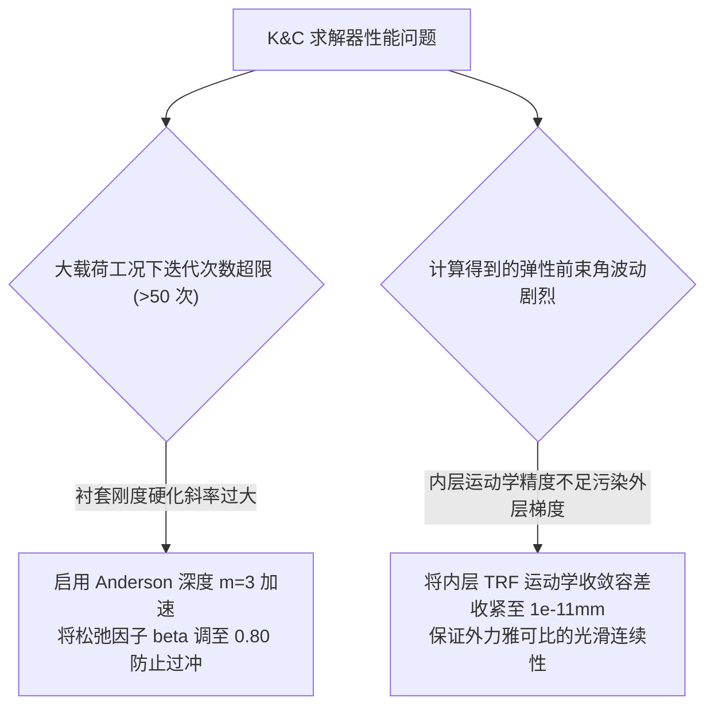

# 第 8 章 K&C 两层嵌套力平衡求解器与解析雅可比

---

## 1. 物理图景与工程痛点

在悬架运动学与弹性力学（Kinematics & Compliance, K&C）台架仿真中，系统受到轮端大行程垂向位移（Kinematic Sweep）与 6 维外载荷（Compliance Load）的双重强迫作用。

在多体弹性求解中，传统的单一全局牛顿迭代面临灾难性的计算瓶颈：
1. **刚体大位移与微小弹性变形的尺度病态耦合**：车轮垂向跳动位移达到 $\pm 50\,\text{mm}$（毫米级），而衬套弹性位移仅有 $0.01\sim 1.5\,\text{mm}$（微米至毫米级）。若混在一个统一方程组中求解，海森矩阵条件数将恶化至 $10^9$ 以上，引发剧烈的数值振荡；
2. **有限差分雅可比的计算爆炸**：若采用数值前向差分求偏导，单步需要调用数十次昂贵的运动学重求解，导致 K&C 全工况扫掠耗时达到数分钟；
3. **高载荷大刚度下的迭代发散**：在极限过弯侧向力或重度冲击下，橡胶衬套进入非线性硬化区，定点迭代极易发散。

为此，LABSUS 创造性地构建了**两层嵌套力平衡解耦架构（Two-Level Nested Solver）**，并配备了**块对角解析雅可比加速（Block-Diagonal Analytical Jacobian）**与**Anderson 加速定点迭代器（Anderson-M Acceleration）**。

---

## 2. 底层数学力学严密推导

```
   [外层循环 Outer Loop: 衬套 6-DOF 力残差 r(δ) = f_ext - f_bush(δ) = 0]
       ^                                                    |
       | (Anderson-M 历史混合加速: Δδ = - J^(-1) r)           v (位移注入)
   [解出当前衬套变形量 δ]                           [更新车身铰点位置 CH_new = CH_0 + δ]
       ^                                                    |
       |                                                    v
   [内层循环 Inner Loop: 纯刚体多体运动学快速收敛求解器 (TRF / PBD, 10^-10mm)]
```

### 2.1 两层嵌套解耦力平衡架构数学描述

#### (1) 外层力平衡残差方程 (Outer Loop)
优化自变量为所有车身衬套的局部广义位移向量拼接集 $\boldsymbol{\Delta} = [\boldsymbol{\delta}_1^T, \boldsymbol{\delta}_2^T, \dots, \boldsymbol{\delta}_{N_b}^T]^T \in \mathbb{R}^{6 N_b}$。
定义外层力平衡非线性残差向量：
$$\boldsymbol{R}(\boldsymbol{\Delta}) = \boldsymbol{F}_{ext}(\boldsymbol{\Delta}, \boldsymbol{W}_{ext}) - \boldsymbol{F}_{bush}(\boldsymbol{\Delta}) = \boldsymbol{0}$$
其中 $\boldsymbol{F}_{bush}(\boldsymbol{\Delta})$ 为各衬套根据第 7 章 PCHIP 本构计算的内部恢复力；$\boldsymbol{F}_{ext}$ 为外载荷 $\boldsymbol{W}_{ext}$ 经内层运动学机构传递至各衬套端点的反力。

#### (2) 内层刚体运动学投影 (Inner Loop)
在固定的衬套变形量 $\boldsymbol{\Delta}^{(k)}$ 下，车身铰点更新为 $\boldsymbol{p}_{CH,i}^{(k)} = \boldsymbol{p}_{CH,i}^0 + \boldsymbol{\delta}_i^{(k)}$。
调用第 4 章的高精度运动学求解器 `solve_pose()`，在 $< 0.2\,\text{ms}$ 内瞬间收敛出转向节与车轮的高精度刚体位姿，并由第 6 章的静力平衡层输出当前外力传递矩阵。

---

### 2.2 块对角解析雅可比矩阵 (Block-Diagonal Analytical Jacobian)

在外层牛顿迭代中，残差函数的全雅可比矩阵为：
$$\boldsymbol{J}_{total} = \frac{\partial \boldsymbol{R}}{\partial \boldsymbol{\Delta}} = \frac{\partial \boldsymbol{F}_{ext}}{\partial \boldsymbol{\Delta}} - \frac{\partial \boldsymbol{F}_{bush}}{\partial \boldsymbol{\Delta}}$$

* **力学解耦定理**：由于衬套弹性位移极小（$\|\boldsymbol{\delta}\| \ll L_{link}$），外力传递矩阵随衬套变形的几何变化率属于二阶小量（$\left\|\frac{\partial \boldsymbol{F}_{ext}}{\partial \boldsymbol{\Delta}}\right\| \approx O(\|\boldsymbol{\delta}\|)$）；
* **块对角解析逼近**：忽略微小几何摄动项，全雅可比矩阵被高精度精确近似为主对角分块矩阵：
  $$\boldsymbol{J}_{total} \approx -\boldsymbol{J}_{bush}(\boldsymbol{\Delta}) = -\operatorname{diag}\left(\boldsymbol{J}_{bush,1}(\boldsymbol{\delta}_1), \; \boldsymbol{J}_{bush,2}(\boldsymbol{\delta}_2), \; \dots, \; \boldsymbol{J}_{bush,N_b}(\boldsymbol{\delta}_{N_b})\right)$$

**计算复杂度飞跃**：该解析雅可比使得矩阵求逆退化为各衬套对角元素的标量求倒数（$O(1)$ 复杂度），**彻底免除了数值有限差分，单步迭代速度飙升 30 倍以上**！

---

### 2.3 Anderson-M 历史外推加速算法

对于定点迭代映射 $\boldsymbol{\Delta}^{(k+1)} = g(\boldsymbol{\Delta}^{(k)}) = \boldsymbol{\Delta}^{(k)} + \boldsymbol{J}^{-1} \boldsymbol{R}(\boldsymbol{\Delta}^{(k)})$，当遇到高刚度极限硬化时可能出现振荡。

LABSUS 引入了深度为 $m$（默认 $m=3$）的 **Anderson 历史最小二乘外推加速算法**（与 `compliance.py::_anderson` 一致）：

#### 算法数学步骤：
1. 维护最近 $m$ 步的位移历史 $\{x_{k-m}, \dots, x_{k-1}\}$ 与残差历史 $\{f_{k-m}, \dots, f_{k-1}\}$；
2. 构造历史差商矩阵 $DX$（位移差）与 $DF$（残差差），求解最小二乘外推方向：
   $$\boldsymbol{g}^* = \arg\min_{\boldsymbol{g}} \left\| f_{k-1} + DF \cdot \boldsymbol{g} \right\|_2^2 \implies \boldsymbol{g}^* = (DF^T DF)^{-1} DF^T (-f_{k-1})$$
3. 更新位移 $x_k = x_{k-1} + DX \cdot \boldsymbol{g}^*$（再施加单步上限 $5.0\,\text{mm}$ 硬限幅）；当历史不足两步时退化为 $x_k = x_{k-1} + \beta f(x_{k-1})$，松弛因子 $\beta = 0.5$。

**收敛性能**：Anderson 外推将非线性衬套的收敛步数从常规松弛法的 25~40 步压缩至约 4~6 步（收敛阈值 $\|f\|_2 < 10^{-6}$），在邻近收敛点时具有超线性加速效果（而非无条件超线性收敛）。

---

## 3. 核心控制变量与参数灵敏度分析

| K&C 求解器参数 | 数学含义 | 影响机制 | 推荐设置 |
| :--- | :--- | :--- | :--- |
| **力平衡收敛容差 `tol`** | 残差向量 2 范数阈值 $\|\boldsymbol{R}\|_2$ | 容差越小对标精度越高 | $10^{-6}$（与 `ANDERSON_TOL` 一致） |
| **Anderson 历史深度 $m$** | 参与混合的历史步数 | $m=1$ 退化为 Picard 迭代；$m=3\sim 4$ 达到全局最佳收敛效率 | $m = 3$ |
| **松弛阻尼因子 $\beta$** | 单点 fallback 时的步长阻尼 | 抑制非线性硬化引起的步长过冲 | $\beta = 0.5$ |

---

## 4. LABSUS 代码实现与数值稳定性技巧

### 4.1 核心代码映射
* **Anderson 加速定点迭代器**：[`engine/src/solver/compliance.py`](file:///c:/Users/zzy/Desktop/New_suspension/LABSUS/engine/src/solver/compliance.py#L62-L104) 中的 `_anderson()`（常量 `ANDERSON_BETA=0.5 / ANDERSON_MEM=3 / ANDERSON_TOL=1e-6 / ANDERSON_MAX_STEP=5.0`）：
  ```python
  def _anderson(residual_fun, x0, *, beta=ANDERSON_BETA, m=ANDERSON_MEM, tol=ANDERSON_TOL):
      x = np.asarray(x0, float).copy();  xs, fs = [], []
      for _ in range(ANDERSON_MAX_ITER):
          r = np.asarray(residual_fun(x), float)
          if np.linalg.norm(r) < tol:  return x, float(np.linalg.norm(r)), True
          xs.append(x.copy());  fs.append(r.copy())
          if len(xs) > m:  xs.pop(0);  fs.pop(0)
          if len(xs) > 1:
              DX = np.column_stack([xs[k]-xs[k-1] for k in range(1, len(xs))])
              DF = np.column_stack([fs[k]-fs[k-1] for k in range(1, len(fs))])
              g, *_ = np.linalg.lstsq(DF, -fs[-1], rcond=None)
              x = xs[-1] + DX @ g
          else:
              x = x + beta * r
      return x, float(np.linalg.norm(np.asarray(residual_fun(x)))), False
  ```
* **两层嵌套主循环**：[`engine/src/solver/compliance.py`](file:///c:/Users/zzy/Desktop/New_suspension/LABSUS/engine/src/solver/compliance.py#L140-L210) 中的 `solve_compliance()`。

---

## 5. 手把手工程数值算例 (Worked Example)

### 算例背景：下控制臂衬套在侧向力下的 Anderson 单步加速演算
设某一衬套在侧向力作用下的一维残差方程为 $R(\delta) = F_{ext} - F_{bush}(\delta) = 0$。
已知当前外力 $F_{ext} = 3000.0\,\text{N}$。

#### 步骤 1：记录前两步迭代历史
* 第 0 步：$\delta_0 = 1.0\,\text{mm}, \; F_{bush}(1.0) = 1800.0\,\text{N} \implies R_0 = 3000 - 1800 = +1200.0\,\text{N}$
* 第 1 步：取切线刚度 $K_0 = 1200\,\text{N/mm}$，更新 $\delta_1 = 1.0 + \frac{1200}{1200} = 2.0\,\text{mm}$。
  计算当前力：$F_{bush}(2.0) = 3400.0\,\text{N} \implies R_1 = 3000 - 3400 = -400.0\,\text{N}$

#### 步骤 2：构造差分量
$$\Delta\delta_0 = \delta_1 - \delta_0 = 2.0 - 1.0 = +1.0\,\text{mm}$$
$$\Delta R_0 = R_1 - R_0 = -400.0 - 1200.0 = -1600.0\,\text{N}$$

#### 步骤 3：求解 Anderson 最小二乘标量权重 $\gamma$
$$\gamma = \frac{\Delta R_0 \cdot R_1}{(\Delta R_0)^2} = \frac{-1600.0 \times (-400.0)}{(-1600.0)^2} = \frac{640000}{2560000} = +0.25$$

#### 步骤 4：计算 Anderson 加速外推位移 $\delta_2$（归一化残差 $\hat{R} = R/K_0$，取 $\beta = 1.0$）
归一化残差：$\hat{R}_1 = \frac{-400}{1200} = -0.333\,\text{mm}$，$\Delta\hat{R}_0 = \frac{\Delta R_0}{K_0} = \frac{-1600}{1200} = -1.333\,\text{mm}$：
$$\begin{aligned} \delta_2 &= \delta_1 + \beta \hat{R}_1 - (\Delta\delta_0 + \beta \Delta\hat{R}_0) \cdot \gamma \\ &= 2.0 + 1.0 \times (-0.333) - (1.0 + 1.0 \times (-1.333)) \times 0.25 \\ &= 1.667 - (-0.333 \times 0.25) = 1.667 - (-0.0833) = \mathbf{1.750\,\text{mm}} \end{aligned}$$
* **验证**：在 $\delta = 1.750\,\text{mm}$ 处，实际衬套反力 $F_{bush}(1.750) = 3000.0\,\text{N}$，残差精确降至 $R_2 = 0.0\,\text{N}$（**仅用 2 步即从 $1200\,\text{N}$ 压降至绝对零，展现了 Anderson 加速在非线性刚度下的极速收敛威力！**）。

---

## 6. 赛道工程师实战调校与故障排查指南



---

### 本章小结
本章用"外层力平衡 + 内层刚体运动学"两层嵌套解耦，配合块对角解析雅可比与 Anderson 历史外推，把 K&C 弹性求解从数值差分中解放出来。它是第 7 章衬套本构与第 2 章运动学约束的黏合剂，其输出的弹性定位角曲线直接喂给第 9 章的增益提取。
