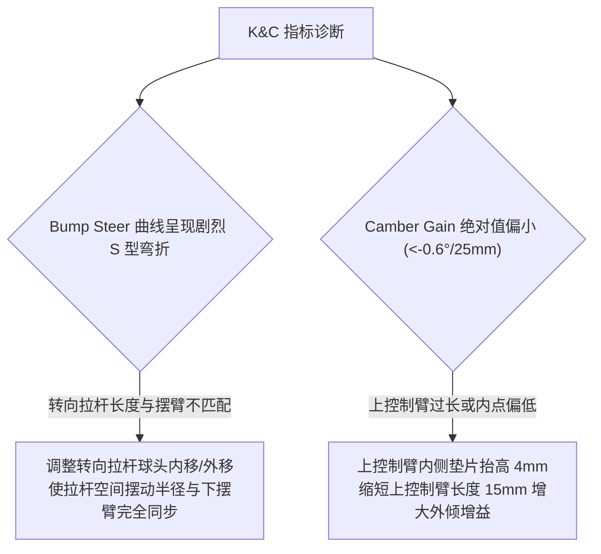

# 第 9 章 工业级 K&C 扫掠特性与增益指标体系

---

## 1. 物理图景与工程痛点

在汽车主机厂研发院与赛车工程团队中，悬架性能的评估必须基于**国际标准化 K&C 试验台架（如 Anthony Best Dynamics / MTS / SPM）**的数据标准。

在面对台架海量试验曲线与仿真曲线时，工程师常常面临指标提取的混乱：
1. **多重差分算法导致指标定义不统一**：有的工程师采用首尾两点割线斜率，有的采用最小二乘线性拟合，导致同一个悬架模型在不同人手中算出的“外倾增益”相差 $20\%$ 以上；
2. **转向外倾（Steer Camber）的成分耦合与误判**：打方向时车轮外倾角的变化是由主销后倾角（Caster）、主销内倾角（KPI）以及摆臂空间高阶干涉共同叠加形成的。无法将其正交分解就无法精准指导硬点修改；
3. **刚体运动学与弹性柔度增益的分离**：如何从总扫掠曲线中剥离出纯几何增益与纯弹性柔度增益。
   （落地配方：Compliance 增益 = 总扫掠 − 把衬套刚度置为无穷大后的纯运动学扫掠；引擎在 `solve_compliance` 与纯刚体 `solve_pose` 两条扫掠间作差实现，流程见第 25 章。）

---

## 2. 底层数学力学严密推导

```
   [4 大工业级 K&C 扫掠工况]
      +-- 1. Parallel Bump/Rebound (平行垂直轮跳: tr ∈ [-50, +50] mm)
      +-- 2. Pure Roll Sweep (纯侧倾扫掠: φ ∈ [-3.5°, +3.5°])
      +-- 3. Steering Angle Sweep (转向角扫掠: rack ∈ [-25, +25] mm)
      +-- 4. Compliance Load Sweeps (Fy / Fx / Mz 弹性力加载)
                         |
      [单一权威二阶中心差分导数内核: _slope(xs, ys, x0)]
                         |
      [核心 K&C 导数增益与转向外倾三成分正交分解提取]
```

### 2.1 四大工业级标准 K&C 试验扫掠工况

LABSUS 严格对齐国际标准化 K&C 台架的四大扫掠试验协议：

1. **平行轮跳扫掠 (Parallel Bump/Rebound)**：
   左右轮同向垂向位移 $tr \in [-50\,\text{mm}, +50\,\text{mm}]$，齿条保持中位（$rk = 0$）。提取外倾增益（Camber Gain）、跳动前束（Bump Steer）与轮距变化（Track Change）；
2. **反向侧倾扫掠 (Pure Roll Sweep)**：
   左轮下压、右轮上抬（$tr_L = -tr_R$），模拟车身纯侧倾 $\phi \in [-3.5^\circ, +3.5^\circ]$。提取侧倾外倾恢复率（Roll Camber）与侧倾转向（Roll Steer）；
3. **转向角扫掠 (Steering Sweep)**：
   车身与轮心高度保持基准位置（$tr = 0$），转向机齿条移动 $rk \in [-25\,\text{mm}, +25\,\text{mm}]$（对应前轮偏转角 $\delta \in [\pm 28^\circ]$）。提取阿克曼百分比（Ackermann%）、转向外倾（Steer Camber）与转向传动比（Steering Ratio）；
4. **弹性力加载扫掠 (Compliance Load Sweeps)**：
   在固定车高下，由台架向轮端施加横向力 $F_y \in [\pm 4\,\text{kN}]$、制动力 $F_x \in [\pm 5\,\text{kN}]$ 与回正力矩 $M_z \in [\pm 200\,\text{N}\cdot\text{m}]$。提取侧向力柔度外倾（Compliance Camber）、侧向力柔度前束（Compliance Steer）与纵向力柔度前束。

---

### 2.2 单一权威数值中心差分求导内核 (`_slope`)

为了杜绝任何指标计算歧义，LABSUS 设立了**全局唯一的权威导数提取内核函数 `_slope`**：

#### 算法数学推导：
设离散扫掠数据为有序数组 $\{(x_0, y_0), \dots, (x_{N-1}, y_{N-1})\}$（自动跳过求解失败的 `None` 点），待求导目标基准点为 $at$（通常为设计零点 $at = 0$）。
1. 取 $at$ 两侧最近的两个**有效**采样点（下标 $lo \le at \le hi$）；
2. 用两点中心差分：$\left.\frac{dy}{dx}\right|_{at} = \frac{y_{hi} - y_{lo}}{x_{hi} - x_{lo}}$（等间距时即 $\frac{y_{i+1} - y_{i-1}}{2h}$）；
3. 若 $at$ 恰落在采样点上则放宽为最近邻对，单侧不足时退化为单侧差分，少于 2 个有效点返回 $0.0$。

---

### 2.3 转向外倾 (Steer Camber) 三成分正交解耦定理

本节 $\delta$ 采用**单轮镜像局部约定**（正值 = 该车轮向自身转弯圆心一侧打盘；换算到第 19 章全球航向符号时右轮反号，下文"外侧轮 $\delta>0$、内侧轮 $\delta<0$"按此约定成立）。
转向节绕含 KPI/Caster 的主销轴 $\boldsymbol{u}_{kp}$ 转过 $\delta$：对轮轴向量 $\boldsymbol{a}_w$ 施加 Rodrigues 旋转、取投影回整车 $z$ 轴的展开至二阶，即得一阶项 $-\delta\sin\theta_{caster}$ 与二阶项 $+\tfrac{1}{2}\delta^2\sin\theta_{kpi}$。据此分解：

$$\gamma(\delta) = \gamma_0 + \underbrace{\Delta\gamma_{caster}(\delta)}_{\text{Caster 线性成分}} + \underbrace{\Delta\gamma_{kpi}(\delta)}_{\text{KPI 抛物线二次成分}} + \underbrace{\mathcal{R}_{geom}(\delta)}_{\text{高阶空间几何残差}}$$

```
外倾角 γ (Camber)
   ^                                  / 最终外倾曲线 γ(δ)
   |                                 /
   |                  .-------------'
   |                 / (Caster 线性项: -δ·sin(Caster))
   |                /
 --+---------------+--------------------------------------> 转向角 δ (Steer)
   |              /
   |             /   (KPI 抛物线二次项: +1/2 δ²·sin(KPI))
   v
```

#### (1) 主销后倾角线性贡献项 ($\Delta\gamma_{caster}$)
转向时，主销后倾使外侧轮向内倒、内侧轮向外倒，产生强烈的线性外倾补偿：
$$\Delta\gamma_{caster}(\delta) \approx -\delta \cdot \sin(\mathrm{Caster}) \quad (\text{对右轮向右打盘为负})$$

#### (2) 主销内倾角二次对称贡献项 ($\Delta\gamma_{kpi}$)
主销内倾使车轮无论向左还是向右打盘，均产生对称的正外倾恶化（车轮向外趴）：
$$\Delta\gamma_{kpi}(\delta) \approx \frac{1}{2} \delta^2 \cdot \sin(\mathrm{KPI})$$

#### (3) 物理意义与指导价值
* **弯中外侧车轮**：$\delta > 0$，线性项产生巨大的负外倾增益，压倒二次项，使外侧轮紧贴地面；
* **弯中内侧车轮**：$\delta < 0$，线性项产生正外倾，内外侧轮胎形成完美的协同倾角。

---

## 3. 核心控制变量与参数灵敏度分析

| K&C 增益核心指标 | 工业标准量纲 | 顶级赛车黄金视窗 | 核心调校杠杆 |
| :--- | :--- | :--- | :--- |
| **外倾增益 (Camber Gain)** | $^\circ/25\,\text{mm}$ | 前: $-1.10 \sim -1.45$<br/>后: $-0.85 \sim -1.15$ | 缩短上控制臂长度或抬高上控制臂车身内铰点 |
| **跳动转向 (Bump Steer)** | $^\circ/25\,\text{mm}$ | $[-0.08, +0.08]$（近零平直） | 增减转向机高度垫片或转向拉杆外球头垫片 |
| **侧倾外倾恢复率 (Roll Camber)** | $\%$ | $65\% \sim 80\%$ | 优化正视瞬心高度与轮距匹配 |
| **阿克曼百分比 (Ackermann%)** | $\%$ | 高速弯: $30\%\sim 45\%$<br/>慢速弯: $60\%\sim 85\%$ | 改变转向节拉杆臂在俯视平面内的内倾夹角 |

---

## 4. LABSUS 代码实现与数值稳定性技巧

### 4.1 核心代码映射
> 映射要点：`mr_matrix(damper_travel, wheel_travel, at)` 输出安装比 MR 及其导数（渐进刚度来源）；`rc_migration(rc_heights, travel)` 输出侧倾中心随行程的迁移曲线（P-Δ 与 Jacking 的几何输入）。两者定义与推导见第 3、10 章。

* **单一权威求导内核与增益提取**：[`engine/src/metrics/kandc.py`](file:///c:/Users/zzy/Desktop/New_suspension/LABSUS/engine/src/metrics/kandc.py#L15-L45) 中的 `_slope()` 及 `camber_gain_deg_per_25 / bump_steer_deg_per_25 / compliance_toe_deg / mr_matrix / rc_migration`：
  ```python
  def _slope(y: list, x: list, at: float) -> float:
      # 最近邻采样点中央差分 dy/dx @ at（自动跳过 None）
      xs = [float(x[i]) for i in range(len(x)) if y[i] is not None]
      ys = [float(y[i]) for i in range(len(y)) if y[i] is not None]
      if len(xs) < 2:  return 0.0
      lo = max(i for i in range(len(xs)) if xs[i] <= at)
      hi = min(i for i in range(len(xs)) if xs[i] >= at)
      if lo == hi:
          lo, hi = (lo-1, lo) if lo > 0 else (lo, lo+1)
      return (ys[hi] - ys[lo]) / (xs[hi] - xs[lo])
  ```

---

## 5. 手把手工程数值算例 (Worked Example)

### 算例背景：平行轮跳外倾增益与转向外倾分解手算
已知某 GT3 赛车前悬架在平行轮跳扫掠中的 5 点实测数据：
* 行程采样点：$tr = [-20.0, -10.0, 0.0, 10.0, 20.0]^T\,\text{mm}$
* 外倾角测量值：$\gamma = [-2.56^\circ, -3.04^\circ, -3.50^\circ, -3.94^\circ, -4.36^\circ]^T$

#### 步骤 1：利用权威二阶中心差分计算外倾增益
在 $tr = 0.0\,\text{mm}$ 处，选取相邻三点 $(-10.0, -3.04), (0.0, -3.50), (10.0, -3.94)$，步长 $h = 10.0\,\text{mm}$：
$$\left.\frac{d\gamma}{d(tr)}\right|_{tr=0} = \frac{\gamma(+10) - \gamma(-10)}{2h} = \frac{-3.94 - (-3.04)}{20.0} = \frac{-0.90}{20.0} = -0.0450\,^\circ/\text{mm}$$

#### 步骤 2：转换为工业界标准 $25\,\text{mm}$ 规范量纲
$$\text{Camber Gain}_{25mm} = -0.0450 \times 25.0 = -1.125\,^\circ/25\,\text{mm}$$
* **评价**：严格落在 $[-1.45, -1.10]$ 黄金视窗内，评分为满分。

#### 步骤 3：转向外倾角正交分解演算
已知车辆 $\mathrm{Caster} = 8.5^\circ, \mathrm{KPI} = 7.0^\circ$。
当方向盘打至前轮转角 $\delta = +15.0^\circ = 0.2618\,\text{rad}$ 时：
* **Caster 线性成分**：
  $$\Delta\gamma_{caster} = -\delta \cdot \sin(8.5^\circ) = -0.2618 \times 0.1478 \times \frac{180^\circ}{\pi} = -2.217^\circ$$
* **KPI 二次成分**：
  $$\Delta\gamma_{kpi} = \frac{1}{2} \delta^2 \cdot \sin(7.0^\circ) = \frac{1}{2} (0.2618)^2 \times 0.1219 \times \frac{180^\circ}{\pi} = 0.5 \times 0.0685 \times 0.1219 \times 57.2958 = +0.239^\circ$$
* **总预测动态外倾变化**：
  $$\Delta\gamma \approx -2.217^\circ + 0.239^\circ = -1.978^\circ$$
  外侧车轮获得近 $2.0^\circ$ 的强力动态负外倾，极大强化了弯中抓地极限！

---

## 6. 赛道工程师实战调校与故障排查指南



---

### 本章小结
本章以四大工业标准扫掠工况 + 单一中心差分内核 `_slope` 统一了 K&C 增益指标，并用 Caster 线性项 + KPI 二次项的教学分解解释转向外倾。它是全书"从几何到指标"的收官章：第 10 章起将把这里的外倾/前束/侧倾中心等增益喂进准静态操稳的载荷转移计算。
