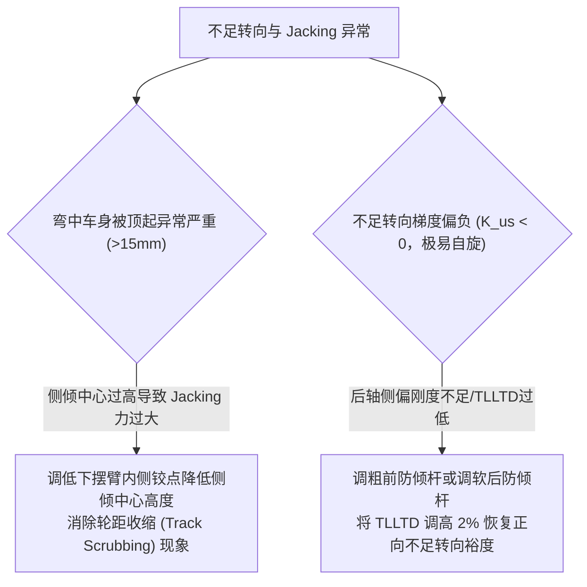

# 第 12 章 操稳第一 KPI 不足转向梯度与 Jacking

---

## 1. 物理图景与工程痛点

在底盘车辆动力学中，**稳态不足转向梯度 (Understeer Gradient, $K_{us}$)** 是衡量一辆赛车是“推头（Understeer）”、“过度转向（Oversteer）”还是“中性转向（Neutral Steer）”的最权威终极判据。

许多初学者常误以为不足转向仅由前后质量分配决定，然而在真实极限赛车中，**轮胎非线性载荷敏感性（Jensen 不等式）与悬架 Jacking 抬升力**才是主导操稳平衡的深层物理机理：
1. **Jensen 不等式导致的“载荷转移抓地力净损失”**：轮胎侧偏刚度随垂直载荷呈凹函数非线性（concave，图像上凸）。左右轮载荷转移虽然使外侧轮正压力增加、内侧轮正压力减少，但**外侧轮获得的抓地力增量永远小于内侧轮损失的抓地力**，导致整个车轴的总侧偏刚度随载荷转移加剧而净衰减；
2. **Jacking 几何抬升力与车高失稳**：当车身侧向力作用于倾斜的摆臂力线时，正视瞬心（IC）高度将横向侧向力分解为向上的垂向推力（Jacking Force），强行将车身顶起，改变离地间隙与空气动力学平台。

---

## 2. 底层数学力学严密推导

```
   侧偏力 Fy (N)
        ^                               .---' (线性外推)
        |                           .--'
        |                       .--'
        |                   .--' (实际轮胎实际轮胎凹函数曲线(∩形): d²Fy/dFz² < 0)
        |               .--'
        |           .--'
        |       .--'
  ------+------+------------------------+----------------------> 垂直载荷 Fz (N)
        |     Fz_in (内侧轮)          Fz_out (外侧轮)
        |      <-- ΔFz 减载 -->        <-- ΔFz 增载 -->
```

### 2.1 轮胎载荷敏感性（Jensen 不等式视角）严格数学证明

设轮胎侧偏力为垂直载荷 $F_z$ 的函数 $F_y(F_z)$。在轮胎物理学中，由于胎面接地印痕橡胶摩擦系数随压强增大而衰减，函数 $F_y(F_z)$ 在全受力域内为严格的**凹函数（Strictly Concave Function，图像上凸呈 ∩ 形）**：
$$\frac{d F_y}{d F_z} > 0, \quad \frac{d^2 F_y}{d F_z^2} < 0 \quad (\forall F_z > 0)$$

设车轴初始左右轮静态载荷对称：$F_{z1}^0 = F_{z2}^0 = F_{z0}$。
当产生侧向载荷转移 $\Delta F_z$ 时，左右轮载荷变为 $F_{z1} = F_{z0} - \Delta F_z$ 与 $F_{z2} = F_{z0} + \Delta F_z$。

对左右轮侧偏力在 $F_{z0}$ 处作二阶泰勒展开：
$$F_y(F_{z0} - \Delta F_z) = F_y(F_{z0}) - F_y'(F_{z0}) \Delta F_z + \frac{1}{2} F_y''(F_{z0}) (\Delta F_z)^2 + O((\Delta F_z)^3)$$
$$F_y(F_{z0} + \Delta F_z) = F_y(F_{z0}) + F_y'(F_{z0}) \Delta F_z + \frac{1}{2} F_y''(F_{z0}) (\Delta F_z)^2 + O((\Delta F_z)^3)$$

相加得到该车轴在载荷转移下的总侧偏力 $\Sigma F_y$：
$$\Sigma F_y(\Delta F_z) = F_y(F_{z0} - \Delta F_z) + F_y(F_{z0} + \Delta F_z) = 2 F_y(F_{z0}) + \underbrace{F_y''(F_{z0}) (\Delta F_z)^2}_{< 0 \text{ (严格负项)}}$$

#### 结论（载荷敏感性抓地力损失）：
$$\Sigma F_y(\Delta F_z) < 2 F_y(F_{z0}) = \Sigma F_y(\Delta F_z = 0)$$
**物理意义**：只要该车轴分担的载荷转移量 $\Delta F_z$ 增加，该车轴的等效总侧偏刚度 $\Sigma C_\alpha$ 必然发生非线性净衰减。因此，**增大前轴载荷转移（提高 TLLTD%）会直接削弱前轴侧偏能力，从而增大不足转向（推头）**。

---

### 2.2 考虑 Pacejka 载荷敏感度 $LS$ 的动态不足转向梯度 $K_{us}$

在 Pacejka 魔术公式体系中，单轮侧偏刚度 $C_\alpha(F_z) = \left.\frac{d F_y}{d\alpha}\right|_{\alpha=0} = B C D(F_z)$：
$$C_\alpha(F_z) = B C F_{y0} \left(\frac{F_z}{F_{zNom}}\right) \left[1 - LS \left(\frac{F_z}{F_{zNom}} - 1\right)\right]$$
其中 $LS \in [0.05, 0.35]$ 为轮胎无量纲载荷敏感度衰退系数。

在侧向加速度 $a_y$ 下，前后轴需要的总侧滑角为：
$$\alpha_f = \frac{m_T a_y \frac{b}{L}}{C_{\alpha,FL}(F_{z,FL}) + C_{\alpha,FR}(F_{z,FR})}, \quad \alpha_r = \frac{m_T a_y \frac{a}{L}}{C_{\alpha,RL}(F_{z,RL}) + C_{\alpha,RR}(F_{z,RR})}$$

#### 稳态不足转向梯度定义：
$$K_{us} = \frac{d(\alpha_f - \alpha_r)}{d(a_y / g)} \approx \frac{m_T g \frac{b}{L}}{\Sigma C_{\alpha,f}(F_z)} - \frac{m_T g \frac{a}{L}}{\Sigma C_{\alpha,r}(F_z)} \quad [^\circ/g]$$

* **$K_{us} > 0$（不足转向 / Understeer）**：前轴侧滑角大于后轴，打方向手感线性，极限容易被车手掌控；
* **$K_{us} = 0$（中性转向 / Neutral Steer）**：转弯半径由低侧偏理论决定（阿克曼几何为其零侧偏特例）；
* **$K_{us} < 0$（过度转向 / Oversteer）**：后轴侧滑角大于前轴，存在临界失稳车速（Critical Speed），极易发生自旋（Spin）。

---

### 2.3 悬架 Jacking 几何抬升力与垂向位移

在正视平面中，轮胎侧向力 $F_y$ 沿着连接接地点 $\boldsymbol{p}_{CP}$ 与正视瞬心 $\boldsymbol{p}_{IC}$ 的空间力线传递。
力线与地面的夹角正切值为：
$$\tan\theta_{IC,i} = \frac{IC_{z,i}}{IC_{y,i} - CP_{y,i}}$$

该侧向力在车身中心产生的垂向抬升力（Jacking Force）为：
$$F_{jack,w} = F_{y,w} \cdot \tan\theta_{IC,w}$$

#### 全车总 Jacking 力与车身抬升量：
$$F_{jack,tot} = \sum_{w} F_{y,w} \tan\theta_{IC,w} \approx m_s a_y \;\text{（顶起的是簧载质量，取 } m_s\text{；区别于 } K_{us} \text{ 公式承载全重的 } m_T\text{）} \left[\left(\frac{b}{L}\right) \frac{z_{rc,f}}{t_f / 2} + \left(\frac{a}{L}\right) \frac{z_{rc,r}}{t_r / 2}\right]$$
车身稳态垂直浮起位移为：
$$\Delta Z_{heave} = \frac{F_{jack,tot}}{K_{heave,tot}} = \frac{F_{jack,tot}}{2(K_{w,f} + K_{w,r})}$$

---

## 3. 核心控制变量与参数灵敏度分析

| 操稳平衡变量 | 物理定义 | 黄金设计视窗 (GT3/FSAE) | 调校敏感性导数 |
| :--- | :--- | :--- | :--- |
| **不足转向梯度 ($K_{us}$)** | 衡量赛车转弯极限特性的总指挥指标 | $+0.4^\circ/g \sim +1.2^\circ/g$ | $\frac{\partial K_{us}}{\partial \text{TLLTD}} > 0$（方向性杠杆；**增益非普适常数**：按本章自家模型在 1.2g 工作点数值扰动仅约 $+0.004^\circ/g$，文献经验值 $0.05\sim0.1$ 只对低载荷敏感度胎成立，务必当车重标） |
| **轮胎载荷敏感度 ($LS$)** | 轮胎抓地力随载荷衰退率 | 赛用热熔胎: $0.08\sim 0.15$<br/>民用四季胎: $0.25\sim 0.35$ | $LS$ 越大，载荷转移带来的抓地力衰减惩罚越严重 |
| **Jacking 抬升位移 ($\Delta Z_{heave}$)** | 极限过弯时车身被顶起的高度 | 控制在 $< 8.0\,\text{mm}$ | 降低侧倾中心高度可直接成倍压降 Jacking 抬升 |

---

## 4. LABSUS 代码实现与数值稳定性技巧

### 4.1 核心代码映射
* **不足转向梯度与 Jacking 解算**（内嵌于 [`engine/src/api/chassis.py`](file:///c:/Users/zzy/Desktop/New_suspension/LABSUS/engine/src/api/chassis.py#L365-L444) 的 `_us_curve()`，下为核心逻辑示意）：
  ```python
  def calc_us_gradient_and_jacking(Fz_wheels, tire_mf, ay_g, ms, a, b, tf, tr, z_rc_f, z_rc_r, Kw_f, Kw_r):
      # 1. 计算 4 轮非线性 Pacejka 侧偏刚度
      C_alpha = {}
      for k, Fz in Fz_wheels.items():
          fn = max(100.0, Fz) / tire_mf.FzNom
          D = tire_mf.Fy0 * fn * (1.0 - tire_mf.LS * (fn - 1.0))
          C_alpha[k] = tire_mf.By * tire_mf.Cy * D

      # 2. 计算前后轴总侧滑角与不足转向梯度
      C_f = C_alpha["FL"] + C_alpha["FR"]
      C_r = C_alpha["RL"] + C_alpha["RR"]
      W_f = ms * 9.81 * (b / (a + b))
      W_r = ms * 9.81 * (a / (a + b))
      K_us_rad_g = (W_f / C_f) - (W_r / C_r)
      K_us_deg_g = K_us_rad_g * (180.0 / math.pi)

      # 3. 计算 Jacking 抬升力
      F_jack = ms * (ay_g * 9.81) * ((b/(a+b))*(z_rc_f/1000)/(tf/2) + (a/(a+b))*(z_rc_r/1000)/(tr/2))
      dZ_heave = (F_jack / (2.0 * (Kw_f + Kw_r))) * 1000.0 # mm
      return K_us_deg_g, F_jack, dZ_heave
  ```

---

## 5. 手把手工程数值算例 (Worked Example)

### 算例背景：GT3 赛车不足转向梯度与 Jacking 力全流程手算
延续第 11 章算例所得的 4 轮动载荷（$a_y = 1.2g$）：
* 前轮载荷：$F_{z,FL} = 1,282.2\,\text{N}, \; F_{z,FR} = 5,247.8\,\text{N}$
* 后轮载荷：$F_{z,RL} = 1,115.2\,\text{N}, \; F_{z,RR} = 4,715.4\,\text{N}$
* 轮胎魔术公式参数：$F_{zNom} = 3,500\,\text{N}, \; F_{y0} = 4,200\,\text{N}, \; B_y = 10.5, \; C_y = 1.30, \; LS = 0.15$（教学演示参：按第 13 章 §2.1b 自检落峰 $\alpha_{peak}\approx 13.7^\circ$，生产标定口径 $B_y\approx 20$）
* 轮端刚度：$K_{w,f} = 65.0\,\text{N/mm} = 65,000\,\text{N/m}, \; K_{w,r} = 75.0\,\text{N/mm} = 75,000\,\text{N/m}$

#### 步骤 1：计算四轮当前动态侧偏刚度 $C_\alpha$
基准乘积因子：$B C F_{y0} = 10.5 \times 1.30 \times 4200.0 = 57,330.0\,\text{N/rad}$
* **左前轮 FL** ($fn = 1282.2 / 3500 = 0.3663$)：
  $$C_{\alpha,FL} = 57330 \times 0.3663 \times [1 - 0.15(0.3663 - 1)] = 21000 \times 1.0950 = \mathbf{22,995\,\text{N/rad}}$$
* **右前轮 FR** ($fn = 5247.8 / 3500 = 1.4994$)：
  $$C_{\alpha,FR} = 57330 \times 1.4994 \times [1 - 0.15(1.4994 - 1)] = 85960 \times 0.9251 = \mathbf{79,521\,\text{N/rad}}$$
* **前轴总侧偏刚度**：$\Sigma C_{\alpha,f} = 22995 + 79521 = \mathbf{102,516\,\text{N/rad}}$

* **左后轮 RL** ($fn = 1115.2 / 3500 = 0.3186$)：
  $$C_{\alpha,RL} = 57330 \times 0.3186 \times [1 - 0.15(0.3186 - 1)] = 18267 \times 1.1022 = \mathbf{20,134\,\text{N/rad}}$$
* **右后轮 RR** ($fn = 4715.4 / 3500 = 1.3473$)：
  $$C_{\alpha,RR} = 57330 \times 1.3473 \times [1 - 0.15(1.3473 - 1)] = 77241 \times 0.9479 = \mathbf{73,217\,\text{N/rad}}$$
* **后轴总侧偏刚度**：$\Sigma C_{\alpha,r} = 20134 + 73217 = \mathbf{93,351\,\text{N/rad}}$

#### 步骤 2：计算稳态不足转向梯度 $K_{us}$
静态轴荷重力：$W_f = 6,530.0\,\text{N}, \; W_r = 5,830.6\,\text{N}$：
$$K_{us} = \left(\frac{6530.0}{102516} - \frac{5830.6}{93351}\right) \times \frac{180^\circ}{\pi} = (0.063697 - 0.062459) \times 57.2958 = +0.001238 \times 57.2958 = \mathbf{+0.071^\circ/g}$$
* **评价**：$K_{us} = +0.071^\circ/g$ 已十分接近中性转向（低于黄金视窗 $+0.4\sim +1.2^\circ/g$ 的下限），车尾趋于活跃、对操控精度要求极高；如需更稳健，应朝微推头方向提高 TLLTD 或增大后轴抓地。

#### 步骤 3：计算 Jacking 抬升力与车身浮起量
$$F_{jack} = 1150 \times 11.772 \times \left[\left(\frac{1.40}{2.65}\right) \frac{0.045}{0.84} + \left(\frac{1.25}{2.65}\right) \frac{0.065}{0.84}\right] = 13537.8 \times [0.02830 + 0.03651] = 13537.8 \times 0.06481 = \mathbf{877.4\,\text{N}}$$
$$\Delta Z_{heave} = \frac{877.4}{2 \times (65000 + 75000)} = \frac{877.4}{280000} = 0.00313\,\text{m} = \mathbf{+3.13\,\text{mm}}$$
* 车身在 $1.2g$ 极限过弯时产生 $3.13\,\text{mm}$ 的平稳几何抬升，完全在设计安全余量之内。

---

## 6. 赛道工程师实战调校与故障排查指南



---

### 本章小结
本章用轮胎载荷敏感性（Jensen 不等式视角）与悬架 Jacking 抬升解释不足转向梯度的深层机理，给出 $K_{us}$ 与 Jacking 力的闭式解。它是操稳平衡的"终极裁判"，也是第 24 章 19 项 KPI 调校杠杆的收口指标，为第四篇轮胎力学的非线性侧偏刚度提供了应用出口。
