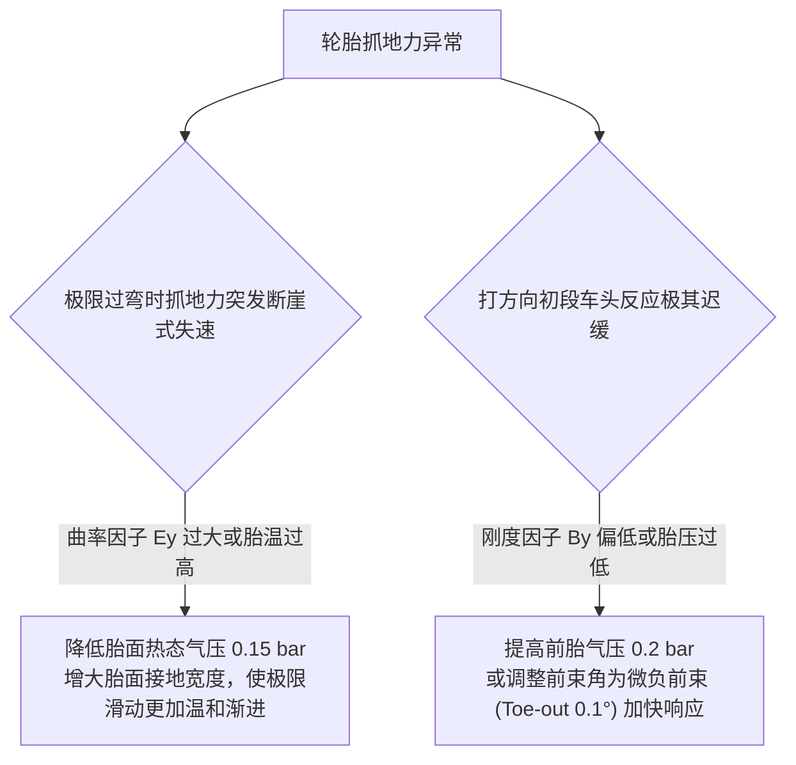

# 第 13 章 从刷子模型到 Pacejka 魔术公式演进

---

## 1. 物理图景与工程痛点

在全车动力学仿真与底盘调校中，**轮胎是连接赛车与地面的唯一物理媒介**。车辆所有的加速、制动、过弯侧向力与自对准力矩，全部源自接地印痕（Contact Patch / Footprint）内仅有数张明信片大小的橡胶与沥青表面的分子级剪切与摩擦。

在建立轮胎力学模型时，工程界经历了两大经典发展阶段：
1. **Fiala 刷子物理模型（Physical Brush Model）**：从弹性橡胶微元（Bristles）与抛物线压力分布的第一性原理出发，推导出轮胎从线性弹性粘着区（Adhesion Zone）向极限滑动区（Sliding Zone）过渡的物理闭式解；
2. **Pacejka 魔术公式（Magic Formula, MF）**：用最优雅的三角函数嵌套形式，仅需 $B, C, D, E$ 四个宏观核心参数即可高精度拟合全受力域的侧偏力、纵向力与回正力矩，成为当今全球汽车工业与赛车界的统一行业标准。

---

## 2. 底层数学力学严密推导

```
   [Fiala 刷子物理模型: 弹性微元 + 库仑摩擦]
                      | (宏观三角函数参数化)
                      v
   [Pacejka 魔术公式: y(x) = D · sin(C · arctan(B·x - E(B·x - arctan(B·x))))]
                      |
        +-------------+-------------+
        |                           |
   [D: 峰值附着力]             [B: 刚度刚化因子]
   [C: 曲线形状因子]           [E: 极限后衰退曲率因子]
```

### 2.1 Fiala 弹性刷子物理模型完整解析推导

设轮胎接地印痕长度为 $2a$，宽度为 $b$，垂直载荷为 $F_z$。
沿接触印痕纵向坐标 $x \in [0, 2a]$（$x=0$ 为印痕前端入点，$x=2a$ 为后端出点），接地法向接触压力假定为抛物线分布（此处 $q(x)$ 为按单位印痕宽度归一化的线载荷 N/m，即法向压强 $\times$ 宽度 $b$）：
$$q(x) = \frac{3 F_z}{4 a} \left[1 - \left(\frac{x}{a} - 1\right)^2\right] = \frac{3 F_z}{4 a^3} x (2a - x)$$

轮胎胎面被离散为沿侧向刚度为 $c_p$ 的独立弹性刷子微元。当车轮以侧偏角 $\alpha$ 行驶时，微元侧向弹性变形为：
$$v(x) = x \cdot \tan\alpha$$
微元产生的弹性剪切应力为 $\tau(x) = c_p v(x) = c_p x \tan\alpha$。

根据库仑摩擦定律，微元能够承受的最大静摩擦剪切应力为：
$$\tau_{max}(x) = \mu \cdot q(x) = \frac{3 \mu F_z}{4 a^3} x (2a - x)$$

#### (1) 临界分离点 $x_c$：
当剪切应力达到摩擦极限（$\tau(x_c) = \tau_{max}(x_c)$）时，橡胶微元开始发生相对滑动。解方程：
$$c_p x_c \tan\alpha = \frac{3 \mu F_z}{4 a^3} x_c (2a - x_c) \implies x_c = 2a - \frac{4 a^3 b c_p}{3 \mu F_z} \tan\alpha$$

定义初始零侧偏刚度为 $C_{y0} = \left.\frac{dF_y}{d\alpha}\right|_{\alpha=0} = 2 a^2 b c_p$。定义临界滑移角 $\alpha_{crit}$：
$$\tan\alpha_{crit} = \frac{3 \mu F_z}{C_{y0}}$$

#### (2) 侧偏力分段积分闭式方程：
* **弹性与部分滑动混合区间 ($|\tan\alpha| \le \tan\alpha_{crit}$)**：
  对前半段粘着区 $[0, x_c]$ 的弹性力与后半段滑动区 $[x_c, 2a]$ 的摩擦力联合积分：
  $$F_y(\alpha) = \int_0^{x_c} c_p x \tan\alpha \, dx + \int_{x_c}^{2a} \mu q(x) \, dx = C_{y0} \tan\alpha \left[1 - \frac{C_{y0} |\tan\alpha|}{3 \mu F_z} + \frac{1}{3} \left(\frac{C_{y0} \tan\alpha}{3 \mu F_z}\right)^2\right]$$
* **全域完全滑动区间 ($|\tan\alpha| > \tan\alpha_{crit}$)**：
  全部微元达到滑动极限，总力饱和为库仑纯滑动摩擦力：
  $$F_y(\alpha) = \mu F_z \cdot \operatorname{sgn}(\alpha)$$

---

#### 2.1b 刷子 → 魔术公式的定量映射（"演进"的桥）
两套模型在**线性段与峰值**上严格对接：
$$D = \mu F_z, \qquad B C D = C_{y0} = 2a^2 b c_p, \qquad \tan\alpha_{crit} = \frac{3\mu F_z}{C_{y0}} = \frac{3D}{B C D}$$
反算路线：实测 $C_{y0}$（小角度斜率）与 $\mu$（峰值/载荷）后，取形状 $C$ 定 $B = C_{y0}/(C D)$，曲率 $E$ 由峰后衰退斜率配。
**落峰自检**（对任意 $B,C,E$ 成立的不变量）：先解 $\phi_p = \tan(\pi/2C)$，再由 $u - E(u - \arctan u) = \phi_p$ 数值解 $u_p$，则峰值侧偏角 $\alpha_{peak} = u_p / B$。
真实竞赛光头胎要求 $\alpha_{peak} \in [6^\circ, 10^\circ]$。目标 $8^\circ$、$C=1.35$、$E=-0.25$ 需 $B \approx 16.5$；$B$ 偏小时落峰后移、手感迟且回正弱。此自检式是 §3 表与 §5 算例的核对基准。

### 2.2 Pacejka 魔术公式标准形式与四主参数物理意义

Pacejka 魔术公式将复杂的刷子积分统一为通用的三角函数形式：
$$y(x) = D \sin\left(C \arctan\left(B x - E (B x - \arctan(B x))\right)\right)$$
在纯侧偏工况下，$y = F_y, \; x = \alpha$（单位度或弧度）：

```
侧偏力 Fy (N)
   ^                                  [峰值点: 坐标 (α_peak, D)]
   |                                     .---.
   |                                 .--'     `--.  [极限后衰退: 由 E 决定]
   |                             .--'             `--.
   |                         .--'
   |                     .--' (原点初始斜率: B·C·D = C_α)
   |                 .--'
 --+----------------+--------------------------------------------------> 侧偏角 α (deg)
   |
```

1. **峰值因子 (Peak Factor, $D$)**：
   $$D = \mu \cdot F_z$$
   决定了轮胎能够爆发的绝对最大附着力峰值；
2. **形状因子 (Shape Factor, $C$)**：
   决定曲线整体形态（渐近线趋向）。纯侧偏力典型取 $C_y \in [1.25, 1.45]$，纯纵向力取 $C_x \in [1.55, 1.75]$；
3. **刚度因子 (Stiffness Factor, $B$)**：
   原点处初始斜率（侧偏刚度）严格等于三大参数的连乘积：
   $$C_\alpha = \left.\frac{dF_y}{d\alpha}\right|_{\alpha=0} = B \cdot C \cdot D \implies B = \frac{C_\alpha}{C \cdot D}$$
4. **曲率因子 (Curvature Factor, $E$)**：
   控制曲线越过峰值点后的非线性软化与衰退斜率（$E \le 1.0$）。

---

### 2.3 非线性载荷敏感性与外倾推力合成

#### (1) 载荷敏感度 (Load Sensitivity, $LS$)：
设标称基准测试载荷为 $F_{zNom}$（如 $3,500\,\text{N}$），在任意动态垂直载荷 $F_z$ 下，峰值附着力 $D(F_z)$ 满足：
$$D(F_z) = F_{y0} \cdot \left(\frac{F_z}{F_{zNom}}\right) \left[1 - LS \cdot \left(\frac{F_z}{F_{zNom}} - 1\right)\right]$$

#### (2) 外倾推力 (Camber Thrust) 叠加项：
当车轮存在外倾角 $\gamma$ 时，轮胎印痕横向剪切产生额外推力。在小角度下为线性外倾刚度 $C_\gamma$：
$$F_{y,camber} = C_\gamma \cdot \gamma \cdot \left(\frac{F_z}{F_{zNom}}\right)$$
$$F_{y,total}(\alpha, \gamma, F_z) = F_y^{MF}(\alpha, F_z) + F_{y,camber}$$

---

### 2.4 回正力矩 (Self-Aligning Torque) 最小闭合
兑现 §1 的承诺，给出全书使用的最简结构：
$$M_z = F_y \cdot t_{total}, \qquad t_{total} = t_{trail}\,(\text{机械拖距，第 5 章}) + t_p\,(\text{气动拖距} \approx 0.03 \sim 0.06\,\text{m})$$
正方向按全书权威框以行列式代数定义（绕 $+Z$ 上轴），与 SAE(Z 下) 教科书口径反号，交叉引用时注意。
引擎 `tire_mf.py::mz()` 当前以 60 mm 总拖距占位（S1 精度等级）；含压缩中心迁移的高保真回正力矩登记为后续议程。


## 3. 核心控制变量与参数灵敏度分析

| Pacejka 参数 | 物理意义 | 典型数值 (GT3 光头胎) | 动力学与圈速影响 |
| :--- | :--- | :--- | :--- |
| **标称峰值力 ($F_{y0}$)** | 在标称载荷 $F_{zNom}$ 下的最大侧向力 | $4,800 \sim 5,800\,\text{N}$（$\mu \approx 1.55$） | 决定稳态过弯的最大侧向 G 值极限 |
| **刚度因子 ($B_y$)** | 侧偏刚度建立速率 | $10.0 \sim 13.5$ | $B_y$ 越大，转向响应越犀利敏锐，但极限宽容度越窄 |
| **曲率因子 ($E_y$)** | 越过极限后的衰退特性 | $-0.5 \sim +0.2$ | $E_y < 0$ 极限后温和渐进；$E_y > 0.5$ 极限断崖式摔落 |
| **载荷敏感度 ($LS$)** | 垂直载荷衰退系数 | $0.10 \sim 0.18$ | $LS$ 越低，赛车对载荷转移的惩罚越小，底盘调校宽容度越大 |
| **落峰自检 ($\alpha_{peak}$)** | §2.1b 不变量由 $B,C,E$ 反解 | 竞赛光头胎 $6^\circ \sim 10^\circ$；生产标定基准 $B_y \approx 20$（引擎 G24 修标定所得） | 任何辨识/选型结果先过落峰门，再谈 RMS —— $B_y<14$ 即落峰 $>10^\circ$，判不合格 |

---

## 4. LABSUS 代码实现与数值稳定性技巧

### 4.1 核心代码映射
* **魔术公式物理计算内核**：生产实现为 [`engine/src/tire_mf.py`](file:///c:/Users/zzy/Desktop/New_suspension/LABSUS/engine/src/tire_mf.py#L52-L67) 的 `MagicFormulaSub.fy()`（纯侧偏 + Sh/Sv 偏移，**不含**外倾项）；外倾推力在 `transient.py` 轮端层以 $-C_g \gamma F_z$（$C_g$ 单位 N/rad，左轮经镜像规则处理）装配。下为两者合并的**教学示意**：
  ```python
  def fy(self, alpha_deg: float, fz: float) -> np.ndarray:
      fn = max(100.0, Fz) / mf.FzNom
      D = mf.Fy0 * fn * (1.0 - mf.LS * (fn - 1.0))
      B = mf.By
      C = mf.Cy
      E = mf.Ey

      # Pacejka 标准三角函数求值
      Bx = B * (alpha_deg * math.pi / 180.0)  # 侧偏角转弧度，与算例/生产代码一致
      phi = Bx - E * (Bx - math.atan(Bx))
      Fy_pure = D * math.sin(C * math.atan(phi))

      # 叠加外倾推力
      Fy_camber = mf.C_gamma * gamma_deg * fn
      return Fy_pure + Fy_camber
  ```

---

## 5. 手把手工程数值算例 (Worked Example)

### 算例背景：GT3 竞赛光头胎侧偏力与外倾推力手算
已知轮胎魔术公式参数：
* 标称载荷：$F_{zNom} = 3500.0\,\text{N}$
* 峰值系数：$F_{y0} = 4900.0\,\text{N}$（$\mu_{nom} = F_{y0}/F_{zNom} = 1.40$）
* 形状与刚度：$B_y = 11.2, \; C_y = 1.35, \; E_y = -0.25, \; LS = 0.12$
* 外倾刚度：$C_\gamma = 65.0\,\text{N/deg}$

已知某工况下载荷条件为：
* 动态垂向力：$F_z = 4200.0\,\text{N}$（归一化载荷 $fn = 4200 / 3500 = 1.20$）
* 侧偏角：$\alpha = +4.50^\circ$
* 动态外倾角：$\gamma = -3.20^\circ$

#### 步骤 1：计算载荷敏感度修正后的峰值力 $D$
$$D(4200) = 4900.0 \times 1.20 \times [1 - 0.12 \times (1.20 - 1.0)] = 5880.0 \times [1 - 0.024] = 5880.0 \times 0.976 = \mathbf{5,738.88\,\text{N}}$$

#### 步骤 2：Pacejka 复合三角函数内核求值
* 自变量：$Bx = B_y \cdot \alpha = 11.2 \times 4.5^\circ \times \left(\frac{\pi}{180}\right) = 11.2 \times 0.07854\,\text{rad} = 0.87965$
* 反正切：$\arctan(Bx) = \arctan(0.87965) = 0.72140\,\text{rad}$
* 曲率调制项：
  $$\phi = Bx - E_y (Bx - \arctan(Bx)) = 0.87965 - (-0.25) \times (0.87965 - 0.72140) = 0.87965 + 0.25 \times 0.15825 = 0.91921$$
* 内部正切：$\arctan(\phi) = \arctan(0.91921) = 0.74312\,\text{rad}$
* 纯侧偏力：
  $$F_{y,pure} = D \sin(C_y \times 0.74312) = 5738.88 \times \sin(1.35 \times 0.74312) = 5738.88 \times \sin(1.00321\,\text{rad}) = 5738.88 \times 0.84319 = \mathbf{4,838.97\,\text{N}}$$

#### 步骤 3：计算外倾推力并合成总侧向力
$$F_{y,camber} = C_\gamma \cdot \gamma \cdot fn = 65.0 \times (-3.20) \times 1.20 = \mathbf{-249.60\,\text{N}}$$
*(注：对于外侧车轮，负外倾产生指向弯内的同向推力，绝对值相加)*：
$$F_{y,total} = 4838.97 + 249.60 = \mathbf{5,088.57\,\text{N}}$$
* **结论**：负外倾为该轮胎额外带来了 $+5.16\%$ 的侧向抓地力红利！

#### 步骤 4：落峰自检（对算例参数的诚实注记）
本例 $B_y = 11.2$、$C_y = 1.35$、$E_y = -0.25$：$\phi_p = 2.314$，解得 $u_p = 2.075$，
$$\alpha_{peak} = u_p / B_y = 2.075/11.2 = 0.185\,\text{rad} = \mathbf{10.6^\circ}$$
**超出竞赛胎 $[6^\circ,10^\circ]$ 窗口**——本算例为教学演示取参（低 $B$ 曲线直观、数值便于核对）；生产口径 $B_y \approx 20$（同 $C,E$ 下落峰回到 $6.0^\circ$，与引擎 G24 标定一致）。
真实流程中任何一组 $B,C,E$ 都必须先过此门。

---

## 6. 赛道工程师实战调校与故障排查指南



---

### 本章小结
本章从 Fiala 刷子模型的粘着/滑动区积分推导侧偏力的立方非线性形态，再过渡到 Pacejka 魔术公式的 B/C/D/E 四参数与载荷敏感度 LS，架起"物理机型"与"工程拟合"之间的桥。它是第 14 章复合滑移摩擦圆与第 15 章参数辨识的输入，也是第 12 章不足转向梯度中非线性侧偏刚度的来源。
