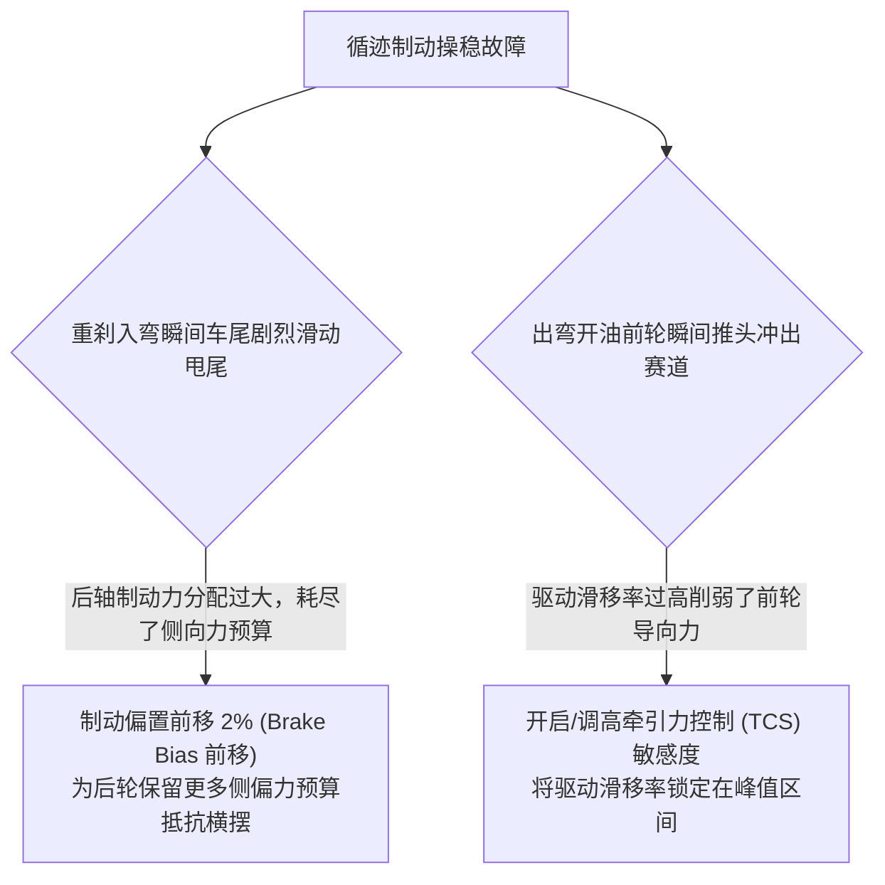

# 第 14 章 复合滑移摩擦圆与动态松弛长度时延

---

## 1. 物理图景与工程痛点

在真实的赛道激烈驾驶中，车手很少处于“纯直线制动”或“纯匀速过弯”的理想状态。在**循迹制动（Trail Braking）进弯**或**全油门出弯（Power-on Exit）**工况下，轮胎必须同时提供纵向力（制动力/驱动力 $F_x$）与横向力（导向力 $F_y$）。

在复合滑移与动态响应建模中，工程师必须解决两大核心物理难题：
1. **摩擦力椭圆（Friction Ellipse）预算耗尽与非线性衰退**：轮胎接地印痕的总摩擦力受黏着极限严格限制。当车手踩下重刹（纵向占用了约 $80\%$ 的摩擦预算）时，按 §2.3 的摩擦圆，侧向可调用份额降至 $\sqrt{1-0.8^2} \approx 60\%$——且随滑移加深呈加速收缩；
2. **轮胎侧向力建立的物理滞后（松弛长度 Relaxation Length, $\sigma$）**：当车手瞬间转动方向盘时，轮胎侧偏力并不是瞬间达到的，而是需要车轮向前滚动一段物理距离（胎体骨架发生剪切扭曲）后才能完全建立。若忽略松弛长度，仿真中的赛车将表现出非物理的瞬时超敏反应。

---

## 2. 底层数学力学严密推导

```
                      纵向制动力 Fx
                           ^
                           |   .---. (摩擦圆边界)
                           |.-'     `-.
                           /           \  [复合力矢量 F_total(s)]
                          |      *------+
                          |     /|      |
  ------------------------+----+--------+---------------------> 侧向力 Fy
                          |    | Fy     |
                           \   |       /
                            `-.|     .-'
                               `---'
```

### 2.1 归一化复合滑移向量 (Normalized Combined Slip Vector)

设轮胎纵向滑移率为 $\kappa = \frac{\omega R_e - u}{u}$，侧偏角为 $\alpha$。
分别定义纵向与侧向无量纲归一化等效滑移：
$$s_x = B_x \cdot \kappa, \quad s_y = B_y \cdot \tan\alpha$$

总复合滑移标量 $s$ 定义为其欧几里得范数：
$$s = \|\boldsymbol{s}\|_2 = \sqrt{s_x^2 + s_y^2} = \sqrt{(B_x \kappa)^2 + (B_y \tan\alpha)^2}$$

---

### 2.2 总力标量计算与空间方向各向同性分解

根据复合滑移标量 $s$，调用统一的无量纲魔术公式核心计算总摩擦力标量 $F_{total}(s)$：
$$\phi(s) = s - E (s - \arctan(s))$$
$$F_{total}(s) = D(F_z) \cdot \sin\left(C \arctan(\phi(s))\right)$$

#### 纵向力与侧向力方向正交分解：
当 $s > 0$ 时，总力沿滑移向量方向进行几何投影分解：
$$F_x = F_{total}(s) \cdot \frac{s_x}{s} = F_{total}(s) \cdot \frac{B_x \kappa}{\sqrt{(B_x \kappa)^2 + (B_y \tan\alpha)^2}}$$
$$F_y = F_{total}(s) \cdot \frac{s_y}{s} + F_{y,camber} = F_{total}(s) \cdot \frac{B_y \tan\alpha}{\sqrt{(B_x \kappa)^2 + (B_y \tan\alpha)^2}} + C_\gamma \gamma F_z$$

---

### 2.3 摩擦圆定理严格数学证明

#### 定理证明：
对于忽略外倾推力的基准状态，计算两分力的平方和：
$$F_x^2 + F_y^2 = \left(F_{total}(s) \frac{s_x}{s}\right)^2 + \left(F_{total}(s) \frac{s_y}{s}\right)^2 = [F_{total}(s)]^2 \frac{s_x^2 + s_y^2}{s^2} \equiv [F_{total}(s)]^2$$
由于魔术公式峰值有界性 $F_{total}(s) \le D = \mu F_z$：
$$F_x^2 + F_y^2 \le (\mu F_z)^2$$
**结论**：纵向/侧向取同一峰值 $\mu F_z$ 时，该模型严格满足**各向同性摩擦圆约束**，杜绝多向力叠加超过物理附着极限；若纵向与横向峰值摩擦不同（$\mu_x \ne \mu_y$），圆约束应推广为椭圆 $\left(\frac{F_x}{\mu_x F_z}\right)^2 + \left(\frac{F_y}{\mu_y F_z}\right)^2 \le 1$。

---

### 2.4 松弛长度一阶微分方程与无条件稳定指数解析解

设轮胎在侧向的物理松弛长度为 $\sigma_y$（Relaxation Length，赛用光头胎典型值 $0.20 \sim 0.35\,\text{m}$）。
车身瞬时几何侧偏角为 $\alpha_{geom}$，轮胎胎体实际生效的有效动态侧偏角为 $\alpha_{eff}$。

在前进车速 $u$ 下，一阶弹性延迟微分方程（ODE）为：
$$\frac{\sigma_y}{u} \frac{d\alpha_{eff}}{dt} + \alpha_{eff}(t) = \alpha_{geom}(t) \iff \tau_{relax} \dot{\alpha}_{eff} + \alpha_{eff} = \alpha_{geom}, \quad \tau_{relax} = \frac{\sigma_y}{u}$$

#### 无条件稳定解析指数步进解：
若直接采用前向欧拉离散，稳定域为 $\Delta t < 2\tau = 2\sigma/u$：高速、短松弛长度或**大子步**（如 $\Delta t = 0.05$s、$u = 40$m/s、$\sigma = 0.3$m 时比值达 6.7）都会发散。LABSUS 采用了在区间 $[t, t+\Delta t]$ 内假设输入恒定的**精确指数积分闭式解**：
$$\alpha_{eff}(t + \Delta t) = \alpha_{geom} + \left[\alpha_{eff}(t) - \alpha_{geom}\right] \exp\left(-\frac{u \Delta t}{\sigma_y}\right)$$

* **数学特性**：衰减因子 $\rho = \exp\left(-\frac{u \Delta t}{\sigma_y}\right) \in (0, 1)$。无论 $\Delta t$ 取多大，该精确指数解始终单调稳定、无超调——其机理是**无条件耗散**（一阶滞后本质是低通能量吸收，并非能量守恒）。

---

## 3. 核心控制变量与参数灵敏度分析

| 复合滑移参数 | 物理定义 | 典型取值 | 赛道操稳机理 |
| :--- | :--- | :--- | :--- |
| **松弛长度 ($\sigma_y$)** | 侧偏力建立所需的轮胎滚动距离 | 方程式: $0.18\sim 0.25\,\text{m}$<br/>GT3: $0.28\sim 0.38\,\text{m}$ | $\sigma_y$ 越短，方向盘响应越紧绷灵敏；过短会导致转向过于神经质 |
| **滑移刚度比 $\frac{B_x}{B_y}$** | 纵向刚度与横向刚度比值 | $1.15 \sim 1.35$ | 纵向制动刚度通常高于横向侧偏刚度 |
| **循迹制动余量** | 弯前打方向时的制动开度上限 | $\text{Brake} \le 1.0 - 0.65 \times \frac{|\delta|}{28^\circ}$ | 保护侧向力不被重刹完全耗尽 |

---

## 4. LABSUS 代码实现与数值稳定性技巧

### 4.1 核心代码映射
* **松弛时延求解**（真实实现见 [`engine/src/solver/transient.py`](file:///c:/Users/zzy/Desktop/New_suspension/LABSUS/engine/src/solver/transient.py#L330-L341) 的 `step()`；复合滑移投影为教学示意，生产代码以松弛滞后 + 独立魔术公式计算）：
  ```python
  sigma = max(0.3, self.Ls)
  vx_now = max(float(s2[3]), 0.0)
  for w in _WHEELS:
      tsw = self._ts[w]
      tsw.alpha_lat += (tsw.alpha_st - tsw.alpha_lat) * (
          1.0 - math.exp(-dt * vx_now / sigma))   # 精确指数解，无条件稳定
  ```

---

## 5. 手把手工程数值算例 (Worked Example)

### 算例背景：循迹制动重刹入弯工况复合力与松弛更新手算
已知轮胎参数：
* 标称峰值力 $F_{y0} = 5000.0\,\text{N}, \; B_x = 13.5, \; B_y = 11.0, \; C = 1.35, \; E = -0.20, \; LS = 0.10$（教学值注：本组参落峰 $\alpha_{peak}\approx 10.8^\circ$、$\kappa_{peak}\approx 5.5\%$；竞赛胎须按第 13 章 §2.1b 门 $[6^\circ,10^\circ]$ 重标后取用，复合包络形状本身不受影响）
* 松弛长度 $\sigma_y = 0.25\,\text{m}$，外倾刚度 $C_\gamma = 50.0\,\text{N/deg}$
* 垂直载荷：$F_z = 3500.0\,\text{N}$（$fn = 1.0, D = 5000.0\,\text{N}$）

工况条件：
* 车速 $u = 36.0\,\text{m/s}$（$130\,\text{km/h}$），子步长 $\Delta t = 0.001\,\text{s}$
* 纵向滑移率（重度制动）：$\kappa = -0.06$（$-6\%$ 制动滑移）
* 几何瞬时侧偏角：$\alpha_{geom} = +3.50^\circ = 0.061086\,\text{rad}$
* 上一子步有效侧偏角初值：$\alpha_{eff}(0) = +2.00^\circ = 0.034907\,\text{rad}$
* 动态外倾角：$\gamma = -2.50^\circ$（外侧轮：负外倾产生指向弯心的外倾推力，取 $|\gamma|$ 计入）

#### 步骤 1：精确指数松弛时延更新 $\alpha_{eff}$
计算时间常数与指数衰减因子：
$$\rho = \exp\left(-\frac{u \Delta t}{\sigma_y}\right) = \exp\left(-\frac{36.0 \times 0.001}{0.25}\right) = \exp(-0.144) = 0.865888$$
$$\begin{aligned} \alpha_{eff}(\Delta t) &= 0.061086 + (0.034907 - 0.061086) \times 0.865888 \\ &= 0.061086 - 0.026179 \times 0.865888 = 0.061086 - 0.022668 = \mathbf{0.038418\,\text{rad}} \approx \mathbf{2.201^\circ} \end{aligned}$$
* **物理意义**：车身打到 $3.5^\circ$，但经 $1\,\text{ms}$ 滚动后，轮胎有效剪切角仅建立至 $2.201^\circ$。

#### 步骤 2：计算复合滑移向量 $\boldsymbol{s}$
$$s_x = B_x \cdot \kappa = 13.5 \times (-0.06) = -0.8100$$
$$s_y = B_y \cdot \tan(0.038418) = 11.0 \times 0.038437 = +0.4228$$
$$s = \sqrt{(-0.8100)^2 + 0.4228^2} = \sqrt{0.65610 + 0.17876} = \sqrt{0.83486} = \mathbf{0.91370}$$

#### 步骤 3：计算总摩擦力标量 $F_{total}(s)$
$$\phi = s - E(s - \arctan s) = 0.91370 - (-0.20) \times (0.91370 - \arctan(0.91370)) = 0.91370 + 0.20 \times (0.91370 - 0.74043) = 0.94835$$
$$F_{total} = 5000.0 \times \sin(1.35 \times \arctan(0.94835)) = 5000.0 \times \sin(1.35 \times 0.75883\,\text{rad}) = 5000.0 \times \sin(1.0244\,\text{rad}) = 5000.0 \times 0.85437 = \mathbf{4,271.85\,\text{N}}$$

#### 步骤 4：正交分解纵向制动力与侧向过弯力
* **纵向制动力**：
  $$F_x = F_{total} \times \frac{s_x}{s} = 4271.85 \times \left(\frac{-0.8100}{0.91370}\right) = \mathbf{-3,787.05\,\text{N}}$$
* **侧向过弯力**（含外倾推力）：
  $$F_y = F_{total} \times \frac{s_y}{s} + C_\gamma \gamma fn = 4271.85 \times \left(\frac{0.4228}{0.91370}\right) + 50.0 \times 2.50 \times 1.0 = 1976.45 + 125.00 = \mathbf{+2,101.45\,\text{N}}$$
* **摩擦圆校验**：
  $$\sqrt{F_x^2 + (F_y - 125)^2} = \sqrt{3787.05^2 + 1976.45^2} = \sqrt{14341748 + 3906354} = 4,271.85\,\text{N} \equiv F_{total}$$
  完全自洽且严格处于 $\le 5,000\,\text{N}$ 摩擦圆内！

---

## 6. 赛道工程师实战调校与故障排查指南



---

### 本章小结
本章把纵向与侧向滑移合成归一化复合滑移向量，用摩擦圆约束分解总摩擦力，并用松弛长度的精确指数解刻画侧偏力建立的物理滞后。它是第 13 章魔术公式向"循迹制动/全油门出弯"复合工况的推广，也是第 15 章 TRF 辨识与第 16 章瞬态动力学轮胎层之间的接口。
