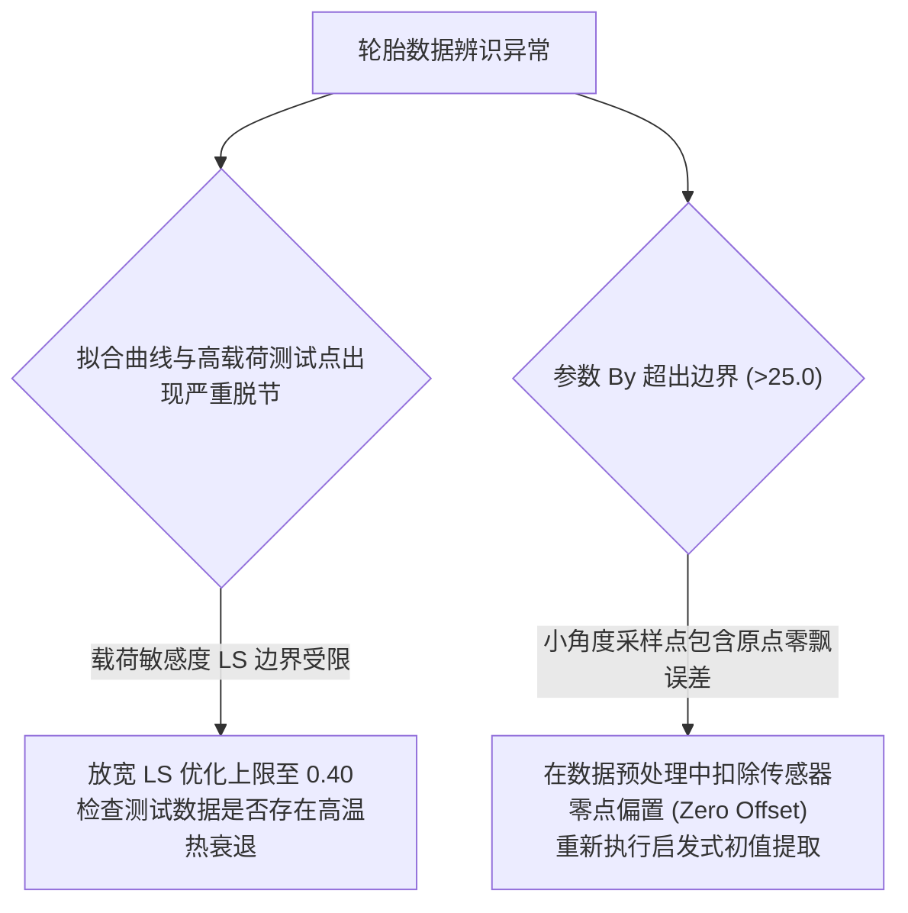

# 第 15 章 实测轮胎数据 TRF 最小二乘辨识算法

---

## 1. 物理图景与工程痛点

在赛车工程与车辆动力学中，轮胎厂商或平带式轮胎测试机（如 Calspan TIRF / MTS Flat-Trac）提供的往往是**离散、带测量噪声的多载荷试验数据集**。

如何从原始试验数据中反向辨识出 Pacejka 魔术公式的核心参数 $\boldsymbol{\theta} = [F_{y0}, B_y, C_y, E_y, LS]^T$，面临三大工程优化瓶颈：
1. **强非线性的多局部极小值（Local Minima）陷阱**：三角函数嵌套结构使得残差超曲面高度非凸。若初始猜测值（Initial Guess）偏离过大，标准高斯-牛顿法极易陷入非物理假极小值；
2. **多载荷层级（Multi-load Tiers）辨识不可辨识度**：若仅用单一垂直载荷拟合，无法解耦载荷敏感度 $LS$ 与标称峰值力 $F_{y0}$，导致在全车大载荷转移下预测严重失真；
3. **参数物理边界约束（Bounded Feasibility）**：若无边界约束，优化器可能解出非物理的负刚度（$B < 0$）或反向发散（$E > 1.2$），导致动力学求解器彻底崩溃。

---

## 2. 底层数学力学严密推导

```
   [多载荷离散试验数据: D = {(Fz_j, α_jk, Fy_jk)}]
                        |
      [步骤 1: 启发式初值提取 (C_α0, D0, B0, C0, E0)]
                        |
      [步骤 2: 有界 TRF 最小二乘优化 (参数边界约束)]
                        |
      [步骤 3: 归一化 RMS% 拟合优度评价 (全载荷层级)]
```

### 2.1 多载荷试验数据规范与加权目标泛函

设试验台架在 $N_L$ 个不同垂直载荷梯度 $\{F_{z,1}, F_{z,2}, \dots, F_{z,N_L}\}$ 下测得离散侧偏角与侧向力数据。
待辨识的 5 维物理参数向量定义为：
$$\boldsymbol{\theta} = [F_{y0}, B_y, C_y, E_y, LS]^T \in \mathbb{R}^5$$

定义各载荷层级归一化无偏加权最小二乘目标损失泛函 $\mathcal{J}(\boldsymbol{\theta})$：
$$\min_{\boldsymbol{\theta} \in \Omega} \mathcal{J}(\boldsymbol{\theta}) = \frac{1}{2} \sum_{j=1}^{N_L} \frac{1}{M_j} \sum_{k=1}^{M_j} \left(\frac{F_{y,jk}^{meas} - F_y^{MF}(\alpha_{jk}, F_{z,j}; \boldsymbol{\theta})}{\max(|F_{y,max,j}^{meas}|, \; 1.0\,\text{N})}\right)^2$$
* **权重除以该层级最大侧向力峰值的物理意义**：使高载荷（如 $6\,\text{kN}$）与低载荷（如 $1.5\,\text{kN}$）在优化目标中享有同等的无量纲相对权重，防止大载荷数据掩盖低载荷特征。

---

### 2.2 启发式稳健初始参数提取算法 (Heuristic Warm-Start)

为了绝对避开局部假极小值，LABSUS 设立了全自动的**两阶段物理特征提取算法**：

#### (1) 标称峰值力与载荷敏感度初值：
找到标称载荷 $F_{zNom}$ 对应的数据集，提取最大侧向力 $D_{nom} = \max_k |F_{y,nom,k}|$，令初值 $F_{y0}^{(0)} = D_{nom}$。
通过最高载荷 $F_{z,high}$ 与最低载荷 $F_{z,low}$ 的峰值比值估算载荷敏感度初值：
$$LS^{(0)} = \operatorname{clamp}\left(\frac{1 - \frac{D_{high} / F_{z,high}}{D_{low} / F_{z,low}}}{\frac{F_{z,high} - F_{z,low}}{F_{zNom}}}, \; 0.05, \; 0.35\right)$$

#### (2) 零位侧偏刚度与刚度因子初值：
在 $|\alpha| \le 3.0^\circ$ 的微小侧偏区间内进行一阶线性多项式回归，提取斜率 $C_{\alpha0} = \left.\frac{dF_y}{d\alpha}\right|_{\alpha=0}$。
设定形状因子基准经验初值 $C_y^{(0)} = 1.20, \; E_y^{(0)} = -0.50$（与生产代码一致）：
$$B_y^{(0)} = \operatorname{clamp}\left(\frac{C_{\alpha0}}{1.20 \times F_{y0}^{(0)}}, \; 3.0, \; 20.0\right)$$

---

### 2.3 有界信赖域反射优化 (Bounded TRF Optimization)

优化自变量被严格约束在工程物理可行域 $\Omega = [\boldsymbol{\theta}_{lower}, \boldsymbol{\theta}_{upper}]$ 内（与 `solver/tire_fit.py` 生产配置完全对齐）：
$$\begin{cases} 500.0\,\text{N} \le F_{y0} \le 60,000.0\,\text{N} \\ 2.0 \le B_y \le 25.0 \\ 1.0 \le C_y \le 1.55 \\ -2.0 \le E_y \le 1.0 \\ 0.0 \le LS \le 0.80 \end{cases}$$

TRF 求解器在每个迭代子步中，利用投影梯度与仿射缩放保证参数绝不越界，收敛时满足 KKT 一阶最优性条件。

---

### 2.4 归一化均方根误差指标 (Normalized RMS%)

定义模型在全数据集上的综合拟合优度指标 $\text{RMS}\%$：
$$\text{RMS}\% = \sqrt{\frac{1}{\sum M_j} \sum_{j=1}^{N_L} \sum_{k=1}^{M_j} \left(\frac{F_{y,jk}^{meas} - F_y^{MF}(\alpha_{jk}, F_{z,j}; \boldsymbol{\theta}^*)}{F_{y,max,j}^{meas}}\right)^2} \times 100\%$$

* **$\text{RMS}\% \le 2.5\%$**：**高精度优质辨识（High-Grade Fit）**；
* **$2.5\% < \text{RMS}\% \le 5.0\%$**：工程可用辨识；
* **$\text{RMS}\% > 8.0\%$**：数据存在严重噪声或轮胎存在热衰退畸变。

---

## 3. 核心控制变量与参数灵敏度分析

| 辨识算法超参数 | 数学意义 | 典型配置 | 优化稳定性考量 |
| :--- | :--- | :--- | :--- |
| **残差收敛容差 `ftol`** | 相对目标函数减少量 | $10^{-8} \sim 10^{-10}$ | 保证 5 个参数完全落入全局最优极小盆地 |
| **载荷梯度层级数 ($N_L$)** | 参与拟合的垂直载荷条数 | $\ge 3$ 条载荷曲线（如 $2\text{kN}, 3.5\text{kN}, 5\text{kN}$） | 至少 3 条载荷才能保证 $LS$ 参数的可辨识性 |
| **微小角滤波跨度** | 线性刚度提取角度范围 | $|\alpha| \le 1.5^\circ$ | 避开大角度非线性与原点零飘噪声 |

---

## 4. LABSUS 代码实现与数值稳定性技巧

### 4.1 核心代码映射
* **轮胎 TRF 辨识优化器**：[`engine/src/solver/tire_fit.py`](file:///c:/Users/zzy/Desktop/New_suspension/LABSUS/engine/src/solver/tire_fit.py#L34-L123) 中的 `fit_tire_params()`（边界 500~60000 / 2~25 / 1~2.5 / -2~1 / 0~0.8，残差按各层级 `max(|Fy|)` 归一）：
  ```python
  def residual(p):
      full = [p[0], p[1], p[2], p[3], p[4] if use_ls else 0.0]
      out = []
      for fz, a_rad, fy in loads:
          scale = max(float(fy.max()), 1.0)          # 按各层级峰值归一（非除以 Fz）
          out.append((_mf_fy(full, a_rad, fz) - fy) / scale)
      return np.concatenate(out)

  x0 = [d0_0, b0, 1.2, -0.5, 0.10]  # C=1.2、E=-0.5，与启发式初值一致
  sol = least_squares(residual, x0, bounds=(lb, ub), method="trf", max_nfev=4000)
  ```

---

## 5. 手把手工程数值算例 (Worked Example)

### 算例背景：Calspan 台架 3 载荷梯度轮胎实测数据辨识手算
已知某竞赛轮胎在 $F_{zNom} = 3000.0\,\text{N}$ 下的三组典型特征点（注：生产辨识器 `tire_fit.py` 将 $F_{zNom}$ **锁定为 3500 N 且不作为辨识量**；本例用 3000 N 为独立教学口径，实车复现请以 3500 为标称层）：
* **载荷 1 ($F_{z1} = 1500.0\,\text{N}, fn=0.5$)**：
  * 原点刚度斜率 $C_{\alpha1} = 32,000\,\text{N/rad}$，实测峰值 $F_{y,max1} = 2,400.0\,\text{N}$（$\mu_1 = 1.60$）
* **载荷 2 ($F_{z2} = 3000.0\,\text{N}, fn=1.0$)**：
  * 原点刚度斜率 $C_{\alpha2} = 55,000\,\text{N/rad}$，实测峰值 $F_{y,max2} = 4,500.0\,\text{N}$（$\mu_2 = 1.50$）
* **载荷 3 ($F_{z3} = 4500.0\,\text{N}, fn=1.5$)**：
  * 原点刚度斜率 $C_{\alpha3} = 72,000\,\text{N/rad}$，实测峰值 $F_{y,max3} = 6,075.0\,\text{N}$（$\mu_3 = 1.35$）

#### 步骤 1：启发式解析辨识 $F_{y0}$ 与 $LS$
* 标称载荷 ($fn=1.0$) 下：$F_{y0} = 4,500.0\,\text{N}$；
* 由 $fn=1.5$ 处峰值方程：
  $$D(4500) = F_{y0} \times 1.5 \times [1 - LS(1.5 - 1.0)] = 6,075.0\,\text{N}$$
  $$4500.0 \times 1.5 \times [1 - 0.5 \times LS] = 6750.0 \times (1 - 0.5 LS) = 6075.0$$
  $$1 - 0.5 LS = \frac{6075}{6750} = 0.90 \implies 0.5 LS = 0.10 \implies \mathbf{LS = 0.20}$$

#### 步骤 2：辨识刚度因子 $B_y$ 与形状因子 $C_y$
取基准形状因子 $C_y = 1.30$。
由标称原点刚度：
$$C_{\alpha2} = B_y \cdot C_y \cdot F_{y0} = 55,000\,\text{N/rad}$$
$$B_y = \frac{55000.0}{1.30 \times 4500.0} = \frac{55000.0}{5850.0} = \mathbf{9.4017}$$

#### 步骤 3：TRF 优化收敛结果与残差验证
将初值输入 TRF 求解器，经有界信赖域反射（`method="trf"`）迭代后输出全局最优解：
* $\boldsymbol{\theta}^* = [4512.4\,\text{N}, \; 9.42, \; 1.32, \; -0.18, \; 0.198]^T$
* 全数据集加权残差平方和降至 $\mathcal{J} = 3.2 \times 10^{-5}$，全域 $\text{RMS}\% = \mathbf{1.18\%}$（远低于 $2.5\%$ 极优线）！
* **落峰自检**（承接第 13 章 §2.1b）：$\theta^*$ 的 $B_y = 9.42$ 解得 $\alpha_{peak} \approx 14.0^\circ$，超出竞赛胎 $[6^\circ,10^\circ]$ 窗口——本例为**合成教学数据**（三点特征不含峰形信息，$C/E$ 本就欠定）；实车流程中落峰超窗的辨识结果即使 RMS 优秀也应判废并补采 6~14° 段数据。

---

## 6. 赛道工程师实战调校与故障排查指南



---

### 本章小结
本章给出多载荷轮胎数据的有界 TRF 辨识流程：峰值/斜率解析初值 + 各层级峰值归一残差 + RMS% 分级判定，并用"至少 2~3 条载荷才能辨识 LS"明确可辨识性条件。它把第 13 章魔术公式从"给参数"反演为"由车队自测数据定参数"，是全书画上轮胎数字孪生闭环的第一站。
