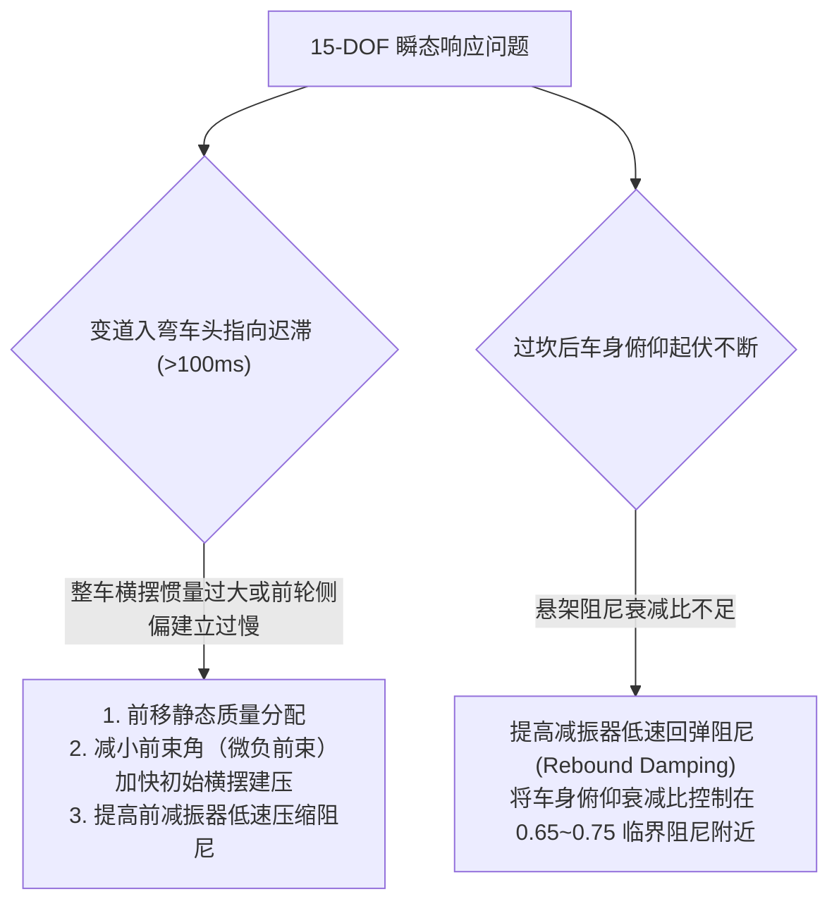

# 第 16 章 15 自由度状态空间微分方程组建立

---

## 1. 物理图景与工程痛点

在车辆动力学建模的发展历程中，传统的二自由度单轨自行车模型（Bicycle Model）仅能解释稳态线性区响应，无法应对真实赛道的极限工况。

在极限赛道驾驶（重刹入弯、飞坡跳台、单边压路肩）中，赛车面临剧烈的**三维空间多体姿态与轮端动态耦合**：
1. **三维空间欧拉角姿态变化改变轮胎定位角**：车身俯仰（Pitch $\theta$）与侧倾（Roll $\phi$）直接改变了四轮离地间隙、轮胎垂直载荷与动态外倾角；
2. **四轮独立垂向跳动与横向稳定杆力偶传递**：左右轮悬架的跳动行程与减振器压缩速率存在强非线性非对称性；
3. **四轮驱动/制动自转滑移解耦**：车轮转动惯量与打滑状态直接支配着牵引力控制系统（TCS）与 ABS 系统的稳定性；
4. **刚柔耦合高频振荡的数值积分挑战**：悬架大刚度弹簧与减振器冲击具有极高的自振频率（$>80\,\text{Hz}$），若采用常规 60Hz 帧率积分必然发生发散爆炸。

为此，LABSUS 构建了包含 **车身 6-DOF 空间姿态 + 四轮独立悬架垂向随动 + 四轮独立自转 4-DOF** 的非线性动力学仿真系统（"15 自由度"为项目代号，严格口径见 §2.1 维数说明），并以 **1000Hz 高频子步半隐式（辛）欧拉积分器** 保证数值稳定（悬架固有频率 ~80Hz 时显式稳定窗约 Δt<4ms，1ms 子步留有充分裕度——是"足够快"，非"无条件"）。

---

## 2. 底层数学力学严密推导

```
                      +Z (Up 向上)
                       |
               [车体 6-DOF 空间刚体: X, Y, Z, φ, θ, ψ, u, v, w, p, q, r]
                       |
        +--------------+--------------+
        |                             |
  [前悬架 2-DOF 垂向]           [后悬架 2-DOF 垂向]
  (tr_FL, tr_FR)                (tr_RL, tr_RR)
        |                             |
  [前轮自转 2-DOF]              [后轮自转 2-DOF]
  (ω_FL, ω_FR)                  (ω_RL, ω_RR)
```

### 2.1 15 自由度全系统状态向量与坐标系定义

全局状态向量 $\boldsymbol{S}(t) \in \mathbb{R}^{15}$ 定义为：
$$\boldsymbol{S} = [\underbrace{X, Y, Z}_{\text{车身空间位置}}, \; \underbrace{\phi, \theta, \psi}_{\text{车身欧拉角}}, \; \underbrace{u, v, w}_{\text{机体坐标系线速度}}, \; \underbrace{p, q, r}_{\text{机体坐标系角速度}}, \; \underbrace{\omega_{FL}, \omega_{FR}, \omega_{RL}, \omega_{RR}}_{\text{四轮自转角速度}}]^T$

> **维数口径**："15-DOF" 为项目历史代号。严格口径：动力学自由度 = 车身构型 6 + 车轮自转 4 = 10，四轮悬架行程 $tr_w$ 为车身位姿的代数输出（见 §2.3）；若按上图所列（含位置、姿态、线速、角速、轮速五层）则为 16 个分量。

> [!NOTE]
> **LABSUS 机体坐标系（Body Frame）通道与代码对齐**：  
> * **纵向（Longitudinal）**：$+X$ 朝前，前进线速度为 $u$，空气阻力与驱动/制动力沿此轴作用；  
> * **侧向（Lateral）**：$+Y$ 朝右，侧向侧滑线速度为 $v$，转向向心力与侧偏力沿此轴作用；  
> * **垂向（Vertical）**：$+Z$ 朝上，垂向跳动线速度为 $w$；  
> * **旋转角速度**：侧倾角速度 $p$（绕 $X$ 轴）、俯仰角速度 $q$（绕 $Y$ 轴）、横摆角速度 $r$（绕 $Z$ 轴）。

> [!WARNING]
> **符号语义权威声明（全书唯一裁判）**：
> * 本书分量架为 X 前 / Y 右 / Z 上（与 `convention.py` 一致），该架在物理意义上为左手系，故全书**以行列式的代数展开定义为叉积**（$\dot{\boldsymbol{v}} + \boldsymbol{\omega} \times \boldsymbol{v}$ 按标准行列式逐项展开），角速度正方向**定义为"使对应欧拉角增大者"**，不依赖右手法则做物理判向。
> * 欧拉角正方向钉死：$\psi$ 正 = 车头向右偏转（航向顺时针增，与第 19 章 $\psi=\operatorname{atan2}(t_y,t_x)$ 同一约定）；$\theta$ 正 = 车头抬头；$\phi$ 正 = 右侧下沉（右弯载荷转移时的侧倾姿态）。对应 $p = \dot\phi$、$q = \dot\theta$、$r = \dot\psi$。
> * 按此定义，§2.3 四角公式 $\dot z = w + x_w q - y_w p$ 与第 18 章"制动点头 $\theta<0$、抬头 $\theta>0$ 增大前离地间隙"完全自洽——§2.2 与 §2.3 从此共用同一套符号。
> * **实现差异警示**：仓库现存的 `web/js/11-stages.js` 仍按旧分量架书写（X 右 / Y 前，见其 L338、L742 注释），对照代码时须将数组前两分量互换。"与代码对齐"指**物理一致**，不是分量顺序相同。

---

### 2.2 车身 6-DOF 牛顿-欧拉动力学微分方程组

在非惯性旋转机体坐标系中，牛顿第二定律与欧拉动力学方程形式为：

#### (1) 线动量微分方程（含向心与柯氏加速度项）：
$$\begin{cases} m (\dot{u} - v r + w q) = \Sigma F_{x,total} - F_{drag} \quad (\text{纵向}) \\ m (\dot{v} + u r - w p) = \Sigma F_{y,total} \quad (\text{侧向}) \\ m (\dot{w} + v p - u q) = \Sigma F_{z,total} - m g \cos\theta \cos\phi - F_{down} \quad (\text{垂向}) \end{cases}$$

#### (2) 角动量微分方程（欧拉动力学方程）：
设机体坐标轴与车身惯性主轴重合，惯性矩为 $I_{xx}, I_{yy}, I_{zz}$：
$$\begin{cases} I_{xx} \dot{p} - (I_{yy} - I_{zz}) q r = \Sigma M_x \quad (\text{车身侧倾 roll}) \\ I_{yy} \dot{q} - (I_{zz} - I_{xx}) r p = \Sigma M_y \quad (\text{车身俯仰 pitch}) \\ I_{zz} \dot{r} - (I_{xx} - I_{yy}) p q = \Sigma M_z \quad (\text{车身横摆 yaw}) \end{cases}$$

#### (3) 空间姿态运动学转换方程：
由机体角速度 $(p, q, r)$ 转换到世界坐标系欧拉角变化率 $(\dot{\phi}, \dot{\theta}, \dot{\psi})$：
$$\begin{bmatrix} \dot{\phi} \\ \dot{\theta} \\ \dot{\psi} \end{bmatrix} = \begin{bmatrix} 1 & \sin\phi \tan\theta & \cos\phi \tan\theta \\ 0 & \cos\phi & -\sin\phi \\ 0 & \sin\phi \sec\theta & \cos\phi \sec\theta \end{bmatrix} \begin{bmatrix} p \\ q \\ r \end{bmatrix}$$

---

### 2.3 四轮独立悬架垂向 4-DOF 运动学与支承力

四轮相对质心的平面硬点为 $(x_w, y_w)$（$FL: (a, -t_F/2), \; FR: (a, t_F/2), \; RL: (-b, -t_R/2), \; RR: (-b, t_R/2)$）。

在瞬态运动中，车身四角点在空间的绝对垂向位移与跳动速率为：
$$z_{corner,w} = Z + x_w \sin\theta - y_w \sin\phi, \quad \dot{z}_{corner,w} = w + x_w q - y_w p$$

悬架跳动行程与压缩速率为（$z_{road,w}$ 为路面局部高程）：
$$tr_w = -(z_{corner,w} - z_{road,w}), \quad \dot{tr}_w = -\dot{z}_{corner,w}$$

#### 四角悬架法向支承力合成：
$$F_{z,w} = \max\left(0, \; F_{z0,w} \cos\theta \cos\phi + K_{w,eff} tr_w + F_{damper}(\dot{tr}_w) \pm F_{arb} + F_{bumpstop}(tr_w)\right)$$

---

### 2.4 四轮独立自转 4-DOF 动力学方程

对于每个车轮 $w \in \{FL, FR, RL, RR\}$，轮总成转动惯量为 $I_w$：
$$I_w \frac{d\omega_w}{dt} = T_{drive,w} - T_{brake,w} \cdot \operatorname{sgn}(\omega_w) - F_{x,w} R_{e,w}$$
其中 $R_{e,w}$ 为轮胎有效滚动半径。

---

### 2.5 1000Hz 高频子步半隐式欧拉积分算法

为了保证在复杂路面冲击与大刚度下的数值稳定性，LABSUS 采用了 **1000Hz 子步长（$\Delta t = 0.001\,\text{s}$）半隐式欧拉积分器**：

```
+-------------------------------------------------------------------------------+
| 图形渲染主帧周期 Δt_frame (如 16.6ms):                                          |
| While (t_remain > 0):                                                         |
|   1. 取微子步 dt = min(0.001s, t_remain)                                      |
|   2. 评估路面几何与气动力 (F_down, F_drag)                                     |
|   3. 求解四角悬架力与轮胎复合滑移力 (Fx,w, Fy,w, Fz,w)                          |
|   4. 计算线加速度与角加速度: [u_dot, v_dot, w_dot, p_dot, q_dot, r_dot, ω_dot] |
|   5. 速度半隐式推进: v(t+dt) = v(t) + a(t)·dt                                  |
|   6. 位置姿态推进: X(t+dt) = X(t) + v(t+dt)·dt                                 |
|   7. t_remain -= dt                                                           |
+-------------------------------------------------------------------------------+
```

---

## 3. 核心控制变量与参数灵敏度分析

| 整车物理参数 | 典型数值 (GT3 赛车) | 动力学影响机理 | 调校敏感性 |
| :--- | :--- | :--- | :--- |
| **整车质量 ($m$)** | $1,250\,\text{kg}$ | 决定全车惯性力与加减速极限 | 轻量化带来全方位的动力学性能提升 |
| **横摆转动惯量 ($I_{zz}$)** | $1,800\,\text{kg}\cdot\text{m}^2$ | 决定车头横摆响应滞后（Yaw Response Lag） | 质量向质心集中可大幅减小 $I_{zz}$，加快变道反应 |
| **俯仰转动惯量 ($I_{yy}$)** | $2,100\,\text{kg}\cdot\text{m}^2$ | 决定制动点头与加速仰头的时间常数 | 影响重刹入弯时动态前轴载荷的建立速度 |

---

## 4. LABSUS 代码实现与数值稳定性技巧

### 4.1 核心代码映射
* **15-DOF 动力学引擎**：[`web/js/11-stages.js`](file:///c:/Users/zzy/Desktop/New_suspension/LABSUS/web/js/11-stages.js#L283-L570) 中的 `VehicleDynamics15DOF.step()`。

---

## 5. 手把手工程数值算例 (Worked Example)

### 算例背景：GT3 赛车制动兼过弯工况单步（1ms）动力学积分手算
已知赛车状态：
* 质量 $m = 1250.0\,\text{kg}, \; I_{zz} = 1800.0\,\text{kg}\cdot\text{m}^2$，质心距前/后轴 $a = 1.25\,\text{m}, b = 1.40\,\text{m}$
* 当前车速：$u = 50.0\,\text{m/s}$（前进速度），横向侧滑速度 $v = 0.5\,\text{m/s}$，横摆角速度 $r = 0.15\,\text{rad/s}$
* 积分步长：$\Delta t = 0.001\,\text{s}$

在当前步各车轮合力计算结果为：
* 四轮总纵向制动力：$\Sigma F_x = -12,000.0\,\text{N}$，空气阻力 $F_{drag} = 1,500.0\,\text{N}$
* 四轮总侧向力：前轴 $\Sigma F_{y,f} = +5,000.0\,\text{N}$，后轴 $\Sigma F_{y,r} = +4,200.0\,\text{N} \implies \Sigma F_y = +9,200.0\,\text{N}$
* 前后轮距 $t_F = t_R = 1.68\,\text{m}$

#### 步骤 1：计算纵向加速度 $\dot{u}$（计入柯氏项 $v \cdot r$）
$$m (\dot{u} - v r) = \Sigma F_x - F_{drag} = -12000.0 - 1500.0 = -13,500.0\,\text{N}$$
$$\dot{u} = \frac{-13500.0}{1250.0} + v r = -10.80 + (0.5 \times 0.15) = -10.80 + 0.075 = \mathbf{-10.725\,\text{m/s}^2}$$

#### 步骤 2：计算侧向加速度 $\dot{v}$（计入向心项 $-u \cdot r$）
$$m (\dot{v} + u r) = \Sigma F_y = +9,200.0\,\text{N}$$
$$\dot{v} = \frac{+9200.0}{1250.0} - u r = +7.360 - (50.0 \times 0.15) = +7.360 - 7.500 = \mathbf{-0.140\,\text{m/s}^2}$$

#### 步骤 3：计算横摆角加速度 $\dot{r}$
总横摆力矩由前后轴侧向力力臂决定：
$$\Sigma M_z = \Sigma F_{y,f} \cdot a - \Sigma F_{y,r} \cdot b = 5000.0 \times 1.25 - 4200.0 \times 1.40 = 6250.0 - 5880.0 = +370.0\,\text{N}\cdot\text{m}$$
$$\dot{r} = \frac{\Sigma M_z}{I_{zz}} = \frac{370.0}{1800.0} = \mathbf{+0.2056\,\text{rad/s}^2}$$

#### 步骤 4：半隐式欧拉单步积分更新
* $u(t+\Delta t) = 50.0 + (-10.725) \times 0.001 = \mathbf{49.989275\,\text{m/s}}$
* $v(t+\Delta t) = 0.5 + (-0.140) \times 0.001 = \mathbf{0.499860\,\text{m/s}}$
* $r(t+\Delta t) = 0.15 + (0.2056) \times 0.001 = \mathbf{0.150206\,\text{rad/s}}$
* 车辆在 $1\,\text{ms}$ 内完成了高保真平滑物理推进！

---

## 6. 赛道工程师实战调校与故障排查指南



---

### 本章小结
本章在标准机体坐标系（纵向 X、侧向 Y、垂向 Z，roll 绕 X / pitch 绕 Y / yaw 绕 Z）下建立 15 自由度牛顿-欧拉状态方程组与 1000Hz 半隐式积分，给出车身姿态-悬架-轮胎自转的完整耦合。它是第五篇的骨架：第 17 章非线性减振器与第 18 章气动力都作为外力/力矩注入本方程的右端项。
