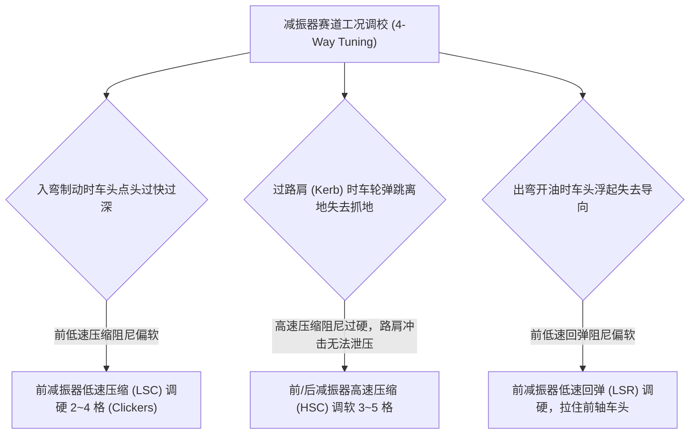

# 第 17 章 四象限非线性减振器与限位块击穿模型

---

## 1. 物理图景与工程痛点

减振器（Damper / Shock Absorber）是悬架系统中唯一的**主动能量耗散与瞬态阻尼调控元件**。在赛车动力学中，弹簧只决定了车身侧倾与俯仰的最终稳态幅值，而**减振器决定了达到这一稳态的瞬态时间响应历程与动态载荷转移速率**。

在赛车减振器设计中，单系数线性阻尼模型完全无法满足真实赛道需求：
1. **压缩与回弹的严重非对称性 (Bump/Rebound Asymmetry)**：回弹阻尼（Rebound）通常需要是压缩阻尼（Bump）的 2~3 倍，以有效抑制车身过坎后的二次弹跳；
2. **低速操控与高速过坎的矛盾（双速拐点 Blow-off 泄压阀）**：
   * **低速阻尼区间 ($v < 0.13\,\text{m/s}$)**：由车身侧倾和俯仰引起，需要极高的阻尼系数以提供稳固的车身瞬态支撑；
   * **高速阻尼区间 ($v > 0.13\,\text{m/s}$，回弹拐点 0.18)**：由路面颠簸或压路肩引起，必须通过泄压阀（Blow-off Valve）大幅降低阻尼斜率，允许车轮快速让位，避免冲击力直接破坏轮胎附着力；
3. **行程极限处的限位块（Bump Stop）渐进击穿**：当悬架发生大行程压缩进入最后 $15\,\text{mm}$ 时，微孔聚氨酯缓冲块发生剧烈的高次渐进硬化，防止金属硬碰撞损坏悬架。

---

## 2. 底层数学力学严密推导

```
   阻尼力 F_damper (N)
         ^                                  [压缩高速 Blow-off: 斜率 0.38*C_b]
         |                                     /
         |                  [拐点 v_kB]       /
         |                       +-----------/
         |                      / (压缩低速斜率 C_b)
         |                     /
  -------+--------------------+------------------------------------> 轮跳压缩速度 d(tr)/dt (m/s)
         |                   /
         |                  /  (回弹低速斜率 C_r)
         |      +----------/   [拐点 v_kR]
         |     /
         |    /  [回弹高速 Blow-off: 斜率 0.38*C_r]
         v
```

### 2.1 四象限非线性减振器分段解析方程

设车轮相对车身的垂直跳动速度为 $v_{rel} = \dot{tr} = \frac{d(tr)}{dt}$（$v_{rel} > 0$ 表示压缩 Jounce，增载正力；$v_{rel} < 0$ 表示回弹 Rebound，减载负力）。

定义低速压缩阻尼系数为 $C_b$、低速回弹阻尼系数为 $C_r$；
定义压缩低高速拐点速度为 $v_{kB} = 0.13\,\text{m/s}$、回弹低高速拐点速度为 $v_{kR} = 0.18\,\text{m/s}$；
定义高速泄压阀斜率折减因子为 $\mathrm{BLOW} = 0.38$。

#### (1) 压缩象限力学方程 ($v_{rel} \ge 0$)：
$$F_{damper}(v_{rel}) = \begin{cases} C_b \cdot v_{rel} & 0 \le v_{rel} \le v_{kB} \\ C_b \cdot v_{kB} + (C_b \cdot \mathrm{BLOW}) \cdot (v_{rel} - v_{kB}) & v_{rel} > v_{kB} \end{cases}$$

#### (2) 回弹象限力学方程 ($v_{rel} < 0$)：
令 $v = |v_{rel}|$：
$$F_{damper}(v_{rel}) = \begin{cases} -C_r \cdot v & 0 \le v \le v_{kR} \\ -\left[C_r \cdot v_{kR} + (C_r \cdot \mathrm{BLOW}) \cdot (v - v_{kR})\right] & v > v_{kR} \end{cases}$$

---

### 2.2 渐进微孔聚氨酯限位块 (Bump Stop) 击穿模型

设悬架允许的最大自由跳动行程为 $\text{maxBumpStop}$（前悬架典型取 $55\,\text{mm}$，后悬架典型取 $65\,\text{mm}$）。

当悬架跳动行程 $tr > \text{maxBumpStop}$ 时，悬架触碰聚氨酯缓冲块，产生二次非线性渐进刚度：
定义超额压缩行程 $\Delta x_{excess} = tr - \text{maxBumpStop} > 0$。

限位块反力计算公式为：
$$F_{bumpstop} = K_w \cdot \left(8.0\,\text{m}^{-1} \cdot \Delta x_{excess} + 200.0\,\text{m}^{-2} \cdot \Delta x_{excess}^2\right)$$
其中一次项提供渐进支撑，二次项模拟材料在极限压缩下的体积不可压缩硬化特性。

---

## 3. 核心控制变量与参数灵敏度分析

| 减振器可调通道 (4-Way Adjustable) | 速度区间 | 物理力学作用机理 | 赛道调校效能 |
| :--- | :--- | :--- | :--- |
| **低速压缩阻尼 (Low-Speed Bump, LSC)** | $0 \sim 0.13\,\text{m/s}$ | 控制制动点头与入弯车头下沉速率 | 调硬 LSC 可加快入弯车头指向，但过硬会引发颠簸推头 |
| **高速压缩阻尼 (High-Speed Bump, HSC)** | $> 0.13\,\text{m/s}$ | 控制压路肩与过大坎时的冲击力峰值 | 调软 HSC 可允许赛车狂暴切上路肩而不弹跳失控 |
| **低速回弹阻尼 (Low-Speed Rebound, LSR)** | $0 \sim 0.18\,\text{m/s}$ | 控制车身侧倾恢复与出弯车尾抬升速率 | 调硬 LSR 可锁定车身姿态，防止出弯车尾产生钟摆晃动 |
| **高速回弹阻尼 (High-Speed Rebound, HSR)** | $> 0.18\,\text{m/s}$ | 控制车轮下落贴地速度 | 调软 HSR 可让腾空车轮迅速下落重新抓住路面 |

---

## 4. LABSUS 代码实现与数值稳定性技巧

### 4.1 核心代码映射
* **四象限减振器与限位块实现**：[`web/js/11-stages.js`](file:///c:/Users/zzy/Desktop/New_suspension/LABSUS/web/js/11-stages.js#L581-L642) 中的 `calcDamper()`：
  ```javascript
  const BLOW = 0.38;
  const calcDamper = (C_b, C_r, vkB, vkR, dtr) => {
    const v = Math.abs(dtr);
    if (dtr >= 0) { // 压缩象限: 正力 (增载)
      return (v <= vkB) ? C_b * dtr : C_b * vkB + C_b * BLOW * (v - vkB);
    }
    // 回弹象限: 负力 (减载)
    return (v <= vkR) ? C_r * dtr : -(C_r * vkR + C_r * BLOW * (v - vkR));
  };
  ```

---

## 5. 手把手工程数值算例 (Worked Example)

### 算例背景：GT3 赛车 4-Way 减振器四象限阻尼力与限位块手算
已知减振器参数：
* 低速压缩阻尼系数：$C_b = 3,500\,\text{N}\cdot\text{s/m}$
* 低速回弹阻尼系数：$C_r = 7,500\,\text{N}\cdot\text{s/m}$（回弹阻尼为压缩的 $2.14\times$）
* 拐点速度：$v_{kB} = 0.13\,\text{m/s}, \; v_{kR} = 0.18\,\text{m/s}$，泄压因子 $\mathrm{BLOW} = 0.38$
* 轮端刚度：$K_w = 65.0\,\text{N/mm} = 65,000\,\text{N/m}$，最大自由行程 $\text{maxBumpStop} = 55.0\,\text{mm} = 0.055\,\text{m}$

#### 工况 1：慢速侧倾压缩 ($v_{rel} = +0.05\,\text{m/s} \le v_{kB}$)
处于低速压缩线性区：
$$F_{damper} = C_b \cdot v_{rel} = 3500.0 \times 0.05 = \mathbf{+175.0\,\text{N}}$$

#### 工况 2：高速切路肩冲击 ($v_{rel} = +0.40\,\text{m/s} > v_{kB}$)
触发高速 Blow-off 泄压阀：
$$F_{damper} = 3500.0 \times 0.13 + (3500.0 \times 0.38) \times (0.40 - 0.13) = 455.0 + 1330.0 \times 0.27 = 455.0 + 359.1 = \mathbf{+814.1\,\text{N}}$$
*(注：若无泄压阀，线性力将达到 $3500 \times 0.4 = 1400\,\text{N}$，泄压阀消除了 $41.8\%$ 的粗暴冲击！)*

#### 工况 3：慢速侧倾回弹 ($v_{rel} = -0.05\,\text{m/s}$)
$$F_{damper} = -C_r \cdot |v_{rel}| = -7500.0 \times 0.05 = \mathbf{-375.0\,\text{N}}$$

#### 工况 4：腾空后车轮高速下落回弹 ($v_{rel} = -0.30\,\text{m/s} > v_{kR}$)
$$F_{damper} = -\left[7500.0 \times 0.18 + (7500.0 \times 0.38) \times (0.30 - 0.18)\right] = -\left[1350.0 + 2850.0 \times 0.12\right] = -(1350.0 + 342.0) = \mathbf{-1,692.0\,\text{N}}$$

#### 工况 5：极限轮跳压缩限位块击穿 ($tr = 65.0\,\text{mm}$)
超额压缩量：$\Delta x_{excess} = 65.0 - 55.0 = 10.0\,\text{mm} = 0.010\,\text{m}$
$$F_{bumpstop} = 65000.0 \times \left(8.0 \times 0.010 + 200.0 \times (0.010)^2\right) = 65000.0 \times (0.080 + 0.020) = 65000.0 \times 0.100 = \mathbf{+6,500.0\,\text{N}}$$
* 限位块瞬间爆发 $6.5\,\text{kN}$ 的支撑反力，成功保护悬架摆臂不发生金属硬托底！

---

## 6. 赛道工程师实战调校与故障排查指南



---

### 本章小结
本章用四象限分段解析方程 + 两速 Blow-off 泄压阀刻画减振器的压缩/回弹非对称，再用二次渐进限位块模拟行程末端的体积不可压缩硬化。它作为第 16 章悬架力 $F_{damper}$/$F_{bumpstop}$ 的具体本构，是瞬态动力学里"让姿态受控、让冲击泄压"的执行器模型。
