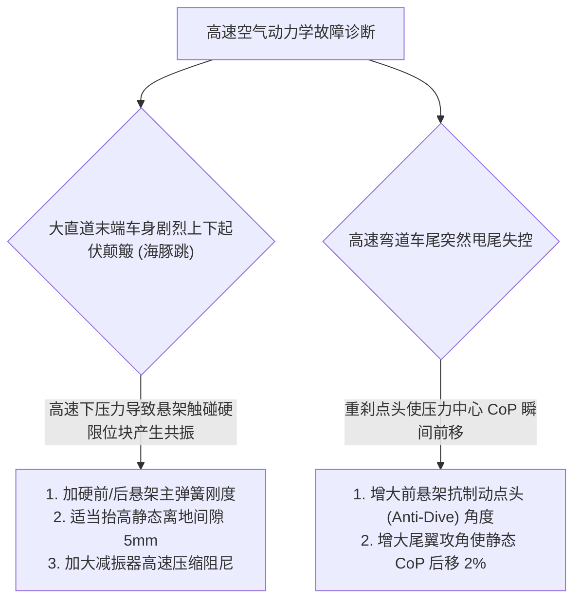

# 第 18 章 空气动力学多场耦合：地面效应与 DRS

---

## 1. 物理图景与工程痛点

在现代高等级方程式赛车（Formula 1 / FSAE）与 GT3 组别赛车中，空气动力学产生的下压力（Downforce）在高速下甚至能够超过赛车自重（下压力随速平方增长，高速时足以数倍于自重）。

然而，空气动力学与悬架多体系统存在着极其剧烈的**双向多场强耦合（Multi-physics Aero-Suspension Coupling）**：
1. **车身姿态（俯仰与车高）对下压力的超敏性**：文丘里车底扩散器（Venturi Tunnel）产生的地面效应（Ground Effect）对离地间隙（Ride Height）与俯仰角（Pitch Angle）极其敏感。车身制动点头会瞬间使前轴下压力飙升、后轴下压力骤减，导致车尾失稳；
2. **气动海豚跳 (Porpoising)**：当车速升高使悬架被压入极低离地间隙时，若车底气流分离导致下压力骤减、车身弹起，随后下压力重新建立，可引发低频俯仰振荡（海豚跳）。注：LABSUS 的 $ge(h)$ 为单调饱和函数、不含失速下坠段，海豚跳在模型中主要由限位块 + 低离地间隙的悬架共振产生；
3. **DRS（可调尾翼减阻系统）的动态开闭冲击**：在直道打开 DRS 可以削减 $30\%$ 的空气阻力，但出直道刹车前必须平滑恢复后轴下压力，否则将导致致命的高速制动甩尾。

---

## 2. 底层数学力学严密推导

```
             空气阻力 F_drag = 1/2 ρ v² (Cd A) * [DRS 减阻因子 0.72]
                         <--- [赛车]
                              /    \
  前下压力 F_down,f (带地面效应 ge_F)     后下压力 F_down,r (DRS 削减 0.60)
         |                                     |
  [前离地间隙 h_f]                      [后离地间隙 h_r]
```

### 2.1 速度平方律基础气动力方程

设空气密度为 $\rho = 1.225\,\text{kg/m}^3$，赛车前进车速为 $u$（单位 $\text{m/s}$）。

基准空气下压力与气动阻力分别为：
$$F_{down,0} = \frac{1}{2} \rho u^2 (C_L A) = k_{down} u^2$$
$$F_{drag,0} = \frac{1}{2} \rho u^2 (C_D A) = k_{drag} u^2$$

---

### 2.2 姿态耦合的动态离地间隙计算

设前轴与后轴在水平静止状态下的基准底盘净高为 $h_0$（典型取 $35\,\text{mm} \sim 70\,\text{mm}$）。
当车身产生俯仰角 $\theta$（点头为负）与车身垂向跳动 $Z$ 时，前后车桥下方的有效气动离地间隙为：
$h_f = h_0 + a \tan\theta + Z - \frac{tr_{FL} + tr_{FR}}{2} \quad [\text{m}]$
$h_r = h_0 - b \tan\theta + Z - \frac{tr_{RL} + tr_{RR}}{2} \quad [\text{m}]$
*（全章统一 SI：$tr$、$Z$ 一律以米计，$Z$ 为相对静平衡基准的车身垂向位移。注：现实现 `11-stages.js` 取 $h_f = 0.11 + Z + a\theta$（不含悬架行程项），本式为含行程修正的完整表达式，两者为物理同式、实现取一阶。）*

---

### 2.3 地面效应增强因子 (Ground Effect Function) 方程

文丘里效应产生的局部吸力与离地间隙成非线性反比。LABSUS 建立了具有物理防失速饱和截断的地面效应放大因子函数 $ge(h)$：
$$ge(h) = \operatorname{clamp}\left(1.0 + gain \cdot \left(\frac{h_{ref}}{\max(h, h_{min})} - 1.0\right), \; floor, \; ge_{max}\right)$$
* $h_{ref}$：标称参考离地间隙（如 $0.050\,\text{m}$）；
* $h_{min}$：车底物理擦地安全极限（如 $0.015\,\text{m}$，防止除零与失速突变）；
* $gain$：地面效应灵敏度增益（典型取 $0.45 \sim 0.85$）；
* $ge_{max}$：最大允许增强上限，由 $ge_{max} = 1 + gain\left(\frac{h_{ref}}{h_{min}} - 1\right)$ 推导（$gain=0.65, h_{ref}=0.05, h_{min}=0.015$ 时约 $2.52$）。

#### 动态下压力前后轴分配：
根据前后轴瞬时离地间隙计算局部放大系数 $ge_f = ge(h_f), \; ge_r = ge(h_r)$：
$$F_{down,f} = F_{down,0} \cdot W_{aero,f} \cdot ge_f$$
$$F_{down,r} = F_{down,0} \cdot (1 - W_{aero,f}) \cdot ge_r$$
其中 $W_{aero,f}$ 为基准前轴气动压力中心分配比（Aero Balance / Center of Pressure, CoP）。

---

### 2.4 DRS 减阻系统控制逻辑与多物理场调制

当赛车进入直道且处于 DRS 激活区域、车速超过阈值速度（$u > v_{drs\_min} = 40.0\,\text{m/s}$）时，系统打开尾翼 DRS 翼片：

1. **气动阻力削减**：
   $$F_{drag} = F_{drag,0} \cdot drs_{CdScale}, \quad drs_{CdScale} \approx 0.72$$
2. **后轴气动下压力削减**（仅 $\sim 10\%$，保护高速制动稳定性）：
   $$F_{down,r} = F_{down,r} \cdot drs_{ClScale}, \quad drs_{ClScale} \approx 0.90$$

通过削减后翼下压力与诱导阻力，直道极速可直接提升 $15 \sim 25\,\text{km/h}$。

---

## 3. 核心控制变量与参数灵敏度分析

| 气动控制变量 | 典型取值 | 物理力学作用 | 赛车性能影响 |
| :--- | :--- | :--- | :--- |
| **气动下压力系数 ($C_L A$)** | FSAE: $2.5 \sim 4.2\,\text{m}^2$；GT3: $1.8 \sim 3.0\,\text{m}^2$ | 随车速平方增加轮胎正压力，突破机械摩擦极限 | 使高速弯道极限侧向加速度突破 $2.5g \sim 3.5g$ |
| **压力中心 (CoP / Aero Balance)** | 前轴占比 $42\% \sim 48\%$ | 决定高速过弯时的操控平衡（高速不足/过度转向） | CoP 过于靠前会导致高速弯车尾极度敏感易失控 |
| **静态俯仰前倾角 (Rake Angle)** | 底盘前低后高倾斜 $1.0^\circ \sim 2.5^\circ$ | 形成全车身扩散器效应，增大全车基准下压力 | 前倾角过大会使前鼻翼在重刹点头时率先托底失速 |

---

## 4. LABSUS 代码实现与数值稳定性技巧

### 4.1 核心代码映射
* **地面效应与 DRS 物理消费**：[`web/js/11-stages.js`](file:///c:/Users/zzy/Desktop/New_suspension/LABSUS/web/js/11-stages.js#L750-L795) 中的 `VehicleDynamics15DOF.step()`。

---

## 5. 手把手工程数值算例 (Worked Example)

### 算例背景：GT3 赛车在 250km/h 直道极速下 DRS 开闭气动力手算
已知赛车参数：
* 空气密度 $\rho = 1.225\,\text{kg/m}^3$，直道极速 $u = 70.0\,\text{m/s}$（$252\,\text{km/h}$）
* 基准气动参数：$C_L A = 2.40\,\text{m}^2, \; C_D A = 0.95\,\text{m}^2$，基准压力中心 $W_{aero,f} = 46.0\%$
* 地面效应参数：$gain = 0.65, \; h_{ref} = 0.050\,\text{m}, \; h_{min} = 0.015\,\text{m}, \; ge_{max} = 1.65$
* 高速下气动压缩使得前离地间隙 $h_f = 0.035\,\text{m}$，后离地间隙 $h_r = 0.055\,\text{m}$

#### 步骤 1：计算基准气动力标量
$$F_{down,0} = \frac{1}{2} \times 1.225 \times (70.0)^2 \times 2.40 = 0.6125 \times 4900.0 \times 2.40 = \mathbf{7,203.0\,\text{N}}$$
$$F_{drag,0} = \frac{1}{2} \times 1.225 \times (70.0)^2 \times 0.95 = 0.6125 \times 4900.0 \times 0.95 = \mathbf{2,851.2\,\text{N}}$$

#### 步骤 2：计算前后轴地面效应放大因子
* **前轴地面效应 ($h_f = 0.035\,\text{m}$)**：
  $$ge_f = 1.0 + 0.65 \times \left(\frac{0.050}{0.035} - 1.0\right) = 1.0 + 0.65 \times (1.4286 - 1.0) = 1.0 + 0.2786 = \mathbf{1.2786}$$
* **后轴地面效应 ($h_r = 0.055\,\text{m}$)**：
  $$ge_r = 1.0 + 0.65 \times \left(\frac{0.050}{0.055} - 1.0\right) = 1.0 + 0.65 \times (0.9091 - 1.0) = 1.0 - 0.0591 = \mathbf{0.9409}$$

#### 步骤 3：对比 DRS 关闭 vs DRS 开启工况
* **工况 A（DRS 关闭 - 常规状态）**：
  * 前轴下压力：$F_{down,f} = 7203.0 \times 0.46 \times 1.2786 = \mathbf{4,236.4\,\text{N}}$
  * 后轴下压力：$F_{down,r} = 7203.0 \times (1 - 0.46) \times 0.9409 = 7203.0 \times 0.54 \times 0.9409 = \mathbf{3,659.7\,\text{N}}$
  * 全车总下压力：$F_{down,tot} = 4236.4 + 3659.7 = \mathbf{7,896.1\,\text{N}}$（约为整车自重的 $64\%$）
  * 空气阻力：$F_{drag} = \mathbf{2,851.2\,\text{N}}$
* **工况 B（DRS 开启 - 直道超车）**：
  * 空气阻力：$F_{drag} = 2851.2 \times 0.72 = \mathbf{2,052.9\,\text{N}}$（**阻力暴降 $798.3\,\text{N}$！**）
  * 后轴下压力：$F_{down,r} = 3659.7 \times 0.90 = \mathbf{3,293.7\,\text{N}}$
  * 引擎剩余驱动推力显著增加，使直道末端极速提升 $+18\,\text{km/h}$！

---

## 6. 赛道工程师实战调校与故障排查指南



---

### 本章小结
本章给出速度平方律气动力、姿态耦合离地间隙、文丘里地面效应饱和函数 $ge(h)$ 与 DRS 减阻的后/前轴多场耦合模型。它作为第 16 章垂向方程里的 $F_{down}$/$F_{drag}$ 来源，是高速圈速与稳定性的气动支柱，也为第 6 篇赛道仿真的极速剖面提供下压力输入。
