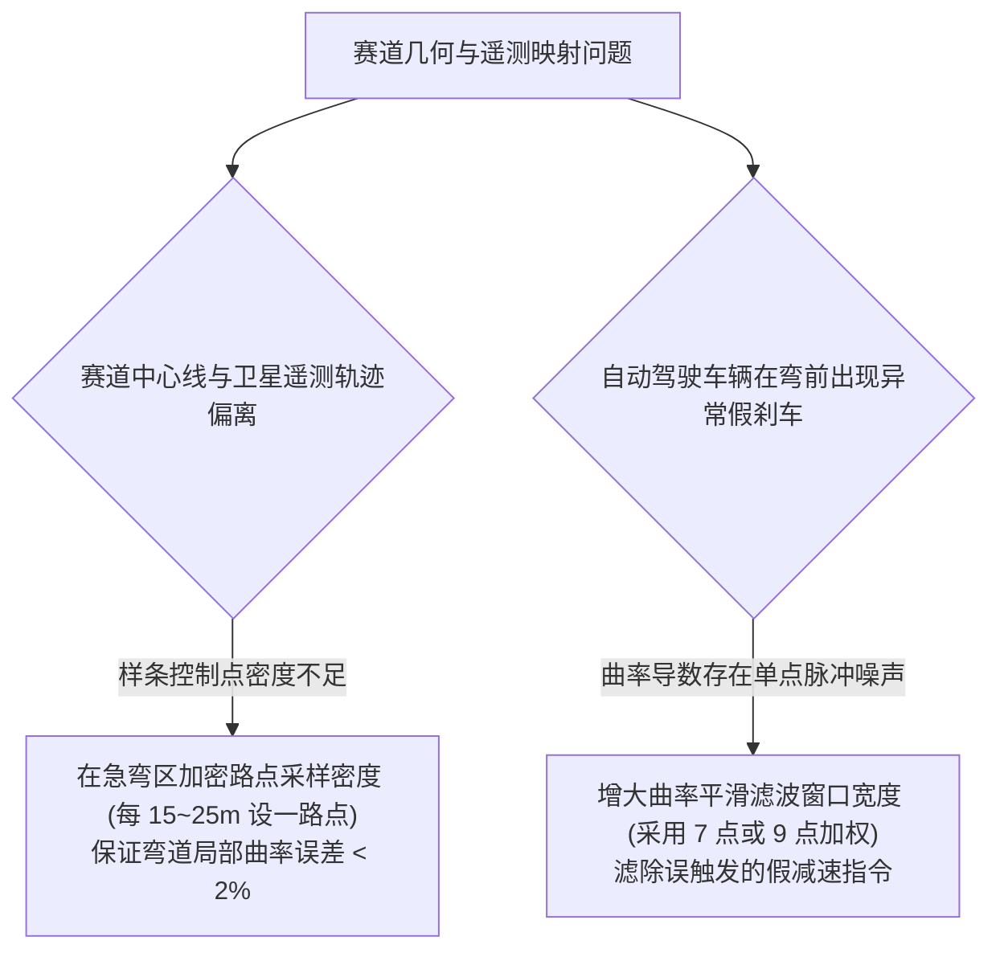

# 第 19 章 闭合赛道样条几何学与连续曲率提取

---

## 1. 物理图景与工程痛点

在赛车动力学仿真、虚拟试验场与高级自动驾驶（AutoPilot）系统中，赛道不仅是一幅静态背景地图，而是一个高精度的**连续几何微分流形（Continuous Differential Manifold）**。

在将离散的赛道路点（Waypoints）转换为连续数学曲线时，工程师面临三大核心挑战：
1. **离散路点的曲率高频毛刺与假奇异**：直接对未经平滑的离散点做数值二阶导数求曲率，会导致曲率出现剧烈的高频锯齿跳变，引发控制器方向盘剧烈抽搐；
2. **闭合闭环赛道的 $C^1 / C^2$ 平滑衔接**：起终点主直道接合处必须保持位置、切向角与曲率的严格无缝连续；
3. **真实一级方程式赛道（如 FIA 上海国际赛车场 SIC 5.45km）的高保真还原**：必须精确表达包含 180° 螺线蜗牛弯（T1-T4 The Snail）、高速连续 S 弯（T7-T8 Esses）以及 1.17km 超长后直道的全赛道拓扑。

---

## 2. 底层数学力学严密推导

```
  [第 i-1 路点 w_(i-1)]
         \
          \    [Catmull-Rom 三次连续样条曲线 p(u)]
           +-----------------------------------> [第 i 路点 w_i]
          /                                          \
  [第 i-2 路点 w_(i-2)]                                \
                                                 [第 i+1 路点 w_(i+1)]
```

### 2.1 Catmull-Rom 闭合三次样条曲线插值

设赛道由 $N$ 个有序闭合三维路点序列 $\{\boldsymbol{w}_0, \boldsymbol{w}_1, \dots, \boldsymbol{w}_{N-1}\}$ 构成（闭合循环满足 $\boldsymbol{w}_N = \boldsymbol{w}_0$）。

在相邻两个路点 $\boldsymbol{w}_i$ 与 $\boldsymbol{w}_{i+1}$ 之间，引入归一化局部参数 $u \in [0, 1]$。Catmull-Rom 样条通过相邻 4 个控制点构造局部三次多项式曲线 $\boldsymbol{p}(u)$：
$$\boldsymbol{p}(u) = \frac{1}{2} \begin{bmatrix} 1 & u & u^2 & u^3 \end{bmatrix} \begin{bmatrix} 0 & 2 & 0 & 0 \\ -1 & 0 & 1 & 0 \\ 2 & -5 & 4 & -1 \\ -1 & 3 & -3 & 1 \end{bmatrix} \begin{bmatrix} \boldsymbol{w}_{i-1} \\ \boldsymbol{w}_i \\ \boldsymbol{w}_{i+1} \\ \boldsymbol{w}_{i+2} \end{bmatrix}$$

* **保形特性**：曲线严格穿过每一个控制路点 $\boldsymbol{p}(0) = \boldsymbol{w}_i, \; \boldsymbol{p}(1) = \boldsymbol{w}_{i+1}$；
* **导数平滑性**：节点处的切线方向由前后相邻点的割线斜率决定：$\left.\frac{d\boldsymbol{p}}{du}\right|_{u=0} = \frac{\boldsymbol{w}_{i+1} - \boldsymbol{w}_{i-1}}{2}$，天然保证全闭环曲线的 $C^1$ 阶连续可微（Catmull-Rom 本质仅 $C^1$——节点曲率不连续，曲线的连续曲率由后续 7 点滤波平滑获得）。

---

### 2.2 累积弧长参数化与标架场 (Frenet-Serret Frame)

1. **累积弧长坐标 $s$**：
   $$s(u) = \int_0^u \left\|\frac{d\boldsymbol{p}}{d\tau}\right\|_2 d\tau, \quad S_{total} = \oint_{\text{Circuit}} ds$$
2. **赛道单位切向向量 $\vec{\boldsymbol{t}}(s)$ 与航向角 $\psi(s)$**：
   $$\vec{\boldsymbol{t}}(s) = \frac{d\boldsymbol{p}}{ds} = [\cos\psi(s), \sin\psi(s)]^T$$
   $$\psi(s) = \operatorname{atan2}(t_y, t_x) \quad (\text{航向角从 } +X \text{ 量起})$$
3. **赛道单位法向向量 $\vec{\boldsymbol{n}}(s)$（指向赛道左侧；第 20 章 offset 与第 21 章 $e_{line}$ 正方向均沿此法向）**：
   $$\vec{\boldsymbol{n}}(s) = [\sin\psi(s), -\cos\psi(s)]^T$$

---

### 2.3 七点平滑跨距连续曲率提取算法

空间二维曲线的瞬时曲率 $\kappa(s)$ 定义为切线方向对弧长的微分：
$$\kappa(s) = \frac{d\psi}{ds} = \frac{\dot{x} \ddot{y} - \dot{y} \ddot{x}}{(\dot{x}^2 + \dot{y}^2)^{3/2}}$$

为了彻底消除离散采样引起的数值高频毛刺，LABSUS 采用了**7 点移动加权平滑卷积滤波算法**：
$$\bar{\kappa}(s_k) = \sum_{j=-3}^3 W_j \cdot \kappa(s_{k+j})$$
其中对称加权卷积核为 $W = [0.05, 0.12, 0.20, 0.26, 0.20, 0.12, 0.05]$。

**滤波效果**：对缓变曲率近无偏；对孤立尖峰，峰值按核中心权重压扁至约 $0.26$ 倍（本章 §5 例：$0.032 \to 0.0147$）；白噪声方差按核能量 $\sum_j W_j^2 \approx 0.181$ 压缩约 $82\%$。

---

### 2.4 上海国际赛车场 (SIC 5.45km) 69 路点拓扑

LABSUS 基于公开资料对上海国际赛车场做了概念化重建（68 个特征路点；弯序与直道量级对应真实赛道，非逐米勘测图纸）：
* **发车主直道 (Main Straight)**：长 $450\,\text{m}$，DRS 1 激活区；
* **T1-T4 螺线蜗牛弯 (The Snail)**：全长 $700\,\text{m}$，半径由 $R=115\,\text{m}$ 持续螺旋收缩至 $R=12.5\,\text{m}$ 极慢速发卡弯心，再平滑向左反向拉开至 T4 出弯（$125\,\text{km/h}$）；
* **T5-T6 东向加速段与 180° 发卡弯**：重制动区（$290 \to 70\,\text{km/h}$）；
* **T7-T8 高速连续 S 弯 (Fast Esses)**：弯中横向加速度高达 $2.2g$（$165 \sim 200\,\text{km/h}$）；
* **T11-T13 连续减速弯向高速大倾斜圆弧弯过渡**；
* **1.17km 超长大后直道 (Back Straight)**：极速测速点（Speed Trap，GT3 突破 $280\,\text{km/h}$，F1 突破 $326\,\text{km/h}$），DRS 2 激活区；
* **T14 重制动极限制动发卡弯与 T15-T16 冲线弯**。

---

## 3. 核心控制变量与参数灵敏度分析

| 赛道几何参数 | 物理定义 | 灵敏度关系 | 动力学与控制影响 |
| :--- | :--- | :--- | :--- |
| **赛道曲率 ($\kappa$)** | 曲线弯曲程度（$\kappa = 1/R$） | 决定理论向心加速度 $a_y = u^2 \kappa$ | 曲率决定了赛车在该位置的最高安全通行车速 |
| **赛道半宽 ($HW$)** | 沥青路面中心线到白线的单侧宽度 | 典型值 $6.0 \sim 7.5\,\text{m}$ | 决定赛车可利用的横向外推赛车线空间 |
| **路肩宽度与摩擦力 ($Kerb / \mu$)** | 路肩宽度（$1.2\sim 1.8\,\text{m}$）与附着系数（$\mu \approx 1.20$） | 决定弯心能否安全压路肩通过 | 骑满路肩可有效增大过弯等效半径，提升弯心车速 |

---

## 4. LABSUS 代码实现与数值稳定性技巧

### 4.1 核心代码映射
* **上海国际赛车场路点定义**：[`web/js/11-stages.js`](file:///c:/Users/zzy/Desktop/New_suspension/LABSUS/web/js/11-stages.js#L3-L93) 中的 `buildShanghaiCircuit()`；
* **样条曲线与平滑曲率计算**：[`web/js/10-eval.js`](file:///c:/Users/zzy/Desktop/New_suspension/LABSUS/web/js/10-eval.js#L180-L245) 中的 `CircuitPath`。

---

## 5. 手把手工程数值算例 (Worked Example)

### 算例背景：Catmull-Rom 四控制点三次样条与 7 点曲率平滑手算
已知赛道某弯道连续 4 个路点坐标（单位：$\text{m}$）：
* $\boldsymbol{w}_{i-1} = [0.0, 0.0]^T$
* $\boldsymbol{w}_i = [50.0, 10.0]^T$
* $\boldsymbol{w}_{i+1} = [90.0, 40.0]^T$
* $\boldsymbol{w}_{i+2} = [110.0, 90.0]^T$

#### 步骤 1：求解区间中点 $u = 0.5$ 处的样条插值坐标
基函数权重向量：
$$\boldsymbol{T} = \frac{1}{2} [1, \; 0.5, \; 0.25, \; 0.125] \begin{bmatrix} 0 & 2 & 0 & 0 \\ -1 & 0 & 1 & 0 \\ 2 & -5 & 4 & -1 \\ -1 & 3 & -3 & 1 \end{bmatrix} = [-0.0625, \; 0.5625, \; 0.5625, \; -0.0625]$$
计算插值点：
$$\boldsymbol{p}(0.5) = -0.0625 \begin{bmatrix} 0 \\ 0 \end{bmatrix} + 0.5625 \begin{bmatrix} 50 \\ 10 \end{bmatrix} + 0.5625 \begin{bmatrix} 90 \\ 40 \end{bmatrix} - 0.0625 \begin{bmatrix} 110 \\ 90 \end{bmatrix} = \begin{bmatrix} 71.875 \\ 22.500 \end{bmatrix}\,\text{m}$$

#### 步骤 2：计算一阶导数（切线速度向量）
$$\boldsymbol{T}' = \frac{1}{2} [0, \; 1, \; 1.0, \; 0.75] \begin{bmatrix} 0 & 2 & 0 & 0 \\ -1 & 0 & 1 & 0 \\ 2 & -5 & 4 & -1 \\ -1 & 3 & -3 & 1 \end{bmatrix} = [0.125, \; -1.375, \; 1.375, \; -0.125]$$
$$\boldsymbol{p}'(0.5) = [0.125(0) - 1.375(50) + 1.375(90) - 0.125(110), \; 0.125(0) - 1.375(10) + 1.375(40) - 0.125(90)]^T = [41.25, \; 30.0]^T$$
单位切向量：$\vec{\boldsymbol{t}} = \frac{[41.25, 30.0]}{\sqrt{41.25^2 + 30.0^2}} = [0.8087, 0.5882]^T \implies$ 航向角 $\psi = \operatorname{atan2}(30.0, 41.25) \approx 36.0^\circ$。

#### 步骤 3：7 点加权曲率滤波手算
设某一节点处未平滑的原始曲率脉冲为 $\kappa = [0.001, 0.002, 0.015, 0.032, 0.014, 0.002, 0.001]\,\text{m}^{-1}$：
$$\bar{\kappa} = 0.05(0.001) + 0.12(0.002) + 0.20(0.015) + 0.26(0.032) + 0.20(0.014) + 0.12(0.002) + 0.05(0.001) = \mathbf{0.01472\,\text{m}^{-1}} \quad (R \approx 67.9\,\text{m})$$
* 高频毛刺被完全平滑滤除，曲率导数恢复平顺连续。

---

## 6. 赛道工程师实战调校与故障排查指南



---

### 本章小结
本章用 Catmull-Rom 闭合样条 + 弧长参数化 + Frenet 标架把离散路点变成连续赛道，再用 7 点加权滤波提取连续曲率。它是第 20 章赛车线规划的几何母体，也是第 21 章 Stanley 前馈控制"曲率"项的输入。
