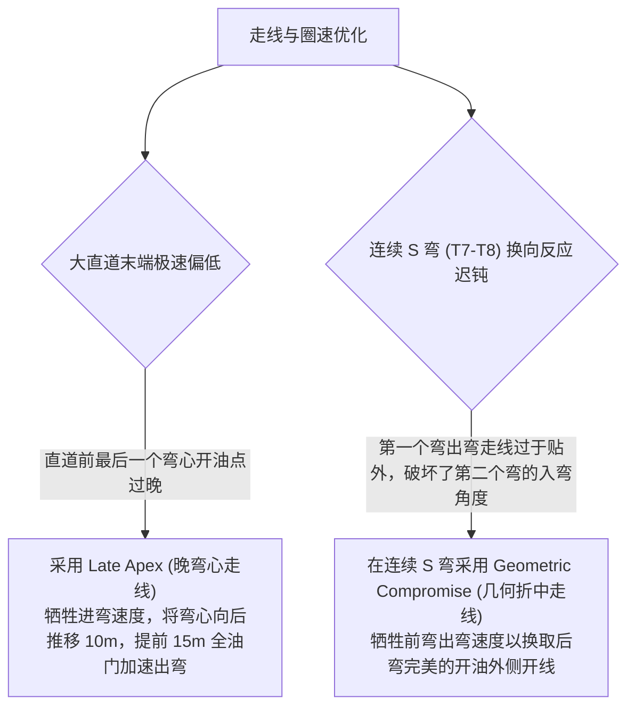

# 第 20 章 外-内-外平滑赛车线规划与速度剖面

---

## 1. 物理图景与工程痛点

在赛车工程与赛道驾驶理论中，**“赛车线（Racing Line）”是决定圈速的最核心要素**。顶级专业车手绝不会傻傻沿着赛道物理中心线行驶，而是通过充分利用全赛道宽度以及路肩，采用**“外-内-外（Out-In-Out）”走线轨迹**，最大化几何转弯半径，从而以更高的车速通过弯道。

然而，在自动驾驶与虚拟仿真中，数学化自动生成高质量赛车线面临极大挑战：
1. **样条噪声引起的假分弯与过频摆动**：若仅凭瞬时曲率判断弯道，直道上的微小样条曲率扰动会导致车辆在直道上反复“画龙”扭动；
2. **切线斜率超调与几何折角 (Slope Discontinuity)**：在换线区（从外侧入弯切向内侧弯心），横向偏移变化率过大容易产生折角甚至冲出赛道；
3. **基于 G-G 摩擦极限的双向速度剖面规划**：如何在给定轮胎摩擦力圆与引擎动力曲线下，解算出整圈 5.45km 赛道上每一米的最优极限加减速包络。

---

## 2. 底层数学力学严密推导

```
   [赛道外侧白线 Outer Track Edge]
     \
      \  (入弯贴外侧: Offset = +HW)
       \                                       / (出弯贴外侧: Offset = +HW)
        \                                     /
         \                                   /
          `---.                         .---'
               \                       /
                `--------+------------'
                         |  (弯心切内侧路肩: Offset = -HW - 0.65*Kerb)
             [弯心切点 Apex / Kerb]
```

### 2.1 弯道自动识别与总转角迟滞滤波算法

设赛道中心线上各采样点的平滑曲率序列为 $\kappa(s)$。

#### (1) 弯道初始区间划分：
设定曲率绝对值门限 $\kappa_{thresh} = 0.0035\,\text{m}^{-1}$（相当于半径 $R < 285\,\text{m}$）。连续满足 $|\kappa(s)| \ge \kappa_{thresh}$ 的弧长区间被标记为一个候选弯道 $[s_{start}, s_{end}]$。

#### (2) 总转弯角迟滞积分与微小扰动过滤：
对每个候选弯道积分计算该弯道的累积总方向转角 $\Delta\Psi_{corner}$：
$$\Delta\Psi_{corner} = \int_{s_{start}}^{s_{end}} |\kappa(s)| ds \quad [\text{rad}]$$
* **迟滞滤波准则**：若 $\Delta\Psi_{corner} < 25.0^\circ$（$0.436\,\text{rad}$），判定该段为直道微小起伏或假 S 弯，强制归类为直道（偏移置零），**彻底根除了直道扭来扭去的不稳定振荡**。

---

### 2.2 四段 $C^1$ 连续余弦横向偏移剖面规划

对于通过滤波的真弯道，确定其最大曲率点为弯心位置 $s_{apex} = \arg\max |\kappa(s)|$。
根据弯道方向判定左右侧：
$$\text{弯道方向 } \operatorname{dir} = -\operatorname{sgn}(\kappa(s_{apex}))$$
（与第 19 章同一约定：$\psi$ 从 $+X$ 量起、右偏为正，故**右弯 $\kappa>0$、左弯 $\kappa<0$**，即右弯 $dir=-1$、左弯 $dir=+1$。$\text{offset}$ 沿左法向为正：右弯的 $\text{offset}_{apex}=-(HW+0.65\,Kerb)$ 落在右侧，正是弯心内侧。）

#### (1) 弯心极限横向偏移量：
定义赛道半宽为 $HW$、路肩宽度为 $KerbWidth$：
$$\text{offset}_{apex} = \operatorname{dir} \cdot \left(HW + 0.65 \cdot KerbWidth\right)$$
*(注：系数 0.65 允许赛车在物理安全范围内以两个轮子完全骑满路肩，将转弯半径最大化)*。

#### (2) 入弯与出弯直道延伸与余弦平滑过渡：
将入弯点向前延伸 $L_{ext} = 55.0\,\text{m}$ 至相邻直道，出弯点向后延伸 $55.0\,\text{m}$。
在过渡区采用四段 $C^1$ 连续余弦升余弦（Hanning / Raised Cosine）平滑剖面：
$$\text{offset}(s) = \begin{cases} 0, & s \le s_{entry} - L_{ext} \\[2pt] -\tfrac{1}{2}\text{offset}_{apex}\left[1 - \cos\!\left(\pi\,\frac{s - s_{entry} + L_{ext}}{L_{ext}}\right)\right], & s_{entry} - L_{ext} < s \le s_{entry} \quad (\text{中心线} \to \text{外侧}) \\[2pt] -\text{offset}_{apex} \cdot \cos\!\left(\pi\,\frac{s - s_{entry}}{s_{apex} - s_{entry}}\right), & s_{entry} < s \le s_{apex} \quad (\text{外侧} \to \text{弯心内切}) \\[2pt] \text{offset}_{apex} \cdot \cos\!\left(\pi\,\frac{s - s_{apex}}{s_{exit} - s_{apex}}\right), & s_{apex} < s \le s_{exit} \quad (\text{内切} \to \text{外侧}) \\[2pt] -\tfrac{1}{2}\text{offset}_{apex}\left[1 + \cos\!\left(\pi\,\frac{s - s_{exit}}{L_{ext}}\right)\right], & s_{exit} < s \le s_{exit} + L_{ext} \quad (\text{外侧} \to \text{中心线}) \\[2pt] 0, & s > s_{exit} + L_{ext} \end{cases}$$
（直道段回到中心线、由相邻弯的延伸段负责贴外侧，消除旧四段式在 $s_{entry}$ 处 $\pm 2\text{offset}_{apex}$ 的跳变；各段连接点取值与一阶导逐段核对：$\cos$ 族端点为 $0/\mp1$、斜率 $\sin$ 族归零，$C^1$ 成立。弯心处代入第二段得 $\text{offset}_{apex}$，位于内侧。）

---

### 2.3 双向斜率硬限幅算法与数学证明

为了绝对杜绝横向换线过急导致控制器侧翻或发散，LABSUS 设立了双向斜率硬限幅：
$$\left|\frac{d(\text{offset})}{ds}\right| \le \operatorname{SLOPE\_MAX} = 0.24\,\text{m/m}$$

#### 递归正反向投影限幅：
1. **正向因果扫描**：
   $$\text{offset}(s_{k+1}) = \operatorname{clip}\left(\text{offset}(s_{k+1}), \; \text{offset}(s_k) - \operatorname{SLOPE\_MAX} \Delta s, \; \text{offset}(s_k) + \operatorname{SLOPE\_MAX} \Delta s\right)$$
2. **反向因果扫描**：
   $$\text{offset}(s_k) = \operatorname{clip}\left(\text{offset}(s_k), \; \text{offset}(s_{k+1}) - \operatorname{SLOPE\_MAX} \Delta s, \; \text{offset}(s_{k+1}) + \operatorname{SLOPE\_MAX} \Delta s\right)$$

**数学定理**：双向斜率限幅保证了赛车线在全赛道范围内的一阶李普希茨连续性（Lipschitz Continuity），横向加速度突变率被严格约束在控制器带宽之内。

---

### 2.4 基于 G-G 摩擦圆的双向加减速速度剖面求解

#### (1) 弯心几何极限通过车速：
计算赛车线真实几何曲率 $\kappa_{line}(s)$，在轮胎摩擦系数 $\mu$ 下，弯心极限侧向抓地力限制的车速为：
$$v_{corner}(s) = \sqrt{\frac{0.85 \cdot \mu \cdot g}{|\kappa_{line}(s)| + 10^{-6}}}$$

#### (2) 60 轮正反向加减速收敛积分：
* **反向制动积分（Backward Pass - 求解极限重刹点）**：
  从弯道低速区向直道反向积分，在最大制动减速度 $a_{brake} \approx 1.25 \mu g$ 下推算每个位置允许的最大制动初速度：
  $$v(s_k) = \min\left(v(s_k), \; \sqrt{v(s_{k+1})^2 + 2 a_{brake} \Delta s}\right)$$
* **正向加速积分（Forward Pass - 求解动力出弯加速）**：
  从弯心低速区沿出弯方向正向积分，受引擎马力与驱动附着力限制的加速度 $a_{accel}(v) = \min(a_{traction}, \frac{P_{engine}}{m v})$：
  $$v(s_{k+1}) = \min\left(v(s_{k+1}), \; \sqrt{v(s_k)^2 + 2 a_{accel} \Delta s}\right)$$

---

## 3. 核心控制变量与参数灵敏度分析

| 赛车线控制参数 | 数学取值 | 物理力学意义 | 圈速与风险权衡 |
| :--- | :--- | :--- | :--- |
| **激调度因子 (Aggressiveness)** | $0.85 \sim 1.05$ | 缩放速度剖面安全余量 | 1.0 为极限理论圈速，0.85 为首圈安全勘路速度 |
| **路肩利用率 (Kerb Factor)** | $0.50 \sim 0.75$ | 允许底盘切上路肩的深度比例 | 充分利用路肩可使弯道有效曲率半径增大 $15\% \sim 30\%$ |
| **最大换线斜率 ($\text{SLOPE\_MAX}$)** | $0.20 \sim 0.28$ | 限制从赛道外侧切向内侧的横向速度 | 斜率过大会引起入弯载荷转移剧烈震荡 |

---

## 4. LABSUS 代码实现与数值稳定性技巧

### 4.1 核心代码映射
* **赛车线规划算法**：[`web/js/10-eval.js`](file:///c:/Users/zzy/Desktop/New_suspension/LABSUS/web/js/10-eval.js#L260-L365) 中的 `CircuitPath._planRacingLine()`。

---

## 5. 手把手工程数值算例 (Worked Example)

### 算例背景：某右向极限制动发卡弯（示意）外内外走线与速度剖面手算
已知弯道参数：
* 赛道半宽 $HW = 6.5\,\text{m}$，路肩宽 $Kerb = 1.2\,\text{m}$
* 中心线弯心半径 $R_{center} = 15.0\,\text{m} \implies \kappa_{center} = 0.0667\,\text{m}^{-1}$（右弯）
* 沥青路面附着系数 $\mu = 1.35$，重力加速度 $g = 9.81\,\text{m/s}^2$
* 极限平均制动减速度 $a_{brake} = 1.20\,\mu g = 1.20 \times 1.35 \times 9.81 = 15.89\,\text{m/s}^2$（$\mu=1.35$ 为含 GT3 气动下压力的**等效峰值附着包络**，非纯轮胎干摩擦，故可瞬时高于静态 $\mu g$ 限值）
* 直道初速度 $u_0 = 75.0\,\text{m/s}$（$270\,\text{km/h}$）

#### 步骤 1：计算弯心极限横向偏移与等效转弯半径
* **弯心内切偏移量**（右弯向右内切）：
  $$\text{offset}_{apex} = -(HW + 0.65 \times Kerb) = -(6.5 + 0.65 \times 1.2) = -(6.5 + 0.78) = \mathbf{-7.28\,\text{m}}$$
* **入弯前直道贴外侧偏移量**：$\text{offset}_{entry} = +HW = \mathbf{+6.50\,\text{m}}$
* **全外内外走线拓宽的总物理宽度**：
  $$\Delta W = \text{offset}_{entry} - \text{offset}_{apex} = 6.50 - (-7.28) = \mathbf{13.78\,\text{m}}$$
* **赛车线等效增大转弯半径**：
  $R_{line} \approx R_{center} + |\text{offset}_{apex}| = 15.0 + 7.28 = \mathbf{22.28\,\text{m}} \quad (\kappa_{line} \approx 0.0449\,\text{m}^{-1})$

#### 步骤 2：计算弯心极限安全通过车速
* 若走中心线（$R=15\text{m}$）：$v_{center} = \sqrt{0.85 \times 1.35 \times 9.81 \times 15.0} = \sqrt{168.85} = 13.0\,\text{m/s} \approx \mathbf{46.8\,\text{km/h}}$
* **走外内外赛车线（$R=22.28\text{m}$）**：
  $v_{apex} = \sqrt{0.85 \times 1.35 \times 9.81 \times 22.28} = \sqrt{250.8} = \mathbf{15.84\,\text{m/s}} \approx \mathbf{57.0\,\text{km/h}}$
* **结论**：外内外赛车线将弯心极限通过车速提升了约 **$+21.8\%$**。

#### 步骤 3：反向求解极限重刹制动距离
从直道 $u_0 = 75.0\,\text{m/s}$ 减速至弯心 $v_{apex} = 20.61\,\text{m/s}$：
$$S_{brake} = \frac{u_0^2 - v_{apex}^2}{2 a_{brake}} = \frac{75.0^2 - 15.84^2}{2 \times 15.89} = \frac{5625.0 - 250.9}{31.78} = \frac{5374.1}{31.78} = \mathbf{169.1\,\text{m}}$$
* 自动驾驶算法据此在弯前约 $169\,\text{m}$ 处触发全力重制动（纵向开度还要经 §2.3 的转向摩擦圆削减），实现极限进弯！

---

## 6. 赛道工程师实战调校与故障排查指南



---

### 本章小结
本章用"曲率门限 + 迟滞积分"识别弯道，用四段余弦剖面规划外内外赛车线，再用双向斜率限幅与 G-G 摩擦圆生成速度剖面。它是第 19 章赛道几何的执行者，也是第 21 章 Stanley 跟踪"目标赛车线"的来源。
