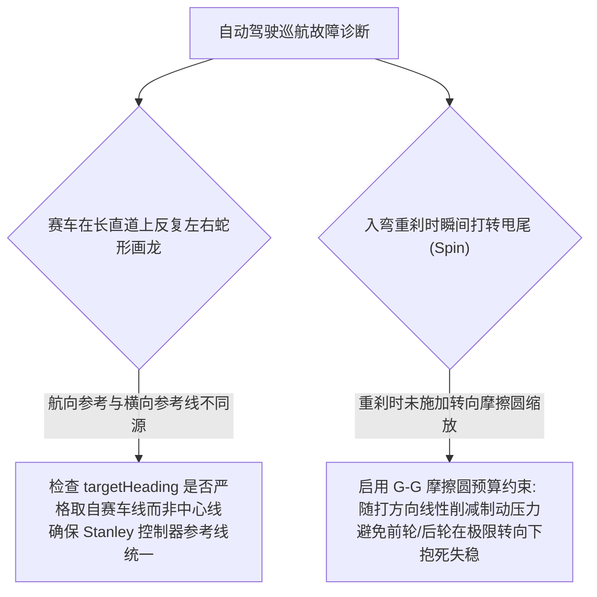

# 第 21 章 曲率前馈 Stanley 控制与刹车自适应学习

---

## 1. 物理图景与工程痛点

在高速极限赛道驾驶中，自动驾驶控制器（AutoPilot）面临的动力学工况远比普通公路巡航苛刻得多：赛车在 $250\,\text{km/h}$ 高速下过弯，轮胎工作在抓地力极限边缘（滑移角 $6^\circ\sim 9^\circ$）。注：Stanley 为运动学（无侧滑）控制器，其假设在极限工况部分失效，工程上需配合侧滑角前馈或降速至线性区使用。

在自动驾驶底层控制器设计中，工程师必须解决三大核心控制难题：
1. **参考基准不同源导致的“被拉回中心线”致命缺陷**：若航向与曲率来自赛道中心线，而横向偏差来自赛车线，控制器内部航向项（增益 $1.0$）会对横向项（增益 $0.03$）形成 30:1 的绝对压制，导致赛车强行切向中心线而放弃外内外赛车线；
2. **高速大侧向 G 下的转向剧烈摆振 (Steering Oscillation)**：在无前馈的情况下，纯反馈控制器必须产生显著横向误差后才打方向，导致在弯中出现“左摆右晃”的蛇形振荡；
3. **真实赛车手逐圈试探刹车极限的学习机制**：真实车手在第一圈绝不会直接使用极限刹车点，而是先保守刹车，每跑完一圈推进刹车点 $5\sim 10\,\text{m}$；一旦冲出赛道，立即在该弯回退并锁定安全余量。

---

## 2. 底层数学力学严密推导

```
   [赛车前轴中心 (fx, fy)]
           |
           +---- 横向跟踪误差 e_line ----> [赛车线参考点 (refX, refY)]
          /                                   |
         / (车身航向角 ψ)                       | (参考切线航向 ψ_ref)
        /                                     v
   [前轮转角 δ = δ_ff(曲率前馈) + δ_fb(Stanley反馈) + G-G摩擦圆限幅]
```

### 2.1 三量同源参考基准与误差提取

设赛车质心坐标为 $(X, Y)$，车身航向角为 $\psi$，质心到前轴距离为 $a$。
前轴中心在世界坐标系中的坐标为：
$fx = X + a \cos\psi, \quad fy = Y + a \sin\psi \qquad (\text{前轴} = CG + a \cdot \vec{t},\ \vec{t} = [\cos\psi, \sin\psi])$

以该前轴坐标查询赛车线插值点，严格保证**参考航向 $\psi_{ref}$、参考曲率 $\kappa_{ref}$ 与横向误差 $e_{line}$ 全部来自同源赛车线**：
1. **航向角偏差 $e_\psi$（带 $[-\pi, \pi]$ 周期缠绕解包）**：
   $$e_\psi = \operatorname{wrapToPi}(\psi_{ref} - \psi)$$
2. **法向横向跟踪误差 $e_{line}$**：
   $$e_{line} = (fx - refX) \cdot nx_{line} + (fy - refY) \cdot ny_{line}$$
   并施加饱和截断：$safe\_ey = \operatorname{clamp}(e_{line}, -6.0\,\text{m}, +6.0\,\text{m})$。

---

### 2.2 曲率阿克曼前馈与 Stanley 横向自适应跟踪控制律

总前轮目标转向角 $\delta_{target}$ 由**阿克曼前馈项 $\delta_{ff}$** 与 **Stanley 反馈项 $\delta_{fb}$** 叠加构成（约定：正 $\delta$ = 右打；$\kappa$ 左弯为正、右弯为负）：

#### (1) 阿克曼曲率几何前馈项 ($\delta_{ff}$)：
根据轴距 $L$ 与参考赛车线瞬时曲率 $\kappa_{ref}$，计算无滞后的纯几何理想转向角：
$$\delta_{ff} = -\arctan(L \cdot \kappa_{ref})$$
* **物理作用**：在进入弯道的瞬间即根据赛道几何直接打出 $90\%$ 的所需转角，彻底消除反馈控制的相位滞后。

#### (2) Stanley 自适应非线性反馈项 ($\delta_{fb}$)：
$$\delta_{fb} = -e_\psi - \arctan\left(\frac{K_{lat} \cdot safe\_ey}{\max(3.0\,\text{m/s}, u)}\right)$$
* **横向增益系数 $K_{lat}$**：收敛特征距离 $D_{conv} \approx u/K_{lat}$（一行误差动态推导：小偏差下 $\dot e_{lat} \approx -K_{lat} e_{lat}$，按行驶弧长收敛即得 $D_{conv}=u/K_{lat}$）。LABSUS 经过全赛道扫参确定最佳增益 $K_{lat} = 1.8$（在 $70\,\text{m/s}$ 极速下收敛距离约为 $39\,\text{m}$，温和稳定且无超调）；
* **分母软化车速 $\max(3.0, u)$**：防止低速起步与静止时除零引发转向角剧烈狂甩。

#### (3) 转向角速率斜率限制器 (Steer Rate Limiter)：
为了防止突加转向引起车尾瞬间侧滑失控（Snap-oversteer），限制前轮转角变化率：
$$|\dot{\delta}| \le \text{max\_steer\_rate} = 140.0^\circ/\text{s}$$
$$\delta(t + \Delta t) = \delta(t) + \operatorname{clamp}\left(\delta_{target} - \delta(t), \; -140^\circ \Delta t, \; +140^\circ \Delta t\right)$$

---

### 2.3 纵向车速 PID 与 G-G 摩擦圆预算协调控制

#### (1) 车速误差与 PID 需求加速度计算：
设当前弯道允许的目标车速为 $v_{target}$，当前车速为 $u$。
$$e_v = v_{target} \cdot \text{margin}_{corner} - u$$
$$a_{cmd} = K_p e_v + K_i \int e_v dt + K_d \frac{de_v}{dt}$$

#### (2) 转向-制动摩擦圆动态协调分配 (G-G Friction Allocation)：
随着转向角增大，根据摩擦椭圆压缩纵向加减速允许的最大开度：
$$\text{steer\_ratio} = \frac{|\delta|}{28.0^\circ}, \quad long\_avail = \max(0.18, \; 1.0 - 0.65 \cdot \text{steer\_ratio})$$
* **加速工况 ($a_{cmd} > 0.08\,\text{m/s}^2$)**：
  $$\text{Throttle} = \min\left(1.0, \; a_{cmd} \cdot 0.38\right) \cdot long\_avail$$
  若侧滑速度 $|v_{lat}| > 0.6\,\text{m/s}$，牵引力控制系统（TCS）触发削减油门；
* **循迹制动工况 ($a_{cmd} < -0.75\,\text{m/s}^2$)**：
  $$\text{Brake} = \min\left(1.0, \; (-a_{cmd} - 0.75) \cdot 0.38\right) \cdot long\_avail$$
* **滑行死区 ($-0.75 \le a_{cmd} \le 0.08$)**：自然收油滑行（Lift and Coast），不施加机械制动。

---

### 2.4 逐圈自适应刹车学习算法 (Lap-by-Lap Braking Learning)

LABSUS 设计了全自动化的自适应赛车手学习状态机：

```mermaid
graph TD
    Init["首圈初始化: 设定全弯道保守刹车余量系数(越大越保守) margin_i = 0.85"] --> LapLoop["车辆以当前刹车余量跑完一圈"]
    LapLoop --> CheckRunoff{"该弯是否冲出赛道 (Runoff) ?"}
    CheckRunoff -- "Yes (冲出赛道)" --> Penalty["1. 罚时 +5.0 秒 (物理砾石减速，不瞬移)<br/>2. 该弯刹车余量回退 margin_i = max(0.70, margin_i - 0.12)<br/>3. 锁定该弯 (Lock): 后续圈数不再激进推进"]
    CheckRunoff -- "No (干净过弯且未锁定)" --> Advance["推迟刹车点: 余量激进递增 margin_i = min(1.0, margin_i + 0.07)"]
    Penalty & Advance --> NextLap["进入下一圈结算 (End of Lap)"]

位移换算桥：margin 是无量纲速度余量系数，刹车点推进距离 ≈ v²·Δmargin/(2·a_brake)——v=45 m/s、Δmargin=0.07、a=12 m/s² 时约 +5.9 m/圈，与 §1 车手经验「每圈推进 5~10 m」一致。
```

---

## 3. 核心控制变量与参数灵敏度分析

| 控制器参数 | 设定值 | 物理力学作用 | 稳定性与抗扰动特征 |
| :--- | :--- | :--- | :--- |
| **横向增益 ($K_{lat}$)** | $1.80$ | 决定横向偏差向转向角的纠偏力度 | $K_{lat} < 0.8$ 弯心切不准；$K_{lat} > 3.0$ 易产生蛇形振荡 |
| **转向角速度上限** | $140^\circ/\text{s}$ | 模拟人类车手手臂最大打盘极限 | 保护后轮侧滑角不发生突变（防止打转） |
| **纵向 PID 参数** | $P=0.95, I=0.08, D=0.04$ | 速度闭环跟踪刚度 | 积分限幅 $[-6, +6]$ 杜绝直道末端积分饱和（Windup） |

---

## 4. LABSUS 代码实现与数值稳定性技巧

### 4.1 核心代码映射
* **自动驾驶控制器类**：[`web/js/11-stages.js`](file:///c:/Users/zzy/Desktop/New_suspension/LABSUS/web/js/11-stages.js#L95-L280) 中的 `UniversalAutoPilot.drive()`。

---

## 5. 手把手工程数值算例 (Worked Example)

### 算例背景：GT3 赛车在 160km/h 入弯时的 Stanley + 曲率前馈单步控制手算
已知车辆与控制器参数：
* 轴距 $L = 2.65\,\text{m}$，质心距前轴 $a = 1.25\,\text{m}$
* 控制增益：$K_{lat} = 1.80, \; K_p = 0.95$
* 当前车速：$u = 45.0\,\text{m/s}$（$162\,\text{km/h}$）
* 当前前轮实际转角：$\delta(t) = +5.0^\circ$

在当前位置从赛车线提取的同源目标为：
* 参考赛车线航向角：$\psi_{ref} = 45.0^\circ = 0.7854\,\text{rad}$
* 当前车身航向角：$\psi = 42.0^\circ = 0.7330\,\text{rad} \implies$ 航向误差 $e_\psi = +3.0^\circ = +0.0524\,\text{rad}$
* 前轴横向跟踪误差：$e_{line} = +0.85\,\text{m}$（赛车位于赛车线左侧，需向右切）
* 目标赛车线曲率：$\kappa_{ref} = -0.015\,\text{m}^{-1}$（右弯，半径 $R = 66.7\,\text{m}$）
* 目标车速：$v_{target} = 40.0\,\text{m/s}$（当前超速 $5.0\,\text{m/s}$，需制动）

#### 步骤 1：计算阿克曼曲率前馈项 $\delta_{ff}$
$$\delta_{ff} = -\arctan(L \cdot \kappa_{ref}) = -\arctan(2.65 \times (-0.015)) = -\arctan(-0.03975) = +0.03973\,\text{rad} \approx \mathbf{+2.276^\circ}$$

#### 步骤 2：计算 Stanley 横向非线性反馈项 $\delta_{fb}$
分母速度软化项：$\max(3.0, u) = 45.0\,\text{m/s}$
$$\text{横向误差修正角} = \arctan\left(\frac{K_{lat} \cdot e_{line}}{u}\right) = \arctan\left(\frac{1.80 \times 0.85}{45.0}\right) = \arctan\left(\frac{1.53}{45.0}\right) = \arctan(0.0340) = +0.03399\,\text{rad} \approx +1.947^\circ$$
$$\delta_{fb} = -e_\psi - \arctan\left(\frac{K_{lat} e_{line}}{u}\right) = -0.0524 - 0.03399 = -0.08639\,\text{rad} \approx \mathbf{-4.950^\circ}$$

#### 步骤 3：合成总前轮目标转角与斜率限幅
$$\delta_{target} = \delta_{ff} + \delta_{fb} = +2.276^\circ + (-4.950^\circ) = \mathbf{-2.674^\circ} \quad (\text{向右打盘 } 2.674^\circ)$$
转角变化需求：$\Delta\delta = \delta_{target} - \delta(t) = -2.674^\circ - 5.0^\circ = -7.674^\circ$
在 $\Delta t = 0.016\,\text{s}$ 内，最大允许转角变化：$\text{max\_step} = 140^\circ/\text{s} \times 0.016\,\text{s} = 2.24^\circ$
$$\delta(t+\Delta t) = 5.0^\circ - 2.24^\circ = \mathbf{+2.76^\circ}$$

#### 步骤 4：计算纵向速度 PID 与 G-G 摩擦圆制动开度
速度误差：$e_v = v_{target} - u = 40.0 - 45.0 = -5.0\,\text{m/s}$
需求加速度：$a_{cmd} = K_p e_v = 0.95 \times (-5.0) = -4.75\,\text{m/s}^2$
转向摩擦圆可用预算：
$$\text{steer\_ratio} = \frac{|2.76^\circ|}{28.0^\circ} = 0.0986, \quad long\_avail = 1.0 - 0.65 \times 0.0986 = \mathbf{0.9359}$$
制动开度：
$$\text{Brake} = \min(1.0, (4.75 - 0.75) \times 0.38) \times 0.9359 = \min(1.0, 1.52) \times 0.9359 = \mathbf{0.9359\ (\text{约 } 93.6\%\text{ 循迹制动})}$$

---

## 6. 赛道工程师实战调校与故障排查指南



---

### 本章小结
本章用"曲率阿克曼前馈 + Stanley 自适应反馈 + 转向速率限幅 + G-G 摩擦圆协调"构成赛道自动驾驶底层控制律，再叠加逐圈试错式刹车学习。它把第 20 章赛车线变成可执行的转向/油门/制动指令，是第六篇的收口，也是第 27 章全赛道圈速仿真的控制核心。
