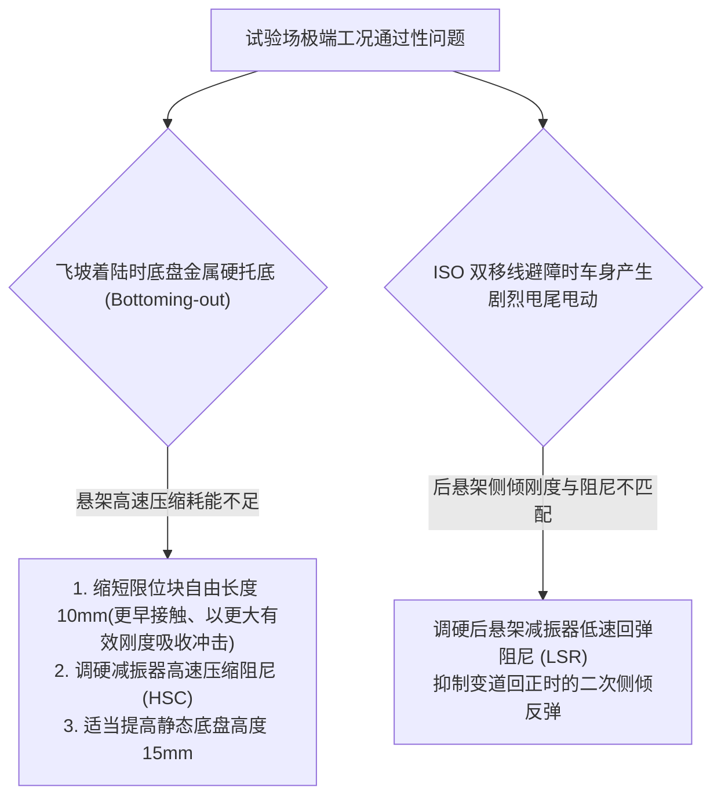

# 第 22 章 七大综合试验场场景数学与几何构建

---

## 1. 物理图景与工程痛点

除了平整的赛车赛道外，现代乘用车与全地形越野车必须在严苛的**汽车综合试验场（Proving Ground）**完成极端工况的动力学验证与耐久性测试。

综合试验场工况涵盖了极限垂向冲击、非对称路面附着力以及高动态避障场景：
1. **多重极限几何障碍物建模**：如何用连续数学函数精确构造三连飞坡跳台、连续交错减速坎、高频搓板路与深坑路面；
2. **腾空着陆（Airborne / Landing）冲击动力学**：车轮在飞坡后离开地面进入抛体运动，着陆瞬间产生极高的冲击载荷与能量耗散；
3. **ISO 3888-2 双移线（麋鹿测试 / Moose Test）与对开路面（$\mu$-Split）**：在极窄标准锥桶通道内进行高速连续紧急变道，检验底盘防侧翻与抗横摆自旋能力。

---

## 2. 底层数学力学严密推导

```
   [0-100 加速制动区] -> [三连飞坡跳台] -> [交错减速坎] -> [ISO 3888-2 双移线] -> [搓板路/深坑] -> [μ-Split 对开面] -> [极限爬坡]
```

### 2.1 七大经典试验场场景数学几何定义

LABSUS 建立了完整的七大综合试验场数学流形模型：

#### (1) 0-100 弹射加速与紧急制动区 (Launch & Stop)
全长 $400\,\text{m}$ 的纯平干地沥青路面（$\mu = 1.35$）。车轮自转模型检验起步轮胎滑转率控制（TCS）与 $100 \to 0\,\text{km/h}$ 重刹制动距离。

#### (2) 三连飞坡跳台与腾空着陆动力学 (Triple Jump Ramps)
设置连续 3 个坡度为 $\alpha_{ramp}$、台顶高度 $h_{ramp} = 0.45\,\text{m}$ 的梯形飞坡跳台。
* **腾空抛体运动阶段 (Airborne Phase)**：
  当四轮垂向支承力全部为零（$F_{z,w} = 0$）时，全车进入重力自由落体抛体运动：
  （$\psi$ 为航向角，从 $+X$（前进方向）量起）
  $\begin{cases} X(t) = X_0 + (u \cos\psi - v \sin\psi) t \\ Y(t) = Y_0 + (u \sin\psi + v \cos\psi) t \\ Z(t) = Z_0 + w_0 t - \frac{1}{2} g t^2 \end{cases}$
* **着陆冲击阶段 (Landing Phase)**：
  车轮触地瞬间，动能转化为悬架弹簧压缩能与减振器阻尼耗散热能：
  $$E_{impact} = \frac{1}{2} m_s w_{landing}^2 = \frac{1}{2} m_s (u_0 \sin\alpha_{ramp} - g t_{flight})^2$$

#### (3) 连续交错减速坎与凸块激励 (Staggered Speed Bumps)
路面标高采用平滑余弦剖面：
$z_{road}(x) = \begin{cases} \frac{h_{bump}}{2} \left[1 - \cos\left(\frac{2\pi (x - x_{start})}{W_{bump}}\right)\right] & x_{start} \le x \le x_{start} + W_{bump} \\ 0 & \text{其他} \end{cases}$
其中高度 $h_{bump} = 0.08\,\text{m}$，沿行驶方向（$x$）宽度 $W_{bump} = 0.60\,\text{m}$。左右侧凸块沿横向（$y$）交错 $1.2\,\text{m}$ 布置，激励车身剧烈的高频斜对角侧倾与扭转振动。

#### (4) ISO 3888-2 国际标准双移线麋鹿测试 (Moose Test)
严格按照 ISO 3888-2 标准尺寸在世界坐标系内布置 3 段锥桶通道：
* **车道 1（进道）**：宽度 $W_1 = 1.1 \times \text{CarWidth} + 0.25\,\text{m}$，长度 $12.0\,\text{m}$；
* **车道 2（避障变道）**：横向偏移 $3.5\,\text{m}$，宽度 $W_2 = \text{CarWidth} + 1.0\,\text{m}$，长度 $11.0\,\text{m}$；
* **车道 3（回道）**：宽度 $W_3 = 1.3 \times \text{CarWidth} + 0.25\,\text{m}$，长度 $12.0\,\text{m}$。
（几何为参考 ISO 3888 的简化定值版：固定 3.5 m 偏移与 12/11/12 m 分道是工程简化，非标准按车宽导出的全套尺寸；实车试验以对应版本标准原文为准。）

在 $65 \sim 85\,\text{km/h}$ 速度下不踩刹车滑行变道，检验车身侧倾角（$< 4.5^\circ$）与车轮抬起防侧翻裕度。

#### (5) 高频搓板路与深坑暗坑 (Washboard & Potholes)
* **高频搓板路**：波长 $\lambda = 0.35\,\text{m}$、幅值 $h = 0.025\,\text{m}$ 的正弦波连续激励路面，在 $50\,\text{km/h}$ 时产生约 $40\,\text{Hz}$ 的高频轴下振动；
* **深坑暗坑**：深达 $0.12\,\text{m}$、边缘突变斜率的沉降方坑，检验悬架限位块击穿保护与车轮防脱圈能力。

#### (6) 对开附着力路面紧急制动 ($\mu$-Split Braking)
左侧路面为高附着干沥青（$\mu_L = 1.35$），右侧路面为极低附着湿冰面（$\mu_R = 0.25$）。
在紧急全力制动时，左右侧轮胎产生巨大的非对称制动力差，诱发强烈的偏航旋转力矩：
$$M_{z,net} = (\mu_L - \mu_R) F_{z0} \cdot \frac{Track}{2}$$
* **注**：磨地半径 $r_{scrub}$ 是绕主销的转向回正力臂，不进入整车偏航力矩；对开制动跑偏主要靠方向盘对中修正或电子制动力分配（EBD）抑制。磨地偏置的纠偏作用是**间接链**：制动力差×磨地半径 → 绕主销转向力矩 → 转向未锁定时前轮附加转角 → 侧向力变化，其效果取决于回正刚度与驾驶员输入，不进入上式整车 $M_{z,net}$。

#### (7) 极限坡度爬坡与坡道起步 (Slope Climb)
设置 $25\% \sim 40\%$（约 $14^\circ \sim 22^\circ$）的陡坡。重力沿坡面分解产生下滑力：
$$F_{slope} = m g \sin\alpha_{slope}$$
静态轴荷由于坡道角度发生剧烈后移：
$$F_{z0,f} = \frac{m g b \cos\alpha_{slope} - m g h_{cg} \sin\alpha_{slope}}{L}$$
$$F_{z0,r} = \frac{m g a \cos\alpha_{slope} + m g h_{cg} \sin\alpha_{slope}}{L}$$

---

## 3. 核心控制变量与参数灵敏度分析

| 试验场工况 | 关键物理考量 | 敏感性影响 | 推荐底盘调校对策 |
| :--- | :--- | :--- | :--- |
| **飞坡着陆** | 悬架动行程余量与击穿能量 | 动能 $E_k = \frac{1}{2} m w_{landing}^2$ | 调大减振器高速压缩阻尼（HSC）并使用渐进聚氨酯缓冲块 |
| **ISO 双移线** | 侧倾恢复速度与横摆阻尼 | 侧倾阻尼比 $\zeta_{roll} \ge 0.70$ | 加硬后防倾杆与提升减振器低速回弹阻尼（LSR） |
| **$\mu$-Split 对开制动** | 偏航力矩自补偿 | 主销磨地半径 $r_{scrub} \le -5\,\text{mm}$ | 乘用车采用微负磨地距，制动力自动产生反向纠偏力矩 |

---

## 4. LABSUS 代码实现与数值稳定性技巧

### 4.1 核心代码映射
* **试验场场景生成器**：[`web/js/10-eval.js`](file:///c:/Users/zzy/Desktop/New_suspension/LABSUS/web/js/10-eval.js#L369-L430) 中 `class StraightPath extends TrackPath` 的构造参数族（`rampHeight` / `bumpHeight` / `washboardWavelength` / `washboardAmplitude` / `mooseLaneWidth` / `mooseOffset`），由 TPHYS 路面高程函数消费。注：讲义手算示例为教学取整参数，与代码默认值（如 `rampHeight=1.10 m`）存在有意的量级差异。

---

## 5. 手把手工程数值算例 (Worked Example)

### 算例背景：越野赛车飞坡腾空与着陆冲击能量手算
已知赛车参数（教学取整口径；与 web/js/10-eval.js 出厂场景参数 rampHeight=1.10、washboard λ=1.25 m 等有意不同，代码复现以引擎缺省为准）：
* 簧载质量 $m_s = 350.0\,\text{kg}$（前轴 $175\,\text{kg}$，后轴 $175\,\text{kg}$）；四轮非簧载合计 $m_u = 60.0\,\text{kg}$
* 轮端等效垂向刚度：$K_w = 40.0\,\text{N/mm} = 40,000\,\text{N/m}$
* 飞坡跳台坡角：$\alpha_{ramp} = 15.0^\circ$，跳台高出地面 $h_{ramp} = 0.45\,\text{m}$
* 起飞离台车速：$u_0 = 20.0\,\text{m/s}$（$72\,\text{km/h}$）

#### 步骤 1：计算起飞初速度与腾空飞行时间
* 垂直起飞初速度：$w_0 = u_0 \sin(15^\circ) = 20.0 \times 0.2588 = \mathbf{5.176\,\text{m/s}}$
* 水平飞行速度：$v_{horiz} = u_0 \cos(15^\circ) = 20.0 \times 0.9659 = 19.318\,\text{m/s}$
* 求解着陆时间 $t_{flight}$（落回 $Z=0$ 水平地面）：
  $$Z(t) = h_{ramp} + w_0 t - \frac{1}{2} g t^2 = 0 \implies 0.45 + 5.176 t - 4.905 t^2 = 0$$
  $$4.905 t^2 - 5.176 t - 0.45 = 0 \implies t_{flight} = \frac{5.176 + \sqrt{5.176^2 - 4(4.905)(-0.45)}}{2 \times 4.905} = \frac{5.176 + \sqrt{26.791 + 8.829}}{9.81} = \frac{5.176 + 5.968}{9.81} = \mathbf{1.136\,\text{s}}$$
* **空中飞行距离**：$S_{flight} = v_{horiz} \times t_{flight} = 19.318 \times 1.136 = \mathbf{21.95\,\text{m}}$

#### 步骤 2：计算触地垂直下落冲击速度与动能
* 触地垂直速度：
  $$w_{landing} = w_0 - g t_{flight} = 5.176 - 9.81 \times 1.136 = 5.176 - 11.144 = \mathbf{-5.968\,\text{m/s}}$$
* 全车垂向冲击动能：
  $E_{impact} = \frac{1}{2} (m_s + m_u) w_{landing}^2 = \frac{1}{2} \times 410.0 \times (-5.968)^2 = 205.0 \times 35.617 = \mathbf{7,301.5\,\text{J}}$

#### 步骤 3：单轮悬架能量吸收与最大压缩行程计算
四轮平均分担能量（假设阻尼耗散 $60\%$ 动能，弹簧吸收 $40\%$ 动能）：
$$E_{spring,corner} = \frac{7301.5 \times 0.40}{4} = 730.15\,\text{J}$$
$$\frac{1}{2} K_w (\Delta Z_{max})^2 = 730.15 \implies \frac{1}{2} \times 40000.0 \times (\Delta Z_{max})^2 = 730.15$$
$$(\Delta Z_{max})^2 = \frac{730.15}{20000.0} = 0.036508 \implies \Delta Z_{max} = 0.1911\,\text{m} = \mathbf{191.1\,\text{mm}}$$
* **结论**：越野车必须具备至少 $195\,\text{mm}$ 的悬架自由压缩动行程（如 Baja SAE 车型长行程悬架），才能确保在此高速飞坡着陆下不损坏车架！

---

## 6. 赛道工程师实战调校与故障排查指南



---

### 本章小结
本章把 0-100 弹射制动、飞坡、减速坎、双移线、搓板路、对开制动、爬坡七大试验场场景化为可解的几何/动力学模型，其中对开制动偏航力矩与飞坡着陆能量为最关键的校核量。它是第 23 章 4-Post 台架激励的来源——试验场路面工况正是台架时域信号的物理原型。
