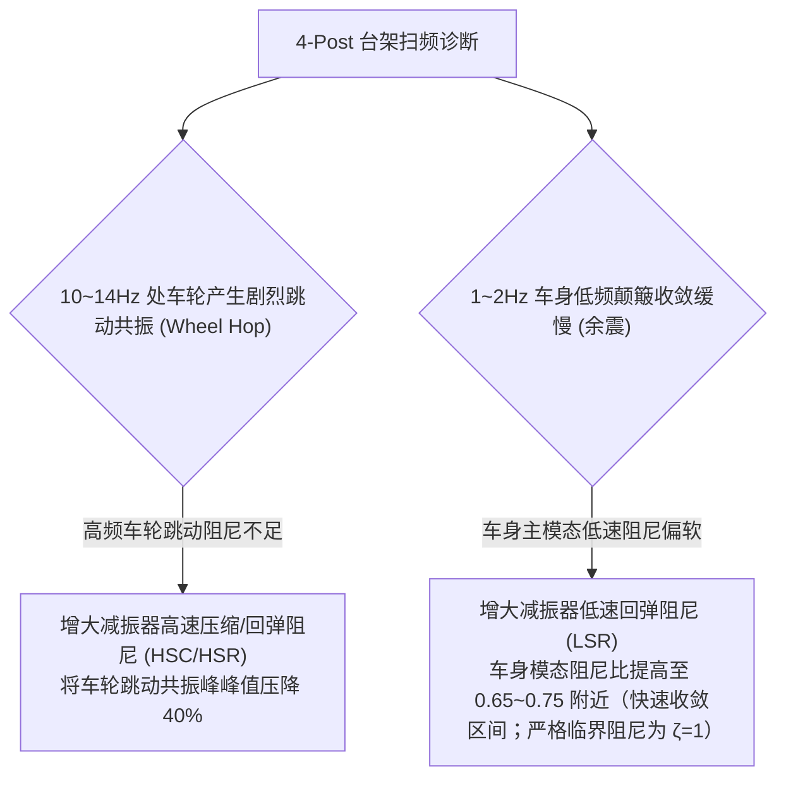

# 第 23 章 4-Post 液压台架时域激励与振动响应

---

## 1. 物理图景与工程痛点

在现代顶级赛车车队（F1 / WEC / GT3）中，**四柱液压振动试验台架（4-Post Hydraulic Shaker Rig）**是唯一能够在完全排除气动力、风阻与车手驾驶误差的纯净受控环境下，对全车悬架弹簧、减振器阻尼、防倾杆与轮胎垂直刚度进行频域响应与时域冲击测试的黄金工具。

在 4-Post 台架动力学分析中，工程师必须精确掌握以下力学规律：
1. **车身主导模式（Ride/Bounce Mode，低频 $1\sim 4\,\text{Hz}$）与车轮跳动模式（Wheel Hop Mode，高频 $10\sim 15\,\text{Hz}$）的双峰共振分离**；
2. **动态接地附着力波动与“贴地率（Contact Patch Load Variation）”**：悬架调校不仅要抑制车身颠簸，更要使四轮动载荷波动 $\Delta F_z(t)$ 最小化，防止车轮在路面高频振动下离地失载；
3. **五大标准激励信号的精确时域合成**：阶跃冲击、单频正弦、半正弦脉冲、线性扫频（Chirp）与带限伪随机白噪声。

---

## 2. 底层数学力学严密推导

```
               [簧载质量车身 m_s (垂向位移 z_s)]
                       |
                  +----+----+
                  |         |
           [悬架刚度 K_w] [阻尼 C_w]
                  |         |
                  +----+----+
                       |
               [非簧载质量车轮 m_u (垂向位移 z_u)]
                       |
                 [轮胎垂向刚度 K_t]
                       |
          [4-Post 液压作动缸输入 z_road(t)]
```

### 2.1 五大标准台架激励时域信号数学定义

设 4-Post 台架 4 个独立液压作动缸的垂向输入信号为 $z_{road,i}(t)$（$i \in \{FL, FR, RL, RR\}$）：

1. **阶跃冲击输入 (Step Input)**：
   $z_{road}(t) = h_{step} \cdot H(t - t_0)$
   （$H$ 为单位阶跃函数，注意与全书纵向速度符号 $u$ 区分）
2. **单频正弦谐波输入 (Sine Harmonic Input)**：
   $$z_{road}(t) = A \cdot \sin(2\pi f t + \phi_0)$$
3. **半正弦单脉冲坎块输入 (Half-Sine Pulse Input)**：
   $$z_{road}(t) = \begin{cases} A \cdot \sin\left(\frac{\pi (t - t_0)}{T_w}\right) & t_0 \le t \le t_0 + T_w \\ 0 & \text{其他} \end{cases}$$
4. **Chirp 线性连续扫频输入 (Swept-Frequency Chirp Input)**：
   从起始频率 $f_0$（如 $0.5\,\text{Hz}$）在时间 $T_{sweep}$ 内线性扫描至终止频率 $f_1$（如 $30.0\,\text{Hz}$）：
   $$z_{road}(t) = A \cdot \sin\left(2\pi \left(f_0 + \frac{f_1 - f_0}{2 T_{sweep}} t\right) t\right)$$
5. **带限伪随机白噪声输入 (Band-Limited Random Noise)**：
   模拟真实 ISO A~D 级路面功率谱密度（PSD）。

---

#### 2.1b 多通道相位合成（工况 → 作动器映射）
4-Post 的看家能力是用四缸**相位关系**定向激励单一模态（本章正文的单角 2-DOF 模型是四通道同幅激励下的去耦合特例；实现上 `04-dynamics.js refreshDerived()` 对 FL/FR/RL/RR 分别设 `roadZ0`）：
| 相位组合 | 激励模态 | 典型评估 |
| :--- | :--- | :--- |
| 四缸同相正弦 | 纯垂跳 (Heave) | 坐垫频率、高速直道贴地性 |
| 前后反相 | 俯仰 (Pitch) | 制动点头/加速下蹲的阻尼匹配 |
| 左右反相 | 侧倾 (Roll) | 侧倾阻尼与 ARB 匹配 |
| 对角反相 (FL+RR vs FR+RL) | 扭转 (Warp) | 搓板路车身抖振 |
随机路面：ISO 8608 A-D 级不平度需按 PSD 谱成形白噪声合成（双线性滤波）；S1 台架仿真仅提供确定性信号通道，随机 PSD 登记为后续能力。

### 2.2 单角二自由度（2-DOF Quarter Car）振动微分方程组

在任意悬架角点处，建立簧载质量 $m_s$ 与非簧载质量 $m_u$ 的垂向动力学微分方程：
$$\begin{cases} m_s \ddot{z}_s + C_w (\dot{z}_s - \dot{z}_u) + K_w (z_s - z_u) = 0 \\ m_u \ddot{z}_u + C_w (\dot{z}_u - \dot{z}_s) + K_w (z_u - z_s) + K_t (z_u - z_{road}) = 0 \end{cases}$$
其中 $K_t$ 为轮胎垂直刚度（典型值 $200 \sim 350\,\text{kN/m}$）。

#### 状态空间表达形式：
定义状态向量 $\boldsymbol{x} = [z_s, \dot{z}_s, z_u, \dot{z}_u]^T \in \mathbb{R}^4$：
$$\dot{\boldsymbol{x}} = \begin{bmatrix} 0 & 1 & 0 & 0 \\ -\frac{K_w}{m_s} & -\frac{C_w}{m_s} & \frac{K_w}{m_s} & \frac{C_w}{m_s} \\ 0 & 0 & 0 & 1 \\ \frac{K_w}{m_u} & \frac{C_w}{m_u} & -\frac{K_w + K_t}{m_u} & -\frac{C_w}{m_u} \end{bmatrix} \boldsymbol{x} + \begin{bmatrix} 0 \\ 0 \\ 0 \\ \frac{K_t}{m_u} \end{bmatrix} z_{road}(t)$$

---

### 2.3 双模态固有频率与幅频特性分析

系统的特征方程在无阻尼近似下为：
$$m_s m_u \omega^4 - \left[m_s(K_w + K_t) + m_u K_w\right] \omega^2 + K_w K_t = 0$$
解得两个特征根：

#### (1) 车身主导固有频率（Body Bounce Mode, 低频）：
$$f_{body} = \frac{\omega_1}{2\pi} \approx \frac{1}{2\pi} \sqrt{\frac{K_w \cdot K_t}{(K_w + K_t) m_s}} \approx \frac{1}{2\pi} \sqrt{\frac{K_w}{m_s}}$$
* **典型数值**：FSAE 方程式取 $3.0 \sim 4.5\,\text{Hz}$（极硬高刚度保证气动下压力稳定）；GT3 赛车取 $2.0 \sim 2.8\,\text{Hz}$；豪华乘用车取 $1.0 \sim 1.3\,\text{Hz}$。

#### (2) 车轮跳动固有频率（Wheel Hop Mode, 高频）：
$$f_{wheel} = \frac{\omega_2}{2\pi} \approx \frac{1}{2\pi} \sqrt{\frac{K_t + K_w}{m_u}} \approx 10.0 \sim 15.0\,\text{Hz}$$

---

### 2.4 动态接地载荷波动与贴地率指标 (Contact Patch Grip Ratio)

瞬时轮胎动态垂向接地力为：
$$F_{z,dyn}(t) = F_{z0} + K_t (z_{road}(t) - z_u(t))$$

定义**车轮动载荷变异系数 (Dynamic Load Coefficient, DLC)**：
$$\text{DLC} = \frac{\sigma(F_{z,dyn})}{F_{z0}} = \frac{\sqrt{\frac{1}{T} \int_0^T (F_{z,dyn}(t) - F_{z0})^2 dt}}{F_{z0}}$$

* **赛车调校黄金目标**：在车身姿态控制与平顺性之间折中——最小化 DLC（提升贴地率）与最小化车身加速度（提升舒适）是相互冲突的目标，需按工况权衡，不存在单一全局极小值。

---

## 3. 核心控制变量与参数灵敏度分析

| 台架调校参数 | 物理机理 | 灵敏度影响 | 动力学与舒适性权衡 |
| :--- | :--- | :--- | :--- |
| **车身平顺性刚度 ($K_w$)** | 决定车身跳动低频固有频率 | $\frac{\partial f_{body}}{\partial K_w} \propto \frac{1}{\sqrt{K_w}}$ | 刚度过大恶化粗糙路面高频振动，刚度过小恶化侧倾与俯仰姿态 |
| **减振器低频阻尼 ($C_{w,low}$)** | 控制 $1\sim 3\,\text{Hz}$ 车身共振峰衰减 | 姿态控制阻尼比 $\zeta \in [0.65, 0.75]$（快速收敛）；舒适平顺则取 $\zeta \in [0.25, 0.40]$ | 阻尼过小导致车身余震不断，过大导致冲击力直接传入车身 |
| **前后平顺性频率比 ($f_r / f_f$)** | 抑制过坎时的车身旋转俯仰跳动 | 黄金配置 $f_r \approx 1.10 \sim 1.20 f_f$ | 后悬架频率略高于前悬架，使前轮过坎产生的振动与后轮同相快速收敛（Flat Ride 效应） |

---

## 4. LABSUS 代码实现与数值稳定性技巧

### 4.1 核心代码映射
* **4-Post 台架显式积分求解器**：[`web/js/04-dynamics.js`](file:///c:/Users/zzy/Desktop/New_suspension/LABSUS/web/js/04-dynamics.js#L2-L125) 中的 `roadSignal(t)`（正弦/chirp/坎块激励生成）、`stepDyn(…)`（内含 `roadZ0 + roadSignal` 四轮台架路面输入）与 `refreshDerived()`（向 FL/FR/RL/RR 设 `roadZ0`）。

---

## 5. 手把手工程数值算例 (Worked Example)

### 算例背景：GT3 赛车单角 2-DOF 振动系统特征频率与阻尼比手算
已知单角悬架参数：
* 簧载质量：$m_s = 300.0\,\text{kg}$
* 非簧载质量：$m_u = 45.0\,\text{kg}$
* 轮端等效垂向刚度：$K_w = 60.0\,\text{kN/m} = 60,000.0\,\text{N/m}$
* 轮胎垂直刚度：$K_t = 240.0\,\text{kN/m} = 240,000.0\,\text{N/m}$
* 悬架阻尼系数：$C_w = 2,400.0\,\text{N}\cdot\text{s/m}$

#### 步骤 1：建立无阻尼特征多项式
$$A = m_s m_u = 300 \times 45 = 13,500\,\text{kg}^2$$
$$B = m_s (K_w + K_t) + m_u K_w = 300 \times (60000 + 240000) + 45 \times 60000 = 300 \times 300000 + 2700000 = 90,000,000 + 2,700,000 = 92,700,000\,\text{N}\cdot\text{kg/m}$$
$$C = K_w K_t = 60000 \times 240000 = 1.44 \times 10^{10}\,\text{N}^2/\text{m}^2$$

方程：$13500 \omega^4 - 92700000 \omega^2 + 1.44 \times 10^{10} = 0 \iff \omega^4 - 6866.67 \omega^2 + 1066666.67 = 0$

#### 步骤 2：求解双模态固有圆频率与频率
判别式：
$$\Delta = (6866.67)^2 - 4(1066666.67) = 47151155 - 4266667 = 42,884,488 \implies \sqrt{\Delta} = 6,548.62$$
* **车身主振模态 (Body Bounce Mode, 低频)**：
  $$\omega_1^2 = \frac{6866.67 - 6548.62}{2} = \frac{318.05}{2} = 159.025\,\text{rad}^2/\text{s}^2$$
  $$\omega_1 = \sqrt{159.025} = 12.6105\,\text{rad/s} \implies f_{body} = \frac{12.6105}{2\pi} = \mathbf{2.007\,\text{Hz}}$$
* **车轮跳动模态 (Wheel Hop Mode, 高频)**：
  $$\omega_2^2 = \frac{6866.67 + 6548.62}{2} = \frac{13415.29}{2} = 6707.645\,\text{rad}^2/\text{s}^2$$
  $$\omega_2 = \sqrt{6707.645} = 81.8996\,\text{rad/s} \implies f_{wheel} = \frac{81.8996}{2\pi} = \mathbf{13.035\,\text{Hz}}$$

#### 步骤 3：计算车身主模态阻尼比 $\zeta_{body}$
临界阻尼系数：
$$C_{crit} = 2 \sqrt{K_w m_s} = 2 \sqrt{60000 \times 300} = 2 \sqrt{18000000} = 2 \times 4242.64 = 8,485.28\,\text{N}\cdot\text{s/m}$$
当前阻尼比：
$$\zeta_{body} = \frac{C_w}{C_{crit}} = \frac{2400.0}{8485.28} = \mathbf{0.2828} \quad (\text{处于舒适平顺区间；若追求姿态快速收敛则需提高 LSR 至 } 0.6\sim0.7)$$

---

## 6. 赛道工程师实战调校与故障排查指南



---

### 本章小结
本章用单角 2-DOF 簧载/非簧载模型解析 4-Post 台架的轮胎与车身双模态共振，并以 DLC 贴地率作为悬架阻尼的优化指标。它是第 22 章试验场路面的"台架化"落地：搓板路→正弦/扫频激励、深坑减速坎→半正弦脉冲，为第 25 章实测-仿真对标提供可控激励源。
