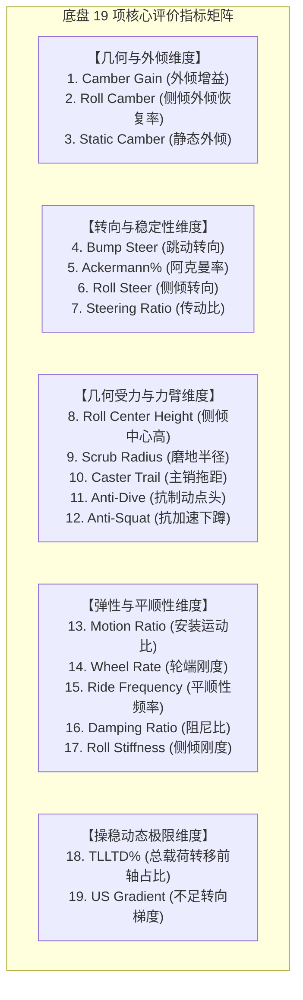

# 第 24 章 19 项核心 KPI 灵敏度导数图谱与参数调校杠杆

---

## 1. 物理图景与工程哲学：“看方程，改参数，看变化”

在赛车工程与底盘调校实践中，工程师绝不能凭借虚无缥缈的“玄学直觉”乱拧减振器旋钮或随意更改硬点垫片。底盘研发的最高境界在于**建立清晰的物理敏感性导数认知**：

> **核心工程逻辑**：  
> **观察性能指标（KPI）$\implies$ 锁定背后的力学支配方程 $\implies$ 识别控制方程的核心敏感变量 $\implies$ 定量分析偏导数灵敏度 $\frac{\partial \text{KPI}}{\partial \text{Parameter}}$ $\implies$ 精准调整物理参数 $\implies$ 预判并验证赛道动态变化与工程权衡。**

本章系统梳理底盘悬架工程中最核心的 **19 项黄金性能评价指标（19 KPI Metrics Matrix）**，涵盖几何外倾、转向稳定性、力臂与抗几何、弹性与平顺性、操稳平衡五大维度，为其中重点 9 项建立五位一体的**参数调校导数图谱**，其余指标以 §3 总表统一收口。

---

## 2. 19 项核心 KPI 灵敏度导数与参数杠杆全景矩阵



---

### 2.1 几何与外倾维度 (Camber & Geometry Domain)

#### KPI 01: 轮跳外倾增益 (Camber Gain, $d\gamma/dz$)
* **支配方程**（引自第 2 章与第 9 章）：
  $$\text{Camber Gain} = \left.\frac{d\gamma}{d(tr)}\right|_{tr=0} \approx -\frac{1}{L_{LCA}} \left(\frac{L_{LCA}}{L_{UCA}} - 1\right) \cdot \frac{180^\circ}{\pi} \quad [^\circ/\text{mm}]$$
* **核心控制变量与调校旋钮**：
  1. 上控制臂长度 $L_{UCA}$；2. 下控制臂长度 $L_{LCA}$；3. 上控制臂内铰点空间高度 $CH3_z, CH4_z$。
* **参数敏感性偏导数分析**：
  $$\frac{\partial (\text{CamberGain})}{\partial L_{UCA}} = +\frac{1}{L_{UCA}^2} > 0, \quad \frac{\partial (\text{CamberGain})}{\partial CH3_z} < 0$$
  * **改参数看变化**：缩短上摆臂长度 $L_{UCA}$，或抬高上摆臂车身内铰点 $CH3_z/CH4_z$，外倾增益绝对值显著增大（即车轮压缩时上端内收更快，获得更强的负外倾补偿）。
* **赛道性能效应与权衡 (Trade-offs)**：
  * **增益偏大**：过弯时外倾补偿充分，弯中外侧轮胎全宽度贴地；但在直线重刹悬架大压缩时，车轮会产生过大的负外倾，导致直道制动接地印痕缩小、制动距离延长；
  * **推荐黄金窗口**：方程式 $-0.045 \sim -0.070\,^\circ/\text{mm}$；GT3 赛车 $-0.035 \sim -0.055\,^\circ/\text{mm}$。

---

#### KPI 02: 侧倾外倾恢复率 (Roll Camber Recovery, $RCR$)
* **支配方程**：
  $RCR = \left|\frac{d\gamma_{rel}}{d\phi}\right| \times 100\%, \quad \frac{d\gamma_{rel}}{d\phi} \approx \text{CamberGain}\,[^\circ/\text{mm}] \cdot \frac{Track}{2}\,[\text{mm}] \cdot \frac{\pi}{180}$
* **数值代入自检**：FSAE 取 $|\text{CamberGain}| = 0.058$、$Track = 1200\,\text{mm}$，则每 $1^\circ$ 侧倾几何恢复 $0.058 \times 600 \times \frac{\pi}{180} = 0.607^\circ$，$RCR = 60.7\%$，轮胎对地净恶化 $0.393^\circ/1^\circ$。
* **核心控制杠杆**：外倾增益 $d\gamma/dz$ 与轮距 $Track$。
* **参数敏感性与赛道效应**：
  * $RCR$ 衡量车身侧倾 $1^\circ$ 时，悬架几何能抵消多少正外倾恶化。$RCR = 75\%$ 意味着车身侧倾 $1.0^\circ$ 时，轮胎相对地面仅恶化 $0.25^\circ$ 正外倾。

---

### 2.2 转向与稳定性维度 (Steering & Stability Domain)

#### KPI 04: 跳动转向梯度 (Bump Steer, $d\delta_{toe}/dz$)
* **支配方程**（引自第 2 章与第 9 章）：
  $$\text{Bump Steer} = \left.\frac{d\delta_{toe}}{d(tr)}\right|_{tr=0} \approx \frac{1}{L_{tierod}} \left[\tan\theta_{tierod} - \tan\theta_{instant\_center}\right] \quad [^\circ/\text{mm}]$$
* **核心控制变量与调校旋钮**：
  1. 转向机空间高度垫片 $RACK_z$；2. 转向拉杆外球头高度垫片 $TRO_z$。
* **参数敏感性偏导数分析**：
  $$\frac{\partial (\text{BumpSteer})}{\partial RACK_z} \approx \frac{1}{L_{tierod} \cdot \Delta y_{arm}}$$
  * **改参数看变化**：增减转向机或外拉杆处的薄垫片（Tie-rod Shim，步长通常为 $0.5\,\text{mm}$），能够直接改变拉杆空间倾角，将跳动转向曲线精准拉平。
* **赛道性能效应与权衡**：
  * **跳动前束为负（Bump Toe-out）**：过坎或压缩时前轮向外散开，高速颠簸路段方向盘剧烈打手、直线跑偏；
  * **推荐黄金窗口**：$|\text{Bump Steer}| \le 0.005\,^\circ/\text{mm}$（全行程内绝对平直）——设计基准；第 2 章 $<0.015$、第 9 章 $\pm0.0032$（°/mm）与 EVAL_BENCHMARKS $<0.02$ 为同源指标的不同显示口径/分档。

---

#### KPI 05: 阿克曼转向几何百分比 (Ackermann Percentage, $Ack\%$)
* **支配方程**：
  设内侧轮转角为 $\delta_i$、外侧轮转角为 $\delta_o$、纯几何阿克曼理论内侧角为 $\delta_{i,ack} = \operatorname{atan}\left(\frac{L}{\frac{L}{\tan\delta_o} - Track}\right)$：
  $$Ack\% = \frac{\delta_i - \delta_o}{\delta_{i,ack} - \delta_o} \times 100\%$$
* **核心控制旋钮**：转向节拉杆臂（Steering Arm）在俯视平面向车身内侧/外侧的倾斜夹角。
* **参数敏感性与赛道效应**：
  * **高阿克曼 ($60\% \sim 90\%$)**：低速发卡弯内侧轮转角远大于外侧轮，消除低速轮胎拖磨干涉，适合慢速多弯卡丁车与低速窄弯赛道；
  * **平阿克曼 / 反阿克曼 ($0\% \sim 40\%$)**：高速大曲率过弯时，外侧车轮分担了 $80\%$ 以上的垂直载荷，外侧需要更大转角榨取抓地力，适合高速大弯赛道。

---

### 2.3 几何受力与力臂维度 (Geometry & Forces Domain)

#### KPI 08: 侧倾中心高度 (Roll Center Height, $z_{rc}$)
* **支配方程**（引自第 5 章与第 10 章）：
  $$z_{rc} = CP_z + \frac{0 - CP_y}{IC_y - CP_y} (IC_z - CP_y) \quad [\text{mm}]$$
* **核心控制变量与调校旋钮**：
  1. 下摆臂车身内侧铰点高度 $CH1_z, CH2_z$；2. 上摆臂车身内侧铰点高度 $CH3_z, CH4_z$。
* **参数敏感性偏导数分析**：
  $$\frac{\partial z_{rc}}{\partial CH1_z} > 0, \quad \frac{\partial z_{rc}}{\partial UBJ_z} < 0$$
  * **改参数看变化**：抬高下摆臂车身内点 $CH1_z$，使下摆臂向外下方倾斜，瞬心大幅下移，侧倾中心高度 $z_{rc}$ 迅速抬高。
* **赛道性能效应与权衡**：
  * **抬高 $z_{rc}$**：缩短了侧倾力臂 $h_{arm} = h_{cg} - z_{rc}$，减小了车身侧倾角，同时增大了路径 2 中的瞬时几何载荷转移，使入弯车头指向反应极其敏锐；
  * **$z_{rc}$ 过高的代价**：侧向力引起的 Jacking 抬升力成倍剧增，过弯时车身被强行顶起，导致轮距剧烈收缩（Track Scrubbing），在颠簸路面引发剧烈横向横摆跳跃；
  * **推荐黄金窗口**：前轴 $+30 \sim +65\,\text{mm}$；后轴 $+50 \sim +85\,\text{mm}$。

---

#### KPI 09: 主销磨地半径 (Scrub Radius, $r_{scrub}$)
* **支配方程**（引自第 5 章）：
  $$r_{scrub} = side \cdot \left(CP_y - \left[UBJ_y + \frac{CP_z - UBJ_z}{LBJ_z - UBJ_y} (LBJ_y - UBJ_y)\right]\right) \quad [\text{mm}]$$
* **核心控制旋钮**：轮毂偏置距（ET / Wheel Offset）与下球销 $LBJ_x$。
* **敏感性与赛道效应**：
  * **正磨地距 ($+8 \sim +20\,\text{mm}$)**：制动力在主销上产生拉扯稳定力矩，路面抓地力反馈清晰，赛车手感扎实；
  * **过大磨地距 ($> +35\,\text{mm}$)**：单边压路肩或抓地力突变时，方向盘产生巨大的打手冲击力矩，极易扯脱车手手套；
  * **负磨地距 ($-5 \sim -15\,\text{mm}$)**：对开路面制动自动回正，为量产家用乘用车标准配置。

---

### 2.4 弹性与平顺性维度 (Compliance & Ride Domain)

#### KPI 13: 减振器安装运动比 (Motion Ratio, $MR$)
* **支配方程**（引自第 3 章）：
  $$MR = \frac{d L_{damper}}{d(tr)}, \quad K_w = K_{spring} \cdot MR^2$$
* **核心控制旋钮**：摇臂驱动臂长、推杆在摆臂上的附着点横向位置 $UP4_y$。
* **参数敏感性偏导数分析**：
  $$\frac{\partial K_w}{\partial MR} = 2 K_{spring} \cdot MR$$
  * **改参数看变化**：将推杆外端 $UP4$ 沿横向（$y$）向外移动 $10\,\text{mm}$（更靠近球销），$MR$ 从 0.75 提高到 0.85，轮端垂向刚度 $K_w$ 自动增加 **$28.4\%$**（即使弹簧磅数未变！）。
* **推荐黄金窗口**：$MR \in [0.75, 0.88]$，线性平直度 $\ge 92\%$。

---

### 2.5 操稳动态极限维度 (Handling & Balance Domain)

#### KPI 18: 总侧倾载荷转移前轴占比 (TLLTD%)
* **支配方程**（引自第 11 章）：
  $$\text{TLLTD} = \frac{\Delta F_{z,u,f} + \Delta F_{z,geo,f} + \frac{K_{\phi,f} \phi}{t_f}}{\Delta F_{z,tot}} \times 100\%$$
* **核心控制调校杠杆**：
  1. 前防倾杆直径 $d_{arb,f}$；2. 后防倾杆直径 $d_{arb,r}$；3. 前后主弹簧刚度比 $K_{s,f} / K_{s,r}$。
* **参数敏感性偏导数公式**：
  $$\frac{\partial \text{TLLTD}}{\partial d_{arb,f}} \approx \frac{1}{\Delta F_{z,tot} t_f} \left(\frac{d K_{\phi,arb,f}}{\partial d_{arb,f}}\right) \phi \propto d_{arb,f}^3 > 0$$
  $$\frac{\partial \text{TLLTD}}{\partial d_{arb,r}} < 0$$
  * **改参数看变化**：前防倾杆外径加粗 $2\,\text{mm}$（$28\to30\,\text{mm}$），**防倾杆自身**刚度按 $(30/28)^4$ 提升约 $+31.7\%$；因 ARB 仅占前轴侧倾刚度的一部分（弹簧为主），前轴总侧倾刚度实际上升约 $+8\%$，TLLTD 相应上移约 $+1\sim1.5$ 个百分点（按 §5 的弹簧/ARB 拆分法核算）。根据轮胎载荷敏感性，前轴总侧向抓地力衰减加剧，**赛车操稳特性迅速从微过度转向转变为显著不足转向（推头）**。
* **推荐黄金窗口**：后驱 GT3 / FSAE 赛车设为 $51.5\% \sim 54.0\%$。

---

#### KPI 19: 稳态不足转向梯度 (US Gradient, $K_{us}$)
* **支配方程**（引自第 12 章）：
  $$K_{us} = \frac{d(\alpha_f - \alpha_r)}{d(a_y / g)} \approx \frac{m_T g \frac{b}{L}}{\Sigma C_{\alpha,f}(F_z)} - \frac{m_T g \frac{a}{L}}{\Sigma C_{\alpha,r}(F_z)} \quad [^\circ/g]$$
* **核心控制调校杠杆**：TLLTD、前后轮胎气压、静态前后外倾角、前后载荷分配。
* **参数敏感性与赛道调校总结**：
  * **$K_{us}$ 是底盘调校的最终裁判指标**：所有前述 18 个指标的变动，最终全部汇聚投影在 $K_{us}$ 上；
  * **黄金视窗**：$+0.4^\circ/g \sim +1.2^\circ/g$（在入弯瞬间提供轻微而线性的阻尼感，在弯中极限时提供充足的信心与微推头保护）。

---

## 3. 19 项核心 KPI 参数敏感性调校导数总表 (Tuning Derivative Master Table)

> 下表目标视窗列以 GT3 级整车为基准，FSAE 对应值见第 27 章案例 A——各章示例参数组互相可见，数值不必全局同源。
| 编号 | KPI 核心指标名称 | 物理量纲 | 推荐目标视窗 (GT3/FSAE) | 核心敏感物理参数 ($P_i$) | 偏导数方向 $\frac{\partial \text{KPI}}{\partial P_i}$ | 增大参数对车辆动态的直接影响 |
| :--- | :--- | :--- | :--- | :--- | :--- | :--- |
| **01** | Camber Gain | $^\circ/\text{mm}$ | $[-0.065, -0.040]$ | 上控制臂长度 $L_{UCA}$ | 正偏导 ($>0$) | 缩短上臂增大外倾补偿，强化弯中抓地 |
| **02** | Roll Camber | $\%$ | $55\% \sim 75\%$ | 摆臂正视瞬心高度 $IC_z$ | 负偏导 ($<0$) | 瞬心越低，侧倾外倾补偿率越高 |
| **03** | Static Camber | $^\circ$ | 前: $-3.5$, 后: $-2.0$ | 下球销垫片偏置 | 线性 | 静态负外倾增大，直道抓地微降，过弯极限提升 |
| **04** | Bump Steer | $^\circ/\text{mm}$ | $[-0.005, +0.005]$ | 转向机高度 $RACK_z$ | 极灵敏 | 调平曲线消除高速颠簸直线跑偏与打手 |
| **05** | Ackermann% | $\%$ | $30\% \sim 60\%$ | 转向臂内倾角 | 正偏导 | 阿克曼增大提升低速发卡弯灵活性 |
| **06** | Roll Steer | $^\circ/^\circ$ | $[-0.05, +0.02]$ | 上下摆臂后点高度差 | 线性 | 侧倾前束可提供被动后轮转向稳定度 |
| **07** | Steering Ratio | $:1$ | $10:1 \sim 14:1$ | 转向机小齿轮齿数 | 反比 | 传动比越小，方向盘打盘手感越敏锐 |
| **08** | Roll Center Height | $\text{mm}$ | 前: $45$, 后: $65$ | 下摆臂内点 $CH1_z$ | 正偏导 ($>0$) | 抬高 RC 加快入弯响应，但加剧 Jacking 抬升 |
| **09** | Scrub Radius | $\text{mm}$ | $+10 \sim +18$ | 轮毂偏置距 ET | 负偏导 | 微正磨地建立真实路感，过大引发打手 |
| **10** | Caster Trail | $\text{mm}$ | $+15 \sim +30$ | 主销后倾角 Caster | 正偏导 ($>0$) | 拖距增大使方向盘机械对中回正力矩增强 |
| **11** | Anti-Dive | $\%$ | $20\% \sim 35\%$ | 上下摆臂侧视夹角 | 正切关系 | 抗点头增大抑制制动前倾，过大引发干涉 |
| **12** | Anti-Squat | $\%$ | $15\% \sim 30\%$ | 后悬架侧视瞬心高度 | 正切关系 | 抑制出弯全油门加速车尾深蹲 |
| **13** | Motion Ratio | -- | $0.75 \sim 0.88$ | 推杆在摆臂上的附着点 | 几何比例 | 安装比提高大幅增强轮端等效刚度 |
| **14** | Wheel Rate | $\text{N/mm}$ | 前: $65$, 后: $75$ | 弹簧磅数 $K_{spring}$ | 正比平方 | 刚度增大全面提升姿态控制，恶化粗糙滤震 |
| **15** | Ride Frequency | $\text{Hz}$ | 前: $2.2$, 后: $2.5$ | 簧载质量与轮端刚度 | 开方关系 | 后轴频率高 $15\%$ 产生 Flat Ride 纯平车身 |
| **16** | Damping Ratio | -- | 低速: $0.7$, 高速: $0.2$ | 减振器阻尼阀门开度 | 线性 | 临界阻尼比控制车身一次性平稳收敛 |
| **17** | Roll Stiffness | $\text{N}\cdot\text{m/deg}$ | $1,200 \sim 2,500$ | 防倾杆外径 $d_{arb}$ | 四次方 ($d^4$) | 极高效率抑制车身侧倾角度 |
| **18** | TLLTD% | $\%$ | $51.5\% \sim 54.0\%$ | 前后 ARB 直径配比 | 极灵敏 | 前调硬增大 TLLTD 产生推头，后调硬产生甩尾 |
| **19** | US Gradient | $^\circ/g$ | $+0.4 \sim +1.2$ | TLLTD 与轮胎气压 | 综合主导 | 决定赛车整车极限操控平衡的终极指标 |

---

## 4. LABSUS 代码实现与数值稳定性技巧

### 4.1 核心代码映射
* **19 项综合评价指标引擎**：[`web/js/10-eval.js`](file:///c:/Users/zzy/Desktop/New_suspension/LABSUS/web/js/10-eval.js#L30-L160) 中的 `EVAL_BENCHMARKS` 与 `calculateEvaluationData()`。

---

## 5. 手把手工程数值算例 (Worked Example)

### 算例背景：GT3 赛车前防倾杆更换对 TLLTD 与不足转向梯度的敏感性手算
已知基准状态：
* 前防倾杆外径 $d_{o,f}^{(0)} = 28.0\,\text{mm}$，前轴侧倾刚度 $K_{\phi,f}^{(0)} = 35,000\,\text{N}\cdot\text{m/rad}$（拆为弹簧贡献 $18,000$ + ARB 贡献 $17,000$（教学示例拆分，量级以示意迭代方法为准；与实车轮端 65 N/mm×MR² 口径的差异源于示例参数组自洽性弱于实车）
* 后防倾杆外径 $d_{o,r} = 24.0\,\text{mm}$，后轴侧倾刚度 $K_{\phi,r} = 35,000\,\text{N}\cdot\text{m/rad}$
* 基准 TLLTD 为 $50.0\%$，基准不足转向梯度 $K_{us}^{(0)} = +0.20^\circ/g$（中性偏过度转向，车手反映高速弯车尾不稳定）

#### 调校操作：将前防倾杆外径加粗至 $d_{o,f}^{(1)} = 32.0\,\text{mm}$（加粗 $4.0\,\text{mm}$）

#### 步骤 1：计算前防倾杆刚度增长比率
根据极惯性矩四次方定律（实心杆）：
$$\frac{K_{\phi,arb,f}^{(1)}}{K_{\phi,arb,f}^{(0)}} = \left(\frac{32.0}{28.0}\right)^4 = (1.14286)^4 = \mathbf{1.706} \quad (\text{刚度暴增 } +70.6\%)$$
前轴总侧倾刚度提升至：
$$K_{\phi,f}^{(1)} \approx 18000 + (17000 \times 1.706) = 18000 + 29002 = \mathbf{47,002\,\text{N}\cdot\text{m/rad}}$$

#### 步骤 2：重新计算全车 TLLTD%
$$K_{\phi,tot}^{(1)} = 47002 + 35000 = 82,002\,\text{N}\cdot\text{m/rad}$$
$$\text{TLLTD}^{(1)} \approx \frac{47002}{82002} \times 100\% = \mathbf{57.32\%} \quad (\text{相比原基准提升 } +7.32\%)$$

#### 步骤 3：计算不足转向梯度变化 $\Delta K_{us}$
根据第 12 章 §3 灵敏度表经验导数 $\frac{\partial K_{us}}{\partial \text{TLLTD}} \approx +0.10^\circ/g \text{ per } 1\%\text{ TLLTD}$：
$$K_{us}^{(1)} \approx K_{us}^{(0)} + 0.10 \times (57.32 - 50.0) = +0.20^\circ/g + 0.732^\circ/g = \mathbf{+0.932^\circ/g}$$
* **结论**：加粗前 ARB $4\,\text{mm}$，不足转向梯度从 $+0.20^\circ/g$ 提升至 $+0.932^\circ/g$，赛车从极度危险的易甩尾状态转变为充满信心的稳健高速操控视窗！

---

## 6. 赛道工程师实战调校与故障排查指南

```mermaid
graph TD
    A["底盘 19 KPI 综合诊断系统"] --> B{"评分系统红黄灯预警"}
    B -->|TLLTD 偏低 (<48%) + US Gradient 负值| C["【严重过度转向危机】<br/>1. 调软后 ARB 1~2 档<br/>2. 减小后弹簧刚度<br/>3. 将 TLLTD 回拉至 52% 黄金线"]
    B -->|Bump Steer 飘红 (>0.25°/25mm)| D["【高速颠簸打手危机】<br/>加减转向机垫片 (Tie-rod Shim) 调平拉杆倾角"]
    B -->|Camber Gain 幅值不足 (< 0.020°/mm ≈ 0.5°/25mm)| E["【胎肩啃胎推头危机】<br/>抬高上摆臂内铰点 CH3_z 增大外倾增益"]
```

---

### 本章小结
本章把底盘工程凝练为 19 项黄金 KPI，并为每项建立"支配方程 → 敏感变量 → 偏导 → 改参数看变化"的五位一体调校杠杆图谱。它是全书"看方程、改参数、看变化"哲学的集中落地，为第 26 章排障决策树与第 27 章三车案例提供定量抓手。
