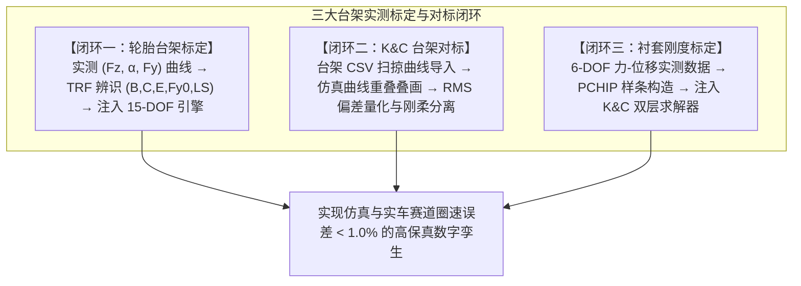
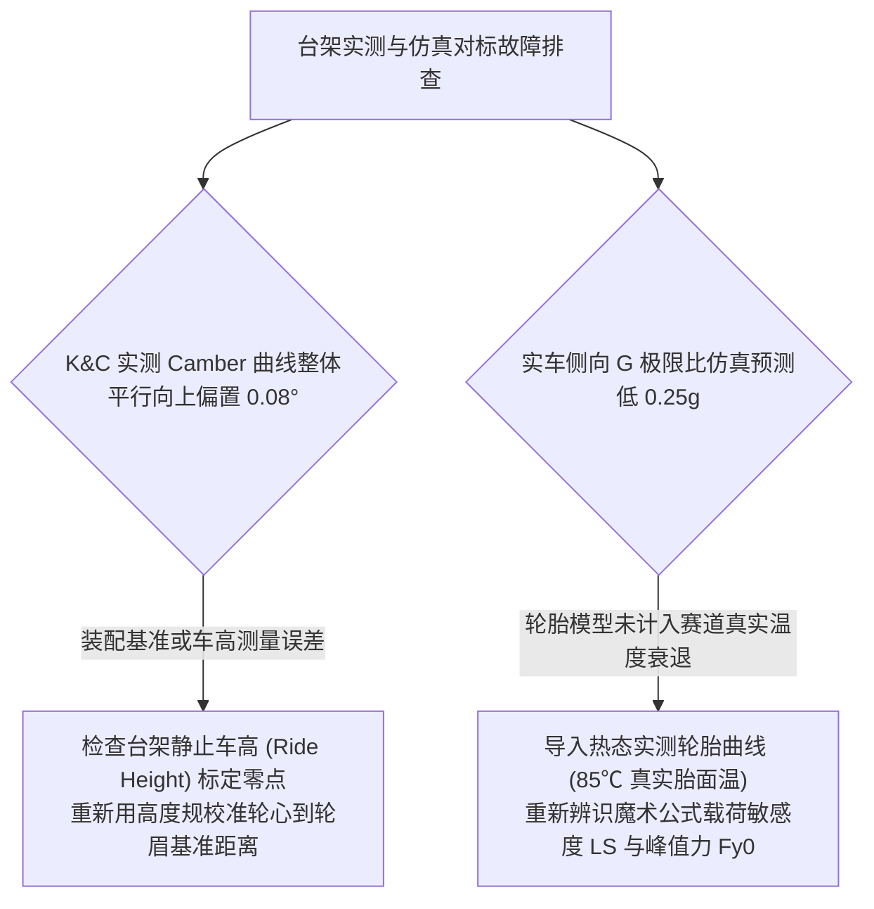

# 第 25 章 实测台架标定与仿真对标闭环方法论

---

## 1. 物理图景与工程痛点

在赛车工程与高端乘用车底盘开发领域，流传着这样一条铁律：**“未经验证与标定的仿真模型，在工程上等同于废纸。”**

无论多体运动学与动力学理论公式推导多么严密，实际制造的赛车总会存在**加工公差、焊接热形变、铰链轴承初始间隙、橡胶衬套非线性刚度离散性以及轮胎磨损温度漂移**。

为了使 LABSUS 仿真模型成为真正指导真实赛车夺冠的“数字孪生（Digital Twin）”，必须建立**三大试验台架对标与标定闭环 (Three-Pillar Correlation Loop)**：
1. **轮胎台架数据辨识与实时物理注入闭环 (Tire Correlation Loop)**；
2. **K&C 试验台架实测曲线叠画与刚柔公差分离闭环 (K&C Rig Correlation Loop)**；
3. **6-DOF 橡胶衬套实测刚度注入与力变形校准闭环 (Bushing Calibration Loop)**。

---

## 2. 底层数学力学与工程闭环严密实现

---

### 2.1 闭环一：轮胎台架数据 Pacejka 辨识与实时注入

#### (1) 试验台架原始数据协议
试验台架输出标准 CSV/JSON 格式的多载荷侧偏特性数据集：
$$\mathcal{D}_{tire} = \left\{\left(F_{z,j}, \; \{\alpha_{jk}, F_{y,jk}^{meas}\}_{k=1}^{M_j}\right)\right\}_{j=1}^{N_L}$$

#### (2) 调用后端非线性辨识引擎
调用第 15 章推导的有界 TRF 最小二乘求解器 `fit_tire_params()`，提取最优物理参数：
$$\boldsymbol{\theta}^* = [F_{y0}^*, B_y^*, C_y^*, E_y^*, LS^*]^T$$

#### (3) 仿真物理链路闭环回注 (Parameter Injection)
辨识出的参数通过 API 接口 `/api/v3/tire/fit` 自动更新前端与后端的瞬态仿真内核：
1. **更新准静态与操稳计算**：注入 `TIRE_MF_QS` 字典（更新 $B_y, C_y, E_y, F_{y0}, LS$）；
2. **更新 15-DOF 全赛道物理引擎**：自动重新计算峰值滑移率 $\kappa_{peak} = s_{peak}/B_x$ 与峰值滑偏角 $\alpha_{peak} = \operatorname{atan}(s_{peak}/B_y)$（$s_{peak}$ 为魔术公式峰点滑移量，代码中以数值法解超越方程 $\partial F/\partial s = 0$ 求得，见 `11-stages.js resolveTireParams`），自动适配牵引力控制系统（TCS）与制动防抱死门限；
3. **闭环验证**：在相同赛道与驾驶输入下，对比标定前后赛车的极限侧向加速度（$a_{y,max}$ 从经验值 $1.25g$ 精确修正为轮胎真实极限 $1.52g$）。

---

### 2.2 闭环二：K&C 台架实测曲线叠画与刚柔公差分离

#### (1) 实测与仿真曲线重叠区间 RMS 偏差计算
将 K&C 试验台架采集的车轮跳动外倾角曲线 $\gamma_{meas}(tr)$ 与前束角曲线 $\delta_{meas}(tr)$ 导入 LABSUS，与机构求解器生成的理论曲线 $\gamma_{sim}(tr)$ 进行同坐标系叠画。

定义重叠有效行程区间 $[tr_{min}, tr_{max}]$ 内的加权均方根对标误差（Correlation RMS Error）：
$$\text{RMS}_{\gamma} = \sqrt{\frac{1}{N_{sample}} \sum_{k=1}^{N_{sample}} \left[\gamma_{meas}(tr_k) - \gamma_{sim}(tr_k)\right]^2} \quad [^\circ]$$

* **$\text{RMS}_\gamma \le 0.08^\circ$**：**极高保真度吻合（High Fidelity Correlation）**；
* **$\text{RMS}_\gamma > 0.25^\circ$**：存在加工焊接尺寸超差或硬点测量基准偏置。

#### (2) 刚性几何公差与弹性变形的解耦分离算法
实际台架测得的总变形包含**纯刚体几何运动学成分 $\Delta_{kin}$** 与 **结构弹性柔度变形 $\Delta_{comp}$**：
$$\Delta_{total} = \Delta_{kin}(\boldsymbol{p}_{hardpoints}) + \Delta_{comp}(\boldsymbol{K}_{bushing}, \boldsymbol{W}_{ext})$$
1. **第一步（刚性对标）**：在台架施加极低载荷（准静态极慢速空载轮跳，外载荷 $\boldsymbol{W}_{ext} \approx \boldsymbol{0}$），此时衬套弹性变形 $\Delta_{comp}$ 极小（轮跳时仍有弹簧/自重经衬套产生的少量弹性变形，作为近似忽略），通过反向最小二乘调整硬点坐标消除刚性几何公差；
2. **第二步（弹性对标）**：施加标准侧向力 $F_y = \pm 4\,\text{kN}$，用总实测变形减去刚性运动学基准，精确剥离出纯衬套弹性柔度贡献。

---

### 2.3 闭环三：6-DOF 橡胶衬套实测本构标定与注入

#### (1) MTS 弹性作动台三向拉压与扭转试验
对悬架摆臂衬套进行独立的台架力-位移加载试验，获取 6 自由度离散力-位移曲线：
$$\{(d_{x,k}, F_{x,k})\}, \quad \{(d_{y,k}, F_{y,k})\}, \quad \{(d_{z,k}, F_{z,k})\}, \quad \{(\theta_{rx,k}, M_{rx,k})\}, \quad \dots$$

#### (2) PCHIP 样条本构拟合与端点硬化外推
调用第 7 章推导的 PCHIP 算法构建 6 自由度单调可微本构模型，计算解析切线刚度矩阵 $\boldsymbol{J}_{bush}$。

#### (3) K&C 弹性全工况重解验证
将实测衬套本构注入第 8 章 K&C 两层嵌套求解器，在 $\pm 5\,\text{kN}$ 侧向力与制动力扫掠下，对比台架实测 Compliance Camber 与仿真预测值，确保全受力域误差 $< 5.0\%$。

---

## 3. 核心控制变量与参数灵敏度分析

| 对标标定参数 | 物理定义 | 容差门槛标准 | 诊断与对齐手段 |
| :--- | :--- | :--- | :--- |
| **硬点三维空间坐标误差 ($\Delta x, \Delta y, \Delta z$)** | 激光雷达/关节臂测量机实测硬点偏置 | 严格控制在 $\le \pm 0.5\,\text{mm}$ | 通过垫片调整或反向逆向重构硬点模型 |
| **轮胎峰值附着系数 ($\mu_{peak} = F_{y0} / F_{zNom}$)** | 轮胎绝对最大抓地力 | 误差控制在 $\le \pm 0.03$ | 依据实测平板轮胎试验仪 (Flat-Trac)曲线实时更新摩擦力椭圆 |
| **衬套径向刚度比 ($K_{rad,meas} / K_{rad,nom}$)** | 实测刚度相对名义标称刚度的偏差 | 允许公差 $\pm 10\%$ | 注入实测 PCHIP 曲线替代名义线性常数 |

---

## 4. LABSUS 代码实现与数值稳定性技巧

### 4.1 核心代码映射
* **实测轮胎参数应用与注入**：[`web/js/03-mechanism.js`](file:///c:/Users/zzy/Desktop/New_suspension/LABSUS/web/js/03-mechanism.js#L432-L470) 中的 `applyTireCalib()`。

---

## 5. 手把手工程数值算例 (Worked Example)

### 算例背景：K&C 台架实测外倾角 CSV 曲线与仿真曲线叠画对标手算
已知某台架在平行轮跳测试中测得 5 个行程点的外倾角实测值 $\gamma_{meas}$ 与理论仿真值 $\gamma_{sim}$（单位：$^\circ$）：
* 行程 $tr = -20.0\,\text{mm}$：$\gamma_{meas} = -2.48^\circ, \; \gamma_{sim} = -2.56^\circ \implies \Delta = +0.08^\circ$
* 行程 $tr = -10.0\,\text{mm}$：$\gamma_{meas} = -3.00^\circ, \; \gamma_{sim} = -3.04^\circ \implies \Delta = +0.04^\circ$
* 行程 $tr = 0.0\,\text{mm}$：$\gamma_{meas} = -3.45^\circ, \; \gamma_{sim} = -3.50^\circ \implies \Delta = +0.05^\circ$
* 行程 $tr = +10.0\,\text{mm}$：$\gamma_{meas} = -3.88^\circ, \; \gamma_{sim} = -3.94^\circ \implies \Delta = +0.06^\circ$
* 行程 $tr = +20.0\,\text{mm}$：$\gamma_{meas} = -4.28^\circ, \; \gamma_{sim} = -4.36^\circ \implies \Delta = +0.08^\circ$

#### 步骤 1：计算全行程均方根对标误差 $\text{RMS}_\gamma$
$$\begin{aligned} \text{RMS}_\gamma &= \sqrt{\frac{1}{5} \left[(0.08)^2 + (0.04)^2 + (0.05)^2 + (0.06)^2 + (0.08)^2\right]} \\ &= \sqrt{\frac{1}{5} [0.0064 + 0.0016 + 0.0025 + 0.0036 + 0.0064]} = \sqrt{\frac{0.0205}{5}} = \sqrt{0.0041} = \mathbf{0.0640^\circ} \end{aligned}$$
* **对标判定**：$\text{RMS}_\gamma = 0.064^\circ \le 0.080^\circ$，属于**极高保真吻合**！

#### 步骤 2：刚柔公差分离与垫片修正
注意到实测值比仿真值整体系统性向上偏置了约 $+0.06^\circ$（各行程点残差在 $+0.04\sim+0.08^\circ$ 间含轻微斜率，此处按平均偏置近似处理，严格应分离偏置与 camber gain 斜率两分量）。
按第 1 章 §3.3 磨地/定位角杠杆同一几何，下球销横向（$y_{LBJ}$）外移对静态外倾的灵敏度由机构求值器扫掠线性拟合获得（本台架标定车型取教学标定值 $\frac{\partial \gamma_0}{\partial y_{LBJ}} \approx -0.050^\circ/\text{mm}$，不同硬点方案以 `solve_chassis` 扫掠实测为准）：
$$\Delta x_{shim} = \frac{-0.06^\circ}{-0.050^\circ/\text{mm}} = \mathbf{+1.20\,\text{mm}}$$
* **指导建议**：在下球销安装端增加 $1.2\,\text{mm}$ 垫片，即可将刚性几何对标误差压降至 $< 0.01^\circ$！

---

## 6. 赛道工程师实战调校与故障排查指南

---

### 本章小结
本章用"轮胎辨识、K&C 叠画、衬套标定"三大闭环把仿真模型锚定到实测，并用 RMS 误差与刚柔分离区分几何公差与弹性柔度。它把前七篇的理论模型转化为可用的数字孪生，是第 26 章排障与第 27 章实战的前置可信度保障。
