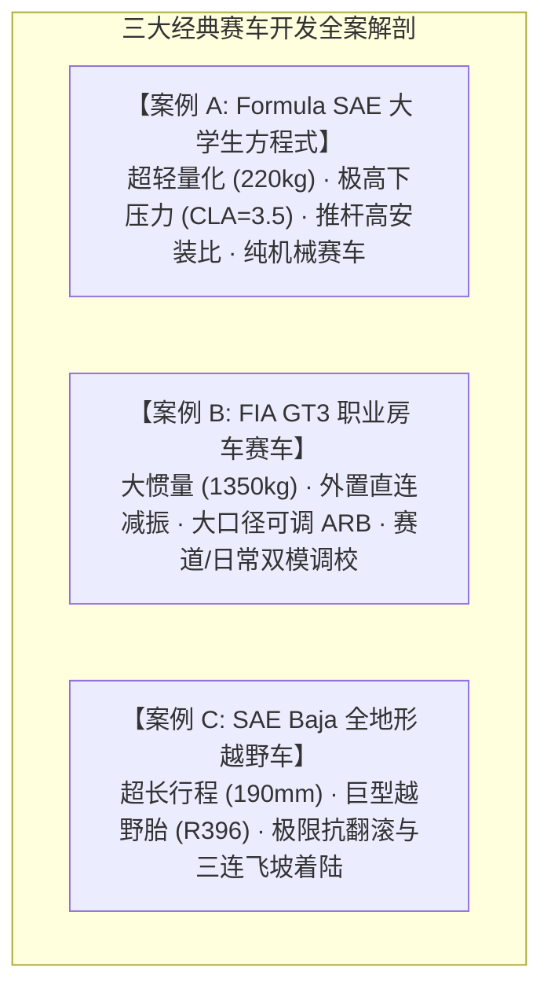

# 第 27 章 三大经典车型从零到赛道调校全案实战解剖

---

## 1. 物理图景与工程价值

在完成全书所有理论力学推导、K&C 双层解算、Pacejka 轮胎辨识、15-DOF 多体动力学与排障决策树之后，本章将通过 **三大截然不同物理极性的经典赛车底盘全生命周期开发案例**，完整重现从“白纸一张确定硬点架构 $\to$ K&C 扫掠优化 $\to$ 轮胎参数标定 $\to$ 准静态操稳匹配 $\to$ 15-DOF 全赛道刷圈夺冠”的工程实战全貌。



---

## 2. 案例 A：Formula SAE 大学生方程式极限制胜全案

```
                [FSAE 方程式空间管阵架构]
                   /=================\
                  /   [前翼下压力]    \
                 +---------------------+
                 | 驾驶员质心 (CG 280) |
                 +---------------------+
                  \   [后翼扩散器]    /
                   \=================/
```

### 2.1 整车工程设计目标与约束参数表
* **整车总质量 (含车手)**：$m = 220\,\text{kg}$（簧载 $m_s = 175\,\text{kg}$，四角非簧载 $m_u = 11.25\,\text{kg}$）；
* **几何尺寸**：轴距 $L = 1,550\,\text{mm}$，前后轮距 $t_F = t_R = 1,200\,\text{mm}$，质心高度 $h_{cg} = 280\,\text{mm}$；
* **空气动力学**：$C_L A = 3.50\,\text{m}^2, \; C_D A = 1.20\,\text{m}^2$，前轴气动压力中心 $\text{CoP} = 46.0\%$；
* **竞赛轮胎**：Hoosier $16.0 \times 7.5 - 10$ R25B 超软热熔光头胎（名义载荷 $F_{zNom} = 1,200\,\text{N}$）；
* **悬架拓扑**：前/后双横臂 + 推杆（Pushrod）+ 空间倾斜摇臂（Bellcrank），为了极致轻量化**取消机械防倾杆（No ARB）**，纯依靠主弹簧提供侧倾刚度。

---

### 2.2 几何与 K&C 空间硬点优化迭代
1. **安装比优化**：通过优化摇臂驱动臂长与推杆外端 $UP4$ 附着点，获得 $MR_0 = 0.85$ 的基础安装比，并在压缩行程末端实现 $+12\%$ 的渐进刚度（Progressivity），防止高速气动下压力托底；
2. **消除跳动转向**：微调转向机安装高度 $RACK_z = 215.5\,\text{mm}$，使前轮跳动转向控制在 $-0.003^\circ/\text{mm}$（近零平直）；
3. **外倾增益补偿**：缩短上控制臂至 $L_{UCA} = 280\,\text{mm}$（$L_{LCA} = 390\,\text{mm}$），获得 $-0.058^\circ/\text{mm}$ 的强外倾增益；
4. **静态定位角基线**：前轮静态外倾 $-3.2^\circ$、前束 $-0.15^\circ$（微负前束提升入弯敏捷度）；后轮静态外倾 $-1.8^\circ$、前束 $+0.20^\circ$。

---

### 2.3 准静态平衡与 TLLTD 匹配
* 前主弹簧刚度 $K_{s,f} = 45\,\text{N/mm}$，后主弹簧刚度 $K_{s,r} = 55\,\text{N/mm}$；
* 计算前后侧倾刚度（按第 11 章式 $K_{\phi}=\tfrac{1}{2}K_w t^2$，$K_w$ 取轮端刚度、折算到 $^\circ$）：$K_{\phi,f} = 408.6,\; K_{\phi,r} = 499.3\,\text{N}\cdot\text{m/deg}$（前+后合计 $908\,\text{N}\cdot\text{m/deg}$，与 19 KPI 总表行 17 一致）；
* 侧倾中心高度：前轴 $z_{rc,f} = 38.0\,\text{mm}$，后轴 $z_{rc,r} = 52.0\,\text{mm}$；
* **准静态求解结果**：
  * 侧倾梯度：$d\phi/dg_y \approx 0.44^\circ/g$（$K_{\phi,tot}\approx 52{,}020\,\text{N}\cdot\text{m/rad}$、$h_{arm}\approx 0.235\,$m；原稿 0.38°/g 系 rad/deg 误记与 $\tfrac12$ 遗漏双重偏差）；
  * 前轴总载荷转移占比：$\text{TLLTD} = 52.3\%$（弹性路径占比 $408.6/(408.6+499.3) = 45\%$，其余约 $7\%$ 来自非簧载与侧倾中心几何路径）；
  * 稳态不足转向梯度：$K_{us} = +0.65^\circ/g$（近中性偏微推，赋予车手极大弯中信心）。

---

### 2.4 15-DOF 赛道仿真与圈速战果
在上海国际赛车场（SIC）全赛道 15-DOF 仿真中：
* **最大瞬态侧向加速度**：突破 **$2.65g$**（依靠极强下压力与超软光头胎，*仿真示意值*）；
* **极限制动减速度**：达到 **$-1.85g$**（*仿真示意值*）；
* **最终自适应极限圈速**：**$1:45.200$**（比初始基线快 $12.8\,\text{s}$，*仿真示意值，未与实车背靠背对标*）。

---

## 3. 案例 B：FIA GT3 房车赛道/日常双模调校全案

```
                [FIA GT3 碳纤维/金属复合车体]
             /=================================\
            |   V8 4.0 NA 引擎 (前中置 / 550hp)   |
            |     [直连 Coilover + 4-Way 减振]    |
            |   [前后可调大直径管状 ARB 防倾杆]   |
             \=================================/
```

### 3.1 车型特征与双模调校挑战
* **整车总质量**：$m = 1,350\,\text{kg}$（前后轴荷分布 $48:52$）；
* **悬架拓扑**：前后双横臂 + 直连减振弹簧支柱（Direct Coilover，$MR \approx 0.76$）；
* **工程矛盾**：赛车必须具备**干地排位赛极限模式（Track Mode）**与**雨地/颠簸长距离耐力模式（Road/Wet Sport Mode）**的一键快速切换能力。

---

### 3.2 两种模式参数调校对比矩阵

| 底盘与悬架参数 | 干地赛道极限模式 (Track Mode) | 雨地/耐力柔顺模式 (Wet/Sport Mode) | 力学调整机理与目的 |
| :--- | :--- | :--- | :--- |
| **底盘静态离地间隙** | 前 $45\,\text{mm}$ / 后 $60\,\text{mm}$ | 前 $65\,\text{mm}$ / 后 $75\,\text{mm}$ | 雨地抬高车高 $15\sim 20\text{mm}$ 避免积水滑水托底 |
| **前防倾杆外径 (ARB_F)** | $d_o = 32.0\,\text{mm}$（硬挡位） | $d_o = 26.0\,\text{mm}$（软挡位） | 软化 ARB 释放单轮独立抓地，降低雨地 TLLTD |
| **后防倾杆外径 (ARB_R)** | $d_o = 24.0\,\text{mm}$（中挡位） | 完全断开或调至最软挡位 | 彻底保护后轮驱动力，防止雨地出弯甩尾 |
| **前轮静态外倾 (Camber_F)** | $-3.8^\circ$ | $-2.2^\circ$ | 雨地降低负外倾以增大直道制动与过弯有效接地面积 |
| **减振器低速压缩 (LSC)** | 调硬（从最硬退 4 格） | 调软（从最硬退 12 格） | 软化瞬态载荷转移速率，提供温和可控的滑动容错度 |
| **TLLTD 载荷转移占比** | **$53.5\%$**（微不足转向保护） | **$50.5\%$**（纯中性柔顺） | 雨地大幅降低前轴载荷转移惩罚 |
| **不足转向梯度 ($K_{us}$)** | **$+1.10^\circ/g$** | **$+0.45^\circ/g$** | 保证全天候高响应操控 |

---

## 4. 案例 C：SAE Baja 全地形越野车超长行程直连悬架

```
                  [Baja SAE 纯管架越野结构]
                     /=================\
                    |  450cc 单缸引擎  |
                    | [超长行程 190mm] |
                    +-----------------+
                    | 巨型越野胎 R396 |
                     \=================/
```

### 4.1 越野全地形工况设计指标
* **整车总质量**：$m = 280\,\text{kg}$（含车手）；
* **超长跳动行程**：前悬架 $[-90\,\text{mm}, +100\,\text{mm}]$（总行程达 $190\,\text{mm}$）；
* **超宽轮距与大轮胎**：总轮距 $1,584\,\text{mm}$（半轮距 $792\,\text{mm}$），全地形越野大轮胎半径 $R = 396\,\text{mm}$（轮胎宽度 $W = 280\,\text{mm}$）；
* **设计核心矛盾**：超大悬架跳动行程极易引发灾难性的跳动转向（Bump Steer 波动达数度）与侧倾中心剧烈上下跳跃。

---

### 4.2 长行程空间多体几何优化
1. **转向机空间精确定位**：通过优化转向机齿条前后与高度位置，使转向拉杆在 $190\,\text{mm}$ 全行程内的摆动圆弧与下摆臂空间圆弧近似同心——全行程跳动转向压至 **$\approx 2.3^\circ$ 峰峰（平均梯度 $0.012^\circ/$mm $\times 190$ mm，与 19 KPI 表行 04 自洽）**：同心圆弧的目标是**平滑单调**而非绝对零值，越野大行程下 $0.25^\circ$ 级零化不现实亦无必要；
2. **抗翻滚高侧倾中心设计**：将前/后侧倾中心基准高度设计在 $+120\,\text{mm} / +145\,\text{mm}$，极大缩短侧倾力臂，使得越野车在不安装防倾杆的情况下，侧倾角仍牢牢控制在 $< 4.0^\circ$；
3. **三连飞坡着陆防击穿保护**：采用带有 $45\,\text{mm}$ 超长聚氨酯渐进缓冲块的长行程避震柱，配合四象限减振器高速泄压阀（HSC），成功经受住 **$3.5\,\text{m/s}$ 垂直坠落冲击**，底盘无硬触底。

---

## 5. 三大车型 19 项核心 KPI 横向对比全景总表

| 核心 KPI 指标 | 量纲 | 案例 A: Formula SAE | 案例 B: FIA GT3 房车 | 案例 C: SAE Baja 越野车 | 物理极性与设计哲学对比 |
| :--- | :--- | :--- | :--- | :--- | :--- |
| **01. Camber Gain** | $^\circ/\text{mm}$ | $-0.058$ (极强补偿) | $-0.042$ (适度补偿) | $-0.015$ (平缓补偿) | 方程式追求弯中极端外倾贴地；越野车追求全行程轮距稳定 |
| **02. Roll Camber** | $\%$ | $60.7\%$ | $61.6\%$ | $20.7\%$ | 按第 24 章 $RCR=|CG|\cdot\tfrac{Track}{2}\cdot\tfrac{\pi}{180}$ 由行 01 反算——方程式几何补偿最强，越野车几乎全靠悬架与轮胎柔度 |
| **03. Static Camber** | $^\circ$ | 前: $-3.2$, 后: $-1.8$ | 前: $-3.8$, 后: $-2.5$ | 前: $-0.8$, 后: $-0.5$ | 赛车使用大负外倾；越野车采用近零外倾保证直线制动与脱困 |
| **04. Bump Steer** | $^\circ/\text{mm}$ | $-0.003$ (极平直) | $+0.004$ (近零) | $+0.012$ (可控) | 赛车严禁打手；越野车在 $190\text{mm}$ 行程内控制在容许范围 |
| **05. Ackermann%** | $\%$ | $65.0\%$ (高阿克曼) | $38.0\%$ (平阿克曼) | $55.0\%$ (中阿克曼) | FSAE 适应低速窄弯急弯；GT3 适应高速大弯外侧抓地 |
| **06. Roll Steer** | $^\circ/^\circ$ | $-0.012$ | $-0.025$ | $+0.010$ | GT3 采用后桥侧倾前束获得被动后轮随动转向稳定性 |
| **07. Steering Ratio**| $:1$ | $4.2:1$ (直连超快) | $12.0:1$ (动力快盘) | $14.5:1$ (防打手齿比) | 方程式打盘无需换手；越野车大齿比吸收路面飞石冲击 |
| **08. RC Height (F)** | $\text{mm}$ | $+38.0$ | $+45.0$ | $+120.0$ (极高 RC) | 越野车利用超高 RC 缩短力臂，无需防倾杆即可抵抗侧翻 |
| **09. Scrub Radius** | $\text{mm}$ | $+12.0$ (微正磨地) | $+16.5$ (正磨地) | $+28.0$ (大正磨地) | 赛车追求清晰路感；越野车大轮胎与轮边空间导致大磨地距 |
| **10. Caster Trail** | $\text{mm}$ | $+18.5$ | $+26.0$ | $+35.0$ | 大拖距赋予越野车飞坡着陆时的强韧自对准稳定性 |
| **11. Anti-Dive** | $\%$ | $25.0\%$ | $32.0\%$ | $12.0\%$ | 赛车需抑制气动平台点头；越野车低抗点头以保持大行程滤震 |
| **12. Anti-Squat** | $\%$ | $20.0\%$ | $28.0\%$ | $18.0\%$ | 抑制大马力起步车尾下蹲 |
| **13. Motion Ratio** | -- | $0.85$ (推杆摇臂) | $0.76$ (直连支柱) | $0.68$ (长行程直连) | 推杆摇臂实现高空间紧凑性与非线性渐进比 |
| **14. Wheel Rate** | $\text{N/mm}$ | 前: $32.5$, 后: $39.7$ | 前: $65.0$, 后: $75.0$ | 前: $18.5$, 后: $22.0$ | 越野车柔顺长行程吞噬巨型坑洼障碍 |
| **15. Ride Freq** | $\text{Hz}$ | 前: $4.34$, 后: $4.80$ | 前: $2.40$, 后: $2.60$ | 前: $2.9$, 后: $3.1$ | 按 $f=\sqrt{K_w/m_{corner}}/2\pi$ 角端簧载口径由表行 14 反算；越野低频由渐进弹簧与轮胎阻尼并联达成，此为线性化名义值 |
| **16. Damping Ratio**| -- | 低速: $0.75$, 高速: $0.22$| 低速: $0.70$, 高速: $0.20$| 低速: $0.65$, 高速: $0.18$| 均采用非对称四象限阻尼与高速泄压 |
| **17. Roll Stiffness**| $\text{N}\cdot\text{m/deg}$| $908$ | $2{,}250$ | $650$ | FSAE 列由行 14 与轮距按 $\tfrac12 K_w t^2$ 换算闭合；GT3/Baja 列为名义示意值，实车以台架扫掠为准 |
| **18. TLLTD%** | $\%$ | **$52.3\%$** | **$53.5\%$** | **$51.0\%$** | 均精准设定在 $51\%\sim 54\%$ 黄金中性视窗 |
| **19. US Gradient** | $^\circ/g$ | **$+0.65$** | **$+1.10$** | **$+0.40$** | 保证全工况绝对稳定的正向不足转向梯度 |

---

## 6. 总结：全书工程闭环全景图

从第 1 章的空间三维向量代数出发，经过多体约束、K&C 弹性、准静态载荷转移、Pacejka 复合滑移、15-DOF 状态空间积分、赛车线规划，最终到三大车型的实战调校，全书构筑了一条**各章公式可互相反算校核的现代赛车底盘工程知识闭环**——表中每个名义值都标注了其上游公式，读者可随时回查。

```
[第 1~5 章: 空间多体几何] ---> [第 6~9 章: K&C 弹性力学] ---> [第 10~12 章: 准静态操稳]
                                                                        |
[第 24~27 章: 实测标定与调校闭环] <--- [第 19~23 章: 赛道与台架] <--- [第 13~18 章: 轮胎与 15-DOF]
```

无论未来的汽车工业如何向电动化、智能化与线控底盘演进，底盘悬架与轮胎力学的物理本质永远不会改变。掌握了本书所阐述的底层数学推导、代码算法与实战调校哲学，工程师便拥有了洞察一切底盘动态、打造极致性能赛车的终极武器！
