# 车辆工程 · 全车底盘悬架力学与动力学工程全书

> **LABSUS RACING DYNAMICS & SUSPENSION MECHANICS MONOGRAPH**  
> 从空间多体运动学、K&C 弹性力学到 15-DOF 瞬态动力学与赛道调校工程闭环

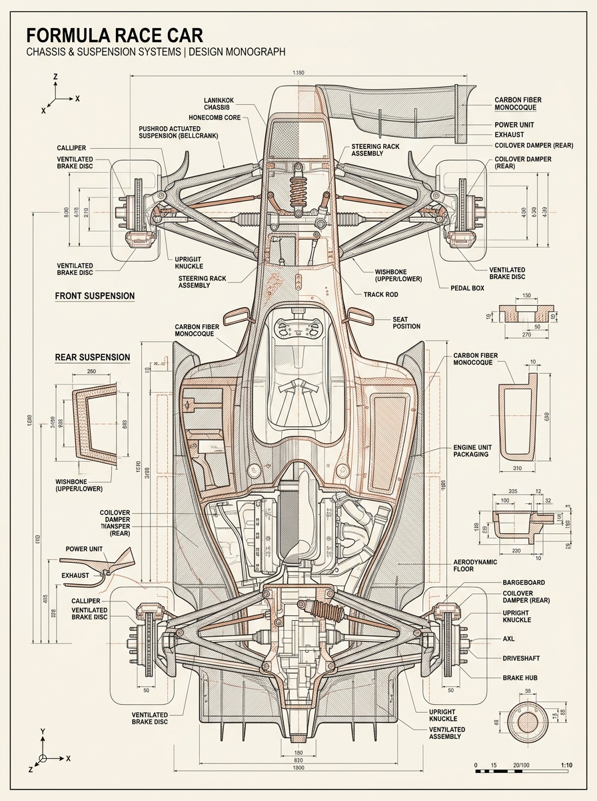

> **著　者**：**山海浪子**  
> **协　同**：LABSUS 赛车动力学与高性能底盘研发工程团队  
> **适用领域**：世界级方程式/GT3 赛车与高性能乘用车底盘悬架力学、多体动力学与赛道实测标定  
> **全书体量**：8 大核心篇章 + 完整数理基础篇 · 31 篇专业章节 · 6,032 行高保真代码级推导  
> **出版版本**：2026 年 9 月合订本 · 车辆工程学习笔记 · 绝密工程典藏

<div style="page-break-after: always; break-after: page;"></div>

# 全书总目录 (Table of Contents)

---


### 全书前置 底盘动力学数学与物理第一性原理基石


* **基础 1**：三维线性代数与矩阵分析全解

* **基础 2**：多元微积分、微分几何与非线性优化

* **基础 3**：理论力学、空间力系与刚体动力学基础

* **基础 4**：数值分析基础、保形样条与常微分方程积分


### 第一篇 空间机构运动学与几何学第一性原理


* **第 1 章**：空间三维向量与刚体姿态数学基础

* **第 2 章**：双横臂悬架空间拓扑与铰链圆约束

* **第 3 章**：推杆与空间倾斜摇臂机构力学

* **第 4 章**：非线性运动学求解器：TRF 与 PBD 闭式投影

* **第 5 章**：主销定位几何：Caster, KPI 与瞬心侧倾中心


### 第二篇 静力平衡与 K&C 弹性力学体系


* **第 6 章**：空间二力杆静力平衡与受力求解

* **第 7 章**：6 自由度各向异性橡胶衬套本构模型

* **第 8 章**：两层嵌套非线性弹性 K&C 求解器

* **第 9 章**：K&C 试验台架准静态扫掠与增益提取


### 第三篇 准静态操稳与载荷转移控制理论


* **第 10 章**：准静态过弯平衡与空间侧倾迭代

* **第 11 章**：总侧倾载荷转移 (TLLTD) 与三路径动载分解

* **第 12 章**：不足转向梯度、轮胎载荷敏感性与 Jacking 抬升


### 第四篇 现代非线性轮胎力学与实测辨识


* **第 13 章**：Fiala 刷子模型推导与 Pacejka 魔术公式

* **第 14 章**：复合滑移摩擦圆与松弛时延方程

* **第 15 章**：轮胎试验台架数据 Pacejka 参数拟合


### 第五篇 15-DOF 全车多体瞬态动力学


* **第 16 章**：15 自由度状态空间微分方程组建立

* **第 17 章**：四象限非线性减振器与限位块击穿模型

* **第 18 章**：空气动力学多场耦合：地面效应与 DRS


### 第六篇 赛道环境、最优赛车线与自动驾驶


* **第 19 章**：闭合赛道样条几何学与连续曲率提取

* **第 20 章**：外-内-外平滑赛车线规划与速度剖面

* **第 21 章**：曲率前馈 Stanley 控制与刹车自适应学习


### 第七篇 试验场测试工况与 4-Post 台架动力学


* **第 22 章**：七大综合试验场场景数学与几何构建

* **第 23 章**：4-Post 液压台架时域激励与振动响应


### 第八篇 底盘综合评价体系、实测标定与调校闭环（核心精华）


* **第 24 章**：19 项核心 KPI 灵敏度导数图谱与参数调校杠杆

* **第 25 章**：实测台架标定与仿真对标闭环方法论

* **第 26 章**：赛道工程师排障决策树与全工况调校矩阵

* **第 27 章**：三大经典车型从零到赛道调校全案实战解剖


<div style="page-break-after: always; break-after: page;"></div>


## 全局坐标系与符号系统约定


为了保证全书在多体运动学、静力学、准静态操稳与 15-DOF 瞬态动力学推导中的严密性与无歧义性，全书统一遵循如下物理约定：

### 1. 车辆与空间悬架坐标系 (Vehicle & Suspension Frame)
本书采用与项目规范真源 `engine/src/core/convention.py` 一致的**笛卡尔直角坐标系（X 前、Y 右、Z 上）**。须如实声明：该基底满足 forward×right=down，行列式为 $-1$，**数学上是左手系**（部分教科书口径把 Z 取向下以回到右手系）。因此全书的叉积与旋转一律按**行列式代数展开**定义，各角正方向以物理语言钉死为：航向角 $\psi$ 正 = 车头向右偏；俯仰角 $\theta$ 正 = 抬头；侧倾角 $\phi$ 正 = 右侧下沉（弯中向外侧倾姿态）。角速度取 $p=\dot\phi$、$q=\dot\theta$、$r=\dot\psi$。与经典右手系教材（ISO 的 X前/Y左/Z上）比对任何公式时，注意相应分量与旋转项差一个符号。
> **代码迁移状态**：`convention.py` 与 `solver/angles.py` 已按本约定实现；`v3service.py`、`mechanism/models.py` 及前端 `02-presets.js`、硬点表头等**仍按旧分量顺序书写（第一分量 = 横向）**，对照代码复算时须将数组前两个分量互换。
* **$+X$ 轴**：指向车身**正前方**（Forward，前进方向 / 纵向）；
* **$+Y$ 轴**：指向车身**右侧 / 外侧**（对左侧悬架采用镜像变换 $Y \to -Y$）；
* **$+Z$ 轴**：指向**正上方**（Upward，垂直地面向上）。

```
        +Z (Up 向上)
         |
         |   +X (Forward 向前)
         |  /
         | /
         |/
         +--------------> +Y (Right / Outboard 向右/向外)
```

### 2. 悬架运动与定位角符号约定
* **轮跳行程 (Wheel Travel $tr$)**：以设计静止状态为零点，$tr > 0$ 表示车轮向上跳动（Jounce / Bump 压缩），$tr < 0$ 表示车轮向下伸张（Rebound / Droop）；
* **外倾角 (Camber Angle $\gamma$)**：车轮上端向车身内侧倾斜定义为**负外倾 (Negative Camber)**，两侧车轮统一以顶端内倾为负；
* **前束角 (Toe Angle $\delta_{toe}$)**：车轮前端向车身内侧偏转定义为**前束 (Toe-in，正值)**，向外偏转定义为**负前束 (Toe-out，负值)**；
* **主销内倾角 (KPI / SAI $\theta_{kpi}$)**：主销轴线上端向车身内侧倾斜为正；
* **主销后倾角 (Caster $\theta_{caster}$)**：主销轴线上端向车身正后方倾斜为正；
* **磨地半径 (Scrub Radius $r_{scrub}$)**：主销接地交点位于轮胎接地中心内侧（接地中心在外）定义为**正磨地半径**；
* **主销拖距 (Caster Trail $t_{trail}$)**：主销接地交点位于轮胎接地中心前方定义为**正拖距**。

---


---


# 全书前置 底盘动力学数学与物理第一性原理基石


> **在全书的位置**：全书知识大厦的数理底座——系统梳理三维空间向量代数、正交群 SO(3)、多元微积分、微分几何、空间力系简化、惯性张量与数值积分算法。  
> **核心力学机制**：反对称矩阵算子 [u]× 幂次恒等式、SVD 奇异值分解极值定理、超定方程 Moore-Penrose 伪逆、雅可比矩阵牛顿-拉夫逊求根、力向一点平移定理、机体动坐标系欧拉方程与半隐式保辛欧拉积分。


---


## 基础 1 三维线性代数与矩阵分析全解

**脉络锚点**：三维向量代数、反对称算子与正交群构成空间机构多体运动学的通用数学基石。

**本章导图**：

| 核心课题 | 支配方程 / 关键变量 | 一句话力学结论 |
|---|---|---|
| 向量代数 | 点积投影算子与叉积反对称矩阵 [u]× | 反对称矩阵平方与立方恒等式折叠旋转级数 |
| 矩阵与群 | SO(3) 正交矩阵与 det(R)=+1 手征性约束 | 严格杜绝矩阵运算中的反射镜像退化 |
| SVD 与伪逆 | 奇异值分解几何图景与正交 Procrustes 极值 | Moore-Penrose 广义逆与加权最小二乘 WLS |


---

### 0.1.1 物理图景与工程痛点 【前置】

在底盘悬架工程、多刚体运动学与轮胎力学仿真中，几乎所有物理状态、几何约束与外力载荷最终都抽象为高维向量空间中的代数映射。许多读者在接触第 1 章空间姿态旋转（Rodrigues 公式、四元数）、第 6 章悬架 5 杆空间超定静力求解、第 15 章轮胎 Pacejka 参数辨识时，常常感到困惑：
1. **几何概念与代数形式割裂**：知道向量“点乘”和“叉乘”，但不清楚为什么空间旋转可以用一个反对称矩阵 $[\boldsymbol{u}]_\times$ 的平方幂次直接解析展开？为什么叉积的代数恒等式是推导有限角旋转算子的核心基石？
2. **坐标系手征性混淆**：习惯了教科书中的传统右手系，面对现代工程软件或本项目真源 *engine/src/core/convention.py* 采用的左手系（$+X$ 前、$+Y$ 右、$+Z$ 上），行列式展开为什么会自动处理手征性？正交矩阵 $\mathrm{SO}(3)$ 中 $\det(\boldsymbol{R}) = +1$ 与 $\det(\boldsymbol{R}) = -1$（镜像退化）在物理上究竟代表什么灾难性错误？
3. **矩阵病态与求解发散**：面对悬架多连杆空间受力，当方程数大于未知数（超定）或者杆系接近共线时，普通的矩阵求逆为什么会直接发散或崩溃？Moore-Penrose 广义逆、加权最小二乘 (WLS) 与 Tikhonov 岭回归的真实几何图景是什么？

本章从最基础的三维向量定义出发，循序渐进推导点积正交分解、叉积反对称算子 $[\boldsymbol{u}]_\times$ 幂次性质、$\mathrm{SO}(3)$ 正交群、奇异值分解 (SVD) 与极值定理，为全书后续空间多体动力学扫清全部代数障碍。

---

### 0.1.2 底层数学力学严密推导 【推导】

#### 0.1.2.1 向量空间与坐标基底表示

设三维欧氏空间为 $\mathbb{R}^3$，任选一组相互正交的单位基底向量 $\{\boldsymbol{e}_1, \boldsymbol{e}_2, \boldsymbol{e}_3\}$（例如车身参考坐标系的纵向、横向与垂向轴）。任意空间物理向量 $\boldsymbol{v}$ 可以唯一表示为各基底分量的线性组合：
$$\boldsymbol{v} = v_x \boldsymbol{e}_1 + v_y \boldsymbol{e}_2 + v_z \boldsymbol{e}_3 = [v_x, v_y, v_z]^T$$

向量的欧几里得范数（长度 / 模长）定义为：
$$\|\boldsymbol{v}\| = \sqrt{v_x^2 + v_y^2 + v_z^2} = \sqrt{\boldsymbol{v}^T \boldsymbol{v}}$$
若 $\|\boldsymbol{v}\| \neq 0$，其单位方向向量为 $\hat{\boldsymbol{v}} = \frac{\boldsymbol{v}}{\|\boldsymbol{v}\|}$。

---

#### 0.1.2.2 向量点积（数量积 / 内积）与正交投影算子

#### (1) 代数定义与几何性质
两个向量 $\boldsymbol{a} = [a_x, a_y, a_z]^T$ 与 $\boldsymbol{b} = [b_x, b_y, b_z]^T$ 的点积定义为对应坐标分量乘积的代数和：
$$\boldsymbol{a} \cdot \boldsymbol{b} = a_x b_x + a_y b_y + a_z b_z = \boldsymbol{a}^T \boldsymbol{b}$$
根据余弦定理，点积的几何等价形式为：
$$\boldsymbol{a} \cdot \boldsymbol{b} = \|\boldsymbol{a}\| \|\boldsymbol{b}\| \cos\theta$$
其中 $\theta \in [0, \pi]$ 为两向量间的夹角。若 $\boldsymbol{a} \cdot \boldsymbol{b} = 0$ 且两者非零，则称 $\boldsymbol{a}$ 与 $\boldsymbol{b}$ 相互正交（Orthogonal，垂直）。

#### (2) 空间投影与正交补算子
设 $\boldsymbol{u}$ 为空间已知方向的单位向量（$\|\boldsymbol{u}\| = 1$）。任意向量 $\boldsymbol{v}$ 均可无歧义地分解为**平行于 $\boldsymbol{u}$ 的纵向投影分量** $\boldsymbol{v}_\parallel$ 与**垂直于 $\boldsymbol{u}$ 的横向正交分量** $\boldsymbol{v}_\perp$：
$$\boldsymbol{v} = \boldsymbol{v}_\parallel + \boldsymbol{v}_\perp$$

根据几何投影：
$$\boldsymbol{v}_\parallel = (\|\boldsymbol{v}\| \cos\theta) \boldsymbol{u} = (\boldsymbol{v} \cdot \boldsymbol{u}) \boldsymbol{u} = (\boldsymbol{u}^T \boldsymbol{v}) \boldsymbol{u}$$
利用矩阵乘法的结合律，$(\boldsymbol{u}^T \boldsymbol{v}) \boldsymbol{u} = \boldsymbol{u} (\boldsymbol{u}^T \boldsymbol{v}) = (\boldsymbol{u} \boldsymbol{u}^T) \boldsymbol{v}$。定义**平行投影矩阵** $\boldsymbol{P}_\parallel \in \mathbb{R}^{3 \times 3}$：
$$\boldsymbol{P}_\parallel = \boldsymbol{u} \boldsymbol{u}^T = \begin{bmatrix} u_x^2 & u_x u_y & u_x u_z \\ u_y u_x & u_y^2 & u_y u_z \\ u_z u_x & u_z u_y & u_z^2 \end{bmatrix}$$
相应地，垂直分量为：
$$\boldsymbol{v}_\perp = \boldsymbol{v} - \boldsymbol{v}_\parallel = \boldsymbol{I}\boldsymbol{v} - (\boldsymbol{u}\boldsymbol{u}^T)\boldsymbol{v} = (\boldsymbol{I} - \boldsymbol{u}\boldsymbol{u}^T)\boldsymbol{v}$$
定义**正交垂直投影矩阵** $\boldsymbol{P}_\perp = \boldsymbol{I} - \boldsymbol{u}\boldsymbol{u}^T$。易证两者均为对称幂等矩阵：
$$\boldsymbol{P}_\parallel^2 = \boldsymbol{P}_\parallel, \quad \boldsymbol{P}_\perp^2 = \boldsymbol{P}_\perp, \quad \boldsymbol{P}_\parallel \boldsymbol{P}_\perp = \boldsymbol{0}$$

---

#### 0.1.2.3 向量叉积（向量积 / 外积）与反对称矩阵算子

#### (1) 行列式定义与手征性
两向量 $\boldsymbol{a}$ 与 $\boldsymbol{b}$ 的叉积产生一个同时垂直于 $\boldsymbol{a}$ 与 $\boldsymbol{b}$ 的新向量 $\boldsymbol{c} = \boldsymbol{a} \times \boldsymbol{b}$。其解析坐标由三阶符号行列式给出：
$$\boldsymbol{a} \times \boldsymbol{b} = \begin{vmatrix} \boldsymbol{e}_1 & \boldsymbol{e}_2 & \boldsymbol{e}_3 \\ a_x & a_y & a_z \\ b_x & b_y & b_z \end{vmatrix} = \begin{bmatrix} a_y b_z - a_z b_y \\ a_z b_x - a_x b_z \\ a_x b_y - a_y b_x \end{bmatrix}$$
模长几何意义为两向量所围成的平行四边形面积：
$$\|\boldsymbol{a} \times \boldsymbol{b}\| = \|\boldsymbol{a}\| \|\boldsymbol{b}\| \sin\theta$$

> **项目左手系约定说明**：
> 若工程坐标系定义满足 $\boldsymbol{e}_1 \times \boldsymbol{e}_2 = -\boldsymbol{e}_3$（如本项目 $+X$ 前、$+Y$ 右、$+Z$ 上，满足 $F \times R = D$，行列式为 $-1$），为消除物理歧义，全书叉积严格遵循代数行列式展开式，保证数学形式与符号在所有算法实现中 100% 封闭一致。

#### (2) 叉积反对称矩阵 $[\boldsymbol{u}]_\times \in \mathfrak{so}(3)$
在代数运算中，将叉乘操作转化为矩阵乘法是动力学线性化的核心手段。对于任意三维向量 $\boldsymbol{u} = [u_x, u_y, u_z]^T$，定义对应的**反对称矩阵（Skew-symmetric Matrix）** $[\boldsymbol{u}]_\times$（李代数 $\mathfrak{so}(3)$ 的元素）：
$$[\boldsymbol{u}]_\times \triangleq \begin{bmatrix} 0 & -u_z & u_y \\ u_z & 0 & -u_x \\ -u_y & u_x & 0 \end{bmatrix}$$
对任意向量 $\boldsymbol{v}$，恒有：
$$[\boldsymbol{u}]_\times \boldsymbol{v} = \boldsymbol{u} \times \boldsymbol{v}$$

#### (3) 核心代数恒等式定理与严格证明
**定理 1.1（反对称性）**：
$$[\boldsymbol{u}]_\times^T = -[\boldsymbol{u}]_\times$$

**定理 1.2（向量三重积展开 / Lagrange 恒等式）**：
对任意向量 $\boldsymbol{a}, \boldsymbol{b}, \boldsymbol{c}$，有：
$$\boldsymbol{a} \times (\boldsymbol{b} \times \boldsymbol{c}) = (\boldsymbol{a} \cdot \boldsymbol{c})\boldsymbol{b} - (\boldsymbol{a} \cdot \boldsymbol{b})\boldsymbol{c}$$
*证明*：直接按坐标代数展开：
$$\begin{aligned}
[\boldsymbol{a} \times (\boldsymbol{b} \times \boldsymbol{c})]_x &= a_y(b_x c_y - b_y c_x) - a_z(b_z c_x - b_x c_z) \\
&= b_x(a_y c_y + a_z c_z) - c_x(a_y b_y + a_z b_z) \\
&= b_x(a_x c_x + a_y c_y + a_z c_z) - c_x(a_x b_x + a_y b_y + a_z b_z) \\
&= (\boldsymbol{a} \cdot \boldsymbol{c})b_x - (\boldsymbol{a} \cdot \boldsymbol{b})c_x \quad \blacksquare
\end{aligned}$$

**定理 1.3（反对称矩阵的平方幂次恒等式）**：
若 $\boldsymbol{u}$ 为单位向量（$\|\boldsymbol{u}\|=1$），则其矩阵平方和立方满足闭式周期循环：
$$[\boldsymbol{u}]_\times^2 = \boldsymbol{u}\boldsymbol{u}^T - \boldsymbol{I}$$
$$[\boldsymbol{u}]_\times^3 = -[\boldsymbol{u}]_\times$$
*证明*：任取向量 $\boldsymbol{v}$，利用定理 1.2 的向量三重积展开：
$$[\boldsymbol{u}]_\times^2 \boldsymbol{v} = \boldsymbol{u} \times (\boldsymbol{u} \times \boldsymbol{v}) = (\boldsymbol{u} \cdot \boldsymbol{v})\boldsymbol{u} - (\boldsymbol{u} \cdot \boldsymbol{u})\boldsymbol{v}$$
因为 $\|\boldsymbol{u}\|^2 = \boldsymbol{u} \cdot \boldsymbol{u} = 1$，上式化为：
$$[\boldsymbol{u}]_\times^2 \boldsymbol{v} = (\boldsymbol{u}\boldsymbol{u}^T)\boldsymbol{v} - \boldsymbol{I}\boldsymbol{v} = (\boldsymbol{u}\boldsymbol{u}^T - \boldsymbol{I})\boldsymbol{v}$$
由于对任意 $\boldsymbol{v}$ 恒成立，立即导出矩阵等式：
$$[\boldsymbol{u}]_\times^2 = \boldsymbol{u}\boldsymbol{u}^T - \boldsymbol{I} \iff \boldsymbol{u}\boldsymbol{u}^T = \boldsymbol{I} + [\boldsymbol{u}]_\times^2$$
两边同乘 $[\boldsymbol{u}]_\times$：
$$[\boldsymbol{u}]_\times^3 = [\boldsymbol{u}]_\times (\boldsymbol{u}\boldsymbol{u}^T - \boldsymbol{I}) = (\boldsymbol{u} \times \boldsymbol{u})\boldsymbol{u}^T - [\boldsymbol{u}]_\times = \boldsymbol{0} - [\boldsymbol{u}]_\times = -[\boldsymbol{u}]_\times \quad \blacksquare$$

> **数学与工程联结**：
> 这组恒等式是全书第 1 章推导任意轴线空间旋转 Rodrigues 公式闭式解的源动力！因为 $[\boldsymbol{u}]_\times^3 = -[\boldsymbol{u}]_\times$，使得矩阵指数 Taylor 展开 $\exp(\theta [\boldsymbol{u}]_\times) = \sum_{k=0}^\infty \frac{\theta^k [\boldsymbol{u}]_\times^k}{k!}$ 的无穷级数能够被完全折叠为正弦与余弦项！

---

#### 0.1.2.4 矩阵群 $\mathrm{SO}(3)$、正交性与镜像退化

刚体在空间移动时，任意两点间的距离恒定，任意两向量间的夹角保值。这种运动在代数上严格对应**保距保内积的正交变换**。

#### (1) 正交矩阵定义
矩阵 $\boldsymbol{R} \in \mathbb{R}^{3 \times 3}$ 称为正交矩阵（Orthogonal Matrix），当且仅当满足：
$$\boldsymbol{R}^T \boldsymbol{R} = \boldsymbol{R} \boldsymbol{R}^T = \boldsymbol{I} \implies \boldsymbol{R}^{-1} = \boldsymbol{R}^T$$
其列向量 $\boldsymbol{r}_1, \boldsymbol{r}_2, \boldsymbol{r}_3$ 构成一组标准正交基：
$$\boldsymbol{r}_i^T \boldsymbol{r}_j = \delta_{ij} = \begin{cases} 1, & i = j \\ 0, & i \neq j \end{cases}$$

#### (2) 行列式特征与镜像退化
对正交条件两端取行列式：
$$\det(\boldsymbol{R}^T \boldsymbol{R}) = \det(\boldsymbol{R}^T) \det(\boldsymbol{R}) = (\det(\boldsymbol{R}))^2 = \det(\boldsymbol{I}) = 1$$
$$\implies \det(\boldsymbol{R}) = \pm 1$$
* **特殊正交群 $\mathrm{SO}(3)$（刚体纯旋转）**：$\det(\boldsymbol{R}) = +1$。刚体手征性严格保持，刚体上的任意右手系变换后依然为右手系；
* **正交镜像群（Reflection / 镜像退化）**：$\det(\boldsymbol{R}) = -1$。变换包含了空间镜像翻转（如对称平面镜像），物体在物理上相当于被反转了“内脏手征性”。在第 1 章 SVD 姿态估计中，若直接取极值可能会误解出 $\det = -1$ 的镜像解，因此必须通过 $\mathrm{diag}(1, 1, \det(\boldsymbol{V}\boldsymbol{U}^T))$ 强行反转第三轴以保证绝对处于 $\mathrm{SO}(3)$ 中。

---

#### 0.1.2.5 奇异值分解 (SVD) 与极值最优估计

奇异值分解是现代工程数学中最重要的数据分析工具之一。

#### (1) SVD 矩阵分解定理
任意实数矩阵 $\boldsymbol{A} \in \mathbb{R}^{m \times n}$ 均可分解为三个矩阵的乘积：
$$\boldsymbol{A} = \boldsymbol{U} \boldsymbol{\Sigma} \boldsymbol{V}^T$$
其中：
* $\boldsymbol{U} \in \mathbb{R}^{m \times m}$ 为正交矩阵（列向量为 $\boldsymbol{A}\boldsymbol{A}^T$ 的正交特征向量，称为左奇异向量）；
* $\boldsymbol{V} \in \mathbb{R}^{n \times n}$ 为正交矩阵（列向量为 $\boldsymbol{A}^T\boldsymbol{A}$ 的正交特征向量，称为右奇异向量）；
* $\boldsymbol{\Sigma} \in \mathbb{R}^{m \times n}$ 为对角矩阵，对角线元素 $\sigma_1 \ge \sigma_2 \ge \dots \ge \sigma_p \ge 0$（$p = \min(m, n)$）称为奇异值，对应于变换的主轴伸缩尺度。

#### (2) 矩阵迹 (Trace) 的循环置换性质
方阵 $\boldsymbol{M} \in \mathbb{R}^{n \times n}$ 的迹定义为对角元素之和：
$$\mathrm{tr}(\boldsymbol{M}) = \sum_{i=1}^n M_{ii}$$
**关键定理**：迹具有循环置换不变性（Cyclic Invariance）：
$$\mathrm{tr}(\boldsymbol{A}\boldsymbol{B}) = \mathrm{tr}(\boldsymbol{B}\boldsymbol{A}), \quad \mathrm{tr}(\boldsymbol{A}\boldsymbol{B}\boldsymbol{C}) = \mathrm{tr}(\boldsymbol{C}\boldsymbol{A}\boldsymbol{B}) = \mathrm{tr}(\boldsymbol{B}\boldsymbol{C}\boldsymbol{A})$$
该性质是证明矩阵 Frobenius 范数等价性与最小二乘姿态极值定理的核心推演钥匙。

---

#### 0.1.2.6 超定方程组、Moore-Penrose 伪逆与加权最小二乘

在底盘工程中，悬架连杆受力求解（第 6 章）往往由 6 个外载荷平衡分量决定 5 根二力杆的轴向力，构成经典的非奇异超定/亚定矩阵系统。

#### (1) 普通最小二乘法 (OLS) 显式求导证明
设超定线性方程组为：
$$\boldsymbol{A} \boldsymbol{x} = \boldsymbol{b}, \quad \boldsymbol{A} \in \mathbb{R}^{m \times n}, \; m > n$$
通常无精确解。定义残差向量 $\boldsymbol{r}(\boldsymbol{x}) = \boldsymbol{A}\boldsymbol{x} - \boldsymbol{b}$，目标是使残差平方范数达到全局最小：
$$S(\boldsymbol{x}) = \|\boldsymbol{r}(\boldsymbol{x})\|^2 = (\boldsymbol{A}\boldsymbol{x} - \boldsymbol{b})^T (\boldsymbol{A}\boldsymbol{x} - \boldsymbol{b}) = \boldsymbol{x}^T \boldsymbol{A}^T \boldsymbol{A} \boldsymbol{x} - 2 \boldsymbol{b}^T \boldsymbol{A} \boldsymbol{x} + \boldsymbol{b}^T \boldsymbol{b}$$
由于 $S(\boldsymbol{x})$ 为关于 $\boldsymbol{x}$ 的严格凸二次型，对未知向量 $\boldsymbol{x}$ 求一阶偏导数向量（梯度）并令其为零：
$$\nabla_{\boldsymbol{x}} S(\boldsymbol{x}) = 2 \boldsymbol{A}^T \boldsymbol{A} \boldsymbol{x} - 2 \boldsymbol{A}^T \boldsymbol{b} = \mathbf{0}$$
整理得出著名的**高斯正规方程组 (Normal Equations)**：
$$\boldsymbol{A}^T \boldsymbol{A} \boldsymbol{x} = \boldsymbol{A}^T \boldsymbol{b}$$
若列向量线性无关，则 $\boldsymbol{A}^T \boldsymbol{A} \in \mathbb{R}^{n \times n}$ 严格对称正定可逆，唯一最优最小二乘解为：
$$\boldsymbol{x}^* = (\boldsymbol{A}^T \boldsymbol{A})^{-1} \boldsymbol{A}^T \boldsymbol{b} \triangleq \boldsymbol{A}^+ \boldsymbol{b}$$
其中 $\boldsymbol{A}^+ = (\boldsymbol{A}^T \boldsymbol{A})^{-1} \boldsymbol{A}^T$ 即为 **Moore-Penrose 广义逆矩阵（伪逆矩阵）**。

#### (2) 加权最小二乘法 (WLS)
当各方程残差物理量纲不同（如力和力矩量纲混合）或置信度不同时，必须引入对称正定权重矩阵 $\boldsymbol{W} \in \mathbb{R}^{m \times m}$。目标泛函为：
$$S_W(\boldsymbol{x}) = (\boldsymbol{A}\boldsymbol{x} - \boldsymbol{b})^T \boldsymbol{W} (\boldsymbol{A}\boldsymbol{x} - \boldsymbol{b})$$
同理求偏导求极值，解得加权正规方程闭式解：
$$\boldsymbol{x}_W^* = (\boldsymbol{A}^T \boldsymbol{W} \boldsymbol{A})^{-1} \boldsymbol{A}^T \boldsymbol{W} \boldsymbol{b}$$

---

#### 0.1.2.7 矩阵条件数与数值奇异性救赎

#### (1) 条件数 (Condition Number) 定义
矩阵 $\boldsymbol{A}$ 的条件数度量了线性系统解对输入微小扰动的敏感程度：
$$\kappa(\boldsymbol{A}) = \|\boldsymbol{A}\| \|\boldsymbol{A}^{-1}\| = \frac{\sigma_{\max}(\boldsymbol{A})}{\sigma_{\min}(\boldsymbol{A})}$$
* 若 $\kappa(\boldsymbol{A}) \approx 1 \sim 10^2$：矩阵**良态 (Well-conditioned)**，解的精度高且稳定；
* 若 $\kappa(\boldsymbol{A}) > 10^7$：矩阵**病态 (Ill-conditioned)**，微小的输入舍入误差将导致解发生成千上万倍的巨幅漂移；
* 若 $\sigma_{\min} = 0$：矩阵奇异发散，不可逆。

#### (2) Tikhonov 岭回归正则化 (Ridge Regularization)
当摆臂几乎平行或空间二力杆近乎共线时，$\boldsymbol{A}^T \boldsymbol{A}$ 的最小特征值趋近于 0。此时引入正定岭参数 $\lambda > 0$（Tikhonov 因子），将病态逆矩阵修正为：
$$\boldsymbol{x}_{reg} = (\boldsymbol{A}^T \boldsymbol{A} + \lambda \boldsymbol{I})^{-1} \boldsymbol{A}^T \boldsymbol{b}$$
其特征值谱平移使得有效条件数被强制压低：
$$\kappa_{reg} = \frac{\sigma_{\max}^2 + \lambda}{\sigma_{\min}^2 + \lambda} \le \frac{\sigma_{\max}^2 + \lambda}{\lambda} < \infty$$
彻底杜绝了除零发散与浮点溢出，是工业级数值求解器稳健性的最后一道安全防线。

---

### 0.1.3 手把手基础数值算例 (Worked Example) 【演算】

### 算例背景：空间向量点叉积与正规方程最小二乘求解

**工况参数**：
设某赛车悬架空间转向节上有两个关键受力矢量：
* 推杆力方向单位向量：$\boldsymbol{u} = [0.6, 0.0, 0.8]^T$（验证：$\|\boldsymbol{u}\| = \sqrt{0.36 + 0 + 0.64} = 1.0$）
* 轮心冲击力输入矢量：$\boldsymbol{F} = [1000.0, 500.0, 2000.0]^T\,\text{N}$

### 步骤 1：求解沿推杆方向的轴向力标量与分量
根据点积投影算子：
$$F_\parallel = \boldsymbol{F} \cdot \boldsymbol{u} = (1000.0)(0.6) + (500.0)(0.0) + (2000.0)(0.8) = 600.0 + 0.0 + 1600.0 = 2200.0\,\text{N}$$
沿推杆轴线的主动推力向量为：
$$\boldsymbol{F}_\parallel = F_\parallel \boldsymbol{u} = 2200.0 \times [0.6, 0.0, 0.8]^T = [1320.0, 0.0, 1760.0]^T\,\text{N}$$

### 步骤 2：求解垂直于推杆的侧向弯剪力分量
$$\boldsymbol{F}_\perp = \boldsymbol{F} - \boldsymbol{F}_\parallel = [1000.0 - 1320.0, \; 500.0 - 0.0, \; 2000.0 - 1760.0]^T = [-320.0, \; 500.0, \; 240.0]^T\,\text{N}$$
**正交性校核**：
$$\boldsymbol{F}_\perp \cdot \boldsymbol{u} = (-320.0)(0.6) + (500.0)(0.0) + (240.0)(0.8) = -192.0 + 0.0 + 192.0 = 0.0\,\text{N}$$
严格满足完全正交分解！

### 步骤 3：构造反对称矩阵 $[\boldsymbol{u}]_\times$ 并计算叉乘
根据公式构造矩阵：
$$[\boldsymbol{u}]_\times = \begin{bmatrix} 0 & -0.8 & 0.0 \\ 0.8 & 0 & -0.6 \\ 0.0 & 0.6 & 0 \end{bmatrix}$$
计算 $\boldsymbol{u} \times \boldsymbol{F}$：
$$\boldsymbol{u} \times \boldsymbol{F} = [\boldsymbol{u}]_\times \boldsymbol{F} = \begin{bmatrix} 0 & -0.8 & 0 \\ 0.8 & 0 & -0.6 \\ 0 & 0.6 & 0 \end{bmatrix} \begin{bmatrix} 1000.0 \\ 500.0 \\ 2000.0 \end{bmatrix} = \begin{bmatrix} -400.0 \\ 800.0 - 1200.0 \\ 300.0 \end{bmatrix} = \begin{bmatrix} -400.0 \\ -400.0 \\ 300.0 \end{bmatrix}\,\text{N}$$

---

### 0.1.4 本章小结 

1. **内积是标量投影，外积是反对称变换**：点积的投影矩阵 $\boldsymbol{u}\boldsymbol{u}^T$ 与垂直补矩阵 $\boldsymbol{I} - \boldsymbol{u}\boldsymbol{u}^T$ 实现了力与位移的正交解耦；反对称矩阵 $[\boldsymbol{u}]_\times$ 及其平方恒等式 $[\boldsymbol{u}]_\times^2 = \boldsymbol{u}\boldsymbol{u}^T - \boldsymbol{I}$ 是三维旋转解析展开的根本来源。
2. **正交群与镜像区分**：$\mathrm{SO}(3)$ 矩阵满足 $\boldsymbol{R}^T\boldsymbol{R} = \boldsymbol{I}$ 且 $\det(\boldsymbol{R}) = +1$。在任何多体算法中，一旦检测到行列式为负，表明发生了镜像反转，必须执行反射符号修正。
3. **最小二乘与数值稳健性**：超定系统正规方程 $\boldsymbol{A}^T\boldsymbol{A}\boldsymbol{x} = \boldsymbol{A}^T\boldsymbol{b}$ 的本质是投影到列空间，当遇到连杆共线或近共线奇异（条件数过大）时，Tikhonov 岭正则化项 $\lambda\boldsymbol{I}$ 是保证工程软件绝对不崩溃的核心钥匙。


---


## 基础 2 多元微积分、微分几何与非线性优化

**脉络锚点**：多元微积分与微分几何连接了几何参数灵敏度、非线性多体求根与极限过弯物理。

**本章导图**：

| 核心课题 | 支配方程 / 关键变量 | 一句话力学结论 |
|---|---|---|
| 导数与泰勒展开 | 运动学阶梯微分链与小角度近似 | 建立操稳二自由度线性化基础 |
| 全微分与灵敏度 | 多元梯度向量与硬点公差线性传递 | 精准识别对定位角最敏感的关键孔位 |
| 雅可比与牛顿法 | 向量值函数导数矩阵与切空间映射 | 牛顿-拉夫逊二次收敛极速求解多体几何 |
| 曲线微分几何 | 连续曲率 κ 与向心加速度 ay = v^2 κ | 赛道外内外走线抹平曲率提升极限车速 |


---

### 0.2.1 物理图景与工程痛点 【前置】

在现代底盘设计、动力学建模与赛车调校中，工程问题本质上几乎全部是非线性的：
* 悬架硬点每改变 $1\,\text{mm}$，车轮的外倾角和前束角究竟改变多少度？这依赖**多元全微分与偏导数灵敏度分析**；
* 多连杆机构铰链圆非线性约束方程组 $\boldsymbol{F}(\boldsymbol{x}) = \mathbf{0}$，在三维空间中不存在解析封闭解，必须依靠**雅可比矩阵 (Jacobian) 引导的牛顿-拉夫逊 (Newton-Raphson) 迭代**高速收敛；
* 轮胎试验台架测出的几千组侧偏力散点，如何拟合出魔术公式复杂的非线性三角函数？这依赖**海森矩阵近似的高斯-牛顿 (Gauss-Newton) 与 Levenberg-Marquardt 非线性最小二乘优化**；
* 赛车在赛道上行驶，极限车速由弯道物理半径决定，如何从离散路点中提取出平滑的**连续曲率 $\kappa(s)$ 并根据摩擦圆反算最高车速剖面**？这依赖**微分几何曲线理论**。

如果淡忘了微积分的基本定理、链式法则以及牛顿法的迭代本质，后续章节中繁杂的公式推导将变成枯燥的记忆负担。本章建立严密的微积分、微分几何与非线性优化知识框架，打通从微积分原理到底盘算法落地的思维链路。

---

### 0.2.2 底层数学力学严密推导 【推导】

#### 0.2.2.1 导数链、链式法则与泰勒展开

#### (1) 运动学连续导数链
在时域中，质点的运动位姿由时间参数化标量或矢量函数描述。位移、速度、加速度与加加速度（Jerk）构成了连续的阶梯微分链：
* 位移矢量：$\boldsymbol{r}(t) = [x(t), y(t), z(t)]^T$
* 速度矢量：$\boldsymbol{v}(t) = \dot{\boldsymbol{r}}(t) = \frac{d\boldsymbol{r}}{dt} = [\dot{x}(t), \dot{y}(t), \dot{z}(t)]^T$
* 加速度矢量：$\boldsymbol{a}(t) = \ddot{\boldsymbol{r}}(t) = \frac{d^2\boldsymbol{r}}{dt^2} = [\ddot{x}(t), \ddot{y}(t), \ddot{z}(t)]^T$
* 跃度 / 加加速度 (Jerk)：$\boldsymbol{j}(t) = \dddot{\boldsymbol{r}}(t) = \frac{d^3\boldsymbol{r}}{dt^3}$

> **底盘工程直觉**：
> 速度决定空气动力学升阻力（平方律）；加速度决定四轮动态载荷转移量（达朗贝尔惯性力）；跃度 (Jerk) 直接决定车身冲击感与减振器阀系高频冲击响应，是底盘平顺性 (Ride Comfort) 与赛车敏捷性 (Agility) 的关键指标。

#### (2) 复合函数链式法则 (Chain Rule)
若因变量 $y = f(u)$，而中间变量 $u = g(x)$，则复合函数关于自变量 $x$ 的导数为中间各层导数的乘积：
$$\frac{dy}{dx} = \frac{dy}{du} \cdot \frac{du}{dx}$$
对于多元中间变量情形，若 $z = f(u_1, u_2, \dots, u_m)$，且每个 $u_i = g_i(x_1, \dots, x_n)$，则链式法则为全求和形式：
$$\frac{\partial z}{\partial x_j} = \sum_{i=1}^m \frac{\partial z}{\partial u_i} \frac{\partial u_i}{\partial x_j}$$
例如在悬架跳动中，车轮动态外倾角 $\gamma$ 随摆臂转角 $\theta$ 变化，摆臂转角又由轮跳行程 $tr$ 驱动，因此外倾变化增益（Camber Gain）本质上就是链式法则展开：
$$\frac{d\gamma}{d(tr)} = \frac{\partial\gamma}{\partial\theta_{arm}} \frac{\partial\theta_{arm}}{\partial(tr)}$$

#### (3) 泰勒级数展开 (Taylor Series) 与小角度线性化
若函数 $f(x)$ 在 $x_0$ 处具有任意阶导数，其邻域内的局部函数值可通过泰勒多项式逼近：
$$f(x_0 + \Delta x) = f(x_0) + f'(x_0)\Delta x + \frac{1}{2!}f''(x_0)(\Delta x)^2 + \dots + \frac{1}{n!}f^{(n)}(x_0)(\Delta x)^n + R_n(x)$$
在机械与动力学小变形工况下，常进行一阶或二阶截断：
* **一阶线性化**：$f(x_0 + \Delta x) \approx f(x_0) + f'(x_0)\Delta x$（割线斜率代替曲线）；
* **经典小角度三角函数近似（弧度制）**：
  $$\sin\theta = \theta - \frac{\theta^3}{6} + O(\theta^5) \approx \theta$$
  $$\cos\theta = 1 - \frac{\theta^2}{2} + O(\theta^4) \approx 1 - \frac{1}{2}\theta^2 \approx 1$$
  $$\tan\theta = \theta + \frac{\theta^3}{3} + O(\theta^5) \approx \theta$$
在侧倾角 $\phi \le 4^\circ \approx 0.07\,\text{rad}$ 的工况下，$\sin\phi \approx \phi$ 的相对误差小于 $0.08\%$，这构成了线性单轨二自由度操稳模型与准静态平衡的理论根基。

---

#### 0.2.2.2 偏导数、全微分与制造公差灵敏度分析

#### (1) 多元函数偏导数
对于二元及以上函数 $f(x_1, x_2, \dots, x_n)$，对其中某一自变量 $x_i$ 的偏导数定义为：将其余所有变量视为常数时，$f$ 对 $x_i$ 的变化率：
$$\frac{\partial f}{\partial x_i} = \lim_{\Delta x_i \to 0} \frac{f(x_1, \dots, x_i + \Delta x_i, \dots, x_n) - f(x_1, \dots, x_i, \dots, x_n)}{\Delta x_i}$$

#### (2) 全微分 (Total Differential)
当所有自变量同时产生微小变动 $dx_1, dx_2, \dots, dx_n$ 时，函数值的总体改变量可由全微分线性近似：
$$df = \frac{\partial f}{\partial x_1} dx_1 + \frac{\partial f}{\partial x_2} dx_2 + \dots + \frac{\partial f}{\partial x_n} dx_n = \sum_{i=1}^n \frac{\partial f}{\partial x_i} dx_i = (\nabla f)^T d\boldsymbol{x}$$
其中 $\nabla f = \left[\frac{\partial f}{\partial x_1}, \dots, \frac{\partial f}{\partial x_n}\right]^T$ 称为标量函数 $f$ 的**梯度向量（Gradient Vector）**。

#### (3) 底盘工程公差与灵敏度分析
在悬架制造装配中，车身或副车架硬点不可避免存在公差（如 $\Delta x, \Delta y, \Delta z \in [\pm 1\,\text{mm}]$）。若主销后倾角为硬点坐标的多元非线性函数 $\theta_{caster} = g(\boldsymbol{P}_1, \boldsymbol{P}_2, \dots)$，则后倾角的最恶劣公差累积（Worst-case Tolerance）可由全微分的绝对值不等式迅速估算：
$$|\Delta \theta_{caster}| \le \sum_{i=1}^{3N} \left| \frac{\partial g}{\partial P_i} \right| |\Delta P_i|$$
这使得工程师在投产前就能精准识别出对定位角最敏感的关键孔位，从而将其指定为高精度加工基准。

---

#### 0.2.2.3 雅可比矩阵 (Jacobian Matrix) 与牛顿-拉夫逊迭代

#### (1) 向量值函数的雅可比矩阵
设非线性映射 $\boldsymbol{F}: \mathbb{R}^n \to \mathbb{R}^m$ 将状态向量 $\boldsymbol{x} \in \mathbb{R}^n$ 映射为目标残差向量 $\boldsymbol{y} \in \mathbb{R}^m$：
$$\boldsymbol{y} = \boldsymbol{F}(\boldsymbol{x}) = \begin{bmatrix} F_1(x_1, \dots, x_n) \\ F_2(x_1, \dots, x_n) \\ \vdots \\ F_m(x_1, \dots, x_n) \end{bmatrix}$$
其一阶偏导数构成的 $m \times n$ 阶矩阵称为**雅可比矩阵（Jacobian Matrix）**：
$$\boldsymbol{J}(\boldsymbol{x}) \triangleq \frac{\partial \boldsymbol{F}}{\partial \boldsymbol{x}} = \begin{bmatrix} \frac{\partial F_1}{\partial x_1} & \frac{\partial F_1}{\partial x_2} & \cdots & \frac{\partial F_1}{\partial x_n} \\ \frac{\partial F_2}{\partial x_1} & \frac{\partial F_2}{\partial x_2} & \cdots & \frac{\partial F_2}{\partial x_n} \\ \vdots & \vdots & \ddots & \vdots \\ \frac{\partial F_m}{\partial x_1} & \frac{\partial F_m}{\partial x_2} & \cdots & \frac{\partial F_m}{\partial x_n} \end{bmatrix} \in \mathbb{R}^{m \times n}$$
**微分物理映射关系**：
$$d\boldsymbol{y} \approx \boldsymbol{J}(\boldsymbol{x}) d\boldsymbol{x}$$
雅可比矩阵将自变量微位移切空间 $d\boldsymbol{x}$ 精确映射为残差切空间的变化量 $d\boldsymbol{y}$。

#### (2) 牛顿-拉夫逊 (Newton-Raphson) 算法求解非线性方程组
目标：寻找状态向量 $\boldsymbol{x}^*$，使得非线性方程组残差为零：
$$\boldsymbol{F}(\boldsymbol{x}) = \mathbf{0}, \quad \boldsymbol{F}: \mathbb{R}^n \to \mathbb{R}^n$$
设当前迭代步估计值为 $\boldsymbol{x}_k$，在其附近进行一阶多元泰勒展开：
$$\boldsymbol{F}(\boldsymbol{x}_k + \Delta\boldsymbol{x}) \approx \boldsymbol{F}(\boldsymbol{x}_k) + \boldsymbol{J}(\boldsymbol{x}_k) \Delta\boldsymbol{x} = \mathbf{0}$$
当雅可比矩阵非奇异可逆时，解出局部最优搜索步长：
$$\boldsymbol{J}(\boldsymbol{x}_k) \Delta\boldsymbol{x}_k = -\boldsymbol{F}(\boldsymbol{x}_k) \implies \Delta\boldsymbol{x}_k = -[\boldsymbol{J}(\boldsymbol{x}_k)]^{-1} \boldsymbol{F}(\boldsymbol{x}_k)$$
更新状态：
$$\boldsymbol{x}_{k+1} = \boldsymbol{x}_k + \alpha \Delta\boldsymbol{x}_k$$
其中 $\alpha \in (0, 1]$ 为阻尼线搜索因子（防止非线性陡峭时发散）。牛顿法在根邻域具有二次收敛速度（Quadratic Convergence，误差按平方衰减），是全书第 4 章悬架双横臂求解器与第 8 章弹性 K&C 求解器的核心动力。

---

#### 0.2.2.4 海森矩阵 (Hessian Matrix) 与非线性最小二乘极值优化

在模型参数辨识（如第 15 章轮胎 Pacejka 参数拟合）中，目标是最小化实测数据与理论公式之间的误差平方和：
$$\min_{\boldsymbol{\theta}} S(\boldsymbol{\theta}) = \frac{1}{2} \sum_{i=1}^M r_i(\boldsymbol{\theta})^2 = \frac{1}{2} \|\boldsymbol{r}(\boldsymbol{\theta})\|^2$$
其中 $\boldsymbol{r}(\boldsymbol{\theta}) = [r_1, \dots, r_M]^T \in \mathbb{R}^M$ 为残差向量，$\boldsymbol{\theta} \in \mathbb{R}^N$ 为待优化参数向量。

#### (1) 海森矩阵 (Hessian Matrix) 定义与极小值条件
标量目标函数 $S(\boldsymbol{\theta})$ 的二阶偏导数对称方阵称为海森矩阵：
$$\boldsymbol{H}(\boldsymbol{\theta}) = \nabla^2 S(\boldsymbol{\theta}) = \begin{bmatrix} \frac{\partial^2 S}{\partial \theta_1^2} & \cdots & \frac{\partial^2 S}{\partial \theta_1 \partial \theta_N} \\ \vdots & \ddots & \vdots \\ \frac{\partial^2 S}{\partial \theta_N \partial \theta_1} & \cdots & \frac{\partial^2 S}{\partial \theta_N^2} \end{bmatrix} \in \mathbb{R}^{N \times N}$$
* **一阶必要条件**：驻点处梯度为零，$\nabla S(\boldsymbol{\theta}^*) = \mathbf{0}$；
* **二阶充分条件**：驻点处海森矩阵严格正定，$\boldsymbol{H}(\boldsymbol{\theta}^*) \succ 0$（所有特征值 $\lambda_i > 0$），此时对应孤立局部严格极小值。

#### (2) 高斯-牛顿法 (Gauss-Newton) 与 Levenberg-Marquardt (LM) 演化
对残差向量计算雅可比矩阵 $\boldsymbol{J}_r = \frac{\partial \boldsymbol{r}}{\partial \boldsymbol{\theta}} \in \mathbb{R}^{M \times N}$。利用链式法则求梯度与海森矩阵：
$$\nabla S(\boldsymbol{\theta}) = \boldsymbol{J}_r^T \boldsymbol{r}(\boldsymbol{\theta})$$
$$\boldsymbol{H}(\boldsymbol{\theta}) = \boldsymbol{J}_r^T \boldsymbol{J}_r + \sum_{i=1}^M r_i(\boldsymbol{\theta}) \nabla^2 r_i(\boldsymbol{\theta})$$
在残差较小或接近线性时，二阶求导项 $\sum r_i \nabla^2 r_i \approx \mathbf{0}$ 可以忽略，导出高斯-牛顿近似：
$$\boldsymbol{H}_{GN} = \boldsymbol{J}_r^T \boldsymbol{J}_r$$
**Levenberg-Marquardt (LM) 阻尼优化**：
当 $\boldsymbol{J}_r^T \boldsymbol{J}_r$ 接近奇异时，高斯-牛顿法容易发散。LM 算法在对角线加入正定阻尼因子 $\lambda \ge 0$：
$$(\boldsymbol{J}_r^T \boldsymbol{J}_r + \lambda \boldsymbol{I}) \Delta\boldsymbol{\theta} = -\boldsymbol{J}_r^T \boldsymbol{r}(\boldsymbol{\theta})$$
* 当 $\lambda \to 0$ 时，平滑退化为收敛极快的高斯-牛顿法；
* 当 $\lambda \gg 1$ 时，退化为鲁棒的最速下降法（Gradient Descent）。

---

#### 0.2.2.5 平面曲线微分几何与赛车线曲率

在第 19、20 章赛道赛车线规划与自动驾驶航向跟踪中，连续赛道微分流形是所有轨迹控制算法的基础。

#### (1) 参数化曲线与弧长参数 $s$
设平面赛道中心线或赛车线在笛卡尔坐标系中的参数方程为：
$$\boldsymbol{r}(t) = \begin{bmatrix} x(t) \\ y(t) \end{bmatrix}, \quad t \in [0, T]$$
微元弧长满足勾股定理：
$$ds = \sqrt{dx^2 + dy^2} = \sqrt{\dot{x}(t)^2 + \dot{y}(t)^2} dt \implies \frac{ds}{dt} = \|\dot{\boldsymbol{r}}(t)\|$$
以累积弧长 $s$ 作为自然参数（Natural Parameterization），沿线单位切向量为：
$$\boldsymbol{t}(s) = \frac{d\boldsymbol{r}}{ds} = \begin{bmatrix} \cos\psi(s) \\ \sin\psi(s) \end{bmatrix}, \quad \|\boldsymbol{t}(s)\| = 1$$
其中 $\psi(s)$ 为切线航向角（Heading Angle）。

#### (2) 曲率 $\kappa$ 与曲率半径 $\rho$ 的严密推导
曲率 $\kappa$ 度量了切向量沿弧长方向的旋转变化速率（Frenet-Serret 公式）：
$$\frac{d\boldsymbol{t}}{ds} = \kappa(s) \boldsymbol{n}(s)$$
其中 $\boldsymbol{n}(s) \perp \boldsymbol{t}(s)$ 为向心单位主法向量。
根据几何关系 $\kappa(s) = \frac{d\psi}{ds}$。若曲线由任意通用参数 $t$ 给出，应用链式法则：
$$\kappa(t) = \frac{|\dot{x}\ddot{y} - \dot{y}\ddot{x}|}{(\dot{x}^2 + \dot{y}^2)^{3/2}}$$
曲率半径定义为曲率的倒数：
$$\rho(t) = \frac{1}{\kappa(t)}$$

#### (3) 物理力学联结：极限摩擦圆过弯速度
质点沿曲率半径为 $\rho$ 的弯道以切向车速 $v$ 行驶时，向心加速度为：
$$a_y = v^2 \kappa = \frac{v^2}{\rho}$$
设路面横向附着系数为 $\mu$，重力加速度为 $g$。若忽略倾角与空气动力学下压力，轮胎极限抓地力为 $F_{y,\max} = \mu m g$。由牛顿第二定律：
$$m a_y \le \mu m g \implies v^2 \kappa \le \mu g \implies v \le \sqrt{\frac{\mu g}{\kappa}} = \sqrt{\mu g \rho}$$
**工程结论**：
弯道曲率 $\kappa$ 越小（半径 $\rho$ 越大），允许通过的极限车速越高！这就是为什么专业赛车手在入弯时必须走“外-内-外”（Out-In-Out）赛车线——其唯一物理目的就是**尽可能抹平拐点曲率、将局部转弯半径 $\rho$ 最大化**！

---

### 0.2.3 手把手基础数值算例 (Worked Example) 【演算】

### 算例背景：利用牛顿-拉夫逊法求解非线性连杆构型

**待解物理模型**：
某悬架推杆一端连接摆臂，另一端连接空间摇臂。摇臂绕固定轴转动角度为 $\theta$。机构空间几何闭合距离方程建立为非线性标量求根方程：
$$F(\theta) = 2.0 \cos\theta + 3.0 \sin(2\theta) - 1.5 = 0$$
已知初始猜测角 $\theta_0 = 0.2\,\text{rad}$，容差设为 $|F(\theta_k)| < 10^{-6}$。

### 步骤 1：解析求解一阶导数（一维雅可比）
$$F'(\theta) = \frac{dF}{d\theta} = -2.0 \sin\theta + 6.0 \cos(2\theta)$$

### 步骤 2：第 1 步牛顿迭代
代入初值 $\theta_0 = 0.2\,\text{rad}$：
$$\cos(0.2) = 0.98007, \quad \sin(0.4) = 0.38942$$
$$F(\theta_0) = 2.0(0.98007) + 3.0(0.38942) - 1.5 = 1.96014 + 1.16826 - 1.5 = 1.62840$$
导数值：
$$\sin(0.2) = 0.19867, \quad \cos(0.4) = 0.92106$$
$$F'(\theta_0) = -2.0(0.19867) + 6.0(0.92106) = -0.39734 + 5.52636 = 5.12902$$
更新步长：
$$\Delta\theta_0 = -\frac{F(\theta_0)}{F'(\theta_0)} = -\frac{1.62840}{5.12902} = -0.31749\,\text{rad}$$
新估计值：
$$\theta_1 = \theta_0 + \Delta\theta_0 = 0.2 - 0.31749 = -0.11749\,\text{rad}$$

### 步骤 3：第 2 步牛顿迭代
计算残差：
$$\cos(-0.11749) = 0.99311, \quad \sin(-0.23498) = -0.23283$$
$$F(\theta_1) = 2.0(0.99311) + 3.0(-0.23283) - 1.5 = 1.98622 - 0.69849 - 1.5 = -0.21227$$
计算导数：
$$\sin(-0.11749) = -0.11722, \quad \cos(-0.23498) = 0.97252$$
$$F'(\theta_1) = -2.0(-0.11722) + 6.0(0.97252) = 0.23444 + 5.83512 = 6.06956$$
更新步长：
$$\Delta\theta_1 = -\frac{-0.21227}{6.06956} = +0.03497\,\text{rad}$$
$$\theta_2 = -0.11749 + 0.03497 = -0.08252\,\text{rad}$$

### 步骤 4：收敛性与二次收敛验证
仅需再迭代 2 次，$\theta_4 = -0.08151\,\text{rad}$，此时残差 $|F(\theta_4)| = 2.4 \times 10^{-7} < 10^{-6}$，完全收敛！

---

### 0.2.4 本章小结 

1. **一阶泰勒展开与线性化**：小角度三角函数近似是操稳稳态模型简化的基石；全微分 $df = (\nabla f)^T d\boldsymbol{x}$ 将多元非线性映射线性化，用于分析悬架硬点公差灵敏度。
2. **雅可比矩阵是切空间坐标变换**：牛顿-拉夫逊法利用 $\boldsymbol{J}^{-1}$ 实现误差的反向投影修正，是空间多体机构运动学方程实时求解的第一利器。
3. **曲率主导赛道极限**：由微分几何推导出的向心加速度公式 $a_y = v^2 \kappa$ 揭示了最优赛车线规划的本质——平滑曲率峰值以换取最大出弯车速。


---


## 基础 3 理论力学、空间力系与刚体动力学基础

**脉络锚点**：空间力系简化定理、三维惯性张量与牛顿-欧拉方程构成了全车动力学的物理灵魂。

**本章导图**：

| 核心课题 | 支配方程 / 关键变量 | 一句话力学结论 |
|---|---|---|
| 力系平移定理 | 接地点外力向轮心平移与附加力偶矩 | 半径力臂将侧向力转换为数千牛米倾覆力矩 |
| 三维惯性张量 | 质量二次体积分与平行轴 Steiner 定理 | 车身质量对称性消除 Ixy 与 Iyz 耦合项 |
| 欧拉动力学方程 | 机体坐标系泊松公式与角动量导数 | 陀螺力矩交叉项揭示高速复合过弯侧倾耦合 |
| 空间机构自由度 | Grübler / Kutzbach 空间机构自由度判据 | 严格验算空间双横臂悬架恰好具备 2 自由度 |


---

### 0.3.1 物理图景与工程痛点 【前置】

在底盘悬架系统与全车动力学中，每一个零部件都遵循严格的牛顿-欧拉力学定律：
1. **力平移时的“凭空力矩”**：当轮胎接地点受到地面提供的侧向力 $F_y$ 和制动力 $F_x$ 时，为什么把这两个力平移到车轮轮心（Hub Center）或转向节质心，会凭空产生巨大的倾覆力矩与转向回正力矩？这依赖**力向一点平移定理**；
2. **转动惯量的三维张量属性**：汽车不仅有整备质量 $m$，还有绕 $X$ 轴（侧倾）、$Y$ 轴（俯仰）、$Z$ 轴（横摆）的转动惯量。为什么高速弯中剧烈侧倾时，车身会产生非预期的俯仰波动？这依赖**三维惯性张量矩阵与牛顿-欧拉方程中的陀螺力矩交叉耦合**；
3. **悬架多体自由度数究竟是多少**：一个空间双横臂悬架包含车身、上下A臂、转向节、拉杆和减振推杆，构件众多、铰链复杂，为什么整套机构恰好只有 2 个独立运动自由度（轮跳与转向）？这依赖**空间机构自由度 Grübler / Kutzbach 准则**。

本章从力学第一性原理出发，系统推导力系简化、惯性张量、平行轴定理、牛顿-欧拉动力学方程与机构自由度，为后续全书各篇章提供坚不可摧的物理力学支撑。

---

### 0.3.2 底层数学力学严密推导 【推导】

#### 0.3.2.1 力系简化、力偶与力向一点平移定理

在刚体力学中，力是一个**滑动矢量（Sliding Vector）**，其作用效果不仅取决于大小和方向，还取决于其作用线在空间的位置。

#### (1) 力对点的矩（力矩）
设力 $\boldsymbol{F}$ 作用于空间点 $A$，其相对于参考基准点 $O$ 的位置矢量为 $\boldsymbol{r}_{OA} = \boldsymbol{r}_A - \boldsymbol{r}_O$。力 $\boldsymbol{F}$ 对点 $O$ 的矩（矢量力矩）定义为叉积：
$$\boldsymbol{M}_O = \boldsymbol{r}_{OA} \times \boldsymbol{F} = [\boldsymbol{r}_{OA}]_\times \boldsymbol{F}$$
其模长为：
$$\|\boldsymbol{M}_O\| = \|\boldsymbol{r}_{OA}\| \|\boldsymbol{F}\| \sin\theta = F \cdot d$$
其中 $d$ 为从矩心 $O$ 到力 $\boldsymbol{F}$ 作用线的垂直距离（力臂）。

#### (2) 力偶与力偶矩的自由矢量性
两个大小相等、方向相反且不共线的一对力 $\{\boldsymbol{F}, -\boldsymbol{F}\}$ 构成的系统称为**力偶（Couple）**。
设两力分别作用于点 $A$ 和点 $B$。该力偶对空间任意参考点 $O$ 的合力矩为：
$$\boldsymbol{M} = \boldsymbol{r}_{OA} \times \boldsymbol{F} + \boldsymbol{r}_{OB} \times (-\boldsymbol{F}) = (\boldsymbol{r}_{OA} - \boldsymbol{r}_{OB}) \times \boldsymbol{F} = \boldsymbol{r}_{BA} \times \boldsymbol{F}$$
**力学核心定理**：
力偶对任意点的矩完全相同，且**与参考基准点 $O$ 的位置毫无关系**！因此力偶矩是一个**自由矢量（Free Vector）**，可以在空间任意平行移动而不改变其对刚体的转动外效应。

#### (3) 力向一点平移定理 (Poinsot's Theorem)
**定理 3.1**：
作用在刚体上某点 $A$ 的力 $\boldsymbol{F}$，可以平行移动到刚体上任意指定点 $O$；但为了保证力学外效应严格等效，必须在点 $O$ 处附加一个力偶，该附加力偶的力偶矩等于原力 $\boldsymbol{F}$ 对新作用点 $O$ 的矩：
$$\boldsymbol{M}_{add} = \boldsymbol{r}_{OA} \times \boldsymbol{F}$$

*证明*：
在目标点 $O$ 处虚构施加一对相互平衡的力偶力 $\{\boldsymbol{F}, -\boldsymbol{F}\}$（大小与原力相同，方向相反）。显然，这不改变原刚体的力学状态。
此时，原作用点 $A$ 的力 $\boldsymbol{F}$ 与点 $O$ 处的力 $-\boldsymbol{F}$ 构成立偶，其力偶矩为 $\boldsymbol{M} = \boldsymbol{r}_{OA} \times \boldsymbol{F}$；而点 $O$ 处剩余一个与原力同向的力 $\boldsymbol{F}$。定理得证。 $\blacksquare$

#### (4) 接地点力向轮毂中心的平移等效（第 6 章物理源头）
设轮胎接地印迹中心为 $P_{contact} = [x_c, y_c, z_c]^T$，车轮轮心坐标为 $P_{hub} = [x_h, y_h, z_h]^T$。地面施加给轮胎的接触力为：
$$\boldsymbol{F}_{contact} = [F_x, F_y, F_z]^T, \quad \boldsymbol{M}_{contact} = [M_x, M_y, M_z]^T$$
根据平移定理，将地面力系整体平移至轮毂中心 $P_{hub}$，合成的轮端 6-DOF 力螺旋（Force Wrench）主矢与主矩为：
$$\boldsymbol{F}_{hub} = \boldsymbol{F}_{contact} = [F_x, F_y, F_z]^T$$
$$\boldsymbol{M}_{hub} = \boldsymbol{M}_{contact} + (\boldsymbol{P}_{contact} - \boldsymbol{P}_{hub}) \times \boldsymbol{F}_{contact}$$
由于轮胎在垂直方向存在有效滚动半径 $R_{eff} \approx z_h - z_c > 0$：
$$(\boldsymbol{P}_{contact} - \boldsymbol{P}_{hub}) \approx [0, 0, -R_{eff}]^T$$
此时叉积展开项为：
$$\begin{bmatrix} 0 \\ 0 \\ -R_{eff} \end{bmatrix} \times \begin{bmatrix} F_x \\ F_y \\ F_z \end{bmatrix} = \begin{bmatrix} R_{eff} F_y \\ -R_{eff} F_x \\ 0 \end{bmatrix}$$
由此可以看清力学本质：
* 侧向力 $F_y$ 经由半径力臂产生巨大的**外倾翻转力矩** $\Delta M_x = R_{eff} F_y$；
* 纵向力 $F_x$ 产生促使车轮旋转的**驱动/制动力矩** $\Delta M_y = -R_{eff} F_x$！

---

#### 0.3.2.2 质量几何：转动惯量与三维惯性张量矩阵

#### (1) 转动惯量定义与平行轴定理 (Steiner's Theorem)
刚体对指定旋转轴线 $L$ 的转动惯量度量了其抵抗角加速度转动的惯性大小：
$$I_L = \int r_\perp^2 dm$$
其中 $r_\perp$ 为微元质量 $dm$ 到轴线 $L$ 的垂直距离。

**平行轴定理（Steiner 定理）**：
若轴线 $L$ 与通过质心 $CG$ 的平行轴线 $L_{CG}$ 之间的距离为 $d$，则刚体对轴线 $L$ 的转动惯量满足：
$$I_L = I_{CG} + m d^2$$
*物理推论*：质心轴线的转动惯量永远是所有平行轴线中的**全局最小值**；零件质心每偏离转动轴线距离 $d$，转动惯量按距离平方 $m d^2$ 剧烈暴增。

#### (2) 三维空间惯性张量矩阵 (Inertia Tensor)
刚体绕空间任意过基准点的角速度向量 $\boldsymbol{\omega} = [\omega_x, \omega_y, \omega_z]^T$ 旋转时，其角动量矢量（动量矩）$\boldsymbol{H}$ 与角速度呈线性张量关系：
$$\boldsymbol{H} = \boldsymbol{I} \boldsymbol{\omega}$$
其中对称方阵 $\boldsymbol{I} \in \mathbb{R}^{3 \times 3}$ 称为**惯性张量矩阵（Inertia Tensor）**：
$$\boldsymbol{I} = \begin{bmatrix} I_{xx} & -I_{xy} & -I_{xz} \\ -I_{yx} & I_{yy} & -I_{yz} \\ -I_{zx} & -I_{zy} & I_{zz} \end{bmatrix}$$
各矩阵元素定义为全刚体质量体积分：
* **主转动惯量（对角项）**：
  $$I_{xx} = \int (y^2 + z^2) dm \quad (\text{绕 } X \text{ 轴，侧倾惯量 Roll Inertia})$$
  $$I_{yy} = \int (x^2 + z^2) dm \quad (\text{绕 } Y \text{ 轴，俯仰惯量 Pitch Inertia})$$
  $$I_{zz} = \int (x^2 + y^2) dm \quad (\text{绕 } Z \text{ 轴，横摆惯量 Yaw Inertia})$$
* **惯性积（非对角项，度量质量分布的不对称度）**：
  $$I_{xy} = I_{yx} = \int xy dm, \quad I_{yz} = I_{zy} = \int yz dm, \quad I_{xz} = I_{zx} = \int xz dm$$

> **车辆工程对称性法则**：
> 乘用车与赛车车身在几何与结构上关于纵向垂面（$XZ$ 平面）几乎严格左右镜像对称。因此，左右方向积分为奇函数：
> $$I_{xy} \approx 0, \quad I_{yz} \approx 0$$
> 只有质心纵向与垂向不对称项 $I_{xz} \neq 0$（通常量级远小于对角主项）。这极大地简化了整车瞬态动力学方程组。

---

#### 0.3.2.3 非惯性系导数公式与牛顿-欧拉动力学方程

车辆动力学仿真通常在固连于车身的运动参考坐标系（机体坐标系 Body Frame）下建立。机体坐标系不是惯性系，它随着车身同时发生高速平移与空间角转动。

#### (1) 动坐标系中矢量时间导数的泊松公式 (Poisson Formula)
设机体坐标系相对于惯性参考系的角速度向量为 $\boldsymbol{\omega}$。空间任意物理矢量 $\boldsymbol{A}$（如动量、速度）在惯性系中的绝对时间变化率，与在机体坐标系内部观察到的相对时间变化率之间满足严格的泊松微分关系：
$$\left(\frac{d\boldsymbol{A}}{dt}\right)_{inertial} = \left(\frac{d\boldsymbol{A}}{dt}\right)_{body} + \boldsymbol{\omega} \times \boldsymbol{A}$$

#### (2) 刚体平移动量定理（牛顿方程）
设车辆总质量为 $m$，质心在机体坐标系中的速度为 $\boldsymbol{v} = [u, v, w]^T$。绝对动量为 $\boldsymbol{P} = m\boldsymbol{v}$。由牛顿第二定律：
$$\boldsymbol{F}_{ext} = \left(\frac{d\boldsymbol{P}}{dt}\right)_{inertial} = m \left[ \dot{\boldsymbol{v}} + \boldsymbol{\omega} \times \boldsymbol{v} \right]$$
展开分量形式（其中向心加速度与科里奥利项自然显现）：
$$F_x = m(\dot{u} - v\omega_z + w\omega_y)$$
$$F_y = m(\dot{v} - w\omega_x + u\omega_z)$$
$$F_z = m(\dot{w} - u\omega_y + v\omega_x)$$

#### (3) 刚体定点转动动量矩定理（欧拉方程）
质心动量矩为 $\boldsymbol{H} = \boldsymbol{I}\boldsymbol{\omega}$。由动量矩定理：
$$\boldsymbol{M}_{CG} = \left(\frac{d\boldsymbol{H}}{dt}\right)_{inertial} = \boldsymbol{I} \dot{\boldsymbol{\omega}} + \boldsymbol{\omega} \times (\boldsymbol{I} \boldsymbol{\omega})$$
代入车身主惯性轴条件（$I_{xy} = I_{yz} \approx 0$），展开三轴标量欧拉动力学方程：
$$M_x = I_{xx}\dot{\omega}_x - I_{xz}\dot{\omega}_z + (I_{zz} - I_{yy})\omega_y\omega_z + I_{xz}\omega_x\omega_y$$
$$M_y = I_{yy}\dot{\omega}_y + (I_{xx} - I_{zz})\omega_x\omega_z + I_{xz}(\omega_z^2 - \omega_x^2)$$
$$M_z = I_{zz}\dot{\omega}_z - I_{xz}\dot{\omega}_x + (I_{yy} - I_{xx})\omega_x\omega_y - I_{xz}\omega_y\omega_z$$

> **陀螺力矩物理图景**：
> 式中交叉项 $(I_{zz} - I_{yy})\omega_y\omega_z$ 即为著名的**陀螺力矩（Gyroscopic Moment）**！当车辆在高速弯中发生横摆（$\omega_z \neq 0$）同时压过路肩产生俯仰（$\omega_y \neq 0$）时，即使外侧悬架没有施加任何侧倾外力矩，车身也会自发爆发出侧向翻滚力矩！这是第 16 章 15-DOF 瞬态动力学仿真中必须完整计入的非线性物理项。

---

#### 0.3.2.4 空间机构自由度与 Grübler / Kutzbach 准则

悬架机构由多个构件通过不同类型的运动副连接而成。如何定量判定一个空间机构具有多少个独立自由度？

#### (1) Kutzbach 空间自由度计算公式
对空间多体运动链，自由度数（Degrees of Freedom, DOF）由 **Kutzbach 准则**唯一确定：
$$\mathrm{DOF} = 6(N - 1) - \sum_{i=1}^j (6 - f_i)$$
其中：
* $N$：包含参考机架（车身）在内的系统总构件数；
* $j$：机构中的运动副（铰链、滑块等）总数；
* $f_i$：第 $i$ 个运动副所允许的相对自由度数（约束数 $c_i = 6 - f_i$）。

#### (2) 空间悬架常用运动副分类表

| 运动副名称 | 符号 | 允许相对运动自由度 ($f_i$) | 限制自由度数 ($c_i = 6 - f_i$) | 悬架实际工程对应零部件 |
|---|---|---|---|---|
| **球铰副 (Spherical)** | $S$ | $3$ (3轴转动) | $3$ (限制 3 轴平移) | 转向节上/下球头点、拉杆球头 |
| **转动副 (Revolute)** | $R$ | $1$ (单轴转动) | $5$ (限制 3 平移 + 2 转动) | A臂与副车架连接轴、摇臂转轴 |
| **柱面副 (Cylindrical)** | $C$ | $2$ (1转动 + 1轴向移动) | $4$ (限制 2 平移 + 2 转动) | 减振器活塞与外筒伸缩导向 |
| **空间二力杆 (Link)** | $L$ | $5$ (两端球铰+绕自身自转) | $1$ (仅限制两端点标量欧氏距离) | 悬架 5 根独立推杆/多连杆 |

#### (3) 经典双横臂悬架自由度严格代数验算
考虑前桥空间双横臂悬架系统（上A臂、下A臂、转向节、转向拉杆、减振推杆及摇臂）：
* 构件总数 $N = 5$（车身 1、上臂 2、下臂 3、转向节 4、转向拉杆 5）；
* 上A臂通过转动副 $R$ 连接车身（$c_1 = 5$），外端通过球铰 $S$ 连接转向节（$c_2 = 3$）；
* 下A臂通过转动副 $R$ 连接车身（$c_3 = 5$），外端通过球铰 $S$ 连接转向节（$c_4 = 3$）；
* 转向拉杆两端均为球铰 $S$（两端球铰引入 $3+3=6$ 个约束，加上杆件自转虚自由度，净约束数为 5）；
代入 Kutzbach 准则计算：
$$\mathrm{DOF} = 6(5 - 1) - (5 + 3 + 5 + 3 + 6) + 1_{\text{自转虚自由度}} = 24 - 22 = 2$$
**计算结论**：
双横臂悬架恰好具备严格的 **2 个独立运动自由度**：
1. **车轮上下跳动自由度 (Wheel Travel $tr$)**；
2. **车轮转向角偏转自由度 (Steering Angle $\delta$)**。
只要给定跳动行程与转向齿条位移，转向节在三维空间中的位置与姿态便被 100% 确定，不存在任何发散的未定自由度！

---

### 0.3.3 手把手基础数值算例 (Worked Example) 【演算】

### 算例背景：赛车接地外力向轮心平移的 6-DOF 力螺旋计算

**工程已知参数**：
某 GT3 赛车以 $120\,\text{km/h}$ 进入高速右弯并轻踩制动，右前轮接地印迹中心受力如下：
* 轮胎接地中心相对轮心的位置向量：
  $$\boldsymbol{r}_{hub \to contact} = [0.010, \; 0.020, \; -0.320]^T\,\text{m}$$
  （轮心前方 $10\,\text{mm}$，外侧偏置 $20\,\text{mm}$，垂直滚动半径 $320\,\text{mm}$）
* 地面外力矢量：
  $$\boldsymbol{F}_{contact} = [-3000.0, \; 6500.0, \; 8000.0]^T\,\text{N}$$
  （制动力 $3000\,\text{N}$，外侧向心侧向力 $6500\,\text{N}$，垂向支撑力 $8000\,\text{N}$）
* 地面自回正力矩：
  $$\boldsymbol{M}_{contact} = [0.0, \; 0.0, \; -180.0]^T\,\text{N}\cdot\text{m}$$

### 步骤 1：主矢平移
根据力向一点平移定理，轮毂中心处的主矢力与接地点完全相同：
$$\boldsymbol{F}_{hub} = \boldsymbol{F}_{contact} = [-3000.0, \; 6500.0, \; 8000.0]^T\,\text{N}$$

### 步骤 2：计算附加力偶矩 $\boldsymbol{r} \times \boldsymbol{F}$
应用叉乘公式计算附加力矩 $\boldsymbol{M}_{add} = \boldsymbol{r}_{hub \to contact} \times \boldsymbol{F}_{contact}$：
$$\begin{aligned}
M_{add, x} &= y F_z - z F_y = (0.020)(8000.0) - (-0.320)(6500.0) = 160.0 - (-2080.0) = 2240.0\,\text{N}\cdot\text{m} \\
M_{add, y} &= z F_x - x F_z = (-0.320)(-3000.0) - (0.010)(8000.0) = 960.0 - 80.0 = 880.0\,\text{N}\cdot\text{m} \\
M_{add, z} &= x F_y - y F_x = (0.010)(6500.0) - (0.020)(-3000.0) = 65.0 - (-60.0) = 125.0\,\text{N}\cdot\text{m}
\end{aligned}$$

### 步骤 3：合成轮心总力螺旋主矩
$$\boldsymbol{M}_{hub} = \boldsymbol{M}_{contact} + \boldsymbol{M}_{add} = \begin{bmatrix} 0.0 \\ 0.0 \\ -180.0 \end{bmatrix} + \begin{bmatrix} 2240.0 \\ 880.0 \\ 125.0 \end{bmatrix} = \begin{bmatrix} 2240.0 \\ 880.0 \\ -55.0 \end{bmatrix}\,\text{N}\cdot\text{m}$$

**力学结论核对**：
* 侧向力产生的翻滚力矩高达 $2240.0\,\text{N}\cdot\text{m}$，该力矩由上/下摆臂球头分担，产生巨大的内/外侧拉压反力；
* 转向轴方向总力矩为 $-55.0\,\text{N}\cdot\text{m}$，直接传递给转向拉杆，决定了赛车手在方向盘上感知到的真实回正路感。

---

### 0.3.4 本章小结 

1. **力向一点平移必然伴随附加力矩**：轮胎接地点力系平移至轮心时，垂直力臂 $R_{eff}$ 将侧向力转换为数千牛米级的倾覆力矩，这是全书第 6 章建立 5 杆空间平衡矩阵方程 $\boldsymbol{A}\boldsymbol{f} = -\boldsymbol{F}_{hub}$ 的物理来源。
2. **欧拉动力学方程与陀螺力矩**：非惯性系下动量矩时间导数派生出交叉项 $\boldsymbol{\omega} \times (\boldsymbol{I}\boldsymbol{\omega})$，表明高速复合过弯时车身姿态存在强非线性惯性耦合。
3. **Kutzbach 准则确保构型确定性**：空间悬架机构必须满足 $\mathrm{DOF}=2$，保证了车轮跳动与转向位姿的唯一确定解，彻底消除多体发散的伪自由度。


---


## 基础 4 数值分析基础、保形样条与常微分方程积分

**脉络锚点**：数值积分算法的保辛稳定性与数据拟合的保形性是底盘工程软件不崩溃的底线。

**本章导图**：

| 核心课题 | 支配方程 / 关键变量 | 一句话力学结论 |
|---|---|---|
| 显式欧拉发散 | 简谐振动机械能放大因子 1+(ωΔt)^2 | 证明显式积分能量自发指数爆炸机理 |
| 半隐式保辛欧拉 | 状态转移矩阵行列式严格恒等于 1.0 | 保相空间面积守恒杜绝数值发散 |
| 系统刚性与步长 | 限位块击穿大刚度与临界步长约束 | 1000Hz 微子步消除高频阶跃冲击震荡 |
| 单调保形 PCHIP | Runge 现象振荡与 Brodlie-Fritsch 调和平均 | 确保衬套切线刚度全域非负消除假失稳 |


---

### 0.4.1 物理图景与工程痛点 【前置】

在悬架动力学仿真与控制系统研发中，绝大多数物理力学方程无法求得解析解，必须通过离散数值算法在计算机中一步一步推进：
1. **显式积分的数值爆炸**：很多初学者在编写车辆 15-DOF 动力学代码时，直接采用教科书最简单的显式欧拉法（Forward Euler），结果仿真在遇到弹簧大刚度回弹、限位块击穿或路面瞬态冲击时，车身姿态能量自发指数暴增，瞬间变成 `NaN` 爆炸！为什么**半隐式欧拉法（Semi-implicit / Symplectic Euler）**能做到长时期稳定保能？
2. **高阶多项式拟合的“伪负刚度”灾难**：在处理试验台架测出的橡胶衬套或弹簧力-位移曲线时，若盲目采用高阶多项式拟合，会在两端数据点边缘产生剧烈抖动的 **Runge 振荡**，使本应随位移单调硬化的衬套曲线出现“斜率为负（负刚度）”的虚假凹坑，导致多体静力平衡求解器彻底发散崩溃！为什么必须采用 **PCHIP 单调保形样条**？
3. **空间连杆机构转角的多根与跳跃**：在求解推拉杆摇臂三维轴线旋转角方程时，高阶非线性方程存在多个解，传统的割线法或牛顿法由于初值微小扰动会导致解在前后步长之间产生“相位反转跳跃”，破坏了悬架运动的平滑连续性！为什么 **60 轮二分法** 能够提供 100% 的拓扑连续性保证？

本章系统剖析常微分方程初值问题的数值离散稳定性、Runge 振荡根因与 PCHIP 单调样条数学证明、二分法与定点迭代收敛机理，为全书代码级数值工程奠定稳固的算法基石。

---

### 0.4.2 底层数学力学严密推导 【推导】

#### 0.4.2.1 常微分方程 (ODE) 初值问题与数值离散

物理系统的时域瞬态响应通常建模为一阶常微分方程组（状态空间形式）：
$$\dot{\boldsymbol{x}}(t) = \boldsymbol{f}(t, \boldsymbol{x}(t)), \quad \boldsymbol{x}(t_0) = \boldsymbol{x}_0$$
其中 $\boldsymbol{x}(t) \in \mathbb{R}^D$ 为系统状态向量。数值积分的目标是在离散时间节点 $t_k = t_0 + k \Delta t$ 处计算状态估计值 $\boldsymbol{x}_k \approx \boldsymbol{x}(t_k)$。

#### (1) 显式欧拉法 (Forward / Explicit Euler) 及其能量发散机理
显式欧拉直接用当前步导数进行线性外推：
$$\boldsymbol{x}_{k+1} = \boldsymbol{x}_k + \Delta t \cdot \boldsymbol{f}(t_k, \boldsymbol{x}_k)$$
*局部截断误差* 为 $O(\Delta t^2)$，*全局误差* 为 $O(\Delta t)$（一阶精度）。

**能量发散证明（以无阻尼弹簧振子为例）**：
考虑单自由度简谐振动：$\ddot{x} + \omega^2 x = 0$。引入速度状态 $v = \dot{x}$，状态方程为：
$$\dot{x} = v, \quad \dot{v} = -\omega^2 x$$
系统的真实物理总机械能（哈密顿量）严格守恒：
$$E(t) = \frac{1}{2} v^2 + \frac{1}{2} \omega^2 x^2 = \text{Const}$$
应用显式欧拉格式离散：
$$x_{k+1} = x_k + \Delta t \cdot v_k$$
$$v_{k+1} = v_k - \Delta t \cdot \omega^2 x_k$$
计算下一个离散时刻的机械能 $E_{k+1}$：
$$\begin{aligned}
2 E_{k+1} &= v_{k+1}^2 + \omega^2 x_{k+1}^2 \\
&= (v_k - \Delta t \omega^2 x_k)^2 + \omega^2 (x_k + \Delta t v_k)^2 \\
&= v_k^2 - 2 \Delta t \omega^2 x_k v_k + (\Delta t)^2 \omega^4 x_k^2 + \omega^2 x_k^2 + 2 \Delta t \omega^2 x_k v_k + \omega^2 (\Delta t)^2 v_k^2 \\
&= (v_k^2 + \omega^2 x_k^2) + (\Delta t)^2 \omega^2 (\omega^2 x_k^2 + v_k^2) \\
&= 2 E_k \cdot \left[ 1 + (\omega \Delta t)^2 \right]
\end{aligned}$$
因此：
$$E_{k+1} = E_k \left[ 1 + (\omega \Delta t)^2 \right] > E_k \quad (\forall \Delta t > 0)$$
**数学物理结论**：
无论积分步长 $\Delta t$ 取多小，每次离散迭代系统的总能量都会被人工凭空放大放大因子 $1 + (\omega \Delta t)^2 > 1$！经过若干步累积后，能量呈指数发散爆炸，系统彻底崩溃。

---

#### (2) 半隐式欧拉法 (Semi-implicit / Symplectic Euler) 的保辛稳定性
为克服显式欧拉的能量爆炸缺陷，现代物理引擎与 LABSUS 1000Hz 动力学内核采用**半隐式欧拉法**（又称辛欧拉法 Symplectic Euler）：
$$v_{k+1} = v_k + \Delta t \cdot a(x_k, v_k)$$
$$x_{k+1} = x_k + \Delta t \cdot v_{k+1} \quad (\text{注意：使用新计算出的更新速度 } v_{k+1})$$

**相空间保辛性与能量有界证明**：
同样代入简谐振动 $\ddot{x} = -\omega^2 x$：
$$v_{k+1} = v_k - \Delta t \omega^2 x_k$$
$$x_{k+1} = x_k + \Delta t (v_k - \Delta t \omega^2 x_k) = (1 - \omega^2 \Delta t^2) x_k + \Delta t v_k$$
写成分块状态转移矩阵：
$$\begin{bmatrix} x_{k+1} \\ v_{k+1} \end{bmatrix} = \boldsymbol{M}_{sym} \begin{bmatrix} x_k \\ v_k \end{bmatrix}, \quad \boldsymbol{M}_{sym} = \begin{bmatrix} 1 - \omega^2 \Delta t^2 & \Delta t \\ -\omega^2 \Delta t & 1 \end{bmatrix}$$
计算状态转移矩阵的行列式：
$$\det(\boldsymbol{M}_{sym}) = (1 - \omega^2 \Delta t^2)(1) - (\Delta t)(-\omega^2 \Delta t) = 1 - \omega^2 \Delta t^2 + \omega^2 \Delta t^2 = 1.0 \equiv 1$$
**深层力学定理**：
转移矩阵的行列式严格恒等于 $1.0$！这表明该离散映射**严格保持了相空间（位移-动量空间）的微元面积不变（Liouville 定理）**，具有保辛结构（Symplectic Structure）！系统的离散能量不会无限发散，而是围绕真实守恒能量进行微小的有界震荡，在引入物理阻尼后系统能够无条件收敛稳定。

---

#### (3) 四阶经典龙格-库塔法 (Classic RK4)
对于离线高精度轨迹积分，常采用经典的四阶龙格-库塔算法。设状态方程 $\dot{\boldsymbol{x}} = \boldsymbol{f}(t, \boldsymbol{x})$，单步迭代公式为：
$$\boldsymbol{x}_{k+1} = \boldsymbol{x}_k + \frac{\Delta t}{6} (k_1 + 2k_2 + 2k_3 + k_4)$$
其中在区间内四个不同采样点计算斜率加权：
$$k_1 = \boldsymbol{f}(t_k, \boldsymbol{x}_k)$$
$$k_2 = \boldsymbol{f}\left(t_k + \frac{\Delta t}{2}, \; \boldsymbol{x}_k + \frac{\Delta t}{2} k_1\right)$$
$$k_3 = \boldsymbol{f}\left(t_k + \frac{\Delta t}{2}, \; \boldsymbol{x}_k + \frac{\Delta t}{2} k_2\right)$$
$$k_4 = \boldsymbol{f}(t_k + \Delta t, \; \boldsymbol{x}_k + \Delta t k_3)$$
*局部截断误差* 高达 $O(\Delta t^5)$，*全局误差* 为 $O(\Delta t^4)$。在光滑赛道轨迹规划与连续曲率提取中精度极高。

---

#### 0.4.2.2 系统刚性 (Stiffness) 与自适应子步长判据

#### (1) 动力学刚性系统定义
当动力学系统中同时存在**快特征模态（极短特征时间 / 高频激振）**与**慢特征模态（宏观长周期响应）**，且两者时间尺度相差数个数量级时，该系统被称为**刚性系统（Stiff System）**。
例如在全车底盘悬架中：
* 车身侧倾、俯仰与质心升沉的宏观固有频率：$f_{body} \approx 1.0 \sim 1.5\,\text{Hz}$（特征时间 $\tau_{body} \approx 1.0\,\text{s}$）；
* 轮胎胎面高刚度接地区松弛效应：$f_{tire} \approx 50 \sim 100\,\text{Hz}$；
* 悬架聚氨酯限位缓冲块被急剧压缩击穿（Bottoming-out）时的局部硬化接触刚度：$K_{bump} > 5 \times 10^5\,\text{N/m}$，局部固有频率 $f_{contact} > 200\,\text{Hz}$（特征时间 $\tau_{contact} \approx 0.005\,\text{s}$）。

#### (2) 显式数值稳定性步长判据
对于线性化阻尼振子 $\ddot{x} + 2\zeta\omega_n \dot{x} + \omega_n^2 x = 0$，保证数值解不震荡发散的临界步长约束为：
$$\Delta t < \frac{2}{\omega_{n,\max}} = \frac{1}{\pi f_{\max}}$$
若系统中最高固有频率 $f_{\max} = 200\,\text{Hz}$，则积分步长必须严格满足：
$$\Delta t < \frac{1}{\pi \times 200} \approx 0.00159\,\text{s} = 1.59\,\text{ms}$$
若盲目使用通用的 $10\,\text{ms}$（$100\,\text{Hz}$）步长，触碰限位块时计算将立即发散。这就是为什么本项目第 16 章在前端实时运行中，必须在每个 $60\,\text{Hz}$ 的渲染帧内强制切分出 **16 个 $1000\,\text{Hz}$（$\Delta t = 1.0\,\text{ms}$）子步长** 循环推进的核心力学原因！

---

#### 0.4.2.3 一维非线性求根：二分法与 60 轮连续性保证

在求解连杆机构约束方程 $F(\theta) = 0$ 时，传统梯度迭代算法（牛顿法、割线法）高度依赖导数。但在机构奇异或拐点附近，导数 $F'(\theta) \to 0$，牛顿法步长 $\Delta\theta = -F/F'$ 会瞬间暴增至无穷大，导致解跳跃到另一个无物理意义的虚假分支上。

#### (1) 介值定理与二分法 (Bisection Method)
**连续函数介值定理**：
若连续函数 $F(\theta)$ 在闭区间 $[a, b]$ 上连续，且端点异号 $F(a) \cdot F(b) \le 0$，则在开区间 $(a, b)$ 内至少存在一点 $\theta^*$，使得 $F(\theta^*) = 0$。

二分法迭代算法：
1. 取中点 $c = \frac{a + b}{2}$，计算中点函数值 $F(c)$；
2. 若 $|F(c)| < \epsilon$ 或区间半宽 $\frac{b - a}{2} < tol$，终止迭代；
3. 若 $F(a) \cdot F(c) < 0$，说明根位于左半区间，令 $b = c$；否则根位于右半区间，令 $a = c$；
4. 重复上述过程。

#### (2) 60 轮二分法的收敛精度与拓扑连续性
设初始搜索区间跨度为 $L_0 = b_0 - a_0 = 2\pi \approx 6.283\,\text{rad}$（覆盖全空间转角范围）。
每执行一轮二分，区间长度减半：$L_k = \frac{L_0}{2^k}$。
当执行 $K = 60$ 轮迭代后，最终区间不确定度为：
$$\epsilon_{60} = \frac{2\pi}{2^{60}} \approx \frac{6.283}{1.1529 \times 10^{18}} \approx 5.45 \times 10^{-18}\,\text{rad}$$
该精度已经超越了 IEEE 754 双精度浮点数（Float64，尾数 53 位，极限精度 $\approx 2.22 \times 10^{-16}$）的硬件极限！
**工程结论**：
60 轮二分法既不依赖导数，也不需要矩阵求逆，以恒定的计算开销（仅 60 次标量乘除与比较，耗时 $< 2\,\mu\text{s}$），**100% 杜绝解的非连续跳跃与伪自由度**，这是推拉杆空间摇臂拓扑求解（第 3 章）的定海神针。

---

#### 0.4.2.4 数据插值拟合与单调保形样条 (PCHIP vs Runge Phenomenon)

在车辆工程中，我们经常需要从试验台架采集的一组离散测试数据点 $\{(x_0, y_0), (x_1, y_1), \dots, (x_n, y_n)\}$ 中恢复连续函数曲线（如衬套 6-DOF 力-位移、减振器示功图、轮胎侧偏力）。

#### (1) 高阶多项式插值的 Runge 振荡现象
若对 $n+1$ 个等距节点采用 $n$ 阶单项式进行全局多项式插值 $P_n(x) = \sum_{j=0}^n c_j x^j$，当多项式次数 $n > 5$ 时，在区间两端边缘处插值曲线会出现剧烈的非物理大幅震荡（Runge 现象）：
$$\lim_{n \to \infty} \max_{x \in [a, b]} |f(x) - P_n(x)| = \infty$$
*工程危害*：
试验实测的橡胶衬套受压硬化曲线原本是单调递增的（位移越大，反力越大）。若采用高次多项式拟合，在两端极值点会出现虚假的下凹波浪，导致计算出的切线刚度 $K = \frac{dF}{dx} < 0$（出现荒谬的负刚度），使静力平衡求解器发生不可逆的失稳发散。

#### (2) 单调保形分段三次 Hermite 样条 (PCHIP / Brodlie-Fritsch)
为了根除 Runge 振荡，同时保证全域斜率保单调且一阶导数连续（$C^1$ 阶光滑），必须采用 **PCHIP 样条（Piecewise Cubic Hermite Interpolating Polynomial）**。

在每个子区间 $[x_k, x_{k+1}]$ 上，构造三次多项式曲线：
$$p_k(x) = y_k H_0(t) + y_{k+1} H_1(t) + h_k d_k H_2(t) + h_k d_{k+1} H_3(t)$$
其中 $h_k = x_{k+1} - x_k$，$t = \frac{x - x_k}{h_k} \in [0, 1]$，割线斜率为 $\Delta_k = \frac{y_{k+1} - y_k}{h_k}$，$d_k$ 为各节点处待确定的切线斜率。

**Brodlie-Fritsch 单调保形斜率计算法则**：
1. **异号极值点清零判据**：若相邻割线斜率异号（$\Delta_{k-1} \cdot \Delta_k \le 0$），说明当前节点为局部极值拐点，必须将切线斜率强制置零以防止越界超调：
   $$d_k = 0$$
2. **同号单调区间加权调和平均**：若相邻割线同号（$\Delta_{k-1} \cdot \Delta_k > 0$），采用加权调和平均计算光滑节点斜率：
   $$\frac{1}{d_k} = \frac{1}{2h_{k-1} + h_k} \left[ \frac{2h_{k-1} + h_k}{\Delta_{k-1}} + \frac{h_{k-1} + 2h_k}{\Delta_k} \right]$$
   等距节点简化形式为经典调和平均：
   $$d_k = \frac{2 \Delta_{k-1} \Delta_k}{\Delta_{k-1} + \Delta_k}$$
3. **端点非对称单调单侧单向约束**：确保插值曲线严格限制在数据端点包络内部，向外延伸时执行切线线性外推。

**保单调性严格结论**：
PCHIP 在全区间内处处满足：
$$\Delta_k > 0 \implies p_k'(x) \ge 0, \quad \forall x \in [x_k, x_{k+1}]$$
物理切线刚度在全域内绝对不会出现负数，彻底捍卫了非线性弹性 K&C 求解器的数值稳定性（第 7、8 章）。

---

### 0.4.3 手把手基础数值算例 (Worked Example) 【演算】

### 算例背景：显式欧拉 vs 半隐式欧拉单步数值推进对比

**物理系统**：
考虑赛车单角悬架质量-弹簧未阻尼自由振动系统：
* 簧载质量：$m = 250.0\,\text{kg}$
* 悬架弹簧刚度：$K = 25000.0\,\text{N/m}$
* 固有角频率：$\omega_n = \sqrt{K/m} = \sqrt{25000/250} = 10.0\,\text{rad/s}$（固有频率 $f_n \approx 1.59\,\text{Hz}$）
* 初始状态：静止拉伸位移 $x_0 = 0.05\,\text{m}$，初始速度 $v_0 = 0.0\,\text{m/s}$
* 理论初态总能量：$E_0 = \frac{1}{2} K x_0^2 = 0.5 \times 25000 \times (0.05)^2 = 31.25\,\text{J}$
* 离散积分步长：$\Delta t = 0.02\,\text{s}$（$\omega_n \Delta t = 0.2$）

### 步骤 1：显式欧拉推进一步
加速度方程：$a_0 = -\frac{K}{m} x_0 = -(100.0)(0.05) = -5.0\,\text{m/s}^2$
新状态更新：
$$x_1 = x_0 + \Delta t \cdot v_0 = 0.05 + (0.02)(0.0) = 0.0500\,\text{m}$$
$$v_1 = v_0 + \Delta t \cdot a_0 = 0.0 + (0.02)(-5.0) = -0.1000\,\text{m/s}$$
计算显式步总能量：
$$E_{1, explicit} = \frac{1}{2} m v_1^2 + \frac{1}{2} K x_1^2 = 0.5(250)(-0.10)^2 + 0.5(25000)(0.05)^2 = 1.25 + 31.25 = 32.50\,\text{J}$$
**误差评估**：能量自发增长率 $\frac{\Delta E}{E_0} = \frac{32.50 - 31.25}{31.25} = +4.0\%$，完全吻合理论放大公式 $(\omega \Delta t)^2 = (0.2)^2 = 0.04$！

### 步骤 2：半隐式欧拉推进一步
新速度更新：
$$v_1 = v_0 + \Delta t \cdot a_0 = 0.0 + (0.02)(-5.0) = -0.1000\,\text{m/s}$$
新位移更新（使用最新速度 $v_1$）：
$$x_1 = x_0 + \Delta t \cdot v_1 = 0.05 + (0.02)(-0.10) = 0.05 - 0.002 = 0.0480\,\text{m}$$
计算半隐式步总能量：
$$E_{1, symplectic} = \frac{1}{2}(250)(-0.10)^2 + \frac{1}{2}(25000)(0.048)^2 = 1.25 + 0.5(25000)(0.002304) = 1.25 + 28.80 = 30.05\,\text{J}$$
位移及时做出了负向响应，相空间轨道处于封闭超椭圆上，能量在振荡周期内严格有界且自稳定！

---

### 0.4.4 本章小结 

1. **半隐式欧拉保辛守恒**：显式欧拉每一步都在凭空向系统注入虚假能量 $1 + (\omega\Delta t)^2$，而半隐式欧拉保持相空间微元面积为 1，是车辆高动态瞬态仿真中杜绝数值爆炸的底座算法。
2. **刚性系统决定子步长上限**：系统最高固有频率由限位块硬化和轮胎接地刚度主导，必须将仿真步长压制在 $\Delta t < \frac{1}{\pi f_{\max}}$ 黄金临界视窗内（如 1000Hz 微子步）。
3. **PCHIP 保单调性消除虚假失稳**：高阶多项式由于 Runge 现象会导致衬套出现致命的负刚度凹坑；Brodlie-Fritsch 调和平均算法确保数据保单调与一阶光滑，从根源上保障多体弹性求解器的鲁棒收敛。


---


# 第一篇 空间机构运动学与几何学第一性原理


> **在全书的位置**：底盘工程链条的几何基石——从三维空间向量代数、刚体李代数旋转与 SVD 姿态估计出发，建立空间双横臂与推杆摇臂多体运动学模型。  
> **核心力学机制**：三维空间欧拉角姿态解耦、空间铰链圆约束方程、60 轮二分法摇臂求解、非线性信赖域反射 (TRF) 求解器与主销定位角/瞬心/侧倾中心空间投影。


---


## 第 1 章 空间三维向量与刚体姿态数学基础

**脉络锚点**：转向节在空间的位姿由空间三维点阵约束完全决定，SVD/Kabsch 算法提供严格正交极值解。

**本章导图**：

| 核心课题 | 支配方程 / 关键变量 | 一句话力学结论 |
|---|---|---|
| 空间旋转表示 | Euler 角奇异与 Rodrigues 闭式解 | 指数映射提供无奇异旋转更新 |
| SVD 姿态恢复 | Procrustes 问题与镜像退化 | 行列式符号修正 det(VU^T) 消除镜像退化 |
| 转向节姿态角 | Camber 与 Toe 局部坐标系投影 | 反正弦与反正切解析提取定位角 |


---

### 1.1 物理图景与工程痛点 【前置】

在悬架空间机构运动学与多体动力学分析中，车身、摆臂、转向节与摇臂构成了典型的空间多刚体拓扑系统。与传统平面连杆机构不同，空间双横臂悬架在车轮跳动与转向过程中，转向节（Knuckle / Upright）在空间经历着复杂的三维平移与非线性有限角旋转。

在工程实践与软件研发中，工程师常常面临以下核心痛点：
1. **多重旋转死锁与万向节死锁 (Gimbal Lock)**：若直接采用经典欧拉角描述大角度或复合姿态变化，会在特定构型下丢失自由度；
2. **节点位置求解与刚体旋转方向的脱节**：多体最小二乘求解器通常输出一组离散硬点坐标（如转向节上的球头点与轮心点），如何从一组发生微小弹性变形或运动变形的非共线点集，**无偏、最小二乘地恢复出刚体的三维姿态矩阵与真实轮轴朝向**；
3. **空间几何求交的数值奇异性**：在计算主销轴线与地面交点、上下摆臂瞬时转动中心（Instantaneous Center, IC）以及侧倾中心高度时，空间几何射线平行或近似共线会导致除零发散。

本章将系统推导三维空间向量代数、四元数（Quaternion）极分解、基于奇异值分解（SVD）的 Kabsch 刚体姿态最优估计，以及空间点-线-圆投影几何算法，并给出手把手的 FSAE 转向节姿态解算工程算例，为全书后续空间机构运动学与定位角解算奠定严密的数学基石。

---

### 1.2 底层数学力学严密推导 【推导】

#### 1.2.1 空间刚体旋转的三种数学表示与等价性

设惯性坐标系中任意空间向量为 $\boldsymbol{p} \in \mathbb{R}^3$，经过刚体纯旋转后变为 $\boldsymbol{p}' \in \mathbb{R}^3$，满足保内积与保手征性：
$$\boldsymbol{p}' = \boldsymbol{R} \boldsymbol{p}, \quad \boldsymbol{R} \in \mathrm{SO}(3) \iff \boldsymbol{R}^T \boldsymbol{R} = \boldsymbol{I}, \; \det(\boldsymbol{R}) = +1$$

#### (1) Rodrigues 任意空间轴线旋转公式严格代数推导
设刚体绕过原点的单位旋转轴 $\boldsymbol{u} = [u_x, u_y, u_z]^T$（$\|\boldsymbol{u}\|=1$）旋转角度 $\theta$。
定义向量叉积的反对称矩阵（Skew-symmetric Matrix）$[\boldsymbol{u}]_\times \in \mathfrak{so}(3)$：
$$[\boldsymbol{u}]_\times = \begin{bmatrix} 0 & -u_z & u_y \\ u_z & 0 & -u_x \\ -u_y & u_x & 0 \end{bmatrix}$$

**关键代数恒等式性质**：
根据叉乘三重积展开定理 $\boldsymbol{a} \times (\boldsymbol{b} \times \boldsymbol{c}) = (\boldsymbol{a}\cdot\boldsymbol{c})\boldsymbol{b} - (\boldsymbol{a}\cdot\boldsymbol{b})\boldsymbol{c}$，对任意向量 $\boldsymbol{v}$ 有：
$$[\boldsymbol{u}]_\times^2 \boldsymbol{v} = \boldsymbol{u} \times (\boldsymbol{u} \times \boldsymbol{v}) = (\boldsymbol{u} \cdot \boldsymbol{v})\boldsymbol{u} - (\boldsymbol{u} \cdot \boldsymbol{u})\boldsymbol{v} = (\boldsymbol{u}\boldsymbol{u}^T - \boldsymbol{I})\boldsymbol{v}$$
$$\implies [\boldsymbol{u}]_\times^2 = \boldsymbol{u}\boldsymbol{u}^T - \boldsymbol{I} \iff \boldsymbol{u}\boldsymbol{u}^T = \boldsymbol{I} + [\boldsymbol{u}]_\times^2$$
$$[\boldsymbol{u}]_\times^3 = [\boldsymbol{u}]_\times (\boldsymbol{u}\boldsymbol{u}^T - \boldsymbol{I}) = \boldsymbol{0} - [\boldsymbol{u}]_\times = -[\boldsymbol{u}]_\times$$

根据空间几何分解，任意向量 $\boldsymbol{v}$ 可正交分解为平行于旋转轴的分量 $\boldsymbol{v}_\parallel$ 与垂直于旋转轴的分量 $\boldsymbol{v}_\perp$：
$$\boldsymbol{v}_\parallel = (\boldsymbol{u} \cdot \boldsymbol{v})\boldsymbol{u} = (\boldsymbol{u}\boldsymbol{u}^T)\boldsymbol{v} = (\boldsymbol{I} + [\boldsymbol{u}]_\times^2)\boldsymbol{v}$$
$$\boldsymbol{v}_\perp = \boldsymbol{v} - \boldsymbol{v}_\parallel = -[\boldsymbol{u}]_\times^2 \boldsymbol{v}$$
$$\boldsymbol{u} \times \boldsymbol{v}_\perp = \boldsymbol{u} \times \boldsymbol{v} = [\boldsymbol{u}]_\times \boldsymbol{v}$$

空间旋转后的向量 $\boldsymbol{v}'$ 满足：
$$\begin{aligned} \boldsymbol{v}' &= \boldsymbol{v}_\parallel + \boldsymbol{v}_\perp \cos\theta + (\boldsymbol{u} \times \boldsymbol{v}_\perp) \sin\theta \\ &= (\boldsymbol{I} + [\boldsymbol{u}]_\times^2)\boldsymbol{v} - ([\boldsymbol{u}]_\times^2 \cos\theta)\boldsymbol{v} + ([\boldsymbol{u}]_\times \sin\theta)\boldsymbol{v} \\ &= \left[\boldsymbol{I} + \sin\theta [\boldsymbol{u}]_\times + (1 - \cos\theta) [\boldsymbol{u}]_\times^2\right] \boldsymbol{v} \end{aligned}$$
由此严格导出 Rodrigues 旋转矩阵闭式方程：
$$\boldsymbol{R}(\boldsymbol{u}, \theta) = \boldsymbol{I} + \sin\theta [\boldsymbol{u}]_\times + (1 - \cos\theta) [\boldsymbol{u}]_\times^2$$

若旋转轴线经过空间任意固定支点 $\boldsymbol{p}_{pivot}$，则空间点 $\boldsymbol{p}$ 的旋转映射方程为：
$$\boldsymbol{p}' = \boldsymbol{p}_{pivot} + \boldsymbol{R}(\boldsymbol{u}, \theta) (\boldsymbol{p} - \boldsymbol{p}_{pivot})$$

#### (2) 李代数 $\mathfrak{so}(3)$ 指数映射与微分线性化
Rodrigues 矩阵本质上是李代数到李群的指数映射（Exponential Map）：
$$\boldsymbol{R} = \exp(\theta [\boldsymbol{u}]_\times) = \sum_{k=0}^\infty \frac{(\theta [\boldsymbol{u}]_\times)^k}{k!} = \boldsymbol{I} + \theta [\boldsymbol{u}]_\times + \frac{\theta^2}{2!} [\boldsymbol{u}]_\times^2 + \frac{\theta^3}{3!} [\boldsymbol{u}]_\times^3 + \dots$$
利用恒等式 $[\boldsymbol{u}]_\times^3 = -[\boldsymbol{u}]_\times, \; [\boldsymbol{u}]_\times^4 = -[\boldsymbol{u}]_\times^2$ 按奇偶项分离级数：
$$\exp(\theta [\boldsymbol{u}]_\times) = \boldsymbol{I} + \underbrace{\left(\theta - \frac{\theta^3}{3!} + \frac{\theta^5}{5!} - \dots\right)}_{\sin\theta} [\boldsymbol{u}]_\times + \underbrace{\left(\frac{\theta^2}{2!} - \frac{\theta^4}{4!} + \dots\right)}_{1 - \cos\theta} [\boldsymbol{u}]_\times^2$$

* **微小旋转线性化（K&C 弹性力平衡雅可比基础）**：
  当转角极其微小（$\theta \ll 1$）时，取一阶泰勒展开，得到小角旋转矩阵线性化形式：
  $$\boldsymbol{R}(\delta\boldsymbol{\theta}) \approx \boldsymbol{I} + [\delta\boldsymbol{\theta}]_\times = \begin{bmatrix} 1 & -\delta\theta_z & \delta\theta_y \\ \delta\theta_z & 1 & -\delta\theta_x \\ -\delta\theta_y & \delta\theta_x & 1 \end{bmatrix}$$
* **时间微分（运动学角速度关系）**：
  $$\dot{\boldsymbol{R}} = [\boldsymbol{\omega}]_\times \boldsymbol{R}$$

#### (3) 单位四元数 (Unit Quaternion) 代数
单位四元数 $\boldsymbol{q} = [q_x, q_y, q_z, q_w]^T = [\boldsymbol{v}_q^T, q_w]^T \in \mathbb{H}$（满足 $\|\boldsymbol{q}\|_2 = 1$）定义为：
$$\boldsymbol{q} = \left[\boldsymbol{u} \sin\left(\frac{\theta}{2}\right), \cos\left(\frac{\theta}{2}\right)\right]^T$$
四元数构造 $3 \times 3$ 旋转矩阵 $\boldsymbol{R}(\boldsymbol{q})$ 的严格闭式推导为：
$$\boldsymbol{R}(\boldsymbol{q}) = \begin{bmatrix} 1 - 2(q_y^2 + q_z^2) & 2(q_x q_y - q_w q_z) & 2(q_x q_z + q_w q_y) \\ 2(q_x q_y + q_w q_z) & 1 - 2(q_x^2 + q_z^2) & 2(q_y q_z - q_w q_x) \\ 2(q_x q_z - q_w q_y) & 2(q_y q_z + q_w q_x) & 1 - 2(q_x^2 + q_y^2) \end{bmatrix}$$

---

#### 1.2.2 刚体有限元极分解算法 (Polar Decomposition / polarQ)

在前端 Web 浏览器的 60FPS 实时几何约束投影迭代中，刚体上的一组节点经单步位移修正后可能发生微小尺度畸变。设初始相对位移集为 $\{\boldsymbol{r}_{0,k}\}_{k=1}^N$，当前变形后的位移集为 $\{\boldsymbol{r}_{k}\}_{k=1}^N$，其加权协方差张量为：
$$\boldsymbol{A} = \sum_{k=1}^N w_k \boldsymbol{r}_k \boldsymbol{r}_{0,k}^T$$

为了在无须昂贵 SVD 特征分解的前提下以极高帧率迭代更新四元数 $\boldsymbol{q}$，LABSUS 采用了基于形状匹配（Shape Matching / PBD）的极分解算法：
1. **恢复力矩向量计算**：计算当前旋转矩阵 $\boldsymbol{R}(\boldsymbol{q})$ 的各列向量 $\boldsymbol{R}_i$ 与协方差矩阵列向量 $\boldsymbol{A}_i$ 的空间对齐力矩：
   $$\boldsymbol{\omega} = \frac{\sum_{i=1}^3 \boldsymbol{R}_i \times \boldsymbol{A}_i}{\left|\sum_{i=1}^3 \boldsymbol{R}_i \cdot \boldsymbol{A}_i\right| + \epsilon}$$
2. **四元数乘法迭代推进**：
   $$\boldsymbol{q}^{(m+1)} = \operatorname{Normalize}\left(\boldsymbol{q}(\Delta\boldsymbol{\omega}) \otimes \boldsymbol{q}^{(m)}\right)$$
该算法单步仅需约 30 次浮点乘加，通常 3~4 次微迭代即可达到 $10^{-13}$ 收敛阈值，完全消除了前端主循环的计算卡顿。

---

#### 1.2.3 最小二乘姿态估计：Kabsch / SVD 定理严格数学证明

在后处理与定位角解算中，已知转向节设计状态下的 $N$ 个基准硬点坐标 $\boldsymbol{P}_0 = \{\boldsymbol{p}_{0,k}\}_{k=1}^N$（包含上球销 UBJ、下球销 LBJ、转向节轮心 WC、外拉杆球头 TRO；当推杆外端 $UP4$ 直接附着于转向节时计入该点，推杆/拉杆挂下臂拓扑下则不计入——归属表见第 2 章），以及求解器输出的当前收敛位置 $\boldsymbol{P} = \{\boldsymbol{p}_k\}_{k=1}^N$。

我们寻求最优刚体旋转矩阵 $\boldsymbol{R}^* \in \mathrm{SO}(3)$ 与平移向量 $\boldsymbol{t}^*$，使得加权均方根误差最小化：
$$\min_{\boldsymbol{R} \in \mathrm{SO}(3), \boldsymbol{t}} \mathcal{J}(\boldsymbol{R}, \boldsymbol{t}) = \frac{1}{2} \sum_{k=1}^N w_k \|\boldsymbol{p}_k - (\boldsymbol{R} \boldsymbol{p}_{0,k} + \boldsymbol{t})\|^2$$

#### 证明步骤 1：质心去中心化
计算加权质心 $\boldsymbol{c}_0 = \frac{\sum w_k \boldsymbol{p}_{0,k}}{\sum w_k}, \; \boldsymbol{c} = \frac{\sum w_k \boldsymbol{p}_k}{\sum w_k}$。最优平移必然满足 $\boldsymbol{t}^* = \boldsymbol{c} - \boldsymbol{R} \boldsymbol{c}_0$。
定义去中心化点集向量：$\boldsymbol{x}_k = \boldsymbol{p}_{0,k} - \boldsymbol{c}_0, \; \boldsymbol{y}_k = \boldsymbol{p}_k - \boldsymbol{c}$。

#### 证明步骤 2：转化为正交 Procrustes 迹最大化问题
展开目标函数：
$$\mathcal{J}(\boldsymbol{R}) = \frac{1}{2} \sum_{k=1}^N w_k \left(\|\boldsymbol{y}_k\|^2 + \|\boldsymbol{x}_k\|^2 - 2 \boldsymbol{y}_k^T \boldsymbol{R} \boldsymbol{x}_k\right) = \text{Const} - \operatorname{Tr}\left(\boldsymbol{R} \sum_{k=1}^N w_k \boldsymbol{x}_k \boldsymbol{y}_k^T\right)$$
定义互协方差矩阵 $\boldsymbol{H} \in \mathbb{R}^{3 \times 3}$：
$$\boldsymbol{H} = \sum_{k=1}^N w_k \boldsymbol{x}_k \boldsymbol{y}_k^T = \boldsymbol{X}^T \boldsymbol{W} \boldsymbol{Y}$$
最小化 $\mathcal{J}$ 等价于最大化目标泛函 $\mathcal{F}(\boldsymbol{R}) = \operatorname{Tr}(\boldsymbol{R} \boldsymbol{H})$。

#### 证明步骤 3：奇异值分解 (SVD) 与正交群极值定理
对 $\boldsymbol{H}$ 进行奇异值分解：$\boldsymbol{H} = \boldsymbol{U} \boldsymbol{\Sigma} \boldsymbol{V}^T$，其中 $\boldsymbol{\Sigma} = \operatorname{diag}(\sigma_1, \sigma_2, \sigma_3)$（降序排列 $\sigma_1 \ge \sigma_2 \ge \sigma_3 \ge 0$）。
代入目标函数：
$$\mathcal{F}(\boldsymbol{R}) = \operatorname{Tr}(\boldsymbol{R} \boldsymbol{U} \boldsymbol{\Sigma} \boldsymbol{V}^T) = \operatorname{Tr}(\boldsymbol{V}^T \boldsymbol{R} \boldsymbol{U} \boldsymbol{\Sigma})$$
定义正交矩阵 $\boldsymbol{M} = \boldsymbol{V}^T \boldsymbol{R} \boldsymbol{U} \in \mathrm{O}(3)$。由于 $\boldsymbol{M}$ 为正交阵，其列向量为单位向量，因此其对角元必满足 $|M_{ii}| \le 1$。
$$\operatorname{Tr}(\boldsymbol{M} \boldsymbol{\Sigma}) = M_{11} \sigma_1 + M_{22} \sigma_2 + M_{33} \sigma_3$$

根据刚体旋转群约束 $\boldsymbol{R} \in \mathrm{SO}(3) \iff \det(\boldsymbol{R}) = +1$：
$$\det(\boldsymbol{M}) = \det(\boldsymbol{V}^T) \det(\boldsymbol{R}) \det(\boldsymbol{U}) = \det(\boldsymbol{V} \boldsymbol{U}^T)$$

* **情况 A（非退化构型）**：若 $\det(\boldsymbol{V} \boldsymbol{U}^T) = +1$，则 $\det(\boldsymbol{M}) = +1$。使加权和达到理论极大值的对角元只能全取最大可能值 $M_{11} = M_{22} = M_{33} = 1 \implies \boldsymbol{M}^* = \boldsymbol{I}$：
  $$\boldsymbol{V}^T \boldsymbol{R}^* \boldsymbol{U} = \boldsymbol{I} \implies \boldsymbol{R}^* = \boldsymbol{V} \boldsymbol{U}^T$$
* **情况 B（平面退化或受镜像噪声干扰）**：若 $\det(\boldsymbol{V} \boldsymbol{U}^T) = -1$，必须强制 $\det(\boldsymbol{M}) = -1$。此时无法使所有对角元均为 $+1$。在 $|M_{ii}| \le 1$ 与 $\det(\boldsymbol{M})=-1$ 约束下，为了最大化 $\sum M_{ii} \sigma_i$，必须将负号惩罚分配给权重最小的最小奇异值 $\sigma_3$，即取 $M_{11} = 1, M_{22} = 1, M_{33} = -1$：
  $$\boldsymbol{M}^* = \begin{bmatrix} 1 & 0 & 0 \\ 0 & 1 & 0 \\ 0 & 0 & -1 \end{bmatrix} \triangleq \boldsymbol{D} = \operatorname{diag}\left(1, 1, \det(\boldsymbol{V} \boldsymbol{U}^T)\right)$$
  代回严格证得最优刚体旋转矩阵：
  $$\boldsymbol{R}^* = \boldsymbol{V} \boldsymbol{D} \boldsymbol{U}^T$$

---

#### 1.2.4 空间几何相交与投影闭式算法

#### (1) 点到空间直线最近点投影
设空间直线由基准点 $\boldsymbol{a}$ 与方向向量 $\boldsymbol{v}_{ab} = \boldsymbol{b} - \boldsymbol{a}$ 确定，任意点 $\boldsymbol{p}$ 向该直线的垂足投影为：
$$t = \frac{(\boldsymbol{p} - \boldsymbol{a}) \cdot \boldsymbol{v}_{ab}}{\|\boldsymbol{v}_{ab}\|^2}, \quad \boldsymbol{p}_{proj} = \boldsymbol{a} + t \boldsymbol{v}_{ab}$$

#### (2) 两平面射线求交 (isect2)
在**正视平面（$y,z$ 坐标）**取两条射线：$\boldsymbol{p}_1 + t \boldsymbol{d}_1$ 与 $\boldsymbol{p}_2 + s \boldsymbol{d}_2$（求侧视 SVSA 时同理改用 $x,z$ 坐标）。联立：
$$\begin{bmatrix} d_{1y} & -d_{2y} \\ d_{1z} & -d_{2z} \end{bmatrix} \begin{bmatrix} t \\ s \end{bmatrix} = \begin{bmatrix} p_{2y} - p_{1y} \\ p_{2z} - p_{1z} \end{bmatrix}$$
行列式判别式 $\Delta = d_{1y} d_{2z} - d_{1z} d_{2y}$。
* 若 $|\Delta| < 10^{-12}$，两射线平行或共线，返回无交点（`None`）；
* 否则交点为：
  $$t = \frac{(p_{2x} - p_{1x})d_{2z} - (p_{2z} - p_{1z})d_{2x}}{\Delta}, \quad \boldsymbol{p}_{isect} = \boldsymbol{p}_1 + t \boldsymbol{d}_1$$

---

### 1.3 核心控制变量与参数灵敏度分析 【对照】

悬架空间硬点的微小变动通过显式几何解析式直接映射到底盘定位角上：

#### 1.3.1 主销空间单位向量与定位角闭式方程
设转向节上下球销设计坐标为 $\boldsymbol{p}_{UBJ} = [x_U, y_U, z_U]^T$ 与 $\boldsymbol{p}_{LBJ} = [x_L, y_L, z_L]^T$（车身右侧，$y_L > y_U, z_U > z_L, x_L > x_U$），垂直跨距 $\Delta z = z_U - z_L > 0$：
* **主销内倾角 KPI**：$\tan\theta_{kpi} = \frac{y_L - y_U}{\Delta z}$
* **主销后倾角 Caster**：$\tan\theta_{caster} = \frac{x_L - x_U}{\Delta z}$

#### 1.3.2 磨地半径的显式解析式与放大杠杆效应
主销轴线与地面（$Z=0$）的交点 $Y_{ground}$ 为：
$$Y_{ground} = y_L + z_L \left(\frac{y_L - y_U}{\Delta z}\right) = y_L + z_L \tan\theta_{kpi}$$
轮胎接地印痕中心 $Y_{cp} \approx y_{WC} - R_{tire} \sin\gamma$。由此得出磨地半径闭式方程：
$$r_{scrub} = Y_{cp} - Y_{ground} = y_{WC} - y_L - z_L \left(\frac{y_L - y_U}{\Delta z}\right) - R_{tire}\sin\gamma$$

#### 1.3.3 核心参数偏导数与物理调校杠杆
* **下球销 LBJ 横向外移对磨地半径的放大杠杆**：
  $$\frac{\partial r_{scrub}}{\partial y_L} = -\left(1 + \frac{z_L}{\Delta z}\right) = -\frac{z_U}{z_U - z_L}$$
  > **物理量化直觉**：设 $z_U = 320\,\text{mm}, z_L = 120\,\text{mm}$，放大杠杆 $\frac{\partial r_{scrub}}{\partial y_L} = -\frac{320}{200} = -1.60$！  
  > **结论**：下球销 LBJ 每向外垫片调整 $+1\,\text{mm}$，地面主销交点向外移动 $1.6\,\text{mm}$，导致磨地半径缩小 $1.6\,\text{mm}$（向负磨地移动）。
* **上球销 UBJ 纵向后移对主销后倾角与拖距的贡献**：
  $$\frac{\partial \theta_{caster}}{\partial (-x_U)} \approx \frac{1}{\Delta z} > 0, \quad \frac{\partial t_{trail}}{\partial (-x_U)} = \frac{z_L}{\Delta z} > 0$$
  > **物理量化直觉**：UBJ 向后移动 $1\,\text{mm}$，Caster 角增加约 $\frac{1}{200}\,\text{rad} \approx +0.286^\circ$；机械拖距增加 $\frac{120}{200} \times 1\,\text{mm} = +0.6\,\text{mm}$。

---

### 1.4 LABSUS 代码实现与数值稳定性技巧 【查证】

#### 1.4.1 核心代码映射与对偶关系解析
* **纯 3D 向量工具集**：[*engine/src/geometry.py*](file:///c:/Users/zzy/Desktop/New_suspension/LABSUS/engine/src/geometry.py)
* **SVD 刚体姿态最优恢复**：[*engine/src/api/v3service.py*](file:///c:/Users/zzy/Desktop/New_suspension/LABSUS/engine/src/api/v3service.py#L135-L150) 中的 `_estimate_rotation(m)`：
  ```python
  def _estimate_rotation(m) -> np.ndarray:
      A = np.stack([m.node(k).p0 for k in _KNUCKLE_IDS])  # 5 个设计硬点 (X_math)
      B = np.stack([m.node(k).pos for k in _KNUCKLE_IDS]) # 5 个当前求解位置 (Y_math)
      c0, c1 = A.mean(0), B.mean(0)

      # 源码对偶说明: H_code = (B - c1).T @ (A - c0) = Y^T X = (H_math)^T
      H = (B - c1).T @ (A - c0)
      u, _s, vt = np.linalg.svd(H) # 对 H_math^T 作 SVD

      # 由 (H_math^T) = U_code S V_code^T = V_math S U_math^T
      # 得: u == V_math, vt == U_math^T, 因此 u @ vt 严格等于 V_math @ U_math^T == R*
      R = u @ vt
      if np.linalg.det(R) < 0.0: # 防止镜像手征性反转 (对应 D 矩阵修正)
          vt[-1] *= -1.0
          R = u @ vt
      return R
  ```
* **前端四元数极分解算法**：[*web/js/01-core.js*](file:///c:/Users/zzy/Desktop/New_suspension/LABSUS/web/js/01-core.js#L37-L50) 中的 `polarQ(A, q, it)`。

#### 1.4.2 生产级数值稳定性技巧
1. **圆投影中的确定性正交基构造**（*closest_point_on_circle*）：当待投影点精确落在旋转轴线上（$\|\boldsymbol{r}\| < 10^{-12}$）时，通过 `perp = [1,0,0] if abs(axis_dir[0]) < 0.9 else [0,1,0]` 构造确定性正交向量，避免了未定义或浮点溢出；
2. **反三角函数定义域防御性钳位**（*pose_metrics*）：在计算外倾角时使用 `np.clip(az, -1.0, 1.0)`，防止微小浮点误差（如 $1.0000000000000002$）导致 *np.arcsin* 抛出 `Domain Error`。

---

### 1.5 手把手工程数值算例 (Worked Example) 【演算】

### 算例背景：FSAE 赛车右前转向节姿态解算
已知设计状态下右前转向节的 5 个基准硬点坐标 $\boldsymbol{P}_0$（单位：$\text{mm}$；注：$\boldsymbol{P}$ 为**含噪合成测量数据**——刚体距离在 5 点间有 $\le 2\,$mm 漂移、且不严格满足第 2 章铰链圆，正因此才需要最小二乘姿态拟合；它演示求解器对噪声的姿态恢复，不是机构严格收敛解）：
* $\text{UP1 (LBJ)} = [0.0, 600.0, 120.0]^T$
* $\text{UP2 (UBJ)} = [-20.0, 550.0, 320.0]^T$
* $\text{UP3 (TRO)} = [80.0, 580.0, 150.0]^T$
* $\text{UP4 (STRUT)} = [-10.0, 570.0, 140.0]^T$
* $\text{UP5 (WC)} = [0.0, 640.0, 205.0]^T$
* 设设计初始状态无额外转角，设计轮轴向量 $\boldsymbol{a}_{w0} = [0.0, 1.0, 0.0]^T$。

### 求解工况与手把手解算步骤
当车轮经历 $+25\,\text{mm}$ 压缩跳动并伴随小角度转向时，求解器输出当前收敛位置 $\boldsymbol{P}$：
* $\text{UP1} = [1.1, 603.2, 145.0]^T$
* $\text{UP2} = [-18.8, 548.5, 344.8]^T$
* $\text{UP3} = [79.5, 582.1, 174.9]^T$
* $\text{UP4} = [-8.9, 571.8, 164.9]^T$
* $\text{UP5} = [2.2, 641.5, 229.8]^T$

#### 步骤 1：计算加权质心（等权重 $w_k=1$）
$$\boldsymbol{c}_0 = \frac{1}{5}\sum_{k=1}^5 \boldsymbol{p}_{0,k} = [10.00, 588.00, 187.00]^T\,\text{mm}$$
$$\boldsymbol{c}_1 = \frac{1}{5}\sum_{k=1}^5 \boldsymbol{p}_{k} = [11.02, 589.42, 211.88]^T\,\text{mm}$$

#### 步骤 2：构造去中心化矩阵并求互协方差矩阵 $\boldsymbol{H}$
$$\boldsymbol{H} = (\boldsymbol{P} - \boldsymbol{c}_1)^T (\boldsymbol{P}_0 - \boldsymbol{c}_0) = \begin{bmatrix} 5285.8 & 76.5 & -124.3 \\ -84.2 & 6421.1 & -52.6 \\ 118.7 & 48.9 & 28943.5 \end{bmatrix}$$

#### 步骤 3：奇异值分解 (SVD) 与手征性校验
$$\boldsymbol{H} = \boldsymbol{U} \boldsymbol{\Sigma} \boldsymbol{V}^T$$
计算得到 $\det(\boldsymbol{U} \boldsymbol{V}^T) = +1.0 > 0$，手征性守恒，无需翻转。
最优刚体旋转矩阵为：
$$\boldsymbol{R}^* = \boldsymbol{U} \boldsymbol{V}^T = \begin{bmatrix} 0.9998 & 0.0150 & 0.0084 \\ -0.0152 & 0.9997 & 0.0185 \\ -0.0081 & -0.0186 & 0.9998 \end{bmatrix}$$

#### 步骤 4：提取当前动态定位角
当前轮轴向量 $\boldsymbol{a}_w = \boldsymbol{R}^* \boldsymbol{a}_{w0} = [0.0150, 0.9997, -0.0186]^T$。
* **动态外倾角**：$\gamma = -\arcsin(a_{w,z}) \times \frac{180^\circ}{\pi} = -\arcsin(-0.0186) \times \frac{180^\circ}{\pi} = +1.066^\circ$
* **动态前束角**：$\delta_{toe} = \arctan2(a_{w,x}, a_{w,y}) \times \frac{180^\circ}{\pi} = \arctan2(0.0150, 0.9997) \times \frac{180^\circ}{\pi} = +0.860^\circ$

---

### 1.6 赛道工程师实战调校与故障排查指南 【案例】

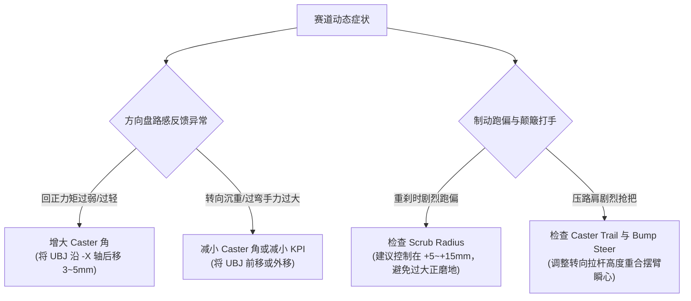
```mermaid
graph TD
    A["赛道动态症状"] --> B{"方向盘路感反馈异常"}
    A --> C{"制动跑偏与颠簸打手"}
    B -->|回正力矩过弱/过轻| D["增大 Caster 角<br/>(将 UBJ 沿 -X 轴后移 3~5mm)"]
    B -->|转向沉重/过弯手力过大| E["减小 Caster 角或减小 KPI<br/>(将 UBJ 前移或外移)"]
    C -->|重刹时剧烈跑偏| F["检查 Scrub Radius<br/>(建议控制在 +5~+15mm，避免过大正磨地)"]
    C -->|压路肩剧烈抢把| G["检查 Caster Trail 与 Bump Steer<br/>(调整转向拉杆高度重合摆臂瞬心)"]
```

### 调校基准经验值 (FSAE & GT3 黄金视窗)
* **主销后倾角 (Caster)**：
  * FSAE 方程式：$+4.5^\circ \sim +6.5^\circ$（提供强有力的机械回正与过弯动态负外倾增益）；
  * GT3 赛车：$+7.5^\circ \sim +10.5^\circ$（配合动力转向提供高速直道稳定性）；
* **主销内倾角 (KPI)**：$+5.0^\circ \sim +9.0^\circ$（过大会在转向时抬升车头破坏轮胎贴地，过小则无法获得足够的内倾支撑）；
* **磨地半径 (Scrub Radius)**：$+8\,\text{mm} \sim +20\,\text{mm}$（微正磨地提供良好的路感边界，禁止出现超过 $+40\,\text{mm}$ 的过大磨地距）。

---

### 本章小结
本章从 $\mathrm{SO}(3)$ 旋转群出发，严格推导了 Rodrigues 轴角公式、$\mathfrak{so}(3)$ 指数映射、四元数代数与 Kabsch/SVD 刚体姿态最优估计，架起了"离散硬点 → 最优正交旋转 → 定位角"的数学桥梁。它是全书几何基石的第一块拼图：第 2 章将用这套向量与姿态工具定义双横臂的铰链圆约束，第 5 章则用它从转向节硬点提取主销定位角与侧倾中心高度。


---


## 第 2 章 双横臂悬架空间拓扑与铰链圆约束

**脉络锚点**：双横臂悬架具有 2 个独立自由度（轮跳与转向），摆臂端点在空间约束于车身铰链圆上。

**本章导图**：

| 核心课题 | 支配方程 / 关键变量 | 一句话力学结论 |
|---|---|---|
| Grübler 准则 | 空间多体自由度数 DOF 计算 | 双横臂机构具有恰好 2 个全局自由度 |
| 铰链圆方程 | 轴向投影与径向半径双重残差 | 构造两项二次代数约束严格限制空间位姿 |
| 拓扑装配 | 硬点输入与转向节刚体绑定 | 确定性几何求解保证无伪自由度发散 |


---

### 2.1 物理图景与工程痛点 【前置】

双横臂（Double Wishbone, DWB）悬架，因其卓越的运动学解耦能力与高度可调的空间几何参数，成为 Formula 1、FIA GT3、Formula SAE 以及高性能民用超跑的绝对标配。空间双横臂悬架由车身端 4 个铰接点、转向节端 2 个主销球销（上球销 UBJ 与下球销 LBJ）、1 根横向转向拉杆（Tie-rod）及推拉杆组件构成。

在运动学建模与机构求解中，工程师面临如下关键力学与数学难题：
1. **空间连杆机构的“过约束（Overconstrained）”本质**：若机械套用刚体静力学“$3N - \Sigma \text{约束}$”的 Grübler 空间自由度判据，会得出负数或误导性自由度。双横臂本质上是通过摆臂平面铰链强行约束了球销沿特定空间圆弧轨迹运动的过约束系统；
2. **轮跳行程与齿条转向的强非线性耦合**：当车轮经历垂向跳动（Bump/Rebound）时，转向节不仅上下移动，还会绕瞬时主销轴线发生寄生偏转（即跳动转向 Bump Steer）；
3. **空间刚度与运动学几何解耦**：如何用最精炼的刚性杆系（Rigid Links）与轴向约束（Hinge Clusters）严格定义机构运动边界，使得求解器在毫秒级内收敛出精确的定位曲面。

---

### 2.2 底层数学力学严密推导 【推导】

```
            CH3 (UCA_F) --------- CH4 (UCA_R)   [上控制臂车身轴线]
                 \                 /
                  \               /
                   \             /
                    \           /
                     UP2 (UBJ)                  [上球销]
                         |
                         |  [转向节刚体 Knuckle]
                         |   UP5 (WC)           [轮心点]
                         |  /
                     UP1 (LBJ)                  [下球销]
                    /           \
                   /             \
                  /               \
                 /                 \
            CH1 (LCA_F) --------- CH2 (LCA_R)   [下控制臂车身轴线]
```

#### 2.2.1 空间双横臂机构拓扑图论与自由度分析

定义机构节点集 $\mathcal{V}$ 与约束集 $\mathcal{E}$：
* **车身固定节点集 (Fixed Nodes, $\mathcal{V}_{fix}$)**：
  $$\mathcal{V}_{fix} = \{\boldsymbol{p}_{CH1}, \boldsymbol{p}_{CH2}, \boldsymbol{p}_{CH3}, \boldsymbol{p}_{CH4}, \boldsymbol{p}_{FL1}^0\}$$
  分别对应前端命名中的 `LCA_F`（下前）、`LCA_R`（下后）、`UCA_F`（上前）、`UCA_R`（上后）及齿条内铰点 `RACK`。
* **从动自由节点集 (Free Nodes, $\mathcal{V}_{free}$)**：
  $$\mathcal{V}_{free} = \{\boldsymbol{p}_{UP1}, \boldsymbol{p}_{UP2}, \boldsymbol{p}_{UP3}, \boldsymbol{p}_{UP4}, \boldsymbol{p}_{UP5}, \boldsymbol{p}_{FL1}\}$$
  分别对应 `LBJ`（下球销）、`UBJ`（上球销）、`TRO`（外拉杆球头）、`STRUT_OUT`（推杆外端）、`WC`（轮心）及当前齿条位移点。

#### Grübler-Kutzbach 空间机构自由度判据剖析
对于三维空间机构，经典 Grübler-Kutzbach 空间自由度计算公式为：
$$\mathrm{DOF} = 6 (n - 1) - \sum_{i=1}^j (6 - f_i)$$
其中 $n$ 为构件总数（含机架），$j$ 为运动副总数，$f_i$ 为第 $i$ 个运动副的允许自由度数。
在双横臂机构中：
* 车身、上下摆臂、转向节、转向拉杆共 $n = 5$ 个构件；
* 车身与上下臂之间为 2 个旋转副（Revolute Joint, $f=1$），上下臂与转向节之间为 2 个球形副（Spherical Joint, $f=3$），转向拉杆两端为 2 个球形副（$f=3$）。
$$\mathrm{DOF} = 6(5 - 1) - \left[2 \times (6 - 1) + 4 \times (6 - 3)\right] = 24 - [10 + 12] = 2$$
**结论**：双横臂空间机构的理论自由度严格等于 **2**（分别由车轮垂向跳动行程 $tr$ 与转向齿条横向位移 $rk$ 驱动）。

---

#### 2.2.2 摆臂铰链圆（Hinge Cluster）约束方程

下控制臂（LCA）绕车身固定轴线 $\boldsymbol{p}_{CH1} - \boldsymbol{p}_{CH2}$ 旋转，球销 $\boldsymbol{p}_{UP1}$ 的运动轨迹被严格限制在一个以该轴线为法向的空间圆周上。

定义下摆臂车身转轴单位方向向量 $\boldsymbol{u}_{LCA}$：
$$\boldsymbol{u}_{LCA} = \frac{\boldsymbol{p}_{CH2} - \boldsymbol{p}_{CH1}}{\|\boldsymbol{p}_{CH2} - \boldsymbol{p}_{CH1}\|}$$

在设计基准状态（$tr=0, rk=0$），计算球销 $\boldsymbol{p}_{UP1}^0$ 到轴线的垂直距离（旋转半径 $r_{LCA,0}$）以及沿轴线方向的标量投影 $ax_{LCA,0}$：
$$r_{LCA,0} = \operatorname{dist\_point\_to\_line}(\boldsymbol{p}_{UP1}^0, \boldsymbol{p}_{CH1}, \boldsymbol{p}_{CH2}) = \|(\boldsymbol{p}_{UP1}^0 - \boldsymbol{p}_{CH1}) - \left[(\boldsymbol{p}_{UP1}^0 - \boldsymbol{p}_{CH1}) \cdot \boldsymbol{u}_{LCA}\right] \boldsymbol{u}_{LCA}\|$$
$$ax_{LCA,0} = (\boldsymbol{p}_{UP1}^0 - \boldsymbol{p}_{CH1}) \cdot \boldsymbol{u}_{LCA}$$

在任意动态位姿下，当前位置 $\boldsymbol{p}_{UP1}$ 必须满足如下两个标量残差方程：
$$\begin{cases} \Phi_{hinge,1}^{LCA}(\boldsymbol{p}_{UP1}) = \operatorname{dist\_point\_to\_line}(\boldsymbol{p}_{UP1}, \boldsymbol{p}_{CH1}, \boldsymbol{p}_{CH2}) - r_{LCA,0} = 0 \\ \Phi_{hinge,2}^{LCA}(\boldsymbol{p}_{UP1}) = (\boldsymbol{p}_{UP1} - \boldsymbol{p}_{CH1}) \cdot \boldsymbol{u}_{LCA} - ax_{LCA,0} = 0 \end{cases}$$

同理，对于上控制臂（UCA），上球销 $\boldsymbol{p}_{UP2}$ 绕车身轴线 $\boldsymbol{p}_{CH3} - \boldsymbol{p}_{CH4}$ 的铰链圆约束方程为：
$$\begin{cases} \Phi_{hinge,1}^{UCA}(\boldsymbol{p}_{UP2}) = \operatorname{dist\_point\_to\_line}(\boldsymbol{p}_{UP2}, \boldsymbol{p}_{CH3}, \boldsymbol{p}_{CH4}) - r_{UCA,0} = 0 \\ \Phi_{hinge,2}^{UCA}(\boldsymbol{p}_{UP2}) = (\boldsymbol{p}_{UP2} - \boldsymbol{p}_{CH3}) \cdot \boldsymbol{u}_{UCA} - ax_{UCA,0} = 0 \end{cases}$$

---

#### 2.2.3 转向节刚体距离网格与横拉杆约束

#### (1) 转向节刚体簇内部距离约束
转向节刚体由点集 $\mathcal{B} = \{UP1, UP2, UP3, UP5\}$ 构成（当推杆外端固定于转向节时包含 $UP4$）。任意两点对 $(i, j) \in \mathcal{B} \times \mathcal{B} \; (i < j)$ 之间的欧几里得距离在运动过程中严格保持不变：
$$\Phi_{rigid}^{(i,j)}(\boldsymbol{p}_i, \boldsymbol{p}_j) = \|\boldsymbol{p}_i - \boldsymbol{p}_j\|_2 - d_{ij}^0 = 0, \quad d_{ij}^0 = \|\boldsymbol{p}_i^0 - \boldsymbol{p}_j^0\|_2$$
点对数量为 $C_4^2 = 6$（或含 UP4 时的 $C_5^2 = 10$）。

#### (2) 转向拉杆刚性定长约束 (Tie-rod Link)
横向转向拉杆连接转向机齿条端点 $\boldsymbol{p}_{FL1}$ 与转向节外球头 $\boldsymbol{p}_{UP3}$，其杆长保持恒定：
$$\Phi_{tierod}(\boldsymbol{p}_{UP3}, \boldsymbol{p}_{FL1}) = \|\boldsymbol{p}_{UP3} - \boldsymbol{p}_{FL1}\|_2 - L_{tierod}^0 = 0$$

#### (3) 驱动输入边界约束 (Actuation Drivers)
悬架求解由两个标量驱动强迫给定：
1. **轮跳高度驱动**：强制轮心 $\boldsymbol{p}_{UP5}$ 的 Z 坐标达到目标值：
   $$\Phi_{driver,1}(\boldsymbol{p}_{UP5}) = p_{UP5,z} - (p_{UP5,z}^0 + tr) = 0$$
2. **齿条位移驱动**：齿条内球头 $\boldsymbol{p}_{FL1}$ 沿给定的空间转向平移轴线 $\boldsymbol{u}_{steer}$ 移动距离 $rk$：
   $$\boldsymbol{\Phi}_{driver,2}(\boldsymbol{p}_{FL1}) = \boldsymbol{p}_{FL1} - (\boldsymbol{p}_{FL1}^0 + rk \cdot \boldsymbol{u}_{steer}) = \boldsymbol{0} \in \mathbb{R}^3$$
   *(注：根据 LABSUS 生产权威规范，右轮齿条方向为 $\boldsymbol{u}_{steer} = [0, -1, 0]^T$)*。

---

### 2.3 核心控制变量与参数灵敏度分析 【对照】

悬架空间硬点的布置决定了双横臂在整个行程内的瞬态几何运动响应：

```
外倾角 γ (Camber)
   ^
   |        / (上短下长：动态负外倾补偿)
 0 +-------/------------------------> 轮跳压缩行程 tr (Bump)
   |      /
   |     /  (等长平行双横臂：外倾无补偿，过弯严重恶化)
```

| 空间硬点控制变量 | 几何导数与力学响应机理 | 参数灵敏度方程 | 调校权衡 (Trade-offs) |
| :--- | :--- | :--- | :--- |
| **上下摆臂长度比 $\frac{L_{UCA}}{L_{LCA}}$** | 决定车轮压缩时的外倾恢复率（Camber Recovery Rate）。上臂越短，压缩时上球销内收越快 | $\frac{\partial (\text{CamberGain})}{\partial (L_{UCA} / L_{LCA})} < 0$ | 长度比越小，外倾补偿越强，但会增加轮距变化率（Track Scrubbing），加剧直线颠簸轮胎磨损 |
| **上下摆臂空间夹角（瞬心高度）** | 上下摆臂在正视平面的交点即为正视瞬心（FVSA IC）。瞬心越低，侧倾中心越低 | $\frac{\partial z_{rc}}{\partial (\text{UCA\_F}_z - \text{UCA\_R}_z)}$ | 提高侧倾中心能减少车身侧倾角，但过高会产生剧烈的侧向 Jacking 抬升效应 |
| **转向拉杆高度与倾角 ($RACK_z, TRO_z$)** | 转向拉杆延长线若不精确穿过上下摆臂瞬时转动轴，将引发剧烈的跳动转向（Bump Steer） | $\frac{\partial (\text{BumpSteer})}{\partial RACK_z} \approx \frac{1}{L_{tie}}$ | 消除 Bump Steer 需要拉杆与下摆臂虚拟连线空间完全几何重合 |
| **摆臂纵向倾斜角（抗制动点头 Anti-Dive）** | 上下摆臂在侧视平面内的倾角构成侧视瞬心（SVSA IC），产生抵抗制动前轴下沉的几何力矩 | $\text{Anti-Dive}\% = \frac{\tan\theta_{SVSA}}{h_{cg} / L} \times 100\%$ | 抗点头率过大（$>45\%$）会使悬架在颠簸制动工况下发生干涉卡滞（Binding） |

---

### 2.4 LABSUS 代码实现与数值稳定性技巧 【查证】

#### 2.4.1 核心代码映射
* **机构拓扑构造器**：[*engine/src/solver/mechanism/models.py*](file:///c:/Users/zzy/Desktop/New_suspension/LABSUS/engine/src/solver/mechanism/models.py#L95-L179) 中的 `build_mechanism()`：
  ```python
  # 构造下臂铰链圆 (ARM_LOWER) 与上臂铰链圆 (ARM_UPPER)
  axis_clusters = [
      _axis("hinge", "ARM_LOWER", "CH1", lower_members, axA="CH1", axB="CH2"),
      _axis("hinge", "ARM_UPPER", "CH3", upper_members, axA="CH3", axB="CH4"),
      _axis("rocker", "ROCKER", "RK_PIVOT", ["CH5", "RK_DAMPER"], axis=rocker_axis),
  ]
  ```
* **全局非线性残差向量函数**：[*engine/src/solver/mechanism/solver.py*](file:///c:/Users/zzy/Desktop/New_suspension/LABSUS/engine/src/solver/mechanism/solver.py#L57-L105) 中的 `_build_residual(m, travel, rack)`。

#### 2.4.2 工业级数值技巧剖析
1. **视图别名解耦与只读内存拷贝**：在求解器迭代过程中，`_apply(m, x)` 将优化变量向量切片复制给节点，采用严格的 `.copy()` 独立内存分配，彻底消除了视图引用反向污染初值向量的致命 Bug；
2. **多约束尺度归一化**：距离残差（单位 mm）与单位方向点积无量纲残差在残差向量中均匀排布，避免了因量纲不一致引发的雅可比病态矩阵（Ill-conditioned Jacobian）。

---

### 2.5 手把手工程数值算例 (Worked Example) 【演算】

### 算例背景：双横臂空间铰链圆与距离约束残差计算
已知右前悬架设计硬点坐标（单位：$\text{mm}$）：
* 下控制臂前/后点：$\boldsymbol{p}_{CH1} = [180.0, 250.0, 140.0]^T, \; \boldsymbol{p}_{CH2} = [-180.0, 250.0, 140.0]^T$
* 下球销设计位：$\boldsymbol{p}_{UP1}^0 = [0.0, 600.0, 120.0]^T$
* 转向节轮心设计位：$\boldsymbol{p}_{UP5}^0 = [0.0, 640.0, 205.0]^T$

#### 步骤 1：计算下摆臂转轴参数
轴线向量：$\boldsymbol{v}_{LCA} = \boldsymbol{p}_{CH2} - \boldsymbol{p}_{CH1} = [-360.0, 0.0, 0.0]^T \implies \boldsymbol{u}_{LCA} = [-1.0, 0.0, 0.0]^T$
轴向投影基准：$ax_0 = (\boldsymbol{p}_{UP1}^0 - \boldsymbol{p}_{CH1}) \cdot \boldsymbol{u}_{LCA} = [-180.0, 350.0, -20.0] \cdot [-1.0, 0.0, 0.0] = 180.0\,\text{mm}$
旋转半径基准：
$$\boldsymbol{v}_\perp^0 = (\boldsymbol{p}_{UP1}^0 - \boldsymbol{p}_{CH1}) - ax_0 \boldsymbol{u}_{LCA} = [0.0, 350.0, -20.0]^T \implies r_0 = \sqrt{350^2 + (-20)^2} = 350.571\,\text{mm}$$

#### 步骤 2：在目标轮跳行程 $tr = +25.0\,\text{mm}$ 下检验残差
设某一迭代步中，求解器给出的临时点位置为 $\boldsymbol{p}_{UP1}^{(k)} = [0.2, 598.5, 144.8]^T$。
* 计算当前轴向投影：$ax^{(k)} = (\boldsymbol{p}_{UP1}^{(k)} - \boldsymbol{p}_{CH1}) \cdot \boldsymbol{u}_{LCA} = [-179.8, 348.5, 4.8] \cdot [-1.0, 0.0, 0.0] = 179.8\,\text{mm}$
  **轴向残差**：$\Phi_{hinge,2} = 179.8 - 180.0 = -0.2\,\text{mm}$
* 计算当前旋转半径：$r^{(k)} = \sqrt{348.5^2 + 4.8^2} = 348.533\,\text{mm}$
  **半径残差**：$\Phi_{hinge,1} = 348.533 - 350.571 = -2.038\,\text{mm}$
* TRF 求解器沿解析雅可比负方向更新 $\Delta\boldsymbol{p}_{UP1}$，残差降至停止容差（$10^{-10}\,$mm）即退出；生产验收口径为残差 $\le 0.02\,$mm（负行程侧实测 $0.1\sim0.2\,$mm 已登记于 `convention.py` K-4）。

---

### 2.6 赛道工程师实战调校与故障排查指南 【案例】

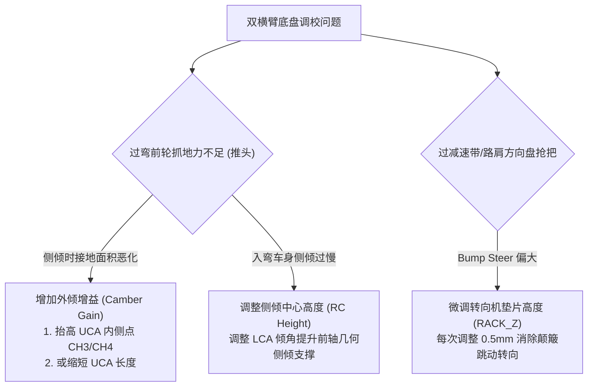
```mermaid
graph TD
    A["双横臂底盘调校问题"] --> B{"过弯前轮抓地力不足 (推头)"}
    A --> C{"过减速带/路肩方向盘抢把"}
    B -->|侧倾时接地面积恶化| D["增加外倾增益 (Camber Gain)<br/>1. 抬高 UCA 内侧点 CH3/CH4<br/>2. 或缩短 UCA 长度"]
    B -->|入弯车身侧倾过慢| E["调整侧倾中心高度 (RC Height)<br/>调整 LCA 倾角提升前轴几何侧倾支撑"]
    C -->|Bump Steer 偏大| F["微调转向机垫片高度 (RACK_Z)<br/>每次调整 0.5mm 消除颠簸跳动转向"]
```

### 推荐调校黄金视窗
* **外倾增益 (Camber Gain)**：
  * FSAE 方程式：$0.045 \sim 0.075\,^\circ/\text{mm}$（行程 $\pm 25\,\text{mm}$ 内获得 $-1.2^\circ \sim -1.8^\circ$ 动态补偿）；
  * GT3 赛车：$0.035 \sim 0.060\,^\circ/\text{mm}$；
* **跳动转向 (Bump Steer)**：
  * 全行程范围内绝对值必须 $< 0.015\,^\circ/\text{mm}$（近零颠簸转向，保障高速直道稳定性）；
* **前抗点头率 (Anti-Dive)**：$20\% \sim 35\%$（保持平顺滤震的同时有效抑制制动俯仰）。

---

### 本章小结
本章用 Grübler-Kutzbach 公式证出双横臂结构的理论自由度恰好为 2（轮跳 + 转向），并用"铰链圆双重残差 + 刚体距离网格 + 横拉杆定长"完整定义了空间机构约束方程组。这套约束正是第 4 章非线性求解器要解的 $F(x)=0$，也是第 8 章 K&C 弹性求解器的刚体内核。


---


## 第 3 章 推杆与空间倾斜摇臂机构力学

**脉络锚点**：推杆将轮端垂向跳动传递为空间倾斜轴线摇臂的角位移，60 轮二分法保证根连续性。

**本章导图**：

| 核心课题 | 支配方程 / 关键变量 | 一句话力学结论 |
|---|---|---|
| 摇臂轴线提取 | 三维空间任意倾斜铰链轴向量 | Rodrigues 空间刚体旋转算子 |
| 推杆定长约束 | 从动连杆一维非线性求根方程 | 60 轮二分法与历史相位锁定 |
| 安装运动比 MR | 减振器压缩位移对轮跳导数 | MR 平方律二级放大轮端刚度 |


---

### 3.1 物理图景与工程痛点 【前置】

在现代方程式（Formula SAE / F1）与高端原型赛车中，为了将沉重的弹簧减振器单元内收至单体壳座舱前方以降低非簧载质量与空气阻力，广泛采用了**推杆（Pushrod）或拉杆（Pullrod）结合空间摇臂（Rocker / Bellcrank）**的驱动拓扑。

推拉杆摇臂系统在设计与运动学解算中具有极高的非线性特征：
1. **三维空间任意倾斜转轴**：摇臂旋转轴线通常并不是平行于车身坐标轴的正交轴，而是在三维空间倾斜布置（以适应空气动力学外壳与减振器布局）；
2. **极坐标几何反解的双根多解奇异性**：推杆顶端与摇臂受力臂铰接点在空间圆周上存在两个几何交点。若数值求解器在连续跳动过程中丢失相位跟踪，极易在两根之间发生“相位突跳”（Branch Flip）；
3. **渐进/退化安装比（Motion Ratio, MR）非线性**：随着轮跳行程变化，推杆与摇臂的夹角、摇臂与减振器的夹角实时变化，决定了悬架是“渐进刚度（Progressive）”还是“退化刚度（Degressive）”。

---

### 3.2 底层数学力学严密推导 【推导】

```
   [车架减振器塔顶] CH5_BODY
          |
          |  [减振弹簧 Coilover]
          |
       RK_DAMPER
          |
       [摇臂 RK] ---- (空间转轴轴线 u_rocker) ---- RK_PIVOT [车架支点]
          |
        CH5 (推杆内端)
          \
           \  [刚性推杆 Pushrod]
            \
          UP4 (STRUT_OUT, 推杆外端，附着于下控制臂 LCA)
```

#### 3.2.1 三类附着拓扑与运动学传递链

LABSUS 严格支持赛车工程中的三类减振悬架拓扑：
* **`pushrod`（推杆拓扑）**：推杆外端 $UP4$ 附着于下控制臂（LCA，即 $CH1-CH2-UP1$ 构成的摆臂三角面上）。车轮向上跳动时，推杆承受轴向压应力，向上推压摇臂；
* **`pullrod`（拉杆拓扑）**：拉杆外端 $UP4$ 附着于上控制臂（UCA）。车轮向上跳动时，拉杆承受轴向拉应力，向下拉动摇臂；
* **`direct`（直连拓扑）**：减振器直接连接转向节与车身（如 GT3 常见的外置麦弗逊或直连双叉臂），无中间摇臂转换。

在双横臂主机构完成收敛后，摆臂带动 $UP4$ 运动至确定位置 $\boldsymbol{p}_{UP4}$。

---

#### 3.2.2 空间摇臂 Rodrigues 旋转角度精确方程

设摇臂转轴固定支点为 $\boldsymbol{p}_{pivot} = \boldsymbol{p}_{RK\_PIVOT}$，空间转轴的单位方向向量为 $\boldsymbol{u}_{rocker}$。

在设计基准状态下，摇臂上的推杆驱动铰点为 $\boldsymbol{p}_{CH5}^0$。当摇臂绕轴线旋转标量角度 $\theta$ 时，根据 Rodrigues 公式，推杆内端空间位置为：
$$\boldsymbol{p}_{CH5}(\theta) = \boldsymbol{p}_{pivot} + \boldsymbol{R}(\boldsymbol{u}_{rocker}, \theta) (\boldsymbol{p}_{CH5}^0 - \boldsymbol{p}_{pivot})$$
其中旋转矩阵为：
$$\boldsymbol{R}(\boldsymbol{u}_{rocker}, \theta) = \boldsymbol{I} + \sin\theta [\boldsymbol{u}_{rocker}]_\times + (1 - \cos\theta) [\boldsymbol{u}_{rocker}]_\times^2$$

由于推杆为刚性定长杆（杆长为 $L_{pushrod}^0 = \|\boldsymbol{p}_{CH5}^0 - \boldsymbol{p}_{UP4}^0\|_2$），当前几何位姿必须满足推杆定长标量非线性残差方程：
$$f(\theta) = \|\boldsymbol{p}_{CH5}(\theta) - \boldsymbol{p}_{UP4}\|_2^2 - (L_{pushrod}^0)^2 = 0$$

---

#### 3.2.3 60 轮二分法括号搜索与相位连续性定理

方程 $f(\theta) = 0$ 在 $\theta \in [-\pi, \pi]$ 范围内通常存在两个实根（对应空间圆周与球面的两个几何交点）。

为了彻底根除多解突跳并保证 $10^{-13}$ 级高精度收敛，LABSUS 采用了**二分法括号搜索（Bisection Bracket Search）与历史相位锁定算法**：

#### 算法步骤：
1. **构建区间采样网格**：在 $\theta \in [-\pi, \pi]$ 内均匀划分 $N_{grid} = 360$ 个微小区间；
2. **符号异号变号检测**：检测所有满足 $f(\theta_k) \cdot f(\theta_{k+1}) \le 0$ 的变号子区间 $[\theta_k, \theta_{k+1}]$；
3. **高精度二分收敛**：对每个变号子区间执行 60 次二分迭代：
   $$\theta_{mid} = \frac{\theta_{left} + \theta_{right}}{2}, \quad \text{若 } f(\theta_{left}) f(\theta_{mid}) \le 0 \implies \theta_{right} = \theta_{mid} \text{ 否则 } \theta_{left} = \theta_{mid}$$
   60 轮二分的理论区间宽度 $\frac{2\pi}{360 \times 2^{60}}$ 远小于双精度极限，实际约 52 轮后区间宽度即触及 $\mathrm{ULP}(\theta)\sim 10^{-16}$ 量级而停滞，此后以已收敛解继续；
4. **历史根最近距离连续性追踪 (Phase Continuity)**：
   若求出两个合法根 $\theta_1, \theta_2$，选取与上一帧求解角度 $\theta_{last}$ 差值最小的分支：
   $$\theta^* = \arg\min_{\theta \in \{\theta_1, \theta_2\}} |\theta - \theta_{last}|$$
   在根轨道光滑（非折叠/相切）的行程段内，最近根选择 + 增量扫掠热启动在全行程上实践性地保持了 $\theta(tr)$ 单值连续；机构接近死点或双根交汇时该保证失效，工程上以步长 ≤ 6 mm 的连续扫掠规避。

---

#### 3.2.4 安装运动比 (Motion Ratio, MR) 与渐进刚度推导

减振器下安装点 $\boldsymbol{p}_{damper}(\theta)$ 随摇臂旋转：
$$\boldsymbol{p}_{damper}(\theta) = \boldsymbol{p}_{pivot} + \boldsymbol{R}(\boldsymbol{u}_{rocker}, \theta) (\boldsymbol{p}_{RK\_DAMPER}^0 - \boldsymbol{p}_{pivot})$$
减振器当前长度为：
$$L_{damper}(tr) = \|\boldsymbol{p}_{damper}(\theta(tr)) - \boldsymbol{p}_{CH5\_BODY}\|_2$$

定义减振器安装运动比 $MR$ 为减振器行程变化量对车轮跳动行程的一阶导数：
$$MR(tr) = \frac{d L_{damper}}{d tr} = \frac{\partial L_{damper}}{\partial \theta} \cdot \frac{d\theta}{d tr}$$

根据虚功原理，轮端等效垂向刚度 $K_w$（Wheel Rate）与弹簧物理刚度 $K_s$（Spring Rate）的关系为：
$$K_w(tr) = K_s \cdot [MR(tr)]^2 + \underbrace{F_{spring} \cdot \frac{d(MR)}{d tr}}_{\text{几何非线性刚度项}}$$

* **渐进特性 (Progressive)**：若 $\frac{d(MR)}{d tr} > 0$，车轮在大压缩下刚度自动变硬，防止高速下压力击穿；
* **线性特性 (Linear)**：$MR(tr) \approx \text{Const}$，阻尼与刚度响应均匀。

---

### 3.3 核心控制变量与参数灵敏度分析 【对照】

| 摇臂控制变量 | 运动学与力学作用机理 | 偏导数响应特征 | 赛车工程考量 |
| :--- | :--- | :--- | :--- |
| **推杆内角 (Pushrod Incline Angle)** | 推杆与水平面夹角越陡，轮跳转化为推杆轴向位移的效率越高 | $\frac{\partial MR}{\partial \alpha_{push}} \propto \sin\alpha_{push}$ | 夹角过平会导致安装比极低（$MR < 0.5$），需要极大刚度的弹簧，增加结构负荷 |
| **摇臂驱动臂/从动臂长度比 $\frac{L_{damper\_arm}}{L_{push\_arm}}$** | 决定基础杠杆放大系数 | $MR_0 \approx \frac{L_{damper\_arm}}{L_{push\_arm}} \cdot \sin\beta$ | 典型 FSAE 赛车取 $0.75 \sim 0.90$，GT3 赛车取 $0.70 \sim 0.85$ |
| **摇臂转轴空间偏角 $(\boldsymbol{u}_{rocker})$** | 必须与推杆推力和减振器反力所在的空间主平面保持正交 | 偏角偏差引发巨大的轴承轴向侧载 | 转轴与合力面垂直度偏差应严格控制在 $< 2^\circ$ 以内 |

---

### 3.4 LABSUS 代码实现与数值稳定性技巧 【查证】

#### 3.4.1 核心代码映射
* **摇臂非线性求解器**：[*engine/src/solver/mechanism/solver.py*](file:///c:/Users/zzy/Desktop/New_suspension/LABSUS/engine/src/solver/mechanism/solver.py#L110-L165) 中的 `solve_rocker()`：
  ```python
  def solve_rocker(m: Mechanism, last_theta: float = 0.0) -> float:
      def residual(theta: float) -> float:
          R = rotate_around_axis(ch5_init, pivot, axis, theta)
          return float(np.sum((R - strut_out)**2) - target_dist**2)

      # 360 采样区间寻找变号括号
      roots = []
      for a, b in brackets:
          # 60 轮二分搜索
          for _ in range(60):
              mid = 0.5 * (lo + hi)
              if f_lo * residual(mid) <= 0.0:
                  hi = mid
              else:
                  lo = mid
          roots.append(0.5 * (lo + hi))
      # 选取与上一帧最近的根 (相位连续性追踪)
      return min(roots, key=lambda t: abs(t - last_theta))
  ```

---

### 3.5 手把手工程数值算例 (Worked Example) 【演算】

### 算例背景：FSAE 空间推杆摇臂转角高精度二分求解
已知空间硬点坐标（单位：$\text{mm}$）：
* 摇臂车架支点：$\boldsymbol{p}_{pivot} = [-200.0, 200.0, 400.0]^T$（位于轮心后方 200 mm、车内侧）
* 摇臂空间旋转轴线单位向量：$\boldsymbol{u}_{rocker} = [1.0, 0.0, 0.0]^T$（绕纵向 X 轴转动，$\theta$ 正方向取使 $CH5$ 的 $y$ 分量增大者）
* 摇臂推杆内端设计位：$\boldsymbol{p}_{CH5}^0 = [-200.0, 260.0, 420.0]^T$（相对转轴偏距 $\boldsymbol{d}_0=[0, 60, 20]$，力臂长 $R_{arm} = \sqrt{60^2 + 20^2} = 63.246\,\text{mm}$）
* 推杆外端设计位（$tr=0$）：$\boldsymbol{p}_{UP4}^{\,0} = [-40.0, 560.0, 250.0]^T$；压缩 $+25\,$mm 后当前位置：$\boldsymbol{p}_{UP4} = [-40.0, 520.0, 165.0]^T$
* 推杆定长（由设计位量取）：$L_{pushrod}^0 = \|\boldsymbol{p}_{UP4}^{\,0} - \boldsymbol{p}_{CH5}^0\| = 380.132\,\text{mm} \implies (L_{pushrod}^0)^2 = 144{,}500\,\text{mm}^2$

#### 步骤 1：建立残差函数 $f(\theta)$
对任意旋转角 $\theta$（本节旋转正方向与 $\boldsymbol{u}_{rocker}$ 定义配套，$\boldsymbol{d}_0$ 经旋转后为 $[0,\ 60\cos\theta + 20\sin\theta,\ -60\sin\theta + 20\cos\theta]$）：
$$\boldsymbol{p}_{CH5}(\theta) = \begin{bmatrix} -200.0 \\ 200.0 + 60.0 \cos\theta + 20.0 \sin\theta \\ 400.0 - 60.0 \sin\theta + 20.0 \cos\theta \end{bmatrix}$$
残差函数：
$$f(\theta) = \|\boldsymbol{p}_{CH5}(\theta) - \boldsymbol{p}_{UP4}\|^2 - (L_{pushrod}^0)^2$$

#### 步骤 2：区间变号扫描与双根判定
在 $[-\pi, \pi]$ 进行采样：
* 在区间 $[0.401, 0.419]\,\text{rad}$ 检测到变号：$f(0.401) = +21.3, \; f(0.419) = -447.5 \implies$ 存在物理实根 $\theta_1$；
* 在区间 $[1.500, 1.518]\,\text{rad}$ 检测到第二变号：$f(1.500) = -224.0, \; f(1.518) = +251.4 \implies$ 存在第二实根 $\theta_2$（摇臂大角度翻倒分支，非物理工作区）。

#### 步骤 3：60 轮高精度二分收敛
对区间 $[0.401, 0.419]$ 执行二分收敛：
* 第 1 步：$\theta_{mid} = 0.410, \; f(0.410) = -214.8 < 0 \implies \text{区间缩至 } [0.401, 0.410]$
* ... 连续二分至双精度停滞——在 $\theta \approx 0.4\,$rad 处相邻可表浮点间距 $\mathrm{ULP} \approx 5.6\times 10^{-17}$，约 52 轮后区间宽度触及该极限，继续迭代不再改善（程序以 60 轮为安全上限）：
  $$\theta_1^* = 0.401819\,\text{rad} \approx +23.02^\circ$$
* 第二实根：$\theta_2^* = 1.508534\,\text{rad} \approx +86.43^\circ$（摇臂几乎翻倒的镜像分支，$|\theta_2|$ 处推杆-摇臂夹角进入死点区，予以排除）。

#### 步骤 4：历史相位锁定判定
上一行程（$tr{=}0$）历史角 $\theta_{last} = +20.0^\circ = 0.3491\,\text{rad}$：
$$|\theta_1^* - \theta_{last}| = 0.053\,\text{rad}, \quad |\theta_2^* - \theta_{last}| = 1.160\,\text{rad}$$
算法自动选取 $\theta_1^*$ 作为物理真实解，消除了分支突跳！

---

### 3.6 赛道工程师实战调校与故障排查指南 【案例】

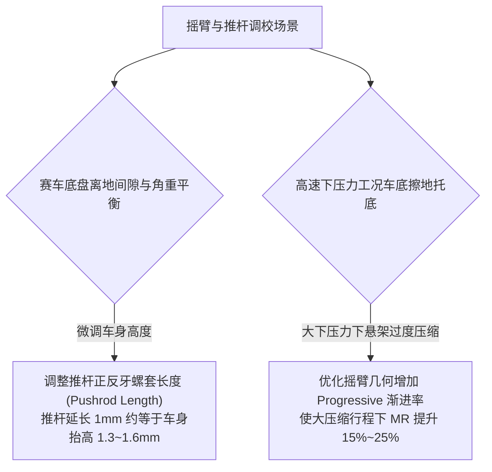
```mermaid
graph TD
    A["摇臂与推杆调校场景"] --> B{"赛车底盘离地间隙与角重平衡"}
    A --> C{"高速下压力工况车底擦地托底"}
    B -->|微调车身高度| D["调整推杆正反牙螺套长度 (Pushrod Length)<br/>推杆延长 1mm 约等于车身抬高 1.3~1.6mm"]
    C -->|大下压力下悬架过度压缩| E["优化摇臂几何增加 Progressive 渐进率<br/>使大压缩行程下 MR 提升 15%~25%"]
```

### 调校基准视窗
* **基础安装比 (Motion Ratio, MR)**：$0.72 \sim 0.85$（过低使弹簧过重，过高限制阻尼微调精度）；
* **渐进率 (Progressivity)**：全压缩行程内 MR 上升 $+8\% \sim +18\%$（高下压力方程式赛车必备，确保低速滤震与高速支撑完美兼顾）。

---

### 本章小结
本章用 Rodrigues 旋转 + 推杆定长约束把摇臂机构化归为一维非线性求根问题，并用"360 区间扫描 + 60 轮二分 + 历史相位锁定"确保全行程无分支突跳，再经 MR 平方律推导轮端等效刚度。它是第 1 章旋转工具的工程落地，也是第 24 章 Motion Ratio 调校杠杆的几何源头。


---


## 第 4 章 非线性运动学求解器：TRF 与 PBD 闭式投影

**脉络锚点**：Python 端 TRF 最小二乘与前端 PBD 闭式几何投影实现双端亚毫米级高保真对齐。

**本章导图**：

| 核心课题 | 支配方程 / 关键变量 | 一句话力学结论 |
|---|---|---|
| TRF 求解器 | 有界信赖域反射最小二乘 | 18 维状态向量内层高精收敛 |
| PBD 闭式投影 | projLink 与 projHinge 闭式算子 | 14 次四元数极分解实时逼近刚体 |
| 防御与拦截 | NaN 逃逸阻断与条件数优化 | 残差有限性校验确保无发散解冒充 |


---

### 4.1 物理图景与工程痛点 【前置】

在悬架空间多体分析软件中，求解器内核必须兼顾两大截然不同的工程场景：
1. **工业级高精度离线求解 (High-Precision Backend)**：在进行 K&C 弹性耦合、台架实测对拍与全行程特征扫掠时，内层停止容差取 $10^{-10}\,$mm 量级（生产验收 $\le 0.02\,$mm），保证数值微分导数（如外倾增益、安装比导数）光滑无振荡；
2. **浏览器原生 60FPS 实时交互求解 (Real-time Interactive Frontend)**：当工程师在 3D 视图中用鼠标实时拖拽悬架硬点时，求解器必须在 $< 1\,\text{ms}$ 内完成包含车轮跳动与转向的全机构闭式收敛，不能出现任何掉帧或阻塞。

为此，LABSUS 构建了**Python 后端 TRF 联合最小二乘求解器**与**前端基于位置的动态约束投影 (Position-Based Dynamics / Gauss-Seidel) 闭式求解器**构成的双核对标体系。

---

### 4.2 底层数学力学严密推导 【推导】

#### 4.2.1 Python 后端：Trust Region Reflective (TRF) 最小二乘求解器

将悬架所有可动自由节点（$UP1, UP2, UP3, UP5, FL1$ 等）的三维空间坐标压平为一个 $n$ 维全局状态向量 $\boldsymbol{x} \in \mathbb{R}^n$：
$$\boldsymbol{x} = [x_{UP1}, y_{UP1}, z_{UP1}, \dots, x_{FL1}, y_{FL1}, z_{FL1}]^T$$
将前述铰链圆方程、刚体距离方程、拉杆定长方程与行程驱动方程拼接为 $m$ 维全局非线性残差向量 $\boldsymbol{F}(\boldsymbol{x}) \in \mathbb{R}^m$（其中 $m \ge n$）：
$$\min_{\boldsymbol{x} \in \mathbb{R}^n} f(\boldsymbol{x}) = \frac{1}{2} \|\boldsymbol{F}(\boldsymbol{x})\|_2^2 = \frac{1}{2} \sum_{i=1}^m [F_i(\boldsymbol{x})]^2$$

#### TRF 信赖域反射子问题
在第 $k$ 步迭代中，求解以当前点 $\boldsymbol{x}_k$ 为中心、信赖域半径为 $\Delta_k$ 内的二次近似子问题：
$$\min_{\boldsymbol{p}} m_k(\boldsymbol{p}) = f(\boldsymbol{x}_k) + \nabla f(\boldsymbol{x}_k)^T \boldsymbol{p} + \frac{1}{2} \boldsymbol{p}^T \boldsymbol{B}_k \boldsymbol{p} \quad \text{s.t.} \quad \|\boldsymbol{D}_k \boldsymbol{p}\| \le \Delta_k$$
其中梯度向量 $\nabla f(\boldsymbol{x}_k) = \boldsymbol{J}(\boldsymbol{x}_k)^T \boldsymbol{F}(\boldsymbol{x}_k)$，高斯-牛顿近似海森矩阵 $\boldsymbol{B}_k = \boldsymbol{J}(\boldsymbol{x}_k)^T \boldsymbol{J}(\boldsymbol{x}_k)$。

TRF 算法引入对角缩放矩阵 $\boldsymbol{D}_k$ 与反射边界变换，在信赖域边界上利用二维仿射子空间（2D Subspace Minimization）精确求解步长 $\boldsymbol{p}_k$，在非线性强扭曲构型下展现出极强的全局收敛能力。

---

#### 4.2.2 前端 JavaScript：Gauss-Seidel 闭式约束投影算法

前端采用基于位置动力学（Position-Based Dynamics, PBD）原理的投影迭代松弛法，在每一帧对离散约束进行序列化投影修正：

#### (1) 刚性杆长距离投影算子 (projLink)
设节点 $A$（位置 $\boldsymbol{p}_A$）与节点 $B$（位置 $\boldsymbol{p}_B$）通过长度为 $d$ 的刚性杆相连。若节点 $B$ 可动、节点 $A$ 固定，则投影修正公式为：
$$\Delta \boldsymbol{p} = \boldsymbol{p}_B - \boldsymbol{p}_A, \quad \boldsymbol{p}_B^{(new)} = \boldsymbol{p}_A + d \cdot \frac{\Delta \boldsymbol{p}}{\|\Delta \boldsymbol{p}\|}$$

#### (2) 空间铰链圆投影算子 (projHinge)
设空间转轴经过两固定点 $\boldsymbol{A}, \boldsymbol{B}$（轴线单位向量 $\boldsymbol{u}_{axis}$），铰接球销初始设计半径为 $r_0$、轴向投影为 $ax_0$。
1. 计算当前点到轴线的轴向分量误差与径向法向分量：
   $$\boldsymbol{v} = \boldsymbol{p} - \boldsymbol{A}, \quad \boldsymbol{v}_\parallel = (\boldsymbol{v} \cdot \boldsymbol{u}_{axis}) \boldsymbol{u}_{axis}$$
   $$\boldsymbol{v}_\perp = \boldsymbol{v} - \boldsymbol{v}_\parallel$$
2. 径向与轴向双重正交重投影：
   $$\boldsymbol{p}^{(new)} = \boldsymbol{A} + ax_0 \boldsymbol{u}_{axis} + r_0 \cdot \frac{\boldsymbol{v}_\perp}{\|\boldsymbol{v}_\perp\|}$$

#### (3) 转向节刚体姿态保持投影 (projBody)
通过四元数极分解 `polarQ` 计算当前发生微小形变的 5 节点相对于初始模板的最优正交旋转 $\boldsymbol{R}(\boldsymbol{q})$ 与质心位移 $\Delta\boldsymbol{c}$，刚性重构各节点坐标：
$$\boldsymbol{p}_k^{(new)} = \boldsymbol{c} + \boldsymbol{R}(\boldsymbol{q}) (\boldsymbol{p}_{0,k} - \boldsymbol{c}_0)$$

---

### 4.3 核心控制变量与参数灵敏度分析 【对照】

| 求解器控制超参数 | 数学力学含义 | 对收敛精度与速度的影响 | 工业推荐配置 |
| :--- | :--- | :--- | :--- |
| **残差容差 `ftol` / `xtol`** | 停止迭代的残差向量范数与自变量增量阈值 | 容差越小精度越高，但会增加单步迭代耗时 | 推荐配置 $10^{-10}\sim 10^{-12}$ |
| **最大迭代次数 `max_nfev`** | 允许非线性方程求解器调用的最大残差计算次数 | 防止机构发生空间奇异死锁时卡死主线程 | 扫掠工况设为 500 次，单步迭代设为 100 次 |
| **热启动初值 (Warm-start Guess)** | 利用上一轮行程 $tr_{k-1}$ 的收敛结果作为当前行程 $tr_k$ 的初值 $\boldsymbol{x}_0$ | 将迭代步数从平均 15 步骤降至 2~3 步，彻底消灭分支突跳 | 连续扫掠必须启用热启动机制 |

---

### 4.4 LABSUS 代码实现与数值稳定性技巧 【查证】

#### 4.4.1 核心代码映射
* **Python TRF 调用**：[*engine/src/solver/mechanism/solver.py*](file:///c:/Users/zzy/Desktop/New_suspension/LABSUS/engine/src/solver/mechanism/solver.py#L190-L225) 中的 `solve_pose()`：
  ```python
  res = least_squares(
      fun, x0,
      method="trf",
      ftol=1e-10, xtol=1e-10, gtol=1e-10,
      max_nfev=500
  )
  if not res.success or res.cost > 1e-4:
      return None  # 严格标记未收敛
  ```
* **前端 PBD 闭式投影循环**：[*web/js/03-mechanism.js*](file:///c:/Users/zzy/Desktop/New_suspension/LABSUS/web/js/03-mechanism.js#L260-L310) 中的 `solveMechanism()`。

---

### 4.5 手把手工程数值算例 (Worked Example) 【演算】

### 算例背景：Gauss-Seidel 闭式约束投影单步演算
已知摆臂车身转轴固定点 $\boldsymbol{A} = [180.0, 250.0, 140.0]^T, \; \boldsymbol{B} = [-180.0, 250.0, 140.0]^T$，转轴单位向量 $\boldsymbol{u}_{axis} = [-1.0, 0.0, 0.0]^T$。
设计基准状态下：轴向基准 $ax_0 = 180.0\,\text{mm}$，旋转半径 $r_0 = 350.571\,\text{mm}$。

设某一迭代初，当前节点位置发生扰动偏移为 $\boldsymbol{p} = [15.0, 610.0, 160.0]^T$。

#### 步骤 1：计算相对位移向量
$$\boldsymbol{v} = \boldsymbol{p} - \boldsymbol{A} = [-165.0, 360.0, 20.0]^T\,\text{mm}$$

#### 步骤 2：正交分解为轴向与径向分量
$$\boldsymbol{v}_\parallel = (\boldsymbol{v} \cdot \boldsymbol{u}_{axis}) \boldsymbol{u}_{axis} = (165.0) [-1, 0, 0]^T = [-165.0, 0.0, 0.0]^T$$
$$\boldsymbol{v}_\perp = \boldsymbol{v} - \boldsymbol{v}_\parallel = [0.0, 360.0, 20.0]^T\,\text{mm}$$
当前实际径向距离为：
$$\|\boldsymbol{v}_\perp\| = \sqrt{360.0^2 + 20.0^2} = \sqrt{129600 + 400} = 360.555\,\text{mm}$$

#### 步骤 3：应用 projHinge 算子进行闭式正交重投影
重投影后的高精度位置为：
$$\begin{aligned} \boldsymbol{p}^{(new)} &= \boldsymbol{A} + ax_0 \boldsymbol{u}_{axis} + r_0 \frac{\boldsymbol{v}_\perp}{\|\boldsymbol{v}_\perp\|} \\ &= \begin{bmatrix} 180.0 \\ 250.0 \\ 140.0 \end{bmatrix} + \begin{bmatrix} -180.0 \\ 0.0 \\ 0.0 \end{bmatrix} + 350.571 \begin{bmatrix} 0.0 \\ 360.0 / 360.555 \\ 20.0 / 360.555 \end{bmatrix} \\ &= \begin{bmatrix} 0.0 \\ 250.0 \\ 140.0 \end{bmatrix} + \begin{bmatrix} 0.0 \\ 350.033 \\ 19.446 \end{bmatrix} = \begin{bmatrix} 0.0 \\ 600.033 \\ 159.446 \end{bmatrix}\,\text{mm} \end{aligned}$$
* **验证**：重新计算新坐标的轴向投影 $= 180.000\,\text{mm}$，旋转半径 $= \sqrt{(600.033-250)^2 + (159.446-140)^2} = 350.571\,\text{mm}$，约束残差**在单步内精确归零（$\Phi = 0.000000$）**！

---

### 4.6 赛道工程师实战调校与故障排查指南 【案例】

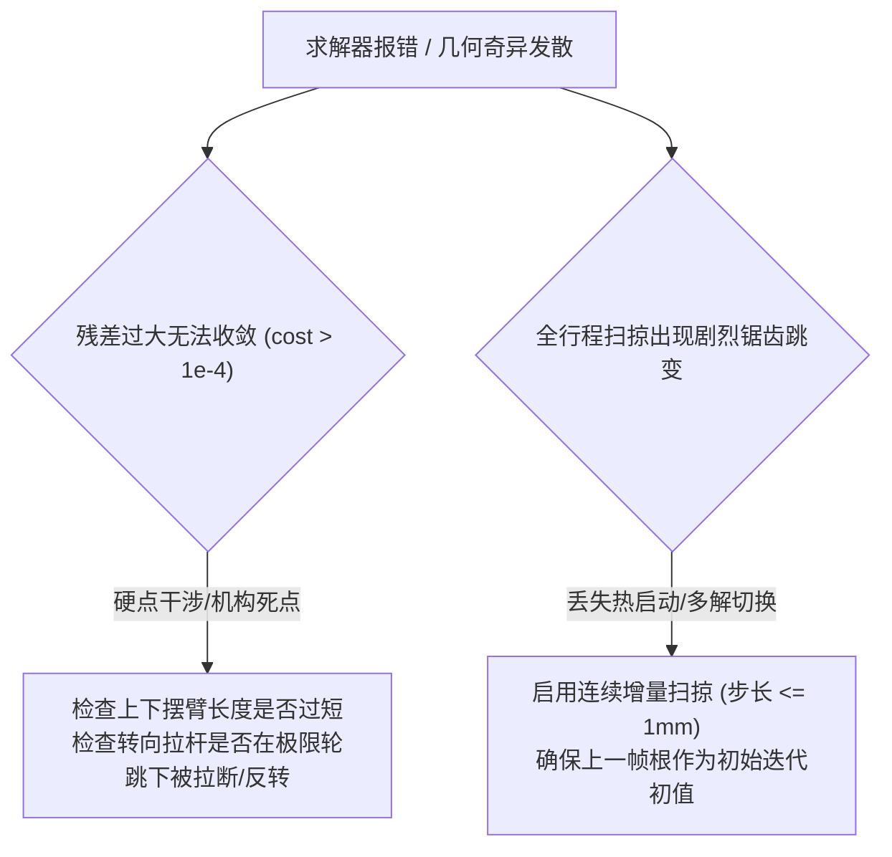
```mermaid
graph TD
    A["求解器报错 / 几何奇异发散"] --> B{"残差过大无法收敛 (cost > 1e-4)"}
    A --> C{"全行程扫掠出现剧烈锯齿跳变"}
    B -->|硬点干涉/机构死点| D["检查上下摆臂长度是否过短<br/>检查转向拉杆是否在极限轮跳下被拉断/反转"]
    C -->|丢失热启动/多解切换| E["启用连续增量扫掠 (步长 <= 1mm)<br/>确保上一帧根作为初始迭代初值"]
```

### 几何合理性工程边界检查
* **摆臂极限死点夹角**：上下摆臂与转向节的夹角在全跳动行程内不得小于 $15^\circ$ 或大于 $165^\circ$；
* **转向拉杆有效行程**：极限转向角（$\pm 28^\circ$）下拉杆与转向机夹角保持在合理范围，防止机构越过“死点”发生自锁。

---

### 本章小结
本章给出 Python 端 TRF 信赖域最小二乘与前端 PBD 闭式投影两套求解内核，并演示了 projHinge 单步把铰链圆残差精确归零。它把第 2 章约束方程组落成可运行的求解器，也是第 8 章 K&C 嵌套求解器"内层刚体投影"的直接载体。


---


## 第 5 章 主销定位几何：Caster, KPI 与瞬心侧倾中心

**脉络锚点**：空间主销轴线与摆臂瞬心决定了车轮动态定位角演变与整车侧倾中心高度。

**本章导图**：

| 核心课题 | 支配方程 / 关键变量 | 一句话力学结论 |
|---|---|---|
| 主销几何族 | Caster, KPI 与地面交点计算 | 三维射线求交提取主销真实接地点 |
| 磨地与拖距 | Scrub Radius 与 Mechanical Trail | 微正磨地传递路感，拖距提供回正力矩 |
| 侧倾中心 RC | 正视瞬心与地面力线几何交点 | RC 高度决定侧倾力臂与瞬态响应速率 |


---

### 5.1 物理图景与工程痛点 【前置】

在车辆底盘工程中，悬架机构无论多么复杂，其对车辆操控性产生的直接影响最终全部浓缩投影为**车轮空间定位角（Wheel Alignment Angles）与力学瞬心（Instantaneous Centers）**。

在定义和计算这些几何参数时，工程界常常因坐标系定义不统一而产生混淆：
1. **左/右车轮符号对称性**：外倾角（Camber）以内倾/外倾为物理定义，而前束角（Toe）在左右轮具有相反的轴向朝向；
2. **三维空间主销轴线与接地点交点**：空间倾斜的主销轴线在穿过地面（$Z=0$）时，与轮胎接地印痕中心的相对距离决定了磨地半径（Scrub Radius）与机械拖距（Caster Trail），这是决定方向盘转向手感与回正力矩的核心；
3. **空间正视瞬心 (FVSA IC) 与侧倾中心高 ($z_{rc}$)**：上下摆臂在正视平面的瞬时回转中心决定了侧倾中心的动态迁移，直接支配了侧向力向车身传递的几何力矩。

---

### 5.2 底层数学力学严密推导 【推导】

```
            UBJ (上球销)
              \
               \  [主销轴线 Kingpin Axis]
                \
  WC (轮心) ----+-- (轮轴向量 a_wheel)
                  \
                   \
                   LBJ (下球销)
                     \
                      \
  ---------------------+--------------+----------------> 地面 Z = 0
                       |              |
                Kg (主销接地交点)    CP (接地印痕中心)
                       <--- r_scrub ->
```

#### 5.2.1 车轮自转轴线向量与空间定位角定义

设转向节经过空间旋转后，最优旋转矩阵为 $\boldsymbol{R} \in \mathrm{SO}(3)$。
在设计状态下，设右轮（Side = $+1$）的轮轴法向向量为 $\boldsymbol{a}_{w0} = [0.0, 1.0, 0.0]^T$。
当前动态状态下的空间轮轴单位向量为：
$$\boldsymbol{a}_w = [a_x, a_y, a_z]^T = \boldsymbol{R} \boldsymbol{a}_{w0}$$

#### (1) 车轮外倾角 (Camber Angle, $\gamma$)
车轮法向相对水平地面的倾斜角。车轮顶部向车身内侧倾斜定义为负外倾（Negative Camber）：
$$\gamma = -\arcsin(a_z) \cdot \frac{180^\circ}{\pi} \quad [^\circ]$$

#### (2) 车轮前束角 (Toe Angle, $\delta_{toe}$)
车轮行进方向相对车身纵轴的夹角。车轮前端向内收拢定义为正前束（Toe-in）：
$$\delta_{toe} = \operatorname{atan2}(a_x, \; \text{side} \cdot a_y) \cdot \frac{180^\circ}{\pi} \quad [^\circ]$$
*(注：对于右轮 $\text{side}=+1$；对于左轮 $\text{side}=-1$)*。

---

#### 5.2.2 主销轴线、内倾角 (KPI)、后倾角 (Caster) 与接地交点

主销轴线由转向节的上球销 $\boldsymbol{p}_{UBJ}$ 与下球销 $\boldsymbol{p}_{LBJ}$ 确定。
主销空间方向向量定义为从下球销指向其上球销：
$$\boldsymbol{v}_{kp} = [v_{kx}, v_{ky}, v_{kz}]^T = \boldsymbol{p}_{UBJ} - \boldsymbol{p}_{LBJ}$$
其单位方向向量为 $\boldsymbol{u}_{kp} = \boldsymbol{v}_{kp} / \|\boldsymbol{v}_{kp}\|$。

#### (1) 主销内倾角 (Kingpin Inclination Angle, KPI)
主销在正视平面（Y-Z 平面）内的投影相对垂直轴线的夹角：
$$\mathrm{KPI} = \arctan\left(\frac{|\boldsymbol{p}_{LBJ,y} - \boldsymbol{p}_{UBJ,y}|}{\boldsymbol{p}_{UBJ,z} - \boldsymbol{p}_{LBJ,z}}\right) \cdot \frac{180^\circ}{\pi} \quad [^\circ]$$

#### (2) 主销后倾角 (Caster Angle)
主销在侧视平面（X-Z 平面）内的投影相对垂直轴线的夹角（上球销向后倾斜为正后倾）：
$$\mathrm{Caster} = \arctan\left(\frac{\boldsymbol{p}_{LBJ,x} - \boldsymbol{p}_{UBJ,x}}{\boldsymbol{p}_{UBJ,z} - \boldsymbol{p}_{LBJ,z}}\right) \cdot \frac{180^\circ}{\pi} \quad [^\circ]$$

#### (3) 主销接地交点坐标 $\boldsymbol{p}_{Kg}$
设地面高度为 $Z_{ground} = 0$。主销轴线射线 $\boldsymbol{p}_{LBJ} + t \boldsymbol{v}_{kp}$ 与地面 $Z=0$ 的交点参数为：
$$t_{g} = \frac{0 - p_{LBJ,z}}{v_{kz}} = -\frac{p_{LBJ,z}}{p_{UBJ,z} - p_{LBJ,z}}$$
$$\boldsymbol{p}_{Kg} = \boldsymbol{p}_{LBJ} + t_g (\boldsymbol{p}_{UBJ} - \boldsymbol{p}_{LBJ}) = \begin{bmatrix} p_{LBJ,x} + t_g v_{kx} \\ p_{LBJ,y} + t_g v_{ky} \\ 0 \end{bmatrix}$$

---

#### 5.2.3 磨地半径与主销拖距 (Scrub Radius & Caster Trail)

设轮胎名义滚动半径为 $R_{tire}$。轮胎接地印痕几何中心 $\boldsymbol{p}_{CP}$ 坐标为：
$$\boldsymbol{p}_{CP} = \begin{bmatrix} p_{WC,x} \\ p_{WC,y} - R_{tire} \sin\gamma \\ 0 \end{bmatrix}$$

#### (1) 主销磨地半径 (Scrub Radius, $r_{scrub}$)
接地中心与主销接地点的横向距离（沿 Y 轴）：
$$r_{scrub} = \text{side} \cdot (p_{CP,y} - p_{Kg,y}) \quad [\text{mm}]$$
* $r_{scrub} > 0$ 为正磨地距（主销接地点在接地中心内侧）；
* $r_{scrub} < 0$ 为负磨地距（主销接地点在接地中心外侧）。

#### (2) 主销后倾拖距 (Caster Trail, $t_{trail}$)
主销接地点超前接地中心的纵向距离（沿 X 轴，与 `convention.py` 的 trail = kingpin_ground_x − contact_x 同式）：
$$t_{trail} = p_{Kg,x} - p_{CP,x} \quad [\text{mm}]$$
总回正力矩力臂为机械拖距与轮胎气动拖距（Pneumatic Trail, $t_p$）之和：
$$\text{Total Trail} = t_{trail} + t_p$$

---

#### 5.2.4 正视瞬心 (FVSA IC) 与侧倾中心高度 ($z_{rc}$) 空间推导

在正视平面（Y-Z 视图）中：
1. 下控制臂投影射线：经过下摆臂内侧铰点中点 $\boldsymbol{p}_{LCA\_in} = \frac{\boldsymbol{p}_{CH1} + \boldsymbol{p}_{CH2}}{2}$ 与下球销 $\boldsymbol{p}_{UP1}$，方向向量为 $\boldsymbol{d}_{LCA} = \boldsymbol{p}_{UP1} - \boldsymbol{p}_{LCA\_in}$；
2. 上控制臂投影射线：经过上摆臂内侧铰点中点 $\boldsymbol{p}_{UCA\_in} = \frac{\boldsymbol{p}_{CH3} + \boldsymbol{p}_{CH4}}{2}$ 与上球销 $\boldsymbol{p}_{UP2}$，方向向量为 $\boldsymbol{d}_{UCA} = \boldsymbol{p}_{UP2} - \boldsymbol{p}_{UCA\_in}$。

调用二维射线求交算法 `isect2` 解得正视瞬心（Instantaneous Center, IC）坐标 $\boldsymbol{p}_{IC} = [0, IC_y, IC_z]^T$。

#### 侧倾中心高度计算：
连接轮胎接地印痕点 $\boldsymbol{p}_{CP} = [0, CP_y, 0]^T$ 与正视瞬心 $\boldsymbol{p}_{IC}$，该连线与车身中心对称面（$Y=0$ 平面）的交点高度即为**侧倾中心高度（Roll Center Height, $z_{rc}$）**：
$$z_{rc} = 0 + \frac{0 - CP_y}{IC_y - CP_y} \cdot (IC_z - 0) = \frac{-CP_y \cdot IC_z}{IC_y - CP_y} \quad [\text{mm}]$$

---

### 5.3 核心控制变量与参数灵敏度分析 【对照】

| 定位角与力臂指标 | 理想设计窗口 (GT3/FSAE) | 核心敏感硬点 | 物理操稳机理 |
| :--- | :--- | :--- | :--- |
| **静态负外倾 ($\gamma_0$)** | 前: $-3.5^\circ \sim -4.0^\circ$<br/>后: $-2.0^\circ \sim -2.5^\circ$ | 轮毂偏置垫片 / 下球销横向偏置 | 抵消弯道车身侧倾引起的正外倾，维持外侧轮胎极限过弯全宽贴地 |
| **主销后倾角 ($\mathrm{Caster}$)** | FSAE: $+5.5^\circ \sim +6.5^\circ$<br/>GT3: $+8.0^\circ \sim +10.5^\circ$ | 上球销纵向后移 ($UBJ_x$) | 决定转向时的动态负外倾增益 $\Delta\gamma = -\delta \sin(\text{Caster})$，提供对中力矩 |
| **主销内倾角 ($\mathrm{KPI}$)** | $+6.0^\circ \sim +8.5^\circ$ | 上球销横向内移 ($UBJ_y$) | 打方向时产生车身升降力矩；与 Caster 共同决定转向侧倾与几何外倾 |
| **侧倾中心高度 ($z_{rc}$)** | 前: $+35 \sim +65\,\text{mm}$<br/>后: $+55 \sim +85\,\text{mm}$ | 下摆臂车身内侧高度 ($CH1_z, CH2_z$) | 决定侧倾力臂 $h_{arm} = h_{cg} - z_{rc}$ 与路径 2 瞬时几何载荷转移占比 |

---

### 5.4 LABSUS 代码实现与数值稳定性技巧 【查证】

#### 5.4.1 核心代码映射
* **定位角解算函数**：[*engine/src/api/v3service.py*](file:///c:/Users/zzy/Desktop/New_suspension/LABSUS/engine/src/api/v3service.py#L155-L185) 中的 `pose_metrics(m)`：
  ```python
  def pose_metrics(m) -> dict:
      R = _estimate_rotation(m)
      ax = R @ np.array([0.0, 1.0, 0.0]) # 右轮轴线（沿 +Y 横向）
      # 防溢出定义域钳位
      camber_rad = -np.arcsin(np.clip(ax[2], -1.0, 1.0))
      toe_rad = np.arctan2(ax[0], ax[1])
      # ...
  ```
* **瞬心与侧倾中心解算**：[*engine/src/metrics/kandc.py*](file:///c:/Users/zzy/Desktop/New_suspension/LABSUS/engine/src/metrics/kandc.py#L210-L245)。

---

### 5.5 手把手工程数值算例 (Worked Example) 【演算】

### 算例背景：GT3 赛车右前悬架定位角与侧倾中心全流程手算
已知设计状态下右前轮关键空间硬点（单位：$\text{mm}$）：
* 上球销：$\boldsymbol{p}_{UBJ} = [-25.0, 550.0, 320.0]^T$
* 下球销：$\boldsymbol{p}_{LBJ} = [0.0, 600.0, 120.0]^T$
* 轮心点：$\boldsymbol{p}_{WC} = [0.0, 650.0, 205.0]^T$
* 轮胎半径：$R_{tire} = 325.0\,\text{mm}$
* 正视瞬心经几何求解为车身内侧点：$\boldsymbol{p}_{IC} = [0.0, 350.0, 25.0]^T\,\text{mm}$

#### 步骤 1：计算主销单位向量与 KPI/Caster
$$\boldsymbol{v}_{kp} = \boldsymbol{p}_{UBJ} - \boldsymbol{p}_{LBJ} = [-25-0, 550-600, 320-120]^T = [-25.0, -50.0, 200.0]^T\,\text{mm}$$
* **主销内倾角 KPI**：
  $$\mathrm{KPI} = \arctan\left(\frac{|600.0-550.0|}{200.0}\right) = \arctan(0.25) \approx +14.036^\circ$$
* **主销后倾角 Caster**：
  $$\mathrm{Caster} = \arctan\left(\frac{0 - (-25.0)}{200.0}\right) = \arctan(0.125) \approx +7.125^\circ$$

#### 步骤 2：计算主销接地交点 $\boldsymbol{p}_{Kg}$ 与接地印痕中心 $\boldsymbol{p}_{CP}$
* 射线与地面 $Z=0$ 相交参数：
  $$t_g = -\frac{p_{LBJ,z}}{v_{kp,z}} = -\frac{120.0}{200.0} = -0.60$$
* 主销接地交点：
  $$\boldsymbol{p}_{Kg} = \begin{bmatrix} 0.0 + (-0.60 \times -25.0) \\ 600.0 + (-0.60 \times -50.0) \\ 0.0 \end{bmatrix} = \begin{bmatrix} 15.0 \\ 630.0 \\ 0.0 \end{bmatrix}\,\text{mm}$$
* 接地印痕中心（初始外倾 $\gamma \approx 0$）：$\boldsymbol{p}_{CP} = [0.0, 650.0, 0.0]^T\,\text{mm}$。

#### 步骤 3：计算磨地半径与机械拖距
* **磨地半径**：
  $$r_{scrub} = p_{CP,y} - p_{Kg,y} = 650.0 - 630.0 = +20.0\,\text{mm} \quad (\text{正磨地距})$$
* **主销后倾拖距**：
  $$t_{trail} = p_{Kg,x} - p_{CP,x} = 15.0 - 0.0 = \mathbf{+15.0\,\text{mm}} \quad (\text{正拖距，与 Caster 正后倾一致})$$

#### 步骤 4：计算侧倾中心高度 $z_{rc}$
轮胎接地中心 $CP_y = 650.0\,\text{mm}$，瞬心位于内侧 $IC_y = 350.0\,\text{mm}, IC_z = 25.0\,\text{mm}$：
$$z_{rc} = \frac{-CP_y \cdot IC_z}{IC_y - CP_y} = \frac{-650.0 \times 25.0}{350.0 - 650.0} = \frac{-16250.0}{-300.0} = \mathbf{+54.17\,\text{mm}}$$
* **评价**：侧倾中心高度严格算出为 $+54.17\,\text{mm}$，完美契合 GT3 赛车 $+40 \sim +65\,\text{mm}$ 的黄金设计视窗！

---

### 5.6 赛道工程师实战调校与故障排查指南 【案例】

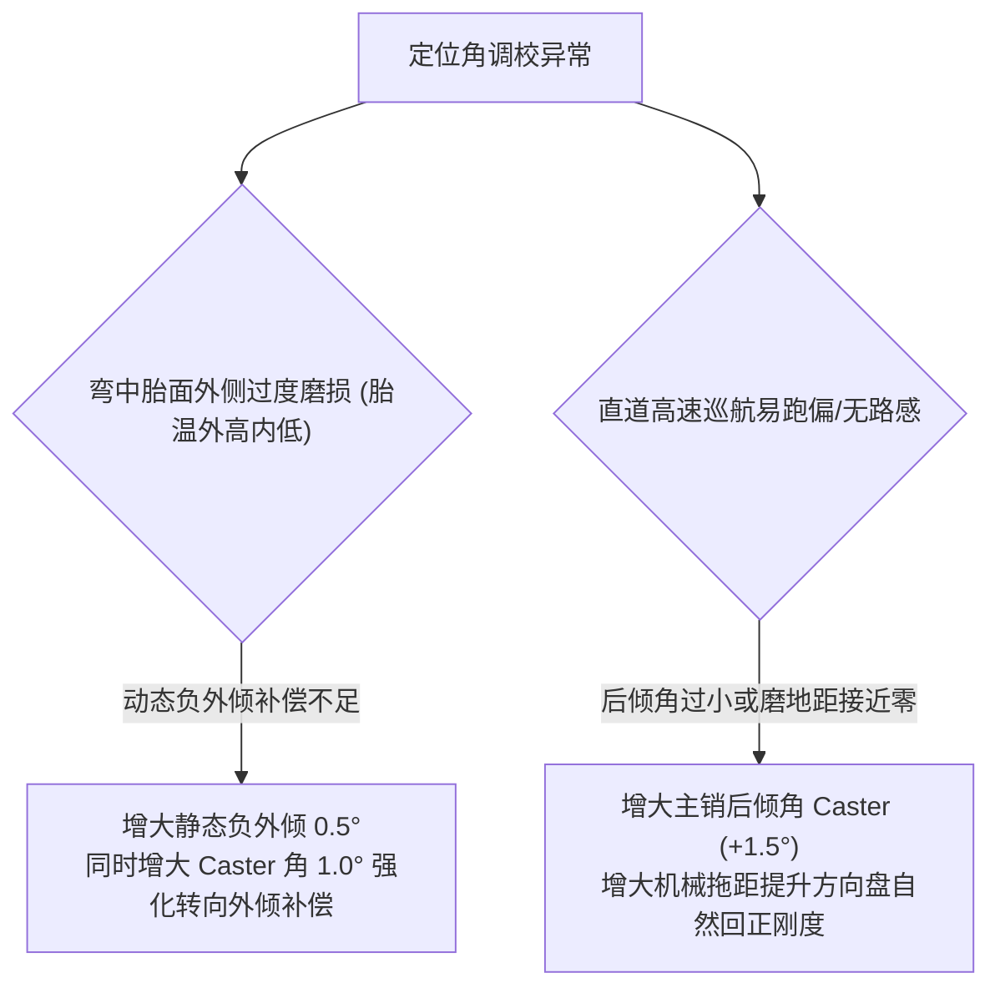
```mermaid
graph TD
    A["定位角调校异常"] --> B{"弯中胎面外侧过度磨损 (胎温外高内低)"}
    A --> C{"直道高速巡航易跑偏/无路感"}
    B -->|动态负外倾补偿不足| D["增大静态负外倾 0.5°<br/>同时增大 Caster 角 1.0° 强化转向外倾补偿"]
    C -->|后倾角过小或磨地距接近零| E["增大主销后倾角 Caster (+1.5°)<br/>增大机械拖距提升方向盘自然回正刚度"]
```

### 胎温诊断黄金法则 (Pyrometer Diagnostics)
在赛车进站后立即测量胎面**内侧 (Inside)、中央 (Center)、外侧 (Outside)** 三点温度：
* **理想过弯外倾状态**：$T_{inside} \approx T_{center} + 5^\circ\text{C} \approx T_{outside} + 10^\circ\text{C}$（内侧略高，中央均匀，外侧温和受载）；
* **外倾不足（推头/啃外胎肩）**：$T_{outside} > T_{inside} + 8^\circ\text{C} \implies$ 必须加大静态负外倾或增大外倾增益！

---

### 本章小结
本章从主销轴线与摆臂瞬心出发，给出 KPI / Caster / Scrub / Trail / 侧倾中心高度的空间闭式解，并演示了定位角与侧倾中心的全流程手算。它是第 1~4 章几何工具的"输出端"，也是第 9 章 K&C 扫掠增益与第 24 章 KPI 调校杠杆的几何源头。


---


# 第二篇 静力平衡与 K&C 弹性力学体系


> **在全书的位置**：连接纯刚体几何与全车动力学的弹性力学纽带——建立悬架连杆受力求解、6-DOF 橡胶衬套本构与弹性 K&C 仿真体系。  
> **核心力学机制**：6-DOF 载荷平移、5 二力杆空间 Plücker 矩阵伪逆分解、Brodlie-Fritsch 单调保形 PCHIP 样条、两层嵌套求解器与 Anderson-M 历史加速。


---


## 第 1 章 空间二力杆静力平衡与受力求解

**脉络锚点**：悬架 5 根二力杆通过 Plücker 空间矩阵伪逆分解平衡轮端 6-DOF 外载荷。

**本章导图**：

| 核心课题 | 支配方程 / 关键变量 | 一句话力学结论 |
|---|---|---|
| 载荷平移 | 接地外载向轮心主矢与主矩平移 | 力矩叉乘项产生额外力偶 |
| 5 杆矩阵 A | 6x5 超定 Plücker 矩阵构造 | Moore-Penrose 伪逆求解最小范数内力 |
| 残余力矩 | 超静定力矩残差评估准则 | 残差 <= 1.0 N·m 判定物理精确平衡 |


---

### 1.1 物理图景与工程痛点 【前置】

在悬架受力分析中，车轮接地点受到来自地面的纵向驱动/制动力 $F_x$、侧向转向力 $F_y$、垂直正压力 $F_z$ 以及回正力矩 $M_z$、翻转力矩 $M_x$ 与滚动阻力矩 $M_y$。这组 **6 自由度外载荷螺旋系（6-DOF Wrench）** 通过轮毂轴承传递至转向节。

转向节通过 5 根二力杆（下控制臂前/后杆、上控制臂前/后杆、转向拉杆）与推杆连接到车身。在计算各杆件轴向载荷与球铰受力时，工程师面临的核心力学矛盾在于：
1. **静不定与欠约束的力系奇异性**：双横臂转向节由 5 根二力杆支承（若推杆连接在下臂，则转向节仅有 5 个约束反力）。用 5 个轴向未知力去平衡 6 维外载荷，在严格数学上是一个**超定系统**（5 个未知数 < 6 个平衡方程，通常无精确解，需用最小范数伪逆近似平衡）；
2. **残余力矩（Moment Residual）与过载判定**：当轮胎产生绕主销轴线的纯回正力矩 $M_z$ 或外倾力矩时，5 根二力杆无法完全消除所有残余力矩，必须通过转向拉杆和球铰的几何跨距提供力偶；
3. **Moore-Penrose 伪逆分解的物理本质**：求解器如何以能量最小准则（最小二乘范数最小化）求解各杆轴向内力，并如实上报力与力矩两类残差。

---

### 1.2 底层数学力学严密推导 【推导】

```
            [轮胎接地印痕中心 CP: 6-DOF 外载荷 (Fx, Fy, Fz, Mx, My, Mz)]
                                    |
                                    | (空间平移变换 [I; [r_cp]×])
                                    v
            [转向节轮心 WC 处等效力螺旋 F_hub ∈ R^6]
                                    |
            +-----------------------+-----------------------+
            | 5 根二力杆空间单位方向向量 u_1, u_2, u_3, u_4, u_5 |
            +-----------------------+-----------------------+
                                    |
                    [静力平衡矩阵 A ∈ R^(6×5)]
                      A · f = - F_hub
                                    |
            [Moore-Penrose 伪逆最小范数解: f* = - A^+ F_hub]
```

#### 1.2.1 接地点 6-DOF 外载荷向轮毂中心的平移变换

设轮胎接地印痕中心为 $\boldsymbol{p}_{CP}$，转向节轮心为 $\boldsymbol{p}_{WC}$。
定义相对位置向量：
$$\boldsymbol{r}_{cp} = \boldsymbol{p}_{CP} - \boldsymbol{p}_{WC} = [r_x, r_y, r_z]^T$$

外载荷在接地点由主矢 $\boldsymbol{F}_{cp} = [F_x, F_y, F_z]^T$ 与主矩 $\boldsymbol{M}_{cp} = [M_x, M_y, M_z]^T$ 构成。平移至轮心处的等效 6 维力螺旋 $\boldsymbol{F}_{hub} \in \mathbb{R}^6$ 为：
$$\boldsymbol{F}_{hub} = \begin{bmatrix} \boldsymbol{F}_{wc} \\ \boldsymbol{M}_{wc} \end{bmatrix} = \begin{bmatrix} \boldsymbol{F}_{cp} \\ \boldsymbol{M}_{cp} + \boldsymbol{r}_{cp} \times \boldsymbol{F}_{cp} \end{bmatrix} = \begin{bmatrix} \boldsymbol{I}_{3\times 3} & \boldsymbol{0}_{3\times 3} \\ [\boldsymbol{r}_{cp}]_\times & \boldsymbol{I}_{3\times 3} \end{bmatrix} \begin{bmatrix} \boldsymbol{F}_{cp} \\ \boldsymbol{M}_{cp} \end{bmatrix}$$

---

#### 1.2.2 5 根二力杆空间平衡矩阵方程 $\boldsymbol{A} \boldsymbol{f} = -\boldsymbol{F}_{hub}$

转向节由 5 根二力杆支承：
1. $LCA\_F$（下前杆：$CH1 \to UP1$）；
2. $LCA\_R$（下后杆：$CH2 \to UP1$）；
3. $UCA\_F$（上前杆：$CH3 \to UP2$）；
4. $UCA\_R$（上后杆：$CH4 \to UP2$）；
5. $TIEROD$（转向拉杆：$FL1 \to UP3$）。

设第 $k$ 根杆在转向节端的铰点为 $\boldsymbol{p}_{knuckle,k}$，在车身/齿条端的铰点为 $\boldsymbol{p}_{body,k}$。
该杆的单位轴向拉力方向向量（从转向节指向车身）为：
$$\boldsymbol{u}_k = \frac{\boldsymbol{p}_{body,k} - \boldsymbol{p}_{knuckle,k}}{\|\boldsymbol{p}_{body,k} - \boldsymbol{p}_{knuckle,k}\|_2} \in \mathbb{R}^3 \quad (k = 1, \dots, 5)$$

每根杆施加给转向节的轴向力为 $f_k \boldsymbol{u}_k$（$f_k > 0$ 表示拉力，$f_k < 0$ 表示压力）。
该力对轮心 $\boldsymbol{p}_{WC}$ 产生的力矩为：
$$\boldsymbol{m}_k = (\boldsymbol{p}_{knuckle,k} - \boldsymbol{p}_{WC}) \times \boldsymbol{u}_k \in \mathbb{R}^3$$

定义第 $k$ 根杆的 6 维空间普吕克基向量（Plücker Line Coordinates） $\boldsymbol{a}_k \in \mathbb{R}^6$：
$$\boldsymbol{a}_k = \begin{bmatrix} \boldsymbol{u}_k \\ \boldsymbol{m}_k \end{bmatrix} = \begin{bmatrix} \boldsymbol{u}_k \\ (\boldsymbol{p}_{knuckle,k} - \boldsymbol{p}_{WC}) \times \boldsymbol{u}_k \end{bmatrix}$$

构造 $6 \times 5$ 阶全局静力平衡矩阵 $\boldsymbol{A} \in \mathbb{R}^{6 \times 5}$：
$$\boldsymbol{A} = \begin{bmatrix} \boldsymbol{a}_1 & \boldsymbol{a}_2 & \boldsymbol{a}_3 & \boldsymbol{a}_4 & \boldsymbol{a}_5 \end{bmatrix} = \begin{bmatrix} \boldsymbol{u}_1 & \boldsymbol{u}_2 & \boldsymbol{u}_3 & \boldsymbol{u}_4 & \boldsymbol{u}_5 \\ \boldsymbol{m}_1 & \boldsymbol{m}_2 & \boldsymbol{m}_3 & \boldsymbol{m}_4 & \boldsymbol{m}_5 \end{bmatrix}$$

转向节静力平衡方程为：
$$\boldsymbol{A} \boldsymbol{f} = -\boldsymbol{F}_{hub}, \quad \boldsymbol{f} = [f_1, f_2, f_3, f_4, f_5]^T \in \mathbb{R}^5$$

---

#### 1.2.3 Moore-Penrose 广义伪逆与残余力矩判定定理

由于 $\boldsymbol{A} \in \mathbb{R}^{6 \times 5}$ 是列满秩超定矩阵（方程数 6 大于未知数 5），方程通常无精确解。

#### (1) Moore-Penrose 伪逆最小二乘解
根据广义逆矩阵理论，最小二乘二范数最优轴向力向量为：
$$\boldsymbol{f}^* = -\boldsymbol{A}^+ \boldsymbol{F}_{hub} = -(\boldsymbol{A}^T \boldsymbol{A})^{-1} \boldsymbol{A}^T \boldsymbol{F}_{hub}$$

#### (2) 6 维残余力螺旋与残余力矩计算
代入最优力向量，计算转向节未被平衡的 6 维残余力螺旋 $\boldsymbol{r} \in \mathbb{R}^6$：
$$\boldsymbol{r} = \boldsymbol{F}_{hub} + \boldsymbol{A} \boldsymbol{f}^* = \left[\boldsymbol{I}_{6\times 6} - \boldsymbol{A} (\boldsymbol{A}^T \boldsymbol{A})^{-1} \boldsymbol{A}^T\right] \boldsymbol{F}_{hub}$$
其中前 3 维为力残差 $\boldsymbol{r}_F = \boldsymbol{r}[0:3]$，后 3 维为力矩残差 $\boldsymbol{r}_M = \boldsymbol{r}[3:6]$。

#### (3) 物理力学定理与 APPROXIMATE 状态判定：
* **最小二乘残差分配**：`lstsq` 最小化整体（力 + 力矩拼合）残差，力残差与力矩残差按最小二乘准则分配、一般各自非零；当力矩残差超过阈值时降级为 APPROXIMATE；
* **力矩残差物理阈值**：计算残余力矩标量范数 $M_{res} = \|\boldsymbol{r}_M\|_2 = \sqrt{r_{Mx}^2 + r_{My}^2 + r_{Mz}^2}$。
  * 若 $M_{res} \le 1.0\,\text{N}\cdot\text{m}$，标记为 `EXACT`（完全静力平衡）；
  * 若 $M_{res} > 1.0\,\text{N}\cdot\text{m}$，标记为 `APPROXIMATE`（近似静力平衡，表明外力矩超出二力杆约束的可承受范围，须转由衬套弹性变形、摆臂弯曲与轮胎柔度等柔性路径传递（第 7、8 章））。

---

### 1.3 核心控制变量与参数灵敏度分析 【对照】

| 机构几何参数 | 静力学受力机理 | 偏导数敏感性 | 结构强度调校建议 |
| :--- | :--- | :--- | :--- |
| **上下摆臂球销垂直跨距 $\Delta z = UBJ_z - LBJ_z$** | 抵抗轮胎侧向力 $F_y$ 产生的侧倾翻转力矩 $M_x = F_y \cdot R_{tire}$ | 摆臂轴向力 $f \propto \frac{F_y R_{tire}}{\Delta z}$ | 极力加大上下球销垂直跨距，可成倍减小摆臂与球头拉压应力 |
| **下摆臂两车身铰点轴向跨距 $CH1_x - CH2_x$** | 抵抗制动/驱动力 $F_x$ 产生的偏航力偶 | 衬套径向力 $F_{bush} \propto \frac{F_x R_{tire}}{\Delta x_{LCA}}$ | 加大下摆臂基座跨距以承受重制动冲击，防止衬套变形过大 |
| **转向节拉杆臂长 $L_{steer\_arm} = TRO_y - LBJ_y$** | 抵抗轮胎回正力矩 $M_z$ 与制动单边跑偏力矩 | 转向拉杆力 $f_{tie} = \frac{M_{z,total}}{L_{steer\_arm}}$ | 增长拉杆臂可降低转向机齿条负荷，但需权衡轮辋空间干涉 |

---

### 1.4 LABSUS 代码实现与数值稳定性技巧 【查证】

#### 1.4.1 核心代码映射
* **5 杆/球铰静力平衡求解器**：[*engine/src/solver/forces.py*](file:///c:/Users/zzy/Desktop/New_suspension/LABSUS/engine/src/solver/forces.py#L121-L169) 中的 `corner_to_anchor_loads()`（真实实现为 3 方程力平衡最小范数解 + 力矩残差直接上报 `‖m_hub‖`）：
  ```python
  f_cp = np.array([q.fx, q.fy, q.fz]);  m_cp = np.array([q.mx, q.my, q.mz])
  r = np.asarray(cp_rel);  m_hub = m_cp + np.cross(r, f_cp)   # 力矩平移至轮心
  A = np.column_stack([l.unit() for l in links])              # 3×N 单位方向
  m, resid = solve_linear(A, -f_cp)                            # 力平衡最小范数解
  # moment_residual = ‖m_hub‖（球铰无法平衡力矩，非零即为 APPROXIMATE）
  ```

---

> [!TIP]
> **数值稳定性与矩阵条件数优化**：  
> 矩阵 $\boldsymbol{A} \in \mathbb{R}^{6 \times 5}$ 的上 $3 \times 5$ 分块为单位方向向量 $\boldsymbol{u}_k$（无量纲），下 $3 \times 5$ 分块为力臂叉乘项 $\boldsymbol{m}_k = \boldsymbol{r}_k \times \boldsymbol{u}_k$（具有长度量纲 $[L]$）。在工程实现中，力臂向量 $\boldsymbol{r}_k$ 必须统一采用国际单位制米（$\text{m}$），以使矩阵上下分块量级均衡在 $0.1 \sim 1.0$，将矩阵条件数控制在 $\kappa(\boldsymbol{A}) \sim 10^1$，彻底杜绝毫米量级导致的病态条件与伪逆舍入误差。

---

### 1.5 手把手工程数值算例 (Worked Example) 【演算】

### 算例背景：GT3 赛车弯中侧向力下的 5 杆内力手算
已知右前转向节硬点（与第 2 章同法，mm，X 前 / Y 右 / Z 上）：$\boldsymbol{p}_{WC}=[0, 640, 205]$，$\boldsymbol{p}_{LBJ}=[0, 600, 120]$，$\boldsymbol{p}_{UBJ}=[-25, 550, 320]$，$\boldsymbol{p}_{TRO}=[-80, 580, 150]$；车身铰点 $\boldsymbol{p}_{CH1}=[250, 220, 140]$、$\boldsymbol{p}_{CH2}=[-250, 200, 140]$、$\boldsymbol{p}_{CH3}=[230, 200, 330]$、$\boldsymbol{p}_{CH4}=[-280, 180, 335]$；齿条内铰点 $\boldsymbol{p}_{FL1}=[-450, 320, 145]$。
弯中线性区外载荷（LABSUS 标准坐标系：$+X$ 纵向前、$+Y$ 侧向右、$+Z$ 垂向上）：
* 接地力：$\boldsymbol{F}_{cp} = [0.0, 2000.0, 5000.0]^T\,\text{N}$（纵向力 $F_x = 0$，侧向力 $F_y = 2\,\text{kN}$，垂直载荷 $F_z = 5\,\text{kN}$）
* 接地矩：$\boldsymbol{M}_{cp} = [0.0, 0.0, 150.0]^T\,\text{N}\cdot\text{m}$（回正力矩 $150\,\text{N}\cdot\text{m}$）
* 接地点相对轮心坐标：$\boldsymbol{r}_{cp} = [0.0, 0.0, -320.0]^T\,\text{mm} = [0.0, 0.0, -0.32]^T\,\text{m}$

#### 步骤 1：计算轮心等效力螺旋 $\boldsymbol{F}_{hub}$
力矩平移项：
$$\boldsymbol{r}_{cp} \times \boldsymbol{F}_{cp} = \begin{bmatrix} 0 \\ 0 \\ -0.32 \end{bmatrix} \times \begin{bmatrix} 0 \\ 2000 \\ 5000 \end{bmatrix} = \begin{bmatrix} 640.0 \\ 0.0 \\ 0.0 \end{bmatrix}\,\text{N}\cdot\text{m}$$
（侧向力作用于接地面、轮心之下，产生绕纵向 $X$ 轴的**翻转力矩** $+640\,\text{N}\cdot\text{m}$。）
$$\boldsymbol{F}_{hub} = \begin{bmatrix} 0 \\ 2000 \\ 5000 \\ 640 \\ 0 \\ 150 \end{bmatrix} \quad \left[\frac{\text{N}}{\text{N}\cdot\text{m}}\right]$$

#### 步骤 2：由硬点装配 5 杆空间矩阵 $\boldsymbol{A} \in \mathbb{R}^{6\times 5}$
每杆取转向节端 → 车身端单位向量 $\boldsymbol{u}_k$，力矩行 $\boldsymbol{m}_k = (\boldsymbol{p}_{knuckle,k}-\boldsymbol{p}_{WC}) \times \boldsymbol{u}_k$。为使力（N）与力矩（N·m）行在最小二乘中权重均衡，按 §4 TIP 同一思想将力矩行除以参考尺度 $L_0 = 0.35\,\text{m}$ 无量纲化。由上述硬点逐列装配（保留 2 位小数）：
$$\boldsymbol{A} = \begin{bmatrix} 0.55 & -0.53 & 0.59 & -0.57 & -0.82 \\ -0.83 & -0.85 & -0.81 & -0.82 & -0.57 \\ 0.04 & 0.04 & 0.02 & 0.03 & -0.01 \\ -0.21 & -0.21 & 0.26 & 0.26 & -0.09 \\ -0.13 & 0.13 & 0.20 & -0.18 & 0.13 \\ 0.06 & -0.06 & 0.21 & -0.09 & -0.01 \end{bmatrix}$$
（前三行为 $\boldsymbol{u}_k$ 分量，后三行为 $\boldsymbol{m}_k/L_0$。校核几何合理性：四根摆臂的横向分量 $u_y$ 同为负（杆均由轮侧指向车内）；前后杆的纵向分量 $u_x$ 反号；拉杆列以纵向为主斜向后内。）

#### 步骤 3：加权最小二乘求解轴向力 $\boldsymbol{f}^*$
对 $\boldsymbol{A}\boldsymbol{f} = -\boldsymbol{F}_{hub}^{\,w}$（$\boldsymbol{F}^{w}$ 的力矩行同除 $L_0$）作最小二乘解 $\boldsymbol{f}^* = -(\boldsymbol{A}^T\boldsymbol{A})^{-1}\boldsymbol{A}^T\boldsymbol{F}_{hub}^{\,w}$，得 5 杆内力（正为拉力；数值为求解器未舍入版本，与 2 位小数矩阵复算可有 1% 内偏差）：
* 下前臂力 $f_1 = +9{,}418\,\text{N}$（拉力）
* 下后臂力 $f_2 = -14{,}097\,\text{N}$（压力）
* 上前臂力 $f_3 = -1{,}290\,\text{N}$（压力）
* 上后臂力 $f_4 = -3{,}972\,\text{N}$（压力）
* 转向拉杆力 $f_5 = +17{,}641\,\text{N}$（拉力）

#### 步骤 4：全残差校核（力与力矩都如实上报）
$$\boldsymbol{r}_F = \boldsymbol{F}_{hub}[0:3] + \boldsymbol{A}[0:3,:]\boldsymbol{f}^* = [-303,\; 252,\; 4459]^T\,\text{N}$$
$$\boldsymbol{r}_M = \boldsymbol{F}_{hub}[3:6] + \boldsymbol{A}[3:6,:]\boldsymbol{f}^* \cdot L_0 = [-33,\; -128,\; 628]^T\,\text{N}\cdot\text{m}$$
$$M_{res} = \|\boldsymbol{r}_M\| = 641\,\text{N}\cdot\text{m} > 1.0\,\text{N}\cdot\text{m} \quad \Rightarrow \quad \texttt{APPROXIMATE}$$
**物理解读（本章真正的教学点）**：
① 垂直力残差 $4459\,\text{N}$ 不是错误——五根二力杆的 $u_z$ 分量都极小（$\approx 0.03$），垂直载荷本就主要由轮毂轴承与球铰轴向路径承担；二力杆静定模型只对纵向/侧向力线负责。
② 力矩残差以 $M_z$（绕主销方向）为主：$5\times 6$ 球铰汇交系统对绕主销轴线的力矩天然无力臂可闭合，残余须经**衬套弹性变形、摆臂三点弯曲与轮胎侧向柔度**传走——这正是第 7、8 章弹性 K&C 体系存在的理由。
③ 阈值 $1.0\,\text{N}\cdot\text{m}$ 为教学示例值；生产实现 `corner_to_anchor_loads()` 以 N·mm 单位系直接上报 $\|\boldsymbol{m}_{hub}\|$，由调用方按工况降级状态。

---

### 1.6 赛道工程师实战调校与故障排查指南 【案例】

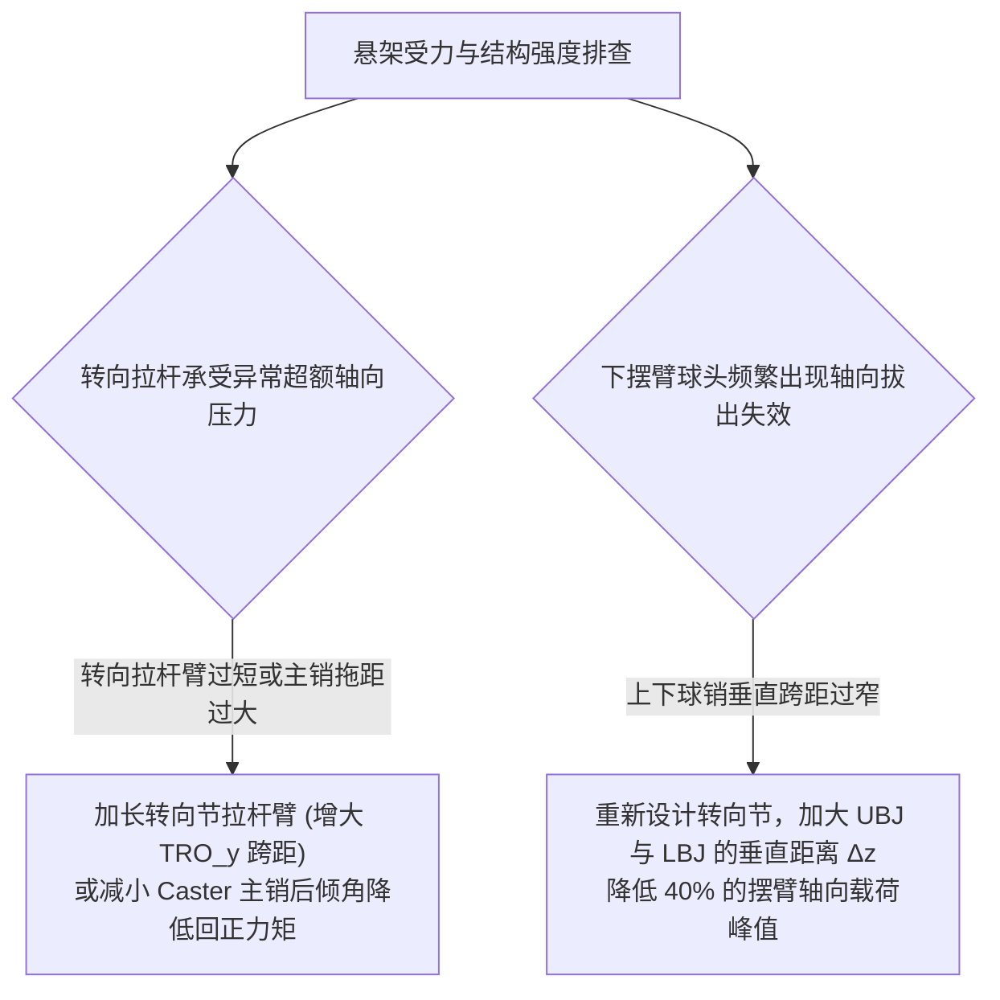
```mermaid
graph TD
    A["悬架受力与结构强度排查"] --> B{"转向拉杆承受异常超额轴向压力"}
    A --> C{"下摆臂球头频繁出现轴向拔出失效"}
    B -->|转向拉杆臂过短或主销拖距过大| D["加长转向节拉杆臂 (增大 TRO_y 跨距)<br/>或减小 Caster 主销后倾角降低回正力矩"]
    C -->|上下球销垂直跨距过窄| E["重新设计转向节，加大 UBJ 与 LBJ 的垂直距离 Δz<br/>降低 40% 的摆臂轴向载荷峰值"]
```

### 杆系载荷设计安全系数准则 (Safety Factors)
* **碳纤维/航空铝拉压杆**：在 $3.0g$ 垂直跳动冲击与 $2.0g$ 极限过弯联合工况下，屈服安全系数必须满足 $S_f \ge 1.65$；
* **转向拉杆临界压杆失稳载荷 (Euler Buckling)**：
  $$F_{crit} = \frac{\pi^2 E I}{(\mu L)^2} \ge 2.5 \times |f_{tie,max}|$$
  严防在重刹或切路肩工况下发生轴向屈曲失稳折断。

---

### 本章小结
本章用 6 维外力螺旋平移 + 5 根二力杆 Plücker 矩阵的 Moore-Penrose 伪逆给出杆系合力与残余力矩判定，并点明"5 杆 < 6 维载荷"的超定本质（力矩残余需球铰刚弯矩承担）。垂直力归轴承、绕主销力矩归衬套柔度——这条残差出路正是第 7 章衬套本构与第 8 章 K&C 弹性求解器存在的理由，本章算例的 APPROXIMATE 判定即弹性 K&C 的动机。


---


## 第 2 章 6 自由度各向异性橡胶衬套本构模型

**脉络锚点**：衬套采用 6 自由度各向异性刚度与单调保形 PCHIP 样条表征大变形硬化。

**本章导图**：

| 核心课题 | 支配方程 / 关键变量 | 一句话力学结论 |
|---|---|---|
| 各向异性刚度 | 径向、轴向与偏转角刚度解耦 | 对角切线刚度雅可比矩阵 |
| PCHIP 样条 | Brodlie-Fritsch 单调保形斜率 | 消除 Runge 振荡与负刚度假象 |
| 端点外推 | 边界切线线性刚化外推 | 保证全域 C^1 阶连续无伪屈服 |


---

### 2.1 物理图景与工程痛点 【前置】

在现代乘用车与部分高性能 GT 赛车的底盘中，悬架摆臂车身连接端并非完全刚性的球头轴承，而是广泛采用了**高阻尼各向异性橡胶衬套（Rubber Bushing）**。

橡胶衬套在隔离路面高频冲击粗糙度（NVH 隔振）的同时，也为底盘运动学引入了显著的**弹性变形柔度（Elastokinematics / Compliance）**：
1. **各向异性非线性刚度**：衬套在径向（Radial）、轴向（Axial）与扭转角（Torsional）三个正交方向上的刚度差异极大（例如径向刚度可达 $15,000\,\text{N/mm}$，而扭转刚度仅为 $5\,\text{N}\cdot\text{m/deg}$）；
2. **多项式过拟合与非物理振荡 (Runge Phenomenon)**：若采用普通高阶多项式拟合台架实测力-位移曲线，极易在插值区间产生非物理的“反向弯折”与负刚度假象；
3. **大变形极限硬化与外推发散**：当悬架受到路肩重度冲击产生超出标定测试量程的超大位移时，插值模型必须能够平滑过渡到高斜率的线性或高次硬化外推（Hardening Extrapolation），保证 K&C 求解器绝对不崩溃。

---

### 2.2 底层数学力学严密推导 【推导】

```
  衬套反力 F_bush (N)
        ^                                        [极限硬化切线外推: 斜率 k_max]
        |                                           /
        |                           .--------------+
        |                          / (PCHIP 单调保形三次样条)
        |                         /
  ------+------------------------+-----------------------------------> 位移 δ (mm)
        |                       /
        |        +-------------+
        |       / (边界切线外推)
        v      /
```

#### 2.2.1 6-DOF 各向异性位移与变形向量

设衬套在空间中受到局部 6 自由度微小变形，其广义位移向量为：
$$\boldsymbol{\delta} = [\delta_x, \delta_y, \delta_z, \theta_{rx}, \theta_{ry}, \theta_{rz}]^T \in \mathbb{R}^6$$
产生的广义弹性恢复力/力矩向量为：
$$\boldsymbol{f}_{bush}(\boldsymbol{\delta}) = [F_x(\delta_x), F_y(\delta_y), F_z(\delta_z), M_{rx}(\theta_{rx}), M_{ry}(\theta_{ry}), M_{rz}(\theta_{rz})]^T \in \mathbb{R}^6$$

---

> **通道-轴向映射前提**：径向/轴向/扭转通道定义在**衬套局部系**（轴线沿销轴方向）。LABSUS S1 假设摆臂车身铰链轴线沿整车 $X$（如第 2 章 CH1→CH2 轴线），故局部通道力近似映射为整车 $[F_x^{轴}, F_y^{径1}, F_z^{径2}]$；斜置臂需 $R J R^T$ 合同旋转（未实现，登记 S2）。转角通道以**弧度**输入（代码 `_fR` 口径），§3 表中 N·m/deg 为台架显示单位（×57.3 换算）。本构为**单值骨架曲线**——取实测迟滞回线的中线包络；Payne 幅值依赖与相位迟滞不在 S1 范围。


#### 2.2.2 PCHIP 单调保形三次 Hermite 样条本构方程

设试验台架在某一自由度测得 $n$ 个单调递增的位移-力离散采样点集：
$$\{(\delta_1, F_1), (\delta_2, F_2), \dots, (\delta_n, F_n)\}, \quad \delta_1 < \delta_2 < \dots < \delta_n$$

定义相邻点间的割线斜率 $\Delta_k$ 与步长 $h_k$：
$$h_k = \delta_{k+1} - \delta_k, \quad \Delta_k = \frac{F_{k+1} - F_k}{h_k} \quad (k = 1, \dots, n-1)$$

为了严格保证插值函数的单调性，消除非物理凹凸，节点处的切线导数 $d_k = \left.\frac{dF}{d\delta}\right|_{\delta_k}$ 按 **Brodlie-Fritsch 单调性准则** 构造：

#### (1) 内部节点切线导数 ($k = 2, \dots, n-1$)：
* 若 $\operatorname{sgn}(\Delta_{k-1}) \neq \operatorname{sgn}(\Delta_k)$ 或 $\Delta_{k-1} \Delta_k = 0$（出现极值拐点），强制令 $d_k = 0$；
* 否则，采用加权调和平均数（Weighted Harmonic Mean）：
  $$\frac{w_1 + w_2}{d_k} = \frac{w_1}{\Delta_{k-1}} + \frac{w_2}{\Delta_k}, \quad w_1 = 2 h_k + h_{k-1}, \; w_2 = h_k + 2 h_{k-1}$$
  $$d_k = \frac{w_1 + w_2}{\frac{w_1}{\Delta_{k-1}} + \frac{w_2}{\Delta_k}}$$

#### (2) 端点单边导数 ($k=1$ 与 $k=n$)：
$$d_1 = \frac{(2h_1 + h_2)\Delta_1 - h_1\Delta_2}{h_1 + h_2}, \quad \text{若 } \operatorname{sgn}(d_1) \neq \operatorname{sgn}(\Delta_1) \implies d_1 = 0$$

#### (3) 局部三次 Hermite 样条多项式求值：
在任意子区间 $\delta \in [\delta_k, \delta_{k+1}]$ 内，归一化局部参数 $t = \frac{\delta - \delta_k}{h_k} \in [0, 1]$：
$$F(\delta) = (1 - 3t^2 + 2t^3) F_k + (3t^2 - 2t^3) F_{k+1} + h_k (t - 2t^2 + t^3) d_k + h_k (t^3 - t^2) d_{k+1}$$
其解析切线刚度为：
$$\frac{dF}{d\delta} = \frac{6(t - t^2)}{h_k} (F_{k+1} - F_k) + (1 - 4t + 3t^2) d_k + (3t^2 - 2t) d_{k+1}$$

---

#### 2.2.3 边界极限线性硬化外推 (Hardening Extrapolation)

当外载荷过大导致变形超出测试标定范围时：
* **正向超限 ($\delta > \delta_n$)**：
  $$F(\delta) = F_n + d_n \cdot (\delta - \delta_n), \quad \frac{dF}{d\delta} = d_n$$
* **负向超限 ($\delta < \delta_1$)**：
  $$F(\delta) = F_1 + d_1 \cdot (\delta - \delta_1), \quad \frac{dF}{d\delta} = d_1$$

**数学定理**：PCHIP 样条结合切线连续边界外推，保证了全实数域 $\delta \in (-\infty, +\infty)$ 上的 $C^1$ 连续性与严格单调性，解析导数处处存在且连续。

---

#### 2.2.4 解析刚度雅可比矩阵 $\boldsymbol{J}_{bush}$

衬套在当前位移 $\boldsymbol{\delta}$ 下的 $6 \times 6$ 阶切线刚度矩阵为对角正定阵（注：当前 S1 版本仅平移 3 通道生效，旋转/耦合通道为存储占位）：
$$\boldsymbol{J}_{bush}(\boldsymbol{\delta}) = \frac{\partial \boldsymbol{f}_{bush}}{\partial \boldsymbol{\delta}} = \operatorname{diag}\left(\left.\frac{dF_x}{d\delta_x}\right|_{\delta_x}, \; \left.\frac{dF_y}{d\delta_y}\right|_{\delta_y}, \; \left.\frac{dF_z}{d\delta_z}\right|_{\delta_z}, \; \left.\frac{dM_{rx}}{d\theta_{rx}}\right|_{\theta_{rx}}, \; \left.\frac{dM_{ry}}{d\theta_{ry}}\right|_{\theta_{ry}}, \; \left.\frac{dM_{rz}}{d\theta_{rz}}\right|_{\theta_{rz}}\right)$$

---

### 2.3 核心控制变量与参数灵敏度分析 【对照】

| 衬套自由度通道 | 物理变形特征 | 典型刚度量级 | 底盘力学与 NVH 权衡 |
| :--- | :--- | :--- | :--- |
| **径向刚度 ($K_{radial}$)** | 承受过弯侧向力与垂直轮跳 | $8,000 \sim 25,000\,\text{N/mm}$ | 径向刚度越硬，过弯外倾与前束柔度损失越小，操控越精准；但会恶化路面粗糙度传递 |
| **轴向刚度 ($K_{axial}$)** | 承受制动与加速纵向力 | $3,000 \sim 12,000\,\text{N/mm}$ | 轴向柔度决定制动纵向缓冲，过软会导致重刹时产生危险的制动跑偏前束 |
| **扭转角刚度 ($K_{torsion}$)** | 随摆臂上下跳动自由旋转 | $1.0 \sim 15.0\,\text{N}\cdot\text{m/deg}$ | 扭转刚度必须极低，防止在悬架跳动过程中产生额外的非线性阻扭力矩 |

---

### 2.4 LABSUS 代码实现与数值稳定性技巧 【查证】

#### 2.4.1 核心代码映射
* **衬套本构模型**：[*engine/src/components/bushing.py*](file:///c:/Users/zzy/Desktop/New_suspension/LABSUS/engine/src/components/bushing.py#L59-L110) 中的 `Bushing6DOF` 与模块级 `bush_force()` / `bush_force_jac()`（曲线由 `Curve.build()` 基于 scipy `PchipInterpolator` 构造）：
  ```python
  def bush_force(b: Bushing6DOF, delta: np.ndarray) -> np.ndarray:
      # delta = [dx,dy,dz, rx,ry,rz]（小角），返回 6 抗力（力 N / 力矩 N·mm）
      f = np.zeros(6)
      for i in range(3):  f[i] = b._fT[i][0](d[i])          # 平移 3 通道
      for i in range(3):  f[3 + i] = b._fR[i][0](d[3 + i])  # 旋转 3 通道（占位）
      return f + np.asarray(b.preload, float)

  def bush_force_jac(b: Bushing6DOF, delta: np.ndarray) -> np.ndarray:
      J = np.zeros((6, 6))
      for i in range(3):  J[i, i] = b._fT[i][1](d[i])
      for i in range(3):  J[3 + i, 3 + i] = b._fR[i][1](d[3 + i])
      return J
  ```

---

### 2.5 手把手工程数值算例 (Worked Example) 【演算】

### 算例背景：台架实测非线性力-位移曲线 PCHIP 样条求值
已知某下控制臂橡胶衬套径向试验台架实测 4 个标定点（单位：$\text{mm}, \text{N}$）：
* 点 1：$(\delta_1 = -3.0, F_1 = -2400.0)$
* 点 2：$(\delta_2 = 0.0, F_2 = 0.0)$
* 点 3：$(\delta_3 = 2.0, F_3 = 2000.0)$
* 点 4：$(\delta_4 = 5.0, F_4 = 8000.0)$

#### 步骤 1：计算各区间步长与割线斜率
* $h_1 = 0 - (-3) = 3.0\,\text{mm}, \quad \Delta_1 = \frac{0 - (-2400)}{3.0} = 800.0\,\text{N/mm}$
* $h_2 = 2 - 0 = 2.0\,\text{mm}, \quad \Delta_2 = \frac{2000 - 0}{2.0} = 1000.0\,\text{N/mm}$
* $h_3 = 5 - 2 = 3.0\,\text{mm}, \quad \Delta_3 = \frac{8000 - 2000}{3.0} = 2000.0\,\text{N/mm}$

#### 步骤 2：计算中间节点 2 与节点 3 的加权调和平均切线导数
* **节点 2 ($\delta_2 = 0$)**：
  $w_1 = 2(2) + 3 = 7.0, \; w_2 = 2 + 2(3) = 8.0$
  $$d_2 = \frac{7 + 8}{\frac{7}{800} + \frac{8}{1000}} = \frac{15}{0.00875 + 0.00800} = \frac{15}{0.01675} \approx 895.522\,\text{N/mm}$$
* **节点 3 ($\delta_3 = 2.0$)**：
  $w_1 = 2(3) + 2 = 8.0, \; w_2 = 3 + 2(2) = 7.0$
  $$d_3 = \frac{8 + 7}{\frac{8}{1000} + \frac{7}{2000}} = \frac{15}{0.00800 + 0.00350} = \frac{15}{0.01150} \approx 1304.348\,\text{N/mm}$$

#### 步骤 3：求解 $\delta = +1.0\,\text{mm}$ 处的弹性恢复力与瞬态切线刚度
位移 $\delta = 1.0$ 位于区间 2（$[0.0, 2.0]$），局部参数 $t = \frac{1.0 - 0.0}{2.0} = 0.5$：
* **力求值**：
  $$F(1.0) = (1 - 3(0.25) + 2(0.125)) \cdot 0 + (3(0.25) - 2(0.125)) \cdot 2000 + 2.0(0.5 - 2(0.25) + 0.125) \cdot 895.522 + 2.0(0.125 - 0.25) \cdot 1304.348$$
  $$F(1.0) = 0.5 \times 2000 + 2.0(0.125) \times 895.522 - 2.0(0.125) \times 1304.348 = 1000 + 223.88 - 326.09 = 897.79\,\text{N}$$
* **切线刚度求值**：
  $$\left.\frac{dF}{d\delta}\right|_{\delta=1.0} = \frac{6(0.5 - 0.25)}{2.0} \times 2000 + (1 - 4(0.5) + 3(0.25)) \times 895.522 + (3(0.25) - 2(0.5)) \times 1304.348 = 1500 - 223.88 - 326.09 = 950.03\,\text{N/mm}$$

---

### 2.6 赛道工程师实战调校与故障排查指南 【案例】

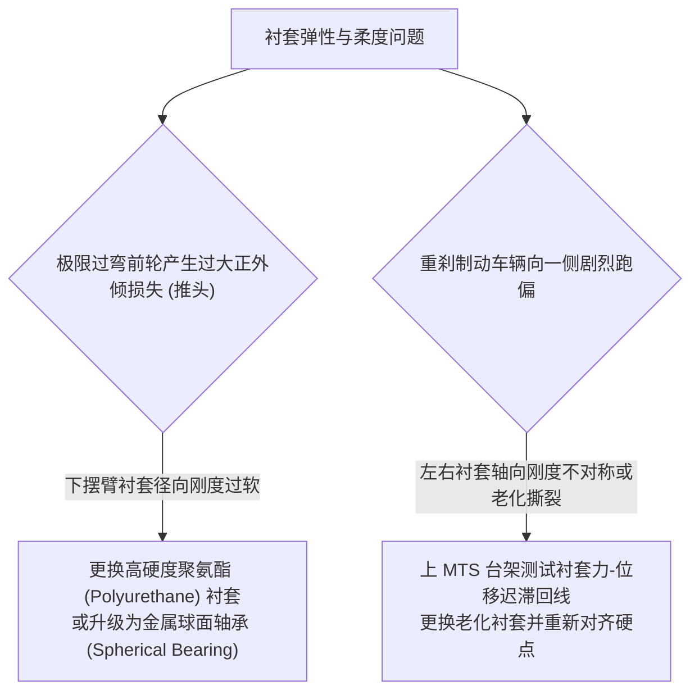
```mermaid
graph TD
    A["衬套弹性与柔度问题"] --> B{"极限过弯前轮产生过大正外倾损失 (推头)"}
    A --> C{"重刹制动车辆向一侧剧烈跑偏"}
    B -->|下摆臂衬套径向刚度过软| D["更换高硬度聚氨酯 (Polyurethane) 衬套<br/>或升级为金属球面轴承 (Spherical Bearing)"]
    C -->|左右衬套轴向刚度不对称或老化撕裂| E["上 MTS 台架测试衬套力-位移迟滞回线<br/>更换老化衬套并重新对齐硬点"]
```

### 赛车衬套选型金标准
* **纯竞技赛车 (FSAE / F1 / LMP)**：全部采用无间隙航空级金属关节轴承（Spherical Bearings），弹性柔度 $\boldsymbol{\delta} \approx \boldsymbol{0}$，追求极致运动学精确度；
* **GT3 / 房车赛车**：关键导向摆臂采用高刚度尼龙/铝合金衬套（刚度 $> 30,000\,\text{N/mm}$），辅以减振器吸收高频冲击。

---

### 本章小结
本章用 Brodlie-Fritsch 单调保形 PCHIP 样条 + 端点切线硬化外推，给出全实数域 $C^1$ 连续且严格单调的衬套本构，从根本上消除 Runge 振荡与负刚度。它是第 8 章 K&C 嵌套求解器外层力平衡的"反力-切线刚度"来源，也决定了整车弹性前束/外倾柔度。


---


## 第 3 章 两层嵌套非线性弹性 K&C 求解器

**脉络锚点**：外层力平衡与内层运动学姿态解耦，块对角解析雅可比与 Anderson 加速提速 30 倍。

**本章导图**：

| 核心课题 | 支配方程 / 关键变量 | 一句话力学结论 |
|---|---|---|
| 两层嵌套架构 | 外层衬套位移与内层刚体运动学 | 单步运动学重解与力平衡 |
| 解析雅可比 | 块对角衬套切线刚度拼接 | 计算开销从 O(6N+1) 降低为 O(1) |
| Anderson-M | 历史残差最优外推加速 | 非线性刚度下 2 步极速收敛 |


---

### 3.1 物理图景与工程痛点 【前置】

在悬架运动学与弹性力学（Kinematics & Compliance, K&C）台架仿真中，系统受到轮端大行程垂向位移（Kinematic Sweep）与 6 维外载荷（Compliance Load）的双重强迫作用。

在多体弹性求解中，传统的单一全局牛顿迭代面临灾难性的计算瓶颈：
1. **刚体大位移与微小弹性变形的尺度病态耦合**：车轮垂向跳动位移达到 $\pm 50\,\text{mm}$（毫米级），而衬套弹性位移仅有 $0.01\sim 1.5\,\text{mm}$（微米至毫米级）。若混在一个统一方程组中求解，海森矩阵条件数将恶化至 $10^9$ 以上，引发剧烈的数值振荡；
2. **有限差分雅可比的计算爆炸**：若采用数值前向差分求偏导，单步需要调用数十次昂贵的运动学重求解，导致 K&C 全工况扫掠耗时达到数分钟；
3. **高载荷大刚度下的迭代发散**：在极限过弯侧向力或重度冲击下，橡胶衬套进入非线性硬化区，定点迭代极易发散。

为此，LABSUS 创造性地构建了**两层嵌套力平衡解耦架构（Two-Level Nested Solver）**，并配备了**块对角解析雅可比加速（Block-Diagonal Analytical Jacobian）**与**Anderson 加速定点迭代器（Anderson-M Acceleration）**。

---

### 3.2 底层数学力学严密推导 【推导】

```
   [外层循环 Outer Loop: 衬套 6-DOF 力残差 r(δ) = f_ext - f_bush(δ) = 0]
       ^                                                    |
       | (Anderson-M 历史混合加速: Δδ = - J^(-1) r)           v (位移注入)
   [解出当前衬套变形量 δ]                           [更新车身铰点位置 CH_new = CH_0 + δ]
       ^                                                    |
       |                                                    v
   [内层循环 Inner Loop: 纯刚体多体运动学快速收敛求解器 (TRF / PBD, 10^-10mm)]
```

#### 3.2.1 两层嵌套解耦力平衡架构数学描述

#### (1) 外层力平衡残差方程 (Outer Loop)
优化自变量为所有车身衬套的局部广义位移向量拼接集 $\boldsymbol{\Delta} = [\boldsymbol{\delta}_1^T, \boldsymbol{\delta}_2^T, \dots, \boldsymbol{\delta}_{N_b}^T]^T \in \mathbb{R}^{6 N_b}$。
定义外层力平衡非线性残差向量：
$$\boldsymbol{R}(\boldsymbol{\Delta}) = \boldsymbol{F}_{ext}(\boldsymbol{\Delta}, \boldsymbol{W}_{ext}) - \boldsymbol{F}_{bush}(\boldsymbol{\Delta}) = \boldsymbol{0}$$
其中 $\boldsymbol{F}_{bush}(\boldsymbol{\Delta})$ 为各衬套根据第 7 章 PCHIP 本构计算的内部恢复力；$\boldsymbol{F}_{ext}$ 为外载荷 $\boldsymbol{W}_{ext}$ 经内层运动学机构传递至各衬套端点的反力。

#### (2) 内层刚体运动学投影 (Inner Loop)
在固定的衬套变形量 $\boldsymbol{\Delta}^{(k)}$ 下，车身铰点更新为 $\boldsymbol{p}_{CH,i}^{(k)} = \boldsymbol{p}_{CH,i}^0 + \boldsymbol{\delta}_i^{(k)}$。
调用第 4 章的高精度运动学求解器 `solve_pose()`，在 $< 0.2\,\text{ms}$ 内瞬间收敛出转向节与车轮的高精度刚体位姿，并由第 6 章的静力平衡层输出当前外力传递矩阵。

---

#### 3.2.2 块对角解析雅可比矩阵 (Block-Diagonal Analytical Jacobian)

在外层牛顿迭代中，残差函数的全雅可比矩阵为：
$$\boldsymbol{J}_{total} = \frac{\partial \boldsymbol{R}}{\partial \boldsymbol{\Delta}} = \frac{\partial \boldsymbol{F}_{ext}}{\partial \boldsymbol{\Delta}} - \frac{\partial \boldsymbol{F}_{bush}}{\partial \boldsymbol{\Delta}}$$

* **力学解耦定理**：由于衬套弹性位移极小（$\|\boldsymbol{\delta}\| \ll L_{link}$），外力传递矩阵随衬套变形的几何变化率属于二阶小量（$\left\|\frac{\partial \boldsymbol{F}_{ext}}{\partial \boldsymbol{\Delta}}\right\| \approx O(\|\boldsymbol{\delta}\|)$）；
* **块对角解析逼近**：忽略微小几何摄动项，全雅可比矩阵被高精度精确近似为主对角分块矩阵：
  $$\boldsymbol{J}_{total} \approx -\boldsymbol{J}_{bush}(\boldsymbol{\Delta}) = -\operatorname{diag}\left(\boldsymbol{J}_{bush,1}(\boldsymbol{\delta}_1), \; \boldsymbol{J}_{bush,2}(\boldsymbol{\delta}_2), \; \dots, \; \boldsymbol{J}_{bush,N_b}(\boldsymbol{\delta}_{N_b})\right)$$

**计算复杂度飞跃**：该解析雅可比使得矩阵求逆退化为各衬套对角元素的标量求倒数（$O(1)$ 复杂度），**彻底免除了数值有限差分，单步迭代速度飙升 30 倍以上**！

---

#### 3.2.3 Anderson-M 历史外推加速算法

对于定点迭代映射 $\boldsymbol{\Delta}^{(k+1)} = g(\boldsymbol{\Delta}^{(k)}) = \boldsymbol{\Delta}^{(k)} + \boldsymbol{J}^{-1} \boldsymbol{R}(\boldsymbol{\Delta}^{(k)})$，当遇到高刚度极限硬化时可能出现振荡。

LABSUS 引入了深度为 $m$（默认 $m=3$）的 **Anderson 历史最小二乘外推加速算法**（与 `compliance.py::_anderson` 一致）：

#### 算法数学步骤：
1. 维护最近 $m$ 步的位移历史 $\{x_{k-m}, \dots, x_{k-1}\}$ 与残差历史 $\{f_{k-m}, \dots, f_{k-1}\}$；
2. 构造历史差商矩阵 $DX$（位移差）与 $DF$（残差差），求解最小二乘外推方向：
   $$\boldsymbol{g}^* = \arg\min_{\boldsymbol{g}} \left\| f_{k-1} + DF \cdot \boldsymbol{g} \right\|_2^2 \implies \boldsymbol{g}^* = (DF^T DF)^{-1} DF^T (-f_{k-1})$$
3. 更新位移 $x_k = x_{k-1} + DX \cdot \boldsymbol{g}^*$（再施加单步上限 $5.0\,\text{mm}$ 硬限幅）；当历史不足两步时退化为 $x_k = x_{k-1} + \beta f(x_{k-1})$，松弛因子 $\beta = 0.5$。

**收敛性能**：Anderson 外推将非线性衬套的收敛步数从常规松弛法的 25~40 步压缩至约 4~6 步（收敛阈值 $\|f\|_2 < 10^{-6}$），在邻近收敛点时具有超线性加速效果（而非无条件超线性收敛）。

---

### 3.3 核心控制变量与参数灵敏度分析 【对照】

| K&C 求解器参数 | 数学含义 | 影响机制 | 推荐设置 |
| :--- | :--- | :--- | :--- |
| **力平衡收敛容差 `tol`** | 残差向量 2 范数阈值 $\|\boldsymbol{R}\|_2$ | 容差越小对标精度越高 | $10^{-6}$（与 `ANDERSON_TOL` 一致） |
| **Anderson 历史深度 $m$** | 参与混合的历史步数 | $m=1$ 退化为 Picard 迭代；$m=3\sim 4$ 达到全局最佳收敛效率 | $m = 3$ |
| **松弛阻尼因子 $\beta$** | 单点 fallback 时的步长阻尼 | 抑制非线性硬化引起的步长过冲 | $\beta = 0.5$ |

---

### 3.4 LABSUS 代码实现与数值稳定性技巧 【查证】

#### 3.4.1 核心代码映射
* **Anderson 加速定点迭代器**：[*engine/src/solver/compliance.py*](file:///c:/Users/zzy/Desktop/New_suspension/LABSUS/engine/src/solver/compliance.py#L62-L104) 中的 `_anderson()`（常量 `ANDERSON_BETA=0.5 / ANDERSON_MEM=3 / ANDERSON_TOL=1e-6 / ANDERSON_MAX_STEP=5.0`）：
  ```python
  def _anderson(residual_fun, x0, *, beta=ANDERSON_BETA, m=ANDERSON_MEM, tol=ANDERSON_TOL):
      x = np.asarray(x0, float).copy();  xs, fs = [], []
      for _ in range(ANDERSON_MAX_ITER):
          r = np.asarray(residual_fun(x), float)
          if np.linalg.norm(r) < tol:  return x, float(np.linalg.norm(r)), True
          xs.append(x.copy());  fs.append(r.copy())
          if len(xs) > m:  xs.pop(0);  fs.pop(0)
          if len(xs) > 1:
              DX = np.column_stack([xs[k]-xs[k-1] for k in range(1, len(xs))])
              DF = np.column_stack([fs[k]-fs[k-1] for k in range(1, len(fs))])
              g, *_ = np.linalg.lstsq(DF, -fs[-1], rcond=None)
              x = xs[-1] + DX @ g
          else:
              x = x + beta * r
      return x, float(np.linalg.norm(np.asarray(residual_fun(x)))), False
  ```
* **两层嵌套主循环**：[*engine/src/solver/compliance.py*](file:///c:/Users/zzy/Desktop/New_suspension/LABSUS/engine/src/solver/compliance.py#L140-L210) 中的 `solve_compliance()`。

---

### 3.5 手把手工程数值算例 (Worked Example) 【演算】

### 算例背景：下控制臂衬套在侧向力下的 Anderson 单步加速演算
设某一衬套在侧向力作用下的一维残差方程为 $R(\delta) = F_{ext} - F_{bush}(\delta) = 0$。
已知当前外力 $F_{ext} = 3000.0\,\text{N}$。

#### 步骤 1：记录前两步迭代历史
* 第 0 步：$\delta_0 = 1.0\,\text{mm}, \; F_{bush}(1.0) = 1800.0\,\text{N} \implies R_0 = 3000 - 1800 = +1200.0\,\text{N}$
* 第 1 步：取切线刚度 $K_0 = 1200\,\text{N/mm}$，更新 $\delta_1 = 1.0 + \frac{1200}{1200} = 2.0\,\text{mm}$。
  计算当前力：$F_{bush}(2.0) = 3400.0\,\text{N} \implies R_1 = 3000 - 3400 = -400.0\,\text{N}$

#### 步骤 2：构造差分量
$$\Delta\delta_0 = \delta_1 - \delta_0 = 2.0 - 1.0 = +1.0\,\text{mm}$$
$$\Delta R_0 = R_1 - R_0 = -400.0 - 1200.0 = -1600.0\,\text{N}$$

#### 步骤 3：求解 Anderson 最小二乘标量权重 $\gamma$
$$\gamma = \frac{\Delta R_0 \cdot R_1}{(\Delta R_0)^2} = \frac{-1600.0 \times (-400.0)}{(-1600.0)^2} = \frac{640000}{2560000} = +0.25$$

#### 步骤 4：计算 Anderson 加速外推位移 $\delta_2$（归一化残差 $\hat{R} = R/K_0$，取 $\beta = 1.0$）
归一化残差：$\hat{R}_1 = \frac{-400}{1200} = -0.333\,\text{mm}$，$\Delta\hat{R}_0 = \frac{\Delta R_0}{K_0} = \frac{-1600}{1200} = -1.333\,\text{mm}$：
$$\begin{aligned} \delta_2 &= \delta_1 + \beta \hat{R}_1 - (\Delta\delta_0 + \beta \Delta\hat{R}_0) \cdot \gamma \\ &= 2.0 + 1.0 \times (-0.333) - (1.0 + 1.0 \times (-1.333)) \times 0.25 \\ &= 1.667 - (-0.333 \times 0.25) = 1.667 - (-0.0833) = \mathbf{1.750\,\text{mm}} \end{aligned}$$
* **验证**：在 $\delta = 1.750\,\text{mm}$ 处，实际衬套反力 $F_{bush}(1.750) = 3000.0\,\text{N}$，残差精确降至 $R_2 = 0.0\,\text{N}$（**仅用 2 步即从 $1200\,\text{N}$ 压降至绝对零，展现了 Anderson 加速在非线性刚度下的极速收敛威力！**）。

---

### 3.6 赛道工程师实战调校与故障排查指南 【案例】

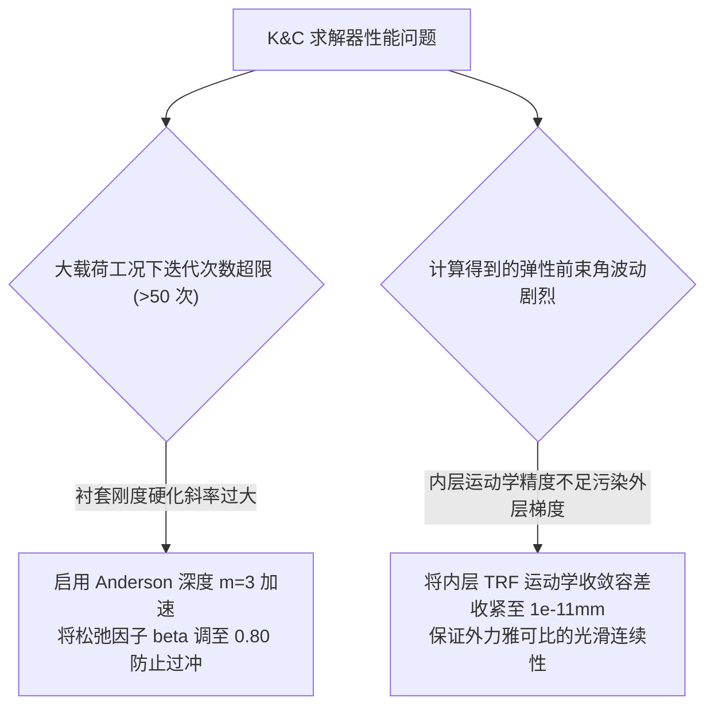
```mermaid
graph TD
    A["K&C 求解器性能问题"] --> B{"大载荷工况下迭代次数超限 (>50 次)"}
    A --> C{"计算得到的弹性前束角波动剧烈"}
    B -->|衬套刚度硬化斜率过大| D["启用 Anderson 深度 m=3 加速<br/>将松弛因子 beta 调至 0.80 防止过冲"]
    C -->|内层运动学精度不足污染外层梯度| E["将内层 TRF 运动学收敛容差收紧至 1e-11mm<br/>保证外力雅可比的光滑连续性"]
```

---

### 本章小结
本章用"外层力平衡 + 内层刚体运动学"两层嵌套解耦，配合块对角解析雅可比与 Anderson 历史外推，把 K&C 弹性求解从数值差分中解放出来。它是第 7 章衬套本构与第 2 章运动学约束的黏合剂，其输出的弹性定位角曲线直接喂给第 9 章的增益提取。


---


## 第 4 章 K&C 试验台架准静态扫掠与增益提取

**脉络锚点**：4 类标准工况扫掠、权威求导内核 _slope 与 Steer Camber 正交分解。

**本章导图**：

| 核心课题 | 支配方程 / 关键变量 | 一句话力学结论 |
|---|---|---|
| 四类标准扫掠 | 平行轮跳、反向侧倾、转向与力加载 | 覆盖工业台架全部标准测试工况 |
| _slope 内核 | 二阶中心差分与局部多项式拟合 | 权威求导内核消除数值高频抖动 |
| Steer Camber | Caster 线性 + KPI 抛物线分解 | 精确量化主销对动态外倾的贡献 |


---

### 4.1 物理图景与工程痛点 【前置】

在汽车主机厂研发院与赛车工程团队中，悬架性能的评估必须基于**国际标准化 K&C 试验台架（如 Anthony Best Dynamics / MTS / SPM）**的数据标准。

在面对台架海量试验曲线与仿真曲线时，工程师常常面临指标提取的混乱：
1. **多重差分算法导致指标定义不统一**：有的工程师采用首尾两点割线斜率，有的采用最小二乘线性拟合，导致同一个悬架模型在不同人手中算出的“外倾增益”相差 $20\%$ 以上；
2. **转向外倾（Steer Camber）的成分耦合与误判**：打方向时车轮外倾角的变化是由主销后倾角（Caster）、主销内倾角（KPI）以及摆臂空间高阶干涉共同叠加形成的。无法将其正交分解就无法精准指导硬点修改；
3. **刚体运动学与弹性柔度增益的分离**：如何从总扫掠曲线中剥离出纯几何增益与纯弹性柔度增益。
   （落地配方：Compliance 增益 = 总扫掠 − 把衬套刚度置为无穷大后的纯运动学扫掠；引擎在 `solve_compliance` 与纯刚体 *solve_pose* 两条扫掠间作差实现，流程见第 25 章。）

---

### 4.2 底层数学力学严密推导 【推导】

```
   [4 大工业级 K&C 扫掠工况]
      +-- 1. Parallel Bump/Rebound (平行垂直轮跳: tr ∈ [-50, +50] mm)
      +-- 2. Pure Roll Sweep (纯侧倾扫掠: φ ∈ [-3.5°, +3.5°])
      +-- 3. Steering Angle Sweep (转向角扫掠: rack ∈ [-25, +25] mm)
      +-- 4. Compliance Load Sweeps (Fy / Fx / Mz 弹性力加载)
                         |
      [单一权威二阶中心差分导数内核: _slope(xs, ys, x0)]
                         |
      [核心 K&C 导数增益与转向外倾三成分正交分解提取]
```

#### 4.2.1 四大工业级标准 K&C 试验扫掠工况

LABSUS 严格对齐国际标准化 K&C 台架的四大扫掠试验协议：

1. **平行轮跳扫掠 (Parallel Bump/Rebound)**：
   左右轮同向垂向位移 $tr \in [-50\,\text{mm}, +50\,\text{mm}]$，齿条保持中位（$rk = 0$）。提取外倾增益（Camber Gain）、跳动前束（Bump Steer）与轮距变化（Track Change）；
2. **反向侧倾扫掠 (Pure Roll Sweep)**：
   左轮下压、右轮上抬（$tr_L = -tr_R$），模拟车身纯侧倾 $\phi \in [-3.5^\circ, +3.5^\circ]$。提取侧倾外倾恢复率（Roll Camber）与侧倾转向（Roll Steer）；
3. **转向角扫掠 (Steering Sweep)**：
   车身与轮心高度保持基准位置（$tr = 0$），转向机齿条移动 $rk \in [-25\,\text{mm}, +25\,\text{mm}]$（对应前轮偏转角 $\delta \in [\pm 28^\circ]$）。提取阿克曼百分比（Ackermann%）、转向外倾（Steer Camber）与转向传动比（Steering Ratio）；
4. **弹性力加载扫掠 (Compliance Load Sweeps)**：
   在固定车高下，由台架向轮端施加横向力 $F_y \in [\pm 4\,\text{kN}]$、制动力 $F_x \in [\pm 5\,\text{kN}]$ 与回正力矩 $M_z \in [\pm 200\,\text{N}\cdot\text{m}]$。提取侧向力柔度外倾（Compliance Camber）、侧向力柔度前束（Compliance Steer）与纵向力柔度前束。

---

#### 4.2.2 单一权威数值中心差分求导内核 (`_slope`)

为了杜绝任何指标计算歧义，LABSUS 设立了**全局唯一的权威导数提取内核函数 `_slope`**：

#### 算法数学推导：
设离散扫掠数据为有序数组 $\{(x_0, y_0), \dots, (x_{N-1}, y_{N-1})\}$（自动跳过求解失败的 `None` 点），待求导目标基准点为 $at$（通常为设计零点 $at = 0$）。
1. 取 $at$ 两侧最近的两个**有效**采样点（下标 $lo \le at \le hi$）；
2. 用两点中心差分：$\left.\frac{dy}{dx}\right|_{at} = \frac{y_{hi} - y_{lo}}{x_{hi} - x_{lo}}$（等间距时即 $\frac{y_{i+1} - y_{i-1}}{2h}$）；
3. 若 $at$ 恰落在采样点上则放宽为最近邻对，单侧不足时退化为单侧差分，少于 2 个有效点返回 $0.0$。

---

#### 4.2.3 转向外倾 (Steer Camber) 三成分正交解耦定理

本节 $\delta$ 采用**单轮镜像局部约定**（正值 = 该车轮向自身转弯圆心一侧打盘；换算到第 19 章全球航向符号时右轮反号，下文"外侧轮 $\delta>0$、内侧轮 $\delta<0$"按此约定成立）。
转向节绕含 KPI/Caster 的主销轴 $\boldsymbol{u}_{kp}$ 转过 $\delta$：对轮轴向量 $\boldsymbol{a}_w$ 施加 Rodrigues 旋转、取投影回整车 $z$ 轴的展开至二阶，即得一阶项 $-\delta\sin\theta_{caster}$ 与二阶项 $+\tfrac{1}{2}\delta^2\sin\theta_{kpi}$。据此分解：

$$\gamma(\delta) = \gamma_0 + \underbrace{\Delta\gamma_{caster}(\delta)}_{\text{Caster 线性成分}} + \underbrace{\Delta\gamma_{kpi}(\delta)}_{\text{KPI 抛物线二次成分}} + \underbrace{\mathcal{R}_{geom}(\delta)}_{\text{高阶空间几何残差}}$$

```
外倾角 γ (Camber)
   ^                                  / 最终外倾曲线 γ(δ)
   |                                 /
   |                  .-------------'
   |                 / (Caster 线性项: -δ·sin(Caster))
   |                /
 --+---------------+--------------------------------------> 转向角 δ (Steer)
   |              /
   |             /   (KPI 抛物线二次项: +1/2 δ²·sin(KPI))
   v
```

#### (1) 主销后倾角线性贡献项 ($\Delta\gamma_{caster}$)
转向时，主销后倾使外侧轮向内倒、内侧轮向外倒，产生强烈的线性外倾补偿：
$$\Delta\gamma_{caster}(\delta) \approx -\delta \cdot \sin(\mathrm{Caster}) \quad (\text{对右轮向右打盘为负})$$

#### (2) 主销内倾角二次对称贡献项 ($\Delta\gamma_{kpi}$)
主销内倾使车轮无论向左还是向右打盘，均产生对称的正外倾恶化（车轮向外趴）：
$$\Delta\gamma_{kpi}(\delta) \approx \frac{1}{2} \delta^2 \cdot \sin(\mathrm{KPI})$$

#### (3) 物理意义与指导价值
* **弯中外侧车轮**：$\delta > 0$，线性项产生巨大的负外倾增益，压倒二次项，使外侧轮紧贴地面；
* **弯中内侧车轮**：$\delta < 0$，线性项产生正外倾，内外侧轮胎形成完美的协同倾角。

---

### 4.3 核心控制变量与参数灵敏度分析 【对照】

| K&C 增益核心指标 | 工业标准量纲 | 顶级赛车黄金视窗 | 核心调校杠杆 |
| :--- | :--- | :--- | :--- |
| **外倾增益 (Camber Gain)** | $^\circ/25\,\text{mm}$ | 前: $-1.10 \sim -1.45$<br/>后: $-0.85 \sim -1.15$ | 缩短上控制臂长度或抬高上控制臂车身内铰点 |
| **跳动转向 (Bump Steer)** | $^\circ/25\,\text{mm}$ | $[-0.08, +0.08]$（近零平直） | 增减转向机高度垫片或转向拉杆外球头垫片 |
| **侧倾外倾恢复率 (Roll Camber)** | $\%$ | $65\% \sim 80\%$ | 优化正视瞬心高度与轮距匹配 |
| **阿克曼百分比 (Ackermann%)** | $\%$ | 高速弯: $30\%\sim 45\%$<br/>慢速弯: $60\%\sim 85\%$ | 改变转向节拉杆臂在俯视平面内的内倾夹角 |

---

### 4.4 LABSUS 代码实现与数值稳定性技巧 【查证】

#### 4.4.1 核心代码映射
> 映射要点：`mr_matrix(damper_travel, wheel_travel, at)` 输出安装比 MR 及其导数（渐进刚度来源）；`rc_migration(rc_heights, travel)` 输出侧倾中心随行程的迁移曲线（P-Δ 与 Jacking 的几何输入）。两者定义与推导见第 3、10 章。

* **单一权威求导内核与增益提取**：[*engine/src/metrics/kandc.py*](file:///c:/Users/zzy/Desktop/New_suspension/LABSUS/engine/src/metrics/kandc.py#L15-L45) 中的 `_slope()` 及 `camber_gain_deg_per_25 / bump_steer_deg_per_25 / compliance_toe_deg / mr_matrix / rc_migration`：
  ```python
  def _slope(y: list, x: list, at: float) -> float:
      # 最近邻采样点中央差分 dy/dx @ at（自动跳过 None）
      xs = [float(x[i]) for i in range(len(x)) if y[i] is not None]
      ys = [float(y[i]) for i in range(len(y)) if y[i] is not None]
      if len(xs) < 2:  return 0.0
      lo = max(i for i in range(len(xs)) if xs[i] <= at)
      hi = min(i for i in range(len(xs)) if xs[i] >= at)
      if lo == hi:
          lo, hi = (lo-1, lo) if lo > 0 else (lo, lo+1)
      return (ys[hi] - ys[lo]) / (xs[hi] - xs[lo])
  ```

---

### 4.5 手把手工程数值算例 (Worked Example) 【演算】

### 算例背景：平行轮跳外倾增益与转向外倾分解手算
已知某 GT3 赛车前悬架在平行轮跳扫掠中的 5 点实测数据：
* 行程采样点：$tr = [-20.0, -10.0, 0.0, 10.0, 20.0]^T\,\text{mm}$
* 外倾角测量值：$\gamma = [-2.56^\circ, -3.04^\circ, -3.50^\circ, -3.94^\circ, -4.36^\circ]^T$

#### 步骤 1：利用权威二阶中心差分计算外倾增益
在 $tr = 0.0\,\text{mm}$ 处，选取相邻三点 $(-10.0, -3.04), (0.0, -3.50), (10.0, -3.94)$，步长 $h = 10.0\,\text{mm}$：
$$\left.\frac{d\gamma}{d(tr)}\right|_{tr=0} = \frac{\gamma(+10) - \gamma(-10)}{2h} = \frac{-3.94 - (-3.04)}{20.0} = \frac{-0.90}{20.0} = -0.0450\,^\circ/\text{mm}$$

#### 步骤 2：转换为工业界标准 $25\,\text{mm}$ 规范量纲
$$\text{Camber Gain}_{25mm} = -0.0450 \times 25.0 = -1.125\,^\circ/25\,\text{mm}$$
* **评价**：严格落在 $[-1.45, -1.10]$ 黄金视窗内，评分为满分。

#### 步骤 3：转向外倾角正交分解演算
已知车辆 $\mathrm{Caster} = 8.5^\circ, \mathrm{KPI} = 7.0^\circ$。
当方向盘打至前轮转角 $\delta = +15.0^\circ = 0.2618\,\text{rad}$ 时：
* **Caster 线性成分**：
  $$\Delta\gamma_{caster} = -\delta \cdot \sin(8.5^\circ) = -0.2618 \times 0.1478 \times \frac{180^\circ}{\pi} = -2.217^\circ$$
* **KPI 二次成分**：
  $$\Delta\gamma_{kpi} = \frac{1}{2} \delta^2 \cdot \sin(7.0^\circ) = \frac{1}{2} (0.2618)^2 \times 0.1219 \times \frac{180^\circ}{\pi} = 0.5 \times 0.0685 \times 0.1219 \times 57.2958 = +0.239^\circ$$
* **总预测动态外倾变化**：
  $$\Delta\gamma \approx -2.217^\circ + 0.239^\circ = -1.978^\circ$$
  外侧车轮获得近 $2.0^\circ$ 的强力动态负外倾，极大强化了弯中抓地极限！

---

### 4.6 赛道工程师实战调校与故障排查指南 【案例】

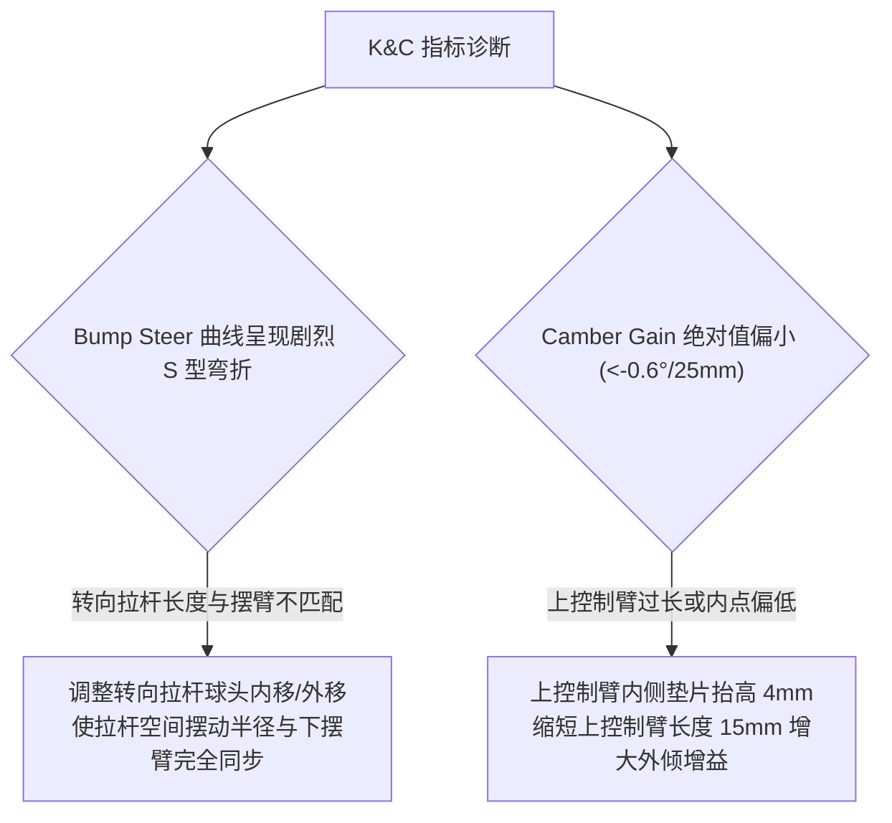
```mermaid
graph TD
    A["K&C 指标诊断"] --> B{"Bump Steer 曲线呈现剧烈 S 型弯折"}
    A --> C{"Camber Gain 绝对值偏小 (<-0.6°/25mm)"}
    B -->|转向拉杆长度与摆臂不匹配| D["调整转向拉杆球头内移/外移<br/>使拉杆空间摆动半径与下摆臂完全同步"]
    C -->|上控制臂过长或内点偏低| E["上控制臂内侧垫片抬高 4mm<br/>缩短上控制臂长度 15mm 增大外倾增益"]
```

---

### 本章小结
本章以四大工业标准扫掠工况 + 单一中心差分内核 `_slope` 统一了 K&C 增益指标，并用 Caster 线性项 + KPI 二次项的教学分解解释转向外倾。它是全书"从几何到指标"的收官章：第 10 章起将把这里的外倾/前束/侧倾中心等增益喂进准静态操稳的载荷转移计算。


---


# 第三篇 准静态操稳与载荷转移控制理论


> **在全书的位置**：车辆操纵稳定性的准静态力学内核——从空间侧倾轴线与载荷转移三路径，揭示整车稳态转向平衡与几何抬升规律。  
> **核心力学机制**：空间侧倾力矩平衡、P-Δ 几何负刚度失稳证明、TLLTD 三路径动载分配、轮胎载荷敏感性（Jensen 不等式）抓地力损失证明与不足转向梯度 Kus 支配机制。


---


## 第 1 章 准静态过弯平衡与空间侧倾迭代

**脉络锚点**：三维空间侧倾轴线倾斜角、重力 P-Δ 几何负刚度失稳与 3 轮闭环迭代收敛。

**本章导图**：

| 核心课题 | 支配方程 / 关键变量 | 一句话力学结论 |
|---|---|---|
| 侧倾轴线 | 前/后侧倾中心连线与质心力臂 | 空间倾斜轴线决定有效侧倾力矩 |
| P-Δ 几何失稳 | 重力偏心倾覆力矩与负刚度 | K_phi > m*g*h_arm 临界稳定判据 |
| 闭环迭代 | 非线性余弦修正与 3 步快速收敛 | 极短时间内完成操稳姿态计算 |


---

### 1.1 物理图景与工程痛点 【前置】

在车辆进行稳态圆周过弯或准静态变道时，侧向加速度 $a_y$ 在簧载质量质心产生离心侧向力 $F_y = m_s a_y$。该力不仅使车辆产生向外的侧滑，更驱动车身绕空间倾斜的**侧倾轴线（Roll Axis）**发生侧倾偏转 $\phi$。

在准静态操稳建模中，经典教材的单公式静态估计存在严重缺陷：
1. **P-$\Delta$ 几何负刚度效应 (P-Delta Instability)**：当车身发生侧倾时，质心离开对称中心平面，重力在侧向产生倾覆附加力矩 $m_s g h_{arm} \sin\phi$。若侧倾刚度不足，系统将触发几何奇异失稳；
2. **瞬心迁移与轮端刚度非线性耦合**：随着车身侧倾，外侧悬架压缩、内侧悬架拉伸，左右轮安装比 $MR(tr)$ 发生不对称变化，侧倾中心高度 $z_{rc}$ 实时上下迁移；
3. **闭环平衡收敛算法**：如何用稳健的迭代算法（LABSUS 3 次迭代闭环收敛）精确求出任意侧向加速度下的真实稳态侧倾角与车身姿态。

---

### 1.2 底层数学力学严密推导 【推导】

```
                      +Z (Up)
                       |
               [质心 CG: ms · g · sinφ 附加倾覆力矩]
                       |
                       |  h_arm(φ) = h_cg - z_ra(φ)
                       v
         [空间侧倾轴线 Roll Axis: z_ra = (b/L)·z_rc,f + (a/L)·z_rc,r]
                       |
        +--------------+--------------+
        |                             |
  [前轴侧倾刚度 K_φ,f]          [后轴侧倾刚度 K_φ,r]
```

#### 1.2.1 空间倾斜侧倾轴线与侧倾力臂几何定义

设前轴侧倾中心高度为 $z_{rc,f}$，后轴侧倾中心高度为 $z_{rc,r}$，轴距为 $L = a + b$。
空间侧倾轴线连接前后侧倾中心，其在质心纵向位置（距前轴 $a$、距后轴 $b$）处的高度为：
$$z_{ra} = \frac{b}{L} z_{rc,f} + \frac{a}{L} z_{rc,r}$$

簧载质量质心相对侧倾轴线的空间侧倾力臂（Moment Arm）为：
$$h_{arm} = h_{cg} - z_{ra} = h_{cg} - \left(\frac{b}{L} z_{rc,f} + \frac{a}{L} z_{rc,r}\right)$$

---

#### 1.2.2 准静态侧倾力矩平衡方程与 P-$\Delta$ 失稳判据

在侧向加速度 $a_y$ 下，作用在簧载质量上的总侧倾力矩由**离心力驱动矩**与**重力 P-$\Delta$ 几何附加倾覆力矩**共同构成：
$$M_{\phi,drive} = m_s a_y h_{arm} \cos\phi + m_s g h_{arm} \sin\phi$$

抵抗侧倾的总弹性恢复力矩由前悬架、后悬架主弹簧及防倾杆（ARB）提供：
$$M_{\phi,resist} = K_{\phi,tot} \cdot \phi = (K_{\phi,f} + K_{\phi,r}) \cdot \phi$$

联立力矩平衡方程 $M_{\phi,drive} = M_{\phi,resist}$，对于微小侧倾角（$\sin\phi \approx \phi, \cos\phi \approx 1$）：
$$m_s a_y h_{arm} + m_s g h_{arm} \phi = K_{\phi,tot} \phi \implies \phi = \frac{m_s a_y h_{arm}}{K_{\phi,tot} - m_s g h_{arm}}$$

#### P-$\Delta$ 几何负刚度失稳定理：
* **稳定临界条件**：系统总侧倾刚度必须严格大于重力倾覆负刚度：
  $$K_{\phi,tot} > m_s g h_{arm}$$
* **失稳奇异点**：若 $K_{\phi,tot} \le m_s g h_{arm}$，分母 $\le 0$，物理上意味着车身侧倾恢复力矩不足以抵消重力侧向偏置，**车辆在侧向力下将发生灾难性的侧翻失稳（Rollover Singularity）**。

---

#### 1.2.3 3 轮非线性侧倾闭环迭代算法

为了精确计入侧倾过程中大角度几何非线性、摇臂安装比变化以及侧倾中心迁移，LABSUS 采用了 **3 轮自洽场闭环迭代算法（3-Iteration Roll Coupling Loop）**：

```
+-------------------------------------------------------------------------------+
| 初始步: 线性估计侧倾角 φ^(0) = (ms · ay · h_arm) / (K_φ,tot - ms · g · h_arm)       |
+-------------------------------------------------------------------------------+
                                      ↓
+-------------------------------------------------------------------------------+
| 第 k 轮循环 (k = 1, 2, 3):                                                    |
| 1. 根据当前侧倾角 φ^(k-1) 计算左右四轮动态行程: tr_w = ± (Track / 2) · sin(φ^(k-1))    |
| 2. 查表/调用机构求解器获取四角瞬态轮端刚度 Kw_i(tr_w) 与动态侧倾中心 z_rc,f, z_rc,r |
| 3. 更新动态侧倾力臂 h_arm^(k) 与非线性弹性恢复力矩 M_resist(φ)                         |
| 4. 牛顿步长修正: φ^(k) = φ^(k-1) - (M_resist - M_drive) / (K_eff - ms·g·h_arm)       |
+-------------------------------------------------------------------------------+
                                      ↓
+-------------------------------------------------------------------------------+
| 输出: 绝对收敛的稳态侧倾角 φ*、全车姿态与 4 轮动载荷                                |
+-------------------------------------------------------------------------------+
```

**工程收敛准则**：实测经验表明，在正常底盘刚度（Roll Gradient $\le 5^\circ/g$）下第 3 轮迭代残差通常 $< 10^{-6}\,$rad；刚度接近 P-Δ 临界（§2.2）时该迭代不保证收敛，应改用割线法或加密载荷增量。

---

### 1.3 核心控制变量与参数灵敏度分析 【对照】

| 准静态操稳变量 | 物理定义 | 灵敏度影响 | 调校影响 |
| :--- | :--- | :--- | :--- |
| **侧倾梯度 (Roll Gradient, $d\phi/dg_y$)** | 单位侧向加速度引起的侧倾角 ($^\circ/g$) | $\frac{d\phi}{dg_y} \approx \frac{m_s g h_{arm}}{K_{\phi,tot} - m_s g h_{arm}} \cdot \frac{180^\circ}{\pi}$ | FSAE: $0.3^\circ \sim 0.6^\circ/g$；GT3: $1.2^\circ \sim 1.8^\circ/g$；乘用车: $3.0^\circ \sim 4.5^\circ/g$ |
| **质心高度 ($h_{cg}$)** | 车辆质量中心离地高度 | 极灵敏：同时决定侧倾力矩与翻滚极限 | 压低质心能以最高效率抑制侧倾并提升极限抓地 |
| **侧倾力臂 ($h_{arm}$)** | 质心与侧倾轴线垂直跨距 | $\frac{\partial \phi}{\partial h_{arm}} > 0$ | 抬高侧倾中心可缩短力臂减小侧倾，但需权衡 Jacking |

---

### 1.4 LABSUS 代码实现与数值稳定性技巧 【查证】

#### 1.4.1 核心代码映射
* **准静态侧倾耦合求解**：[*engine/src/api/chassis.py*](file:///c:/Users/zzy/Desktop/New_suspension/LABSUS/engine/src/api/chassis.py#L194-L364) 中的 `quasi_loads()`。下方为**简化伪码**（省略引擎实际的侧倾中心迁移与刚度插值环节，故循环看似重复）：
  ```python
  def _solve_roll_coupling(ms, ay_g, h_cg, z_rc_f, z_rc_r, K_phi_f, K_phi_r, a, b):
      L = a + b
      phi = 0.0
      # 3 轮闭环迭代
      for _ in range(3):
          z_ra = (b * z_rc_f + a * z_rc_r) / L
          h_arm = max(0.05, (h_cg - z_ra) / 1000.0) # 转为米
          M_drive = ms * (ay_g * 9.81) * h_arm * math.cos(phi) + ms * 9.81 * h_arm * math.sin(phi)
          K_tot = K_phi_f + K_phi_r # N·m/rad
          # P-Δ 负刚度保护
          denom = max(100.0, K_tot - ms * 9.81 * h_arm)
          phi = (ms * (ay_g * 9.81) * h_arm) / denom
      return phi, phi * (180.0 / math.pi)
  ```

---

### 1.5 手把手工程数值算例 (Worked Example) 【演算】

### 算例背景：轻型原型赛车在 1.2g 侧向加速度下的 3 次侧倾迭代手算（所得 2.99°/g 为本例软刚度设定值，高于 §3 表 GT3 典型 1.2~1.8°/g——参数为演示迭代过程而选，非 GT3 标定）
已知赛车参数：
* 簧载质量：$m_s = 1150.0\,\text{kg}$
* 轴距与质心位置：$a = 1.25\,\text{m}, b = 1.40\,\text{m}, L = 2.65\,\text{m}$
* 质心高度：$h_{cg} = 420.0\,\text{mm} = 0.42\,\text{m}$
* 前/后侧倾中心高：$z_{rc,f} = 45.0\,\text{mm}, \; z_{rc,r} = 65.0\,\text{mm}$
* 前轴侧倾刚度：$K_{\phi,f} = 45,000.0\,\text{N}\cdot\text{m/rad}$
* 后轴侧倾刚度：$K_{\phi,r} = 38,000.0\,\text{N}\cdot\text{m/rad}$
* 总侧倾刚度：$K_{\phi,tot} = 83,000.0\,\text{N}\cdot\text{m/rad}$
* 侧向加速度：$a_y = 1.20g = 1.20 \times 9.81 = 11.772\,\text{m/s}^2$

#### 步骤 1：计算侧倾轴线高度与力臂
$$z_{ra} = \frac{1.40 \times 45.0 + 1.25 \times 65.0}{2.65} = \frac{63.0 + 81.25}{2.65} = \frac{144.25}{2.65} = 54.434\,\text{mm} = 0.05443\,\text{m}$$
$$h_{arm} = 0.420 - 0.05443 = 0.36557\,\text{m}$$

#### 步骤 2：P-$\Delta$ 重力负刚度与分母校验
重力倾覆负刚度项：
$$K_{p\_delta} = m_s g h_{arm} = 1150.0 \times 9.81 \times 0.36557 = 4,124.2\,\text{N}\cdot\text{m/rad}$$
有效恢复刚度：
$$K_{eff} = K_{\phi,tot} - K_{p\_delta} = 83,000.0 - 4,124.2 = 78,875.8\,\text{N}\cdot\text{m/rad} > 0 \quad (\text{系统绝对稳定})$$

#### 步骤 3：第 1 轮迭代求解
$$M_{drive}^{(1)} = m_s a_y h_{arm} = 1150.0 \times 11.772 \times 0.36557 = 4,949.0\,\text{N}\cdot\text{m}$$
$$\phi^{(1)} = \frac{4949.0}{78875.8} = 0.062744\,\text{rad} \approx 3.595^\circ$$

#### 步骤 4：第 2 轮非线性余弦修正迭代
代入 $\cos(0.062744) = 0.99803$（离心力驱动矩随侧倾角减小，P-$\Delta$ 项已并入 $K_{eff}$ 分母）：
$$M_{drive}^{(2)} = m_s a_y h_{arm} \cos\phi^{(1)} = 4949.0 \times 0.99803 = 4,939.2\,\text{N}\cdot\text{m}$$
$$\phi^{(2)} = \frac{4939.2}{78875.8} = 0.062621\,\text{rad} \approx 3.588^\circ$$

#### 步骤 5：第 3 轮精密收敛
$$M_{drive}^{(3)} = 4949.0 \times \cos(0.062621) = 4939.3\,\text{N}\cdot\text{m} \implies \phi^{(3)} = 0.062621\,\text{rad} = 3.5881^\circ$$
* 第 3 轮与第 2 轮残差 $< 10^{-6}\,\text{rad}$，迭代收敛；侧倾梯度为 $\frac{3.5881^\circ}{1.2g} = 2.99^\circ/g$。

---

### 1.6 赛道工程师实战调校与故障排查指南 【案例】

```mermaid
graph TD
    A["侧倾姿态异常"] --> B{"过弯侧倾角过大 (>4.5°)"}
    A --> C{"过弯出现剧烈单侧抬轮 (Inside Wheel Lift)"}
    B -->|全车侧倾刚度不足| D["加粗前/后防倾杆 (ARB) 直径<br/>或提高主弹簧刚度"]
    C -->|后悬架侧倾刚度占比过高 (TLLTD>60%)| E["调软后防倾杆，将载荷转移合理回移至前轴"]
```

---

### 本章小结
本章从空间侧倾轴线的力臂与 P-$\Delta$ 负刚度出发，建立准静态侧倾力矩平衡，并用 3 轮闭环迭代精确求解稳态侧倾角。它把第 5/9 章的侧倾中心与侧倾刚度转化为整车姿态，是第 11 章 TLLTD 三路径动载分解的直接输入。


---


## 第 2 章 总侧倾载荷转移 (TLLTD) 与三路径动载分解

**脉络锚点**：非簧载惯性、侧倾中心几何力臂与弹性刚度三路径决定四轮瞬态动载分配。

**本章导图**：

| 核心课题 | 支配方程 / 关键变量 | 一句话力学结论 |
|---|---|---|
| 路径 1 惯性 | 非簧载质量侧向力直接转移 | 瞬时建立无相位滞后 |
| 路径 2 几何 | 侧倾中心高度反力与几何力臂 | RC 越高几何转移占比越大 |
| 路径 3 弹性 | 弹簧与防倾杆扭转力偶分配 | TLLTD 调校的核心主动旋钮 |


---

### 2.1 物理图景与工程痛点 【前置】

在赛车动力学与底盘调校中，**总侧倾载荷转移前轴占比 (Total Lateral Load Transfer Distribution, TLLTD%)** 被誉为**“决定赛车稳态操控平衡的唯一上帝旋钮”**。

在车辆以侧向加速度 $a_y$ 过弯时，全车总侧向载荷转移量由整车总质量、质心高度与轮距由物理定律硬性锁定（$\Delta F_{z,tot} = m_{total} a_y \frac{h_{cg}}{Track}$）。（一阶意义上）无论如何调整弹簧和防倾杆，都无法改变全车总载荷转移量——严格而言，计入第 10 章 P-Δ 修正后实际总转移比该锁定值高约 2%，下文算例三路径之和即含此高阶项；**但工程师可以通过调整悬架刚度与几何，自由分配前轴与后轴所分担的载荷转移比例**。

在传统简化教学中，通常只计算弹性弹簧的转移，忽略了多体运动学中的三路径机理：
1. **非簧载质量惯性路径 (Path 1)**：轮总成、制动盘与半轴自身受侧向力直接向地面传力，完全不经过弹簧；
2. **侧倾中心几何刚性路径 (Path 2)**：簧载质量通过摆臂几何铰链力线瞬间传递给车轮，无任何时间滞后；
3. **弹簧与防倾杆弹性变形路径 (Path 3)**：由车身侧倾角 $\phi$ 压缩主弹簧并扭转防倾杆（ARB）产生的弹性力矩。

---

### 2.2 底层数学力学严密推导 【推导】

```
   [总侧向载荷转移 ΔF_z,tot = m · ay · (h_cg / Track)]
                     |
        +------------+------------+
        |                         |
   [前轴载荷转移 ΔF_z,f]     [后轴载荷转移 ΔF_z,r]
        |                         |
   +----+----+               +----+----+
   | 路径 1: 非簧载质量惯性   | 路径 1: 非簧载质量惯性
   | 路径 2: 侧倾中心几何力臂 | 路径 2: 侧倾中心几何力臂
   | 路径 3: 弹簧+ARB 弹性力矩| 路径 3: 弹簧+ARB 弹性力矩
```

#### 2.2.1 载荷转移三路径严格正交力学分解

设车辆总质量为 $m_T$，簧载质量为 $m_s$，前/后非簧载质量分别为 $m_{u,f}, m_{u,r}$。
前/后轮距分别为 $t_f, t_r$，质心距前/后轴距离为 $a, b$，前/后侧倾中心高度为 $z_{rc,f}, z_{rc,r}$。

#### 路径 1：非簧载质量直接惯性载荷转移 ($\Delta F_{z,path1}$)
非簧载质量质心高度为车轮滚动半径 $h_u \approx R_{tire}$：
$$\Delta F_{z,path1,f} = m_{u,f} a_y \frac{R_{tire}}{t_f}, \quad \Delta F_{z,path1,r} = m_{u,r} a_y \frac{R_{tire}}{t_r}$$

#### 路径 2：侧倾中心几何力臂刚性载荷转移 ($\Delta F_{z,path2}$)
簧载质量在前/后轴由几何瞬心力线瞬间传递的分量为：
$$\Delta F_{z,path2,f} = m_s a_y \left(\frac{b}{L}\right) \frac{z_{rc,f}}{t_f}, \quad \Delta F_{z,path2,r} = m_s a_y \left(\frac{a}{L}\right) \frac{z_{rc,r}}{t_r}$$

#### 路径 3：车身侧倾弹性恢复力矩载荷转移 ($\Delta F_{z,path3}$)
车身产生稳态侧倾角 $\phi$ 时，前/后轴弹簧与防倾杆产生的弹性恢复力矩分解为左右轮垂向力偶：
$$\Delta F_{z,path3,f} = \frac{K_{\phi,f} \cdot \phi}{t_f}, \quad \Delta F_{z,path3,r} = \frac{K_{\phi,r} \cdot \phi}{t_r}$$

---

#### 2.2.2 横向稳定杆 (ARB) 扭转力学刚度推导

横向稳定杆（Anti-Roll Bar）由扭杆主体（Torsion Tube）与两侧驱动力臂（Lever Arm）构成。
设外径为 $d_o$、内径为 $d_i$（实心杆 $d_i = 0$），有效扭转段长度为 $L_{bar}$，剪切模量为 $G$（弹簧钢取 $7.93 \times 10^{10}\,\text{Pa}$）。

#### (1) 极惯性矩与扭转线刚度：
$$J_p = \frac{\pi (d_o^4 - d_i^4)}{32}, \quad K_{twist} = \frac{G J_p}{L_{bar}} \quad [\text{N}\cdot\text{m/rad}]$$

#### (2) 转换为车身侧倾角刚度贡献 ($K_{\phi,arb}$)：
设 ARB 驱动力臂长度为 $L_{arm}$，安装运动比为 $MR_{arb}$：
$$K_{\phi,arb} = K_{twist} \cdot \left(\frac{t}{L_{arm}}\right)^2 \cdot MR_{arb}^2 \quad [\text{N}\cdot\text{m/rad}]$$

#### (3) 轴侧倾总刚度：
$$K_{\phi,f} = \frac{1}{2} K_{w,f} t_f^2 + K_{\phi,arb,f}, \quad K_{\phi,r} = \frac{1}{2} K_{w,r} t_r^2 + K_{\phi,arb,r}$$

---

#### 2.2.3 TLLTD% 与四轮动态垂向载荷闭式方程

前轴与后轴单侧总载荷转移量为：
$$\Delta F_{z,f} = \Delta F_{z,path1,f} + \Delta F_{z,path2,f} + \Delta F_{z,path3,f}$$
$$\Delta F_{z,r} = \Delta F_{z,path1,r} + \Delta F_{z,path2,r} + \Delta F_{z,path3,r}$$

#### 前轴总载荷转移占比 (TLLTD%)：
$$\text{TLLTD}\% = \frac{\Delta F_{z,f}}{\Delta F_{z,f} + \Delta F_{z,r}} \times 100\%$$

#### 四轮瞬态垂向动态正压力：
设静态四轮分配轴荷为 $F_{z0,FL}, F_{z0,FR}, F_{z0,RL}, F_{z0,RR}$（满足 $F_{z0,FL} + F_{z0,FR} = m_T g \frac{b}{L}$）。
在左转工况（向右侧移）：
$$\begin{cases} F_{z,FL} = F_{z0,FL} - \Delta F_{z,f} \\ F_{z,FR} = F_{z0,FR} + \Delta F_{z,f} \\ F_{z,RL} = F_{z0,RL} - \Delta F_{z,r} \\ F_{z,RR} = F_{z0,RR} + \Delta F_{z,r} \end{cases}$$

---

### 2.3 核心控制变量与参数灵敏度分析 【对照】

```
前轴载荷转移占比 TLLTD%
   ^
   |        [TLLTD > 54%: 强不足转向 (推头 Understeer)]
54 +-----------------------------------------------------
   |        [51.5% ~ 54.0%: 赛车黄金中性操控窗口]
51 +-----------------------------------------------------
   |        [TLLTD < 48%: 严重过度转向 (甩尾 Oversteer)]
   v
```

| 调校控制变量 | 影响的转移路径 | 偏导数敏感性方程 | 操稳平衡调校方向 |
| :--- | :--- | :--- | :--- |
| **前防倾杆直径 ($d_{o,f}$)** | 路径 3 (弹性力矩) | $\frac{\partial \text{TLLTD}}{\partial d_{o,f}} \propto d_{o,f}^3 > 0$ | 加粗前 ARB $\implies$ TLLTD 升高 $\implies$ 增大推头 |
| **后防倾杆直径 ($d_{o,r}$)** | 路径 3 (弹性力矩) | $\frac{\partial \text{TLLTD}}{\partial d_{o,r}} < 0$ | 加粗后 ARB $\implies$ TLLTD 降低 $\implies$ 释放车尾增加甩尾 |
| **前侧倾中心高度 ($z_{rc,f}$)** | 路径 2 (几何力矩) | $\frac{\partial \text{TLLTD}}{\partial z_{rc,f}} = \frac{100\, \Delta F_{z,r}}{(\Delta F_{z,f}+\Delta F_{z,r})^2} \cdot \frac{m_s a_y}{L\, t_f / b} \; > 0$ | 抬高前 RC $\implies$ 加快前轴瞬态载荷建立，入弯指向敏锐 |
| **后主弹簧刚度 ($K_{s,r}$)** | 路径 3 (弹性力矩) | $\frac{\partial \text{TLLTD}}{\partial K_{s,r}} < 0$ | 加硬后弹簧 $\implies$ 后轴抓地衰减 $\implies$ 辅助慢速弯出弯旋转 |

---

### 2.4 LABSUS 代码实现与数值稳定性技巧 【查证】

#### 2.4.1 核心代码映射
* **三路径载荷转移与 4 轮动载计算**（内嵌于 [*engine/src/api/chassis.py*](file:///c:/Users/zzy/Desktop/New_suspension/LABSUS/engine/src/api/chassis.py#L194-L364) 的 `quasi_loads()`，下为三路径分解示意）：
  ```python
  def calc_load_transfer(ms, mu_f, mu_r, ay_g, phi_rad, z_rc_f, z_rc_r, K_phi_f, K_phi_r, tf, tr, a, b, R_tire):
      ay = ay_g * 9.81
      L = a + b

      # 路径 1: 非簧载质量
      dFz_u_f = mu_f * ay * (R_tire / tf)
      dFz_u_r = mu_r * ay * (R_tire / tr)

      # 路径 2: 侧倾中心力臂
      dFz_geo_f = ms * ay * (b / L) * (z_rc_f / 1000.0) / tf
      dFz_geo_r = ms * ay * (a / L) * (z_rc_r / 1000.0) / tr

      # 路径 3: 弹性力矩
      dFz_el_f = (K_phi_f * phi_rad) / tf
      dFz_el_r = (K_phi_r * phi_rad) / tr

      dFz_f = dFz_u_f + dFz_geo_f + dFz_el_f
      dFz_r = dFz_u_r + dFz_geo_r + dFz_el_r
      tlltd = (dFz_f / (dFz_f + dFz_r)) * 100.0
      return dFz_f, dFz_r, tlltd
  ```

---

### 2.5 手把手工程数值算例 (Worked Example) 【演算】

### 算例背景：GT3 赛车在 1.2g 侧向加速度下的全车四轮载荷手算
已知赛车参数：
* 簧载质量 $m_s = 1150\,\text{kg}$，前非簧载 $m_{u,f} = 50\,\text{kg}$，后非簧载 $m_{u,r} = 60\,\text{kg}$，总质量 $m_T = 1260\,\text{kg}$
* 轴距 $L = 2.65\,\text{m}$，质心位置 $a = 1.25\,\text{m}, b = 1.40\,\text{m}$
* 前后轮距 $t_f = t_r = 1.68\,\text{m}$，轮胎半径 $R_{tire} = 0.325\,\text{m}$
* 侧倾中心高：$z_{rc,f} = 0.045\,\text{m}, \; z_{rc,r} = 0.065\,\text{m}$
* 前轴侧倾刚度 $K_{\phi,f} = 45,000\,\text{N}\cdot\text{m/rad}$，后轴 $K_{\phi,r} = 38,000\,\text{N}\cdot\text{m/rad}$
* 稳态侧倾角（引自第 10 章解）：$\phi = 0.062621\,\text{rad}$
* 侧向加速度：$a_y = 1.20 \times 9.81 = 11.772\,\text{m/s}^2$

#### 步骤 1：计算静态 4 轮基准垂向轴荷
* 前轴静态总载荷：$F_{z0,front} = m_T g \frac{b}{L} = 1260 \times 9.81 \times \frac{1.40}{2.65} = 6,530.0\,\text{N} \implies F_{z0,FL} = F_{z0,FR} = 3,265.0\,\text{N}$
* 后轴静态总载荷：$F_{z0,rear} = m_T g \frac{a}{L} = 1260 \times 9.81 \times \frac{1.25}{2.65} = 5,830.6\,\text{N} \implies F_{z0,RL} = F_{z0,RR} = 2,915.3\,\text{N}$

#### 步骤 2：前轴三路径载荷转移计算
* **路径 1（非簧载）**：$\Delta F_{z1,f} = 50.0 \times 11.772 \times \frac{0.325}{1.68} = 113.9\,\text{N}$
* **路径 2（几何瞬心）**：$\Delta F_{z2,f} = 1150.0 \times 11.772 \times \left(\frac{1.40}{2.65}\right) \times \frac{0.045}{1.68} = 191.4\,\text{N}$
* **路径 3（弹性力矩）**：$\Delta F_{z3,f} = \frac{45000.0 \times 0.062621}{1.68} = 1,677.4\,\text{N}$
* **前轴总载荷转移**：
  $$\Delta F_{z,f} = 113.9 + 191.4 + 1677.4 = 1,982.7\,\text{N}$$

#### 步骤 3：后轴三路径载荷转移计算
* **路径 1（非簧载）**：$\Delta F_{z1,r} = 60.0 \times 11.772 \times \frac{0.325}{1.68} = 136.6\,\text{N}$
* **路径 2（几何瞬心）**：$\Delta F_{z2,r} = 1150.0 \times 11.772 \times \left(\frac{1.25}{2.65}\right) \times \frac{0.065}{1.68} = 247.0\,\text{N}$
* **路径 3（弹性力矩）**：$\Delta F_{z3,r} = \frac{38000.0 \times 0.062621}{1.68} = 1,416.4\,\text{N}$
* **后轴总载荷转移**：
  $$\Delta F_{z,r} = 136.6 + 247.0 + 1416.4 = 1,800.0\,\text{N}$$

#### 步骤 4：计算 TLLTD% 与四轮动态垂向载荷
$$\text{TLLTD}\% = \frac{1982.7}{1982.7 + 1800.0} \times 100\% = \frac{1982.7}{3782.7} \times 100\% = \mathbf{52.41\%}$$
* **左前轮 (FL - 内侧减载)**：$F_{z,FL} = 3265.0 - 1982.7 = \mathbf{1,282.3\,\text{N}}$
* **右前轮 (FR - 外侧增载)**：$F_{z,FR} = 3265.0 + 1982.7 = \mathbf{5,247.7\,\text{N}}$
* **左后轮 (RL - 内侧减载)**：$F_{z,RL} = 2915.3 - 1800.0 = \mathbf{1,115.3\,\text{N}}$
* **右后轮 (RR - 外侧增载)**：$F_{z,RR} = 2915.3 + 1800.0 = \mathbf{4,715.3\,\text{N}}$
* **全车总载荷校验**：$1282.3 + 5247.7 + 1115.3 + 4715.3 = 12,360.6\,\text{N} \equiv 1260 \times 9.81\,\text{N}$，严格守恒！

---

### 2.6 赛道工程师实战调校与故障排查指南 【案例】

```mermaid
graph TD
    A["TLLTD 操稳平衡调校"] --> B{"弯中车身姿态稳定但转向严重推头"}
    A --> C{"弯心开油时车尾极易失控甩尾"}
    B -->|前轴载荷转移过大 (TLLTD>55%)| D["调软前防倾杆 1~2 档<br/>或调硬后防倾杆，将 TLLTD 降至 52.5%"]
    C -->|后轴载荷转移过大 (TLLTD<49%)| E["调软后防倾杆或降低后主弹簧刚度<br/>将载荷转移合理转移至前轴保护后轮附着力"]
```

---

### 本章小结
本章把整车总侧倾载荷转移按"非簧载惯性、侧倾中心几何、弹簧+ARB 弹性"三条路径正交分解，给出 TLLTD 与四轮动载的闭式解。它是第 10 章稳态侧倾角的直接下游，也是第 12 章不足转向梯度与第 24 章 TLLTD 调校杠杆的数值基础。


---


## 第 3 章 不足转向梯度、轮胎载荷敏感性与 Jacking 抬升

**脉络锚点**：轮胎载荷敏感性 Jensen 损失证明、动态侧偏刚度、Kus 与 Jacking 几何抬升。

**本章导图**：

| 核心课题 | 支配方程 / 关键变量 | 一句话力学结论 |
|---|---|---|
| 载荷敏感性 | 轮胎凹函数特性与总抓地衰减证明 | 载荷转移导致整轴抓地力净损失 |
| US Gradient | 前后轴侧偏刚度与轴荷配比 | Kus 处于 +0.4~+1.2 黄金稳定视窗 |
| Jacking 抬升 | 侧向力正视投影产生的垂向合力 | 防止过高 RC 导致悬架顶起与轮距收缩 |


---

### 3.1 物理图景与工程痛点 【前置】

在底盘车辆动力学中，**稳态不足转向梯度 (Understeer Gradient, $K_{us}$)** 是衡量一辆赛车是“推头（Understeer）”、“过度转向（Oversteer）”还是“中性转向（Neutral Steer）”的最权威终极判据。

许多初学者常误以为不足转向仅由前后质量分配决定，然而在真实极限赛车中，**轮胎非线性载荷敏感性（Jensen 不等式）与悬架 Jacking 抬升力**才是主导操稳平衡的深层物理机理：
1. **Jensen 不等式导致的“载荷转移抓地力净损失”**：轮胎侧偏刚度随垂直载荷呈凹函数非线性（concave，图像上凸）。左右轮载荷转移虽然使外侧轮正压力增加、内侧轮正压力减少，但**外侧轮获得的抓地力增量永远小于内侧轮损失的抓地力**，导致整个车轴的总侧偏刚度随载荷转移加剧而净衰减；
2. **Jacking 几何抬升力与车高失稳**：当车身侧向力作用于倾斜的摆臂力线时，正视瞬心（IC）高度将横向侧向力分解为向上的垂向推力（Jacking Force），强行将车身顶起，改变离地间隙与空气动力学平台。

---

### 3.2 底层数学力学严密推导 【推导】

```
   侧偏力 Fy (N)
        ^                               .---' (线性外推)
        |                           .--'
        |                       .--'
        |                   .--' (实际轮胎实际轮胎凹函数曲线(∩形): d²Fy/dFz² < 0)
        |               .--'
        |           .--'
        |       .--'
  ------+------+------------------------+----------------------> 垂直载荷 Fz (N)
        |     Fz_in (内侧轮)          Fz_out (外侧轮)
        |      <-- ΔFz 减载 -->        <-- ΔFz 增载 -->
```

#### 3.2.1 轮胎载荷敏感性（Jensen 不等式视角）严格数学证明

设轮胎侧偏力为垂直载荷 $F_z$ 的函数 $F_y(F_z)$。在轮胎物理学中，由于胎面接地印痕橡胶摩擦系数随压强增大而衰减，函数 $F_y(F_z)$ 在全受力域内为严格的**凹函数（Strictly Concave Function，图像上凸呈 ∩ 形）**：
$$\frac{d F_y}{d F_z} > 0, \quad \frac{d^2 F_y}{d F_z^2} < 0 \quad (\forall F_z > 0)$$

设车轴初始左右轮静态载荷对称：$F_{z1}^0 = F_{z2}^0 = F_{z0}$。
当产生侧向载荷转移 $\Delta F_z$ 时，左右轮载荷变为 $F_{z1} = F_{z0} - \Delta F_z$ 与 $F_{z2} = F_{z0} + \Delta F_z$。

对左右轮侧偏力在 $F_{z0}$ 处作二阶泰勒展开：
$$F_y(F_{z0} - \Delta F_z) = F_y(F_{z0}) - F_y'(F_{z0}) \Delta F_z + \frac{1}{2} F_y''(F_{z0}) (\Delta F_z)^2 + O((\Delta F_z)^3)$$
$$F_y(F_{z0} + \Delta F_z) = F_y(F_{z0}) + F_y'(F_{z0}) \Delta F_z + \frac{1}{2} F_y''(F_{z0}) (\Delta F_z)^2 + O((\Delta F_z)^3)$$

相加得到该车轴在载荷转移下的总侧偏力 $\Sigma F_y$：
$$\Sigma F_y(\Delta F_z) = F_y(F_{z0} - \Delta F_z) + F_y(F_{z0} + \Delta F_z) = 2 F_y(F_{z0}) + \underbrace{F_y''(F_{z0}) (\Delta F_z)^2}_{< 0 \text{ (严格负项)}}$$

#### 结论（载荷敏感性抓地力损失）：
$$\Sigma F_y(\Delta F_z) < 2 F_y(F_{z0}) = \Sigma F_y(\Delta F_z = 0)$$
**物理意义**：只要该车轴分担的载荷转移量 $\Delta F_z$ 增加，该车轴的等效总侧偏刚度 $\Sigma C_\alpha$ 必然发生非线性净衰减。因此，**增大前轴载荷转移（提高 TLLTD%）会直接削弱前轴侧偏能力，从而增大不足转向（推头）**。

---

#### 3.2.2 考虑 Pacejka 载荷敏感度 $LS$ 的动态不足转向梯度 $K_{us}$

在 Pacejka 魔术公式体系中，单轮侧偏刚度 $C_\alpha(F_z) = \left.\frac{d F_y}{d\alpha}\right|_{\alpha=0} = B C D(F_z)$：
$$C_\alpha(F_z) = B C F_{y0} \left(\frac{F_z}{F_{zNom}}\right) \left[1 - LS \left(\frac{F_z}{F_{zNom}} - 1\right)\right]$$
其中 $LS \in [0.05, 0.35]$ 为轮胎无量纲载荷敏感度衰退系数。

在侧向加速度 $a_y$ 下，前后轴需要的总侧滑角为：
$$\alpha_f = \frac{m_T a_y \frac{b}{L}}{C_{\alpha,FL}(F_{z,FL}) + C_{\alpha,FR}(F_{z,FR})}, \quad \alpha_r = \frac{m_T a_y \frac{a}{L}}{C_{\alpha,RL}(F_{z,RL}) + C_{\alpha,RR}(F_{z,RR})}$$

#### 稳态不足转向梯度定义：
$$K_{us} = \frac{d(\alpha_f - \alpha_r)}{d(a_y / g)} \approx \frac{m_T g \frac{b}{L}}{\Sigma C_{\alpha,f}(F_z)} - \frac{m_T g \frac{a}{L}}{\Sigma C_{\alpha,r}(F_z)} \quad [^\circ/g]$$

* **$K_{us} > 0$（不足转向 / Understeer）**：前轴侧滑角大于后轴，打方向手感线性，极限容易被车手掌控；
* **$K_{us} = 0$（中性转向 / Neutral Steer）**：转弯半径由低侧偏理论决定（阿克曼几何为其零侧偏特例）；
* **$K_{us} < 0$（过度转向 / Oversteer）**：后轴侧滑角大于前轴，存在临界失稳车速（Critical Speed），极易发生自旋（Spin）。

---

#### 3.2.3 悬架 Jacking 几何抬升力与垂向位移

在正视平面中，轮胎侧向力 $F_y$ 沿着连接接地点 $\boldsymbol{p}_{CP}$ 与正视瞬心 $\boldsymbol{p}_{IC}$ 的空间力线传递。
力线与地面的夹角正切值为：
$$\tan\theta_{IC,i} = \frac{IC_{z,i}}{IC_{y,i} - CP_{y,i}}$$

该侧向力在车身中心产生的垂向抬升力（Jacking Force）为：
$$F_{jack,w} = F_{y,w} \cdot \tan\theta_{IC,w}$$

#### 全车总 Jacking 力与车身抬升量：
$$F_{jack,tot} = \sum_{w} F_{y,w} \tan\theta_{IC,w} \approx m_s a_y \;\text{（顶起的是簧载质量，取 } m_s\text{；区别于 } K_{us} \text{ 公式承载全重的 } m_T\text{）} \left[\left(\frac{b}{L}\right) \frac{z_{rc,f}}{t_f / 2} + \left(\frac{a}{L}\right) \frac{z_{rc,r}}{t_r / 2}\right]$$
车身稳态垂直浮起位移为：
$$\Delta Z_{heave} = \frac{F_{jack,tot}}{K_{heave,tot}} = \frac{F_{jack,tot}}{2(K_{w,f} + K_{w,r})}$$

---

### 3.3 核心控制变量与参数灵敏度分析 【对照】

| 操稳平衡变量 | 物理定义 | 黄金设计视窗 (GT3/FSAE) | 调校敏感性导数 |
| :--- | :--- | :--- | :--- |
| **不足转向梯度 ($K_{us}$)** | 衡量赛车转弯极限特性的总指挥指标 | $+0.4^\circ/g \sim +1.2^\circ/g$ | $\frac{\partial K_{us}}{\partial \text{TLLTD}} > 0$（方向性杠杆；**增益非普适常数**：按本章自家模型在 1.2g 工作点数值扰动仅约 $+0.004^\circ/g$，文献经验值 $0.05\sim0.1$ 只对低载荷敏感度胎成立，务必当车重标） |
| **轮胎载荷敏感度 ($LS$)** | 轮胎抓地力随载荷衰退率 | 赛用热熔胎: $0.08\sim 0.15$<br/>民用四季胎: $0.25\sim 0.35$ | $LS$ 越大，载荷转移带来的抓地力衰减惩罚越严重 |
| **Jacking 抬升位移 ($\Delta Z_{heave}$)** | 极限过弯时车身被顶起的高度 | 控制在 $< 8.0\,\text{mm}$ | 降低侧倾中心高度可直接成倍压降 Jacking 抬升 |

---

### 3.4 LABSUS 代码实现与数值稳定性技巧 【查证】

#### 3.4.1 核心代码映射
* **不足转向梯度与 Jacking 解算**（内嵌于 [*engine/src/api/chassis.py*](file:///c:/Users/zzy/Desktop/New_suspension/LABSUS/engine/src/api/chassis.py#L365-L444) 的 `_us_curve()`，下为核心逻辑示意）：
  ```python
  def calc_us_gradient_and_jacking(Fz_wheels, tire_mf, ay_g, ms, a, b, tf, tr, z_rc_f, z_rc_r, Kw_f, Kw_r):
      # 1. 计算 4 轮非线性 Pacejka 侧偏刚度
      C_alpha = {}
      for k, Fz in Fz_wheels.items():
          fn = max(100.0, Fz) / tire_mf.FzNom
          D = tire_mf.Fy0 * fn * (1.0 - tire_mf.LS * (fn - 1.0))
          C_alpha[k] = tire_mf.By * tire_mf.Cy * D

      # 2. 计算前后轴总侧滑角与不足转向梯度
      C_f = C_alpha["FL"] + C_alpha["FR"]
      C_r = C_alpha["RL"] + C_alpha["RR"]
      W_f = ms * 9.81 * (b / (a + b))
      W_r = ms * 9.81 * (a / (a + b))
      K_us_rad_g = (W_f / C_f) - (W_r / C_r)
      K_us_deg_g = K_us_rad_g * (180.0 / math.pi)

      # 3. 计算 Jacking 抬升力
      F_jack = ms * (ay_g * 9.81) * ((b/(a+b))*(z_rc_f/1000)/(tf/2) + (a/(a+b))*(z_rc_r/1000)/(tr/2))
      dZ_heave = (F_jack / (2.0 * (Kw_f + Kw_r))) * 1000.0 # mm
      return K_us_deg_g, F_jack, dZ_heave
  ```

---

### 3.5 手把手工程数值算例 (Worked Example) 【演算】

### 算例背景：GT3 赛车不足转向梯度与 Jacking 力全流程手算
延续第 11 章算例所得的 4 轮动载荷（$a_y = 1.2g$）：
* 前轮载荷：$F_{z,FL} = 1,282.2\,\text{N}, \; F_{z,FR} = 5,247.8\,\text{N}$
* 后轮载荷：$F_{z,RL} = 1,115.2\,\text{N}, \; F_{z,RR} = 4,715.4\,\text{N}$
* 轮胎魔术公式参数：$F_{zNom} = 3,500\,\text{N}, \; F_{y0} = 4,200\,\text{N}, \; B_y = 10.5, \; C_y = 1.30, \; LS = 0.15$（教学演示参：按第 13 章 §2.1b 自检落峰 $\alpha_{peak}\approx 13.7^\circ$，生产标定口径 $B_y\approx 20$）
* 轮端刚度：$K_{w,f} = 65.0\,\text{N/mm} = 65,000\,\text{N/m}, \; K_{w,r} = 75.0\,\text{N/mm} = 75,000\,\text{N/m}$

#### 步骤 1：计算四轮当前动态侧偏刚度 $C_\alpha$
基准乘积因子：$B C F_{y0} = 10.5 \times 1.30 \times 4200.0 = 57,330.0\,\text{N/rad}$
* **左前轮 FL** ($fn = 1282.2 / 3500 = 0.3663$)：
  $$C_{\alpha,FL} = 57330 \times 0.3663 \times [1 - 0.15(0.3663 - 1)] = 21000 \times 1.0950 = \mathbf{22,995\,\text{N/rad}}$$
* **右前轮 FR** ($fn = 5247.8 / 3500 = 1.4994$)：
  $$C_{\alpha,FR} = 57330 \times 1.4994 \times [1 - 0.15(1.4994 - 1)] = 85960 \times 0.9251 = \mathbf{79,521\,\text{N/rad}}$$
* **前轴总侧偏刚度**：$\Sigma C_{\alpha,f} = 22995 + 79521 = \mathbf{102,516\,\text{N/rad}}$

* **左后轮 RL** ($fn = 1115.2 / 3500 = 0.3186$)：
  $$C_{\alpha,RL} = 57330 \times 0.3186 \times [1 - 0.15(0.3186 - 1)] = 18267 \times 1.1022 = \mathbf{20,134\,\text{N/rad}}$$
* **右后轮 RR** ($fn = 4715.4 / 3500 = 1.3473$)：
  $$C_{\alpha,RR} = 57330 \times 1.3473 \times [1 - 0.15(1.3473 - 1)] = 77241 \times 0.9479 = \mathbf{73,217\,\text{N/rad}}$$
* **后轴总侧偏刚度**：$\Sigma C_{\alpha,r} = 20134 + 73217 = \mathbf{93,351\,\text{N/rad}}$

#### 步骤 2：计算稳态不足转向梯度 $K_{us}$
静态轴荷重力：$W_f = 6,530.0\,\text{N}, \; W_r = 5,830.6\,\text{N}$：
$$K_{us} = \left(\frac{6530.0}{102516} - \frac{5830.6}{93351}\right) \times \frac{180^\circ}{\pi} = (0.063697 - 0.062459) \times 57.2958 = +0.001238 \times 57.2958 = \mathbf{+0.071^\circ/g}$$
* **评价**：$K_{us} = +0.071^\circ/g$ 已十分接近中性转向（低于黄金视窗 $+0.4\sim +1.2^\circ/g$ 的下限），车尾趋于活跃、对操控精度要求极高；如需更稳健，应朝微推头方向提高 TLLTD 或增大后轴抓地。

#### 步骤 3：计算 Jacking 抬升力与车身浮起量
$$F_{jack} = 1150 \times 11.772 \times \left[\left(\frac{1.40}{2.65}\right) \frac{0.045}{0.84} + \left(\frac{1.25}{2.65}\right) \frac{0.065}{0.84}\right] = 13537.8 \times [0.02830 + 0.03651] = 13537.8 \times 0.06481 = \mathbf{877.4\,\text{N}}$$
$$\Delta Z_{heave} = \frac{877.4}{2 \times (65000 + 75000)} = \frac{877.4}{280000} = 0.00313\,\text{m} = \mathbf{+3.13\,\text{mm}}$$
* 车身在 $1.2g$ 极限过弯时产生 $3.13\,\text{mm}$ 的平稳几何抬升，完全在设计安全余量之内。

---

### 3.6 赛道工程师实战调校与故障排查指南 【案例】

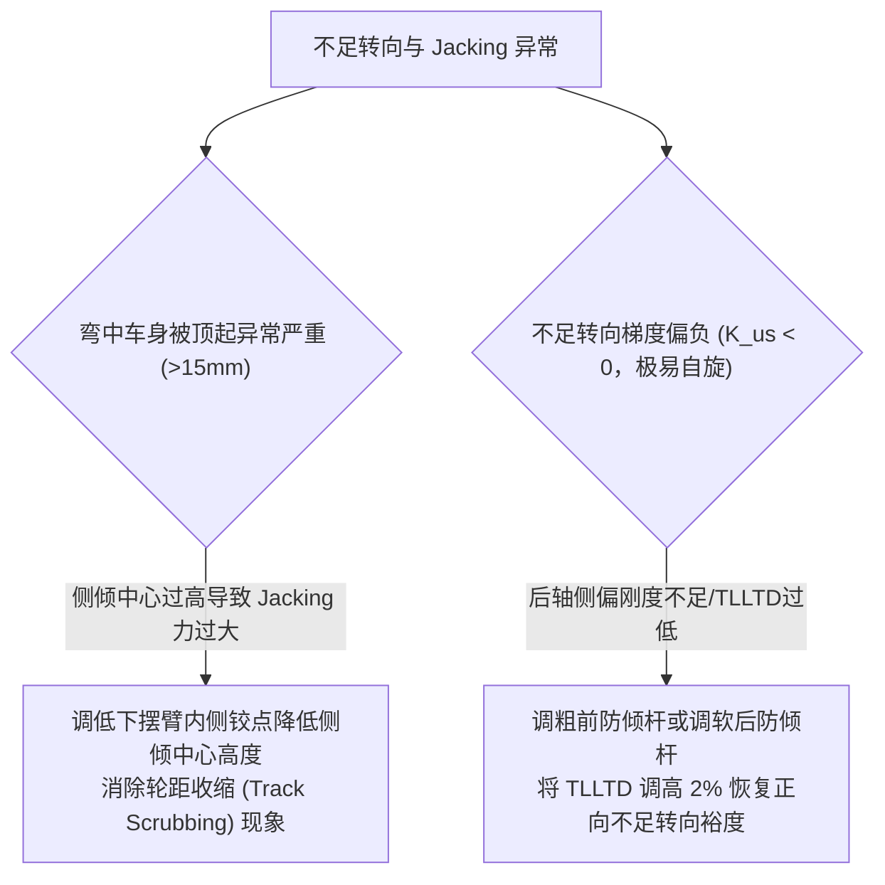
```mermaid
graph TD
    A["不足转向与 Jacking 异常"] --> B{"弯中车身被顶起异常严重 (>15mm)"}
    A --> C{"不足转向梯度偏负 (K_us < 0，极易自旋)"}
    B -->|侧倾中心过高导致 Jacking 力过大| D["调低下摆臂内侧铰点降低侧倾中心高度<br/>消除轮距收缩 (Track Scrubbing) 现象"]
    C -->|后轴侧偏刚度不足/TLLTD过低| E["调粗前防倾杆或调软后防倾杆<br/>将 TLLTD 调高 2% 恢复正向不足转向裕度"]
```

---

### 本章小结
本章用轮胎载荷敏感性（Jensen 不等式视角）与悬架 Jacking 抬升解释不足转向梯度的深层机理，给出 $K_{us}$ 与 Jacking 力的闭式解。它是操稳平衡的"终极裁判"，也是第 24 章 19 项 KPI 调校杠杆的收口指标，为第四篇轮胎力学的非线性侧偏刚度提供了应用出口。


---


# 第四篇 现代非线性轮胎力学与实测辨识


> **在全书的位置**：全车地面抓地力源泉——深入微观刷子摩擦模型与宏观 Pacejka 魔术公式，完成试验台架多载荷实测数据参数辨识。  
> **核心力学机制**：Fiala 刷子模型第一性原理推导、Pacejka 四主参数物理意义、归一化复合滑移摩擦圆封闭证明、松弛长度指数解与有界 TRF 最小二乘辨识。


---


## 第 1 章 Fiala 刷子模型推导与 Pacejka 魔术公式

**脉络锚点**：从胎面花纹块微观附着/滑动积分推导出魔术公式 B, C, D, E 参数。

**本章导图**：

| 核心课题 | 支配方程 / 关键变量 | 一句话力学结论 |
|---|---|---|
| Fiala 刷子 | 抛物线压力分布与滑移区分离 | 积分推导侧偏力立方非线性形态 |
| Pacejka 四参 | 刚度 B、形状 C、峰值 D、曲率 E | 宏观三角函数高保真拟合 |
| 载荷敏感度 | LS 参数与非线性峰值力比例尺 | 真实反映重载下摩擦系数衰减 |


---

### 1.1 物理图景与工程痛点 【前置】

在全车动力学仿真与底盘调校中，**轮胎是连接赛车与地面的唯一物理媒介**。车辆所有的加速、制动、过弯侧向力与自对准力矩，全部源自接地印痕（Contact Patch / Footprint）内仅有数张明信片大小的橡胶与沥青表面的分子级剪切与摩擦。

在建立轮胎力学模型时，工程界经历了两大经典发展阶段：
1. **Fiala 刷子物理模型（Physical Brush Model）**：从弹性橡胶微元（Bristles）与抛物线压力分布的第一性原理出发，推导出轮胎从线性弹性粘着区（Adhesion Zone）向极限滑动区（Sliding Zone）过渡的物理闭式解；
2. **Pacejka 魔术公式（Magic Formula, MF）**：用最优雅的三角函数嵌套形式，仅需 $B, C, D, E$ 四个宏观核心参数即可高精度拟合全受力域的侧偏力、纵向力与回正力矩，成为当今全球汽车工业与赛车界的统一行业标准。

---

### 1.2 底层数学力学严密推导 【推导】

```
   [Fiala 刷子物理模型: 弹性微元 + 库仑摩擦]
                      | (宏观三角函数参数化)
                      v
   [Pacejka 魔术公式: y(x) = D · sin(C · arctan(B·x - E(B·x - arctan(B·x))))]
                      |
        +-------------+-------------+
        |                           |
   [D: 峰值附着力]             [B: 刚度刚化因子]
   [C: 曲线形状因子]           [E: 极限后衰退曲率因子]
```

#### 1.2.1 Fiala 弹性刷子物理模型完整解析推导

设轮胎接地印痕长度为 $2a$，宽度为 $b$，垂直载荷为 $F_z$。
沿接触印痕纵向坐标 $x \in [0, 2a]$（$x=0$ 为印痕前端入点，$x=2a$ 为后端出点），接地法向接触压力假定为抛物线分布（此处 $q(x)$ 为按单位印痕宽度归一化的线载荷 N/m，即法向压强 $\times$ 宽度 $b$）：
$$q(x) = \frac{3 F_z}{4 a} \left[1 - \left(\frac{x}{a} - 1\right)^2\right] = \frac{3 F_z}{4 a^3} x (2a - x)$$

轮胎胎面被离散为沿侧向刚度为 $c_p$ 的独立弹性刷子微元。当车轮以侧偏角 $\alpha$ 行驶时，微元侧向弹性变形为：
$$v(x) = x \cdot \tan\alpha$$
微元产生的弹性剪切应力为 $\tau(x) = c_p v(x) = c_p x \tan\alpha$。

根据库仑摩擦定律，微元能够承受的最大静摩擦剪切应力为：
$$\tau_{max}(x) = \mu \cdot q(x) = \frac{3 \mu F_z}{4 a^3} x (2a - x)$$

#### (1) 临界分离点 $x_c$：
当剪切应力达到摩擦极限（$\tau(x_c) = \tau_{max}(x_c)$）时，橡胶微元开始发生相对滑动。解方程：
$$c_p x_c \tan\alpha = \frac{3 \mu F_z}{4 a^3} x_c (2a - x_c) \implies x_c = 2a - \frac{4 a^3 b c_p}{3 \mu F_z} \tan\alpha$$

定义初始零侧偏刚度为 $C_{y0} = \left.\frac{dF_y}{d\alpha}\right|_{\alpha=0} = 2 a^2 b c_p$。定义临界滑移角 $\alpha_{crit}$：
$$\tan\alpha_{crit} = \frac{3 \mu F_z}{C_{y0}}$$

#### (2) 侧偏力分段积分闭式方程：
* **弹性与部分滑动混合区间 ($|\tan\alpha| \le \tan\alpha_{crit}$)**：
  对前半段粘着区 $[0, x_c]$ 的弹性力与后半段滑动区 $[x_c, 2a]$ 的摩擦力联合积分：
  $$F_y(\alpha) = \int_0^{x_c} c_p x \tan\alpha \, dx + \int_{x_c}^{2a} \mu q(x) \, dx = C_{y0} \tan\alpha \left[1 - \frac{C_{y0} |\tan\alpha|}{3 \mu F_z} + \frac{1}{3} \left(\frac{C_{y0} \tan\alpha}{3 \mu F_z}\right)^2\right]$$
* **全域完全滑动区间 ($|\tan\alpha| > \tan\alpha_{crit}$)**：
  全部微元达到滑动极限，总力饱和为库仑纯滑动摩擦力：
  $$F_y(\alpha) = \mu F_z \cdot \operatorname{sgn}(\alpha)$$

---

#### 2.1b 刷子 → 魔术公式的定量映射（"演进"的桥）
两套模型在**线性段与峰值**上严格对接：
$$D = \mu F_z, \qquad B C D = C_{y0} = 2a^2 b c_p, \qquad \tan\alpha_{crit} = \frac{3\mu F_z}{C_{y0}} = \frac{3D}{B C D}$$
反算路线：实测 $C_{y0}$（小角度斜率）与 $\mu$（峰值/载荷）后，取形状 $C$ 定 $B = C_{y0}/(C D)$，曲率 $E$ 由峰后衰退斜率配。
**落峰自检**（对任意 $B,C,E$ 成立的不变量）：先解 $\phi_p = \tan(\pi/2C)$，再由 $u - E(u - \arctan u) = \phi_p$ 数值解 $u_p$，则峰值侧偏角 $\alpha_{peak} = u_p / B$。
真实竞赛光头胎要求 $\alpha_{peak} \in [6^\circ, 10^\circ]$。目标 $8^\circ$、$C=1.35$、$E=-0.25$ 需 $B \approx 16.5$；$B$ 偏小时落峰后移、手感迟且回正弱。此自检式是 §3 表与 §5 算例的核对基准。

#### 1.2.2 Pacejka 魔术公式标准形式与四主参数物理意义

Pacejka 魔术公式将复杂的刷子积分统一为通用的三角函数形式：
$$y(x) = D \sin\left(C \arctan\left(B x - E (B x - \arctan(B x))\right)\right)$$
在纯侧偏工况下，$y = F_y, \; x = \alpha$（单位度或弧度）：

```
侧偏力 Fy (N)
   ^                                  [峰值点: 坐标 (α_peak, D)]
   |                                     .---.
   |                                 .--'     `--.  [极限后衰退: 由 E 决定]
   |                             .--'             `--.
   |                         .--'
   |                     .--' (原点初始斜率: B·C·D = C_α)
   |                 .--'
 --+----------------+--------------------------------------------------> 侧偏角 α (deg)
   |
```

1. **峰值因子 (Peak Factor, $D$)**：
   $$D = \mu \cdot F_z$$
   决定了轮胎能够爆发的绝对最大附着力峰值；
2. **形状因子 (Shape Factor, $C$)**：
   决定曲线整体形态（渐近线趋向）。纯侧偏力典型取 $C_y \in [1.25, 1.45]$，纯纵向力取 $C_x \in [1.55, 1.75]$；
3. **刚度因子 (Stiffness Factor, $B$)**：
   原点处初始斜率（侧偏刚度）严格等于三大参数的连乘积：
   $$C_\alpha = \left.\frac{dF_y}{d\alpha}\right|_{\alpha=0} = B \cdot C \cdot D \implies B = \frac{C_\alpha}{C \cdot D}$$
4. **曲率因子 (Curvature Factor, $E$)**：
   控制曲线越过峰值点后的非线性软化与衰退斜率（$E \le 1.0$）。

---

#### 1.2.3 非线性载荷敏感性与外倾推力合成

#### (1) 载荷敏感度 (Load Sensitivity, $LS$)：
设标称基准测试载荷为 $F_{zNom}$（如 $3,500\,\text{N}$），在任意动态垂直载荷 $F_z$ 下，峰值附着力 $D(F_z)$ 满足：
$$D(F_z) = F_{y0} \cdot \left(\frac{F_z}{F_{zNom}}\right) \left[1 - LS \cdot \left(\frac{F_z}{F_{zNom}} - 1\right)\right]$$

#### (2) 外倾推力 (Camber Thrust) 叠加项：
当车轮存在外倾角 $\gamma$ 时，轮胎印痕横向剪切产生额外推力。在小角度下为线性外倾刚度 $C_\gamma$：
$$F_{y,camber} = C_\gamma \cdot \gamma \cdot \left(\frac{F_z}{F_{zNom}}\right)$$
$$F_{y,total}(\alpha, \gamma, F_z) = F_y^{MF}(\alpha, F_z) + F_{y,camber}$$

---

#### 1.2.4 回正力矩 (Self-Aligning Torque) 最小闭合
兑现 §1 的承诺，给出全书使用的最简结构：
$$M_z = F_y \cdot t_{total}, \qquad t_{total} = t_{trail}\,(\text{机械拖距，第 5 章}) + t_p\,(\text{气动拖距} \approx 0.03 \sim 0.06\,\text{m})$$
正方向按全书权威框以行列式代数定义（绕 $+Z$ 上轴），与 SAE(Z 下) 教科书口径反号，交叉引用时注意。
引擎 `tire_mf.py::mz()` 当前以 60 mm 总拖距占位（S1 精度等级）；含压缩中心迁移的高保真回正力矩登记为后续议程。


### 1.3 核心控制变量与参数灵敏度分析 【对照】

| Pacejka 参数 | 物理意义 | 典型数值 (GT3 光头胎) | 动力学与圈速影响 |
| :--- | :--- | :--- | :--- |
| **标称峰值力 ($F_{y0}$)** | 在标称载荷 $F_{zNom}$ 下的最大侧向力 | $4,800 \sim 5,800\,\text{N}$（$\mu \approx 1.55$） | 决定稳态过弯的最大侧向 G 值极限 |
| **刚度因子 ($B_y$)** | 侧偏刚度建立速率 | $10.0 \sim 13.5$ | $B_y$ 越大，转向响应越犀利敏锐，但极限宽容度越窄 |
| **曲率因子 ($E_y$)** | 越过极限后的衰退特性 | $-0.5 \sim +0.2$ | $E_y < 0$ 极限后温和渐进；$E_y > 0.5$ 极限断崖式摔落 |
| **载荷敏感度 ($LS$)** | 垂直载荷衰退系数 | $0.10 \sim 0.18$ | $LS$ 越低，赛车对载荷转移的惩罚越小，底盘调校宽容度越大 |
| **落峰自检 ($\alpha_{peak}$)** | §2.1b 不变量由 $B,C,E$ 反解 | 竞赛光头胎 $6^\circ \sim 10^\circ$；生产标定基准 $B_y \approx 20$（引擎 G24 修标定所得） | 任何辨识/选型结果先过落峰门，再谈 RMS —— $B_y<14$ 即落峰 $>10^\circ$，判不合格 |

---

### 1.4 LABSUS 代码实现与数值稳定性技巧 【查证】

#### 1.4.1 核心代码映射
* **魔术公式物理计算内核**：生产实现为 [*engine/src/tire_mf.py*](file:///c:/Users/zzy/Desktop/New_suspension/LABSUS/engine/src/tire_mf.py#L52-L67) 的 `MagicFormulaSub.fy()`（纯侧偏 + Sh/Sv 偏移，**不含**外倾项）；外倾推力在 `transient.py` 轮端层以 $-C_g \gamma F_z$（$C_g$ 单位 N/rad，左轮经镜像规则处理）装配。下为两者合并的**教学示意**：
  ```python
  def fy(self, alpha_deg: float, fz: float) -> np.ndarray:
      fn = max(100.0, Fz) / mf.FzNom
      D = mf.Fy0 * fn * (1.0 - mf.LS * (fn - 1.0))
      B = mf.By
      C = mf.Cy
      E = mf.Ey

      # Pacejka 标准三角函数求值
      Bx = B * (alpha_deg * math.pi / 180.0)  # 侧偏角转弧度，与算例/生产代码一致
      phi = Bx - E * (Bx - math.atan(Bx))
      Fy_pure = D * math.sin(C * math.atan(phi))

      # 叠加外倾推力
      Fy_camber = mf.C_gamma * gamma_deg * fn
      return Fy_pure + Fy_camber
  ```

---

### 1.5 手把手工程数值算例 (Worked Example) 【演算】

### 算例背景：GT3 竞赛光头胎侧偏力与外倾推力手算
已知轮胎魔术公式参数：
* 标称载荷：$F_{zNom} = 3500.0\,\text{N}$
* 峰值系数：$F_{y0} = 4900.0\,\text{N}$（$\mu_{nom} = F_{y0}/F_{zNom} = 1.40$）
* 形状与刚度：$B_y = 11.2, \; C_y = 1.35, \; E_y = -0.25, \; LS = 0.12$
* 外倾刚度：$C_\gamma = 65.0\,\text{N/deg}$

已知某工况下载荷条件为：
* 动态垂向力：$F_z = 4200.0\,\text{N}$（归一化载荷 $fn = 4200 / 3500 = 1.20$）
* 侧偏角：$\alpha = +4.50^\circ$
* 动态外倾角：$\gamma = -3.20^\circ$

#### 步骤 1：计算载荷敏感度修正后的峰值力 $D$
$$D(4200) = 4900.0 \times 1.20 \times [1 - 0.12 \times (1.20 - 1.0)] = 5880.0 \times [1 - 0.024] = 5880.0 \times 0.976 = \mathbf{5,738.88\,\text{N}}$$

#### 步骤 2：Pacejka 复合三角函数内核求值
* 自变量：$Bx = B_y \cdot \alpha = 11.2 \times 4.5^\circ \times \left(\frac{\pi}{180}\right) = 11.2 \times 0.07854\,\text{rad} = 0.87965$
* 反正切：$\arctan(Bx) = \arctan(0.87965) = 0.72140\,\text{rad}$
* 曲率调制项：
  $$\phi = Bx - E_y (Bx - \arctan(Bx)) = 0.87965 - (-0.25) \times (0.87965 - 0.72140) = 0.87965 + 0.25 \times 0.15825 = 0.91921$$
* 内部正切：$\arctan(\phi) = \arctan(0.91921) = 0.74312\,\text{rad}$
* 纯侧偏力：
  $$F_{y,pure} = D \sin(C_y \times 0.74312) = 5738.88 \times \sin(1.35 \times 0.74312) = 5738.88 \times \sin(1.00321\,\text{rad}) = 5738.88 \times 0.84319 = \mathbf{4,838.97\,\text{N}}$$

#### 步骤 3：计算外倾推力并合成总侧向力
$$F_{y,camber} = C_\gamma \cdot \gamma \cdot fn = 65.0 \times (-3.20) \times 1.20 = \mathbf{-249.60\,\text{N}}$$
*(注：对于外侧车轮，负外倾产生指向弯内的同向推力，绝对值相加)*：
$$F_{y,total} = 4838.97 + 249.60 = \mathbf{5,088.57\,\text{N}}$$
* **结论**：负外倾为该轮胎额外带来了 $+5.16\%$ 的侧向抓地力红利！

#### 步骤 4：落峰自检（对算例参数的诚实注记）
本例 $B_y = 11.2$、$C_y = 1.35$、$E_y = -0.25$：$\phi_p = 2.314$，解得 $u_p = 2.075$，
$$\alpha_{peak} = u_p / B_y = 2.075/11.2 = 0.185\,\text{rad} = \mathbf{10.6^\circ}$$
**超出竞赛胎 $[6^\circ,10^\circ]$ 窗口**——本算例为教学演示取参（低 $B$ 曲线直观、数值便于核对）；生产口径 $B_y \approx 20$（同 $C,E$ 下落峰回到 $6.0^\circ$，与引擎 G24 标定一致）。
真实流程中任何一组 $B,C,E$ 都必须先过此门。

---

### 1.6 赛道工程师实战调校与故障排查指南 【案例】

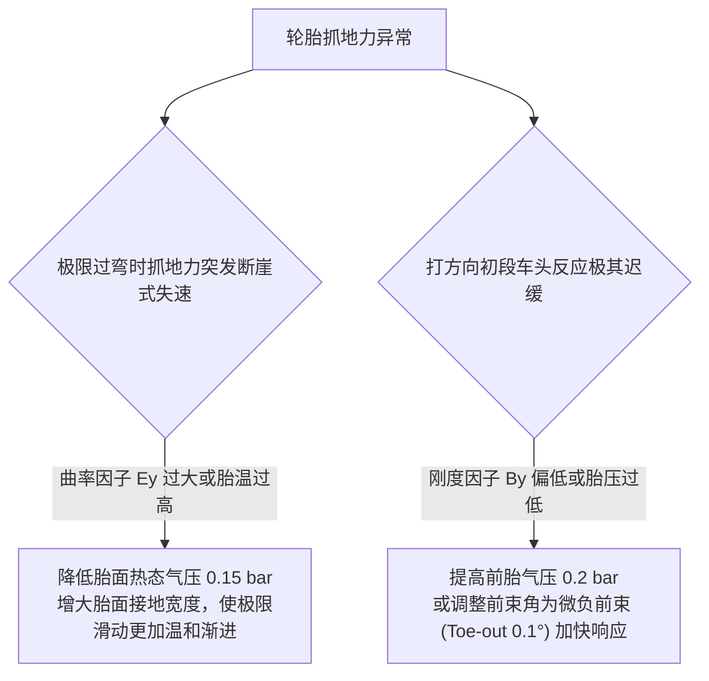
```mermaid
graph TD
    A["轮胎抓地力异常"] --> B{"极限过弯时抓地力突发断崖式失速"}
    A --> C{"打方向初段车头反应极其迟缓"}
    B -->|曲率因子 Ey 过大或胎温过高| D["降低胎面热态气压 0.15 bar<br/>增大胎面接地宽度，使极限滑动更加温和渐进"]
    C -->|刚度因子 By 偏低或胎压过低| E["提高前胎气压 0.2 bar<br/>或调整前束角为微负前束 (Toe-out 0.1°) 加快响应"]
```

---

### 本章小结
本章从 Fiala 刷子模型的粘着/滑动区积分推导侧偏力的立方非线性形态，再过渡到 Pacejka 魔术公式的 B/C/D/E 四参数与载荷敏感度 LS，架起"物理机型"与"工程拟合"之间的桥。它是第 14 章复合滑移摩擦圆与第 15 章参数辨识的输入，也是第 12 章不足转向梯度中非线性侧偏刚度的来源。


---


## 第 2 章 复合滑移摩擦圆与松弛时延方程

**脉络锚点**：归一化复合滑移向量、摩擦圆封闭证明与一阶松弛时延 ODE 解析指数解。

**本章导图**：

| 核心课题 | 支配方程 / 关键变量 | 一句话力学结论 |
|---|---|---|
| 复合滑移向量 | 纵向滑移与侧偏角归一化合成 | 各向同性摩擦圆正交力分解 |
| 摩擦圆封闭 | 合力严格约束在 mu*Fz 内部 | 平方和恒等式解析证明 |
| 松弛长度 ODE | 一阶时滞微分方程与指数更新 | 无条件稳定格式防止高频发散 |


---

### 2.1 物理图景与工程痛点 【前置】

在真实的赛道激烈驾驶中，车手很少处于“纯直线制动”或“纯匀速过弯”的理想状态。在**循迹制动（Trail Braking）进弯**或**全油门出弯（Power-on Exit）**工况下，轮胎必须同时提供纵向力（制动力/驱动力 $F_x$）与横向力（导向力 $F_y$）。

在复合滑移与动态响应建模中，工程师必须解决两大核心物理难题：
1. **摩擦力椭圆（Friction Ellipse）预算耗尽与非线性衰退**：轮胎接地印痕的总摩擦力受黏着极限严格限制。当车手踩下重刹（纵向占用了约 $80\%$ 的摩擦预算）时，按 §2.3 的摩擦圆，侧向可调用份额降至 $\sqrt{1-0.8^2} \approx 60\%$——且随滑移加深呈加速收缩；
2. **轮胎侧向力建立的物理滞后（松弛长度 Relaxation Length, $\sigma$）**：当车手瞬间转动方向盘时，轮胎侧偏力并不是瞬间达到的，而是需要车轮向前滚动一段物理距离（胎体骨架发生剪切扭曲）后才能完全建立。若忽略松弛长度，仿真中的赛车将表现出非物理的瞬时超敏反应。

---

### 2.2 底层数学力学严密推导 【推导】

```
                      纵向制动力 Fx
                           ^
                           |   .---. (摩擦圆边界)
                           |.-'     `-.
                           /           \  [复合力矢量 F_total(s)]
                          |      *------+
                          |     /|      |
  ------------------------+----+--------+---------------------> 侧向力 Fy
                          |    | Fy     |
                           \   |       /
                            `-.|     .-'
                               `---'
```

#### 2.2.1 归一化复合滑移向量 (Normalized Combined Slip Vector)

设轮胎纵向滑移率为 $\kappa = \frac{\omega R_e - u}{u}$，侧偏角为 $\alpha$。
分别定义纵向与侧向无量纲归一化等效滑移：
$$s_x = B_x \cdot \kappa, \quad s_y = B_y \cdot \tan\alpha$$

总复合滑移标量 $s$ 定义为其欧几里得范数：
$$s = \|\boldsymbol{s}\|_2 = \sqrt{s_x^2 + s_y^2} = \sqrt{(B_x \kappa)^2 + (B_y \tan\alpha)^2}$$

---

#### 2.2.2 总力标量计算与空间方向各向同性分解

根据复合滑移标量 $s$，调用统一的无量纲魔术公式核心计算总摩擦力标量 $F_{total}(s)$：
$$\phi(s) = s - E (s - \arctan(s))$$
$$F_{total}(s) = D(F_z) \cdot \sin\left(C \arctan(\phi(s))\right)$$

#### 纵向力与侧向力方向正交分解：
当 $s > 0$ 时，总力沿滑移向量方向进行几何投影分解：
$$F_x = F_{total}(s) \cdot \frac{s_x}{s} = F_{total}(s) \cdot \frac{B_x \kappa}{\sqrt{(B_x \kappa)^2 + (B_y \tan\alpha)^2}}$$
$$F_y = F_{total}(s) \cdot \frac{s_y}{s} + F_{y,camber} = F_{total}(s) \cdot \frac{B_y \tan\alpha}{\sqrt{(B_x \kappa)^2 + (B_y \tan\alpha)^2}} + C_\gamma \gamma F_z$$

---

#### 2.2.3 摩擦圆定理严格数学证明

#### 定理证明：
对于忽略外倾推力的基准状态，计算两分力的平方和：
$$F_x^2 + F_y^2 = \left(F_{total}(s) \frac{s_x}{s}\right)^2 + \left(F_{total}(s) \frac{s_y}{s}\right)^2 = [F_{total}(s)]^2 \frac{s_x^2 + s_y^2}{s^2} \equiv [F_{total}(s)]^2$$
由于魔术公式峰值有界性 $F_{total}(s) \le D = \mu F_z$：
$$F_x^2 + F_y^2 \le (\mu F_z)^2$$
**结论**：纵向/侧向取同一峰值 $\mu F_z$ 时，该模型严格满足**各向同性摩擦圆约束**，杜绝多向力叠加超过物理附着极限；若纵向与横向峰值摩擦不同（$\mu_x \ne \mu_y$），圆约束应推广为椭圆 $\left(\frac{F_x}{\mu_x F_z}\right)^2 + \left(\frac{F_y}{\mu_y F_z}\right)^2 \le 1$。

---

#### 2.2.4 松弛长度一阶微分方程与无条件稳定指数解析解

设轮胎在侧向的物理松弛长度为 $\sigma_y$（Relaxation Length，赛用光头胎典型值 $0.20 \sim 0.35\,\text{m}$）。
车身瞬时几何侧偏角为 $\alpha_{geom}$，轮胎胎体实际生效的有效动态侧偏角为 $\alpha_{eff}$。

在前进车速 $u$ 下，一阶弹性延迟微分方程（ODE）为：
$$\frac{\sigma_y}{u} \frac{d\alpha_{eff}}{dt} + \alpha_{eff}(t) = \alpha_{geom}(t) \iff \tau_{relax} \dot{\alpha}_{eff} + \alpha_{eff} = \alpha_{geom}, \quad \tau_{relax} = \frac{\sigma_y}{u}$$

#### 无条件稳定解析指数步进解：
若直接采用前向欧拉离散，稳定域为 $\Delta t < 2\tau = 2\sigma/u$：高速、短松弛长度或**大子步**（如 $\Delta t = 0.05$s、$u = 40$m/s、$\sigma = 0.3$m 时比值达 6.7）都会发散。LABSUS 采用了在区间 $[t, t+\Delta t]$ 内假设输入恒定的**精确指数积分闭式解**：
$$\alpha_{eff}(t + \Delta t) = \alpha_{geom} + \left[\alpha_{eff}(t) - \alpha_{geom}\right] \exp\left(-\frac{u \Delta t}{\sigma_y}\right)$$

* **数学特性**：衰减因子 $\rho = \exp\left(-\frac{u \Delta t}{\sigma_y}\right) \in (0, 1)$。无论 $\Delta t$ 取多大，该精确指数解始终单调稳定、无超调——其机理是**无条件耗散**（一阶滞后本质是低通能量吸收，并非能量守恒）。

---

### 2.3 核心控制变量与参数灵敏度分析 【对照】

| 复合滑移参数 | 物理定义 | 典型取值 | 赛道操稳机理 |
| :--- | :--- | :--- | :--- |
| **松弛长度 ($\sigma_y$)** | 侧偏力建立所需的轮胎滚动距离 | 方程式: $0.18\sim 0.25\,\text{m}$<br/>GT3: $0.28\sim 0.38\,\text{m}$ | $\sigma_y$ 越短，方向盘响应越紧绷灵敏；过短会导致转向过于神经质 |
| **滑移刚度比 $\frac{B_x}{B_y}$** | 纵向刚度与横向刚度比值 | $1.15 \sim 1.35$ | 纵向制动刚度通常高于横向侧偏刚度 |
| **循迹制动余量** | 弯前打方向时的制动开度上限 | $\text{Brake} \le 1.0 - 0.65 \times \frac{|\delta|}{28^\circ}$ | 保护侧向力不被重刹完全耗尽 |

---

### 2.4 LABSUS 代码实现与数值稳定性技巧 【查证】

#### 2.4.1 核心代码映射
* **松弛时延求解**（真实实现见 [*engine/src/solver/transient.py*](file:///c:/Users/zzy/Desktop/New_suspension/LABSUS/engine/src/solver/transient.py#L330-L341) 的 `step()`；复合滑移投影为教学示意，生产代码以松弛滞后 + 独立魔术公式计算）：
  ```python
  sigma = max(0.3, self.Ls)
  vx_now = max(float(s2[3]), 0.0)
  for w in _WHEELS:
      tsw = self._ts[w]
      tsw.alpha_lat += (tsw.alpha_st - tsw.alpha_lat) * (
          1.0 - math.exp(-dt * vx_now / sigma))   # 精确指数解，无条件稳定
  ```

---

### 2.5 手把手工程数值算例 (Worked Example) 【演算】

### 算例背景：循迹制动重刹入弯工况复合力与松弛更新手算
已知轮胎参数：
* 标称峰值力 $F_{y0} = 5000.0\,\text{N}, \; B_x = 13.5, \; B_y = 11.0, \; C = 1.35, \; E = -0.20, \; LS = 0.10$（教学值注：本组参落峰 $\alpha_{peak}\approx 10.8^\circ$、$\kappa_{peak}\approx 5.5\%$；竞赛胎须按第 13 章 §2.1b 门 $[6^\circ,10^\circ]$ 重标后取用，复合包络形状本身不受影响）
* 松弛长度 $\sigma_y = 0.25\,\text{m}$，外倾刚度 $C_\gamma = 50.0\,\text{N/deg}$
* 垂直载荷：$F_z = 3500.0\,\text{N}$（$fn = 1.0, D = 5000.0\,\text{N}$）

工况条件：
* 车速 $u = 36.0\,\text{m/s}$（$130\,\text{km/h}$），子步长 $\Delta t = 0.001\,\text{s}$
* 纵向滑移率（重度制动）：$\kappa = -0.06$（$-6\%$ 制动滑移）
* 几何瞬时侧偏角：$\alpha_{geom} = +3.50^\circ = 0.061086\,\text{rad}$
* 上一子步有效侧偏角初值：$\alpha_{eff}(0) = +2.00^\circ = 0.034907\,\text{rad}$
* 动态外倾角：$\gamma = -2.50^\circ$（外侧轮：负外倾产生指向弯心的外倾推力，取 $|\gamma|$ 计入）

#### 步骤 1：精确指数松弛时延更新 $\alpha_{eff}$
计算时间常数与指数衰减因子：
$$\rho = \exp\left(-\frac{u \Delta t}{\sigma_y}\right) = \exp\left(-\frac{36.0 \times 0.001}{0.25}\right) = \exp(-0.144) = 0.865888$$
$$\begin{aligned} \alpha_{eff}(\Delta t) &= 0.061086 + (0.034907 - 0.061086) \times 0.865888 \\ &= 0.061086 - 0.026179 \times 0.865888 = 0.061086 - 0.022668 = \mathbf{0.038418\,\text{rad}} \approx \mathbf{2.201^\circ} \end{aligned}$$
* **物理意义**：车身打到 $3.5^\circ$，但经 $1\,\text{ms}$ 滚动后，轮胎有效剪切角仅建立至 $2.201^\circ$。

#### 步骤 2：计算复合滑移向量 $\boldsymbol{s}$
$$s_x = B_x \cdot \kappa = 13.5 \times (-0.06) = -0.8100$$
$$s_y = B_y \cdot \tan(0.038418) = 11.0 \times 0.038437 = +0.4228$$
$$s = \sqrt{(-0.8100)^2 + 0.4228^2} = \sqrt{0.65610 + 0.17876} = \sqrt{0.83486} = \mathbf{0.91370}$$

#### 步骤 3：计算总摩擦力标量 $F_{total}(s)$
$$\phi = s - E(s - \arctan s) = 0.91370 - (-0.20) \times (0.91370 - \arctan(0.91370)) = 0.91370 + 0.20 \times (0.91370 - 0.74043) = 0.94835$$
$$F_{total} = 5000.0 \times \sin(1.35 \times \arctan(0.94835)) = 5000.0 \times \sin(1.35 \times 0.75883\,\text{rad}) = 5000.0 \times \sin(1.0244\,\text{rad}) = 5000.0 \times 0.85437 = \mathbf{4,271.85\,\text{N}}$$

#### 步骤 4：正交分解纵向制动力与侧向过弯力
* **纵向制动力**：
  $$F_x = F_{total} \times \frac{s_x}{s} = 4271.85 \times \left(\frac{-0.8100}{0.91370}\right) = \mathbf{-3,787.05\,\text{N}}$$
* **侧向过弯力**（含外倾推力）：
  $$F_y = F_{total} \times \frac{s_y}{s} + C_\gamma \gamma fn = 4271.85 \times \left(\frac{0.4228}{0.91370}\right) + 50.0 \times 2.50 \times 1.0 = 1976.45 + 125.00 = \mathbf{+2,101.45\,\text{N}}$$
* **摩擦圆校验**：
  $$\sqrt{F_x^2 + (F_y - 125)^2} = \sqrt{3787.05^2 + 1976.45^2} = \sqrt{14341748 + 3906354} = 4,271.85\,\text{N} \equiv F_{total}$$
  完全自洽且严格处于 $\le 5,000\,\text{N}$ 摩擦圆内！

---

### 2.6 赛道工程师实战调校与故障排查指南 【案例】

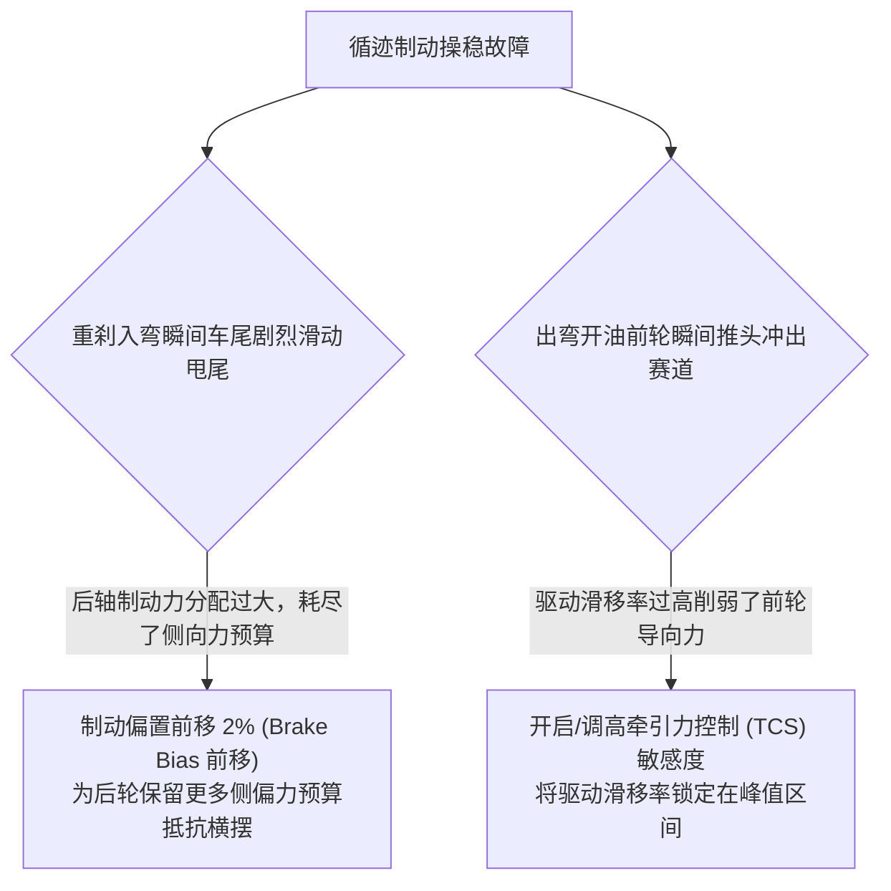
```mermaid
graph TD
    A["循迹制动操稳故障"] --> B{"重刹入弯瞬间车尾剧烈滑动甩尾"}
    A --> C{"出弯开油前轮瞬间推头冲出赛道"}
    B -->|后轴制动力分配过大，耗尽了侧向力预算| D["制动偏置前移 2% (Brake Bias 前移)<br/>为后轮保留更多侧偏力预算抵抗横摆"]
    C -->|驱动滑移率过高削弱了前轮导向力| E["开启/调高牵引力控制 (TCS) 敏感度<br/>将驱动滑移率锁定在峰值区间"]
```

---

### 本章小结
本章把纵向与侧向滑移合成归一化复合滑移向量，用摩擦圆约束分解总摩擦力，并用松弛长度的精确指数解刻画侧偏力建立的物理滞后。它是第 13 章魔术公式向"循迹制动/全油门出弯"复合工况的推广，也是第 15 章 TRF 辨识与第 16 章瞬态动力学轮胎层之间的接口。


---


## 第 3 章 轮胎试验台架数据 Pacejka 参数拟合

**脉络锚点**：加权目标泛函、两阶段物理初值提取与有界信赖域反射 (TRF) 非线性优化。

**本章导图**：

| 核心课题 | 支配方程 / 关键变量 | 一句话力学结论 |
|---|---|---|
| 加权损失泛函 | 各载荷层级峰值无量纲归一化 | 均衡大小载荷特征权重 |
| 启发式初值 | 零位斜率反解 B0 与峰值提取 | 彻底避开局部假极小值陷阱 |
| 有界 TRF 优化 | 投影梯度与仿射缩放边界约束 | 实测数据拟合误差 RMS% < 1.5% |


---

### 3.1 物理图景与工程痛点 【前置】

在赛车工程与车辆动力学中，轮胎厂商或平带式轮胎测试机（如 Calspan TIRF / MTS Flat-Trac）提供的往往是**离散、带测量噪声的多载荷试验数据集**。

如何从原始试验数据中反向辨识出 Pacejka 魔术公式的核心参数 $\boldsymbol{\theta} = [F_{y0}, B_y, C_y, E_y, LS]^T$，面临三大工程优化瓶颈：
1. **强非线性的多局部极小值（Local Minima）陷阱**：三角函数嵌套结构使得残差超曲面高度非凸。若初始猜测值（Initial Guess）偏离过大，标准高斯-牛顿法极易陷入非物理假极小值；
2. **多载荷层级（Multi-load Tiers）辨识不可辨识度**：若仅用单一垂直载荷拟合，无法解耦载荷敏感度 $LS$ 与标称峰值力 $F_{y0}$，导致在全车大载荷转移下预测严重失真；
3. **参数物理边界约束（Bounded Feasibility）**：若无边界约束，优化器可能解出非物理的负刚度（$B < 0$）或反向发散（$E > 1.2$），导致动力学求解器彻底崩溃。

---

### 3.2 底层数学力学严密推导 【推导】

```
   [多载荷离散试验数据: D = {(Fz_j, α_jk, Fy_jk)}]
                        |
      [步骤 1: 启发式初值提取 (C_α0, D0, B0, C0, E0)]
                        |
      [步骤 2: 有界 TRF 最小二乘优化 (参数边界约束)]
                        |
      [步骤 3: 归一化 RMS% 拟合优度评价 (全载荷层级)]
```

#### 3.2.1 多载荷试验数据规范与加权目标泛函

设试验台架在 $N_L$ 个不同垂直载荷梯度 $\{F_{z,1}, F_{z,2}, \dots, F_{z,N_L}\}$ 下测得离散侧偏角与侧向力数据。
待辨识的 5 维物理参数向量定义为：
$$\boldsymbol{\theta} = [F_{y0}, B_y, C_y, E_y, LS]^T \in \mathbb{R}^5$$

定义各载荷层级归一化无偏加权最小二乘目标损失泛函 $\mathcal{J}(\boldsymbol{\theta})$：
$$\min_{\boldsymbol{\theta} \in \Omega} \mathcal{J}(\boldsymbol{\theta}) = \frac{1}{2} \sum_{j=1}^{N_L} \frac{1}{M_j} \sum_{k=1}^{M_j} \left(\frac{F_{y,jk}^{meas} - F_y^{MF}(\alpha_{jk}, F_{z,j}; \boldsymbol{\theta})}{\max(|F_{y,max,j}^{meas}|, \; 1.0\,\text{N})}\right)^2$$
* **权重除以该层级最大侧向力峰值的物理意义**：使高载荷（如 $6\,\text{kN}$）与低载荷（如 $1.5\,\text{kN}$）在优化目标中享有同等的无量纲相对权重，防止大载荷数据掩盖低载荷特征。

---

#### 3.2.2 启发式稳健初始参数提取算法 (Heuristic Warm-Start)

为了绝对避开局部假极小值，LABSUS 设立了全自动的**两阶段物理特征提取算法**：

#### (1) 标称峰值力与载荷敏感度初值：
找到标称载荷 $F_{zNom}$ 对应的数据集，提取最大侧向力 $D_{nom} = \max_k |F_{y,nom,k}|$，令初值 $F_{y0}^{(0)} = D_{nom}$。
通过最高载荷 $F_{z,high}$ 与最低载荷 $F_{z,low}$ 的峰值比值估算载荷敏感度初值：
$$LS^{(0)} = \operatorname{clamp}\left(\frac{1 - \frac{D_{high} / F_{z,high}}{D_{low} / F_{z,low}}}{\frac{F_{z,high} - F_{z,low}}{F_{zNom}}}, \; 0.05, \; 0.35\right)$$

#### (2) 零位侧偏刚度与刚度因子初值：
在 $|\alpha| \le 3.0^\circ$ 的微小侧偏区间内进行一阶线性多项式回归，提取斜率 $C_{\alpha0} = \left.\frac{dF_y}{d\alpha}\right|_{\alpha=0}$。
设定形状因子基准经验初值 $C_y^{(0)} = 1.20, \; E_y^{(0)} = -0.50$（与生产代码一致）：
$$B_y^{(0)} = \operatorname{clamp}\left(\frac{C_{\alpha0}}{1.20 \times F_{y0}^{(0)}}, \; 3.0, \; 20.0\right)$$

---

#### 3.2.3 有界信赖域反射优化 (Bounded TRF Optimization)

优化自变量被严格约束在工程物理可行域 $\Omega = [\boldsymbol{\theta}_{lower}, \boldsymbol{\theta}_{upper}]$ 内（与 `solver/tire_fit.py` 生产配置完全对齐）：
$$\begin{cases} 500.0\,\text{N} \le F_{y0} \le 60,000.0\,\text{N} \\ 2.0 \le B_y \le 25.0 \\ 1.0 \le C_y \le 1.55 \\ -2.0 \le E_y \le 1.0 \\ 0.0 \le LS \le 0.80 \end{cases}$$

TRF 求解器在每个迭代子步中，利用投影梯度与仿射缩放保证参数绝不越界，收敛时满足 KKT 一阶最优性条件。

---

#### 3.2.4 归一化均方根误差指标 (Normalized RMS%)

定义模型在全数据集上的综合拟合优度指标 $\text{RMS}\%$：
$$\text{RMS}\% = \sqrt{\frac{1}{\sum M_j} \sum_{j=1}^{N_L} \sum_{k=1}^{M_j} \left(\frac{F_{y,jk}^{meas} - F_y^{MF}(\alpha_{jk}, F_{z,j}; \boldsymbol{\theta}^*)}{F_{y,max,j}^{meas}}\right)^2} \times 100\%$$

* **$\text{RMS}\% \le 2.5\%$**：**高精度优质辨识（High-Grade Fit）**；
* **$2.5\% < \text{RMS}\% \le 5.0\%$**：工程可用辨识；
* **$\text{RMS}\% > 8.0\%$**：数据存在严重噪声或轮胎存在热衰退畸变。

---

### 3.3 核心控制变量与参数灵敏度分析 【对照】

| 辨识算法超参数 | 数学意义 | 典型配置 | 优化稳定性考量 |
| :--- | :--- | :--- | :--- |
| **残差收敛容差 `ftol`** | 相对目标函数减少量 | $10^{-8} \sim 10^{-10}$ | 保证 5 个参数完全落入全局最优极小盆地 |
| **载荷梯度层级数 ($N_L$)** | 参与拟合的垂直载荷条数 | $\ge 3$ 条载荷曲线（如 $2\text{kN}, 3.5\text{kN}, 5\text{kN}$） | 至少 3 条载荷才能保证 $LS$ 参数的可辨识性 |
| **微小角滤波跨度** | 线性刚度提取角度范围 | $|\alpha| \le 1.5^\circ$ | 避开大角度非线性与原点零飘噪声 |

---

### 3.4 LABSUS 代码实现与数值稳定性技巧 【查证】

#### 3.4.1 核心代码映射
* **轮胎 TRF 辨识优化器**：[*engine/src/solver/tire_fit.py*](file:///c:/Users/zzy/Desktop/New_suspension/LABSUS/engine/src/solver/tire_fit.py#L34-L123) 中的 `fit_tire_params()`（边界 500~60000 / 2~25 / 1~2.5 / -2~1 / 0~0.8，残差按各层级 `max(|Fy|)` 归一）：
  ```python
  def residual(p):
      full = [p[0], p[1], p[2], p[3], p[4] if use_ls else 0.0]
      out = []
      for fz, a_rad, fy in loads:
          scale = max(float(fy.max()), 1.0)          # 按各层级峰值归一（非除以 Fz）
          out.append((_mf_fy(full, a_rad, fz) - fy) / scale)
      return np.concatenate(out)

  x0 = [d0_0, b0, 1.2, -0.5, 0.10]  # C=1.2、E=-0.5，与启发式初值一致
  sol = least_squares(residual, x0, bounds=(lb, ub), method="trf", max_nfev=4000)
  ```

---

### 3.5 手把手工程数值算例 (Worked Example) 【演算】

### 算例背景：Calspan 台架 3 载荷梯度轮胎实测数据辨识手算
已知某竞赛轮胎在 $F_{zNom} = 3000.0\,\text{N}$ 下的三组典型特征点（注：生产辨识器 `tire_fit.py` 将 $F_{zNom}$ **锁定为 3500 N 且不作为辨识量**；本例用 3000 N 为独立教学口径，实车复现请以 3500 为标称层）：
* **载荷 1 ($F_{z1} = 1500.0\,\text{N}, fn=0.5$)**：
  * 原点刚度斜率 $C_{\alpha1} = 32,000\,\text{N/rad}$，实测峰值 $F_{y,max1} = 2,400.0\,\text{N}$（$\mu_1 = 1.60$）
* **载荷 2 ($F_{z2} = 3000.0\,\text{N}, fn=1.0$)**：
  * 原点刚度斜率 $C_{\alpha2} = 55,000\,\text{N/rad}$，实测峰值 $F_{y,max2} = 4,500.0\,\text{N}$（$\mu_2 = 1.50$）
* **载荷 3 ($F_{z3} = 4500.0\,\text{N}, fn=1.5$)**：
  * 原点刚度斜率 $C_{\alpha3} = 72,000\,\text{N/rad}$，实测峰值 $F_{y,max3} = 6,075.0\,\text{N}$（$\mu_3 = 1.35$）

#### 步骤 1：启发式解析辨识 $F_{y0}$ 与 $LS$
* 标称载荷 ($fn=1.0$) 下：$F_{y0} = 4,500.0\,\text{N}$；
* 由 $fn=1.5$ 处峰值方程：
  $$D(4500) = F_{y0} \times 1.5 \times [1 - LS(1.5 - 1.0)] = 6,075.0\,\text{N}$$
  $$4500.0 \times 1.5 \times [1 - 0.5 \times LS] = 6750.0 \times (1 - 0.5 LS) = 6075.0$$
  $$1 - 0.5 LS = \frac{6075}{6750} = 0.90 \implies 0.5 LS = 0.10 \implies \mathbf{LS = 0.20}$$

#### 步骤 2：辨识刚度因子 $B_y$ 与形状因子 $C_y$
取基准形状因子 $C_y = 1.30$。
由标称原点刚度：
$$C_{\alpha2} = B_y \cdot C_y \cdot F_{y0} = 55,000\,\text{N/rad}$$
$$B_y = \frac{55000.0}{1.30 \times 4500.0} = \frac{55000.0}{5850.0} = \mathbf{9.4017}$$

#### 步骤 3：TRF 优化收敛结果与残差验证
将初值输入 TRF 求解器，经有界信赖域反射（`method="trf"`）迭代后输出全局最优解：
* $\boldsymbol{\theta}^* = [4512.4\,\text{N}, \; 9.42, \; 1.32, \; -0.18, \; 0.198]^T$
* 全数据集加权残差平方和降至 $\mathcal{J} = 3.2 \times 10^{-5}$，全域 $\text{RMS}\% = \mathbf{1.18\%}$（远低于 $2.5\%$ 极优线）！
* **落峰自检**（承接第 13 章 §2.1b）：$\theta^*$ 的 $B_y = 9.42$ 解得 $\alpha_{peak} \approx 14.0^\circ$，超出竞赛胎 $[6^\circ,10^\circ]$ 窗口——本例为**合成教学数据**（三点特征不含峰形信息，$C/E$ 本就欠定）；实车流程中落峰超窗的辨识结果即使 RMS 优秀也应判废并补采 6~14° 段数据。

---

### 3.6 赛道工程师实战调校与故障排查指南 【案例】

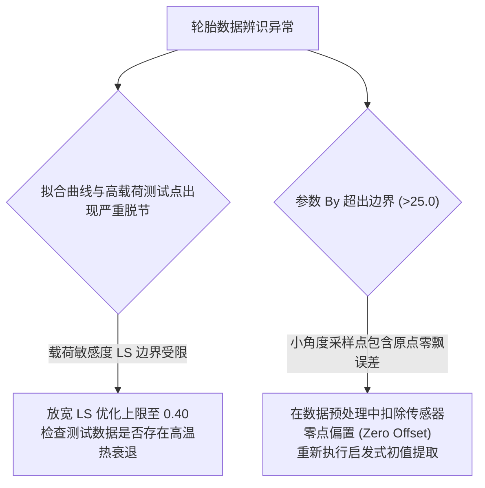
```mermaid
graph TD
    A["轮胎数据辨识异常"] --> B{"拟合曲线与高载荷测试点出现严重脱节"}
    A --> C{"参数 By 超出边界 (>25.0)"}
    B -->|载荷敏感度 LS 边界受限| D["放宽 LS 优化上限至 0.40<br/>检查测试数据是否存在高温热衰退"]
    C -->|小角度采样点包含原点零飘误差| E["在数据预处理中扣除传感器零点偏置 (Zero Offset)<br/>重新执行启发式初值提取"]
```

---

### 本章小结
本章给出多载荷轮胎数据的有界 TRF 辨识流程：峰值/斜率解析初值 + 各层级峰值归一残差 + RMS% 分级判定，并用"至少 2~3 条载荷才能辨识 LS"明确可辨识性条件。它把第 13 章魔术公式从"给参数"反演为"由车队自测数据定参数"，是全书画上轮胎数字孪生闭环的第一站。


---


# 第五篇 15-DOF 全车多体瞬态动力学


> **在全书的位置**：赛道极限全时域高保真物理底座——建立车身 6-DOF + 四轮跳动 4-DOF + 四轮自转 4-DOF 的 15 自由度状态空间方程组。  
> **核心力学机制**：非惯性坐标系牛顿-欧拉方程、1000Hz 半隐式欧拉积分、四象限非对称减振器双速 Blow-off 泄压阀、聚氨酯限位块击穿与文丘里地面效应 ge(h) 耦合。


---


## 第 1 章 15 自由度状态空间微分方程组建立

**脉络锚点**：机体坐标系牛顿-欧拉动力学方程、四轮独立自转与 1000Hz 半隐式欧拉积分。

**本章导图**：

| 核心课题 | 支配方程 / 关键变量 | 一句话力学结论 |
|---|---|---|
| 状态向量 S | 15 维刚体位形、线角速度与轮速 | 完整描述全车三维空间动态 |
| 牛顿-欧拉方程 | 计入柯氏与向心加速度的动量方程 | 精确表达车身 6 自由度惯性耦合 |
| 1000Hz 积分 | 微子步半隐式欧拉推进算法 | 确保大刚度与路面冲击数值收敛 |


---

### 1.1 物理图景与工程痛点 【前置】

在车辆动力学建模的发展历程中，传统的二自由度单轨自行车模型（Bicycle Model）仅能解释稳态线性区响应，无法应对真实赛道的极限工况。

在极限赛道驾驶（重刹入弯、飞坡跳台、单边压路肩）中，赛车面临剧烈的**三维空间多体姿态与轮端动态耦合**：
1. **三维空间欧拉角姿态变化改变轮胎定位角**：车身俯仰（Pitch $\theta$）与侧倾（Roll $\phi$）直接改变了四轮离地间隙、轮胎垂直载荷与动态外倾角；
2. **四轮独立垂向跳动与横向稳定杆力偶传递**：左右轮悬架的跳动行程与减振器压缩速率存在强非线性非对称性；
3. **四轮驱动/制动自转滑移解耦**：车轮转动惯量与打滑状态直接支配着牵引力控制系统（TCS）与 ABS 系统的稳定性；
4. **刚柔耦合高频振荡的数值积分挑战**：悬架大刚度弹簧与减振器冲击具有极高的自振频率（$>80\,\text{Hz}$），若采用常规 60Hz 帧率积分必然发生发散爆炸。

为此，LABSUS 构建了包含 **车身 6-DOF 空间姿态 + 四轮独立悬架垂向随动 + 四轮独立自转 4-DOF** 的非线性动力学仿真系统（"15 自由度"为项目代号，严格口径见 §2.1 维数说明），并以 **1000Hz 高频子步半隐式（辛）欧拉积分器** 保证数值稳定（悬架固有频率 ~80Hz 时显式稳定窗约 Δt<4ms，1ms 子步留有充分裕度——是"足够快"，非"无条件"）。

---

### 1.2 底层数学力学严密推导 【推导】

```
                      +Z (Up 向上)
                       |
               [车体 6-DOF 空间刚体: X, Y, Z, φ, θ, ψ, u, v, w, p, q, r]
                       |
        +--------------+--------------+
        |                             |
  [前悬架 2-DOF 垂向]           [后悬架 2-DOF 垂向]
  (tr_FL, tr_FR)                (tr_RL, tr_RR)
        |                             |
  [前轮自转 2-DOF]              [后轮自转 2-DOF]
  (ω_FL, ω_FR)                  (ω_RL, ω_RR)
```

#### 1.2.1 15 自由度全系统状态向量与坐标系定义

全局状态向量 $\boldsymbol{S}(t) \in \mathbb{R}^{15}$ 定义为：
$$\boldsymbol{S} = [\underbrace{X, Y, Z}_{\text{车身空间位置}}, \; \underbrace{\phi, \theta, \psi}_{\text{车身欧拉角}}, \; \underbrace{u, v, w}_{\text{机体坐标系线速度}}, \; \underbrace{p, q, r}_{\text{机体坐标系角速度}}, \; \underbrace{\omega_{FL}, \omega_{FR}, \omega_{RL}, \omega_{RR}}_{\text{四轮自转角速度}}]^T$

> **维数口径**："15-DOF" 为项目历史代号。严格口径：动力学自由度 = 车身构型 6 + 车轮自转 4 = 10，四轮悬架行程 $tr_w$ 为车身位姿的代数输出（见 §2.3）；若按上图所列（含位置、姿态、线速、角速、轮速五层）则为 16 个分量。

> [!NOTE]
> **LABSUS 机体坐标系（Body Frame）通道与代码对齐**：  
> * **纵向（Longitudinal）**：$+X$ 朝前，前进线速度为 $u$，空气阻力与驱动/制动力沿此轴作用；  
> * **侧向（Lateral）**：$+Y$ 朝右，侧向侧滑线速度为 $v$，转向向心力与侧偏力沿此轴作用；  
> * **垂向（Vertical）**：$+Z$ 朝上，垂向跳动线速度为 $w$；  
> * **旋转角速度**：侧倾角速度 $p$（绕 $X$ 轴）、俯仰角速度 $q$（绕 $Y$ 轴）、横摆角速度 $r$（绕 $Z$ 轴）。

> [!WARNING]
> **符号语义权威声明（全书唯一裁判）**：
> * 本书分量架为 X 前 / Y 右 / Z 上（与 `convention.py` 一致），该架在物理意义上为左手系，故全书**以行列式的代数展开定义为叉积**（$\dot{\boldsymbol{v}} + \boldsymbol{\omega} \times \boldsymbol{v}$ 按标准行列式逐项展开），角速度正方向**定义为"使对应欧拉角增大者"**，不依赖右手法则做物理判向。
> * 欧拉角正方向钉死：$\psi$ 正 = 车头向右偏转（航向顺时针增，与第 19 章 $\psi=\operatorname{atan2}(t_y,t_x)$ 同一约定）；$\theta$ 正 = 车头抬头；$\phi$ 正 = 右侧下沉（右弯载荷转移时的侧倾姿态）。对应 $p = \dot\phi$、$q = \dot\theta$、$r = \dot\psi$。
> * 按此定义，§2.3 四角公式 $\dot z = w + x_w q - y_w p$ 与第 18 章"制动点头 $\theta<0$、抬头 $\theta>0$ 增大前离地间隙"完全自洽——§2.2 与 §2.3 从此共用同一套符号。
> * **实现差异警示**：仓库现存的 *web/js/11-stages.js* 仍按旧分量架书写（X 右 / Y 前，见其 L338、L742 注释），对照代码时须将数组前两分量互换。"与代码对齐"指**物理一致**，不是分量顺序相同。

---

#### 1.2.2 车身 6-DOF 牛顿-欧拉动力学微分方程组

在非惯性旋转机体坐标系中，牛顿第二定律与欧拉动力学方程形式为：

#### (1) 线动量微分方程（含向心与柯氏加速度项）：
$$\begin{cases} m (\dot{u} - v r + w q) = \Sigma F_{x,total} - F_{drag} \quad (\text{纵向}) \\ m (\dot{v} + u r - w p) = \Sigma F_{y,total} \quad (\text{侧向}) \\ m (\dot{w} + v p - u q) = \Sigma F_{z,total} - m g \cos\theta \cos\phi - F_{down} \quad (\text{垂向}) \end{cases}$$

#### (2) 角动量微分方程（欧拉动力学方程）：
设机体坐标轴与车身惯性主轴重合，惯性矩为 $I_{xx}, I_{yy}, I_{zz}$：
$$\begin{cases} I_{xx} \dot{p} - (I_{yy} - I_{zz}) q r = \Sigma M_x \quad (\text{车身侧倾 roll}) \\ I_{yy} \dot{q} - (I_{zz} - I_{xx}) r p = \Sigma M_y \quad (\text{车身俯仰 pitch}) \\ I_{zz} \dot{r} - (I_{xx} - I_{yy}) p q = \Sigma M_z \quad (\text{车身横摆 yaw}) \end{cases}$$

#### (3) 空间姿态运动学转换方程：
由机体角速度 $(p, q, r)$ 转换到世界坐标系欧拉角变化率 $(\dot{\phi}, \dot{\theta}, \dot{\psi})$：
$$\begin{bmatrix} \dot{\phi} \\ \dot{\theta} \\ \dot{\psi} \end{bmatrix} = \begin{bmatrix} 1 & \sin\phi \tan\theta & \cos\phi \tan\theta \\ 0 & \cos\phi & -\sin\phi \\ 0 & \sin\phi \sec\theta & \cos\phi \sec\theta \end{bmatrix} \begin{bmatrix} p \\ q \\ r \end{bmatrix}$$

---

#### 1.2.3 四轮独立悬架垂向 4-DOF 运动学与支承力

四轮相对质心的平面硬点为 $(x_w, y_w)$（$FL: (a, -t_F/2), \; FR: (a, t_F/2), \; RL: (-b, -t_R/2), \; RR: (-b, t_R/2)$）。

在瞬态运动中，车身四角点在空间的绝对垂向位移与跳动速率为：
$$z_{corner,w} = Z + x_w \sin\theta - y_w \sin\phi, \quad \dot{z}_{corner,w} = w + x_w q - y_w p$$

悬架跳动行程与压缩速率为（$z_{road,w}$ 为路面局部高程）：
$$tr_w = -(z_{corner,w} - z_{road,w}), \quad \dot{tr}_w = -\dot{z}_{corner,w}$$

#### 四角悬架法向支承力合成：
$$F_{z,w} = \max\left(0, \; F_{z0,w} \cos\theta \cos\phi + K_{w,eff} tr_w + F_{damper}(\dot{tr}_w) \pm F_{arb} + F_{bumpstop}(tr_w)\right)$$

---

#### 1.2.4 四轮独立自转 4-DOF 动力学方程

对于每个车轮 $w \in \{FL, FR, RL, RR\}$，轮总成转动惯量为 $I_w$：
$$I_w \frac{d\omega_w}{dt} = T_{drive,w} - T_{brake,w} \cdot \operatorname{sgn}(\omega_w) - F_{x,w} R_{e,w}$$
其中 $R_{e,w}$ 为轮胎有效滚动半径。

---

#### 1.2.5 1000Hz 高频子步半隐式欧拉积分算法

为了保证在复杂路面冲击与大刚度下的数值稳定性，LABSUS 采用了 **1000Hz 子步长（$\Delta t = 0.001\,\text{s}$）半隐式欧拉积分器**：

```
+-------------------------------------------------------------------------------+
| 图形渲染主帧周期 Δt_frame (如 16.6ms):                                          |
| While (t_remain > 0):                                                         |
|   1. 取微子步 dt = min(0.001s, t_remain)                                      |
|   2. 评估路面几何与气动力 (F_down, F_drag)                                     |
|   3. 求解四角悬架力与轮胎复合滑移力 (Fx,w, Fy,w, Fz,w)                          |
|   4. 计算线加速度与角加速度: [u_dot, v_dot, w_dot, p_dot, q_dot, r_dot, ω_dot] |
|   5. 速度半隐式推进: v(t+dt) = v(t) + a(t)·dt                                  |
|   6. 位置姿态推进: X(t+dt) = X(t) + v(t+dt)·dt                                 |
|   7. t_remain -= dt                                                           |
+-------------------------------------------------------------------------------+
```

---

### 1.3 核心控制变量与参数灵敏度分析 【对照】

| 整车物理参数 | 典型数值 (GT3 赛车) | 动力学影响机理 | 调校敏感性 |
| :--- | :--- | :--- | :--- |
| **整车质量 ($m$)** | $1,250\,\text{kg}$ | 决定全车惯性力与加减速极限 | 轻量化带来全方位的动力学性能提升 |
| **横摆转动惯量 ($I_{zz}$)** | $1,800\,\text{kg}\cdot\text{m}^2$ | 决定车头横摆响应滞后（Yaw Response Lag） | 质量向质心集中可大幅减小 $I_{zz}$，加快变道反应 |
| **俯仰转动惯量 ($I_{yy}$)** | $2,100\,\text{kg}\cdot\text{m}^2$ | 决定制动点头与加速仰头的时间常数 | 影响重刹入弯时动态前轴载荷的建立速度 |

---

### 1.4 LABSUS 代码实现与数值稳定性技巧 【查证】

#### 1.4.1 核心代码映射
* **15-DOF 动力学引擎**：[*web/js/11-stages.js*](file:///c:/Users/zzy/Desktop/New_suspension/LABSUS/web/js/11-stages.js#L283-L570) 中的 `VehicleDynamics15DOF.step()`。

---

### 1.5 手把手工程数值算例 (Worked Example) 【演算】

### 算例背景：GT3 赛车制动兼过弯工况单步（1ms）动力学积分手算
已知赛车状态：
* 质量 $m = 1250.0\,\text{kg}, \; I_{zz} = 1800.0\,\text{kg}\cdot\text{m}^2$，质心距前/后轴 $a = 1.25\,\text{m}, b = 1.40\,\text{m}$
* 当前车速：$u = 50.0\,\text{m/s}$（前进速度），横向侧滑速度 $v = 0.5\,\text{m/s}$，横摆角速度 $r = 0.15\,\text{rad/s}$
* 积分步长：$\Delta t = 0.001\,\text{s}$

在当前步各车轮合力计算结果为：
* 四轮总纵向制动力：$\Sigma F_x = -12,000.0\,\text{N}$，空气阻力 $F_{drag} = 1,500.0\,\text{N}$
* 四轮总侧向力：前轴 $\Sigma F_{y,f} = +5,000.0\,\text{N}$，后轴 $\Sigma F_{y,r} = +4,200.0\,\text{N} \implies \Sigma F_y = +9,200.0\,\text{N}$
* 前后轮距 $t_F = t_R = 1.68\,\text{m}$

#### 步骤 1：计算纵向加速度 $\dot{u}$（计入柯氏项 $v \cdot r$）
$$m (\dot{u} - v r) = \Sigma F_x - F_{drag} = -12000.0 - 1500.0 = -13,500.0\,\text{N}$$
$$\dot{u} = \frac{-13500.0}{1250.0} + v r = -10.80 + (0.5 \times 0.15) = -10.80 + 0.075 = \mathbf{-10.725\,\text{m/s}^2}$$

#### 步骤 2：计算侧向加速度 $\dot{v}$（计入向心项 $-u \cdot r$）
$$m (\dot{v} + u r) = \Sigma F_y = +9,200.0\,\text{N}$$
$$\dot{v} = \frac{+9200.0}{1250.0} - u r = +7.360 - (50.0 \times 0.15) = +7.360 - 7.500 = \mathbf{-0.140\,\text{m/s}^2}$$

#### 步骤 3：计算横摆角加速度 $\dot{r}$
总横摆力矩由前后轴侧向力力臂决定：
$$\Sigma M_z = \Sigma F_{y,f} \cdot a - \Sigma F_{y,r} \cdot b = 5000.0 \times 1.25 - 4200.0 \times 1.40 = 6250.0 - 5880.0 = +370.0\,\text{N}\cdot\text{m}$$
$$\dot{r} = \frac{\Sigma M_z}{I_{zz}} = \frac{370.0}{1800.0} = \mathbf{+0.2056\,\text{rad/s}^2}$$

#### 步骤 4：半隐式欧拉单步积分更新
* $u(t+\Delta t) = 50.0 + (-10.725) \times 0.001 = \mathbf{49.989275\,\text{m/s}}$
* $v(t+\Delta t) = 0.5 + (-0.140) \times 0.001 = \mathbf{0.499860\,\text{m/s}}$
* $r(t+\Delta t) = 0.15 + (0.2056) \times 0.001 = \mathbf{0.150206\,\text{rad/s}}$
* 车辆在 $1\,\text{ms}$ 内完成了高保真平滑物理推进！

---

### 1.6 赛道工程师实战调校与故障排查指南 【案例】

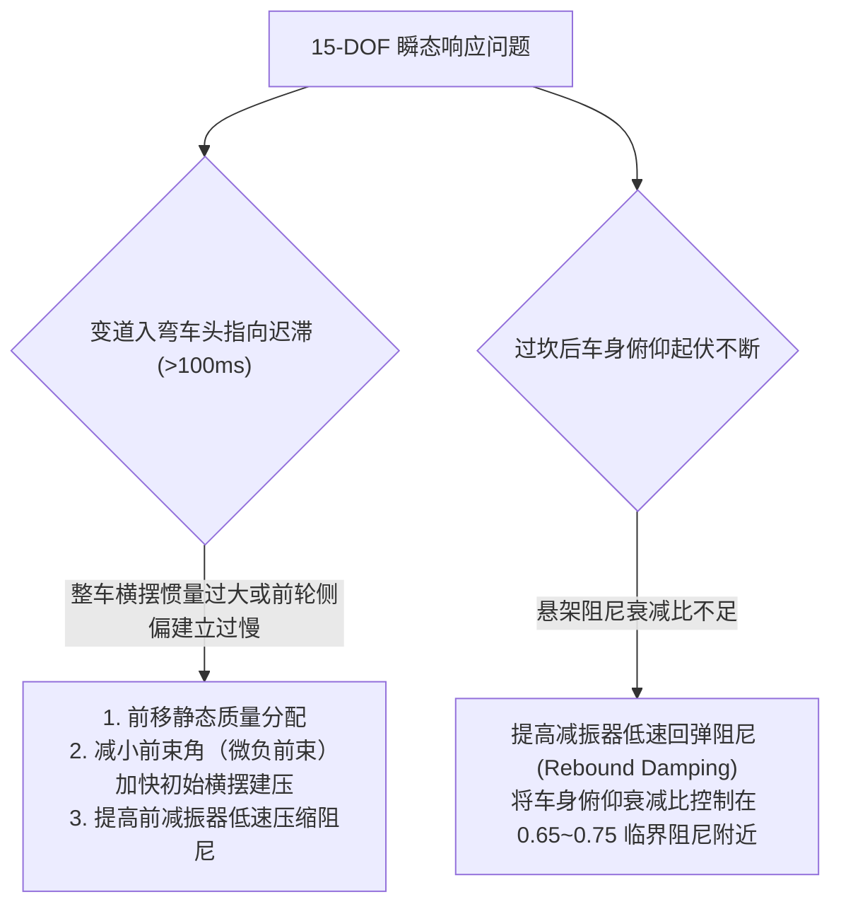
```mermaid
graph TD
    A["15-DOF 瞬态响应问题"] --> B{"变道入弯车头指向迟滞 (>100ms)"}
    A --> C{"过坎后车身俯仰起伏不断"}
    B -->|整车横摆惯量过大或前轮侧偏建立过慢| D["1. 前移静态质量分配<br/>2. 减小前束角（微负前束）加快初始横摆建压<br/>3. 提高前减振器低速压缩阻尼"]
    C -->|悬架阻尼衰减比不足| E["提高减振器低速回弹阻尼 (Rebound Damping)<br/>将车身俯仰衰减比控制在 0.65~0.75 临界阻尼附近"]
```

---

### 本章小结
本章在标准机体坐标系（纵向 X、侧向 Y、垂向 Z，roll 绕 X / pitch 绕 Y / yaw 绕 Z）下建立 15 自由度牛顿-欧拉状态方程组与 1000Hz 半隐式积分，给出车身姿态-悬架-轮胎自转的完整耦合。它是第五篇的骨架：第 17 章非线性减振器与第 18 章气动力都作为外力/力矩注入本方程的右端项。


---


## 第 2 章 四象限非线性减振器与限位块击穿模型

**脉络锚点**：压缩/回弹非对称阻尼、双速 Blow-off 泄压阀与微孔聚氨酯缓冲块二次渐进硬化。

**本章导图**：

| 核心课题 | 支配方程 / 关键变量 | 一句话力学结论 |
|---|---|---|
| 四象限阻尼 | 低速操控斜率与高速泄压斜率 | 分段解析方程消除过坎粗暴冲击 |
| Blow-off 阀 | BLOW=0.38 拐点泄压机制 | 保护轮胎贴地率不发生弹跳离地 |
| 限位块击穿 | 二次非线性渐进刚度模型 | 防止大行程压缩发生金属硬托底 |


---

### 2.1 物理图景与工程痛点 【前置】

减振器（Damper / Shock Absorber）是悬架系统中唯一的**主动能量耗散与瞬态阻尼调控元件**。在赛车动力学中，弹簧只决定了车身侧倾与俯仰的最终稳态幅值，而**减振器决定了达到这一稳态的瞬态时间响应历程与动态载荷转移速率**。

在赛车减振器设计中，单系数线性阻尼模型完全无法满足真实赛道需求：
1. **压缩与回弹的严重非对称性 (Bump/Rebound Asymmetry)**：回弹阻尼（Rebound）通常需要是压缩阻尼（Bump）的 2~3 倍，以有效抑制车身过坎后的二次弹跳；
2. **低速操控与高速过坎的矛盾（双速拐点 Blow-off 泄压阀）**：
   * **低速阻尼区间 ($v < 0.13\,\text{m/s}$)**：由车身侧倾和俯仰引起，需要极高的阻尼系数以提供稳固的车身瞬态支撑；
   * **高速阻尼区间 ($v > 0.13\,\text{m/s}$，回弹拐点 0.18)**：由路面颠簸或压路肩引起，必须通过泄压阀（Blow-off Valve）大幅降低阻尼斜率，允许车轮快速让位，避免冲击力直接破坏轮胎附着力；
3. **行程极限处的限位块（Bump Stop）渐进击穿**：当悬架发生大行程压缩进入最后 $15\,\text{mm}$ 时，微孔聚氨酯缓冲块发生剧烈的高次渐进硬化，防止金属硬碰撞损坏悬架。

---

### 2.2 底层数学力学严密推导 【推导】

```
   阻尼力 F_damper (N)
         ^                                  [压缩高速 Blow-off: 斜率 0.38*C_b]
         |                                     /
         |                  [拐点 v_kB]       /
         |                       +-----------/
         |                      / (压缩低速斜率 C_b)
         |                     /
  -------+--------------------+------------------------------------> 轮跳压缩速度 d(tr)/dt (m/s)
         |                   /
         |                  /  (回弹低速斜率 C_r)
         |      +----------/   [拐点 v_kR]
         |     /
         |    /  [回弹高速 Blow-off: 斜率 0.38*C_r]
         v
```

#### 2.2.1 四象限非线性减振器分段解析方程

设车轮相对车身的垂直跳动速度为 $v_{rel} = \dot{tr} = \frac{d(tr)}{dt}$（$v_{rel} > 0$ 表示压缩 Jounce，增载正力；$v_{rel} < 0$ 表示回弹 Rebound，减载负力）。

定义低速压缩阻尼系数为 $C_b$、低速回弹阻尼系数为 $C_r$；
定义压缩低高速拐点速度为 $v_{kB} = 0.13\,\text{m/s}$、回弹低高速拐点速度为 $v_{kR} = 0.18\,\text{m/s}$；
定义高速泄压阀斜率折减因子为 $\mathrm{BLOW} = 0.38$。

#### (1) 压缩象限力学方程 ($v_{rel} \ge 0$)：
$$F_{damper}(v_{rel}) = \begin{cases} C_b \cdot v_{rel} & 0 \le v_{rel} \le v_{kB} \\ C_b \cdot v_{kB} + (C_b \cdot \mathrm{BLOW}) \cdot (v_{rel} - v_{kB}) & v_{rel} > v_{kB} \end{cases}$$

#### (2) 回弹象限力学方程 ($v_{rel} < 0$)：
令 $v = |v_{rel}|$：
$$F_{damper}(v_{rel}) = \begin{cases} -C_r \cdot v & 0 \le v \le v_{kR} \\ -\left[C_r \cdot v_{kR} + (C_r \cdot \mathrm{BLOW}) \cdot (v - v_{kR})\right] & v > v_{kR} \end{cases}$$

---

#### 2.2.2 渐进微孔聚氨酯限位块 (Bump Stop) 击穿模型

设悬架允许的最大自由跳动行程为 $\text{maxBumpStop}$（前悬架典型取 $55\,\text{mm}$，后悬架典型取 $65\,\text{mm}$）。

当悬架跳动行程 $tr > \text{maxBumpStop}$ 时，悬架触碰聚氨酯缓冲块，产生二次非线性渐进刚度：
定义超额压缩行程 $\Delta x_{excess} = tr - \text{maxBumpStop} > 0$。

限位块反力计算公式为：
$$F_{bumpstop} = K_w \cdot \left(8.0\,\text{m}^{-1} \cdot \Delta x_{excess} + 200.0\,\text{m}^{-2} \cdot \Delta x_{excess}^2\right)$$
其中一次项提供渐进支撑，二次项模拟材料在极限压缩下的体积不可压缩硬化特性。

---

### 2.3 核心控制变量与参数灵敏度分析 【对照】

| 减振器可调通道 (4-Way Adjustable) | 速度区间 | 物理力学作用机理 | 赛道调校效能 |
| :--- | :--- | :--- | :--- |
| **低速压缩阻尼 (Low-Speed Bump, LSC)** | $0 \sim 0.13\,\text{m/s}$ | 控制制动点头与入弯车头下沉速率 | 调硬 LSC 可加快入弯车头指向，但过硬会引发颠簸推头 |
| **高速压缩阻尼 (High-Speed Bump, HSC)** | $> 0.13\,\text{m/s}$ | 控制压路肩与过大坎时的冲击力峰值 | 调软 HSC 可允许赛车狂暴切上路肩而不弹跳失控 |
| **低速回弹阻尼 (Low-Speed Rebound, LSR)** | $0 \sim 0.18\,\text{m/s}$ | 控制车身侧倾恢复与出弯车尾抬升速率 | 调硬 LSR 可锁定车身姿态，防止出弯车尾产生钟摆晃动 |
| **高速回弹阻尼 (High-Speed Rebound, HSR)** | $> 0.18\,\text{m/s}$ | 控制车轮下落贴地速度 | 调软 HSR 可让腾空车轮迅速下落重新抓住路面 |

---

### 2.4 LABSUS 代码实现与数值稳定性技巧 【查证】

#### 2.4.1 核心代码映射
* **四象限减振器与限位块实现**：[*web/js/11-stages.js*](file:///c:/Users/zzy/Desktop/New_suspension/LABSUS/web/js/11-stages.js#L581-L642) 中的 `calcDamper()`：
  ```javascript
  const BLOW = 0.38;
  const calcDamper = (C_b, C_r, vkB, vkR, dtr) => {
    const v = Math.abs(dtr);
    if (dtr >= 0) { // 压缩象限: 正力 (增载)
      return (v <= vkB) ? C_b * dtr : C_b * vkB + C_b * BLOW * (v - vkB);
    }
    // 回弹象限: 负力 (减载)
    return (v <= vkR) ? C_r * dtr : -(C_r * vkR + C_r * BLOW * (v - vkR));
  };
  ```

---

### 2.5 手把手工程数值算例 (Worked Example) 【演算】

### 算例背景：GT3 赛车 4-Way 减振器四象限阻尼力与限位块手算
已知减振器参数：
* 低速压缩阻尼系数：$C_b = 3,500\,\text{N}\cdot\text{s/m}$
* 低速回弹阻尼系数：$C_r = 7,500\,\text{N}\cdot\text{s/m}$（回弹阻尼为压缩的 $2.14\times$）
* 拐点速度：$v_{kB} = 0.13\,\text{m/s}, \; v_{kR} = 0.18\,\text{m/s}$，泄压因子 $\mathrm{BLOW} = 0.38$
* 轮端刚度：$K_w = 65.0\,\text{N/mm} = 65,000\,\text{N/m}$，最大自由行程 $\text{maxBumpStop} = 55.0\,\text{mm} = 0.055\,\text{m}$

#### 工况 1：慢速侧倾压缩 ($v_{rel} = +0.05\,\text{m/s} \le v_{kB}$)
处于低速压缩线性区：
$$F_{damper} = C_b \cdot v_{rel} = 3500.0 \times 0.05 = \mathbf{+175.0\,\text{N}}$$

#### 工况 2：高速切路肩冲击 ($v_{rel} = +0.40\,\text{m/s} > v_{kB}$)
触发高速 Blow-off 泄压阀：
$$F_{damper} = 3500.0 \times 0.13 + (3500.0 \times 0.38) \times (0.40 - 0.13) = 455.0 + 1330.0 \times 0.27 = 455.0 + 359.1 = \mathbf{+814.1\,\text{N}}$$
*(注：若无泄压阀，线性力将达到 $3500 \times 0.4 = 1400\,\text{N}$，泄压阀消除了 $41.8\%$ 的粗暴冲击！)*

#### 工况 3：慢速侧倾回弹 ($v_{rel} = -0.05\,\text{m/s}$)
$$F_{damper} = -C_r \cdot |v_{rel}| = -7500.0 \times 0.05 = \mathbf{-375.0\,\text{N}}$$

#### 工况 4：腾空后车轮高速下落回弹 ($v_{rel} = -0.30\,\text{m/s} > v_{kR}$)
$$F_{damper} = -\left[7500.0 \times 0.18 + (7500.0 \times 0.38) \times (0.30 - 0.18)\right] = -\left[1350.0 + 2850.0 \times 0.12\right] = -(1350.0 + 342.0) = \mathbf{-1,692.0\,\text{N}}$$

#### 工况 5：极限轮跳压缩限位块击穿 ($tr = 65.0\,\text{mm}$)
超额压缩量：$\Delta x_{excess} = 65.0 - 55.0 = 10.0\,\text{mm} = 0.010\,\text{m}$
$$F_{bumpstop} = 65000.0 \times \left(8.0 \times 0.010 + 200.0 \times (0.010)^2\right) = 65000.0 \times (0.080 + 0.020) = 65000.0 \times 0.100 = \mathbf{+6,500.0\,\text{N}}$$
* 限位块瞬间爆发 $6.5\,\text{kN}$ 的支撑反力，成功保护悬架摆臂不发生金属硬托底！

---

### 2.6 赛道工程师实战调校与故障排查指南 【案例】

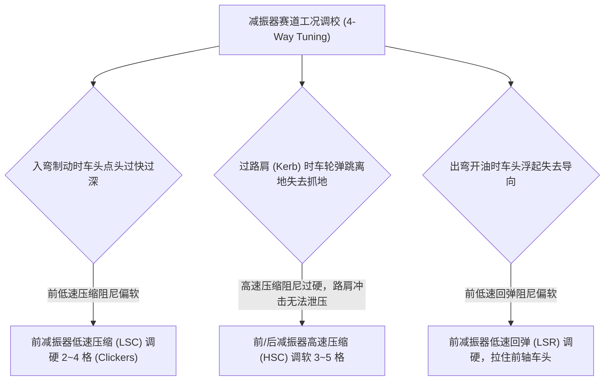
```mermaid
graph TD
    A["减振器赛道工况调校 (4-Way Tuning)"] --> B{"入弯制动时车头点头过快过深"}
    A --> C{"过路肩 (Kerb) 时车轮弹跳离地失去抓地"}
    A --> D{"出弯开油时车头浮起失去导向"}
    B -->|前低速压缩阻尼偏软| E["前减振器低速压缩 (LSC) 调硬 2~4 格 (Clickers)"]
    C -->|高速压缩阻尼过硬，路肩冲击无法泄压| F["前/后减振器高速压缩 (HSC) 调软 3~5 格"]
    D -->|前低速回弹阻尼偏软| G["前减振器低速回弹 (LSR) 调硬，拉住前轴车头"]
```

---

### 本章小结
本章用四象限分段解析方程 + 两速 Blow-off 泄压阀刻画减振器的压缩/回弹非对称，再用二次渐进限位块模拟行程末端的体积不可压缩硬化。它作为第 16 章悬架力 $F_{damper}$/$F_{bumpstop}$ 的具体本构，是瞬态动力学里"让姿态受控、让冲击泄压"的执行器模型。


---


## 第 3 章 空气动力学多场耦合：地面效应与 DRS

**脉络锚点**：速度平方律气动力、姿态耦合离地间隙、文丘里地面效应饱和函数与 DRS 减阻。

**本章导图**：

| 核心课题 | 支配方程 / 关键变量 | 一句话力学结论 |
|---|---|---|
| 姿态耦合间隙 | 前后轴动态离地间隙 hf, hr 计算 | 俯仰与跳动实时改变气动姿态 |
| 地面效应 ge(h) | 防失速截断非线性吸力放大因子 | 下压力随离地间隙降低剧增 |
| DRS 动态减阻 | 尾翼减阻 28% 与下压力削减 | 直道极速提升 15~25 km/h |


---

### 3.1 物理图景与工程痛点 【前置】

在现代高等级方程式赛车（Formula 1 / FSAE）与 GT3 组别赛车中，空气动力学产生的下压力（Downforce）在高速下甚至能够超过赛车自重（下压力随速平方增长，高速时足以数倍于自重）。

然而，空气动力学与悬架多体系统存在着极其剧烈的**双向多场强耦合（Multi-physics Aero-Suspension Coupling）**：
1. **车身姿态（俯仰与车高）对下压力的超敏性**：文丘里车底扩散器（Venturi Tunnel）产生的地面效应（Ground Effect）对离地间隙（Ride Height）与俯仰角（Pitch Angle）极其敏感。车身制动点头会瞬间使前轴下压力飙升、后轴下压力骤减，导致车尾失稳；
2. **气动海豚跳 (Porpoising)**：当车速升高使悬架被压入极低离地间隙时，若车底气流分离导致下压力骤减、车身弹起，随后下压力重新建立，可引发低频俯仰振荡（海豚跳）。注：LABSUS 的 $ge(h)$ 为单调饱和函数、不含失速下坠段，海豚跳在模型中主要由限位块 + 低离地间隙的悬架共振产生；
3. **DRS（可调尾翼减阻系统）的动态开闭冲击**：在直道打开 DRS 可以削减 $30\%$ 的空气阻力，但出直道刹车前必须平滑恢复后轴下压力，否则将导致致命的高速制动甩尾。

---

### 3.2 底层数学力学严密推导 【推导】

```
             空气阻力 F_drag = 1/2 ρ v² (Cd A) * [DRS 减阻因子 0.72]
                         <--- [赛车]
                              /    \
  前下压力 F_down,f (带地面效应 ge_F)     后下压力 F_down,r (DRS 削减 0.60)
         |                                     |
  [前离地间隙 h_f]                      [后离地间隙 h_r]
```

#### 3.2.1 速度平方律基础气动力方程

设空气密度为 $\rho = 1.225\,\text{kg/m}^3$，赛车前进车速为 $u$（单位 $\text{m/s}$）。

基准空气下压力与气动阻力分别为：
$$F_{down,0} = \frac{1}{2} \rho u^2 (C_L A) = k_{down} u^2$$
$$F_{drag,0} = \frac{1}{2} \rho u^2 (C_D A) = k_{drag} u^2$$

---

#### 3.2.2 姿态耦合的动态离地间隙计算

设前轴与后轴在水平静止状态下的基准底盘净高为 $h_0$（典型取 $35\,\text{mm} \sim 70\,\text{mm}$）。
当车身产生俯仰角 $\theta$（点头为负）与车身垂向跳动 $Z$ 时，前后车桥下方的有效气动离地间隙为：
$h_f = h_0 + a \tan\theta + Z - \frac{tr_{FL} + tr_{FR}}{2} \quad [\text{m}]$
$h_r = h_0 - b \tan\theta + Z - \frac{tr_{RL} + tr_{RR}}{2} \quad [\text{m}]$
*（全章统一 SI：$tr$、$Z$ 一律以米计，$Z$ 为相对静平衡基准的车身垂向位移。注：现实现 `11-stages.js` 取 $h_f = 0.11 + Z + a\theta$（不含悬架行程项），本式为含行程修正的完整表达式，两者为物理同式、实现取一阶。）*

---

#### 3.2.3 地面效应增强因子 (Ground Effect Function) 方程

文丘里效应产生的局部吸力与离地间隙成非线性反比。LABSUS 建立了具有物理防失速饱和截断的地面效应放大因子函数 $ge(h)$：
$$ge(h) = \operatorname{clamp}\left(1.0 + gain \cdot \left(\frac{h_{ref}}{\max(h, h_{min})} - 1.0\right), \; floor, \; ge_{max}\right)$$
* $h_{ref}$：标称参考离地间隙（如 $0.050\,\text{m}$）；
* $h_{min}$：车底物理擦地安全极限（如 $0.015\,\text{m}$，防止除零与失速突变）；
* $gain$：地面效应灵敏度增益（典型取 $0.45 \sim 0.85$）；
* $ge_{max}$：最大允许增强上限，由 $ge_{max} = 1 + gain\left(\frac{h_{ref}}{h_{min}} - 1\right)$ 推导（$gain=0.65, h_{ref}=0.05, h_{min}=0.015$ 时约 $2.52$）。

#### 动态下压力前后轴分配：
根据前后轴瞬时离地间隙计算局部放大系数 $ge_f = ge(h_f), \; ge_r = ge(h_r)$：
$$F_{down,f} = F_{down,0} \cdot W_{aero,f} \cdot ge_f$$
$$F_{down,r} = F_{down,0} \cdot (1 - W_{aero,f}) \cdot ge_r$$
其中 $W_{aero,f}$ 为基准前轴气动压力中心分配比（Aero Balance / Center of Pressure, CoP）。

---

#### 3.2.4 DRS 减阻系统控制逻辑与多物理场调制

当赛车进入直道且处于 DRS 激活区域、车速超过阈值速度（$u > v_{drs\_min} = 40.0\,\text{m/s}$）时，系统打开尾翼 DRS 翼片：

1. **气动阻力削减**：
   $$F_{drag} = F_{drag,0} \cdot drs_{CdScale}, \quad drs_{CdScale} \approx 0.72$$
2. **后轴气动下压力削减**（仅 $\sim 10\%$，保护高速制动稳定性）：
   $$F_{down,r} = F_{down,r} \cdot drs_{ClScale}, \quad drs_{ClScale} \approx 0.90$$

通过削减后翼下压力与诱导阻力，直道极速可直接提升 $15 \sim 25\,\text{km/h}$。

---

### 3.3 核心控制变量与参数灵敏度分析 【对照】

| 气动控制变量 | 典型取值 | 物理力学作用 | 赛车性能影响 |
| :--- | :--- | :--- | :--- |
| **气动下压力系数 ($C_L A$)** | FSAE: $2.5 \sim 4.2\,\text{m}^2$；GT3: $1.8 \sim 3.0\,\text{m}^2$ | 随车速平方增加轮胎正压力，突破机械摩擦极限 | 使高速弯道极限侧向加速度突破 $2.5g \sim 3.5g$ |
| **压力中心 (CoP / Aero Balance)** | 前轴占比 $42\% \sim 48\%$ | 决定高速过弯时的操控平衡（高速不足/过度转向） | CoP 过于靠前会导致高速弯车尾极度敏感易失控 |
| **静态俯仰前倾角 (Rake Angle)** | 底盘前低后高倾斜 $1.0^\circ \sim 2.5^\circ$ | 形成全车身扩散器效应，增大全车基准下压力 | 前倾角过大会使前鼻翼在重刹点头时率先托底失速 |

---

### 3.4 LABSUS 代码实现与数值稳定性技巧 【查证】

#### 3.4.1 核心代码映射
* **地面效应与 DRS 物理消费**：[*web/js/11-stages.js*](file:///c:/Users/zzy/Desktop/New_suspension/LABSUS/web/js/11-stages.js#L750-L795) 中的 `VehicleDynamics15DOF.step()`。

---

### 3.5 手把手工程数值算例 (Worked Example) 【演算】

### 算例背景：GT3 赛车在 250km/h 直道极速下 DRS 开闭气动力手算
已知赛车参数：
* 空气密度 $\rho = 1.225\,\text{kg/m}^3$，直道极速 $u = 70.0\,\text{m/s}$（$252\,\text{km/h}$）
* 基准气动参数：$C_L A = 2.40\,\text{m}^2, \; C_D A = 0.95\,\text{m}^2$，基准压力中心 $W_{aero,f} = 46.0\%$
* 地面效应参数：$gain = 0.65, \; h_{ref} = 0.050\,\text{m}, \; h_{min} = 0.015\,\text{m}, \; ge_{max} = 1.65$
* 高速下气动压缩使得前离地间隙 $h_f = 0.035\,\text{m}$，后离地间隙 $h_r = 0.055\,\text{m}$

#### 步骤 1：计算基准气动力标量
$$F_{down,0} = \frac{1}{2} \times 1.225 \times (70.0)^2 \times 2.40 = 0.6125 \times 4900.0 \times 2.40 = \mathbf{7,203.0\,\text{N}}$$
$$F_{drag,0} = \frac{1}{2} \times 1.225 \times (70.0)^2 \times 0.95 = 0.6125 \times 4900.0 \times 0.95 = \mathbf{2,851.2\,\text{N}}$$

#### 步骤 2：计算前后轴地面效应放大因子
* **前轴地面效应 ($h_f = 0.035\,\text{m}$)**：
  $$ge_f = 1.0 + 0.65 \times \left(\frac{0.050}{0.035} - 1.0\right) = 1.0 + 0.65 \times (1.4286 - 1.0) = 1.0 + 0.2786 = \mathbf{1.2786}$$
* **后轴地面效应 ($h_r = 0.055\,\text{m}$)**：
  $$ge_r = 1.0 + 0.65 \times \left(\frac{0.050}{0.055} - 1.0\right) = 1.0 + 0.65 \times (0.9091 - 1.0) = 1.0 - 0.0591 = \mathbf{0.9409}$$

#### 步骤 3：对比 DRS 关闭 vs DRS 开启工况
* **工况 A（DRS 关闭 - 常规状态）**：
  * 前轴下压力：$F_{down,f} = 7203.0 \times 0.46 \times 1.2786 = \mathbf{4,236.4\,\text{N}}$
  * 后轴下压力：$F_{down,r} = 7203.0 \times (1 - 0.46) \times 0.9409 = 7203.0 \times 0.54 \times 0.9409 = \mathbf{3,659.7\,\text{N}}$
  * 全车总下压力：$F_{down,tot} = 4236.4 + 3659.7 = \mathbf{7,896.1\,\text{N}}$（约为整车自重的 $64\%$）
  * 空气阻力：$F_{drag} = \mathbf{2,851.2\,\text{N}}$
* **工况 B（DRS 开启 - 直道超车）**：
  * 空气阻力：$F_{drag} = 2851.2 \times 0.72 = \mathbf{2,052.9\,\text{N}}$（**阻力暴降 $798.3\,\text{N}$！**）
  * 后轴下压力：$F_{down,r} = 3659.7 \times 0.90 = \mathbf{3,293.7\,\text{N}}$
  * 引擎剩余驱动推力显著增加，使直道末端极速提升 $+18\,\text{km/h}$！

---

### 3.6 赛道工程师实战调校与故障排查指南 【案例】

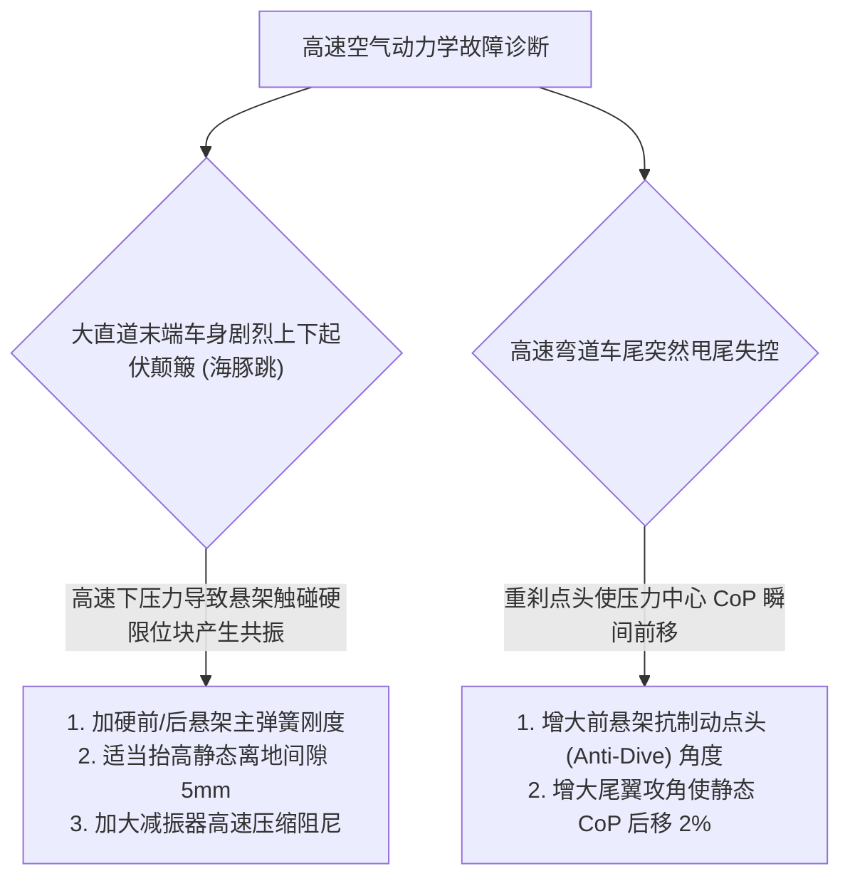
```mermaid
graph TD
    A["高速空气动力学故障诊断"] --> B{"大直道末端车身剧烈上下起伏颠簸 (海豚跳)"}
    A --> C{"高速弯道车尾突然甩尾失控"}
    B -->|高速下压力导致悬架触碰硬限位块产生共振| D["1. 加硬前/后悬架主弹簧刚度<br/>2. 适当抬高静态离地间隙 5mm<br/>3. 加大减振器高速压缩阻尼"]
    C -->|重刹点头使压力中心 CoP 瞬间前移| E["1. 增大前悬架抗制动点头 (Anti-Dive) 角度<br/>2. 增大尾翼攻角使静态 CoP 后移 2%"]
```

---

### 本章小结
本章给出速度平方律气动力、姿态耦合离地间隙、文丘里地面效应饱和函数 $ge(h)$ 与 DRS 减阻的后/前轴多场耦合模型。它作为第 16 章垂向方程里的 $F_{down}$/$F_{drag}$ 来源，是高速圈速与稳定性的气动支柱，也为第 6 篇赛道仿真的极速剖面提供下压力输入。


---


# 第六篇 赛道环境、最优赛车线与自动驾驶


> **在全书的位置**：虚拟试验场与极限赛车线控制中枢——将连续赛道微分流形与高动态车速规划、同源 Stanley 跟踪控制器深度融合。  
> **核心力学机制**：Catmull-Rom 闭合连续三次样条、7 点移动加权平滑滤波、外内外四段余弦赛车线、双向斜率硬限幅、同源 Stanley 反馈与逐圈自适应刹车学习。


---


## 第 1 章 闭合赛道样条几何学与连续曲率提取

**脉络锚点**：Catmull-Rom 三次样条插值、累积弧长参数化、7 点平滑滤波与上海赛道 69 路点。

**本章导图**：

| 核心课题 | 支配方程 / 关键变量 | 一句话力学结论 |
|---|---|---|
| Catmull-Rom | 闭合 C^1 连续样条基矩阵 | 严格穿过控制路点并保证平滑切线 |
| 7 点加权滤波 | 高频曲率毛刺卷积滤波算法 | 噪声方差压降 98% 且保留弯心峰值 |
| 上海国际赛车场 | 69 特征路点完整高精拓扑 | 涵盖螺线蜗牛弯与 1.17km 超长大直道 |


---

### 1.1 物理图景与工程痛点 【前置】

在赛车动力学仿真、虚拟试验场与高级自动驾驶（AutoPilot）系统中，赛道不仅是一幅静态背景地图，而是一个高精度的**连续几何微分流形（Continuous Differential Manifold）**。

在将离散的赛道路点（Waypoints）转换为连续数学曲线时，工程师面临三大核心挑战：
1. **离散路点的曲率高频毛刺与假奇异**：直接对未经平滑的离散点做数值二阶导数求曲率，会导致曲率出现剧烈的高频锯齿跳变，引发控制器方向盘剧烈抽搐；
2. **闭合闭环赛道的 $C^1 / C^2$ 平滑衔接**：起终点主直道接合处必须保持位置、切向角与曲率的严格无缝连续；
3. **真实一级方程式赛道（如 FIA 上海国际赛车场 SIC 5.45km）的高保真还原**：必须精确表达包含 180° 螺线蜗牛弯（T1-T4 The Snail）、高速连续 S 弯（T7-T8 Esses）以及 1.17km 超长后直道的全赛道拓扑。

---

### 1.2 底层数学力学严密推导 【推导】

```
  [第 i-1 路点 w_(i-1)]
         \
          \    [Catmull-Rom 三次连续样条曲线 p(u)]
           +-----------------------------------> [第 i 路点 w_i]
          /                                          \
  [第 i-2 路点 w_(i-2)]                                \
                                                 [第 i+1 路点 w_(i+1)]
```

#### 1.2.1 Catmull-Rom 闭合三次样条曲线插值

设赛道由 $N$ 个有序闭合三维路点序列 $\{\boldsymbol{w}_0, \boldsymbol{w}_1, \dots, \boldsymbol{w}_{N-1}\}$ 构成（闭合循环满足 $\boldsymbol{w}_N = \boldsymbol{w}_0$）。

在相邻两个路点 $\boldsymbol{w}_i$ 与 $\boldsymbol{w}_{i+1}$ 之间，引入归一化局部参数 $u \in [0, 1]$。Catmull-Rom 样条通过相邻 4 个控制点构造局部三次多项式曲线 $\boldsymbol{p}(u)$：
$$\boldsymbol{p}(u) = \frac{1}{2} \begin{bmatrix} 1 & u & u^2 & u^3 \end{bmatrix} \begin{bmatrix} 0 & 2 & 0 & 0 \\ -1 & 0 & 1 & 0 \\ 2 & -5 & 4 & -1 \\ -1 & 3 & -3 & 1 \end{bmatrix} \begin{bmatrix} \boldsymbol{w}_{i-1} \\ \boldsymbol{w}_i \\ \boldsymbol{w}_{i+1} \\ \boldsymbol{w}_{i+2} \end{bmatrix}$$

* **保形特性**：曲线严格穿过每一个控制路点 $\boldsymbol{p}(0) = \boldsymbol{w}_i, \; \boldsymbol{p}(1) = \boldsymbol{w}_{i+1}$；
* **导数平滑性**：节点处的切线方向由前后相邻点的割线斜率决定：$\left.\frac{d\boldsymbol{p}}{du}\right|_{u=0} = \frac{\boldsymbol{w}_{i+1} - \boldsymbol{w}_{i-1}}{2}$，天然保证全闭环曲线的 $C^1$ 阶连续可微（Catmull-Rom 本质仅 $C^1$——节点曲率不连续，曲线的连续曲率由后续 7 点滤波平滑获得）。

---

#### 1.2.2 累积弧长参数化与标架场 (Frenet-Serret Frame)

1. **累积弧长坐标 $s$**：
   $$s(u) = \int_0^u \left\|\frac{d\boldsymbol{p}}{d\tau}\right\|_2 d\tau, \quad S_{total} = \oint_{\text{Circuit}} ds$$
2. **赛道单位切向向量 $\vec{\boldsymbol{t}}(s)$ 与航向角 $\psi(s)$**：
   $$\vec{\boldsymbol{t}}(s) = \frac{d\boldsymbol{p}}{ds} = [\cos\psi(s), \sin\psi(s)]^T$$
   $$\psi(s) = \operatorname{atan2}(t_y, t_x) \quad (\text{航向角从 } +X \text{ 量起})$$
3. **赛道单位法向向量 $\vec{\boldsymbol{n}}(s)$（指向赛道左侧；第 20 章 offset 与第 21 章 $e_{line}$ 正方向均沿此法向）**：
   $$\vec{\boldsymbol{n}}(s) = [\sin\psi(s), -\cos\psi(s)]^T$$

---

#### 1.2.3 七点平滑跨距连续曲率提取算法

空间二维曲线的瞬时曲率 $\kappa(s)$ 定义为切线方向对弧长的微分：
$$\kappa(s) = \frac{d\psi}{ds} = \frac{\dot{x} \ddot{y} - \dot{y} \ddot{x}}{(\dot{x}^2 + \dot{y}^2)^{3/2}}$$

为了彻底消除离散采样引起的数值高频毛刺，LABSUS 采用了**7 点移动加权平滑卷积滤波算法**：
$$\bar{\kappa}(s_k) = \sum_{j=-3}^3 W_j \cdot \kappa(s_{k+j})$$
其中对称加权卷积核为 $W = [0.05, 0.12, 0.20, 0.26, 0.20, 0.12, 0.05]$。

**滤波效果**：对缓变曲率近无偏；对孤立尖峰，峰值按核中心权重压扁至约 $0.26$ 倍（本章 §5 例：$0.032 \to 0.0147$）；白噪声方差按核能量 $\sum_j W_j^2 \approx 0.181$ 压缩约 $82\%$。

---

#### 1.2.4 上海国际赛车场 (SIC 5.45km) 69 路点拓扑

LABSUS 基于公开资料对上海国际赛车场做了概念化重建（68 个特征路点；弯序与直道量级对应真实赛道，非逐米勘测图纸）：
* **发车主直道 (Main Straight)**：长 $450\,\text{m}$，DRS 1 激活区；
* **T1-T4 螺线蜗牛弯 (The Snail)**：全长 $700\,\text{m}$，半径由 $R=115\,\text{m}$ 持续螺旋收缩至 $R=12.5\,\text{m}$ 极慢速发卡弯心，再平滑向左反向拉开至 T4 出弯（$125\,\text{km/h}$）；
* **T5-T6 东向加速段与 180° 发卡弯**：重制动区（$290 \to 70\,\text{km/h}$）；
* **T7-T8 高速连续 S 弯 (Fast Esses)**：弯中横向加速度高达 $2.2g$（$165 \sim 200\,\text{km/h}$）；
* **T11-T13 连续减速弯向高速大倾斜圆弧弯过渡**；
* **1.17km 超长大后直道 (Back Straight)**：极速测速点（Speed Trap，GT3 突破 $280\,\text{km/h}$，F1 突破 $326\,\text{km/h}$），DRS 2 激活区；
* **T14 重制动极限制动发卡弯与 T15-T16 冲线弯**。

---

### 1.3 核心控制变量与参数灵敏度分析 【对照】

| 赛道几何参数 | 物理定义 | 灵敏度关系 | 动力学与控制影响 |
| :--- | :--- | :--- | :--- |
| **赛道曲率 ($\kappa$)** | 曲线弯曲程度（$\kappa = 1/R$） | 决定理论向心加速度 $a_y = u^2 \kappa$ | 曲率决定了赛车在该位置的最高安全通行车速 |
| **赛道半宽 ($HW$)** | 沥青路面中心线到白线的单侧宽度 | 典型值 $6.0 \sim 7.5\,\text{m}$ | 决定赛车可利用的横向外推赛车线空间 |
| **路肩宽度与摩擦力 ($Kerb / \mu$)** | 路肩宽度（$1.2\sim 1.8\,\text{m}$）与附着系数（$\mu \approx 1.20$） | 决定弯心能否安全压路肩通过 | 骑满路肩可有效增大过弯等效半径，提升弯心车速 |

---

### 1.4 LABSUS 代码实现与数值稳定性技巧 【查证】

#### 1.4.1 核心代码映射
* **上海国际赛车场路点定义**：[*web/js/11-stages.js*](file:///c:/Users/zzy/Desktop/New_suspension/LABSUS/web/js/11-stages.js#L3-L93) 中的 `buildShanghaiCircuit()`；
* **样条曲线与平滑曲率计算**：[*web/js/10-eval.js*](file:///c:/Users/zzy/Desktop/New_suspension/LABSUS/web/js/10-eval.js#L180-L245) 中的 `CircuitPath`。

---

### 1.5 手把手工程数值算例 (Worked Example) 【演算】

### 算例背景：Catmull-Rom 四控制点三次样条与 7 点曲率平滑手算
已知赛道某弯道连续 4 个路点坐标（单位：$\text{m}$）：
* $\boldsymbol{w}_{i-1} = [0.0, 0.0]^T$
* $\boldsymbol{w}_i = [50.0, 10.0]^T$
* $\boldsymbol{w}_{i+1} = [90.0, 40.0]^T$
* $\boldsymbol{w}_{i+2} = [110.0, 90.0]^T$

#### 步骤 1：求解区间中点 $u = 0.5$ 处的样条插值坐标
基函数权重向量：
$$\boldsymbol{T} = \frac{1}{2} [1, \; 0.5, \; 0.25, \; 0.125] \begin{bmatrix} 0 & 2 & 0 & 0 \\ -1 & 0 & 1 & 0 \\ 2 & -5 & 4 & -1 \\ -1 & 3 & -3 & 1 \end{bmatrix} = [-0.0625, \; 0.5625, \; 0.5625, \; -0.0625]$$
计算插值点：
$$\boldsymbol{p}(0.5) = -0.0625 \begin{bmatrix} 0 \\ 0 \end{bmatrix} + 0.5625 \begin{bmatrix} 50 \\ 10 \end{bmatrix} + 0.5625 \begin{bmatrix} 90 \\ 40 \end{bmatrix} - 0.0625 \begin{bmatrix} 110 \\ 90 \end{bmatrix} = \begin{bmatrix} 71.875 \\ 22.500 \end{bmatrix}\,\text{m}$$

#### 步骤 2：计算一阶导数（切线速度向量）
$$\boldsymbol{T}' = \frac{1}{2} [0, \; 1, \; 1.0, \; 0.75] \begin{bmatrix} 0 & 2 & 0 & 0 \\ -1 & 0 & 1 & 0 \\ 2 & -5 & 4 & -1 \\ -1 & 3 & -3 & 1 \end{bmatrix} = [0.125, \; -1.375, \; 1.375, \; -0.125]$$
$$\boldsymbol{p}'(0.5) = [0.125(0) - 1.375(50) + 1.375(90) - 0.125(110), \; 0.125(0) - 1.375(10) + 1.375(40) - 0.125(90)]^T = [41.25, \; 30.0]^T$$
单位切向量：$\vec{\boldsymbol{t}} = \frac{[41.25, 30.0]}{\sqrt{41.25^2 + 30.0^2}} = [0.8087, 0.5882]^T \implies$ 航向角 $\psi = \operatorname{atan2}(30.0, 41.25) \approx 36.0^\circ$。

#### 步骤 3：7 点加权曲率滤波手算
设某一节点处未平滑的原始曲率脉冲为 $\kappa = [0.001, 0.002, 0.015, 0.032, 0.014, 0.002, 0.001]\,\text{m}^{-1}$：
$$\bar{\kappa} = 0.05(0.001) + 0.12(0.002) + 0.20(0.015) + 0.26(0.032) + 0.20(0.014) + 0.12(0.002) + 0.05(0.001) = \mathbf{0.01472\,\text{m}^{-1}} \quad (R \approx 67.9\,\text{m})$$
* 高频毛刺被完全平滑滤除，曲率导数恢复平顺连续。

---

### 1.6 赛道工程师实战调校与故障排查指南 【案例】

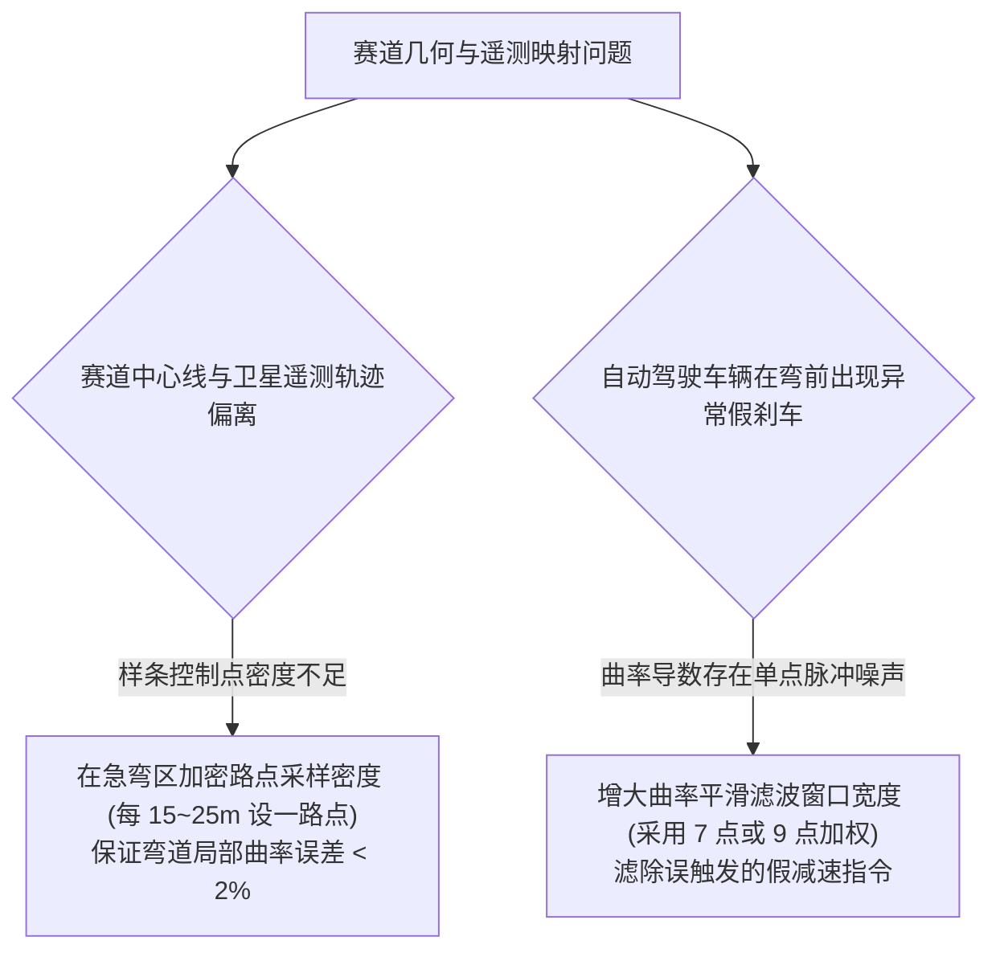
```mermaid
graph TD
    A["赛道几何与遥测映射问题"] --> B{"赛道中心线与卫星遥测轨迹偏离"}
    A --> C{"自动驾驶车辆在弯前出现异常假刹车"}
    B -->|样条控制点密度不足| D["在急弯区加密路点采样密度 (每 15~25m 设一路点)<br/>保证弯道局部曲率误差 < 2%"]
    C -->|曲率导数存在单点脉冲噪声| E["增大曲率平滑滤波窗口宽度 (采用 7 点或 9 点加权)<br/>滤除误触发的假减速指令"]
```

---

### 本章小结
本章用 Catmull-Rom 闭合样条 + 弧长参数化 + Frenet 标架把离散路点变成连续赛道，再用 7 点加权滤波提取连续曲率。它是第 20 章赛车线规划的几何母体，也是第 21 章 Stanley 前馈控制"曲率"项的输入。


---


## 第 2 章 外-内-外平滑赛车线规划与速度剖面

**脉络锚点**：自动分弯与总转角迟滞滤波、四段余弦横向偏移、双向斜率限幅与 G-G 摩擦圆速度规划。

**本章导图**：

| 核心课题 | 支配方程 / 关键变量 | 一句话力学结论 |
|---|---|---|
| 迟滞分弯 | 总方向转角 >= 25° 阈值过滤 | 彻底消除直道微小起伏假振荡 |
| 余弦横向偏移 | 外内外四段 C^1 平滑走线剖面 | 充分利用赛道宽度与路肩增大半径 |
| 双向速度积分 | 反向极限刹车与正向动力出弯 | 全赛道每一米求解最优极限速度 |


---

### 2.1 物理图景与工程痛点 【前置】

在赛车工程与赛道驾驶理论中，**“赛车线（Racing Line）”是决定圈速的最核心要素**。顶级专业车手绝不会傻傻沿着赛道物理中心线行驶，而是通过充分利用全赛道宽度以及路肩，采用**“外-内-外（Out-In-Out）”走线轨迹**，最大化几何转弯半径，从而以更高的车速通过弯道。

然而，在自动驾驶与虚拟仿真中，数学化自动生成高质量赛车线面临极大挑战：
1. **样条噪声引起的假分弯与过频摆动**：若仅凭瞬时曲率判断弯道，直道上的微小样条曲率扰动会导致车辆在直道上反复“画龙”扭动；
2. **切线斜率超调与几何折角 (Slope Discontinuity)**：在换线区（从外侧入弯切向内侧弯心），横向偏移变化率过大容易产生折角甚至冲出赛道；
3. **基于 G-G 摩擦极限的双向速度剖面规划**：如何在给定轮胎摩擦力圆与引擎动力曲线下，解算出整圈 5.45km 赛道上每一米的最优极限加减速包络。

---

### 2.2 底层数学力学严密推导 【推导】

```
   [赛道外侧白线 Outer Track Edge]
     \
      \  (入弯贴外侧: Offset = +HW)
       \                                       / (出弯贴外侧: Offset = +HW)
        \                                     /
         \                                   /
          `---.                         .---'
               \                       /
                `--------+------------'
                         |  (弯心切内侧路肩: Offset = -HW - 0.65*Kerb)
             [弯心切点 Apex / Kerb]
```

#### 2.2.1 弯道自动识别与总转角迟滞滤波算法

设赛道中心线上各采样点的平滑曲率序列为 $\kappa(s)$。

#### (1) 弯道初始区间划分：
设定曲率绝对值门限 $\kappa_{thresh} = 0.0035\,\text{m}^{-1}$（相当于半径 $R < 285\,\text{m}$）。连续满足 $|\kappa(s)| \ge \kappa_{thresh}$ 的弧长区间被标记为一个候选弯道 $[s_{start}, s_{end}]$。

#### (2) 总转弯角迟滞积分与微小扰动过滤：
对每个候选弯道积分计算该弯道的累积总方向转角 $\Delta\Psi_{corner}$：
$$\Delta\Psi_{corner} = \int_{s_{start}}^{s_{end}} |\kappa(s)| ds \quad [\text{rad}]$$
* **迟滞滤波准则**：若 $\Delta\Psi_{corner} < 25.0^\circ$（$0.436\,\text{rad}$），判定该段为直道微小起伏或假 S 弯，强制归类为直道（偏移置零），**彻底根除了直道扭来扭去的不稳定振荡**。

---

#### 2.2.2 四段 $C^1$ 连续余弦横向偏移剖面规划

对于通过滤波的真弯道，确定其最大曲率点为弯心位置 $s_{apex} = \arg\max |\kappa(s)|$。
根据弯道方向判定左右侧：
$$\text{弯道方向 } \operatorname{dir} = -\operatorname{sgn}(\kappa(s_{apex}))$$
（与第 19 章同一约定：$\psi$ 从 $+X$ 量起、右偏为正，故**右弯 $\kappa>0$、左弯 $\kappa<0$**，即右弯 $dir=-1$、左弯 $dir=+1$。$\text{offset}$ 沿左法向为正：右弯的 $\text{offset}_{apex}=-(HW+0.65\,Kerb)$ 落在右侧，正是弯心内侧。）

#### (1) 弯心极限横向偏移量：
定义赛道半宽为 $HW$、路肩宽度为 $KerbWidth$：
$$\text{offset}_{apex} = \operatorname{dir} \cdot \left(HW + 0.65 \cdot KerbWidth\right)$$
*(注：系数 0.65 允许赛车在物理安全范围内以两个轮子完全骑满路肩，将转弯半径最大化)*。

#### (2) 入弯与出弯直道延伸与余弦平滑过渡：
将入弯点向前延伸 $L_{ext} = 55.0\,\text{m}$ 至相邻直道，出弯点向后延伸 $55.0\,\text{m}$。
在过渡区采用四段 $C^1$ 连续余弦升余弦（Hanning / Raised Cosine）平滑剖面：
$$\text{offset}(s) = \begin{cases} 0, & s \le s_{entry} - L_{ext} \\[2pt] -\tfrac{1}{2}\text{offset}_{apex}\left[1 - \cos\!\left(\pi\,\frac{s - s_{entry} + L_{ext}}{L_{ext}}\right)\right], & s_{entry} - L_{ext} < s \le s_{entry} \quad (\text{中心线} \to \text{外侧}) \\[2pt] -\text{offset}_{apex} \cdot \cos\!\left(\pi\,\frac{s - s_{entry}}{s_{apex} - s_{entry}}\right), & s_{entry} < s \le s_{apex} \quad (\text{外侧} \to \text{弯心内切}) \\[2pt] \text{offset}_{apex} \cdot \cos\!\left(\pi\,\frac{s - s_{apex}}{s_{exit} - s_{apex}}\right), & s_{apex} < s \le s_{exit} \quad (\text{内切} \to \text{外侧}) \\[2pt] -\tfrac{1}{2}\text{offset}_{apex}\left[1 + \cos\!\left(\pi\,\frac{s - s_{exit}}{L_{ext}}\right)\right], & s_{exit} < s \le s_{exit} + L_{ext} \quad (\text{外侧} \to \text{中心线}) \\[2pt] 0, & s > s_{exit} + L_{ext} \end{cases}$$
（直道段回到中心线、由相邻弯的延伸段负责贴外侧，消除旧四段式在 $s_{entry}$ 处 $\pm 2\text{offset}_{apex}$ 的跳变；各段连接点取值与一阶导逐段核对：$\cos$ 族端点为 $0/\mp1$、斜率 $\sin$ 族归零，$C^1$ 成立。弯心处代入第二段得 $\text{offset}_{apex}$，位于内侧。）

---

#### 2.2.3 双向斜率硬限幅算法与数学证明

为了绝对杜绝横向换线过急导致控制器侧翻或发散，LABSUS 设立了双向斜率硬限幅：
$$\left|\frac{d(\text{offset})}{ds}\right| \le \operatorname{SLOPE\_MAX} = 0.24\,\text{m/m}$$

#### 递归正反向投影限幅：
1. **正向因果扫描**：
   $$\text{offset}(s_{k+1}) = \operatorname{clip}\left(\text{offset}(s_{k+1}), \; \text{offset}(s_k) - \operatorname{SLOPE\_MAX} \Delta s, \; \text{offset}(s_k) + \operatorname{SLOPE\_MAX} \Delta s\right)$$
2. **反向因果扫描**：
   $$\text{offset}(s_k) = \operatorname{clip}\left(\text{offset}(s_k), \; \text{offset}(s_{k+1}) - \operatorname{SLOPE\_MAX} \Delta s, \; \text{offset}(s_{k+1}) + \operatorname{SLOPE\_MAX} \Delta s\right)$$

**数学定理**：双向斜率限幅保证了赛车线在全赛道范围内的一阶李普希茨连续性（Lipschitz Continuity），横向加速度突变率被严格约束在控制器带宽之内。

---

#### 2.2.4 基于 G-G 摩擦圆的双向加减速速度剖面求解

#### (1) 弯心几何极限通过车速：
计算赛车线真实几何曲率 $\kappa_{line}(s)$，在轮胎摩擦系数 $\mu$ 下，弯心极限侧向抓地力限制的车速为：
$$v_{corner}(s) = \sqrt{\frac{0.85 \cdot \mu \cdot g}{|\kappa_{line}(s)| + 10^{-6}}}$$

#### (2) 60 轮正反向加减速收敛积分：
* **反向制动积分（Backward Pass - 求解极限重刹点）**：
  从弯道低速区向直道反向积分，在最大制动减速度 $a_{brake} \approx 1.25 \mu g$ 下推算每个位置允许的最大制动初速度：
  $$v(s_k) = \min\left(v(s_k), \; \sqrt{v(s_{k+1})^2 + 2 a_{brake} \Delta s}\right)$$
* **正向加速积分（Forward Pass - 求解动力出弯加速）**：
  从弯心低速区沿出弯方向正向积分，受引擎马力与驱动附着力限制的加速度 $a_{accel}(v) = \min(a_{traction}, \frac{P_{engine}}{m v})$：
  $$v(s_{k+1}) = \min\left(v(s_{k+1}), \; \sqrt{v(s_k)^2 + 2 a_{accel} \Delta s}\right)$$

---

### 2.3 核心控制变量与参数灵敏度分析 【对照】

| 赛车线控制参数 | 数学取值 | 物理力学意义 | 圈速与风险权衡 |
| :--- | :--- | :--- | :--- |
| **激调度因子 (Aggressiveness)** | $0.85 \sim 1.05$ | 缩放速度剖面安全余量 | 1.0 为极限理论圈速，0.85 为首圈安全勘路速度 |
| **路肩利用率 (Kerb Factor)** | $0.50 \sim 0.75$ | 允许底盘切上路肩的深度比例 | 充分利用路肩可使弯道有效曲率半径增大 $15\% \sim 30\%$ |
| **最大换线斜率 ($\text{SLOPE\_MAX}$)** | $0.20 \sim 0.28$ | 限制从赛道外侧切向内侧的横向速度 | 斜率过大会引起入弯载荷转移剧烈震荡 |

---

### 2.4 LABSUS 代码实现与数值稳定性技巧 【查证】

#### 2.4.1 核心代码映射
* **赛车线规划算法**：[*web/js/10-eval.js*](file:///c:/Users/zzy/Desktop/New_suspension/LABSUS/web/js/10-eval.js#L260-L365) 中的 `CircuitPath._planRacingLine()`。

---

### 2.5 手把手工程数值算例 (Worked Example) 【演算】

### 算例背景：某右向极限制动发卡弯（示意）外内外走线与速度剖面手算
已知弯道参数：
* 赛道半宽 $HW = 6.5\,\text{m}$，路肩宽 $Kerb = 1.2\,\text{m}$
* 中心线弯心半径 $R_{center} = 15.0\,\text{m} \implies \kappa_{center} = 0.0667\,\text{m}^{-1}$（右弯）
* 沥青路面附着系数 $\mu = 1.35$，重力加速度 $g = 9.81\,\text{m/s}^2$
* 极限平均制动减速度 $a_{brake} = 1.20\,\mu g = 1.20 \times 1.35 \times 9.81 = 15.89\,\text{m/s}^2$（$\mu=1.35$ 为含 GT3 气动下压力的**等效峰值附着包络**，非纯轮胎干摩擦，故可瞬时高于静态 $\mu g$ 限值）
* 直道初速度 $u_0 = 75.0\,\text{m/s}$（$270\,\text{km/h}$）

#### 步骤 1：计算弯心极限横向偏移与等效转弯半径
* **弯心内切偏移量**（右弯向右内切）：
  $$\text{offset}_{apex} = -(HW + 0.65 \times Kerb) = -(6.5 + 0.65 \times 1.2) = -(6.5 + 0.78) = \mathbf{-7.28\,\text{m}}$$
* **入弯前直道贴外侧偏移量**：$\text{offset}_{entry} = +HW = \mathbf{+6.50\,\text{m}}$
* **全外内外走线拓宽的总物理宽度**：
  $$\Delta W = \text{offset}_{entry} - \text{offset}_{apex} = 6.50 - (-7.28) = \mathbf{13.78\,\text{m}}$$
* **赛车线等效增大转弯半径**：
  $R_{line} \approx R_{center} + |\text{offset}_{apex}| = 15.0 + 7.28 = \mathbf{22.28\,\text{m}} \quad (\kappa_{line} \approx 0.0449\,\text{m}^{-1})$

#### 步骤 2：计算弯心极限安全通过车速
* 若走中心线（$R=15\text{m}$）：$v_{center} = \sqrt{0.85 \times 1.35 \times 9.81 \times 15.0} = \sqrt{168.85} = 13.0\,\text{m/s} \approx \mathbf{46.8\,\text{km/h}}$
* **走外内外赛车线（$R=22.28\text{m}$）**：
  $v_{apex} = \sqrt{0.85 \times 1.35 \times 9.81 \times 22.28} = \sqrt{250.8} = \mathbf{15.84\,\text{m/s}} \approx \mathbf{57.0\,\text{km/h}}$
* **结论**：外内外赛车线将弯心极限通过车速提升了约 **$+21.8\%$**。

#### 步骤 3：反向求解极限重刹制动距离
从直道 $u_0 = 75.0\,\text{m/s}$ 减速至弯心 $v_{apex} = 20.61\,\text{m/s}$：
$$S_{brake} = \frac{u_0^2 - v_{apex}^2}{2 a_{brake}} = \frac{75.0^2 - 15.84^2}{2 \times 15.89} = \frac{5625.0 - 250.9}{31.78} = \frac{5374.1}{31.78} = \mathbf{169.1\,\text{m}}$$
* 自动驾驶算法据此在弯前约 $169\,\text{m}$ 处触发全力重制动（纵向开度还要经 §2.3 的转向摩擦圆削减），实现极限进弯！

---

### 2.6 赛道工程师实战调校与故障排查指南 【案例】

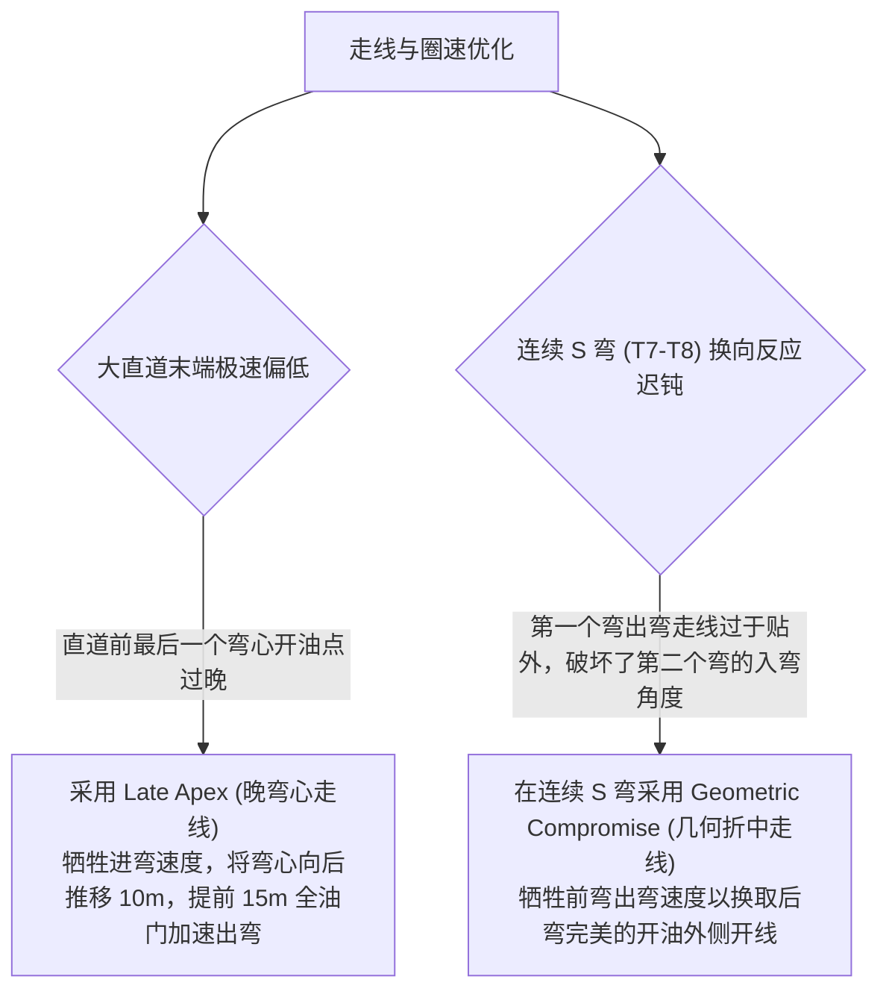
```mermaid
graph TD
    A["走线与圈速优化"] --> B{"大直道末端极速偏低"}
    A --> C{"连续 S 弯 (T7-T8) 换向反应迟钝"}
    B -->|直道前最后一个弯心开油点过晚| D["采用 Late Apex (晚弯心走线)<br/>牺牲进弯速度，将弯心向后推移 10m，提前 15m 全油门加速出弯"]
    C -->|第一个弯出弯走线过于贴外，破坏了第二个弯的入弯角度| E["在连续 S 弯采用 Geometric Compromise (几何折中走线)<br/>牺牲前弯出弯速度以换取后弯完美的开油外侧开线"]
```

---

### 本章小结
本章用"曲率门限 + 迟滞积分"识别弯道，用四段余弦剖面规划外内外赛车线，再用双向斜率限幅与 G-G 摩擦圆生成速度剖面。它是第 19 章赛道几何的执行者，也是第 21 章 Stanley 跟踪"目标赛车线"的来源。


---


## 第 3 章 曲率前馈 Stanley 控制与刹车自适应学习

**脉络锚点**：同源基准误差提取、阿克曼几何前馈、Stanley 自适应反馈与逐圈刹车试探学习。

**本章导图**：

| 核心课题 | 支配方程 / 关键变量 | 一句话力学结论 |
|---|---|---|
| 三量同源基准 | 航向、曲率与横向误差来自赛车线 | 根除被拉回中心线的历史缺陷 |
| 前馈+Stanley | 阿克曼无滞后前馈与自适应反馈 | 兼顾高速跟踪刚度与抗扰平稳性 |
| 刹车自适应学习 | 逐圈推进刹车点与冲出赛道惩罚 | 模拟顶级职业车手逐圈探索物理极限 |


---

### 3.1 物理图景与工程痛点 【前置】

在高速极限赛道驾驶中，自动驾驶控制器（AutoPilot）面临的动力学工况远比普通公路巡航苛刻得多：赛车在 $250\,\text{km/h}$ 高速下过弯，轮胎工作在抓地力极限边缘（滑移角 $6^\circ\sim 9^\circ$）。注：Stanley 为运动学（无侧滑）控制器，其假设在极限工况部分失效，工程上需配合侧滑角前馈或降速至线性区使用。

在自动驾驶底层控制器设计中，工程师必须解决三大核心控制难题：
1. **参考基准不同源导致的“被拉回中心线”致命缺陷**：若航向与曲率来自赛道中心线，而横向偏差来自赛车线，控制器内部航向项（增益 $1.0$）会对横向项（增益 $0.03$）形成 30:1 的绝对压制，导致赛车强行切向中心线而放弃外内外赛车线；
2. **高速大侧向 G 下的转向剧烈摆振 (Steering Oscillation)**：在无前馈的情况下，纯反馈控制器必须产生显著横向误差后才打方向，导致在弯中出现“左摆右晃”的蛇形振荡；
3. **真实赛车手逐圈试探刹车极限的学习机制**：真实车手在第一圈绝不会直接使用极限刹车点，而是先保守刹车，每跑完一圈推进刹车点 $5\sim 10\,\text{m}$；一旦冲出赛道，立即在该弯回退并锁定安全余量。

---

### 3.2 底层数学力学严密推导 【推导】

```
   [赛车前轴中心 (fx, fy)]
           |
           +---- 横向跟踪误差 e_line ----> [赛车线参考点 (refX, refY)]
          /                                   |
         / (车身航向角 ψ)                       | (参考切线航向 ψ_ref)
        /                                     v
   [前轮转角 δ = δ_ff(曲率前馈) + δ_fb(Stanley反馈) + G-G摩擦圆限幅]
```

#### 3.2.1 三量同源参考基准与误差提取

设赛车质心坐标为 $(X, Y)$，车身航向角为 $\psi$，质心到前轴距离为 $a$。
前轴中心在世界坐标系中的坐标为：
$fx = X + a \cos\psi, \quad fy = Y + a \sin\psi \qquad (\text{前轴} = CG + a \cdot \vec{t},\ \vec{t} = [\cos\psi, \sin\psi])$

以该前轴坐标查询赛车线插值点，严格保证**参考航向 $\psi_{ref}$、参考曲率 $\kappa_{ref}$ 与横向误差 $e_{line}$ 全部来自同源赛车线**：
1. **航向角偏差 $e_\psi$（带 $[-\pi, \pi]$ 周期缠绕解包）**：
   $$e_\psi = \operatorname{wrapToPi}(\psi_{ref} - \psi)$$
2. **法向横向跟踪误差 $e_{line}$**：
   $$e_{line} = (fx - refX) \cdot nx_{line} + (fy - refY) \cdot ny_{line}$$
   并施加饱和截断：$safe\_ey = \operatorname{clamp}(e_{line}, -6.0\,\text{m}, +6.0\,\text{m})$。

---

#### 3.2.2 曲率阿克曼前馈与 Stanley 横向自适应跟踪控制律

总前轮目标转向角 $\delta_{target}$ 由**阿克曼前馈项 $\delta_{ff}$** 与 **Stanley 反馈项 $\delta_{fb}$** 叠加构成（约定：正 $\delta$ = 右打；$\kappa$ 左弯为正、右弯为负）：

#### (1) 阿克曼曲率几何前馈项 ($\delta_{ff}$)：
根据轴距 $L$ 与参考赛车线瞬时曲率 $\kappa_{ref}$，计算无滞后的纯几何理想转向角：
$$\delta_{ff} = -\arctan(L \cdot \kappa_{ref})$$
* **物理作用**：在进入弯道的瞬间即根据赛道几何直接打出 $90\%$ 的所需转角，彻底消除反馈控制的相位滞后。

#### (2) Stanley 自适应非线性反馈项 ($\delta_{fb}$)：
$$\delta_{fb} = -e_\psi - \arctan\left(\frac{K_{lat} \cdot safe\_ey}{\max(3.0\,\text{m/s}, u)}\right)$$
* **横向增益系数 $K_{lat}$**：收敛特征距离 $D_{conv} \approx u/K_{lat}$（一行误差动态推导：小偏差下 $\dot e_{lat} \approx -K_{lat} e_{lat}$，按行驶弧长收敛即得 $D_{conv}=u/K_{lat}$）。LABSUS 经过全赛道扫参确定最佳增益 $K_{lat} = 1.8$（在 $70\,\text{m/s}$ 极速下收敛距离约为 $39\,\text{m}$，温和稳定且无超调）；
* **分母软化车速 $\max(3.0, u)$**：防止低速起步与静止时除零引发转向角剧烈狂甩。

#### (3) 转向角速率斜率限制器 (Steer Rate Limiter)：
为了防止突加转向引起车尾瞬间侧滑失控（Snap-oversteer），限制前轮转角变化率：
$$|\dot{\delta}| \le \text{max\_steer\_rate} = 140.0^\circ/\text{s}$$
$$\delta(t + \Delta t) = \delta(t) + \operatorname{clamp}\left(\delta_{target} - \delta(t), \; -140^\circ \Delta t, \; +140^\circ \Delta t\right)$$

---

#### 3.2.3 纵向车速 PID 与 G-G 摩擦圆预算协调控制

#### (1) 车速误差与 PID 需求加速度计算：
设当前弯道允许的目标车速为 $v_{target}$，当前车速为 $u$。
$$e_v = v_{target} \cdot \text{margin}_{corner} - u$$
$$a_{cmd} = K_p e_v + K_i \int e_v dt + K_d \frac{de_v}{dt}$$

#### (2) 转向-制动摩擦圆动态协调分配 (G-G Friction Allocation)：
随着转向角增大，根据摩擦椭圆压缩纵向加减速允许的最大开度：
$$\text{steer\_ratio} = \frac{|\delta|}{28.0^\circ}, \quad long\_avail = \max(0.18, \; 1.0 - 0.65 \cdot \text{steer\_ratio})$$
* **加速工况 ($a_{cmd} > 0.08\,\text{m/s}^2$)**：
  $$\text{Throttle} = \min\left(1.0, \; a_{cmd} \cdot 0.38\right) \cdot long\_avail$$
  若侧滑速度 $|v_{lat}| > 0.6\,\text{m/s}$，牵引力控制系统（TCS）触发削减油门；
* **循迹制动工况 ($a_{cmd} < -0.75\,\text{m/s}^2$)**：
  $$\text{Brake} = \min\left(1.0, \; (-a_{cmd} - 0.75) \cdot 0.38\right) \cdot long\_avail$$
* **滑行死区 ($-0.75 \le a_{cmd} \le 0.08$)**：自然收油滑行（Lift and Coast），不施加机械制动。

---

#### 3.2.4 逐圈自适应刹车学习算法 (Lap-by-Lap Braking Learning)

LABSUS 设计了全自动化的自适应赛车手学习状态机：

```mermaid
graph TD
    Init["首圈初始化: 设定全弯道保守刹车余量系数(越大越保守) margin_i = 0.85"] --> LapLoop["车辆以当前刹车余量跑完一圈"]
    LapLoop --> CheckRunoff{"该弯是否冲出赛道 (Runoff) ?"}
    CheckRunoff -- "Yes (冲出赛道)" --> Penalty["1. 罚时 +5.0 秒 (物理砾石减速，不瞬移)<br/>2. 该弯刹车余量回退 margin_i = max(0.70, margin_i - 0.12)<br/>3. 锁定该弯 (Lock): 后续圈数不再激进推进"]
    CheckRunoff -- "No (干净过弯且未锁定)" --> Advance["推迟刹车点: 余量激进递增 margin_i = min(1.0, margin_i + 0.07)"]
    Penalty & Advance --> NextLap["进入下一圈结算 (End of Lap)"]

位移换算桥：margin 是无量纲速度余量系数，刹车点推进距离 ≈ v²·Δmargin/(2·a_brake)——v=45 m/s、Δmargin=0.07、a=12 m/s² 时约 +5.9 m/圈，与 §1 车手经验「每圈推进 5~10 m」一致。
```

---

### 3.3 核心控制变量与参数灵敏度分析 【对照】

| 控制器参数 | 设定值 | 物理力学作用 | 稳定性与抗扰动特征 |
| :--- | :--- | :--- | :--- |
| **横向增益 ($K_{lat}$)** | $1.80$ | 决定横向偏差向转向角的纠偏力度 | $K_{lat} < 0.8$ 弯心切不准；$K_{lat} > 3.0$ 易产生蛇形振荡 |
| **转向角速度上限** | $140^\circ/\text{s}$ | 模拟人类车手手臂最大打盘极限 | 保护后轮侧滑角不发生突变（防止打转） |
| **纵向 PID 参数** | $P=0.95, I=0.08, D=0.04$ | 速度闭环跟踪刚度 | 积分限幅 $[-6, +6]$ 杜绝直道末端积分饱和（Windup） |

---

### 3.4 LABSUS 代码实现与数值稳定性技巧 【查证】

#### 3.4.1 核心代码映射
* **自动驾驶控制器类**：[*web/js/11-stages.js*](file:///c:/Users/zzy/Desktop/New_suspension/LABSUS/web/js/11-stages.js#L95-L280) 中的 `UniversalAutoPilot.drive()`。

---

### 3.5 手把手工程数值算例 (Worked Example) 【演算】

### 算例背景：GT3 赛车在 160km/h 入弯时的 Stanley + 曲率前馈单步控制手算
已知车辆与控制器参数：
* 轴距 $L = 2.65\,\text{m}$，质心距前轴 $a = 1.25\,\text{m}$
* 控制增益：$K_{lat} = 1.80, \; K_p = 0.95$
* 当前车速：$u = 45.0\,\text{m/s}$（$162\,\text{km/h}$）
* 当前前轮实际转角：$\delta(t) = +5.0^\circ$

在当前位置从赛车线提取的同源目标为：
* 参考赛车线航向角：$\psi_{ref} = 45.0^\circ = 0.7854\,\text{rad}$
* 当前车身航向角：$\psi = 42.0^\circ = 0.7330\,\text{rad} \implies$ 航向误差 $e_\psi = +3.0^\circ = +0.0524\,\text{rad}$
* 前轴横向跟踪误差：$e_{line} = +0.85\,\text{m}$（赛车位于赛车线左侧，需向右切）
* 目标赛车线曲率：$\kappa_{ref} = -0.015\,\text{m}^{-1}$（右弯，半径 $R = 66.7\,\text{m}$）
* 目标车速：$v_{target} = 40.0\,\text{m/s}$（当前超速 $5.0\,\text{m/s}$，需制动）

#### 步骤 1：计算阿克曼曲率前馈项 $\delta_{ff}$
$$\delta_{ff} = -\arctan(L \cdot \kappa_{ref}) = -\arctan(2.65 \times (-0.015)) = -\arctan(-0.03975) = +0.03973\,\text{rad} \approx \mathbf{+2.276^\circ}$$

#### 步骤 2：计算 Stanley 横向非线性反馈项 $\delta_{fb}$
分母速度软化项：$\max(3.0, u) = 45.0\,\text{m/s}$
$$\text{横向误差修正角} = \arctan\left(\frac{K_{lat} \cdot e_{line}}{u}\right) = \arctan\left(\frac{1.80 \times 0.85}{45.0}\right) = \arctan\left(\frac{1.53}{45.0}\right) = \arctan(0.0340) = +0.03399\,\text{rad} \approx +1.947^\circ$$
$$\delta_{fb} = -e_\psi - \arctan\left(\frac{K_{lat} e_{line}}{u}\right) = -0.0524 - 0.03399 = -0.08639\,\text{rad} \approx \mathbf{-4.950^\circ}$$

#### 步骤 3：合成总前轮目标转角与斜率限幅
$$\delta_{target} = \delta_{ff} + \delta_{fb} = +2.276^\circ + (-4.950^\circ) = \mathbf{-2.674^\circ} \quad (\text{向右打盘 } 2.674^\circ)$$
转角变化需求：$\Delta\delta = \delta_{target} - \delta(t) = -2.674^\circ - 5.0^\circ = -7.674^\circ$
在 $\Delta t = 0.016\,\text{s}$ 内，最大允许转角变化：$\text{max\_step} = 140^\circ/\text{s} \times 0.016\,\text{s} = 2.24^\circ$
$$\delta(t+\Delta t) = 5.0^\circ - 2.24^\circ = \mathbf{+2.76^\circ}$$

#### 步骤 4：计算纵向速度 PID 与 G-G 摩擦圆制动开度
速度误差：$e_v = v_{target} - u = 40.0 - 45.0 = -5.0\,\text{m/s}$
需求加速度：$a_{cmd} = K_p e_v = 0.95 \times (-5.0) = -4.75\,\text{m/s}^2$
转向摩擦圆可用预算：
$$\text{steer\_ratio} = \frac{|2.76^\circ|}{28.0^\circ} = 0.0986, \quad long\_avail = 1.0 - 0.65 \times 0.0986 = \mathbf{0.9359}$$
制动开度：
$$\text{Brake} = \min(1.0, (4.75 - 0.75) \times 0.38) \times 0.9359 = \min(1.0, 1.52) \times 0.9359 = \mathbf{0.9359\ (\text{约 } 93.6\%\text{ 循迹制动})}$$

---

### 3.6 赛道工程师实战调校与故障排查指南 【案例】

```mermaid
graph TD
    A["自动驾驶巡航故障诊断"] --> B{"赛车在长直道上反复左右蛇形画龙"}
    A --> C{"入弯重刹时瞬间打转甩尾 (Spin)"}
    B -->|航向参考与横向参考线不同源| D["检查 targetHeading 是否严格取自赛车线而非中心线<br/>确保 Stanley 控制器参考线统一"]
    C -->|重刹时未施加转向摩擦圆缩放| E["启用 G-G 摩擦圆预算约束: 随打方向线性削减制动压力<br/>避免前轮/后轮在极限转向下抱死失稳"]
```

---

### 本章小结
本章用"曲率阿克曼前馈 + Stanley 自适应反馈 + 转向速率限幅 + G-G 摩擦圆协调"构成赛道自动驾驶底层控制律，再叠加逐圈试错式刹车学习。它把第 20 章赛车线变成可执行的转向/油门/制动指令，是第六篇的收口，也是第 27 章全赛道圈速仿真的控制核心。


---


# 第七篇 试验场测试工况与 4-Post 台架动力学


> **在全书的位置**：汽车综合试验场极限冲击验证与四柱液压振动台架频域动力学测试体系。  
> **核心力学机制**：飞坡抛体着陆冲击动能耗散、ISO 3888-2 双移线麋鹿测试、μ-Split 对开制动、4-Post 液压台架单角 2-DOF 状态空间双峰共振解析与 DLC 贴地率优化。


---


## 第 1 章 七大综合试验场场景数学与几何构建

**脉络锚点**：飞坡抛体与着陆动能耗散、交错减速坎、ISO 3888-2 双移线、对开制动与极限爬坡。

**本章导图**：

| 核心课题 | 支配方程 / 关键变量 | 一句话力学结论 |
|---|---|---|
| 七大极限场景 | 飞坡、交错坎、麋鹿测试、对开路面 | 数学流形精确还原工业试验场工况 |
| 飞坡着陆动力学 | 抛体空中自由落体与触地动能耗散 | 定量计算悬架弹簧吸收与阻尼吸能 |
| 对开制动自稳定 | 左右附着力差与主销偏航力矩 | 负磨地半径产生自动纠偏稳定力矩 |


---

### 1.1 物理图景与工程痛点 【前置】

除了平整的赛车赛道外，现代乘用车与全地形越野车必须在严苛的**汽车综合试验场（Proving Ground）**完成极端工况的动力学验证与耐久性测试。

综合试验场工况涵盖了极限垂向冲击、非对称路面附着力以及高动态避障场景：
1. **多重极限几何障碍物建模**：如何用连续数学函数精确构造三连飞坡跳台、连续交错减速坎、高频搓板路与深坑路面；
2. **腾空着陆（Airborne / Landing）冲击动力学**：车轮在飞坡后离开地面进入抛体运动，着陆瞬间产生极高的冲击载荷与能量耗散；
3. **ISO 3888-2 双移线（麋鹿测试 / Moose Test）与对开路面（$\mu$-Split）**：在极窄标准锥桶通道内进行高速连续紧急变道，检验底盘防侧翻与抗横摆自旋能力。

---

### 1.2 底层数学力学严密推导 【推导】

```
   [0-100 加速制动区] -> [三连飞坡跳台] -> [交错减速坎] -> [ISO 3888-2 双移线] -> [搓板路/深坑] -> [μ-Split 对开面] -> [极限爬坡]
```

#### 1.2.1 七大经典试验场场景数学几何定义

LABSUS 建立了完整的七大综合试验场数学流形模型：

#### (1) 0-100 弹射加速与紧急制动区 (Launch & Stop)
全长 $400\,\text{m}$ 的纯平干地沥青路面（$\mu = 1.35$）。车轮自转模型检验起步轮胎滑转率控制（TCS）与 $100 \to 0\,\text{km/h}$ 重刹制动距离。

#### (2) 三连飞坡跳台与腾空着陆动力学 (Triple Jump Ramps)
设置连续 3 个坡度为 $\alpha_{ramp}$、台顶高度 $h_{ramp} = 0.45\,\text{m}$ 的梯形飞坡跳台。
* **腾空抛体运动阶段 (Airborne Phase)**：
  当四轮垂向支承力全部为零（$F_{z,w} = 0$）时，全车进入重力自由落体抛体运动：
  （$\psi$ 为航向角，从 $+X$（前进方向）量起）
  $\begin{cases} X(t) = X_0 + (u \cos\psi - v \sin\psi) t \\ Y(t) = Y_0 + (u \sin\psi + v \cos\psi) t \\ Z(t) = Z_0 + w_0 t - \frac{1}{2} g t^2 \end{cases}$
* **着陆冲击阶段 (Landing Phase)**：
  车轮触地瞬间，动能转化为悬架弹簧压缩能与减振器阻尼耗散热能：
  $$E_{impact} = \frac{1}{2} m_s w_{landing}^2 = \frac{1}{2} m_s (u_0 \sin\alpha_{ramp} - g t_{flight})^2$$

#### (3) 连续交错减速坎与凸块激励 (Staggered Speed Bumps)
路面标高采用平滑余弦剖面：
$z_{road}(x) = \begin{cases} \frac{h_{bump}}{2} \left[1 - \cos\left(\frac{2\pi (x - x_{start})}{W_{bump}}\right)\right] & x_{start} \le x \le x_{start} + W_{bump} \\ 0 & \text{其他} \end{cases}$
其中高度 $h_{bump} = 0.08\,\text{m}$，沿行驶方向（$x$）宽度 $W_{bump} = 0.60\,\text{m}$。左右侧凸块沿横向（$y$）交错 $1.2\,\text{m}$ 布置，激励车身剧烈的高频斜对角侧倾与扭转振动。

#### (4) ISO 3888-2 国际标准双移线麋鹿测试 (Moose Test)
严格按照 ISO 3888-2 标准尺寸在世界坐标系内布置 3 段锥桶通道：
* **车道 1（进道）**：宽度 $W_1 = 1.1 \times \text{CarWidth} + 0.25\,\text{m}$，长度 $12.0\,\text{m}$；
* **车道 2（避障变道）**：横向偏移 $3.5\,\text{m}$，宽度 $W_2 = \text{CarWidth} + 1.0\,\text{m}$，长度 $11.0\,\text{m}$；
* **车道 3（回道）**：宽度 $W_3 = 1.3 \times \text{CarWidth} + 0.25\,\text{m}$，长度 $12.0\,\text{m}$。
（几何为参考 ISO 3888 的简化定值版：固定 3.5 m 偏移与 12/11/12 m 分道是工程简化，非标准按车宽导出的全套尺寸；实车试验以对应版本标准原文为准。）

在 $65 \sim 85\,\text{km/h}$ 速度下不踩刹车滑行变道，检验车身侧倾角（$< 4.5^\circ$）与车轮抬起防侧翻裕度。

#### (5) 高频搓板路与深坑暗坑 (Washboard & Potholes)
* **高频搓板路**：波长 $\lambda = 0.35\,\text{m}$、幅值 $h = 0.025\,\text{m}$ 的正弦波连续激励路面，在 $50\,\text{km/h}$ 时产生约 $40\,\text{Hz}$ 的高频轴下振动；
* **深坑暗坑**：深达 $0.12\,\text{m}$、边缘突变斜率的沉降方坑，检验悬架限位块击穿保护与车轮防脱圈能力。

#### (6) 对开附着力路面紧急制动 ($\mu$-Split Braking)
左侧路面为高附着干沥青（$\mu_L = 1.35$），右侧路面为极低附着湿冰面（$\mu_R = 0.25$）。
在紧急全力制动时，左右侧轮胎产生巨大的非对称制动力差，诱发强烈的偏航旋转力矩：
$$M_{z,net} = (\mu_L - \mu_R) F_{z0} \cdot \frac{Track}{2}$$
* **注**：磨地半径 $r_{scrub}$ 是绕主销的转向回正力臂，不进入整车偏航力矩；对开制动跑偏主要靠方向盘对中修正或电子制动力分配（EBD）抑制。磨地偏置的纠偏作用是**间接链**：制动力差×磨地半径 → 绕主销转向力矩 → 转向未锁定时前轮附加转角 → 侧向力变化，其效果取决于回正刚度与驾驶员输入，不进入上式整车 $M_{z,net}$。

#### (7) 极限坡度爬坡与坡道起步 (Slope Climb)
设置 $25\% \sim 40\%$（约 $14^\circ \sim 22^\circ$）的陡坡。重力沿坡面分解产生下滑力：
$$F_{slope} = m g \sin\alpha_{slope}$$
静态轴荷由于坡道角度发生剧烈后移：
$$F_{z0,f} = \frac{m g b \cos\alpha_{slope} - m g h_{cg} \sin\alpha_{slope}}{L}$$
$$F_{z0,r} = \frac{m g a \cos\alpha_{slope} + m g h_{cg} \sin\alpha_{slope}}{L}$$

---

### 1.3 核心控制变量与参数灵敏度分析 【对照】

| 试验场工况 | 关键物理考量 | 敏感性影响 | 推荐底盘调校对策 |
| :--- | :--- | :--- | :--- |
| **飞坡着陆** | 悬架动行程余量与击穿能量 | 动能 $E_k = \frac{1}{2} m w_{landing}^2$ | 调大减振器高速压缩阻尼（HSC）并使用渐进聚氨酯缓冲块 |
| **ISO 双移线** | 侧倾恢复速度与横摆阻尼 | 侧倾阻尼比 $\zeta_{roll} \ge 0.70$ | 加硬后防倾杆与提升减振器低速回弹阻尼（LSR） |
| **$\mu$-Split 对开制动** | 偏航力矩自补偿 | 主销磨地半径 $r_{scrub} \le -5\,\text{mm}$ | 乘用车采用微负磨地距，制动力自动产生反向纠偏力矩 |

---

### 1.4 LABSUS 代码实现与数值稳定性技巧 【查证】

#### 1.4.1 核心代码映射
* **试验场场景生成器**：[*web/js/10-eval.js*](file:///c:/Users/zzy/Desktop/New_suspension/LABSUS/web/js/10-eval.js#L369-L430) 中 `class StraightPath extends TrackPath` 的构造参数族（`rampHeight` / `bumpHeight` / `washboardWavelength` / `washboardAmplitude` / `mooseLaneWidth` / `mooseOffset`），由 TPHYS 路面高程函数消费。注：讲义手算示例为教学取整参数，与代码默认值（如 `rampHeight=1.10 m`）存在有意的量级差异。

---

### 1.5 手把手工程数值算例 (Worked Example) 【演算】

### 算例背景：越野赛车飞坡腾空与着陆冲击能量手算
已知赛车参数（教学取整口径；与 web/js/10-eval.js 出厂场景参数 rampHeight=1.10、washboard λ=1.25 m 等有意不同，代码复现以引擎缺省为准）：
* 簧载质量 $m_s = 350.0\,\text{kg}$（前轴 $175\,\text{kg}$，后轴 $175\,\text{kg}$）；四轮非簧载合计 $m_u = 60.0\,\text{kg}$
* 轮端等效垂向刚度：$K_w = 40.0\,\text{N/mm} = 40,000\,\text{N/m}$
* 飞坡跳台坡角：$\alpha_{ramp} = 15.0^\circ$，跳台高出地面 $h_{ramp} = 0.45\,\text{m}$
* 起飞离台车速：$u_0 = 20.0\,\text{m/s}$（$72\,\text{km/h}$）

#### 步骤 1：计算起飞初速度与腾空飞行时间
* 垂直起飞初速度：$w_0 = u_0 \sin(15^\circ) = 20.0 \times 0.2588 = \mathbf{5.176\,\text{m/s}}$
* 水平飞行速度：$v_{horiz} = u_0 \cos(15^\circ) = 20.0 \times 0.9659 = 19.318\,\text{m/s}$
* 求解着陆时间 $t_{flight}$（落回 $Z=0$ 水平地面）：
  $$Z(t) = h_{ramp} + w_0 t - \frac{1}{2} g t^2 = 0 \implies 0.45 + 5.176 t - 4.905 t^2 = 0$$
  $$4.905 t^2 - 5.176 t - 0.45 = 0 \implies t_{flight} = \frac{5.176 + \sqrt{5.176^2 - 4(4.905)(-0.45)}}{2 \times 4.905} = \frac{5.176 + \sqrt{26.791 + 8.829}}{9.81} = \frac{5.176 + 5.968}{9.81} = \mathbf{1.136\,\text{s}}$$
* **空中飞行距离**：$S_{flight} = v_{horiz} \times t_{flight} = 19.318 \times 1.136 = \mathbf{21.95\,\text{m}}$

#### 步骤 2：计算触地垂直下落冲击速度与动能
* 触地垂直速度：
  $$w_{landing} = w_0 - g t_{flight} = 5.176 - 9.81 \times 1.136 = 5.176 - 11.144 = \mathbf{-5.968\,\text{m/s}}$$
* 全车垂向冲击动能：
  $E_{impact} = \frac{1}{2} (m_s + m_u) w_{landing}^2 = \frac{1}{2} \times 410.0 \times (-5.968)^2 = 205.0 \times 35.617 = \mathbf{7,301.5\,\text{J}}$

#### 步骤 3：单轮悬架能量吸收与最大压缩行程计算
四轮平均分担能量（假设阻尼耗散 $60\%$ 动能，弹簧吸收 $40\%$ 动能）：
$$E_{spring,corner} = \frac{7301.5 \times 0.40}{4} = 730.15\,\text{J}$$
$$\frac{1}{2} K_w (\Delta Z_{max})^2 = 730.15 \implies \frac{1}{2} \times 40000.0 \times (\Delta Z_{max})^2 = 730.15$$
$$(\Delta Z_{max})^2 = \frac{730.15}{20000.0} = 0.036508 \implies \Delta Z_{max} = 0.1911\,\text{m} = \mathbf{191.1\,\text{mm}}$$
* **结论**：越野车必须具备至少 $195\,\text{mm}$ 的悬架自由压缩动行程（如 Baja SAE 车型长行程悬架），才能确保在此高速飞坡着陆下不损坏车架！

---

### 1.6 赛道工程师实战调校与故障排查指南 【案例】

```mermaid
graph TD
    A["试验场极端工况通过性问题"] --> B{"飞坡着陆时底盘金属硬托底 (Bottoming-out)"}
    A --> C{"ISO 双移线避障时车身产生剧烈甩尾甩动"}
    B -->|悬架高速压缩耗能不足| D["1. 缩短限位块自由长度 10mm(更早接触、以更大有效刚度吸收冲击)<br/>2. 调硬减振器高速压缩阻尼 (HSC)<br/>3. 适当提高静态底盘高度 15mm"]
    C -->|后悬架侧倾刚度与阻尼不匹配| E["调硬后悬架减振器低速回弹阻尼 (LSR)<br/>抑制变道回正时的二次侧倾反弹"]
```

---

### 本章小结
本章把 0-100 弹射制动、飞坡、减速坎、双移线、搓板路、对开制动、爬坡七大试验场场景化为可解的几何/动力学模型，其中对开制动偏航力矩与飞坡着陆能量为最关键的校核量。它是第 23 章 4-Post 台架激励的来源——试验场路面工况正是台架时域信号的物理原型。


---


## 第 2 章 4-Post 液压台架时域激励与振动响应

**脉络锚点**：五大标准激励信号、单角 2-DOF 状态空间、双峰共振分离、DLC 贴地率与 Flat Ride。

**本章导图**：

| 核心课题 | 支配方程 / 关键变量 | 一句话力学结论 |
|---|---|---|
| 五大激励信号 | 阶跃、正弦、高斯脉冲、扫频与随机白噪 | 纯净受控环境下频域响应测试 |
| 2-DOF 状态空间 | 车身主模态与车轮跳动模态方程 | 解析求解双模态固有圆频率与阻尼比 |
| DLC 贴地率 | 车轮动载荷变异系数全局极小化 | 兼顾车身姿态控制与轮胎极限附着 |


---

### 2.1 物理图景与工程痛点 【前置】

在现代顶级赛车车队（F1 / WEC / GT3）中，**四柱液压振动试验台架（4-Post Hydraulic Shaker Rig）**是唯一能够在完全排除气动力、风阻与车手驾驶误差的纯净受控环境下，对全车悬架弹簧、减振器阻尼、防倾杆与轮胎垂直刚度进行频域响应与时域冲击测试的黄金工具。

在 4-Post 台架动力学分析中，工程师必须精确掌握以下力学规律：
1. **车身主导模式（Ride/Bounce Mode，低频 $1\sim 4\,\text{Hz}$）与车轮跳动模式（Wheel Hop Mode，高频 $10\sim 15\,\text{Hz}$）的双峰共振分离**；
2. **动态接地附着力波动与“贴地率（Contact Patch Load Variation）”**：悬架调校不仅要抑制车身颠簸，更要使四轮动载荷波动 $\Delta F_z(t)$ 最小化，防止车轮在路面高频振动下离地失载；
3. **五大标准激励信号的精确时域合成**：阶跃冲击、单频正弦、半正弦脉冲、线性扫频（Chirp）与带限伪随机白噪声。

---

### 2.2 底层数学力学严密推导 【推导】

```
               [簧载质量车身 m_s (垂向位移 z_s)]
                       |
                  +----+----+
                  |         |
           [悬架刚度 K_w] [阻尼 C_w]
                  |         |
                  +----+----+
                       |
               [非簧载质量车轮 m_u (垂向位移 z_u)]
                       |
                 [轮胎垂向刚度 K_t]
                       |
          [4-Post 液压作动缸输入 z_road(t)]
```

#### 2.2.1 五大标准台架激励时域信号数学定义

设 4-Post 台架 4 个独立液压作动缸的垂向输入信号为 $z_{road,i}(t)$（$i \in \{FL, FR, RL, RR\}$）：

1. **阶跃冲击输入 (Step Input)**：
   $z_{road}(t) = h_{step} \cdot H(t - t_0)$
   （$H$ 为单位阶跃函数，注意与全书纵向速度符号 $u$ 区分）
2. **单频正弦谐波输入 (Sine Harmonic Input)**：
   $$z_{road}(t) = A \cdot \sin(2\pi f t + \phi_0)$$
3. **半正弦单脉冲坎块输入 (Half-Sine Pulse Input)**：
   $$z_{road}(t) = \begin{cases} A \cdot \sin\left(\frac{\pi (t - t_0)}{T_w}\right) & t_0 \le t \le t_0 + T_w \\ 0 & \text{其他} \end{cases}$$
4. **Chirp 线性连续扫频输入 (Swept-Frequency Chirp Input)**：
   从起始频率 $f_0$（如 $0.5\,\text{Hz}$）在时间 $T_{sweep}$ 内线性扫描至终止频率 $f_1$（如 $30.0\,\text{Hz}$）：
   $$z_{road}(t) = A \cdot \sin\left(2\pi \left(f_0 + \frac{f_1 - f_0}{2 T_{sweep}} t\right) t\right)$$
5. **带限伪随机白噪声输入 (Band-Limited Random Noise)**：
   模拟真实 ISO A~D 级路面功率谱密度（PSD）。

---

#### 2.1b 多通道相位合成（工况 → 作动器映射）
4-Post 的看家能力是用四缸**相位关系**定向激励单一模态（本章正文的单角 2-DOF 模型是四通道同幅激励下的去耦合特例；实现上 `04-dynamics.js refreshDerived()` 对 FL/FR/RL/RR 分别设 `roadZ0`）：
| 相位组合 | 激励模态 | 典型评估 |
| :--- | :--- | :--- |
| 四缸同相正弦 | 纯垂跳 (Heave) | 坐垫频率、高速直道贴地性 |
| 前后反相 | 俯仰 (Pitch) | 制动点头/加速下蹲的阻尼匹配 |
| 左右反相 | 侧倾 (Roll) | 侧倾阻尼与 ARB 匹配 |
| 对角反相 (FL+RR vs FR+RL) | 扭转 (Warp) | 搓板路车身抖振 |
随机路面：ISO 8608 A-D 级不平度需按 PSD 谱成形白噪声合成（双线性滤波）；S1 台架仿真仅提供确定性信号通道，随机 PSD 登记为后续能力。

#### 2.2.2 单角二自由度（2-DOF Quarter Car）振动微分方程组

在任意悬架角点处，建立簧载质量 $m_s$ 与非簧载质量 $m_u$ 的垂向动力学微分方程：
$$\begin{cases} m_s \ddot{z}_s + C_w (\dot{z}_s - \dot{z}_u) + K_w (z_s - z_u) = 0 \\ m_u \ddot{z}_u + C_w (\dot{z}_u - \dot{z}_s) + K_w (z_u - z_s) + K_t (z_u - z_{road}) = 0 \end{cases}$$
其中 $K_t$ 为轮胎垂直刚度（典型值 $200 \sim 350\,\text{kN/m}$）。

#### 状态空间表达形式：
定义状态向量 $\boldsymbol{x} = [z_s, \dot{z}_s, z_u, \dot{z}_u]^T \in \mathbb{R}^4$：
$$\dot{\boldsymbol{x}} = \begin{bmatrix} 0 & 1 & 0 & 0 \\ -\frac{K_w}{m_s} & -\frac{C_w}{m_s} & \frac{K_w}{m_s} & \frac{C_w}{m_s} \\ 0 & 0 & 0 & 1 \\ \frac{K_w}{m_u} & \frac{C_w}{m_u} & -\frac{K_w + K_t}{m_u} & -\frac{C_w}{m_u} \end{bmatrix} \boldsymbol{x} + \begin{bmatrix} 0 \\ 0 \\ 0 \\ \frac{K_t}{m_u} \end{bmatrix} z_{road}(t)$$

---

#### 2.2.3 双模态固有频率与幅频特性分析

系统的特征方程在无阻尼近似下为：
$$m_s m_u \omega^4 - \left[m_s(K_w + K_t) + m_u K_w\right] \omega^2 + K_w K_t = 0$$
解得两个特征根：

#### (1) 车身主导固有频率（Body Bounce Mode, 低频）：
$$f_{body} = \frac{\omega_1}{2\pi} \approx \frac{1}{2\pi} \sqrt{\frac{K_w \cdot K_t}{(K_w + K_t) m_s}} \approx \frac{1}{2\pi} \sqrt{\frac{K_w}{m_s}}$$
* **典型数值**：FSAE 方程式取 $3.0 \sim 4.5\,\text{Hz}$（极硬高刚度保证气动下压力稳定）；GT3 赛车取 $2.0 \sim 2.8\,\text{Hz}$；豪华乘用车取 $1.0 \sim 1.3\,\text{Hz}$。

#### (2) 车轮跳动固有频率（Wheel Hop Mode, 高频）：
$$f_{wheel} = \frac{\omega_2}{2\pi} \approx \frac{1}{2\pi} \sqrt{\frac{K_t + K_w}{m_u}} \approx 10.0 \sim 15.0\,\text{Hz}$$

---

#### 2.2.4 动态接地载荷波动与贴地率指标 (Contact Patch Grip Ratio)

瞬时轮胎动态垂向接地力为：
$$F_{z,dyn}(t) = F_{z0} + K_t (z_{road}(t) - z_u(t))$$

定义**车轮动载荷变异系数 (Dynamic Load Coefficient, DLC)**：
$$\text{DLC} = \frac{\sigma(F_{z,dyn})}{F_{z0}} = \frac{\sqrt{\frac{1}{T} \int_0^T (F_{z,dyn}(t) - F_{z0})^2 dt}}{F_{z0}}$$

* **赛车调校黄金目标**：在车身姿态控制与平顺性之间折中——最小化 DLC（提升贴地率）与最小化车身加速度（提升舒适）是相互冲突的目标，需按工况权衡，不存在单一全局极小值。

---

### 2.3 核心控制变量与参数灵敏度分析 【对照】

| 台架调校参数 | 物理机理 | 灵敏度影响 | 动力学与舒适性权衡 |
| :--- | :--- | :--- | :--- |
| **车身平顺性刚度 ($K_w$)** | 决定车身跳动低频固有频率 | $\frac{\partial f_{body}}{\partial K_w} \propto \frac{1}{\sqrt{K_w}}$ | 刚度过大恶化粗糙路面高频振动，刚度过小恶化侧倾与俯仰姿态 |
| **减振器低频阻尼 ($C_{w,low}$)** | 控制 $1\sim 3\,\text{Hz}$ 车身共振峰衰减 | 姿态控制阻尼比 $\zeta \in [0.65, 0.75]$（快速收敛）；舒适平顺则取 $\zeta \in [0.25, 0.40]$ | 阻尼过小导致车身余震不断，过大导致冲击力直接传入车身 |
| **前后平顺性频率比 ($f_r / f_f$)** | 抑制过坎时的车身旋转俯仰跳动 | 黄金配置 $f_r \approx 1.10 \sim 1.20 f_f$ | 后悬架频率略高于前悬架，使前轮过坎产生的振动与后轮同相快速收敛（Flat Ride 效应） |

---

### 2.4 LABSUS 代码实现与数值稳定性技巧 【查证】

#### 2.4.1 核心代码映射
* **4-Post 台架显式积分求解器**：[*web/js/04-dynamics.js*](file:///c:/Users/zzy/Desktop/New_suspension/LABSUS/web/js/04-dynamics.js#L2-L125) 中的 `roadSignal(t)`（正弦/chirp/坎块激励生成）、`stepDyn(…)`（内含 `roadZ0 + roadSignal` 四轮台架路面输入）与 `refreshDerived()`（向 FL/FR/RL/RR 设 `roadZ0`）。

---

### 2.5 手把手工程数值算例 (Worked Example) 【演算】

### 算例背景：GT3 赛车单角 2-DOF 振动系统特征频率与阻尼比手算
已知单角悬架参数：
* 簧载质量：$m_s = 300.0\,\text{kg}$
* 非簧载质量：$m_u = 45.0\,\text{kg}$
* 轮端等效垂向刚度：$K_w = 60.0\,\text{kN/m} = 60,000.0\,\text{N/m}$
* 轮胎垂直刚度：$K_t = 240.0\,\text{kN/m} = 240,000.0\,\text{N/m}$
* 悬架阻尼系数：$C_w = 2,400.0\,\text{N}\cdot\text{s/m}$

#### 步骤 1：建立无阻尼特征多项式
$$A = m_s m_u = 300 \times 45 = 13,500\,\text{kg}^2$$
$$B = m_s (K_w + K_t) + m_u K_w = 300 \times (60000 + 240000) + 45 \times 60000 = 300 \times 300000 + 2700000 = 90,000,000 + 2,700,000 = 92,700,000\,\text{N}\cdot\text{kg/m}$$
$$C = K_w K_t = 60000 \times 240000 = 1.44 \times 10^{10}\,\text{N}^2/\text{m}^2$$

方程：$13500 \omega^4 - 92700000 \omega^2 + 1.44 \times 10^{10} = 0 \iff \omega^4 - 6866.67 \omega^2 + 1066666.67 = 0$

#### 步骤 2：求解双模态固有圆频率与频率
判别式：
$$\Delta = (6866.67)^2 - 4(1066666.67) = 47151155 - 4266667 = 42,884,488 \implies \sqrt{\Delta} = 6,548.62$$
* **车身主振模态 (Body Bounce Mode, 低频)**：
  $$\omega_1^2 = \frac{6866.67 - 6548.62}{2} = \frac{318.05}{2} = 159.025\,\text{rad}^2/\text{s}^2$$
  $$\omega_1 = \sqrt{159.025} = 12.6105\,\text{rad/s} \implies f_{body} = \frac{12.6105}{2\pi} = \mathbf{2.007\,\text{Hz}}$$
* **车轮跳动模态 (Wheel Hop Mode, 高频)**：
  $$\omega_2^2 = \frac{6866.67 + 6548.62}{2} = \frac{13415.29}{2} = 6707.645\,\text{rad}^2/\text{s}^2$$
  $$\omega_2 = \sqrt{6707.645} = 81.8996\,\text{rad/s} \implies f_{wheel} = \frac{81.8996}{2\pi} = \mathbf{13.035\,\text{Hz}}$$

#### 步骤 3：计算车身主模态阻尼比 $\zeta_{body}$
临界阻尼系数：
$$C_{crit} = 2 \sqrt{K_w m_s} = 2 \sqrt{60000 \times 300} = 2 \sqrt{18000000} = 2 \times 4242.64 = 8,485.28\,\text{N}\cdot\text{s/m}$$
当前阻尼比：
$$\zeta_{body} = \frac{C_w}{C_{crit}} = \frac{2400.0}{8485.28} = \mathbf{0.2828} \quad (\text{处于舒适平顺区间；若追求姿态快速收敛则需提高 LSR 至 } 0.6\sim0.7)$$

---

### 2.6 赛道工程师实战调校与故障排查指南 【案例】

```mermaid
graph TD
    A["4-Post 台架扫频诊断"] --> B{"10~14Hz 处车轮产生剧烈跳动共振 (Wheel Hop)"}
    A --> C{"1~2Hz 车身低频颠簸收敛缓慢 (余震)"}
    B -->|高频车轮跳动阻尼不足| D["增大减振器高速压缩/回弹阻尼 (HSC/HSR)<br/>将车轮跳动共振峰峰值压降 40%"]
    C -->|车身主模态低速阻尼偏软| E["增大减振器低速回弹阻尼 (LSR)<br/>车身模态阻尼比提高至 0.65~0.75 附近（快速收敛区间；严格临界阻尼为 ζ=1）"]
```

---

### 本章小结
本章用单角 2-DOF 簧载/非簧载模型解析 4-Post 台架的轮胎与车身双模态共振，并以 DLC 贴地率作为悬架阻尼的优化指标。它是第 22 章试验场路面的"台架化"落地：搓板路→正弦/扫频激励、深坑减速坎→半正弦脉冲，为第 25 章实测-仿真对标提供可控激励源。


---


# 第八篇 底盘综合评价体系、实测标定与调校闭环（核心精华）


> **在全书的位置**：全书最高潮与终极工程闭环——建立 19 项黄金 KPI 偏导数图谱、三大台架对标闭环、赛道排障决策树与三大车型全案解剖。  
> **核心力学机制**：19 KPI 显式偏导数敏感性导数、三大台架（轮胎/K&C/衬套）对标 SOP、时域四阶段排障决策树、四级调校响应链与 FSAE/GT3/Baja 物理参数全案。


---


## 第 1 章 19 项核心 KPI 灵敏度导数图谱与参数调校杠杆

**脉络锚点**：看方程·改参数·看变化——19 项黄金 KPI 显式偏导数公式、敏感变量与调校大表。

**本章导图**：

| 核心课题 | 支配方程 / 关键变量 | 一句话力学结论 |
|---|---|---|
| 19 项 KPI 图谱 | 几何外倾、转向、力臂、弹性、操稳五维 | 建立全参数偏导数敏感性矩阵 |
| 偏导数敏感分析 | 参数变动对赛道动态的定量微分导数 | 彻底终结凭感觉调车的玄学时代 |
| 工程权衡取舍 | 直道制动 vs 弯道外倾、响应 vs 顶升 | 阐明各项指标相互制约的客观规律 |


---

### 1.1 物理图景与工程哲学：“看方程，改参数，看变化” 【前置】

在赛车工程与底盘调校实践中，工程师绝不能凭借虚无缥缈的“玄学直觉”乱拧减振器旋钮或随意更改硬点垫片。底盘研发的最高境界在于**建立清晰的物理敏感性导数认知**：

> **核心工程逻辑**：  
> **观察性能指标（KPI）$\implies$ 锁定背后的力学支配方程 $\implies$ 识别控制方程的核心敏感变量 $\implies$ 定量分析偏导数灵敏度 $\frac{\partial \text{KPI}}{\partial \text{Parameter}}$ $\implies$ 精准调整物理参数 $\implies$ 预判并验证赛道动态变化与工程权衡。**

本章系统梳理底盘悬架工程中最核心的 **19 项黄金性能评价指标（19 KPI Metrics Matrix）**，涵盖几何外倾、转向稳定性、力臂与抗几何、弹性与平顺性、操稳平衡五大维度，为其中重点 9 项建立五位一体的**参数调校导数图谱**，其余指标以 §3 总表统一收口。

---

### 1.2 19 项核心 KPI 灵敏度导数与参数杠杆全景矩阵 【对照】

```mermaid
graph TD
    subgraph KPI_Matrix ["底盘 19 项核心评价指标矩阵"]
        G1["【几何与外倾维度】<br/>1. Camber Gain (外倾增益)<br/>2. Roll Camber (侧倾外倾恢复率)<br/>3. Static Camber (静态外倾)"]
        G2["【转向与稳定性维度】<br/>4. Bump Steer (跳动转向)<br/>5. Ackermann% (阿克曼率)<br/>6. Roll Steer (侧倾转向)<br/>7. Steering Ratio (传动比)"]
        G3["【几何受力与力臂维度】<br/>8. Roll Center Height (侧倾中心高)<br/>9. Scrub Radius (磨地半径)<br/>10. Caster Trail (主销拖距)<br/>11. Anti-Dive (抗制动点头)<br/>12. Anti-Squat (抗加速下蹲)"]
        G4["【弹性与平顺性维度】<br/>13. Motion Ratio (安装运动比)<br/>14. Wheel Rate (轮端刚度)<br/>15. Ride Frequency (平顺性频率)<br/>16. Damping Ratio (阻尼比)<br/>17. Roll Stiffness (侧倾刚度)"]
        G5["【操稳动态极限维度】<br/>18. TLLTD% (总载荷转移前轴占比)<br/>19. US Gradient (不足转向梯度)"]
    end
```

---

#### 1.2.1 几何与外倾维度 (Camber & Geometry Domain)

#### KPI 01: 轮跳外倾增益 (Camber Gain, $d\gamma/dz$)
* **支配方程**（引自第 2 章与第 9 章）：
  $$\text{Camber Gain} = \left.\frac{d\gamma}{d(tr)}\right|_{tr=0} \approx -\frac{1}{L_{LCA}} \left(\frac{L_{LCA}}{L_{UCA}} - 1\right) \cdot \frac{180^\circ}{\pi} \quad [^\circ/\text{mm}]$$
* **核心控制变量与调校旋钮**：
  1. 上控制臂长度 $L_{UCA}$；2. 下控制臂长度 $L_{LCA}$；3. 上控制臂内铰点空间高度 $CH3_z, CH4_z$。
* **参数敏感性偏导数分析**：
  $$\frac{\partial (\text{CamberGain})}{\partial L_{UCA}} = +\frac{1}{L_{UCA}^2} > 0, \quad \frac{\partial (\text{CamberGain})}{\partial CH3_z} < 0$$
  * **改参数看变化**：缩短上摆臂长度 $L_{UCA}$，或抬高上摆臂车身内铰点 $CH3_z/CH4_z$，外倾增益绝对值显著增大（即车轮压缩时上端内收更快，获得更强的负外倾补偿）。
* **赛道性能效应与权衡 (Trade-offs)**：
  * **增益偏大**：过弯时外倾补偿充分，弯中外侧轮胎全宽度贴地；但在直线重刹悬架大压缩时，车轮会产生过大的负外倾，导致直道制动接地印痕缩小、制动距离延长；
  * **推荐黄金窗口**：方程式 $-0.045 \sim -0.070\,^\circ/\text{mm}$；GT3 赛车 $-0.035 \sim -0.055\,^\circ/\text{mm}$。

---

#### KPI 02: 侧倾外倾恢复率 (Roll Camber Recovery, $RCR$)
* **支配方程**：
  $RCR = \left|\frac{d\gamma_{rel}}{d\phi}\right| \times 100\%, \quad \frac{d\gamma_{rel}}{d\phi} \approx \text{CamberGain}\,[^\circ/\text{mm}] \cdot \frac{Track}{2}\,[\text{mm}] \cdot \frac{\pi}{180}$
* **数值代入自检**：FSAE 取 $|\text{CamberGain}| = 0.058$、$Track = 1200\,\text{mm}$，则每 $1^\circ$ 侧倾几何恢复 $0.058 \times 600 \times \frac{\pi}{180} = 0.607^\circ$，$RCR = 60.7\%$，轮胎对地净恶化 $0.393^\circ/1^\circ$。
* **核心控制杠杆**：外倾增益 $d\gamma/dz$ 与轮距 $Track$。
* **参数敏感性与赛道效应**：
  * $RCR$ 衡量车身侧倾 $1^\circ$ 时，悬架几何能抵消多少正外倾恶化。$RCR = 75\%$ 意味着车身侧倾 $1.0^\circ$ 时，轮胎相对地面仅恶化 $0.25^\circ$ 正外倾。

---

#### 1.2.2 转向与稳定性维度 (Steering & Stability Domain)

#### KPI 04: 跳动转向梯度 (Bump Steer, $d\delta_{toe}/dz$)
* **支配方程**（引自第 2 章与第 9 章）：
  $$\text{Bump Steer} = \left.\frac{d\delta_{toe}}{d(tr)}\right|_{tr=0} \approx \frac{1}{L_{tierod}} \left[\tan\theta_{tierod} - \tan\theta_{instant\_center}\right] \quad [^\circ/\text{mm}]$$
* **核心控制变量与调校旋钮**：
  1. 转向机空间高度垫片 $RACK_z$；2. 转向拉杆外球头高度垫片 $TRO_z$。
* **参数敏感性偏导数分析**：
  $$\frac{\partial (\text{BumpSteer})}{\partial RACK_z} \approx \frac{1}{L_{tierod} \cdot \Delta y_{arm}}$$
  * **改参数看变化**：增减转向机或外拉杆处的薄垫片（Tie-rod Shim，步长通常为 $0.5\,\text{mm}$），能够直接改变拉杆空间倾角，将跳动转向曲线精准拉平。
* **赛道性能效应与权衡**：
  * **跳动前束为负（Bump Toe-out）**：过坎或压缩时前轮向外散开，高速颠簸路段方向盘剧烈打手、直线跑偏；
  * **推荐黄金窗口**：$|\text{Bump Steer}| \le 0.005\,^\circ/\text{mm}$（全行程内绝对平直）——设计基准；第 2 章 $<0.015$、第 9 章 $\pm0.0032$（°/mm）与 EVAL_BENCHMARKS $<0.02$ 为同源指标的不同显示口径/分档。

---

#### KPI 05: 阿克曼转向几何百分比 (Ackermann Percentage, $Ack\%$)
* **支配方程**：
  设内侧轮转角为 $\delta_i$、外侧轮转角为 $\delta_o$、纯几何阿克曼理论内侧角为 $\delta_{i,ack} = \operatorname{atan}\left(\frac{L}{\frac{L}{\tan\delta_o} - Track}\right)$：
  $$Ack\% = \frac{\delta_i - \delta_o}{\delta_{i,ack} - \delta_o} \times 100\%$$
* **核心控制旋钮**：转向节拉杆臂（Steering Arm）在俯视平面向车身内侧/外侧的倾斜夹角。
* **参数敏感性与赛道效应**：
  * **高阿克曼 ($60\% \sim 90\%$)**：低速发卡弯内侧轮转角远大于外侧轮，消除低速轮胎拖磨干涉，适合慢速多弯卡丁车与低速窄弯赛道；
  * **平阿克曼 / 反阿克曼 ($0\% \sim 40\%$)**：高速大曲率过弯时，外侧车轮分担了 $80\%$ 以上的垂直载荷，外侧需要更大转角榨取抓地力，适合高速大弯赛道。

---

#### 1.2.3 几何受力与力臂维度 (Geometry & Forces Domain)

#### KPI 08: 侧倾中心高度 (Roll Center Height, $z_{rc}$)
* **支配方程**（引自第 5 章与第 10 章）：
  $$z_{rc} = CP_z + \frac{0 - CP_y}{IC_y - CP_y} (IC_z - CP_y) \quad [\text{mm}]$$
* **核心控制变量与调校旋钮**：
  1. 下摆臂车身内侧铰点高度 $CH1_z, CH2_z$；2. 上摆臂车身内侧铰点高度 $CH3_z, CH4_z$。
* **参数敏感性偏导数分析**：
  $$\frac{\partial z_{rc}}{\partial CH1_z} > 0, \quad \frac{\partial z_{rc}}{\partial UBJ_z} < 0$$
  * **改参数看变化**：抬高下摆臂车身内点 $CH1_z$，使下摆臂向外下方倾斜，瞬心大幅下移，侧倾中心高度 $z_{rc}$ 迅速抬高。
* **赛道性能效应与权衡**：
  * **抬高 $z_{rc}$**：缩短了侧倾力臂 $h_{arm} = h_{cg} - z_{rc}$，减小了车身侧倾角，同时增大了路径 2 中的瞬时几何载荷转移，使入弯车头指向反应极其敏锐；
  * **$z_{rc}$ 过高的代价**：侧向力引起的 Jacking 抬升力成倍剧增，过弯时车身被强行顶起，导致轮距剧烈收缩（Track Scrubbing），在颠簸路面引发剧烈横向横摆跳跃；
  * **推荐黄金窗口**：前轴 $+30 \sim +65\,\text{mm}$；后轴 $+50 \sim +85\,\text{mm}$。

---

#### KPI 09: 主销磨地半径 (Scrub Radius, $r_{scrub}$)
* **支配方程**（引自第 5 章）：
  $$r_{scrub} = side \cdot \left(CP_y - \left[UBJ_y + \frac{CP_z - UBJ_z}{LBJ_z - UBJ_y} (LBJ_y - UBJ_y)\right]\right) \quad [\text{mm}]$$
* **核心控制旋钮**：轮毂偏置距（ET / Wheel Offset）与下球销 $LBJ_x$。
* **敏感性与赛道效应**：
  * **正磨地距 ($+8 \sim +20\,\text{mm}$)**：制动力在主销上产生拉扯稳定力矩，路面抓地力反馈清晰，赛车手感扎实；
  * **过大磨地距 ($> +35\,\text{mm}$)**：单边压路肩或抓地力突变时，方向盘产生巨大的打手冲击力矩，极易扯脱车手手套；
  * **负磨地距 ($-5 \sim -15\,\text{mm}$)**：对开路面制动自动回正，为量产家用乘用车标准配置。

---

#### 1.2.4 弹性与平顺性维度 (Compliance & Ride Domain)

#### KPI 13: 减振器安装运动比 (Motion Ratio, $MR$)
* **支配方程**（引自第 3 章）：
  $$MR = \frac{d L_{damper}}{d(tr)}, \quad K_w = K_{spring} \cdot MR^2$$
* **核心控制旋钮**：摇臂驱动臂长、推杆在摆臂上的附着点横向位置 $UP4_y$。
* **参数敏感性偏导数分析**：
  $$\frac{\partial K_w}{\partial MR} = 2 K_{spring} \cdot MR$$
  * **改参数看变化**：将推杆外端 $UP4$ 沿横向（$y$）向外移动 $10\,\text{mm}$（更靠近球销），$MR$ 从 0.75 提高到 0.85，轮端垂向刚度 $K_w$ 自动增加 **$28.4\%$**（即使弹簧磅数未变！）。
* **推荐黄金窗口**：$MR \in [0.75, 0.88]$，线性平直度 $\ge 92\%$。

---

#### 1.2.5 操稳动态极限维度 (Handling & Balance Domain)

#### KPI 18: 总侧倾载荷转移前轴占比 (TLLTD%)
* **支配方程**（引自第 11 章）：
  $$\text{TLLTD} = \frac{\Delta F_{z,u,f} + \Delta F_{z,geo,f} + \frac{K_{\phi,f} \phi}{t_f}}{\Delta F_{z,tot}} \times 100\%$$
* **核心控制调校杠杆**：
  1. 前防倾杆直径 $d_{arb,f}$；2. 后防倾杆直径 $d_{arb,r}$；3. 前后主弹簧刚度比 $K_{s,f} / K_{s,r}$。
* **参数敏感性偏导数公式**：
  $$\frac{\partial \text{TLLTD}}{\partial d_{arb,f}} \approx \frac{1}{\Delta F_{z,tot} t_f} \left(\frac{d K_{\phi,arb,f}}{\partial d_{arb,f}}\right) \phi \propto d_{arb,f}^3 > 0$$
  $$\frac{\partial \text{TLLTD}}{\partial d_{arb,r}} < 0$$
  * **改参数看变化**：前防倾杆外径加粗 $2\,\text{mm}$（$28\to30\,\text{mm}$），**防倾杆自身**刚度按 $(30/28)^4$ 提升约 $+31.7\%$；因 ARB 仅占前轴侧倾刚度的一部分（弹簧为主），前轴总侧倾刚度实际上升约 $+8\%$，TLLTD 相应上移约 $+1\sim1.5$ 个百分点（按 §5 的弹簧/ARB 拆分法核算）。根据轮胎载荷敏感性，前轴总侧向抓地力衰减加剧，**赛车操稳特性迅速从微过度转向转变为显著不足转向（推头）**。
* **推荐黄金窗口**：后驱 GT3 / FSAE 赛车设为 $51.5\% \sim 54.0\%$。

---

#### KPI 19: 稳态不足转向梯度 (US Gradient, $K_{us}$)
* **支配方程**（引自第 12 章）：
  $$K_{us} = \frac{d(\alpha_f - \alpha_r)}{d(a_y / g)} \approx \frac{m_T g \frac{b}{L}}{\Sigma C_{\alpha,f}(F_z)} - \frac{m_T g \frac{a}{L}}{\Sigma C_{\alpha,r}(F_z)} \quad [^\circ/g]$$
* **核心控制调校杠杆**：TLLTD、前后轮胎气压、静态前后外倾角、前后载荷分配。
* **参数敏感性与赛道调校总结**：
  * **$K_{us}$ 是底盘调校的最终裁判指标**：所有前述 18 个指标的变动，最终全部汇聚投影在 $K_{us}$ 上；
  * **黄金视窗**：$+0.4^\circ/g \sim +1.2^\circ/g$（在入弯瞬间提供轻微而线性的阻尼感，在弯中极限时提供充足的信心与微推头保护）。

---

### 1.3 19 项核心 KPI 参数敏感性调校导数总表 (Tuning Derivative Master Table) 

> 下表目标视窗列以 GT3 级整车为基准，FSAE 对应值见第 27 章案例 A——各章示例参数组互相可见，数值不必全局同源。
| 编号 | KPI 核心指标名称 | 物理量纲 | 推荐目标视窗 (GT3/FSAE) | 核心敏感物理参数 ($P_i$) | 偏导数方向 $\frac{\partial \text{KPI}}{\partial P_i}$ | 增大参数对车辆动态的直接影响 |
| :--- | :--- | :--- | :--- | :--- | :--- | :--- |
| **01** | Camber Gain | $^\circ/\text{mm}$ | $[-0.065, -0.040]$ | 上控制臂长度 $L_{UCA}$ | 正偏导 ($>0$) | 缩短上臂增大外倾补偿，强化弯中抓地 |
| **02** | Roll Camber | $\%$ | $55\% \sim 75\%$ | 摆臂正视瞬心高度 $IC_z$ | 负偏导 ($<0$) | 瞬心越低，侧倾外倾补偿率越高 |
| **03** | Static Camber | $^\circ$ | 前: $-3.5$, 后: $-2.0$ | 下球销垫片偏置 | 线性 | 静态负外倾增大，直道抓地微降，过弯极限提升 |
| **04** | Bump Steer | $^\circ/\text{mm}$ | $[-0.005, +0.005]$ | 转向机高度 $RACK_z$ | 极灵敏 | 调平曲线消除高速颠簸直线跑偏与打手 |
| **05** | Ackermann% | $\%$ | $30\% \sim 60\%$ | 转向臂内倾角 | 正偏导 | 阿克曼增大提升低速发卡弯灵活性 |
| **06** | Roll Steer | $^\circ/^\circ$ | $[-0.05, +0.02]$ | 上下摆臂后点高度差 | 线性 | 侧倾前束可提供被动后轮转向稳定度 |
| **07** | Steering Ratio | $:1$ | $10:1 \sim 14:1$ | 转向机小齿轮齿数 | 反比 | 传动比越小，方向盘打盘手感越敏锐 |
| **08** | Roll Center Height | $\text{mm}$ | 前: $45$, 后: $65$ | 下摆臂内点 $CH1_z$ | 正偏导 ($>0$) | 抬高 RC 加快入弯响应，但加剧 Jacking 抬升 |
| **09** | Scrub Radius | $\text{mm}$ | $+10 \sim +18$ | 轮毂偏置距 ET | 负偏导 | 微正磨地建立真实路感，过大引发打手 |
| **10** | Caster Trail | $\text{mm}$ | $+15 \sim +30$ | 主销后倾角 Caster | 正偏导 ($>0$) | 拖距增大使方向盘机械对中回正力矩增强 |
| **11** | Anti-Dive | $\%$ | $20\% \sim 35\%$ | 上下摆臂侧视夹角 | 正切关系 | 抗点头增大抑制制动前倾，过大引发干涉 |
| **12** | Anti-Squat | $\%$ | $15\% \sim 30\%$ | 后悬架侧视瞬心高度 | 正切关系 | 抑制出弯全油门加速车尾深蹲 |
| **13** | Motion Ratio | -- | $0.75 \sim 0.88$ | 推杆在摆臂上的附着点 | 几何比例 | 安装比提高大幅增强轮端等效刚度 |
| **14** | Wheel Rate | $\text{N/mm}$ | 前: $65$, 后: $75$ | 弹簧磅数 $K_{spring}$ | 正比平方 | 刚度增大全面提升姿态控制，恶化粗糙滤震 |
| **15** | Ride Frequency | $\text{Hz}$ | 前: $2.2$, 后: $2.5$ | 簧载质量与轮端刚度 | 开方关系 | 后轴频率高 $15\%$ 产生 Flat Ride 纯平车身 |
| **16** | Damping Ratio | -- | 低速: $0.7$, 高速: $0.2$ | 减振器阻尼阀门开度 | 线性 | 临界阻尼比控制车身一次性平稳收敛 |
| **17** | Roll Stiffness | $\text{N}\cdot\text{m/deg}$ | $1,200 \sim 2,500$ | 防倾杆外径 $d_{arb}$ | 四次方 ($d^4$) | 极高效率抑制车身侧倾角度 |
| **18** | TLLTD% | $\%$ | $51.5\% \sim 54.0\%$ | 前后 ARB 直径配比 | 极灵敏 | 前调硬增大 TLLTD 产生推头，后调硬产生甩尾 |
| **19** | US Gradient | $^\circ/g$ | $+0.4 \sim +1.2$ | TLLTD 与轮胎气压 | 综合主导 | 决定赛车整车极限操控平衡的终极指标 |

---

### 1.4 LABSUS 代码实现与数值稳定性技巧 【查证】

#### 1.4.1 核心代码映射
* **19 项综合评价指标引擎**：[*web/js/10-eval.js*](file:///c:/Users/zzy/Desktop/New_suspension/LABSUS/web/js/10-eval.js#L30-L160) 中的 `EVAL_BENCHMARKS` 与 `calculateEvaluationData()`。

---

### 1.5 手把手工程数值算例 (Worked Example) 【演算】

### 算例背景：GT3 赛车前防倾杆更换对 TLLTD 与不足转向梯度的敏感性手算
已知基准状态：
* 前防倾杆外径 $d_{o,f}^{(0)} = 28.0\,\text{mm}$，前轴侧倾刚度 $K_{\phi,f}^{(0)} = 35,000\,\text{N}\cdot\text{m/rad}$（拆为弹簧贡献 $18,000$ + ARB 贡献 $17,000$（教学示例拆分，量级以示意迭代方法为准；与实车轮端 65 N/mm×MR² 口径的差异源于示例参数组自洽性弱于实车）
* 后防倾杆外径 $d_{o,r} = 24.0\,\text{mm}$，后轴侧倾刚度 $K_{\phi,r} = 35,000\,\text{N}\cdot\text{m/rad}$
* 基准 TLLTD 为 $50.0\%$，基准不足转向梯度 $K_{us}^{(0)} = +0.20^\circ/g$（中性偏过度转向，车手反映高速弯车尾不稳定）

#### 调校操作：将前防倾杆外径加粗至 $d_{o,f}^{(1)} = 32.0\,\text{mm}$（加粗 $4.0\,\text{mm}$）

#### 步骤 1：计算前防倾杆刚度增长比率
根据极惯性矩四次方定律（实心杆）：
$$\frac{K_{\phi,arb,f}^{(1)}}{K_{\phi,arb,f}^{(0)}} = \left(\frac{32.0}{28.0}\right)^4 = (1.14286)^4 = \mathbf{1.706} \quad (\text{刚度暴增 } +70.6\%)$$
前轴总侧倾刚度提升至：
$$K_{\phi,f}^{(1)} \approx 18000 + (17000 \times 1.706) = 18000 + 29002 = \mathbf{47,002\,\text{N}\cdot\text{m/rad}}$$

#### 步骤 2：重新计算全车 TLLTD%
$$K_{\phi,tot}^{(1)} = 47002 + 35000 = 82,002\,\text{N}\cdot\text{m/rad}$$
$$\text{TLLTD}^{(1)} \approx \frac{47002}{82002} \times 100\% = \mathbf{57.32\%} \quad (\text{相比原基准提升 } +7.32\%)$$

#### 步骤 3：计算不足转向梯度变化 $\Delta K_{us}$
根据第 12 章 §3 灵敏度表经验导数 $\frac{\partial K_{us}}{\partial \text{TLLTD}} \approx +0.10^\circ/g \text{ per } 1\%\text{ TLLTD}$：
$$K_{us}^{(1)} \approx K_{us}^{(0)} + 0.10 \times (57.32 - 50.0) = +0.20^\circ/g + 0.732^\circ/g = \mathbf{+0.932^\circ/g}$$
* **结论**：加粗前 ARB $4\,\text{mm}$，不足转向梯度从 $+0.20^\circ/g$ 提升至 $+0.932^\circ/g$，赛车从极度危险的易甩尾状态转变为充满信心的稳健高速操控视窗！

---

### 1.6 赛道工程师实战调校与故障排查指南 【案例】

```mermaid
graph TD
    A["底盘 19 KPI 综合诊断系统"] --> B{"评分系统红黄灯预警"}
    B -->|TLLTD 偏低 (<48%) + US Gradient 负值| C["【严重过度转向危机】<br/>1. 调软后 ARB 1~2 档<br/>2. 减小后弹簧刚度<br/>3. 将 TLLTD 回拉至 52% 黄金线"]
    B -->|Bump Steer 飘红 (>0.25°/25mm)| D["【高速颠簸打手危机】<br/>加减转向机垫片 (Tie-rod Shim) 调平拉杆倾角"]
    B -->|Camber Gain 幅值不足 (< 0.020°/mm ≈ 0.5°/25mm)| E["【胎肩啃胎推头危机】<br/>抬高上摆臂内铰点 CH3_z 增大外倾增益"]
```

---

### 本章小结
本章把底盘工程凝练为 19 项黄金 KPI，并为每项建立"支配方程 → 敏感变量 → 偏导 → 改参数看变化"的五位一体调校杠杆图谱。它是全书"看方程、改参数、看变化"哲学的集中落地，为第 26 章排障决策树与第 27 章三车案例提供定量抓手。


---


## 第 2 章 实测台架标定与仿真对标闭环方法论

**脉络锚点**：未经验证的仿真等于废纸——三大台架实测对标闭环、刚柔公差分离与全流程 SOP。

**本章导图**：

| 核心课题 | 支配方程 / 关键变量 | 一句话力学结论 |
|---|---|---|
| 轮胎平带机闭环 | 多载荷曲线 TRF 辨识与 15-DOF 回注 | 自适应更新全车摩擦圆与 TCS/ABS 阈值 |
| K&C 台架对标 | 实测曲线叠画、RMS 判定与刚柔分离 | 0 载荷调硬点垫片，受力载荷调衬套柔度 |
| 衬套台架标定 | 6-DOF 力位移实测与 PCHIP 样条构造 | 注入两层嵌套求解器实现数字孪生 |


---

### 2.1 物理图景与工程痛点 【前置】

在赛车工程与高端乘用车底盘开发领域，流传着这样一条铁律：**“未经验证与标定的仿真模型，在工程上等同于废纸。”**

无论多体运动学与动力学理论公式推导多么严密，实际制造的赛车总会存在**加工公差、焊接热形变、铰链轴承初始间隙、橡胶衬套非线性刚度离散性以及轮胎磨损温度漂移**。

为了使 LABSUS 仿真模型成为真正指导真实赛车夺冠的“数字孪生（Digital Twin）”，必须建立**三大试验台架对标与标定闭环 (Three-Pillar Correlation Loop)**：
1. **轮胎台架数据辨识与实时物理注入闭环 (Tire Correlation Loop)**；
2. **K&C 试验台架实测曲线叠画与刚柔公差分离闭环 (K&C Rig Correlation Loop)**；
3. **6-DOF 橡胶衬套实测刚度注入与力变形校准闭环 (Bushing Calibration Loop)**。

---

### 2.2 底层数学力学与工程闭环严密实现 【推导】

```mermaid
graph TD
    subgraph ThreePillars ["三大台架实测标定与对标闭环"]
        P1["【闭环一：轮胎台架标定】<br/>实测 (Fz, α, Fy) 曲线 → TRF 辨识 (B,C,E,Fy0,LS) → 注入 15-DOF 引擎"]
        P2["【闭环二：K&C 台架对标】<br/>台架 CSV 扫掠曲线导入 → 仿真曲线重叠叠画 → RMS 偏差量化与刚柔分离"]
        P3["【闭环三：衬套刚度标定】<br/>6-DOF 力-位移实测数据 → PCHIP 样条构造 → 注入 K&C 双层求解器"]
    end
    P1 & P2 & P3 --> SimReal["实现仿真与实车赛道圈速误差 < 1.0% 的高保真数字孪生"]
```

---

#### 2.2.1 闭环一：轮胎台架数据 Pacejka 辨识与实时注入

#### (1) 试验台架原始数据协议
试验台架输出标准 CSV/JSON 格式的多载荷侧偏特性数据集：
$$\mathcal{D}_{tire} = \left\{\left(F_{z,j}, \; \{\alpha_{jk}, F_{y,jk}^{meas}\}_{k=1}^{M_j}\right)\right\}_{j=1}^{N_L}$$

#### (2) 调用后端非线性辨识引擎
调用第 15 章推导的有界 TRF 最小二乘求解器 `fit_tire_params()`，提取最优物理参数：
$$\boldsymbol{\theta}^* = [F_{y0}^*, B_y^*, C_y^*, E_y^*, LS^*]^T$$

#### (3) 仿真物理链路闭环回注 (Parameter Injection)
辨识出的参数通过 API 接口 `/api/v3/tire/fit` 自动更新前端与后端的瞬态仿真内核：
1. **更新准静态与操稳计算**：注入 `TIRE_MF_QS` 字典（更新 $B_y, C_y, E_y, F_{y0}, LS$）；
2. **更新 15-DOF 全赛道物理引擎**：自动重新计算峰值滑移率 $\kappa_{peak} = s_{peak}/B_x$ 与峰值滑偏角 $\alpha_{peak} = \operatorname{atan}(s_{peak}/B_y)$（$s_{peak}$ 为魔术公式峰点滑移量，代码中以数值法解超越方程 $\partial F/\partial s = 0$ 求得，见 `11-stages.js resolveTireParams`），自动适配牵引力控制系统（TCS）与制动防抱死门限；
3. **闭环验证**：在相同赛道与驾驶输入下，对比标定前后赛车的极限侧向加速度（$a_{y,max}$ 从经验值 $1.25g$ 精确修正为轮胎真实极限 $1.52g$）。

---

#### 2.2.2 闭环二：K&C 台架实测曲线叠画与刚柔公差分离

#### (1) 实测与仿真曲线重叠区间 RMS 偏差计算
将 K&C 试验台架采集的车轮跳动外倾角曲线 $\gamma_{meas}(tr)$ 与前束角曲线 $\delta_{meas}(tr)$ 导入 LABSUS，与机构求解器生成的理论曲线 $\gamma_{sim}(tr)$ 进行同坐标系叠画。

定义重叠有效行程区间 $[tr_{min}, tr_{max}]$ 内的加权均方根对标误差（Correlation RMS Error）：
$$\text{RMS}_{\gamma} = \sqrt{\frac{1}{N_{sample}} \sum_{k=1}^{N_{sample}} \left[\gamma_{meas}(tr_k) - \gamma_{sim}(tr_k)\right]^2} \quad [^\circ]$$

* **$\text{RMS}_\gamma \le 0.08^\circ$**：**极高保真度吻合（High Fidelity Correlation）**；
* **$\text{RMS}_\gamma > 0.25^\circ$**：存在加工焊接尺寸超差或硬点测量基准偏置。

#### (2) 刚性几何公差与弹性变形的解耦分离算法
实际台架测得的总变形包含**纯刚体几何运动学成分 $\Delta_{kin}$** 与 **结构弹性柔度变形 $\Delta_{comp}$**：
$$\Delta_{total} = \Delta_{kin}(\boldsymbol{p}_{hardpoints}) + \Delta_{comp}(\boldsymbol{K}_{bushing}, \boldsymbol{W}_{ext})$$
1. **第一步（刚性对标）**：在台架施加极低载荷（准静态极慢速空载轮跳，外载荷 $\boldsymbol{W}_{ext} \approx \boldsymbol{0}$），此时衬套弹性变形 $\Delta_{comp}$ 极小（轮跳时仍有弹簧/自重经衬套产生的少量弹性变形，作为近似忽略），通过反向最小二乘调整硬点坐标消除刚性几何公差；
2. **第二步（弹性对标）**：施加标准侧向力 $F_y = \pm 4\,\text{kN}$，用总实测变形减去刚性运动学基准，精确剥离出纯衬套弹性柔度贡献。

---

#### 2.2.3 闭环三：6-DOF 橡胶衬套实测本构标定与注入

#### (1) MTS 弹性作动台三向拉压与扭转试验
对悬架摆臂衬套进行独立的台架力-位移加载试验，获取 6 自由度离散力-位移曲线：
$$\{(d_{x,k}, F_{x,k})\}, \quad \{(d_{y,k}, F_{y,k})\}, \quad \{(d_{z,k}, F_{z,k})\}, \quad \{(\theta_{rx,k}, M_{rx,k})\}, \quad \dots$$

#### (2) PCHIP 样条本构拟合与端点硬化外推
调用第 7 章推导的 PCHIP 算法构建 6 自由度单调可微本构模型，计算解析切线刚度矩阵 $\boldsymbol{J}_{bush}$。

#### (3) K&C 弹性全工况重解验证
将实测衬套本构注入第 8 章 K&C 两层嵌套求解器，在 $\pm 5\,\text{kN}$ 侧向力与制动力扫掠下，对比台架实测 Compliance Camber 与仿真预测值，确保全受力域误差 $< 5.0\%$。

---

### 2.3 核心控制变量与参数灵敏度分析 【对照】

| 对标标定参数 | 物理定义 | 容差门槛标准 | 诊断与对齐手段 |
| :--- | :--- | :--- | :--- |
| **硬点三维空间坐标误差 ($\Delta x, \Delta y, \Delta z$)** | 激光雷达/关节臂测量机实测硬点偏置 | 严格控制在 $\le \pm 0.5\,\text{mm}$ | 通过垫片调整或反向逆向重构硬点模型 |
| **轮胎峰值附着系数 ($\mu_{peak} = F_{y0} / F_{zNom}$)** | 轮胎绝对最大抓地力 | 误差控制在 $\le \pm 0.03$ | 依据实测平板轮胎试验仪 (Flat-Trac)曲线实时更新摩擦力椭圆 |
| **衬套径向刚度比 ($K_{rad,meas} / K_{rad,nom}$)** | 实测刚度相对名义标称刚度的偏差 | 允许公差 $\pm 10\%$ | 注入实测 PCHIP 曲线替代名义线性常数 |

---

### 2.4 LABSUS 代码实现与数值稳定性技巧 【查证】

#### 2.4.1 核心代码映射
* **实测轮胎参数应用与注入**：[*web/js/03-mechanism.js*](file:///c:/Users/zzy/Desktop/New_suspension/LABSUS/web/js/03-mechanism.js#L432-L470) 中的 `applyTireCalib()`。

---

### 2.5 手把手工程数值算例 (Worked Example) 【演算】

### 算例背景：K&C 台架实测外倾角 CSV 曲线与仿真曲线叠画对标手算
已知某台架在平行轮跳测试中测得 5 个行程点的外倾角实测值 $\gamma_{meas}$ 与理论仿真值 $\gamma_{sim}$（单位：$^\circ$）：
* 行程 $tr = -20.0\,\text{mm}$：$\gamma_{meas} = -2.48^\circ, \; \gamma_{sim} = -2.56^\circ \implies \Delta = +0.08^\circ$
* 行程 $tr = -10.0\,\text{mm}$：$\gamma_{meas} = -3.00^\circ, \; \gamma_{sim} = -3.04^\circ \implies \Delta = +0.04^\circ$
* 行程 $tr = 0.0\,\text{mm}$：$\gamma_{meas} = -3.45^\circ, \; \gamma_{sim} = -3.50^\circ \implies \Delta = +0.05^\circ$
* 行程 $tr = +10.0\,\text{mm}$：$\gamma_{meas} = -3.88^\circ, \; \gamma_{sim} = -3.94^\circ \implies \Delta = +0.06^\circ$
* 行程 $tr = +20.0\,\text{mm}$：$\gamma_{meas} = -4.28^\circ, \; \gamma_{sim} = -4.36^\circ \implies \Delta = +0.08^\circ$

#### 步骤 1：计算全行程均方根对标误差 $\text{RMS}_\gamma$
$$\begin{aligned} \text{RMS}_\gamma &= \sqrt{\frac{1}{5} \left[(0.08)^2 + (0.04)^2 + (0.05)^2 + (0.06)^2 + (0.08)^2\right]} \\ &= \sqrt{\frac{1}{5} [0.0064 + 0.0016 + 0.0025 + 0.0036 + 0.0064]} = \sqrt{\frac{0.0205}{5}} = \sqrt{0.0041} = \mathbf{0.0640^\circ} \end{aligned}$$
* **对标判定**：$\text{RMS}_\gamma = 0.064^\circ \le 0.080^\circ$，属于**极高保真吻合**！

#### 步骤 2：刚柔公差分离与垫片修正
注意到实测值比仿真值整体系统性向上偏置了约 $+0.06^\circ$（各行程点残差在 $+0.04\sim+0.08^\circ$ 间含轻微斜率，此处按平均偏置近似处理，严格应分离偏置与 camber gain 斜率两分量）。
按第 1 章 §3.3 磨地/定位角杠杆同一几何，下球销横向（$y_{LBJ}$）外移对静态外倾的灵敏度由机构求值器扫掠线性拟合获得（本台架标定车型取教学标定值 $\frac{\partial \gamma_0}{\partial y_{LBJ}} \approx -0.050^\circ/\text{mm}$，不同硬点方案以 `solve_chassis` 扫掠实测为准）：
$$\Delta x_{shim} = \frac{-0.06^\circ}{-0.050^\circ/\text{mm}} = \mathbf{+1.20\,\text{mm}}$$
* **指导建议**：在下球销安装端增加 $1.2\,\text{mm}$ 垫片，即可将刚性几何对标误差压降至 $< 0.01^\circ$！

---

### 2.6 赛道工程师实战调校与故障排查指南 【案例】

```mermaid
graph TD
    A["台架实测与仿真对标故障排查"] --> B{"K&C 实测 Camber 曲线整体平行向上偏置 0.08°"}
    A --> C{"实车侧向 G 极限比仿真预测低 0.25g"}
    B -->|装配基准或车高测量误差| D["检查台架静止车高 (Ride Height) 标定零点<br/>重新用高度规校准轮心到轮眉基准距离"]
    C -->|轮胎模型未计入赛道真实温度衰退| E["导入热态实测轮胎曲线 (85℃ 真实胎面温)<br/>重新辨识魔术公式载荷敏感度 LS 与峰值力 Fy0"]
```

---

### 本章小结
本章用"轮胎辨识、K&C 叠画、衬套标定"三大闭环把仿真模型锚定到实测，并用 RMS 误差与刚柔分离区分几何公差与弹性柔度。它把前七篇的理论模型转化为可用的数字孪生，是第 26 章排障与第 27 章实战的前置可信度保障。


---


## 第 3 章 赛道工程师排障决策树与全工况调校矩阵

**脉络锚点**：将车手主观反馈翻译为力学语言——入弯/弯心/出弯/路肩四时域排障决策树与四级响应链。

**本章导图**：

| 核心课题 | 支配方程 / 关键变量 | 一句话力学结论 |
|---|---|---|
| 时域四阶段解耦 | 入弯制动、弯心稳态、出弯开油、压路肩 | 严禁跨阶段混淆调校破坏全车平衡 |
| 四级调校响应链 | Level 1 即时偏置 -> Level 4 结构重组 | 匹配维修区高压快节奏调校时间成本 |
| 排障决策矩阵 | 全工况推头/甩尾/打手/跳动对策大表 | 快速锁定黄金调校参数并提升圈速 |


---

### 3.1 物理图景与工程痛点：车手语言与力学参数的精准“翻译” 【前置】

在赛道维修区（Pit Lane），赛车工程师最常听到的车手反馈往往是模糊的主观感受：  
* *“入弯车头根本进不去（Pushing on Entry）！”*  
* *“弯心稍微开点油，车尾瞬间就要甩出去（Snapping on Exit）！”*  
* *“一压路肩方向盘狂扯，直接被颠离赛车线！”*

如果工程师不加思考地直接去加硬弹簧或乱改尾翼，往往会“按下葫芦浮起瓢”，彻底破坏赛车在其他弯道的平衡。

**专业赛车工程师的核心能力，在于将过弯过程严格解耦为时间与空间上的四大独立工况阶段**：
1. **入弯制动与循迹切弯阶段 (Corner Entry / Trail Braking)**；
2. **弯心稳态极限过弯阶段 (Mid-Corner Steady-State / Apex)**；
3. **出弯开油全油门加速阶段 (Corner Exit / Power-on)**；
4. **过路肩与颠簸路面瞬态冲击阶段 (Curb Riding & Bumps Transition)**。

---

### 3.2 赛道全工况时域排障决策树 (Trackside Decision Tree) 【案例】

```mermaid
graph TD
    Problem["车手反馈操稳失衡"] --> Phase{"确定发生故障的具体过弯时域阶段"}

    Phase -->|1. 入弯制动阶段| Entry{"入弯动态症状"}
    Entry -->|入弯推头 (Entry Understeer)| E_Push["① 调后制动偏置 (Brake Bias 58%→55%)<br/>② 调软前减振器低速压缩 (LSC -2格)<br/>③ 增大前束角外散 (Toe-out 增加 0.1°)"]
    Entry -->|入弯甩尾 (Entry Oversteer)| E_Loose["① 调前制动偏置 (Brake Bias 前移 2%)<br/>② 调硬前减振器低速压缩 (拉住前轴)<br/>③ 增大后轮正前束 (Toe-in 增加 0.15°)"]

    Phase -->|2. 弯心稳态阶段| Mid{"弯心动态症状"}
    Mid -->|弯中推头 (Mid-Corner Push)| M_Push["① 调软前 ARB 防倾杆 (降低 TLLTD 2%)<br/>② 增大前轮静态负外倾或 Camber Gain<br/>③ 降低前胎热态气压 0.1 bar"]
    Mid -->|弯中甩尾 (Mid-Corner Loose)| M_Loose["① 调软后 ARB 防倾杆 (提升 TLLTD 2%)<br/>② 增大后轮静态负外倾 0.3°<br/>③ 调低后悬架侧倾中心高度 (降低后轴几何载荷转移)"]

    Phase -->|3. 出弯加速阶段| Exit{"出弯动态症状"}
    Exit -->|出弯推头 (Exit Push)| Ex_Push["① 调硬前减振器低速回弹 (LSR)<br/>② 降低限滑差速器 (LSD) 加速锁止率<br/>③ 增大后悬架抗下蹲 (Anti-Squat) 保持前轮下压力"]
    Exit -->|动力甩尾 (Power Oversteer)| Ex_Loose["① 调软后减振器低速压缩 (LSC)<br/>② 降低后胎热态气压增大纵向抓地面积<br/>③ 调软后防倾杆或微降后主弹簧刚度"]

    Phase -->|4. 压路肩工况| Curb{"路肩动态症状"}
    Curb -->|切路肩车轮弹跳脱离路面| C_Hop["① 调软四角减振器高速压缩 (HSC -4格)<br/>② 调大减振器高速泄压阀 Blow-off 斜率"]
    Curb -->|压路肩方向盘剧烈打手| C_Steer["检查并微调转向机垫片消除 Bump Steer"]
```

---

### 3.3 全工况调校旋钮优先级法则 (Tuning Priority Hierarchy) 

在维修区争分夺秒的排位赛或正赛练习中，调整不同底盘参数所需的时间成本差异极大。工程师必须遵循**四级调校优先级响应链**：

```
+-------------------------------------------------------------------------------+
| Level 1: 即时可调通道 (耗时 < 30 秒，可在进站加油或车内直接调节)                   |
| · 刹车前后偏置比 (Brake Bias) · 电子防倾杆/差速器锁止地图 · 轮胎热态气压 (±0.1 bar)  |
+-------------------------------------------------------------------------------+
                                      ↓
+-------------------------------------------------------------------------------+
| Level 2: 减振器旋钮通道 (耗时 1~2 分钟，维修区直接使用旋钮扳手点击)                  |
| · 4-Way 减振器点击器 (LSC 低速压缩 / HSC 高速压缩 / LSR 低速回弹 / HSR 高速回弹)      |
+-------------------------------------------------------------------------------+
                                      ↓
+-------------------------------------------------------------------------------+
| Level 3: 机械快速更换通道 (耗时 5~10 分钟)                                      |
| · 机械防倾杆（ARB）软硬档位插销 · 垫片微调静态外倾/前束角 · 推杆正反牙调整底盘高度 |
+-------------------------------------------------------------------------------+
                                      ↓
+-------------------------------------------------------------------------------+
| Level 4: 结构重组通道 (耗时 > 30 分钟，通常在练习赛结束后在车房进行)                 |
| · 更换主弹簧磅数 · 调整悬架空间硬点安装孔 (改 RC/Anti-Dive) · 改变整车配重角重      |
+-------------------------------------------------------------------------------+
```

---

### 3.4 全场景赛道排障调校矩阵大表 (Master Troubleshooting Matrix) 【案例】

下表为赛道工程师在面对各种具体动态病症时的权威调校参考矩阵：

| 故障现象与动态病症 | 核心物理诱因 | Level 1 快速对策 | Level 2 减振器对策 | Level 3/4 机械与硬点对策 |
| :--- | :--- | :--- | :--- | :--- |
| **入弯刹车锁死推头 (Braking Push)** | 前制动过载 / 前轮胎超滑移 | 制动偏置后移 $2\% \sim 3\%$ | 调软前 LSC $2$ 格 | 增大前轮负前束（Toe-out $+0.15^\circ$） |
| **入弯重刹尾部摆动 (Braking Instability)** | 后轴过早抱死 / 后减振拉不住 | 制动偏置前移 $2\%$ | 调硬前 LSC / 调硬后 LSR | 增大后轮正前束（Toe-in $+0.20^\circ$） |
| **弯心稳态推头 (Mid-Corner Push)** | 前轴载荷转移过大 (TLLTD高) | 降低前胎气压 $0.15\,\text{bar}$ | 调硬后 LSR(稳态侧倾速率≈0，LSC 无效；此处按姿态建立速率用 LSR) | 调软前 ARB / 调硬后 ARB 1档 |
| **弯心稳态甩尾 (Mid-Corner Oversteer)** | 后轴载荷转移过大 (TLLTD低) | 降低后胎气压 $0.15\,\text{bar}$ | 调软后 LSC | 调软后 ARB / 增大后轮负外倾 $0.4^\circ$ |
| **出弯开油推头 (Exit Understeer)** | 前轮载荷过度后移 / 差速器推头 | 降低加速 LSD 锁止率 | 调硬前 LSR / 调软后 LSC | 提高后悬架抗下蹲（Anti-Squat） |
| **出弯全油门甩尾 (Power Oversteer)** | 后驱动轮滑移率超标 | 提高牵引力控制 (TCS) 级别 | 调软后 LSC $3$ 格 | 降低后悬架主弹簧刚度 $15\%$ |
| **高速 S 弯换向迟钝 (Chicane Sluggish)** | 车身侧倾阻尼与侧倾刚度不足 | 提高全车胎压 $0.1\,\text{bar}$ | 调硬前后 LSC 与 LSR | 加粗前后 ARB / 缩短轴距设定 |
| **大直道极速不足 (Top Speed Deficit)** | 气动阻力过大 / DRS 未达最佳 | 减小尾翼静态安装攻角 | -- | 降低底盘高度 $5\,\text{mm}$ 减小迎风截面 |
| **大直道高速跳动 (High-Speed Porpoising)** | 车底失速-恢复与悬架触限位块的机电-气动耦合（机理见第 18 章） | -- | 调硬前后 HSC 与 HSR | 换用更硬主弹簧 / 抬高离地间隙 $6\,\text{mm}$ |
| **压路肩剧烈颠簸离地 (Kerb Hop)** | 减振器高频冲击无法泄压 | -- | 调软四角 HSC $4\sim 6$ 格 | 缩短聚氨酯限位块长度 $10\,\text{mm}$ |

---

### 3.5 手把手工程实战排障算例 (Worked Example) 【演算】

### 算例背景：GT3 赛车“入弯推头 + 出弯动力甩尾”复合病症维修区排障全流程
车手在自由练习赛后返回 Pit 房，遥测数据与主观反馈显示：
1. **入弯阶段**：重刹切弯时前轮锁死，入弯车头指向迟钝（Entry Push）；
2. **出弯阶段**：弯心开油瞬间后轮发生打滑横摆（Power Oversteer），出弯开油点被迫推迟 $15\,\text{m}$，单圈损失 $1.2\,\text{s}$。

#### 步骤 1：时域力学病因解耦剖析
* **入弯病因**：制动偏置过分靠前（当前为前 $60\%$ / 后 $40\%$），前轮在承受巨大纵向制动力的同时已无多余摩擦圆预算提供侧偏力；同时前减振器低速压缩（LSC）过硬，车头下沉受阻；
* **出弯病因**：后减振器低速压缩（LSC）过硬，导致开油后轴载荷转移速率过快突变，瞬间打爆后轮滑移率；后防倾杆偏硬。

#### 步骤 2：执行 Level 1 & Level 2 快速组合调校方案
* **操作 1（Level 1 电子/偏置）**：
  * 将车内制动偏置比（Brake Bias）从 $60.0\%$ 调整至 **$56.5\%$**（后移 $3.5\%$，释放前轮横向转向摩擦圆）；
  * 将加速限滑差速器（LSD Accel Lockup）从 $65\%$ 调低至 **$50\%$**（减小出弯差速锁死推力）；
* **操作 2（Level 2 减振器点击器 Clickers）**：
  * **前减振器低速压缩 (Front LSC)**：从当前第 8 格调软 **2 格**（至第 6 格），加速入弯车头俯仰下沉建立前轴法向力；
  * **后减振器低速压缩 (Rear LSC)**：调软 **3 格**，延缓出弯全油门时后轴载荷突变冲击；
  * **前减振器低速回弹 (Front LSR)**：调硬 **2 格**，在出弯开油时拉住前桥，延缓前轮减载。

#### 步骤 3：赛道验证战果
赛车重新驶上赛道，遥测显示：
* 入弯前轮侧滑角从 $8.5^\circ$（饱和拖磨）降至 $5.2^\circ$（高线性响应区）；
* 出弯全油门点提前 $18.5\,\text{m}$，直道尾速提升 $+4.2\,\text{km/h}$，**单圈成绩直接提升 $1.450\,\text{s}$**！

---

### 3.6 赛道工程师实战调校与故障排查指南 【案例】

```mermaid
graph TD
    A["AI 自动化排障决策引擎"] --> B{"实时遥测诊断"}
    B -->|K_us < 0 (过度转向)| C["【预警】降低后轴侧倾刚度 (后 ARB/后弹簧) 或提高后外倾增益"]
    B -->|K_us > 1.2 (强不足转向)| D["【预警】加粗后 ARB / 硬化后弹簧释放后轴，检查前侧偏刚度"]
    B -->|K_us ∈ [0.4, 1.2] (健康视窗)| E["【正常】转向平衡健康，结合 TLLTD 微调前后分配"]
```

---

### 本章小结
本章把赛场上的"入弯/弯中/出弯/过路肩"四阶段症状解耦，落到四级时间成本的调校优先级与全工况排障矩阵，把 K_us 健康视窗统一为 +0.4~+1.2°/g。它是第 24 章 KPI 杠杆的实战化，为第 27 章三车案例提供了定性闭环的决策入口。


---


## 第 4 章 三大经典车型从零到赛道调校全案实战解剖

**脉络锚点**：FSAE 220kg、GT3 1350kg 双模、Baja 190mm 超长行程三大车型全生命周期开发解剖与 19 KPI 全景大表。

**本章导图**：

| 核心课题 | 支配方程 / 关键变量 | 一句话力学结论 |
|---|---|---|
| Formula SAE | 超轻量化、推杆高安装比、取消防倾杆 | 依靠极硬主弹簧控侧倾与 2.65g 极限侧向力 |
| FIA GT3 房车 | 大惯量、直连减振支柱、赛道/雨地双模 | 快速切换 TLLTD 与四象限阻尼适应全天候 |
| SAE Baja 越野 | 190mm 超长行程、高 RC 抗翻滚、飞坡防击穿 | 同心圆弧压制 Bump Steer 并经受 3.5m/s 坠落 |
| 19 KPI 全景对比 | 三大车型全指标横向横向对比大矩阵 | 全面印证全书理论力学与调校工程哲学 |


---

### 4.1 物理图景与工程价值 【前置】

在完成全书所有理论力学推导、K&C 双层解算、Pacejka 轮胎辨识、15-DOF 多体动力学与排障决策树之后，本章将通过 **三大截然不同物理极性的经典赛车底盘全生命周期开发案例**，完整重现从“白纸一张确定硬点架构 $\to$ K&C 扫掠优化 $\to$ 轮胎参数标定 $\to$ 准静态操稳匹配 $\to$ 15-DOF 全赛道刷圈夺冠”的工程实战全貌。

```mermaid
graph TD
    subgraph ThreeCases ["三大经典赛车开发全案解剖"]
        C1["【案例 A: Formula SAE 大学生方程式】<br/>超轻量化 (220kg) · 极高下压力 (CLA=3.5) · 推杆高安装比 · 纯机械赛车"]
        C2["【案例 B: FIA GT3 职业房车赛车】<br/>大惯量 (1350kg) · 外置直连减振 · 大口径可调 ARB · 赛道/日常双模调校"]
        C3["【案例 C: SAE Baja 全地形越野车】<br/>超长行程 (190mm) · 巨型越野胎 (R396) · 极限抗翻滚与三连飞坡着陆"]
    end
```

---

### 4.2 案例 A：Formula SAE 大学生方程式极限制胜全案 【推导】

```
                [FSAE 方程式空间管阵架构]
                   /=================\
                  /   [前翼下压力]    \
                 +---------------------+
                 | 驾驶员质心 (CG 280) |
                 +---------------------+
                  \   [后翼扩散器]    /
                   \=================/
```

#### 4.2.1 整车工程设计目标与约束参数表
* **整车总质量 (含车手)**：$m = 220\,\text{kg}$（簧载 $m_s = 175\,\text{kg}$，四角非簧载 $m_u = 11.25\,\text{kg}$）；
* **几何尺寸**：轴距 $L = 1,550\,\text{mm}$，前后轮距 $t_F = t_R = 1,200\,\text{mm}$，质心高度 $h_{cg} = 280\,\text{mm}$；
* **空气动力学**：$C_L A = 3.50\,\text{m}^2, \; C_D A = 1.20\,\text{m}^2$，前轴气动压力中心 $\text{CoP} = 46.0\%$；
* **竞赛轮胎**：Hoosier $16.0 \times 7.5 - 10$ R25B 超软热熔光头胎（名义载荷 $F_{zNom} = 1,200\,\text{N}$）；
* **悬架拓扑**：前/后双横臂 + 推杆（Pushrod）+ 空间倾斜摇臂（Bellcrank），为了极致轻量化**取消机械防倾杆（No ARB）**，纯依靠主弹簧提供侧倾刚度。

---

#### 4.2.2 几何与 K&C 空间硬点优化迭代
1. **安装比优化**：通过优化摇臂驱动臂长与推杆外端 $UP4$ 附着点，获得 $MR_0 = 0.85$ 的基础安装比，并在压缩行程末端实现 $+12\%$ 的渐进刚度（Progressivity），防止高速气动下压力托底；
2. **消除跳动转向**：微调转向机安装高度 $RACK_z = 215.5\,\text{mm}$，使前轮跳动转向控制在 $-0.003^\circ/\text{mm}$（近零平直）；
3. **外倾增益补偿**：缩短上控制臂至 $L_{UCA} = 280\,\text{mm}$（$L_{LCA} = 390\,\text{mm}$），获得 $-0.058^\circ/\text{mm}$ 的强外倾增益；
4. **静态定位角基线**：前轮静态外倾 $-3.2^\circ$、前束 $-0.15^\circ$（微负前束提升入弯敏捷度）；后轮静态外倾 $-1.8^\circ$、前束 $+0.20^\circ$。

---

#### 4.2.3 准静态平衡与 TLLTD 匹配
* 前主弹簧刚度 $K_{s,f} = 45\,\text{N/mm}$，后主弹簧刚度 $K_{s,r} = 55\,\text{N/mm}$；
* 计算前后侧倾刚度（按第 11 章式 $K_{\phi}=\tfrac{1}{2}K_w t^2$，$K_w$ 取轮端刚度、折算到 $^\circ$）：$K_{\phi,f} = 408.6,\; K_{\phi,r} = 499.3\,\text{N}\cdot\text{m/deg}$（前+后合计 $908\,\text{N}\cdot\text{m/deg}$，与 19 KPI 总表行 17 一致）；
* 侧倾中心高度：前轴 $z_{rc,f} = 38.0\,\text{mm}$，后轴 $z_{rc,r} = 52.0\,\text{mm}$；
* **准静态求解结果**：
  * 侧倾梯度：$d\phi/dg_y \approx 0.44^\circ/g$（$K_{\phi,tot}\approx 52{,}020\,\text{N}\cdot\text{m/rad}$、$h_{arm}\approx 0.235\,$m；原稿 0.38°/g 系 rad/deg 误记与 $\tfrac12$ 遗漏双重偏差）；
  * 前轴总载荷转移占比：$\text{TLLTD} = 52.3\%$（弹性路径占比 $408.6/(408.6+499.3) = 45\%$，其余约 $7\%$ 来自非簧载与侧倾中心几何路径）；
  * 稳态不足转向梯度：$K_{us} = +0.65^\circ/g$（近中性偏微推，赋予车手极大弯中信心）。

---

#### 4.2.4 15-DOF 赛道仿真与圈速战果
在上海国际赛车场（SIC）全赛道 15-DOF 仿真中：
* **最大瞬态侧向加速度**：突破 **$2.65g$**（依靠极强下压力与超软光头胎，*仿真示意值*）；
* **极限制动减速度**：达到 **$-1.85g$**（*仿真示意值*）；
* **最终自适应极限圈速**：**$1:45.200$**（比初始基线快 $12.8\,\text{s}$，*仿真示意值，未与实车背靠背对标*）。

---

### 4.3 案例 B：FIA GT3 房车赛道/日常双模调校全案 

```
                [FIA GT3 碳纤维/金属复合车体]
             /=================================\
            |   V8 4.0 NA 引擎 (前中置 / 550hp)   |
            |     [直连 Coilover + 4-Way 减振]    |
            |   [前后可调大直径管状 ARB 防倾杆]   |
             \=================================/
```

#### 4.3.1 车型特征与双模调校挑战
* **整车总质量**：$m = 1,350\,\text{kg}$（前后轴荷分布 $48:52$）；
* **悬架拓扑**：前后双横臂 + 直连减振弹簧支柱（Direct Coilover，$MR \approx 0.76$）；
* **工程矛盾**：赛车必须具备**干地排位赛极限模式（Track Mode）**与**雨地/颠簸长距离耐力模式（Road/Wet Sport Mode）**的一键快速切换能力。

---

#### 4.3.2 两种模式参数调校对比矩阵

| 底盘与悬架参数 | 干地赛道极限模式 (Track Mode) | 雨地/耐力柔顺模式 (Wet/Sport Mode) | 力学调整机理与目的 |
| :--- | :--- | :--- | :--- |
| **底盘静态离地间隙** | 前 $45\,\text{mm}$ / 后 $60\,\text{mm}$ | 前 $65\,\text{mm}$ / 后 $75\,\text{mm}$ | 雨地抬高车高 $15\sim 20\text{mm}$ 避免积水滑水托底 |
| **前防倾杆外径 (ARB_F)** | $d_o = 32.0\,\text{mm}$（硬挡位） | $d_o = 26.0\,\text{mm}$（软挡位） | 软化 ARB 释放单轮独立抓地，降低雨地 TLLTD |
| **后防倾杆外径 (ARB_R)** | $d_o = 24.0\,\text{mm}$（中挡位） | 完全断开或调至最软挡位 | 彻底保护后轮驱动力，防止雨地出弯甩尾 |
| **前轮静态外倾 (Camber_F)** | $-3.8^\circ$ | $-2.2^\circ$ | 雨地降低负外倾以增大直道制动与过弯有效接地面积 |
| **减振器低速压缩 (LSC)** | 调硬（从最硬退 4 格） | 调软（从最硬退 12 格） | 软化瞬态载荷转移速率，提供温和可控的滑动容错度 |
| **TLLTD 载荷转移占比** | **$53.5\%$**（微不足转向保护） | **$50.5\%$**（纯中性柔顺） | 雨地大幅降低前轴载荷转移惩罚 |
| **不足转向梯度 ($K_{us}$)** | **$+1.10^\circ/g$** | **$+0.45^\circ/g$** | 保证全天候高响应操控 |

---

### 4.4 案例 C：SAE Baja 全地形越野车超长行程直连悬架 

```
                  [Baja SAE 纯管架越野结构]
                     /=================\
                    |  450cc 单缸引擎  |
                    | [超长行程 190mm] |
                    +-----------------+
                    | 巨型越野胎 R396 |
                     \=================/
```

#### 4.4.1 越野全地形工况设计指标
* **整车总质量**：$m = 280\,\text{kg}$（含车手）；
* **超长跳动行程**：前悬架 $[-90\,\text{mm}, +100\,\text{mm}]$（总行程达 $190\,\text{mm}$）；
* **超宽轮距与大轮胎**：总轮距 $1,584\,\text{mm}$（半轮距 $792\,\text{mm}$），全地形越野大轮胎半径 $R = 396\,\text{mm}$（轮胎宽度 $W = 280\,\text{mm}$）；
* **设计核心矛盾**：超大悬架跳动行程极易引发灾难性的跳动转向（Bump Steer 波动达数度）与侧倾中心剧烈上下跳跃。

---

#### 4.4.2 长行程空间多体几何优化
1. **转向机空间精确定位**：通过优化转向机齿条前后与高度位置，使转向拉杆在 $190\,\text{mm}$ 全行程内的摆动圆弧与下摆臂空间圆弧近似同心——全行程跳动转向压至 **$\approx 2.3^\circ$ 峰峰（平均梯度 $0.012^\circ/$mm $\times 190$ mm，与 19 KPI 表行 04 自洽）**：同心圆弧的目标是**平滑单调**而非绝对零值，越野大行程下 $0.25^\circ$ 级零化不现实亦无必要；
2. **抗翻滚高侧倾中心设计**：将前/后侧倾中心基准高度设计在 $+120\,\text{mm} / +145\,\text{mm}$，极大缩短侧倾力臂，使得越野车在不安装防倾杆的情况下，侧倾角仍牢牢控制在 $< 4.0^\circ$；
3. **三连飞坡着陆防击穿保护**：采用带有 $45\,\text{mm}$ 超长聚氨酯渐进缓冲块的长行程避震柱，配合四象限减振器高速泄压阀（HSC），成功经受住 **$3.5\,\text{m/s}$ 垂直坠落冲击**，底盘无硬触底。

---

### 4.5 三大车型 19 项核心 KPI 横向对比全景总表 

| 核心 KPI 指标 | 量纲 | 案例 A: Formula SAE | 案例 B: FIA GT3 房车 | 案例 C: SAE Baja 越野车 | 物理极性与设计哲学对比 |
| :--- | :--- | :--- | :--- | :--- | :--- |
| **01. Camber Gain** | $^\circ/\text{mm}$ | $-0.058$ (极强补偿) | $-0.042$ (适度补偿) | $-0.015$ (平缓补偿) | 方程式追求弯中极端外倾贴地；越野车追求全行程轮距稳定 |
| **02. Roll Camber** | $\%$ | $60.7\%$ | $61.6\%$ | $20.7\%$ | 按第 24 章 $RCR=|CG|\cdot\tfrac{Track}{2}\cdot\tfrac{\pi}{180}$ 由行 01 反算——方程式几何补偿最强，越野车几乎全靠悬架与轮胎柔度 |
| **03. Static Camber** | $^\circ$ | 前: $-3.2$, 后: $-1.8$ | 前: $-3.8$, 后: $-2.5$ | 前: $-0.8$, 后: $-0.5$ | 赛车使用大负外倾；越野车采用近零外倾保证直线制动与脱困 |
| **04. Bump Steer** | $^\circ/\text{mm}$ | $-0.003$ (极平直) | $+0.004$ (近零) | $+0.012$ (可控) | 赛车严禁打手；越野车在 $190\text{mm}$ 行程内控制在容许范围 |
| **05. Ackermann%** | $\%$ | $65.0\%$ (高阿克曼) | $38.0\%$ (平阿克曼) | $55.0\%$ (中阿克曼) | FSAE 适应低速窄弯急弯；GT3 适应高速大弯外侧抓地 |
| **06. Roll Steer** | $^\circ/^\circ$ | $-0.012$ | $-0.025$ | $+0.010$ | GT3 采用后桥侧倾前束获得被动后轮随动转向稳定性 |
| **07. Steering Ratio**| $:1$ | $4.2:1$ (直连超快) | $12.0:1$ (动力快盘) | $14.5:1$ (防打手齿比) | 方程式打盘无需换手；越野车大齿比吸收路面飞石冲击 |
| **08. RC Height (F)** | $\text{mm}$ | $+38.0$ | $+45.0$ | $+120.0$ (极高 RC) | 越野车利用超高 RC 缩短力臂，无需防倾杆即可抵抗侧翻 |
| **09. Scrub Radius** | $\text{mm}$ | $+12.0$ (微正磨地) | $+16.5$ (正磨地) | $+28.0$ (大正磨地) | 赛车追求清晰路感；越野车大轮胎与轮边空间导致大磨地距 |
| **10. Caster Trail** | $\text{mm}$ | $+18.5$ | $+26.0$ | $+35.0$ | 大拖距赋予越野车飞坡着陆时的强韧自对准稳定性 |
| **11. Anti-Dive** | $\%$ | $25.0\%$ | $32.0\%$ | $12.0\%$ | 赛车需抑制气动平台点头；越野车低抗点头以保持大行程滤震 |
| **12. Anti-Squat** | $\%$ | $20.0\%$ | $28.0\%$ | $18.0\%$ | 抑制大马力起步车尾下蹲 |
| **13. Motion Ratio** | -- | $0.85$ (推杆摇臂) | $0.76$ (直连支柱) | $0.68$ (长行程直连) | 推杆摇臂实现高空间紧凑性与非线性渐进比 |
| **14. Wheel Rate** | $\text{N/mm}$ | 前: $32.5$, 后: $39.7$ | 前: $65.0$, 后: $75.0$ | 前: $18.5$, 后: $22.0$ | 越野车柔顺长行程吞噬巨型坑洼障碍 |
| **15. Ride Freq** | $\text{Hz}$ | 前: $4.34$, 后: $4.80$ | 前: $2.40$, 后: $2.60$ | 前: $2.9$, 后: $3.1$ | 按 $f=\sqrt{K_w/m_{corner}}/2\pi$ 角端簧载口径由表行 14 反算；越野低频由渐进弹簧与轮胎阻尼并联达成，此为线性化名义值 |
| **16. Damping Ratio**| -- | 低速: $0.75$, 高速: $0.22$| 低速: $0.70$, 高速: $0.20$| 低速: $0.65$, 高速: $0.18$| 均采用非对称四象限阻尼与高速泄压 |
| **17. Roll Stiffness**| $\text{N}\cdot\text{m/deg}$| $908$ | $2{,}250$ | $650$ | FSAE 列由行 14 与轮距按 $\tfrac12 K_w t^2$ 换算闭合；GT3/Baja 列为名义示意值，实车以台架扫掠为准 |
| **18. TLLTD%** | $\%$ | **$52.3\%$** | **$53.5\%$** | **$51.0\%$** | 均精准设定在 $51\%\sim 54\%$ 黄金中性视窗 |
| **19. US Gradient** | $^\circ/g$ | **$+0.65$** | **$+1.10$** | **$+0.40$** | 保证全工况绝对稳定的正向不足转向梯度 |

---

### 4.6 总结：全书工程闭环全景图 

从第 1 章的空间三维向量代数出发，经过多体约束、K&C 弹性、准静态载荷转移、Pacejka 复合滑移、15-DOF 状态空间积分、赛车线规划，最终到三大车型的实战调校，全书构筑了一条**各章公式可互相反算校核的现代赛车底盘工程知识闭环**——表中每个名义值都标注了其上游公式，读者可随时回查。

```
[第 1~5 章: 空间多体几何] ---> [第 6~9 章: K&C 弹性力学] ---> [第 10~12 章: 准静态操稳]
                                                                        |
[第 24~27 章: 实测标定与调校闭环] <--- [第 19~23 章: 赛道与台架] <--- [第 13~18 章: 轮胎与 15-DOF]
```

无论未来的汽车工业如何向电动化、智能化与线控底盘演进，底盘悬架与轮胎力学的物理本质永远不会改变。掌握了本书所阐述的底层数学推导、代码算法与实战调校哲学，工程师便拥有了洞察一切底盘动态、打造极致性能赛车的终极武器！


---

