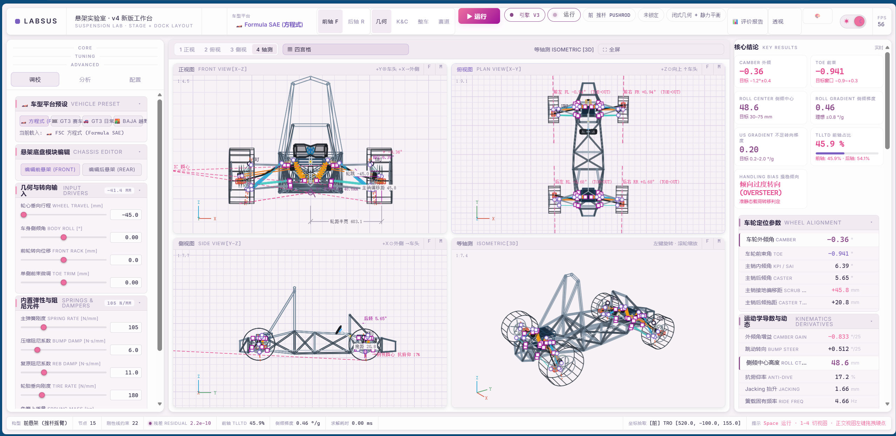
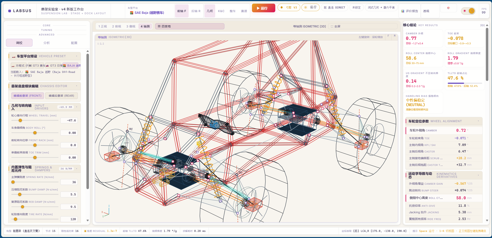
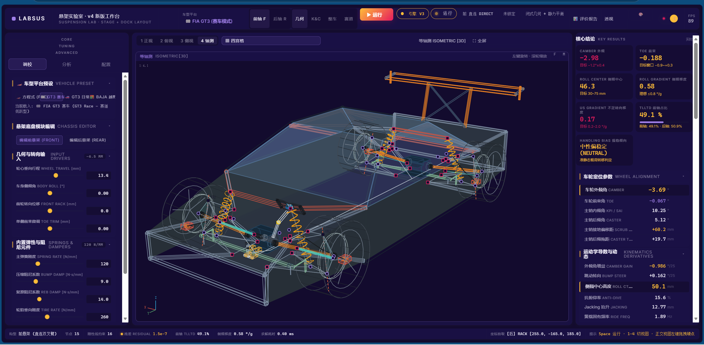
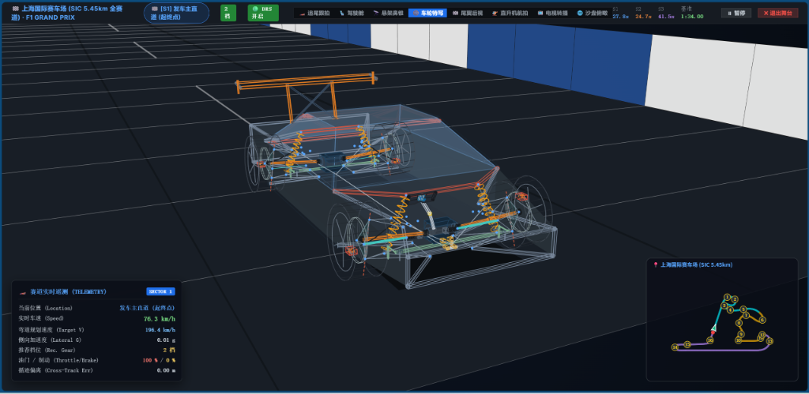

# 🏎️ LABSUS · 悬架实验室 (Suspension Lab)

**全车底盘高性能悬架分析工作台 —— Kinematics & Compliance / 15-DOF 动力学 / 准静态操稳 / 赛道瞬态仿真**

[](LICENSE)
[](https://www.python.org/)
[](https://fastapi.tiangolo.com/)
[]()
[]()

> 面向 **FSAE 方程式赛车、GT3 房车赛车及全地形越野车** 的现代化全车底盘悬架工程分析平台。
> 从双叉臂/推拉杆空间硬点编辑、多体运动学与 K&C 扫掠，到 4-Post 台架动力学、准静态载荷转移与 **15-DOF 全赛道自动驾驶瞬态仿真**，全部在一个精美现代的交互式仪器台中完成。轻量级自研实现，深度对标 OptimumKinematics 与 ADAMS/Car。
>
> 📁 **工程代码位于 [`LABSUS/`](LABSUS/) 子目录**，本文所有相对路径均以其为根。

---

## 📸 界面预览 (Screenshots)

### 1. V4 新版工作台 —— Formula SAE 方程式（浅色主题 · 四视口联动）

*正视/俯视/侧视/等轴测四视口实时联动，右侧「核心结论」实时输出 Camber/Toe/侧倾中心/侧倾梯度/US Gradient/TLLTD 与操稳偏向判定；直接拖拽 3D 空间硬点即时收敛（残差 $10^{-10}$ 量级、毫秒级求解）。*

### 2. SAE Baja 越野车 —— 直连双叉臂大行程架构（暖色主题）

*外置直立直连减振柱（DIRECT COILOVER）越野架构，$R=396\,\text{mm}$ 全地形大轮胎、$[-90, 100]\,\text{mm}$ 超长轮跳行程；推拉杆 / 直连多悬架拓扑一键切换。*

### 3. FIA GT3 赛道模式 —— 深色驾驶舱主题

*GT3 空间桁架车壳 + 副车架挂载大口径 ARB，赛道/日常双模悬架一键切换；几何 / K&C / 整车 / 赛道多页签工程工作流。*

### 4. 上海国际赛车场 (SIC) 15-DOF 实时瞬态赛道仿真舞台

*高精度 15-DOF 整车多体动力学、Pacejka 复合滑移轮胎摩擦圆、外-内-外赛车线走线与逐圈刹车点自适应试探学习、冲出罚时与圈数统计、多机位跟踪与实时工程遥测 HUD。*

---

## 🌟 核心功能特性

### 1. 底盘建模与三维可视化
- **双叉臂与推拉杆摇臂 3D 几何建模**：前后不等长双横臂（上下 A 臂）、转向节、摇臂/推杆/拉杆、弹簧减振器、半轴与 CV 防尘套、通风制动盘与卡钳、EDU 电驱总成、齿轮齿条中置转向、空间桁架管架车架（吸能防撞区 + 自适应悬架舱）。
- **四视口联动交互**：正视 (X-Z)、俯视 (X-Y)、侧视 (Y-Z)、等轴测 (3D) 实时投影，支持在视图中直接拖拽硬点微调。
- **纯悬架透视与图层过滤**：一键切换「纯悬架透视模式」，可独立隐藏/显示车架、动力总成、转向柱与制动主缸，专注悬架杆系拓扑。
- **四大车型出厂预设（多悬架拓扑架构）**：
  - 🏎️ **Formula SAE (大学生方程式赛车)**：前后推杆架构，无防倾杆极简高刚度底盘 ($f_n \approx 3.4\,\text{Hz}$)；
  - 🏎️ **FIA GT3 赛道模式 / 🚗 GT3 日常模式**：外置直立直连减振柱 (DIRECT) 双叉臂 + 副车架刚性衬套挂载大口径横向稳定杆 (ARB)；
  - 🚜 **Baja SAE (巴哈全地形越野车)**：直连大行程越野减振柱，$R=396\,\text{mm}$ 全地形轮胎、$[-90, 100]\,\text{mm}$ 超长轮跳行程。

### 2. 机构运动学与 K&C 弹性解算 (Kinematics & Compliance)
- **高精度多体闭式投影内核**：纯几何向量闭式迭代与非线性最小二乘联合收敛（残差达 $10^{-13}\,\text{mm}$ 级）。
- **全套悬架定位参数实时解算**：
  - 车轮外倾角 (Camber) & 外倾增益 (Camber Gain)；
  - 车轮前束角 (Toe) & 颠簸转向 (Bump Steer)；
  - 主销内倾角 (KPI / SAI)、主销后倾角 (Caster)、主销接地偏置距 (Scrub Radius)、主销后拖距 (Caster Trail)；
  - 瞬时中心 (IC)、侧倾中心高度 (Roll Center Height) 动态迁移轨迹；
  - 减振器运动比 (Motion Ratio)、弹簧/轮端刚度 ($K_s / K_w$)、簧载固有频率 ($f_n$)。
- **K&C 衬套弹性求解（两层架构）**：支持 6-DOF 橡胶衬套力平衡方程与机构二次重解耦合，衬套刚度可实测标定后直接回注仿真。

### 3. 准静态操稳与载荷转移 (Quasi-Static Handling)
- **TLLTD 三路径载荷转移分解**：
  - 弹性侧倾力矩分量（主弹簧 + 横向稳定杆 ARB 刚度分配）；
  - 几何侧倾中心力臂分量（侧倾中心高度与轴荷传递）；
  - 非簧载质量侧向惯性力分量。
- **准静态闭环耦合迭代**：准确计算侧倾角 ($\phi$)、整车侧倾梯度 ($d\phi/dg_y$)、四轮接地动载荷分布 ($F_z$) 与操稳偏向判定 (Understeer / Oversteer / Neutral)。
- **底盘开发核心 KPI 全覆盖**：
  - **US Gradient 不足转向梯度**（$0.2\sim2.0\,^\circ/g$）与前后轴侧偏角 $\alpha_f/\alpha_r$ 分解；
  - **Jacking 抬升量**、TLLTD 前轴占比、侧倾梯度等多 KPI 在「核心结论」卡实时呈现并附目标窗口；
  - **不足转向特性 $\delta$-$a_y$ 扫掠曲线**：轮胎项与侧倾转向分量双线分解，$0\to2g$ 均匀扫掠。

### 4. 15-DOF 全赛道瞬态动力学与 AutoPilot 巡航舞台
- **15 自由度整车多体动力学**：
  - 车身 6-DOF（纵向 $u$、侧向 $v$、垂向 $w$、侧倾 $p$、俯仰 $q$、横摆 $r$）；
  - 四轮独立垂向跳动 4-DOF 与四轮独立自转角速度 4-DOF；
  - 1000Hz 高频子步积分器，精确捕捉车身点头（Pitch）、侧倾（Roll）与轮荷动态转移。
- **Pacejka Magic Formula 复合滑移轮胎模型**：
  - 精确计算非线性纯侧滑偏角力 ($F_y$)、纯纵向滑移率驱动/制动力 ($F_x$) 以及摩擦圆复合滑移附着极限。
- **上海国际赛车场 (SIC 5.45km) 全赛道瞬态仿真**：
  - 7 点平滑窗口提取弯道曲率，60 轮收敛的正反向循迹制动/加速极限速度剖面规划；
  - **真实车手风格驾驶系统**：外-内-外赛车线走线（弯心骑路肩）、逐圈刹车点自适应试探学习、冲出弯道罚时 +5s 与纯物理砾石接管（永不瞬移重置）、圈数/冲出/罚时统计；
  - AutoPilot 自动驾驶巡航控制（曲率阿克曼前馈 + 速度自适应 Stanley 转向 + G-G 摩擦圆纵向协调），防止大马力后驱打转；
  - 6 个专业视口跟随机位（追尾跟踪、驾驶舱第一人称视角、悬架鼻锥、车轮特写、尾翼后视、直升机航拍、沙盘俯瞰）；
  - 实时遥测 HUD（当前直道/弯道、车速、侧向 G 值、推荐档位、油门/制动百分比、横摆角速度）。

### 5. 综合评价报告与工程工具
- **一键生成综合工程评价报告**：12 项核心指标按赛事基准自动给出评级徽章（S/A/B/C/D）、雷达图及调校建议。
- **工程数据持久化**：支持硬点参数本地自动暂存 (localStorage)、一键导入/导出 JSON 配置文件、出厂默认重置。
- **基线快照双线对比 (Baseline Snapshot)**：支持保存当前底盘状态为基线，在修改硬点或参数时进行实时虚线 Diff 对比。

### 6. 实测数据标定闭环 (Correlation Loop)
- **轮胎实测标定 (Tire Fit)**：导入 JSON/CSV 实测轮胎特性曲线，多层级最小二乘辨识 Pacejka 参数 ($B_y/C_y/E_y/F_{y0}/LS$)，归一化残差与分层 RMS 报告，一键应用回仿真链路；
- **K&C 台架对拍 (Rig Correlation)**：导入台架实测 CSV，与仿真轮跳曲线（Camber/Toe）叠画对比并量化重叠行程区间 RMS 偏差；
- **转向外倾增益分解**：合成曲线 = Caster 项 + KPI 项 + 几何残差定量分解（对标调校讲义 EP04×EP06 方法论）；
- **衬套刚度标定 (Bushing Calibration)**：按节点覆盖衬套平移/旋转刚度，直接驱动 K&C 力偏移 (COMPLIANCE) 工况验证。

---

## 🚀 快速开始

### 方式 A：零依赖极速启动
1. 本项目网页端为纯原生技术栈开发，**无需任何 npm 构建或环境配置**。
2. 浏览器直接打开主入口 **`LABSUS/web/dwb-pro-v4.html`**（V4 新版工作台），或模块化版 `LABSUS/web/dwb-pro-fullchassis.html` / 零依赖单文件 `LABSUS/web/dwb-pro-allinone.html`，也可通过本地 HTTP 服务器运行：
   ```bash
   python -m http.server 8000 --directory LABSUS/web
   ```
3. 浏览器访问 `http://127.0.0.1:8000/dwb-pro-v4.html` 即可开始使用。

### 方式 B：双击脚本启动（Windows 一键运行）
双击 `LABSUS/start.bat`：
- 自动拉起 Python FastAPI 计算引擎（端口 8001，已在运行则自动复用）；
- 自动启动无缓存前端服务器并打开浏览器进入工作台。

### 方式 C：启动 Python FastAPI 计算引擎（可选增强）
如果你需要运行完整的 Python 高性能数值求解后端：
```bash
# 1. 安装 Python 依赖
pip install -r LABSUS/requirements.txt

# 2. 启动 FastAPI 引擎服务
python LABSUS/engine/server.py
# 服务启动于 http://127.0.0.1:8001 (API 文档: http://127.0.0.1:8001/docs)
```

---

## 🧪 测试与质量保证

项目包含严苛的自动化测试套件（在 `LABSUS/` 目录下运行）：
```bash
cd LABSUS

# 1. Python 引擎物理断言 / 门禁 / TPHYS 双端对拍（115 项全部通过）
pytest

# 2. 前端 DOM/结构断言测试（163 项全部通过）
node web/test/test_dom.js

# 3. 舞台启动防线（40 项：模块加载顺序 / TDZ / 三舞台可启动且真的画了东西）
node web/test/stage_boot_check.js
```

---

## 📂 项目结构说明

```
LABSUS/                           # 工程代码根（下同）
├── assets/                       # 项目预览截图与工程图表资源
├── web/                          # 现代 Web 前端工程目录
│   ├── dwb-pro-v4.html           # V4 主工作台入口（主用）
│   ├── dwb-pro-fullchassis.html  # 模块化全车工作台（薄壳 + css/ + js/）
│   ├── dwb-pro-allinone.html     # 零依赖综合交付单文件
│   ├── css/
│   │   └── fullchassis.css       # 模块化现代工程仪器台 CSS 设计系统
│   ├── js/                       # 前端核心功能域模块 (按文件名序加载)
│   │   ├── 01-core.js            # 数学库 / 状态管理
│   │   ├── 02-presets.js         # 车型预设 (Formula/GT3/Baja)
│   │   ├── 03-mechanism.js       # 多体闭式几何投影内核与 K&C 扫掠
│   │   ├── 04-dynamics.js        # 准静态载荷转移与 4-Post 台架解算
│   │   ├── 05-scene3d.js         # 四视口 3D Canvas 线框渲染引擎
│   │   ├── 06-ui-panels.js       # 交互面板 / 实测数据标定
│   │   ├── 07-plots.js           # 运动学特性交互式曲线图
│   │   ├── 08-interact.js        # 持久化与视图交互
│   │   ├── 09-track.js           # TPHYS 离线物理闭包与赛道回放
│   │   ├── 10-eval.js            # 综合评价报告与赛车线路径规划
│   │   ├── 11-stages.js          # 15-DOF 爬坡/定圆/上海赛道瞬态仿真舞台
│   │   └── 12-v4-arrange.js      # V4 布局编排 / 结论卡 / 诊断建议
│   └── test/                     # 前端 DOM 与加载防线测试 (163+40 项)
├── engine/                       # Python 高性能数值计算引擎
│   ├── server.py                 # FastAPI 入口服务 (:8001)
│   ├── src/                      # 求解器核心源码 (K&C/衬套/Pacejka/轮胎标定/瞬态)
│   └── tests/                    # pytest 单元测试套件 (115 项)
├── scripts/                      # 开发与运维工具脚本
├── requirements.txt              # Python 依赖清单
├── start.bat                     # Windows 一键启动脚本
├── INTENTIONAL_DIFFERENCES.md    # 双端故意差异登记真源
├── LICENSE                       # MIT 开源许可证
└── README.md                     # 项目中文文档
```

> 注：`LICENSE` 与英文版 `README.en.md` 位于仓库根；`docs/DEVLOG.md` 为历史开发日志。

---

## 📄 开源许可证

本项目基于 [MIT License](LICENSE) 开源发布。
欢迎提交 Issue 与 Pull Request 共同完善！
